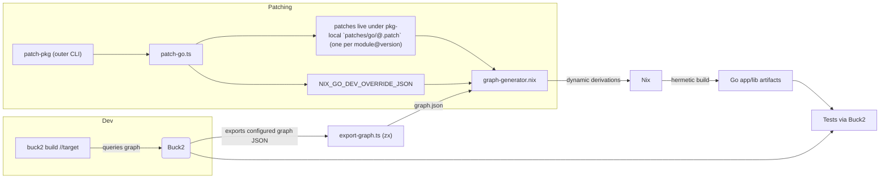
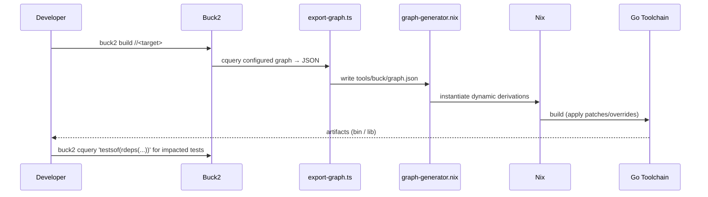

# Nix Dynamic Derivations + Buck2 + Go Patching — Implementation Guide

> **Audience:** Engineers (and future LLM agents) who will be responsible for implementing this design.  
> **Scope today:** **Go applications & libraries only.** The design deliberately remains **language-agnostic** so other languages (Rust, JVM, Python, Node, etc.) can be added without redesign.
> **Script policy:** All **substantive automation** MUST be TypeScript zx scripts using our custom hashbang `#!/usr/bin/env zx-wrapper`. Small `tools/bin/*` wrappers may exist as thin `bash` shims that only delegate into TypeScript (for example to ensure commands run inside the dev shell via `direnv exec`). Do not add new `bash/sh` scripts with substantive logic.

---

## Table of Contents

1. [What You Are Building (Conceptual Overview)](#what-youre-building-conceptual-overview)
2. [Design Principles](#design-principles)
3. [End-to-End Architecture (Mermaid)](#end-to-end-architecture)
4. [Buck2 as Orchestrator: Impact & Inputs](#buck2-as-orchestrator-impact-inputs)
5. [Nix with Dynamic Derivations](#nix-with-dynamic-derivations)
   - [graph-generator.nix](#graph-generatornix)
   - [Planner Dispatch (including optional mapping.nix)](#planner-dispatch-including-optional-mappingnix)
   - [Go Templates (goApp / goLib)](#go-templates-goapp-golib)
6. [Exporting the Buck Graph (zx)](#exporting-the-buck-graph-zx)
7. [Go Patching (outer CLI `patch-pkg` → `patch-go.ts`)](#go-patching-outer-cli-patch-pkg-patch-gots)
   - [Directly-Usable Go Patching Workflow (copied & adapted)](#go-patching-workflow)
   - [Idempotency Rules](#idempotency-rules)
   - [Warnings & CI Fail-Safes](#warnings-ci-fail-safes)
8. [Developer Workflow (Mermaid + Commands)](#developer-workflow)
9. [CI with Jenkins (Matrix across 3 Architectures)](#ci-with-jenkins)
10. [Scaffolding Requirements](#scaffolding-requirements)
11. [gomod2nix Integration (called from `tools/install-deps.ts`)](#gomod2nix-integration-called-from-toolsinstall-depsts)
12. [Future-Proofing for Other Languages](#future-proofing-for-other-languages)
13. [Appendix: Reference Snippets](#appendix-reference-snippets)

---

## What you're building (conceptual overview)

**Goal:** Combine **Buck2** (fine-grained graph, change detection, impacted tests) with **Nix** (hermetic toolchains, reproducible builds) and a **Go patching** workflow.

- Buck2 remains the **source of truth** for the dependency graph and test impact analysis.
- Each Buck target’s build is implemented **via Nix** using **dynamic derivations**.
- Patching third-party modules is **ergonomic**, **idempotent**, and **cache-friendly**.

### Why this design?

- Buck2 gives us **precise incremental builds and “what to retest”** queries.
- Nix gives us **hermeticity** and **deterministic artifacts** (toolchains, dependencies).
- The patching layer makes it safe and **repeatable** to adjust third-party code without vendoring.

---

## Design Principles

- **Authoritative exporter enabled (Go).** Labels come from authoritative `go list -deps -json -test=all`, batched by config, after codegen.
  - Go `module:*` labels are derived from the authoritative `go list` JSON per tuple batch.
  - This is an explicit contract: the exporter does not rely on process-global caches for Go labeling, and it does not use secondary fallbacks (for example parsing `go.mod`) that could hide bugs in the primary `go list` path.
- **Node (optional, experimental): PNPM-only.** Lockfile providers are **importer-scoped**; label format `lockfile:<path>#<importer>` (see “Later / Optional — Node”).

### Nix Features (enable globally)

**Tool versions (pin or newer):** Node ≥ 18.x, PNPM ≥ 8.x, Go ≥ 1.22, Buck2 ≥ 2024-xx, Nix ≥ 2.18.

Set once in **devshell** and **CI** so dynamic derivations and flakes work consistently everywhere:

```
extra-experimental-features = nix-command flakes dynamic-derivations ca-derivations recursive-nix
```

> Tip: put this in the devshell environment (e.g., `devshell.toml` or `flake`-based shell) **and** ensure CI agents export the same value. Avoid per-job drift.

### Path Invariants (must-follow)

1. All non-Nix patch artifacts live under language-specific patch directories. For Go and C++, patches are typically stored in a package-local directory (e.g., `<pkg>/patches/go` or `<pkg>/patches/cpp`) and included in that target’s `srcs` so Buck invalidates precisely. For Node, patches are importer‑local (e.g., `<importer>/patches/node`).
1. **Planner vs exporter homes.** Planner code & language templates live under `tools/nix/...`. Buck graph export tools live under `tools/buck/...`.
1. **Single outer CLI.** The only user-facing patching entrypoint is `patch-pkg`. Language-specific implementations live under `tools/patch/<lang>/` and are invoked _only_ by `patch-pkg`.
1. You may also use a repo‑level `patches/<lang>/` directory for shared or global patches, but Go/C++ builds source invalidation from package‑local patch files and do not require per‑module provider mapping.
1. **At most one patch per `module@version`** (enforced by naming convention like `<importPath encoded>@<version>.patch`); duplicates are forbidden.
1. **All automation scripts** are zx TypeScript files with `#!/usr/bin/env zx-wrapper`. The zx-wrapper is **already provided**; it enables TypeScript, `$` shelling, and common imports by default—**do not** re-implement or re-import zx in each script.
1. **Flake Integration:** You are working in a repo that already has a `flake.nix`. **Merge** new outputs/attrs with the existing flake **unless** responsibilities overlap; if they do, **this design takes precedence**.
1. **Naming:** Use **`graph-generator.nix`** for the outer dynamic-derivation planner entrypoint.
1. **Optional `tools/nix/mapping.nix`:** A small, **explicit dispatch table** for mapping **custom Buck rule types** to planner templates. Think of it as a **name-to-template router**. Keep it tiny and example-driven.
1. **Examples everywhere.** Prefer short, runnable examples over abstract prose.
1. **Dev overrides:** Always print a **warning** when dev package overrides are in effect. In CI (environment flags), builds **must fail** if dev overrides are present. **Setting `NIX_GO_DEV_OVERRIDE_JSON` changes derivation hashes; unset it before sharing cache artifacts. Never allowed in CI.** Additionally, the outer planner logs a neutral one‑liner to `build.log` when dev overrides are present locally (**Go, C++, and Python**); set `PLANNER_NO_DEV_OVERRIDE_LOG=1` to suppress this diagnostic. Clear all overrides with `node tools/dev/clear-overrides.ts`. Planner override environments are defined centrally in `tools/nix/planner/overrides.nix` (PR‑5); the planner imports this mapping to detect overrides and emit the neutral local notice generically (suppressed in CI).
1. **Patching UX:** One **outer** command: `patch-pkg <subcommand> <language> …` that **delegates** to language-specific scripts (e.g., `patch-go.ts`).
   - Echo snippet mode: pass `--echo-snippet` or set the global `PATCH_ECHO_SNIPPET=1|true` to print a standardized export snippet (stderr) instead of mutating process-local env. The message format is unified across languages and includes the reminder: “Unset before CI: unset <ENV_NAME>”.
1. **Idempotent patches:** Re-applying the **same** patch must **not** cause rebuilds.
1. **Sanitization (names/attrs):** All Starlark macros should use `//lang:sanitize.bzl:sanitize_name` for artifact and attribute names. The Nix side mirrors this transform in `tools/nix/lib/lang-helpers.nix:sanitizeName`. TypeScript tooling must not hand-roll this contract; use `tools/lib/sanitize.ts:sanitizeName` so callsites stay drift-free.
   - **Nix “target label → attr suffix” mapping**: the canonical contract lives in `tools/lib/labels.ts:sanitizeAttrNameFromLabel` and `//lang:nix_attr.bzl:sanitize_nix_attr_from_target_label`. If this mapping changes, update both and keep `tools/tests/labels/nix-attr-sanitize.parity.test.ts` passing.
1. **Global inputs policy (PR‑5):** Treat repository‑level global inputs (e.g., `flake.lock`) primarily at the builder/Nix level. Macros must not hardcode `//:flake.lock`. When a macro directly calls Nix, wire global inputs through `//lang:defs_common.bzl:wire_global_nix_inputs(...)` (implemented in `//lang:nix_calling_macros.bzl` and backed by `//lang:global_inputs.bzl:global_nix_inputs()`).
   - Node alignment (PR‑2): We stamp `global_nix_inputs()` only in Node macros that directly call Nix (`node_webapp`, `nix_node_cli_bin(bundle=True)`). Non‑Nix macros remain unstamped at the macro level.
1. **Scaffolding:** When you add new target types, **update/augment** the existing scaffolding tools in `tools/` (don’t invent new scaffolding).
1. **Platforms:** Everything must work on at least **aarch64-darwin**, **aarch64-linux**, and **x86_64-linux**.
1. **Glue scripts run outside Nix.** Generators are plain Node tools; do not wrap them in `nix run`.
1. **Planner languages vs. macro-only languages:** Go and C++ are “planner languages” (the Nix planner emits derivations for them via templates). Node is handled by Buck macros and importer‑scoped providers; it is built and tested through Nix shims. For CLI bundling, a narrowly scoped Node planner plugin (`tools/nix/planner/node.nix`) is used as a shim to invoke bundling without coupling the core planner to Node specifics. This does not change provider/auto_map flows or the Node importer‑scoped provider model.
   - Language-specific helper placement: `//lang:defs_common.bzl` is language‑agnostic. Go‑specific tuple label helpers (`normalize_build_tags`, `append_tuple_labels`) live in `//go/private:labels.bzl` and are loaded by Go macros.
   - Shared helper error text is argument‑agnostic for reuse across call‑sites. For example, `normalize_labels(...)` reports generic “labels must be a list of string labels”; macros should add parameter context at the call‑site if a named argument is relevant to users.
   - WASM stamps: use `//lang:defs_common.bzl:stamp_wasm_variant(kwargs, "<lang>", "<variant>")` to append `lang:<lang>`, `kind:wasm`, and `wasm:<variant>` uniformly across C++/Go/Python macros.
   - Note: For discoverability only, `tools/nix/lang-templates.nix` exposes a `Node` symbol bag (forwarded from `tools/nix/templates/node.nix`). The planner’s Node plugin remains authoritative; no consumers rely on this symbol bag.
   - For a concrete Node→C++ addon scaffold and artifact flow, see `node-call-cpp.md`.

- Node macros that call Nix must use the standardized helper surface in `//lang:nix_shell.bzl` for genrule-style command assembly (e.g., `node_webapp`, bundled `nix_node_cli_bin`).
  - Use `nix_calling_genrule_bootstrap(...)` to standardize `WORKSPACE_ROOT`/`REPO_ROOT`/`FLK_ROOT` derivation and optional `tools/buck/workspace-root.env` sourcing (for temp repos and sandboxed actions).
  - Use `nix_calling_genrule_nix_build_out_path_prefix(...)` (or `nix_build_out_path_cmd(...)`) for the canonical “nix build + capture out path” structure.
  - `nix_bootstrap_env_pnpm_store()` is Node-specific and opt-in (unified PNPM store setup / env exports).

- No out‑links: when assembling shell commands that invoke Nix, use `nix build --no-link --print-out-paths` and capture the last printed path (e.g., `outPath=$$($TIMEOUT nix build ... --no-link --print-out-paths | tail -n1)`). Do not use `--out-link` to avoid creating GC roots and stale symlinks. Macro callsites must assemble this through the canonical helper surface in `//lang:nix_shell.bzl` (`nix_cmd_prefix`, `nix_build_out_path_cmd`) rather than re-implementing it.
  - For Node macros, prefer the higher-level helpers (`nix_calling_genrule_bootstrap`, `nix_calling_genrule_nix_build_out_path_prefix`) so call sites don't partially apply the policy.

## End-to-End Architecture



**Key idea:** Buck2’s graph drives **what** to build/test; Nix ensures **how** it is built; patching data flows into the planner so changes are **tracked** and **reproducible**.

---

## Buck2 as Orchestrator: Impact & Inputs

- Buck2 computes a **rule key** from declared inputs: source files, attributes, deps’ outputs, toolchain config, and **any files that influence the derivation**, e.g.:
  - `go.mod`, `go.sum`, `gomod2nix.toml`
  - Go/C++: package‑local patch files (e.g., `<pkg>/patches/{go,cpp}/*.patch`) included in the target’s `srcs`
  - Node: importer‑local patch files (e.g., `<importer>/patches/node/*.patch`) included in the target’s `srcs`
- **The planner (`graph-generator.nix`) and the language templates used by it** are also considered inputs.
- If any of these change, the rule key changes → that target and its **reverse deps** are dirty → **impacted tests** are directly queryable:
  ```bash
  buck2 cquery 'testsof(rdeps(//..., //<target>))'
  ```

---

## Nix with Dynamic Derivations

### graph-generator.nix

The **outer** dynamic-derivation entrypoint. It reads the exported Buck graph (JSON) and **emits the set of inner derivations** for each configured node.

> **Merge:** Add this to your existing `flake.nix` **without** removing current outputs. If a name or responsibility overlaps (e.g., duplicate `packages.<system>.graph-generator`), **this design’s outputs take precedence**.

Note on C++ planner cohesion:

- By default, C++ construction is routed through the language registry (`LANGS.cpp`) for both kind inference and `mk*` constructors. This reduces bespoke logic in the planner and keeps behavior centralized in the C++ adapter.
- The `PLANNER_ONLY_CPP=1` fast path is retained as an optional optimization for sliced/workspace tests; it also delegates to `LANGS.cpp` so outputs remain identical.

**Sketch:**

```nix
# graph-generator.nix (outer planner)
{ pkgs, system }:
let
  lib = pkgs.lib;
  # Language templates live in a separate module to keep planner small:
  T = import ./tools/nix/lang-templates.nix { inherit pkgs; };
  nodes = builtins.fromJSON (builtins.readFile ./tools/buck/graph.json);
  get = attrs: k: attrs.${k} or null;

  # Dispatch: simple prefix + optional mapping.nix (see below)
  M = if builtins.pathExists ./tools/nix/mapping.nix
      then import ./tools/nix/mapping.nix
      else {};
  D = M.dispatch or {};

  pick = n:
    let rt = get n "rule_type"; in
        if builtins.hasAttr rt D then D.${rt}
    else if lib.hasPrefix "go_" rt then { template = "go"; kind = (if lib.hasSuffix "_binary" rt then "bin" else "lib"); }
    else null;

  # Build Go targets via language templates
  goTargets =
    lib.listToAttrs (map (n:
      let
        name = get n "name";
        kind = (pick n).kind;
        modulesToml = "./gomod2nix.toml";
        subdir = ".";
      in {
        inherit name;
        value = if kind == "bin"
          then T.goApp { inherit name modulesToml subdir; }
          else T.goLib { inherit name modulesToml subdir; };
      }
    ) (lib.filter (n: (pick n) != null ) nodes));

  all = pkgs.runCommand "graph-outputs" {} ''
    mkdir -p $out
    for p in ${lib.concatStringsSep " " (lib.attrValues goTargets)}; do
      ln -s "$p" "$out/"
    done
  '';
in
{ inherit goTargets all; }
```

> The **planner stays tiny**: it routes to templates and passes **only** the inputs needed. Adding other languages later is just “another branch like `goTargets`.”

### Planner Dispatch (Including Optional `mapping.nix`)

**What `mapping.nix` is for:** some repos define **custom Buck rule names** (e.g., `go_service`, `my_go_lib`). The optional `tools/nix/mapping.nix` is a **small registry** that tells the planner which **template** to use and any **attribute name overrides**. Think of it as a **lookup table**—not a second build system.

**Example `tools/nix/mapping.nix`:**

```nix
# Optional registry: map custom rule types → template + kind
{
  dispatch = {
    go_binary  = { template = "go"; kind = "bin"; };
    go_library = { template = "go"; kind = "lib"; };
    # Custom aliases in your repo:
    go_service = { template = "go"; kind = "bin"; };
    my_go_lib  = { template = "go"; kind = "lib"; };
  };
}
```

**Takeaway:** If you invent a new Buck rule like `go_service`, just add **one line** here to say “use the Go app template.” No other code changes are needed.

### Go Templates (`goApp` / `goLib`)

Canonical patch map helpers live in `tools/nix/lib/lang-helpers.nix`. Templates must import these rather than re‑implementing scanners:

- `patchesMapFromDir`, `patchesMapFromDirs` — path‑based scanning (Go/C++).
- `patchesMapFromDirToStore`, `patchesMapFromImporterDirToStore` — store‑materialized inputs (Python), same canonical keying (`__` ↔ `/`, case‑insensitive `importPath@version`).

Keep language logic localized and easy to read. The Go templates consume the **patch maps** and **dev override** env:

```nix
# tools/nix/lang-templates.nix  (Go excerpts)
{ pkgs }:
let
  lib = pkgs.lib;

  # Build a mapping of "module@version" -> list of patch file paths by scanning patches/go/*.patch
  patchesMapFromDir = patchDir: let
    names = if builtins.pathExists patchDir then builtins.attrNames (builtins.readDir patchDir) else [];
    isPatch = name: lib.hasSuffix ".patch" name;
    toKey = name: let
      base = lib.removeSuffix ".patch" name;
      parts = lib.splitString "@" base;
      impEnc = lib.concatStringsSep "@" (lib.take (lib.length parts - 1) parts);
      ver    = lib.last parts;
      importPath = lib.replaceStrings ["__"] ["/"] impEnc;
    in lib.toLower "${importPath}@${ver}";
    step = acc: name:
      let key = toKey name;
          val = (acc.${key} or []) ++ [ "${patchDir}/${name}" ];
      in acc // { "${key}" = val; };
  in builtins.foldl' step {} (lib.filter isPatch names);
in
{
  goApp = { name, modulesToml, devOverrideEnv ? "NIX_GO_DEV_OVERRIDE_JSON", subdir ? ".", patchDir ? ../../patches/go }:
    let
      patchesMap   = patchesMapFromDir patchDir;
      devOverrides = let v = builtins.getEnv devOverrideEnv;
                     in if v == "" then {} else builtins.fromJSON v;
      _ = if (builtins.getEnv "CI") == "true" && (builtins.getEnv devOverrideEnv) != "" then
            builtins.throw "Dev overrides are forbidden in CI"
          else null;
    in pkgs.buildGoApplication {
      pname   = "go-${name}";
      version = "0.1.0";
      src     = ./.;
      modules = modulesToml;
      subPackages = [ subdir ];
      overrides = module: old: old // {
        patches = (old.patches or []) ++ (patchesMap.${module} or []);
        src     = devOverrides.${module} or old.src;
      };
    };

  goLib = { name, modulesToml, devOverrideEnv ? "NIX_GO_DEV_OVERRIDE_JSON", subdir ? ".", patchDir ? ../../patches/go }:
    let
      patchesMap   = patchesMapFromDir patchDir;
      devOverrides = let v = builtins.getEnv devOverrideEnv;
                     in if v == "" then {} else builtins.fromJSON v;
      _ = if (builtins.getEnv "CI") == "true" && (builtins.getEnv devOverrideEnv) != "" then
            builtins.throw "Dev overrides are forbidden in CI"
          else null;
    in pkgs.buildGoApplication {
      pname   = "golib-${name}";
      version = "0.1.0";
      src     = ./.;
      modules = modulesToml;
      subPackages = [ subdir ];
      overrides = module: old: old // {
        patches = (old.patches or []) ++ (patchesMap.${module} or []);
        src     = devOverrides.${module} or old.src;
      };
    };
}
```

> **Note:** we used `buildGoApplication` for both **bin** and **lib** here for simplicity and because the override hook is clean. If you prefer `buildGoModule` for libraries, mirror the same `patches/src` logic.

---

## Exporting the Buck Graph (ZX)

> Note: during local development, you may scope exports to language-labeled targets (e.g., only `lang:go`) to keep `graph.json` small. Keep CI unscoped.

We export the **configured** Buck graph as JSON with a short zx script. This script is **not** prescriptive; place it wherever your repo expects tools to live.

```ts
#!/usr/bin/env zx-wrapper
/**
 * export-graph.ts — minimal zx exporter
 * Writes a configured graph to tools/buck/graph.json (or path via --out)
 */
// We enumerate configured targets with a shallow deps() to avoid dumping the entire graph JSON.
const query = "deps(//..., 1, exec_deps())";
const out = (argv.out as string) || "tools/buck/graph.json";

const attrs = [
  "name",
  "rule_type",
  "srcs",
  "deps",
  "labels",
  "args",
  "env",
  "main",
  "main_class",
  "includes",
  "defines",
  "cflags",
  "ldflags",
].join(" ");

const { stdout } = await $`buck2 cquery ${query} --json --output-attributes ${attrs}`;
await fs.outputFile(out, stdout);
console.log(`wrote ${out}`);
```

Inline fallback (buck2 cquery):

- For bootstrap and minimal temp workspaces, the inline exporter is encapsulated in `tools/buck/export-inline.ts`.
- `tools/patch/glue.ts` calls this module from `ensureGraph()` when forced via `EXPORTER_FORCE_INLINE=1` or as the final fallback if the Node exporter and nix-run delegation are unavailable.
- The module preserves the existing behavior and wiring (roots, optional `--target`, isolation dir, and optional target platform flag).

> Consumption note: downstream tools should not read `graph.json` directly. Use the Composite Graph API instead — library `tools/lib/graph-view.ts` or CLI `node tools/buck/graph-view.ts`. Glue emits the Node sidecar index at `tools/buck/node-lock-index.json` (via `tools/buck/gen-provider-index.ts`) and both files include `$schema` and `version` fields.

When one TypeScript tooling script needs to invoke another, do not hand-roll Node flags. Use the shared helper `tools/lib/node-run.ts:runNodeWithZx` so `zx-init` loading and Node flags stay consistent across callsites.

### Validation modes (warn vs error)

The exporter aggregates adapter findings (e.g., labeling irregularities) and applies a severity mode:

- Default: `error` — findings are printed and the exporter exits non‑zero.
- Local iteration: set `--validation=warn` or `EXPORTER_VALIDATION=warn` to print warnings and exit zero.
- CI override: if `CI=true`, severity is forced to `error` regardless of flags/env.

This preserves strictness in CI while enabling smoother local iteration.

> Importer-scoped lockfile labeling: the exporter may attach a missing `lockfile:<path>#<importer>` label deterministically for importer-scoped ecosystems (Node: nearest `pnpm-lock.yaml`, Python: nearest `uv.lock`) only when the computed importer is supported (`.`, `apps/*`, `libs/*`). If the nearest lockfile would yield an unsupported importer, the exporter must not auto-attach the label and must emit a deterministic finding with the lockfile path and importer.

---

## Go Patching (outer CLI `patch-pkg` → `patch-go.ts`)

We standardize on one **outer** CLI:

```

### C++ adapter validation (warn-only)

- The exporter’s C++ adapter performs a minimal, warn-only validation: if a node lists C++-looking sources (e.g., files ending in `.cc`, `.cpp`, `.cxx`) but lacks both a `cxx_*` rule_type and the `lang:cpp` label, the exporter prints a warning. This does not fail the export; it is advisory to help maintain consistent labeling and easier diagnostics. Keep CI behavior unchanged — warnings are informative only.
patch-pkg <subcommand> <language> [...options]
```

The outer CLI `patch-pkg` implements language/subcommand parsing and delegates to the implementation of a common TypeScript interface in language-specific files.
**Subcommands:**

- **`start <module>`**
  - Creates a temp writable workspace over the Nix store source of `<module>`:
    - **macOS:** APFS CoW clone (`cp -cR`) when available; otherwise `cp -a`.
    - **Other platforms:** `cp -a`.
  - Writes/updates the `NIX_GO_DEV_OVERRIDE_JSON` entry for `<module>`.
  - If `$PATCH_EDITOR` is set, launch it with the temp dir.

- **`reset <module>`**
  - Confirm abandonment, remove override entry, delete temp dir.

- **`apply <module>`**
  - Produce a unified diff and write to the **canonical filename** (flat dir):

  ```bash
  diff -ruN "$src" "$tmp" > patches/go/<enc_import>@<exact-module-version>.patch
  # enc_import = import path with '/' -> '__'
  # NOTE: Encoding mirrors PNPM’s patch naming (scoped '@scope__name').
  ```

  - No provider sync is required for Go. Patch files live alongside the target (e.g., `<pkg>/patches/go`) and are included in `srcs`; Buck2 invalidates precisely on patch changes.
  - Remove override & delete temp dir; next build applies the patch permanently by filename.

- **`session <module>`**
  - Starts like `start` (with Ctrl-C/Ctrl-D instructions) and remains attached:
    - **Ctrl-C:** calls `reset`
    - **Ctrl-D:** calls `apply`
    - Otherwise: if script exits unexpectedly, user must run `reset` or `apply` later.
- Delegates to language-specific scripts, e.g. `patch-go.ts` for Go.
- Outer command handles **shared logic** (idempotency checks, validation, CI guardrails).
- Language script handles **language-specific** details (e.g., module identity, diff generation).

### Go Patching Workflow

**Components**

1. **gomod2nix**

- Lock Go deps in `gomod2nix.toml`.
- Use `buildGoApplication` with `overrides` to add `patches` and `src` overrides per module (fixed-output derivations keep cache keys clean).

2. **Dynamic overrides** (patch map + JSON dev overrides)

- **Patch map** (derived from filenames in `patches/go/*.patch`): maps `module@version` → list of patch file paths (under `patches/go/…`).
  - `NIX_GO_DEV_OVERRIDE_JSON`: (ephemeral env var) maps `module@version` → absolute local path for dev override. This is handled uniformly via the canonical helper `tools/nix/lib/lang-helpers.nix` (`readDevOverrides` / `guardNoDevOverridesInCI`).

**Nix usage snippet:**

```nix
buildGoApplication {
  pname = "my-app";
  version = "…";
  modules = ./gomod2nix.toml;

  overrides = module: old: old // {
    patches = (old.patches or []) ++ (patchesMap.${module} or []);
    src     = (devOverrides.${module} or old.src);
  };
}
```

Here `patchesMap` is derived **directly from patch filenames** in `patches/go/*.patch` at evaluation time, and `devOverrides` is read from the `NIX_GO_DEV_OVERRIDE_JSON` environment variable.

3. **`patch-go.ts` (zx) language script** implements subcommands for go.

4. **`PATCH_EDITOR`**

- If set, executed with the temp dir; can be a GUI IDE or terminal editor.

**Cross-Platform Strategy**

- Temporary workspaces live under per-language prefixes in the system temp directory: `$(os.tmpdir)/bucknix-patch-<lang>/...` (e.g., `bucknix-patch-go`, `bucknix-patch-python`, `bucknix-patch-cpp`).
- macOS: APFS CoW clones (`cp -cR`) when available; fallback to `cp -a`.
- Others: `cp -a`.

**Developer Example**

```bash
# Start editing github.com/foo/bar
patch-pkg start go github.com/foo/bar

# Work in $PATCH_EDITOR or manually
# Once happy:
patch-pkg apply go github.com/foo/bar

# Or to discard:
patch-pkg reset go github.com/foo/bar
```

**Design Principles**

- **No vendoring**: keep repo clean; patches live in `patches/go/*.patch`.
- **Per-module**: patches target a single module revision (`module@version`).
- **Reproducible**: accepted patches are tracked in VCS and replayed by Nix.
- **Fast iteration**: dev overrides let you test changes without committing.
- **Cross-platform parity**: same UX on Linux/macOS.

> Update: In practice we use package‑local patch directories (e.g., `<pkg>/patches/go`) so that patch edits are first‑class inputs of the specific Buck target. This yields tighter invalidation than a single global patch directory and removes the need for Go “per‑module providers.”

_(Adapted from the internal workflow document.)_ fileciteturn5file0

### Idempotency Rules

- Re-application of the same patch should not change any files, and should not trigger a rebuild (assuming the patched version has already been built).

### Warnings & CI Fail-Safes

- The templates (Nix) use the shared helper `tools/nix/lib/lang-helpers.nix` to **emit a warning** locally whenever dev overrides are set (e.g., `NIX_GO_DEV_OVERRIDE_JSON`, `NIX_CPP_DEV_OVERRIDE_JSON`).
- In CI (e.g., `CI=true`), the shared helper **throws** to **fail the build** if dev overrides are detected.
- The outer `patch-pkg` should also print explicit warnings when in session mode.

> C++ parity: C++ templates honor `NIX_CPP_DEV_OVERRIDE_JSON` (see `tools/nix/templates/cpp-common.nix`). As with Go, you’ll see a local warning when set, and evaluation fails in CI.

### Provider index (optional, introspection)

For debugging and tooling, you can generate a cross‑language provider index mapping each provider target to its origin key:

- Generate during provider sync:

```
node tools/buck/sync-providers.ts --emit-index
```

- Or generate directly:

```
node tools/buck/gen-provider-index.ts --out third_party/providers/provider_index.bzl
```

The index contains entries like:

```
"//third_party/providers:<name>": { "kind": "go|node|cpp", "key": "module:<path>@<ver>|lockfile:<path>#<importer>|nixpkg:<attr>" }
```

This file is optional and excluded from builds; it exists for introspection and tests.

---

## Developer Workflow



**Common commands:**

```bash
# Build a Go binary target (example)
buck2 build //features/payments:service

# List impacted tests for a target
buck2 cquery 'testsof(rdeps(//..., //features/payments:service))' | xargs buck2 test

# Start a Go patch, then apply it
patch-pkg start go golang.org/x/net
# edit…
patch-pkg apply go golang.org/x/net
```

---

## Implementation Plan (bite‑sized, ordered, with verification)

> This plan is designed for a junior engineer or an LLM agent. Each step is **small**, has **clear acceptance criteria**, and includes a **verification** recipe to prevent regressions. Follow in order.

### Phase 0 — Baseline & Guardrails

- [ ] Create a working branch.
- [ ] Record current state for later comparison:
  - [ ] Save outputs of `buck2 targets //... | wc -l`, `buck2 test //... --show-output`, and average build time for a representative target (pick 2–3).
  - [ ] Confirm no `patches/**` exist yet, or list them if they do.
- Verification:
  - [ ] Running `buck2 build //...` succeeds on clean branch.
  - [ ] CI green on the branch.
- Acceptance: Baseline numbers captured in a markdown note under `docs/patching/baseline.md`.

### Phase 1 — Repo Scaffolding & Invariants

- [ ] Ensure the **path invariants** are present in the repo:
  - [ ] `patches/<lang>/` (e.g., `patches/go/`) exists; **no subdirectories** under `patches/go/`.
  - [ ] `tools/buck/` (exporter + generators) exists.
  - [ ] `tools/nix/` (language templates) exists.
- [ ] Add a simple **lint** script that warns if any subdirectory is found under `patches/go/`.
- Verification:
  - [ ] Run the lint; it emits **no warnings** on a clean repo.
- Acceptance: Lint is wired into `tools/install-deps.ts` (or a pre-commit hook).

### Phase 2 — Buck Macro Shell (Go)

#### Macro Usage Example (attrs that affect configs)

> These attributes (or your macro’s equivalents) must be forwarded by the macro because they impact the **config tuple** used by the authoritative exporter `(GOOS, GOARCH, CGO, build tags, toolchain)`.

```python
# TARGETS example
load("//go:defs.bzl", "nix_go_binary")

nix_go_binary(
    name = "payments_service",
    srcs = glob(["*.go"]),
    deps = [
        "//features/common:lib",
        "//third_party/go:std",
    ],
    # Any of the following (if your macro exposes them) affect the exporter’s batching:
    build_tags = ["s3"],         # build tag toggles code paths
    cgo_enabled = True,          # CGO enablement
    goos = "linux",              # explicit GOOS (or via platform/constraints)
    goarch = "amd64",            # explicit GOARCH (or via platform/constraints)
    # You may also use select()/constraint_values if that’s your style.
)
```

**Acceptance check:** When you change any of these attrs and re‑run the exporter, the target’s `labels` in `tools/buck/graph.json` should update accordingly (different `module:` set if imports change). Patch edits under `<pkg>/patches/go` should invalidate only the affected targets.

- [ ] Land `//go/defs.bzl` with the **generic macro** (`nix_go_binary` / `nix_go_library` / `nix_go_test`) that wraps the underlying `go_*` rules and includes package‑local patch files in `srcs` for precise invalidation.
- [ ] Convert **one small target** to the macro (leave the rest untouched).
- Verification:
  - [ ] `buck2 build` for that target succeeds and produces identical binaries compared to pre-macro (hash or size/time check).
  - [ ] No Go provider nodes are required; invalidation is driven by patch files in `srcs`.
- Acceptance: Macro merged; no behavior change for unpatched builds; patch edits precisely invalidate consumers.

### Phase 3 — Exporter (authoritative, batched `go list`)

**Replace & Pseudo-versions—labeling reference**

| `go.mod` entry                                                  | Effective module key                  | Example label                               |
| --------------------------------------------------------------- | ------------------------------------- | ------------------------------------------- |
| `replace github.com/foo/bar => ../bar`                          | `github.com/foo/bar@<pseudo or none>` | `module:github.com/foo/bar@v0.0.0-<pseudo>` |
| `replace github.com/foo/bar v1.2.3 => github.com/me/bar v1.2.4` | `github.com/me/bar@v1.2.4`            | `module:github.com/me/bar@v1.2.4`           |

- [ ] Implement `tools/buck/export-graph.ts` to run **after codegen** and emit `tools/buck/graph.json` with **authoritative** `module:<path>@<version>` labels using `go list`:
  - Batch targets by **config tuple**: `(toolchain hash, module root, GOOS, GOARCH, CGO_ENABLED, sorted build tags, GOFLAGS)`.
  - For each batch, run exactly **one**:
    ```bash
    GOOS=… GOARCH=… CGO_ENABLED=… \
    go list -deps -json -test=all <all root pkgs for targets in this batch>
    ```
  - Build a **package → module** index from the JSON (`Module.Path`, `Module.Version`, `Module.Replace`). For each target in the batch, walk reachable packages to compute the **unique set of modules** and attach `module:<path>@<version>` labels to that **target only**.
  - Cache batches by the full config tuple + `go.mod`/`go.sum` (or `gomod2nix.toml`) hashes.
- [ ] Ensure exporter runs **after codegen** (protobuf / gqlgen / oapi / ent, etc.) so generated imports are visible.
- Verification:
  - [ ] Spot-check a `go_test` that imports `github.com/stretchr/testify/require`; confirm the test target (not the binary) gets a `module:github.com/stretchr/testify@…` label.
  - [ ] Run on multiple configs (tags/platforms) and confirm labels differ appropriately.
- Acceptance: Labels are **exact per target**; changing a module used only in tests affects **test targets** only.
- [ ] Acceptance: Test-only dependencies appear **only** on their test targets.

### Phase 4 — Provider Sync (Node)

- [ ] Ensure `tools/buck/sync-providers.ts` orchestrates Node provider generation (importer‑scoped), and C++ sync is a no‑op. Go provider generation is not used.
- [ ] Ensure idempotency and sorted order for generated Node providers.
- Verification:
  - [ ] With **no pnpm lockfiles**, running the script produces a minimal output (or empties auto sections).
  - [ ] Add a dummy `apps/web/pnpm-lock.yaml` and an importer‑local patch; re‑run → a Node provider appears; running twice is a no‑op.
- Acceptance: Node provider sync merged; no manual provider edits required.

### Phase 5 — Auto Map (Node lockfile + nixpkg only)

- [ ] Ensure `tools/buck/gen-auto-map.ts` maps targets → providers using:
  - `lockfile:<path>#<importer>` → PNPM importer‑scoped providers (Node)
  - `nixpkg:<attr>` → nixpkgs providers (for CGO in Go and for C++)
- [ ] Emit `third_party/providers/auto_map.bzl` (GENERATED).
- [ ] Macros default to **AUTO** (look up providers from `MODULE_PROVIDERS`) with manual override for emergencies.
- Verification:
  - [ ] With a Node importer and a matching lockfile label, `auto_map.bzl` lists the importer provider for that target.
  - [ ] For targets labeled with `nixpkg:` entries, `auto_map.bzl` lists the corresponding nixpkg providers.
- Acceptance: Changing importer‑local patches or nixpkg inputs triggers rebuilds of only the affected targets.

### Phase 6 — Wire `patch-pkg apply`

- [ ] Go/C++: `patch-pkg apply` writes the canonical patch file under the package’s `patches/{go,cpp}` directory and clears dev overrides. No glue steps are required; Buck invalidates via `srcs`.
- [ ] Node: `patch-pkg apply` commits the pnpm patch and triggers:
  1. `node tools/buck/glue-pipeline.ts` (centralized orchestration: ensure graph → sync providers → provider index → auto_map)
- Verification:
  - [ ] Go/C++: Immediate `buck2 build` invalidates only the affected targets when patch files change.
  - [ ] Node: Provider and auto_map refresh completes; dependent targets rebuild.
- Acceptance: No manual steps required after applying a patch.

### Phase 7 — CI Stages (kept separate for caching)

- [ ] Add stages to Jenkins (exact order):
  1. **Export Graph** → writes `tools/buck/graph.json`
  2. **Sync Providers** → updates `TARGETS*.auto`
  3. **Generate auto_map** → writes `auto_map.bzl`
  4. **Build & Test** (Buck)
  5. **Stale Check** → fail if generated files are missing or out-of-date compared to regenerated artifacts (**glue files are not committed**)
- [ ] (Optional) Add cache restores keyed by inputs per stage.
- Verification:
  - [ ] Create a PR that adds a dummy patch; CI updates providers/auto_map and runs the right tests.
  - [ ] Remove the dummy patch; CI drops the provider and passes.
- Acceptance: CI reproducibly regenerates glue and enforces freshness.

### Phase 8 — Accuracy & Scale Hardening

- [ ] Performance-tune the authoritative exporter:
  - Deduplicate packages across batches; persist a local cache keyed by `(config tuple, go.mod/sum hash)`.
  - Skip unchanged batches via a content hash of the `go list` JSON.
- [ ] Add targeted scenarios for divergent **tags/platforms** and verify only those targets receive labels.
- [ ] Add resilience for replace directives and pseudo-versions.
- Verification:
  - [ ] Flip build tags/platforms on representative targets; provider mappings change accordingly; rebuild scope is minimal.
- Acceptance: Tag/platform correctness and exporter performance proven on representative samples.
- [ ] Acceptance: Replace/pseudo-version correctness verified (labels change appropriately when `replace` toggles).

### Phase 9 — Regression Tests & Monitors

- [ ] Add a small **e2e test** script that:
  1. Creates a temp patch,
  2. Runs provider sync + auto_map,
  3. Builds a known target and records the rule key,
  4. Modifies an **unrelated** patch and confirms the rule key **doesn’t** change,
  5. Modifies the **related** patch and confirms the rule key **does** change.
- [ ] Add a **lint** that warns on:
  - More than one patch for the same `language/package@version`,
  - Subdirectories under `patches/<lang>/`,
  - Missing provider entries (shouldn’t happen with generators).
- [ ] Add a **pre-commit** hook to run provider sync (fast) and fail on diffs.
- Concrete tests implemented:
  - `tools/tests/exporter/exporter.test-only-deps-only-on-tests.test.ts` — verifies test-only deps only label test targets.
  - `tools/tests/e2e-provider-wiring.ts` — ensures provider wiring maps module labels only to affected targets.
  - `tools/tests/exporter/exporter.cache-content-reuse.test.ts` — proves exporter reuses cached go-list JSON for identical batches.

- Verification:
  - [ ] All three checks green locally and in CI.
- Acceptance: Guardrails prevent regressions in invalidation & naming.

### Phase 10 — Docs & Operability

- [ ] Update `README` snippets for:
  - Creating a patch (start/apply),
  - Where patches live and naming,
  - How to add a **new** language (where to put its sync generator + provider defs),
  - CI stages and their purpose.
- [ ] Add a brief **Troubleshooting** section (e.g., “auto_map stale”, “patch didn’t rebuild expected targets”, “lockfile not labeled”).
- Verification:
  - [ ] A new teammate (or LLM) can follow the docs to create a patch and watch only the relevant targets rebuild.
- Acceptance: Onboarding validated via a short “dry run” exercise.

## CI with Jenkins

> **Additional notes:**
>
> - Add a **Codegen** stage (if applicable) **before** “Export Graph” to ensure generated Go sources exist.
> - Add a **Pre-build guard** stage right after “Generate auto_map” that fails fast if `tools/buck/graph.json` or `third_party/providers/auto_map.bzl` are missing, or if no `TARGETS*.auto` files exist when patches/lockfiles are present.
>
>   Diagnostics:
>   - Default: minimal, no noise beyond errors/warnings.
>   - Verbose (opt-in): set `PREBUILD_GUARD_VERBOSE=1` or pass `--verbose`. Shows newest inputs and oldest outputs, capped by `--verbose-limit N` (default 10). Missing outputs are also listed.
>   - JSON (opt-in): pass `--json` to emit structured diagnostics with keys `inputsNewest`, `outputsOldest`, `missingOutputs`, and `summary`.

> Provider coverage behavior: the guard prefers `third_party/providers/provider_index.json` as the primary source. When that index is absent or stale, it falls back to scanning all generated provider files matching `third_party/providers/TARGETS.*.auto` (including Python and Node) to verify the presence of expected `lf_*` provider rules. This avoids false “missing provider” reports when autos are up-to-date but the index lags.

> **Decision (glue generation):** Glue files (`tools/buck/graph.json`, `third_party/providers/TARGETS*.auto`, `third_party/providers/auto_map.bzl`) are **generated by plain Node zx scripts**, invoked directly by `patch-pkg apply` and CI **without** Nix-run wrappers, and are **not committed to VCS**.

> **Shared glue pipeline:** Orchestration is centralized in `tools/buck/glue-pipeline.ts` and is invoked by both local flows (e.g., `patch-pkg`/install) and CI stages to avoid drift. Behavior and outputs remain identical; only the callsite is unified.

> **Why separate stages (not a single `install-deps` in CI)?**
>
> - **Cacheability:** cache artifacts per stage (graph export, provider sync, auto-map) with distinct keys.
> - **Fail-fast diagnostics:** pinpoint exactly which step broke.
> - **Hermetic control:** CI runs only what’s required.

> **Suggested cache keys:**
>
> - **Export Graph:** hash of Buck config & Starlark inputs (e.g., `buck2 --version`, `.buckconfig`, `**/*.bzl`, `**/TARGETS`).
> - **Sync Providers:** hash of `patches/**` (per-language) and lockfiles (`**/pnpm-lock.yaml`).
> - **Auto Map:** hash of `tools/buck/graph.json` + generated provider files.

**Example Jenkinsfile (illustrative):**

```groovy
pipeline {
  agent none
  options { timestamps() }
  stages {
    stage('Matrix Build & Test') {
      matrix {
        axes {
          axis { name 'SYSTEM'; values 'aarch64-darwin', 'aarch64-linux', 'x86_64-linux' }
        }
        agent { label "${SYSTEM}" }
        environment { CI = "true" }
        stages {
          stage('Codegen') {
            steps { sh 'node tools/codegen.ts || true' }
          }
          stage('Export Graph') {
            steps { sh 'node tools/buck/export-graph.ts --out tools/buck/graph.json' }
          }
          stage('Sync Providers') {
            steps { sh 'node tools/buck/sync-providers.ts' }
          }
          stage('Sync Node Providers (optional)') {
            // skips automatically when no pnpm-lock.yaml
            when { expression { return sh(returnStatus: true, script: "git ls-files '**/pnpm-lock.yaml' >/dev/null 2>&1" ) == 0 } }
            // Providers-only (no graph/auto_map). Prefer the unified orchestrator.
            steps { sh 'node tools/buck/sync-providers.ts --lang node --no-glue' }
          }
          stage('Generate auto_map') {
            steps { sh 'node tools/buck/gen-auto-map.ts --graph tools/buck/graph.json --out third_party/providers/auto_map.bzl' }
          }
          stage('Pre-build guard') {
            steps { sh 'node tools/buck/prebuild-guard.ts' }
          }
          stage('Build All (graph-generator)') {
            steps { sh 'nix build .#graph-generator' }
          }
          stage('Build App Example') {
            steps { sh 'buck2 build //features/payments:service' }
          }
          stage('Impacted Tests') {
            steps {
              sh '''
                IMP=$(buck2 cquery 'testsof(rdeps(//..., //features/payments:service))')
                if [ -n "$IMP" ]; then buck2 test $IMP; fi
              '''
            }
          }
          // Stale check: rely on prebuild-guard for freshness of glue files (they are not committed)
        }
      }
    }
  }
}
```

> **Note:** Your Jenkins labels must match your builders for each architecture. If you do not have macOS agents, run the Linux-only axes initially.

---

## Scaffolding Requirements

When adding **new** Go targets (libs or apps):

- **Extend the existing scaffolding tools** in `tools/` to generate:
  - the TARGETS stub,
  - any minimal Nix/planner hints needed, and
  - create package‑local `patches/go/` directories where appropriate (empty is fine).
- Do **not** invent a new scaffolding mechanism.

---

## gomod2nix Integration (Called from `tools/install-deps.ts`)

- After **dependency changes** (e.g., `go.mod` / `go.sum` updates), you **must** regenerate `gomod2nix.toml`.
- **Do not** add a new command; this must be **invoked by the existing** `tools/install-deps.ts` script **without breaking** its current behavior.
- Example (conceptual): `nix run nixpkgs#gomod2nix -- --dir .` then stage the updated `gomod2nix.toml`.

---

#### `//third_party/providers/auto_map.bzl` (generated file)

> **Purpose:** Map targets to provider rules so that only targets that actually consume a patched module (or a lockfile provider) get invalidated.

This file is generated by `tools/buck/gen-auto-map.ts` and is loaded by your Buck macros. Do not edit by hand.

#### Generator Script `tools/buck/gen-auto-map.ts` (zx/TypeScript)

- Reads `tools/buck/graph.json` (exported Buck graph).
- Collects labels from each node and maps only:
  - `lockfile:<path>#<importer>` (Node, PNPM importer-scoped)
  - `nixpkg:<attr>` (nixpkgs providers used by Go CGO/C++)
- Emits a dict mapping **target → provider labels**. Go `module:` labels are diagnostic only and are not mapped.
- Provider-package nodes (`//third_party/providers:*`) are intentionally excluded from `MODULE_PROVIDERS` keys to avoid self-mappings and reduce noise during diagnostics. Prefer the centralized helper `tools/lib/graph-utils.ts:isProviderPackageNode(...)` rather than ad‑hoc string checks.

```ts
#!/usr/bin/env zx-wrapper
import { writeIfChanged, maybeAssumeUnchanged } from "../lib/fs-helpers";
// zx is available via shebang; we'll use `$` to interact with git when present.
import { readCompositeGraph } from "../lib/graph-view.ts";
// Provider mapping is Node lockfile + nixpkg only; Go `module:` labels are diagnostic.
import { providersForLabels } from "../lib/labels";

type Node = {
  name: string;
  rule_type?: string;
  labels?: string[];
};

function getArg(name: string, def: string): string {
  try {
    const a: any = (global as any).argv;
    if (a && typeof a[name] === "string" && a[name]) return a[name] as string;
  } catch {}
  // Fallback: parse process.argv for --name value
  const idx = process.argv.findIndex((v) => v === `--${name}`);
  if (idx >= 0 && idx + 1 < process.argv.length) return process.argv[idx + 1] as string;
  return def;
}

const graphPath = getArg("graph", "");
const outPath = getArg("out", "third_party/providers/auto_map.bzl");

async function main() {
  await maybeAssumeUnchanged(outPath);

  const { nodes } = await readCompositeGraph({ graphPath: graphPath || undefined });
  const list = nodes as unknown as Node[];
  const mapping: Record<string, string[]> = {};
  for (const n of list) {
    const provs = providersForLabels(n.labels);
    if (provs.length > 0 && n.name) mapping[n.name] = provs;
  }
  const keys = Object.keys(mapping).sort();
  const body = keys
    .map((k) => `    "${k}": [\n${mapping[k].map((p) => `        "${p}",`).join("\n")}\n    ],`)
    .join("\n\n");
  const header = `# //third_party/providers/auto_map.bzl\n# GENERATED FILE — DO NOT EDIT.\n\nMODULE_PROVIDERS = {\n`;
  const footer = `\n}\n`;
  const data = header + body + footer;
  await writeIfChanged(outPath, data);
}

main().catch((e) => {
  console.error(e);
  process.exit(1);
});
```

#### Sync Providers Generator `tools/buck/sync-providers.ts` (zx/TypeScript)

> **Purpose:** Orchestrate provider generation. Currently:
>
> - Node: generate importer‑scoped providers from discovered `pnpm-lock.yaml` files and importer‑local patches.
> - Python: generate importer‑scoped providers from discovered `uv.lock` files; activation in sparse/partial clones is lockfile‑driven (presence of `uv.lock` under `apps/*` or `libs/*` enables Python).
> - C++: sync is a no‑op (providers are curated); patches are handled via package‑local `srcs`.
> - Go: no provider generation; patches are handled via package‑local `srcs`.

```ts
#!/usr/bin/env zx-wrapper
import { syncAllProviders } from "./providers/index.ts";

// By default, generate Node providers. C++ sync is a no‑op; Go has no provider sync.
// When --lang is passed, narrow to that language.
function flagStr(name: string, def: string): string {
  const a: any = (global as any).argv || {};
  if (a && typeof a[name] === "string" && a[name]) return a[name] as string;
  const raw = process.argv;
  const idx = raw.indexOf(`--${name}`);
  if (idx >= 0 && raw[idx + 1]) return raw[idx + 1];
  return def;
}

const LANG = flagStr("lang", "node");
await syncAllProviders({ lang: LANG });
console.log("providers sync complete for", LANG);
```

**When does it run?**

- **Locally**: triggered by Node `patch-pkg apply` (after committing the pnpm patch).
- **Dev env setup**: may run from `tools/install-deps.ts` after `export-graph.ts`, before `gen-auto-map.ts`.
- **CI**: as a dedicated stage, before `Generate auto_map`.

### Shared importer utilities (Node + Python)

Use `tools/lib/importers.ts` to keep importer logic consistent:

- `findImporterLockfiles(globs: string[])` — discover PNPM (`pnpm-lock.yaml`) and uv (`uv.lock`) lockfiles.
- `computeImporterLabel(lockfilePath)` — POSIX importer string used in `lockfile:<path>#<importer>`.
- `defaultImporterPatchDir(importer, lang)` — canonical importer‑local patch directory.
- `listImporterPatches(importer, lang)` — deterministically sorted `*.patch` list.

These helpers are used by provider generators and tests to avoid path/ordering drift across ecosystems.

- Exporter adapter authoring (Node + Python): the canonical shared implementation of importer-scoped validation + nearest-lockfile attachment is `tools/buck/exporter/lang/importer-scoped-adapter.ts`. Lower-level parsing/label helpers live in `tools/buck/exporter/lang/importer-lockfile-labels.ts`.
- Starlark macro path (Node/Python): macros must enforce exactly one importer‑scoped lockfile label via `ensure_single_lockfile_label(...)` and derive the importer with `importer_from_labels(...)`. Avoid bespoke inference; this keeps error text and behavior consistent across macros.

### Provider patch inclusion semantics (Node vs Python)

Node and Python are both importer-scoped ecosystems, but their provider patch inclusion policies are intentionally different:

- **Node (PNPM)**: the importer provider includes **all importer-local patches** under `<importer>/patches/node/*.patch`, even if a patch is not referenced by the lockfile effective set.
  - Effect: adding or changing any importer-local Node patch invalidates that importer's provider, and therefore rebuilds/retests Node targets wired to that provider.
- **Python (uv)**: the importer provider includes **only patches that match the `uv.lock` effective set**.
  - Effect: adding a patch for a Python package that is not present in `uv.lock` does not affect the provider or downstream targets.

This policy is expressed explicitly in the importer provider sync driver:

- `tools/lib/provider-sync-driver.ts` uses `importerPatchInclusionPolicy: "all" | "effective-set-only"`
- `tools/buck/providers/node.ts` sets `"all"`
- `tools/buck/providers/python.ts` sets `"effective-set-only"`
- The policy is required at the driver boundary. The driver does not silently default.

This policy is locked down by tests. See:

- Node includes unused importer-local patches: `tools/tests/providers/providers.golden.node-and-python-importer-output.test.ts`
- Python filters importer-local patches by `uv.lock`: `tools/tests/providers/providers.golden.node-and-python-importer-output.test.ts` and `tools/tests/providers/sync-providers-python.idempotent.test.ts`

## Future-Proofing for Other Languages

### PNPM Importer‑scoped Providers (Node)

We scope Node to **PNPM only**, and generate **one provider per importer (workspace)** from a given `pnpm-lock.yaml`. This yields tighter invalidation: patching a package used only by `apps/web` will not rebuild providers for `services/api`.

#### Labels & Mapping

- Each Node target gets a label of the form:

  ```
  lockfile:<path/to/pnpm-lock.yaml>#<importer>
  ```

  Example: `lockfile:apps/web/pnpm-lock.yaml#apps/web`.

- `gen-auto-map.ts` maps this label to the corresponding importer‑scoped provider.

#### Provider Rule (`//third_party/providers/defs_node.bzl`)

```python
def node_importer_deps(name, lockfile, importer, patch_paths = []):
    # Metadata-only stamp (no cross-package srcs to respect Buck package boundaries)
    genrule(
        name = name,
        srcs = [],
        out = name + ".stamp",
        cmd = "echo node_importer:${importer} ${lockfile} > $OUT",
        labels = ["lang:node"],
        visibility = ["//visibility:public"],
    )
```

#### Node provider generator (canonical)

- The canonical Node provider generator lives at `tools/buck/providers/node.ts` (`syncNodeProviders(...)`).
- The canonical entrypoint is `tools/buck/sync-providers.ts` (unified orchestrator).
- The `tools/buck/sync-providers-node.ts` file is a thin wrapper kept for back‑compat; it delegates to the orchestrator (providers-only by default via `--no-glue`).
- **Synthetic lockfile providers (opt-in):** Node provider sync supports an opt-in mode that synthesizes `pnpm-lock.yaml` paths for workspace importers that have `package.json` but do not yet have a real lockfile. This is intended for early scaffolding only.
  - Default: providers are generated **only** for real `pnpm-lock.yaml` files.
  - Opt-in: set `NODE_PROVIDER_SYNTHETIC_LOCKFILES=1` to enable synthetic lockfile providers. This does **not** change the lockfile label contract for targets.
- Invoke via the orchestrator:

```bash
node tools/buck/sync-providers.ts --lang node
# or via the back-compat alias (wrapper → delegates to orchestrator)
node tools/buck/sync-providers-node.ts
```

#### Switching Back to Per‑lockfile (if needed)

- **Labels:** drop the `#<importer>` suffix (use `lockfile:<path>` only).
- **Generator:** emit exactly **one provider per lockfile** and include **all** patches referenced anywhere in that lockfile.
- **Auto-map:** treat the label string literally; no other changes needed.
- **Trade‑off:** simpler generator, but coarser invalidation (patches may rebuild all Node targets bound to that lockfile).

## Later / Optional — Node (PNPM Importer-Scoped)

> **Experimental:** Add an e2e check that the importer-scoped effective set matches `pnpm ls --json` for the importer (spot-check a few packages).

### Lockfile Ecosystems (Node, PNPM-Only, Importer‑scoped)

- [ ] Add `//third_party/providers/defs_node.bzl` with `node_importer_deps(...)` (input = **pnpm-lock.yaml** + patch files).
- [ ] Add a Node provider generator under `tools/buck/providers/node.ts` and drive it via the orchestrator `tools/buck/sync-providers.ts`.
- [ ] Extend exporter to attach **`lockfile:<path>#<importer>`** labels to Node targets.
- Verification:
  - [ ] With a Node workspace using `lodash@4.17.21`, adding `patches/node/lodash@4.17.21.patch` causes only that importer’s provider to change.
  - [ ] Targets mapped to that importer rebuild; other importers stay untouched.
- Acceptance: **Importer‑scoped invalidation** works for Node.

Note on invalidation mechanics (Node):

- Provider stamps in `third_party/providers/` intentionally avoid using importer‑local patch files as `srcs` to respect Buck package boundaries.
- Instead, Node macros include `<importer>/patches/node/*.patch` in target `srcs`, mirroring Go’s approach. Changing a patch invalidates only the importer’s Node targets.

## Appendix: Reference Snippets

### `writeIfChanged()` helper (TypeScript)

```ts
// tools/lib/fs-helpers.ts
import fs from "fs-extra";
import crypto from "node:crypto";
import path from "node:path";

export async function writeIfChanged(dst: string, data: string) {
  if (await fs.pathExists(dst)) {
    const cur = await fs.readFile(dst, "utf8");
    const a = crypto.createHash("sha256").update(cur).digest("hex");
    const b = crypto.createHash("sha256").update(data).digest("hex");
    if (a === b) {
      console.log(`no-op (already applied): ${dst}`);
      return;
    }
  }
  // Atomic write: write to a temp file in the same directory, then rename
  const dir = path.dirname(dst);
  const base = path.basename(dst);
  await fs.mkdir(dir, { recursive: true });
  const tmp = path.join(dir, `.${base}.${process.pid}.${Date.now()}.tmp`);
  await fs.writeFile(tmp, data, "utf8");
  await fs.rename(tmp, dst);
}
```

### `tools/nix/planner/lib.nix` (shared helpers)

```nix
# tools/nix/planner/lib.nix — tiny, pure utilities reused by planners
{ lib, get ? (attrs: k: attrs.${k} or null), nodes ? [], pkgPathOf ? (name: ".") }:
let
  cleanLabel = s:
    let parts = lib.splitString " (config//" s; in
      if (builtins.length parts) > 1 then (builtins.elemAt parts 0) else s;
  labelsOf = n:
    let labs = (get n "labels"); in if labs == null then [] else (if builtins.isList labs then labs else []);
  nameOf = n:
    let nm = get n "name"; in if nm == null then "" else cleanLabel nm;
  depsRaw = n:
    let ds = (get n "deps"); in if ds == null then [] else (if builtins.isList ds then ds else []);
  depsOf = n: map cleanLabel (depsRaw n);
  byName = builtins.listToAttrs (
    map (n: { name = nameOf n; value = n; }) (builtins.filter (n: (get n "name") != null && (nameOf n) != "") nodes)
  );
  srcsOf = name:
    let
      n = if builtins.hasAttr name byName then byName.${name} else null;
      s = if n == null then [] else (get n "srcs");
      list = if s == null then [] else (if builtins.isList s then s else []);
      pkg = pkgPathOf name;
      dropCell = p: if lib.hasPrefix "root//" p then lib.removePrefix "root//" p else p;
      dropPkg = p: if lib.hasPrefix (pkg + "/") p then lib.removePrefix (pkg + "/") p else p;
    in map (p: dropPkg (dropCell p)) list;
in {
  inherit get cleanLabel labelsOf nameOf depsOf srcsOf byName;
}
```

Implementation note: the TypeScript normalizers in `tools/lib/labels.ts` intentionally mirror the planner’s normalization. Specifically, `normalizeTargetLabel(...)` equals `cleanLabel(...)` followed by dropping any cell prefix (e.g., `"root//"` → `"//"`). A zx test asserts TS ↔ Nix parity on a representative matrix (cell prefixes, trailing `(config//...)` suffixes, absolute and relative forms) to prevent drift.

### `tools/lib/providers.ts` (shared naming/encoding)

```ts
// tools/lib/providers.ts — single source of truth used by generators
import crypto from "node:crypto";

export function shortHash(s: string, n = 12): string {
  return crypto.createHash("sha256").update(s).digest("hex").slice(0, n);
}

// PNPM-like encoding: '/' → '__'; preserve case.
export const encodeForPatchFilename = (s: string) => s.replace(/\//g, "__");
export const decodeFromPatchFilename = (s: string) => s.replace(/__/g, "/");

export function providerNameForModuleKey(importPath: string, version: string): string {
  const key = `${importPath}@${version}`.toLowerCase();
  const h = shortHash(key, 12);
  const tail = `${importPath.split("/").slice(-2).join("_")}__${version.replace(/[.@]/g, "_")}`;
  return `mod_${h}_${tail}`;
}

export function providerNameForImporter(lockfilePath: string, importer: string): string {
  const key = `${lockfilePath}#${importer}`;
  const h = shortHash(key, 12);
  const tail = `${importer.replace(/[^\w]+/g, "_")}__${lockfilePath.replace(/[^\w]+/g, "_")}`;
  return `lf_${h}_${tail}`;
}
```

### Go provider rule removal (PR‑3)

As of PR‑3 in `quad-alignment-6.md`, the historical `go_module_patch(...)` provider rule has been removed from the repository. Go does not use provider rules; patching is package‑local and driven by `patches/go/*.patch` included in target `srcs`.

### Provider-edge realization helper (PR‑4)

- Use `//lang:defs_common.bzl:realize_provider_edges(MODULE_PROVIDERS, name, into="deps"|"srcs", base)` to append provider edges deterministically.
  - `base` may be either:
    - a list (common): returns the merged list
    - a `kwargs` dict (optional): updates `kwargs[into]` in-place and returns the merged list
- For most macros, merge into `deps`: `deps = realize_provider_edges(MODULE_PROVIDERS, name, base = deps)`.
- For genrule-style shims that don’t accept `deps` (e.g., Node `nix_node_gen`, Go `nix_go_carchive`), merge into `srcs`: `srcs = realize_provider_edges(MODULE_PROVIDERS, name, into = "srcs", base = srcs + deps)`.
- This replaces ad‑hoc `providers_for(...) + dedupe_preserve(...)` patterns and keeps behavior stable across languages.
- **Preferred stub/shim entrypoint**: for planner-visible stubs and “providers into `srcs`” shims, prefer `//lang:defs_common.bzl:wire_planner_visible_inputs(...)` and `wire_planner_visible_stub(...)` so call sites don’t re-learn the same edge cases.

### Planner-visible stub contract (PR‑2)

Some macros must produce a **planner-visible** node without building a normal artifact (for example, C++ Emscripten `.js` + `.wasm` bundles, or other non-standard shapes). These targets still participate in invalidation and planner discovery.

- **Canonical rule**: use `//lang:planner_stub.bzl:planner_stub`. Do not introduce ad-hoc `genrule` stubs.
- **Contract**: a planner-visible stub should carry:
  - **labels**: routing labels for exporter/planner
  - **graph edges**: `deps` (and provider edges realized deterministically via `realize_provider_edges(...)` unless intentionally filtered)
  - **patch inputs**: include package-local patch files as explicit inputs when patches drive invalidation for that target
- **Pattern**: if the stub can accept `srcs`, prefer the shared wrapper `//lang:planner_stub.bzl:planner_stub_with_package_local_patches(...)` to attach patch inputs without changing the stub’s artifact shape.
- **Canonical macro-level surface (preferred)**: `//lang:defs_common.bzl:wire_planner_visible_stub(...)` composes the above patterns (optional patch inputs, optional provider-edge realization into `deps`/`srcs`, optional provider stripping from planner deps) so planner-visible call sites stay uniform.

### `//go/defs.bzl` macros (copy‑pasteable)

```starlark
# //go/defs.bzl — wrap go_* and attach providers from auto_map.bzl
# Note: Some repos don’t define the `prelude` cell alias. If so, adjust the load
# to your local alias or expose go rules via a repo-local forwarding bzl.
load("@prelude//go:def.bzl", "go_binary", "go_library", "go_test")

def _providers_for(name):
    # Mapping is generated; guard its presence via prebuild-guard in CI/local.
    # Macro-level loads cannot easily provide friendly errors without try/except.
    MODULE_PROVIDERS = {}
    load("//lang:auto_map.bzl", "MODULE_PROVIDERS")
    pkg = native.package_name()
    key = "//%s:%s" % (pkg, name)
    return MODULE_PROVIDERS.get(key, [])

def nix_go_library(name, **kwargs):
    deps = kwargs.pop("deps", [])
    deps = deps + _providers_for(name)
    go_library(name = name, deps = deps, **kwargs)

def nix_go_binary(name, **kwargs):
    deps = kwargs.pop("deps", [])
    deps = deps + _providers_for(name)
    go_binary(name = name, deps = deps, **kwargs)

def nix_go_test(name, **kwargs):
    deps = kwargs.pop("deps", [])
    deps = deps + _providers_for(name)
    go_test(name = name, deps = deps, **kwargs)
```

> Macro error UX: We intentionally rely on `tools/buck/prebuild-guard.ts` to emit actionable messages when glue is missing/stale, because Starlark macro loads cannot portably catch and reword load errors. If your repo can’t use the `@prelude` alias, set the alias in Buck config or change the `load("@prelude//go:def.bzl", ...)` to a repo-local forwarding bzl that re-exports `go_*`.

### Example TARGETS Entries (Go)

```starlark
go_library(
  name = "auth_lib",
  srcs = glob(["**/*.go"]),
  labels = ["lang:go", "kind:lib"],
)

go_binary(
  name = "auth_service",
  srcs = ["cmd/auth/main.go"],
  deps = [":auth_lib"],
  labels = ["lang:go", "kind:bin"],
)
```

### Example: Using a specific derivation for an app

```nix
# Assuming your flake exposes:
# packages.<system>.graph-generator
# and inside that, the per-target outputs in graph-generator.goTargets

# Reference a specific derivation in Nix (illustrative):
packages.x86_64-linux.graph-generator.goTargets."//features/payments:service"
```

### Declaring Buck Inputs (So Impact Works)

- Include: go.mod, go.sum, gomod2nix.toml, and all files matching patches/go/\*.patch.
- Do **not** feed the **value** of `NIX_GO_DEV_OVERRIDE_JSON` into the action key; CI must have it **unset** anyway.

---

**End of Guide.**  
This document is intended to be drop-in ready for an LLM and/or engineer to implement the system.  
Source for the Go patching workflow was incorporated from the attached reference.

## Appendix — E2E Provider‑Wiring Test (Ready‑to‑Run Template)

> Goal: verify the **wiring** guarantees that underpin rebuild invalidation — i.e., a target’s transitive deps include the **right** provider(s) and exclude the **wrong** ones. This is a robust regression test that doesn’t depend on output hashes or timing.

### Script: `tools/tests/e2e-provider-wiring.ts` (zx/TypeScript)

```ts
#!/usr/bin/env zx-wrapper
// tools/tests/e2e-provider-wiring.ts

import crypto from "crypto";

type Args = {
  target: string;
  related?: string;
  unrelated?: string;
  lockfile?: string;
  importer?: string;
};
const argv = (global as any).argv as Args;

function shortHash(s: string): string {
  return crypto.createHash("sha256").update(s).digest("hex").slice(0, 8);
}

function modProviderFromKey(key: string): string {
  const k = key.toLowerCase();
  const h = shortHash(k);
  const [imp, ver] = k.split("@");
  const tail = (imp.split("/").slice(-2).join("_") + "_" + ver.replace(/[.@]/g, "_")).toLowerCase();
  return `//third_party/providers:mod_${h}_${tail}`;
}

function lockProviderFrom(lf?: string, importer?: string): string | null {
  if (!lf || !importer) {
    return null;
  }
  const h = shortHash(`${lf}#${importer}`);
  const suffix = `${importer.replace(/[^\w]+/g, "_")}__${lf.replace(/[^\w]+/g, "_")}`.toLowerCase();
  return `//third_party/providers:lf_${h}_${suffix}`;
}

async function cqueryDeps(target: string): Promise<string[]> {
  const { stdout } = await $`buck2 cquery "deps(${target})" --json --output-attributes=name`;
  const nodes = JSON.parse(stdout) as Array<{ name: string }>;
  return nodes.map((n) => n.name);
}

function assert(cond: boolean, msg: string) {
  if (!cond) {
    console.error("ASSERTION FAILED:", msg);
    process.exit(2);
  }
}

async function main() {
  const { target, related, unrelated, lockfile, importer } = argv;
  if (!target) {
    console.error("missing --target //cell:rule");
    process.exit(1);
  }
  const deps = await cqueryDeps(target);

  if (related) {
    const p = modProviderFromKey(related);
    console.log("Expect PRESENT:", p);
    assert(deps.includes(p), `Expected provider ${p} in deps(${target}), but it was missing.`);
  }
  if (unrelated) {
    const p = modProviderFromKey(unrelated);
    console.log("Expect ABSENT:", p);
    assert(
      !deps.includes(p),
      `Expected provider ${p} to be absent in deps(${target}), but it was present.`,
    );
  }
  const lp = lockProviderFrom(lockfile, importer);
  if (lp) {
    console.log("Expect PRESENT (lockfile provider):", lp);
    assert(deps.includes(lp), `Expected provider ${lp} in deps(${target}), but it was missing.`);
  }

  console.log("OK — provider wiring looks correct for", target);
}

main().catch((e) => {
  console.error(e);
  process.exit(2);
});
```

**How to run (examples):**

```bash
# Node importer-scoped providers
node tools/tests/e2e-provider-wiring.ts \
  --target //apps/web:bundle \
  --lockfile apps/web/pnpm-lock.yaml \
  --importer apps/web
```

### Optional Extension — Build Smoke Check

If you also want a minimal build smoke test without relying on output hashes:

```bash
# Expect NO rebuild of the target when unrelated patch changes:
# (touch unrelated patch file with a harmless newline)
printf "\n# e2e noop\n" >> patches/go/github.com__sirupsen__logrus@v1.9.0.patch
node tools/buck/sync-providers.ts
buck2 build //features/payments:service  # should report cache hit / no work

# Revert patch file change afterwards
git checkout -- patches/go/github.com__sirupsen__logrus@v1.9.0.patch
```

> Note: the definitive signal is the **provider wiring** (script above). The smoke check is best‑effort; exact console output can vary with cache settings.

## Appendix — CI Guard & Codegen Stubs

### `tools/dev/startup-check.ts` (zx)

### `tools/dev/clear-overrides.ts` (zx)

```ts
#!/usr/bin/env zx-wrapper
// Unsets dev overrides and prints the current (empty) value.
if (process.env.NIX_GO_DEV_OVERRIDE_JSON && process.env.NIX_GO_DEV_OVERRIDE_JSON.trim() !== "") {
  delete process.env.NIX_GO_DEV_OVERRIDE_JSON;
}
console.log(
  "NIX_GO_DEV_OVERRIDE_JSON=",
  JSON.stringify(process.env.NIX_GO_DEV_OVERRIDE_JSON || ""),
);
```

```ts
#!/usr/bin/env zx-wrapper
// tools/dev/startup-check.ts — verifies required tools and Nix features; prints fallbacks
import fs from "fs-extra";
import semver from "semver";

async function which(cmd: string) {
  try {
    await $`which ${cmd}`;
    return true;
  } catch {
    return false;
  }
}

async function main() {
  const need = ["pnpm", "git", "go", "buck2", "nix"];
  const miss: string[] = [];
  for (const b of need) {
    if (!(await which(b))) {
      miss.push(b);
    }
  }
  if (miss.length) {
    console.error("Missing tools on PATH:", miss.join(", "));
    process.exit(1);
  }

  const pkg = await fs.readJSON("package.json");
  const req = pkg.engines?.node;
  if (req && !semver.satisfies(process.versions.node, req, { includePrerelease: true })) {
    console.error(`Node ${process.versions.node} does not satisfy engines.node=${req}`);
    process.exit(1);
  }

  try {
    const { stdout } = await $`nix show-config`;
    const need = ["dynamic-derivations", "ca-derivations", "recursive-nix"];
    const ok = need.every((k) =>
      new RegExp(`extra-experimental-features\s*=.*\b${k}\b`).test(stdout),
    );
    if (!ok) {
      console.error(
        "[startup-check] nix extra-experimental-features must include: dynamic-derivations ca-derivations recursive-nix",
      );
      process.exit(1);
    }
  } catch {
    console.error("[startup-check] cannot read nix config via `nix show-config`");
    process.exit(1);
  }

  if (process.platform === "linux") {
    if (!(await which("fuse-overlayfs"))) {
      console.info(
        "[startup-check] fuse-overlayfs not found; patch workspaces will fallback to cp -a",
      );
    }
  } else if (process.platform === "darwin") {
    console.info(
      "[startup-check] macOS will use APFS CoW (cp -cR) when available; fallback to cp -a",
    );
  }

  if ((process.env.NIX_GO_DEV_OVERRIDE_JSON || "").trim() !== "") {
    console.warn(
      "\n[OVERRIDES ACTIVE] NIX_GO_DEV_OVERRIDE_JSON is set — local derivation hashes will differ. Unset before sharing cache artifacts.\n",
    );
  }
  console.log("startup-check: OK");
}

main().catch((e) => {
  console.error(e);
  process.exit(1);
});
```

### `tools/buck/prebuild-guard.ts` (zx)

> Optional: extend this guard to **fail** if `tools/buck/graph.json` is **older** (mtime) than any `TARGETS` or `*.bzl` file, catching stale graphs early.

```ts
#!/usr/bin/env zx-wrapper
// tools/buck/prebuild-guard.ts
import fs from "fs-extra";
import { globby } from "globby";

let missing = 0;
const error = (msg: string) => {
  console.error(msg);
  missing = 1;
};

if (!fs.existsSync("tools/buck/graph.json")) {
  error("ERROR: tools/buck/graph.json missing — run export-graph stage first.");
}
if (!fs.existsSync("third_party/providers/auto_map.bzl")) {
  error("ERROR: third_party/providers/auto_map.bzl missing — run gen-auto-map stage.");
}

// If patches or lockfiles exist, ensure at least one auto provider file exists
const matches = await globby(["patches/**/*.patch", "**/pnpm-lock.yaml"], { gitignore: true });
const patchesPresent = matches.length > 0;
if (patchesPresent) {
  const exists = fs.existsSync("third_party/providers");
  const hasAuto =
    exists && fs.readdirSync("third_party/providers").some((f) => /^TARGETS.*\.auto$/.test(f));
  if (!hasAuto) {
    error("ERROR: provider files (TARGETS*.auto) missing — run sync-providers stages.");
  }
}

process.exit(missing);
```

### `tools/codegen.ts` (no-op stub; safe if you don’t generate code)

```ts
#!/usr/bin/env zx-wrapper
// tools/codegen.ts — run protobuf/gqlgen/oapi/ent, etc. If none, exit 0.
process.exit(0);
```

## Misc

```nix
# tools/nix/lang-templates.nix (Go)
{ pkgs }:
let
  lib = pkgs.lib;

  # Build {"importPath@version" = [ /abs/path.patch ... ]} from flat patches/go/*.patch filenames.
  patchesMapFromDir = patchDir: let
    names = if builtins.pathExists patchDir then builtins.attrNames (builtins.readDir patchDir) else [];
    isPatch = name: lib.hasSuffix ".patch" name;
    toKey = name: let
      base = lib.removeSuffix ".patch" name;
      parts = lib.splitString "@" base;
      impEnc = lib.concatStringsSep "@" (lib.take (lib.length parts - 1) parts);
      ver    = lib.last parts;
      importPath = lib.replaceStrings ["__"] ["/"] impEnc;
    in lib.toLower "${importPath}@${ver}";
    step = acc: name:
      let key = toKey name;
          val = (acc.${key} or []) ++ [ "${patchDir}/${name}" ];
      in acc // { "${key}" = val; };
  in builtins.foldl' step {} (lib.filter isPatch names);
in {
  goApp = { name, modulesToml, devOverrideEnv ? "NIX_GO_DEV_OVERRIDE_JSON", subdir ? ".", patchDir ? ../../patches/go }:
    let
      patchesMap   = patchesMapFromDir patchDir;
      devOverrides = let v = builtins.getEnv devOverrideEnv; in if v == "" then {} else builtins.fromJSON v;
      _ = if (builtins.getEnv "CI") == "true" && (builtins.getEnv devOverrideEnv) != "" then
            builtins.throw "Dev overrides are forbidden in CI"
          else null;
    in pkgs.buildGoApplication {
      pname   = "go-${name}";
      version = "0.1.0";
      src     = ./.;
      modules = modulesToml;
      subPackages = [ subdir ];
      overrides = module: old: old // {
        patches = (old.patches or []) ++ (patchesMap.${module} or []);
        src     = devOverrides.${module} or old.src;
      };
    };

  goLib = { name, modulesToml, devOverrideEnv ? "NIX_GO_DEV_OVERRIDE_JSON", subdir ? ".", patchDir ? ../../patches/go }:
    let
      patchesMap   = patchesMapFromDir patchDir;
      devOverrides = let v = builtins.getEnv devOverrideEnv; in if v == "" then {} else builtins.fromJSON v;
      _ = if (builtins.getEnv "CI") == "true" && (builtins.getEnv devOverrideEnv) != "" then
            builtins.throw "Dev overrides are forbidden in CI"
          else null;
    in pkgs.buildGoApplication {
      pname   = "golib-${name}";
      version = "0.1.0";
      src     = ./.;
      modules = modulesToml;
      subPackages = [ subdir ];
      overrides = module: old: old // {
        patches = (old.patches or []) ++ (patchesMap.${module} or []);
        src     = devOverrides.${module} or old.src;
      };
    };
}
```
