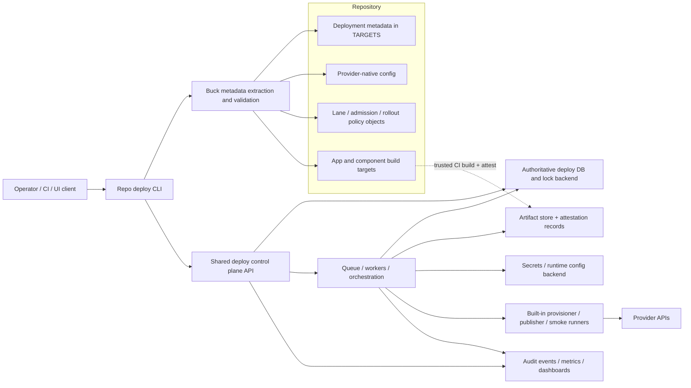
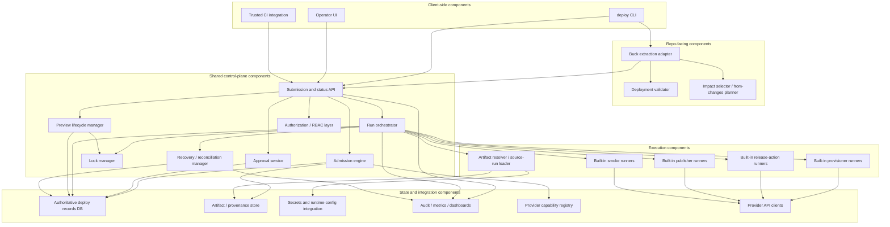
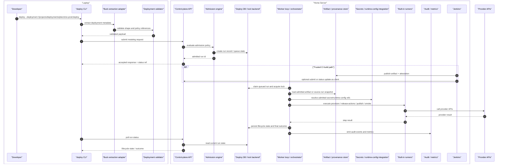
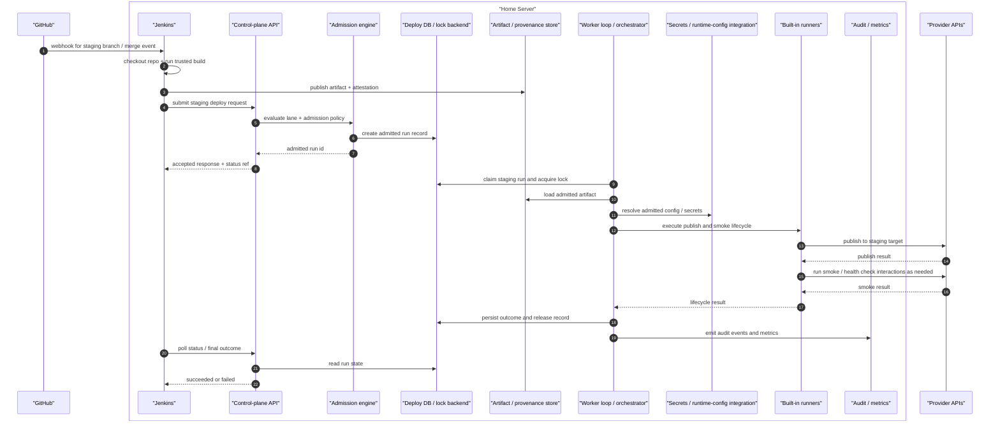
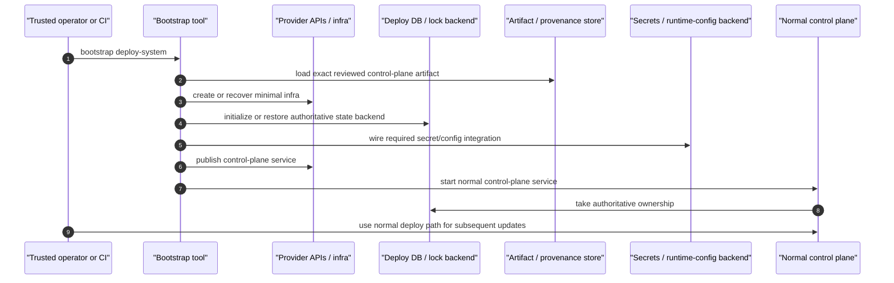

# Deployments Design

This document defines how deployments should fit into this repository.

The design goals are:

- make deployments first-class project-owned targets
- keep Buck2 authoritative for structure, dependency graph, validation, and build artifacts
- keep live deployment side effects outside Buck actions
- support one app, many apps, one provider, or many instances of the same provider
- make simple static-PWA deployment feel trivial without weakening support for more complex systems

This document defines the deployment model, not the current implementation status of every part of it.

Normative-source note:

- [Deployment Contract](/Users/kiltyj/Code/viberoots/docs/deployments-contract.md) is the fail-closed normative source for shared operator and implementation guarantees across the deployment model
- the structured provider-capability registry under `build-tools/tools/deployments/provider-capabilities/**` is the authoritative source for reviewed provider-specific support and constraints
- [Deployment Provider Capabilities](/Users/kiltyj/Code/viberoots/docs/deployment-provider-capabilities.md) is the rendered normative doc view of that reviewed registry
- this design doc explains rationale, structure, examples, and policy intent
- when this document restates a cross-cutting contract rule for readability, the contract doc remains authoritative if wording ever drifts
- when this document summarizes provider support for readability, the provider-capabilities doc remains authoritative if wording ever drifts

Companion docs:

- [Deployments Usage](/Users/kiltyj/Code/viberoots/docs/deployments-usage.md)
- [Deployment Contract](/Users/kiltyj/Code/viberoots/docs/deployments-contract.md)
- [Deployment Schema](/Users/kiltyj/Code/viberoots/docs/deployments-schema.md)
- [Deployment Provider Capabilities](/Users/kiltyj/Code/viberoots/docs/deployment-provider-capabilities.md)
- [Deployment Scenarios](/Users/kiltyj/Code/viberoots/docs/deployment-scenarios.md)
- [Deployment Implementation Plan](/Users/kiltyj/Code/viberoots/docs/deployment-plan.md)

The implementation-plan document is operational planning only. It may describe rollout order or work
breakdown, but the design, contract, schema, and provider-capabilities documents remain authoritative
for the deployment model itself.

Deployment scope:

- deployments may be single-component or multi-component
- `shared_nonprod` and `production_facing` deployments may use multi-component or advanced rollout behavior only when their provider capability entry and explicit declared `rollout_policy` support that shape
- when a deployment does not declare `rollout_policy`, the reviewed provider capability entry's explicit default rollout mode applies only for deployment shapes where omission is in policy
- protected/shared multi-component deployments should still declare `rollout_policy` explicitly even when the intended behavior matches the provider default, so ordering, failure semantics, and replay expectations remain reviewable

The key promise of this document is:

- you can tell what belongs in a deployment package
- you can tell which tool owns which part of the lifecycle
- you can model a new deployment without guessing where concepts belong
- you can understand what `deploy --deployment <label>` is expected to do end to end

This document tries to answer three different questions at once:

- what the deployment model is
- what operator-facing behavior the repo should guarantee
- what choices are still implementation details

When those three get mixed together, onboarding gets muddy. So throughout this doc:

- "contract" means behavior callers should be able to rely on
- "example" means an illustration, not a mandatory implementation detail

## Scope Of This Design

This document defines the final deployment model for this repository.

- the model supports both single-component and multi-component deployments
- a deployment is intentionally single-provider
- a deployment may contain multiple components, but they all publish within one provider family and one authoritative provider-target model
- systems that span multiple provider families must be modeled as multiple coordinated deployments rather than one cross-provider deployment object
- `lane_policy` is the authoritative lane object for protected/shared deployments
- every protected/shared lane is branch-backed, with explicit stage-to-branch mappings that govern promotion for all deployment families, including mobile/store releases
  - this is a repository policy choice for consistency and auditability, not a claim that branch-backed promotion is the only viable industry model
- implementation-planning documents may describe rollout order or work breakdown, but they do not define or narrow this design

## Design Invariants

Future edits should not weaken or silently contradict the following invariants without an explicit design decision to change the policy:

- `TARGETS` is the authoritative source of deployment metadata; provider config files are provider-native inputs, not a second source of truth for core deployment facts.
- every concrete deployment lives under `projects/deployments/<deployment-id>/` and exposes a canonical `:deploy` target.
- Buck owns deployment structure, validation, dependency graph, and build artifacts; live deployment side effects belong to the repo-level `deploy` workflow, not ordinary Buck actions.
- every deployment is single-provider by design; cross-provider systems must be represented as multiple coordinated deployments rather than one deployment with several provider families.
- every deployment must declare explicit provider-target identity in authoritative metadata; adapters must not infer the normal live target from naming convention, ambient defaults, or unchecked provider-config drift.
- one deployment id owns one normal mutable live target by default; sharing a normal live target across deployment ids is allowed only through an explicit reviewed migration or alias exception.
- preview is a publish mode, not a deployment identity and not a peer `operation_kind`; preview must publish only to an explicitly isolated preview target or be rejected.
- protected/shared mutation must go through the shared control plane; trusted CI may build, attest, and trigger submissions, but it is not a peer mutating authority. Direct local mutation of `shared_nonprod` and `production_facing` targets is out of policy except for explicitly controlled emergency procedures.
- every `shared_nonprod` and `production_facing` mutating run must freeze an immutable execution snapshot at admission before waiting, locking, or mutation; later execution revalidates only narrow current invariants instead of silently consuming drifted repo or provider config state.
- for first-run protected/shared mutation, source admission must snapshot the authoritative reviewed stage ref from the configured SCM remote into a submission-scoped ref and bind the admitted `sourceRevision` to that fetched commit rather than to an operator workstation checkout or one mutable long-lived local branch
- when a protected/shared client supplies the reviewed commit it expects, the service must compare that expectation against its freshly snapshotted reviewed ref and fail closed if they differ
- for `shared_nonprod` and `production_facing`, the mutating publish phase must consume an admitted immutable artifact; a `--source-run-id` selector may nominate the earlier admitted run that provides the artifact or promoted source revision for that operation kind, but it does not authorize workstation builds or ad hoc mutating rebuilds.
- protected/shared first-run deploys use two admission stages:
  - source admission determines the admissible revision and trusted artifact inputs
  - target-environment run admission freezes the execution snapshot for the mutating publish run against the intended deployment target
- promotion across distinct deployment ids that resolve to the same authoritative compatible `lane_policy` must follow that lane's declared `artifact_reuse_mode`; it must not retarget one deployment dynamically across environments.
- lanes with `artifact_reuse_mode = "same_artifact"` promote by reusing the same admitted artifact across environments.
- lanes with `artifact_reuse_mode = "rebuild_per_stage"` promote by advancing the same admitted source revision across environments, producing a new admitted stage-specific artifact before each protected/shared publish.
- for promotion, the lane policy and environment-branch state are authoritative for what is currently promotable; `--source-run-id` is a selector within that admitted policy boundary, not an override around it.
  - the operator may select any earlier admitted source run that is still eligible under the lane's current promotion policy
  - the system must reject source runs that are no longer promotable under current lane policy, even if they remain retained in history
- rollback is a new run classified by `operation_kind = rollback`; it should prefer redeploying a prior known-good artifact rather than rebuilding or moving environment branches backward.
  - default meaning of "known good" is: a prior run for the same deployment, against the same normal live target and `publish_mode = normal`, with `final_outcome = succeeded` and all required blocking smoke or release-health checks passed for that run
  - stricter lane-specific rollback-candidate policy, such as soak windows or manual pinning, is allowed only when declared explicitly by the authoritative lane policy rather than inferred by convention
- destructive cleanup of isolated preview targets must be a first-class audited control-plane operation rather than an implicit side effect with no lifecycle or authorization model.
- deployment records must keep `operation_kind`, `publish_mode`, lifecycle state, and final outcome as separate concepts with canonical vocabularies.
- `protection_class` is a trust-and-sensitivity tier that drives admission, smoke expectations, and execution boundary policy; it is not merely a label for whether end users directly see the target.

## Quick Reference

| Term        | Simple question                              | Meaning                                                  | Example                                      |
| ----------- | -------------------------------------------- | -------------------------------------------------------- | -------------------------------------------- |
| Deployment  | "Which release target are we talking about?" | A named deployable system or environment                 | `pleomino-prod`                              |
| Component   | "What are we shipping?"                      | A deployable project artifact referenced by a deployment | `//projects/apps/pleomino:app`               |
| Provider    | "Where does it live?"                        | The destination platform                                 | `cloudflare-pages`                           |
| Provisioner | "Who sets up the place first?"               | The infra or platform setup step                         | CDKTF creating DNS and a Pages project       |
| Publisher   | "Who releases the built artifact?"           | The artifact upload or publish step                      | `wrangler pages deploy <resolved-dist>`      |
| Smoke check | "How do we confirm it works?"                | Lightweight post-deploy validation                       | verify `/manifest.webmanifest` returns `200` |

Short version:

- deployment = the named release target
- component = the thing being shipped
- provider = where it runs or is hosted
- provisioner = who prepares the destination
- publisher = who ships the built artifact there
- smoke check = how we confirm it worked

Scope note:

- the abstract deployment model can describe multi-component systems
- protected/shared deployments may also be multi-component, but only through explicit provider capability plus explicit rollout policy rather than ad hoc adapter behavior

## Why Deployments Need Their Own Model

A deployment is not the same thing as:

- an app
- a library
- a provider account
- a single hosting product

A deployment is a named delivered system. It may represent:

- one static app
- many apps
- one app deployed many different ways
- one environment of a larger system

Examples:

- `pleomino-prod`
- `pleomino-staging`
- `pleomino-acme`
- `acme-platform-prod`

This matters because the same app may be deployed:

- to multiple provider instances
- to staging and production
- as part of a larger multi-component system

So the deployment id should be the identity of the release target, not the app target.

## Repository Layout

Deployments belong under `projects/`, not `build-tools/`, because they are project-owned deliverables.

```text
projects/
  apps/
    pleomino/
    docs-site/
  libs/
    shared-ui/
  deployments/
    pleomino-prod/
      TARGETS
      wrangler.jsonc
    pleomino-staging/
      TARGETS
      wrangler.jsonc
    acme-platform-preview/
      TARGETS
      smoke.ts
```

The deployment id is the directory name under `projects/deployments/`.
The `acme-platform-preview` example is illustrative of a local-only or isolated-preview-capable shape;
protected/shared packages should normally stay closer to declarative metadata plus provider-native config.

Recommended deployment-id style:

- short
- stable
- environment-oriented
- provider-agnostic when possible

Good examples:

- `pleomino-prod`
- `pleomino-staging`
- `shared-observability-prod`

Less good examples:

- `pleomino-wrangler-prod`
- `pleomino-cloudflare-pages-prod`

Those names leak implementation detail into the identity more than necessary.

I want each deployment package to expose a canonical `:deploy` target:

```text
//projects/deployments/pleomino-prod:deploy
```

That gives us:

- stable naming
- predictable Buck labels
- room for sibling targets later, such as `:check` or `:smoke`

### What Lives In A Deployment Package

A concrete deployment package should stay small and focused.

Typical contents:

- `TARGETS`
  - the authoritative deployment definition
- provider config files
  - for example `wrangler.jsonc`
- optional deployment-local executable files for local-only or isolated-preview-only flows
  - for example `smoke.ts`
  - these executable-hook examples are intentionally non-default and should not be read as the normal protected/shared deployment package shape

Things that should usually not live here:

- reusable repo-wide deployment logic
  - that belongs in `build-tools`
- reusable system-wide helper macros
  - that belongs under `projects/.../deploy/*.bzl`
- application source code
  - that belongs under `projects/apps/*`

Plain-language version:

- a deployment package should describe one release target, not become a mini framework

Preference rule:

- provider config should contain only provider-native settings that are not already modeled authoritatively in deployment metadata
- if a provider-native file needs values such as provider project name or environment-specific identifiers, those should ideally be generated from or injected by deployment metadata rather than hand-maintained in multiple places
- for `shared_nonprod` and `production_facing`, the preferred package shape is declarative deployment metadata plus provider-native config, not package-local executable deployment logic
- any package example that includes `deploy.ts`, `smoke.ts`, `cdktf/main.ts`, or similar executable files should be read as a non-default local-only or isolated-preview shape unless it explicitly says otherwise

Path rule:

- any file path referenced from deployment metadata should be interpreted relative to that deployment package unless explicitly documented otherwise
- for example, `wrangler.jsonc`, `smoke.ts`, and `cdktf/main.ts` all resolve from `projects/deployments/<deployment-id>/`

## One Source Of Truth

I use `TARGETS` as the authoritative deployment definition.

I do not want a parallel hand-maintained `deployment.json` by default because:

- Buck already gives us naming and dependency structure
- Buck metadata can be queried by repo tooling
- a second manifest risks drift

If we later need a provider-neutral manifest for an external consumer, we should generate it from Buck metadata rather than maintain two sources of truth.

This also means:

- helper macros may reduce repetition
- but `TARGETS` remains the source of truth even when helpers are involved

## Buck's Role

Buck should be authoritative for:

- which deployment units exist
- which project targets a deployment depends on
- validating deployment shape
- building deployment inputs
- exposing deployment metadata to repo tools

Buck should not be the main place where live release side effects happen.

I do not want standard Buck rules to directly perform:

- cloud uploads
- production publishes
- DNS mutations
- credentialed release actions

Those are orchestration concerns, not reproducible build concerns.

This is the key harmony point:

- Buck owns structure, graph, validation, and artifacts
- the deploy CLI owns side effects

For protected or shared environments, the canonical `deploy` CLI should still be the front door, but that
front door should submit or hand off mutating work to the shared control plane rather than performing
provider-side mutation directly from an arbitrary local machine.

Shared-control-plane trust boundary:

- protected or shared-environment credentials must be used only by vetted shared adapter or provisioner code running in the shared control plane
- deployment-local hooks, repo-authored per-deployment scripts, or equivalent arbitrary package-local code must not run with protected/shared credentials in the shared control plane
- deployment-local hooks may still be allowed for local workflows or explicitly isolated preview/local targets where those credentials and side effects are not shared-environment sensitive
- if an implementation needs any exception to that rule, it should require explicit sandboxing, allowlisting, and separate policy review rather than silently reusing the normal control-plane path

Protected/shared extension model:

- protected or shared-environment mutation may execute only vetted built-in adapter, provisioner, and smoke-runner code in the shared control plane
- deployment-local `deploy.ts`, deployment-local provisioner entrypoints, deployment-local smoke entrypoints, or equivalent package-local executable hooks are not part of the normal protected/shared execution model
- those deployment-local hooks remain available only for local workflows or explicitly isolated preview/local targets unless a separately reviewed sandboxed exception path is introduced
- provider adapters should reject protected/shared deployment shapes that require package-local executable logic the shared control plane is not allowed to run

Semantic contract for the canonical Buck `:deploy` target:

- the canonical Buck `:deploy` target is a declaration and metadata target, not a live mutating action
- it exists so repo tooling can discover deployments, validate structure, query metadata, and resolve artifacts
- operators should not treat `buck2 run //projects/deployments/...:deploy` as the public deployment interface
- the repo-level `deploy` CLI remains the canonical repo-facing command-line client for live mutation submission
- if an implementation uses `buck2` internally while servicing the deploy CLI, that is an implementation detail rather than a second supported workflow

## Proposed System Architecture

This is the intended steady-state architecture for protected/shared deployments. Local-only workflows may
collapse several of these boundaries onto one machine, but protected/shared mutation should preserve these
authority and trust boundaries.



Plain-language flow:

- the repo remains the source of truth for deployment metadata, policy objects, and build targets
- the deploy CLI is the front door for operators, CI, and any UI-backed workflows
- Buck extraction and validation turn repo definitions into a stable implementation-facing contract
- the shared control plane is the sole mutating authority for `shared_nonprod` and `production_facing`
- workers execute only vetted built-in provisioner, publisher, smoke, and release-action logic
- artifacts, approvals, locks, audit records, and secrets stay outside arbitrary workstation execution

## Proposed Software Components

This diagram names the main software components implied by the design so implementation planning can map
workstreams to concrete codebases or modules.



Suggested implementation grouping:

- client surfaces: CLI, UI, CI integration
- repo-facing logic: Buck extraction, validation, change selection
- control plane core: API, admission, approvals, orchestration, locking, recovery, preview lifecycle, RBAC
- execution runtime: artifact loading plus built-in provisioner, publisher, smoke, and release-action runners
- shared state and integrations: authoritative DB, artifact/provenance store, secrets integration, provider capability registry, observability

## Minimal Homelab Interaction Example

For a one-developer setup with one laptop and one low-power home server, the worker loop should normally be
part of the control-plane service or a sibling worker process on the home server, not Jenkins itself.

Jenkins can still be useful as a trusted build producer or submitter, but in this design it should remain a
client of the control-plane API on that same home server rather than the authoritative mutating worker for
protected/shared targets.



Homelab interpretation:

- the laptop is the control surface: authoring, validation, Buck extraction, and submission
- the home server is the deployment authority: API, DB, locks, worker loop, Jenkins, and provider-facing execution
- Jenkins runs on the home server in this setup, but should still sit beside the control plane as a build producer or submitter, not as the source of truth for locking, admission, or deployment records
- the worker loop can be one background process in the same application as the API at first; it does not need to be a separate distributed system

## Example: GitHub Hook Triggering Staging Release Through Jenkins

This example shows an automation-driven staging release path where GitHub triggers Jenkins on the home
server, Jenkins builds and attests the artifact, and the shared control plane remains the mutating authority.



Key point:

- GitHub triggers Jenkins
- Jenkins performs the trusted build and submits the release
- the control plane still owns admission, locking, mutation, smoke, and final deployment records

## Self-Hosting Bootstrap Possibility

This design can support the deployment system deploying or bootstrapping itself, but only through a
deliberately narrower bootstrap path rather than by pretending the not-yet-running control plane can
already act as its own normal mutating authority.

Recommended model:

- treat bootstrap as a first-class limited mode, not as the ordinary protected/shared deploy path
- use bootstrap only to create or recover the minimum dependencies the normal deployment system needs in
  order to exist and resume authoritative operation
- once those dependencies exist, hand back to the normal control-plane-managed deployment path for
  ongoing updates

What bootstrap should be allowed to create or recover:

- control-plane host or service runtime
- authoritative deploy database and lock backend
- artifact or provenance storage
- secrets or runtime-config backend integration wiring
- DNS, certificates, ingress, or service endpoint wiring needed for the control plane itself
- initial operator or service credentials required for the normal control plane to take ownership

What bootstrap should normally not do:

- act as a second long-lived deployment authority beside the normal control plane
- run arbitrary package-local hooks with protected/shared credentials
- weaken normal approval, replay, or audit guarantees for ordinary application deployments
- silently fall back from the normal path into bootstrap mode just because the control plane is unhealthy

Bootstrap policy stance:

- bootstrap is a reviewed special case closer to break-glass or disaster-recovery posture than to routine
  day-to-day deployment
- bootstrap should still prefer exact immutable artifacts, explicit target identity, bounded credentials,
  auditable operator intent, and post-bootstrap reconciliation into the authoritative deployment record
- bootstrap should remain intentionally small so the system does not gain two competing ways to mutate the
  same protected/shared environment

Bootstrap execution options that stay within this design:

- local operator bootstrap for a homelab or first install
  - a trusted operator machine may run a reviewed limited bootstrap command against a declared bootstrap
    deployment target
- trusted CI bootstrap submitter
  - CI may build and attest the control-plane artifact, while a reviewed bootstrap executor performs the
    minimal bring-up steps
- offline recovery bootstrap
  - when the normal control plane or its database is unavailable, a reviewed offline-capable bootstrap or
    recovery procedure may restore the control plane's minimum dependencies before normal operation resumes

Implemented repo surface:

- the repo-level `deploy` front door exposes bootstrap as an explicit separate path rather than a fallback from
  ordinary deploy
- bootstrap targets must opt in through reviewed deployment metadata and later reconcile their evidence back into
  the authoritative control-plane record surface

Conceptual split:

- bootstrap mode answers "how do we create or recover the deployment authority itself?"
- normal deploy mode answers "how does the authoritative deployment authority mutate reviewed targets once
  it exists?"

Illustrative flow:



Recommended repository shape for self-hosting:

- model the deployment system itself as one or more ordinary deployment ids for steady-state updates
  - for example, API, worker, and observability surfaces may each become normal deployments when that is
    operationally useful
- model bootstrap separately as one reviewed limited deployment family or executor path
  - it may reuse the same artifacts and provider adapters
  - it should not claim to be the same mutating authority as the normal control plane while the control
    plane is still being created

Minimum bootstrap constraints:

- bootstrap must target only deployment-system-owned infrastructure, not arbitrary application deployments
- bootstrap must use one explicit reviewed identity and authorization path distinct from ordinary submit,
  approve, and operate roles
- bootstrap should produce or reconcile authoritative records as soon as the normal control plane is
  available again
- bootstrap should fail closed if it cannot prove target identity, artifact identity, or ownership of the
  deployment-system resources it is mutating
- after bootstrap succeeds, routine updates to the deployment system should go back through the normal
  control plane rather than continuing to use bootstrap mode

Plain-language version:

- yes, the deployment system can bring up or recover itself
- no, it should not do that by pretending the half-booted control plane is already the normal deployment
  authority
- the right answer is a small, reviewed bootstrap path followed by ordinary control-plane-managed
  self-updates

## Contract Summary

This section is a reader-oriented summary of the fixed behavioral contract.
For exact fail-closed wording, the authoritative source remains
[Deployment Contract](/Users/kiltyj/Code/viberoots/docs/deployments-contract.md).

Some implementation details remain open, but the following behavioral contracts are fixed:

- every concrete deployment lives at `projects/deployments/<deployment-id>/`
- every concrete deployment exposes a canonical `:deploy` target
- `TARGETS` is the source of truth for deployment metadata
- Buck builds artifacts, but does not perform the live publish itself
- the repo-level `deploy` command is the canonical repo-facing command operators are expected to learn
  - the public repo-facing `deploy` interface resolves deployments from Buck-backed selectors such as `--deployment <label>`
  - versioned extracted-metadata JSON documents remain generated internal contracts for extraction, tests/tools, and control-plane handoff; they are not peer operator inputs
- the shared control-plane API is the authoritative mutating interface for `shared_nonprod` and `production_facing`
  - the repo-level `deploy` CLI and any control-plane UI are first-class clients of that API, not competing authorities
- the canonical Buck `:deploy` target is for declaration, discovery, validation, and artifact resolution
  - it is not a public live-mutation interface for operators
- file paths inside deployment metadata are relative to the deployment package by default
- deployment-local scripts are implementation hooks, not a second public workflow
- provider adapters may impose narrower rules than the generic deployment model
- deployment hooks and substantive deployment automation must follow the repo-wide script policy
  - substantive automation is zx TypeScript with `#!/usr/bin/env zx-wrapper`
  - thin `build-tools/tools/bin/*` wrappers may delegate into that TypeScript entrypoint
- each concrete deployment identifies one named live target in normal publish mode
  - promotion reuses artifact identity across deployments; it does not make one deployment dynamically become many environments
- protected or shared-environment mutating deploys must run through the shared deploy control plane
  - local workflows may validate, build, resolve, or publish only to explicitly isolated local or preview targets
- preview publication must never silently reuse the normal live target
  - preview targeting must be explicit in deployment metadata or explicit in provider-adapter policy for a safely isolated target class
- deployment metadata is authoritative for the repo deployment model
  - provider config files are provider-native inputs, not a second source of truth for core deployment facts
  - when the same conceptual value would otherwise appear in both places, generation or runtime injection is preferred over duplication
- provider-target identity is part of the required deployment contract
  - examples, extracted metadata, and deployment records should represent it consistently rather than treating it as optional shorthand
  - if an example intentionally omits it for brevity, the text should say so explicitly
- for `shared_nonprod` and `production_facing`, immutable-reuse publish paths must resolve to one authoritative admitted source run and its frozen execution snapshot
  - exact-artifact selectors are acceptable only when they deterministically map to that one admitted source run

If an implementation choice would break one of those contracts, the implementation should change rather than the operator workflow.

## Operator Quick Reference

The table below is intentionally redundant with the contract and schema companion documents.
Its job is to give operators and implementers one compact scan of the default policy shape before
they dive into the detailed rationale.

| Topic               | Default policy                                                                                                                                                                                        | Operator takeaway                                                                                             |
| ------------------- | ----------------------------------------------------------------------------------------------------------------------------------------------------------------------------------------------------- | ------------------------------------------------------------------------------------------------------------- |
| Provenance          | Build trust and deployment-run trust are separate records.                                                                                                                                            | Reusing the same artifact across environments is expected; the environment-specific run record still changes. |
| Promotion           | Promote through distinct deployment ids in the same lane according to the lane's `artifact_reuse_mode`: `same_artifact` reuses one artifact; `rebuild_per_stage` rebuilds from the promoted revision. | Reuse is the default common case; rebuild only when the lane explicitly says it must.                         |
| Rollback            | Prefer redeploying a prior known-good artifact; otherwise promote a revert commit forward.                                                                                                            | A rollback is a new run with `operation_kind = rollback`, not a special outcome code.                         |
| Locking             | Shared-environment mutation locks on `provider` plus canonical provider-target identity.                                                                                                              | One live target gets one active mutating run at a time unless there is an explicit reviewed exception.        |
| Metadata precedence | Buck deployment metadata is authoritative for repo deployment facts and provider-target identity.                                                                                                     | Provider config may add provider-native settings, but it must not silently override the deployment contract.  |
| Drift ownership     | `TARGETS` is the source of truth; checked-in provider config should be generated, injected, or validated against it.                                                                                  | If the same target identity appears in two places and disagrees, validation should fail.                      |
| Smoke               | `shared_nonprod` and `production_facing` deploys must declare smoke explicitly and treat it as blocking by default unless an explicit `smoke.exception` says otherwise.                               | A publish can succeed and the overall deploy can still fail on smoke.                                         |

## Design Decisions Locked Now

This section records the design decisions this document is intentionally optimizing around.
It is not a second normative source; exact operator and implementation guarantees still live in the
companion contract, schema, and provider-capabilities documents.

The following operating-model decisions are part of this design and should be
treated as settled policy, not open brainstorming:

- promotion should follow the lane's declared `artifact_reuse_mode`
  - the sensible default is `same_artifact`, which reuses the exact previously built artifact across environments
  - `same_artifact` is in policy only when the promoted artifact is environment-agnostic at build time; environment-specific values must be injected at deploy/runtime rather than baked into the artifact
  - `rebuild_per_stage` is an explicit lane exception mode for environments that genuinely require stage-specific build-time substitution
- promotion should move one admitted release forward across distinct deployment ids that each name one explicit live target
  - for `same_artifact`, the admitted release is one immutable artifact
  - for `rebuild_per_stage`, the admitted release is one promoted source revision that yields a distinct admitted immutable artifact per stage before publish
  - one deployment should not implicitly select among multiple shared environments at publish time
- reusable artifact attestation should be environment-agnostic
  - it should bind artifact identity to source revision plus build inputs
  - deployment-specific metadata, provider config, approvals, and publish results belong to the deployment-run record rather than the reusable artifact attestation
- promotion should use one-way fast-forward environment branches
  - this document treats branch-backed promotion as a repo-level governance standard rather than a universal requirement for all deployment systems
  - later environments advance only after required checks pass for earlier environments within the same independently promoted lane
- rollback for bad app releases should prefer redeploying a prior known-good artifact
  - default meaning of "known good" is a prior run for the same deployment, against the same normal live target and `publish_mode = normal`, with `final_outcome = succeeded` and all required blocking smoke or release-health checks passed for that run
  - that default also assumes any already-applied stateful `release_actions` remain rollback-compatible under their declared data-compatibility posture; otherwise artifact redeploy is not automatically safe
- a lane may add stricter rollback-candidate policy such as soak-time requirements or manual pinning, but that is an explicit lane policy extension rather than the default rule
  - if that is not available or not appropriate, rollback should use a new revert commit promoted forward through the same branch flow
  - moving environment branches backward should not be the normal rollback mechanism
- provider-native rollback should be treated as an emergency stabilization path, followed by control-plane and Git reconciliation
- the shared deployment control plane should use one central authoritative transactional backend
  - it should back deployment-record storage
  - it should back shared-environment deploy locking
  - it should back durable claimed-running worker ownership and takeover fencing
  - Postgres is the intended initial implementation because this design needs durable shared locks, fencing-capable coordination, and authoritative audited deploy records
  - because the shared control plane is the sole mutating authority for protected/shared environments, its own resilience is part of the deployment-system design
  - the authoritative backend and API tier should have reviewed backup, restore-test, failover, and disaster-recovery expectations rather than relying on break-glass as the routine answer to ordinary platform failure
  - the operator-facing design should define explicit control-plane recovery objectives, including target RPO and RTO, so teams know the intended availability posture of the deployment authority itself
  - the initial reviewed minimum objectives should be:

    | protection class    | target RPO | target RTO | minimum admitted-artifact retention | minimum authoritative record retention | minimum restore-test cadence |
    | ------------------- | ---------- | ---------- | ----------------------------------- | -------------------------------------- | ---------------------------- |
    | `shared_nonprod`    | `4h`       | `8h`       | `30d`                               | `180d`                                 | quarterly                    |
    | `production_facing` | `15m`      | `1h`       | `180d`                              | `365d`                                 | monthly                      |

- implementations may exceed those minimums, but must not silently operate below them without an explicit design update
- artifact garbage collection, backup policy, and disaster-recovery runbooks should all be validated against those same minimum objectives rather than being tuned independently
- for release-class admitted runs, the shared control plane is responsible for preserving the exact reusable artifact and any required immutable dependency closure in the authoritative artifact/provenance store for at least the applicable retention window
  - upstream caches may be used as acquisition sources when first materializing that artifact or closure, but they are not the retention authority for promotion, retry, rollback, or historical rebuild guarantees
  - implementations must surface preservation or retrieval failure explicitly rather than silently rebuilding a lookalike artifact and treating it as the originally admitted release

- shared-environment locking should use an explicit lock scope
  - the default lock scope should be derived from `provider` plus a normalized canonical provider-target identity
  - explicit overrides are special-case escape hatches and must validate as at least as strict as the derived scope
  - one active mutating run should run per lock scope
- different lock scopes may run in parallel
- rollback, retry, and redeploy actions should take the same lock as the normal deploy path
- preview should share the main deployment lock by default
- preview runs may use separate lock scope only when they meet a stronger independent-execution isolation bar
  - preview-safe isolation is the minimum bar to allow preview at all: preview must not mutate the normal live target
  - independent-execution isolation is the stronger bar required for a separate lock scope: the preview's mutable target identity, publish path, smoke target, and cleanup path are all independently isolated from the normal path
- the shared lock implementation must provide lease expiry plus stale-holder protection such as fencing or an equivalent safety mechanism
- deployments may declare explicit prerequisites on other deployment ids
  - prerequisite modes should be narrow by default: `ordering_only` or `health_gated`
  - prerequisites should remain same-lane in the base model
  - cross-lane prerequisites are rejected rather than carried as partially specified exceptions
  - prerequisite graphs must be DAGs
  - admission, orchestration, and changed-based selection should consume the same declared direct-edge prerequisite metadata
- protected/shared promotion compatibility should use one explicit closed compatibility contract per lane
  - the contract should state which fields must match exactly and which environment-specific differences are allowed
  - adapters must not decide promotability from ad hoc heuristics, naming guesses, or undocumented field comparisons
- deploy records should include first-class lineage identifiers
  - every run gets a globally unique `deploy_run_id`
  - retries, rollbacks, and promotions should set `parent_run_id`
  - runs that belong to the same promoted release lineage across environments should carry a `release_lineage_id`, whether or not the artifact is rebuilt per stage
  - promotions of the same built artifact across environments should also carry an `artifact_lineage_id`
- each component kind should resolve to a canonical provider-neutral data shape with required fields and artifact identity
  - publishers consume that resolved data shape and must not rediscover artifact semantics ad hoc from build outputs
- for any provider that is in policy for protected/shared provisioner-managed mutation, the authoritative provider capability entry should also declare:
  - whether deployment-owned provisioners are supported for that provider family
  - which built-in provisioner types are allowed
  - the minimum reviewed plan/diff contract for infra-affecting mutation on that provider
  - whether routine mutation may proceed when no meaningful plan/diff artifact can be produced, and if so under what higher-bar approval posture
- service-like, SSR, and other non-trivial deployments may declare explicit built-in `release_actions` around publish
  - those actions should cover controlled release-time work such as schema migrations, cache warmups, or post-publish verification jobs when the deployment contract needs them
  - for `shared_nonprod` and `production_facing`, `release_actions` must come from a vetted built-in registry rather than package-local executable hooks
  - any side-effecting built-in `release_action` must declare one reviewed duplicate-execution safety contract for every replay context it supports
    - acceptable models are provider-native idempotency, control-plane deduplication, or explicit fail-closed refusal to rerun when duplicate safety cannot be proven
    - retries, worker restarts, ambiguous outcomes, and replay must not be allowed to execute the same side effect twice by accident and still count as policy-compliant
  - the authoritative provider capability entry should also declare whether protected/shared built-in `release_actions` are supported for that provider family and, when they are, which reviewed built-in action types are allowed or required to be rejected
- each deployment should declare explicit provider-target identity in deployment metadata
  - adapters must not infer the live target from directory names, branch names, CLI defaults, or unchecked provider config drift
  - one deployment id should own one normal mutable live target by default
  - two deployment ids must not share the same normal mutable live target except through an explicit reviewed migration or alias exception
- protected or shared-environment `--publish-only` must identify the exact artifact being published
  - it must not mean "publish whatever was most recently built on this machine"
  - rebuilding during `--publish-only` is out of policy
  - `rebuild_per_stage` promotion is therefore not a `--publish-only` flow; it is a distinct promotion path that must build and admit the target-stage artifact before publish
- deploy records should distinguish operation kind from final outcome
  - operation kinds should use one canonical enum: `deploy`, `retry`, `promotion`, `rollback`, `preview_cleanup`
  - preview should be modeled through `publish_mode`, not as a peer `operation_kind`
  - success or failure outcome must remain separate from the kind of run being performed
- deploy records should use separate canonical vocabularies for final outcomes and lifecycle states
  - terminal final outcomes: `validation_failed`, `build_failed`, `resolve_failed`, `provision_failed`, `release_action_failed`, `publish_failed`, `smoke_failed_after_publish`, `succeeded`
  - lifecycle states: `pending_approval`, `queued`, `waiting_for_lock`, `running`, `cancelling`, `finished`, `cancelled`
- deploy records should also use one canonical vocabulary for non-canonical termination reasons
  - `termination_reason`: `cancelled`, `superseded`, `no_longer_admitted`, `lock_timeout`, or `null` when the run reaches a canonical terminal outcome
- cancellation should be a first-class reviewed operator action with deterministic semantics
  - a cancel request may be accepted only while the run is in `pending_approval`, `queued`, `waiting_for_lock`, `running`, or `cancelling`
  - cancellation is always best-effort; it is not a guarantee that provider-side mutation can be interrupted safely once execution has entered a mutating step
  - if cancellation is accepted before any provider-side mutation or side-effecting `release_action` begins, the run should terminate without mutating the target and record `termination_reason = cancelled`
  - if cancellation is accepted after mutation may have begun, the run must transition to `cancelling`, stop scheduling any new optional later lifecycle steps, and reconcile provider state before choosing its terminal record
  - a run in `cancelling` must not return to `queued` or silently resume ordinary forward progress as if no cancellation request occurred
  - after reconciliation, the run should settle to exactly one of:
    - `cancelled` with `termination_reason = cancelled` when reconciliation proves no protected/shared mutation occurred
    - `finished` with a canonical terminal `final_outcome` when mutation completed or partially completed and the system can determine the correct resulting state
    - `finished` with the appropriate failure outcome when reconciliation proves the run failed during or after mutation
  - operator-facing clients should present cancellation after mutation start as "request stop and reconcile" rather than as an immediate destructive interrupt
- deploy records should capture where a lifecycle failure happened without exploding the terminal outcome enum
  - failures after `resolve` should record the failed step explicitly, including `release_actions.pre_publish`, `publish`, `release_actions.post_publish_pre_smoke`, `smoke`, or `release_actions.post_smoke`
- `preview_cleanup` records should preserve preview context explicitly
  - record `publish_mode = preview`
  - record the isolated preview target identity
  - record a cleanup reason such as TTL expiry, PR close, manual cleanup, or superseding preview
- automatic retry policy should be conservative and step-specific
  - `validate`, `build`, and `resolve` should not auto-retry
  - `provision` should not auto-retry by default; explicit operator rerun is preferred
  - `publish` may auto-retry for clearly transient failures, up to 2 retries with backoff
  - `smoke` may auto-retry for transient readiness/network failures, up to 3 retries within an overall timeout budget
- secrets should use `secretspec` as the repo-level contract layer and Vault as the initial production backend
- protected or shared-environment deploys should be admitted only by the shared control plane
  - direct local mutating deploys to those environments are out of policy except for explicitly controlled emergency procedures
  - the CI system is intentionally not part of the authoritative mutating deployment model
  - Jenkins, GitHub Actions, or another CI system may build, attest, and trigger submissions as long as the shared control plane remains the sole authority for admission, lock acquisition, mutation orchestration, smoke execution, and deploy records
  - a repo may use more than one CI system at once for different lanes or repo slices, provided they do not become competing sources of truth for deployment metadata, admission decisions, or deployment history
- break-glass emergency procedures should be explicitly bounded
  - only named emergency roles may invoke them
  - they should still prefer exact admitted-artifact reuse over rebuild
  - any exceptional rebuild path should require a separately documented higher-bar approval
  - the design must support an incident-bounded emergency path even when the normal shared control plane or one of its core dependencies is unavailable
  - that emergency path may bypass the normal online control-plane workflow only through an explicitly documented offline-capable break-glass procedure with separate credentials, explicit fencing or equivalent concurrency protection, and mandatory post-incident reconciliation
  - they must record the requesting identity, the executing identity, reason, affected target, approval source, artifact-selection path, and reconciliation owner
  - they must be incident-bounded rather than a standing alternate workflow
  - they must require post-incident reconciliation back to the normal branch, admission, and deployment path
- local-only fallback should be explicitly limited
  - shared environments must use the central authoritative shared control plane
  - personal local/dev workflows may use a local filesystem lock plus a local structured deployment record
  - local-only fallback records are non-authoritative and must not be used for shared environments
- protected/shared smoke checks should be required and blocking by default
  - canonical URL by default
  - deployment-specific preview URL only when explicitly configured
  - timeout and retry policy should be explicit, not implicit
  - a protected/shared deployment may omit or downgrade smoke only through an explicit documented exception
- `lane_policy` should be the authoritative lane identity and policy object for protected/shared deployments
- protected/shared control-plane permissions should follow one explicit minimum role model
  - separate normal submit, approve, operate, and break-glass powers rather than leaving privileged actions to adapter-local convention
  - when a deployment requires human approval, self-approval is out of policy by default; the same principal must not satisfy both submitter and approver roles unless an explicit break-glass procedure says otherwise
  - the minimum authorization scope model should be hierarchical and explicit:
    - repo-wide administrative scope for platform ownership tasks
    - lane scope for policy administration and operational access across one release lane
    - deployment scope for day-to-day submit, approve, and operate permissions on one concrete deployment id
    - incident-bounded break-glass scope for named emergency roles
  - permission evaluation should be least-privilege and resource-scoped by default
    - a deployment-scoped grant applies only to that deployment id
    - a lane-scoped grant may cover deployments in that lane unless a stricter deployment-level policy narrows it
    - repo-wide administrative scope is for platform stewardship and policy management, not the default way ordinary release operators gain mutation rights
  - the CLI, control-plane API, and any UI must all authorize against the same scope model and action vocabulary so operators do not encounter channel-specific privilege differences
- provisioners should be non-destructive by default during normal deploy flows
  - delete or replace behavior that can remove owned live resources should require an explicit separate operator path or equivalent break-glass intent
  - for `shared_nonprod` and `production_facing`, infra-affecting provisioners should expose a reviewable plan or diff surface before mutation whenever they may change provider-managed state
    - that plan surface may be provider-native or provider-neutral, but it should make intended creates, updates, replacements, and deletes understandable to operators and approvers
    - approval evidence for infra-affecting runs should be able to point at that reviewed plan or diff artifact
    - if a provisioner cannot produce a meaningful plan or diff, that limitation should be explicit in policy review and the mutating path should default to a higher-bar approval posture rather than silently proceeding as routine automation
- `--provision-only` should not build or publish
  - the simple default is `metadata_only`
  - a reviewed provisioner may use `immutable_resolved_inputs`, but it must not trigger a rebuild or depend on mutable local build state
  - for `shared_nonprod` and `production_facing`, every mutating `--provision-only` run must still bind to one admitted source revision and one frozen execution snapshot
  - for `shared_nonprod` and `production_facing`, a reviewed `immutable_resolved_inputs` path should require an explicit admitted source-run selector; for `metadata_only`, the control plane may derive the admitted source revision from the current lane/admission state for that run, but it must still freeze and record that revision explicitly before mutation
- `protection_class` should use a closed enum: `local_only`, `shared_nonprod`, `production_facing`

These decisions are now reflected in the detailed design sections below. The remaining work is to
turn them into implementation-grade detail and execution plans without changing the policy
direction.

Defaulting philosophy:

- the common case should stay straightforward
- safe defaults should carry as much of the operational burden as possible
- the design should require extra metadata only when a deployment shape introduces extra risk, ambiguity, or coordination cost
- local-only and single-component flows should remain easy to declare and reason about
- protected/shared, multi-component, cross-lane, or exception-path flows should be explicit rather than relying on clever inference

Common-case summary:

- a simple local-only deployment should usually need only:
  - `provider`
  - `provider_target`
  - one component
  - one publisher
  - plus the schema-required outer fields that usually stay at safe defaults:
    - `protection_class = "local_only"`
    - `secret_requirements = {}`
    - `runtime_config_requirements = {}`
- add a `provisioner` only when the destination really needs setup owned by the deployment
- add `preview` only when preview is intentionally supported
- add `rollout_policy` whenever the deployment is multi-component or otherwise needs explicit staged behavior
- for protected/shared deployments, the common single-component path should still stay compact:
  - `lane_policy`
  - `environment_stage`
  - `admission_policy`
  - `protection_class`
  - one built-in publisher
  - explicit `smoke`
  - explicit `secret_requirements` even when empty
  - explicit `runtime_config_requirements` even when empty
- for `shared_nonprod` and `production_facing`, `lane_policy` should be explicit deployment metadata rather than an implicit repo-default derivation

Artifact portability rule:

- `same_artifact` means the exact immutable artifact built for an admitted source revision is expected to be deployable in every stage of that lane without rebuilding
- a lane must not declare `same_artifact` when stage-specific build-time substitution changes the emitted artifact, such as embedding different API origins, secrets, account ids, or feature wiring per stage
- stage-specific values that differ across environments should instead come from deploy-time or runtime configuration resolved through authoritative deployment metadata, provider-native config, or approved secret/config backends
- if a deployment family genuinely requires stage-specific build outputs, the lane should declare `artifact_reuse_mode = "rebuild_per_stage"` explicitly rather than relying on convention or hoping the artifacts are "close enough"
- repo validation and design review should treat accidental stage-specific build inputs in a `same_artifact` lane as a policy violation, because that would make promotion semantics misleading even if the publish step still technically succeeds

## Repo-Level Deploy Command

I want one canonical deploy entrypoint for everything under `projects/deployments/`.

Examples:

```bash
deploy --deployment //projects/deployments/pleomino-prod:deploy
deploy --deployment //projects/deployments/pleomino-prod:deploy --preview --source-run-id <deploy-run-id>
deploy --deployment //projects/deployments/pleomino-dev:deploy --preview --preview-branch <branch-name>
deploy --deployment //projects/deployments/pleomino-dev:deploy --preview --preview-commit <commit-sha>
deploy --deployment //projects/deployments/pleomino-prod:deploy --validate-only
deploy --deployment //projects/deployments/pleomino-prod:deploy --provision-only
deploy --deployment //projects/deployments/pleomino-prod:deploy --publish-only --source-run-id <deploy-run-id>
deploy --deployment //projects/deployments/pleomino-prod:deploy --publish-only --source-run-id <deploy-run-id> --rollback
deploy --deployment //projects/deployments/pleomino-dev:deploy --preview-cleanup --preview-branch <branch-name>
deploy --deployment //projects/deployments/pleomino-dev:deploy --preview-cleanup --preview-commit <commit-sha>
deploy --from-changes
deploy --list
```

For `shared_nonprod` and `production_facing`, those CLI examples describe authenticated submission to the shared control plane, not local mutation on the caller's workstation or a peer CI mutation endpoint.

Entry-point clarification for protected/shared mutation:

- the shared control-plane API is the authoritative mutating interface
- the repo-level `deploy` CLI is the canonical repo-facing command-line client for that API
- a control-plane UI may also submit the same class of requests for operator usability
- those are first-class clients of one mutating authority, not separate deployment systems
- Buck labels and `buck2 run` are still not operator-facing mutation interfaces

Suggested layout:

```text
build-tools/tools/deployments/deploy.ts
build-tools/tools/deployments/provider-capabilities/
build-tools/tools/deployments/cloudflare-pages-*.ts
build-tools/tools/deployments/kubernetes-*.ts
build-tools/tools/deployments/nixos-shared-host-*.ts
build-tools/tools/deployments/s3-static-*.ts
build-tools/tools/bin/deploy
projects/deployments/*/TARGETS
```

Code-location map:

```mermaid
flowchart TB
    ROOT["viberoots repo"]

    subgraph CLI["CLI and repo-facing front door"]
        BIN["build-tools/tools/bin/deploy<br/>thin executable wrapper"]
        FRONT["build-tools/tools/deployments/deploy.ts<br/>operator CLI entrypoint"]
        SHARED["build-tools/tools/deployments/*<br/>versioned payloads, shared types, common helpers"]
    end

    subgraph REPOL["Repo-facing logic"]
        EXTRACT["build-tools/tools/deployments/extract.*<br/>Buck extraction adapter"]
        VALIDATE["build-tools/tools/deployments/validate.*<br/>deployment validation"]
        SELECT["build-tools/tools/deployments/deployment-from-changes-*<br/>impact selection / --from-changes"]
    end

    subgraph CPLANE["Shared control-plane service"]
        API["build-tools/tools/deployments/nixos-shared-host-control-plane-server.ts<br/>submission + status API"]
        ADMIT["build-tools/tools/deployments/*control-plane-admission*<br/>lane + admission evaluation"]
        APPROVAL["build-tools/tools/deployments/*control-plane-run-action*<br/>approval binding + reuse logic"]
        ORCH["build-tools/tools/deployments/nixos-shared-host-control-plane-worker*.ts<br/>run orchestration"]
        LOCK["build-tools/tools/deployments/*control-plane-backend-locks*<br/>lock and fencing logic"]
        PREVIEW["build-tools/tools/deployments/*preview-control-plane*<br/>preview lifecycle + cleanup"]
        RECOVER["build-tools/tools/deployments/*control-plane-recovery*<br/>in-doubt reconciliation"]
        AUTHZ["build-tools/tools/deployments/deployment-control-plane-authz.ts<br/>scoped authz / RBAC"]
        OBS["build-tools/tools/deployments/deployment-control-plane-observability.ts<br/>audit events, metrics, dashboards"]
    end

    subgraph RUNNERS["Built-in execution adapters"]
        PROVIDERS["build-tools/tools/deployments/*provider*<br/>publisher, smoke, provider API adapters"]
        PROVISIONERS["build-tools/tools/deployments/*provision*<br/>built-in provisioner runners"]
        ACTIONS["build-tools/tools/deployments/*release-action*<br/>built-in release-action runners"]
    end

    subgraph POLICY["Repo-owned policy objects"]
        LANES["projects/deployments/*:lane<br/>lane_policy definitions"]
        POLICIES["projects/deployments/*:*_release<br/>admission_policy definitions"]
    end

    ROOT --> BIN --> FRONT
    ROOT --> SHARED
    FRONT --> EXTRACT
    FRONT --> VALIDATE
    FRONT --> SELECT
    FRONT --> API
    API --> ADMIT
    API --> APPROVAL
    API --> ORCH
    API --> AUTHZ
    API --> PREVIEW
    API --> OBS
    ORCH --> LOCK
    ORCH --> RECOVER
    ORCH --> PROVIDERS
    ORCH --> PROVISIONERS
    ORCH --> ACTIONS
    ADMIT --> LANES
    ADMIT --> POLICIES
    EXTRACT --> LANES
    EXTRACT --> POLICIES
    SHARED --> API
    SHARED --> FRONT
    SHARED --> PROVIDERS
    SHARED --> PROVISIONERS
    SHARED --> ACTIONS
```



How to read this map:

- `build-tools/tools/bin/deploy` stays as the thin user-facing executable
- `build-tools/tools/deployments/` is the main implementation root for CLI, extraction, validation, shared contracts, and control-plane code
- the current reviewed `nixos-shared-host` control-plane service entrypoint is `build-tools/tools/deployments/nixos-shared-host-control-plane-service.ts`
- the current reviewed `nixos-shared-host` worker-loop entrypoint is `build-tools/tools/deployments/nixos-shared-host-control-plane-worker.ts`
- the current reviewed `nixos-shared-host` authoritative backend is Postgres, configured for the service and worker via `--control-plane-database-url` / `VBR_DEPLOY_CONTROL_PLANE_DATABASE_URL`
- control-plane status/result reads and canonical protected/shared deploy records come from that backend, keyed by `deploy_run_id` and submission identity
- reviewed control-plane status/result inspection should resolve by backend-native identifiers through the service surfaces such as `GET /api/v1/status` and `GET /api/v1/records`
- routine JSON submissions/snapshots under `<records-root>/control-plane/` and protected/shared deploy-record files under `<records-root>/runs/` are no longer the normal operator-readable authority path
- isolated fixture tests and explicitly local harnesses may use an explicit `pgmem://...` backend URL, but that harness is not the reviewed operator backend
- provider, provisioner, and release-action modules still hold only vetted built-in execution adapters
- repo-owned `deployment_lane_policy(...)` and `deployment_admission_policy(...)` rules remain Buck-visible policy-definition objects, typically in shared deployment packages such as `//projects/deployments/pleomino-shared:lane`
- exact filenames may evolve, but these directory boundaries should remain stable so the implementation matches the design's trust and ownership model

CLI/front-door responsibilities:

1. resolve `--deployment <label>` to a Buck deployment target
2. query Buck for deployment metadata
3. validate provider and component rules
4. for `local_only`, build referenced Buck targets and resolve concrete output paths directly
5. for `shared_nonprod` and `production_facing`, act only as a thin authenticated submitter to the shared control-plane API for a mutating request that must resolve to an admitted immutable artifact or source run

Protected/shared submission contract:

- submission to the shared control-plane API must be idempotent at the request layer, not only at the provider publish layer
- every mutating protected/shared submit request should carry one client-generated stable idempotency key or submission id that survives client retries, network timeouts, process restarts, and CI reruns for the same intended request
- the idempotency key should bind to the exact normalized submit payload after operator-intent normalization, including:
  - deployment id
  - requested `operation_kind`
  - requested `publish_mode`
  - exact immutable selector set such as `source_run_id`
  - normalized preview identity selector when preview is involved
  - caller identity or authenticated submitter context when that context changes authorization semantics
- if the control plane receives the same idempotency key with the same normalized payload again, it should return the original submission result rather than creating a second queued run
- if the control plane receives the same idempotency key with materially different payload contents, it must reject the request clearly rather than guessing which intent the client meant
- this submission-layer idempotency is required even for run kinds that are intentionally not auto-superseded in the queue, such as `retry`, `rollback`, `preview_cleanup`, and `--provision-only`
- provider-side idempotency keys, request-correlation ids, and publish-step deduplication remain necessary but are not sufficient substitutes for submit-layer idempotency
- local-only workflows may implement lighter local request correlation, but protected/shared mutation must treat submit idempotency as part of the control-plane contract
- first-class operator actions that continue an existing run, such as progressive-rollout `resume`, must use the same reviewed idempotent submit contract rather than an ad hoc side channel
  - for `resume`, the normalized payload should bind at least:
    - target `deploy_run_id`
    - caller identity or auth context
    - any phase-specific approval evidence or selector required to continue from the paused state
  - a repeated `resume` submission for the same paused run and same normalized payload should resolve idempotently to the same continuation result rather than creating duplicate continuation work

Protected/shared submit-response contract:

- the shared control-plane submit API should return one stable reviewed response shape rather than leaving clients to infer outcomes from transport-level behavior
- a successful accepted response should include at least:
  - `deploy_run_id`
  - whether the request created a new run or resolved to an existing run through idempotent deduplication
  - the initial lifecycle state such as `pending_approval`, `queued`, `waiting_for_lock`, or `running`
  - a stable status/read-model reference the CLI or UI can poll
- a rejected response should include one machine-readable closed reason code plus enough structured context for operator tooling to explain the failure without string parsing
- the exact transport and HTTP status mapping can be implementation-specific, but the response payload contract should not be
- when a request is valid and authorized to request deployment, but human approval is still outstanding, the canonical behavior should be to create a run in `pending_approval` rather than reject submission
- approval-granting should then advance that same run into the next admissible lifecycle state rather than creating a second run
- that pending response should already expose the stable `deploy_run_id` and a reviewed approval summary for the frozen payload being held
- the reviewed `approve` run action should bind at least the operator's expected payload fingerprint and reviewed provisioner-plan fingerprint when infra-affecting mutation is in scope
- the status/read model should expose machine-readable approval states such as `pending`, `granted`, and `no_longer_valid` without relying on free-form text parsing
- duplicate submit handling should therefore distinguish at least:
  - accepted as a new run
  - accepted as a duplicate of an existing run submission
  - rejected because the idempotency key was reused for a different payload
  - rejected because the request is unauthorized, invalid, or no longer admissible
- Vercel, Kubernetes, and S3 static protected/shared provider submissions use
  the same submit-layer idempotency engine as shared-host submissions. Their
  idempotency key is derived from the normalized provider payload fingerprint,
  not from a synthetic submission id.
- The normalized provider payload fingerprint binds operation kind, deployment
  id and label, provider target identity, lock scope, admitted artifact identity
  or component artifact identities, source-run or replay selector fields,
  expected source revision, preview-cleanup source fields, and smoke connection
  overrides. It deliberately excludes transport-only fields such as
  `submissionId` and `submittedAt` so client retries collapse onto the already
  admitted submission with dedupe mode `duplicate`.
- the stable rejection taxonomy should cover common operator-actionable classes such as:
  - invalid request shape or mutually incompatible flags
  - invalid or incompatible source-run selector
  - unauthorized or insufficient role
  - no longer admitted under current lane or admission policy
  - preview unsupported or preview isolation cannot be proven
  - promotion incompatible with the target deployment's closed compatibility contract
  - resume requested for a run that is not paused or not resumable
  - resume blocked because required later-phase approval is still missing or no longer valid
- operator-facing clients should surface those codes directly instead of reverse-engineering free-form error text
- the same reviewed response and rejection contract should be used by the CLI, any control-plane UI, and CI-triggering clients so they do not drift into subtly different operator semantics

Control-plane worker responsibilities for protected/shared mutation:

1. resolve source admission for the requested protected/shared operation
   - for first-run deploy, source admission determines the admissible revision and trusted artifact path
   - it must fetch the reviewed stage ref from the configured SCM remote into a submission-scoped snapshot ref so concurrent submissions do not overwrite one another's admission subject
   - the fetched commit becomes the authoritative admitted `sourceRevision` for submit-time checks, stored provenance, replay, and any later promotion flow that depends on that run's admitted source
   - for immutable-reuse flows, source admission validates the selected prior admitted run and its replay eligibility
2. resolve target-environment run admission and freeze one immutable execution snapshot for that mutating run before any waiting or mutation begins
   - the snapshot should preserve the deployment metadata, immutable provider-config content or immutable provider-config references, resolved policy contents, selected artifact inputs when applicable, runner implementation identities for the built-in publisher, provisioner, smoke runner, and any built-in `release_actions` runner that materially influence execution, and any other non-secret execution inputs needed to replay the admitted decision faithfully
   - Vercel, Kubernetes, and S3 static provider submissions use the shared
     admission evaluator at queue time and persist that policy evaluation in
     the frozen worker snapshot alongside admitted artifact references or
     admitted source-run replay selectors
   - protected/shared provider snapshots must not persist laptop-local
     `artifactDir` paths as execution inputs; workers load admitted artifact
     references from the frozen snapshot
   - when first-run source admission used a reviewed-ref snapshot, the frozen target-environment snapshot should preserve that submission-scoped snapshot reference so later revalidation continues to check the same reviewed source rather than silently following a newer branch head
   - for secret or runtime-config dependencies, the snapshot should preserve non-secret contract references, versions, selectors, or fingerprints rather than secret values
   - replay-sensitive secret or runtime-config references must resolve exactly to the admitted reference set for the run kind being executed; implementations must not silently substitute "latest", auto-rotated, or ambient defaults during retry or rollback
3. when the run includes an infra-affecting protected/shared provisioner, generate the reviewable provisioner plan or diff from that frozen execution snapshot before any mutating step begins
   - the reviewed plan or diff must correspond to the same frozen execution snapshot that later drives mutation
   - when human approval is required for that infra-affecting path, the approval evidence should bind to that specific reviewed plan or diff artifact rather than to an unfrozen future recomputation
   - if the plan or diff must be regenerated later and no longer matches the reviewed artifact materially, the run must fail closed or require fresh approval rather than silently proceeding
4. revalidate admission, lane, prerequisite, target-ownership policy, and reviewed-plan binding before mutation
5. acquire the shared lock
6. revalidate under the acquired lock that the run is still admitted, not superseded, and still bound to the intended target
   - this revalidation should check only narrow current invariants such as target ownership, lock scope, approval freshness, prerequisite health, and whether the admitted run has been superseded
   - it must not silently replace the frozen execution snapshot with newer repo metadata, newer provider config contents, or different resolved policy objects
7. load the execution inputs required for this run kind
   - for a first-run protected/shared publish, load the admitted frozen execution snapshot for that run
   - for `retry`, `rollback`, or any provisioner using `immutable_resolved_inputs`, load the admitted immutable artifact plus the recorded source-run snapshot metadata needed for replay
   - for `promotion`, load the admitted immutable artifact and any source-run compatibility evidence needed for promotion validation, but mutate using the target deployment's own admitted execution snapshot and current target-environment policy context
   - for `metadata_only` provision-only runs, load the frozen metadata, admitted source revision, and admitted secret/runtime-config contract references captured for that run, but no artifact
8. record lifecycle progress in the authoritative deployment record
9. run optional provisioning
10. run optional `release_actions` declared for the `pre_publish` phase
11. run publishing
12. run optional `release_actions` declared for the `post_publish_pre_smoke` phase
13. run optional smoke checks
14. run optional `release_actions` declared for the `post_smoke` phase
15. finalize the authoritative deployment record with the correct lifecycle state, termination reason, and final outcome

For protected/shared mutation, loading immutable replay inputs means "load the previously admitted immutable
artifact plus the exact recorded context needed for the requested reuse flow"; it does not authorize a new
build or rebuild by replay.

Replay behavior for secret and runtime-config references:

- `retry` and `rollback` should reuse the recorded admitted secret and runtime-config references for the source run by default
- if one of those recorded references has expired, been deleted, been revoked, or can no longer be resolved exactly, the replay must fail closed rather than silently rebinding to a newer value
- `promotion` should use the target deployment's newly admitted target-environment secret and runtime-config references, because target-environment admission is authoritative for the target run
- when an admission policy intentionally allows a non-replayable input class, that policy should make the exception explicit and should disallow immutable-reuse replay paths that would otherwise depend on exact reference reuse
- audit records for replay failures caused by unavailable admitted references should surface that cause directly so operators can distinguish policy-safe refusal from ordinary provider failure

In-doubt run recovery contract:

- protected/shared execution must assume the worker, process, host, or network may fail after provider-side mutation has begun but before the authoritative run record is finalized
- the control plane must therefore define one reviewed recovery path for runs left in an in-doubt state such as:
  - lock lease lost after mutation started
  - worker restart during publish, smoke, or a side-effecting `release_action`
  - provider request timeout where remote acceptance is uncertain
  - process death after provider mutation but before final record persistence
- recovery must prefer reconciliation over blind retry
  - on restart or takeover, the control plane should reload the frozen execution snapshot, reacquire or re-establish authoritative ownership for the run, and inspect provider state before scheduling more side effects
  - if provider readback proves the intended mutation completed, the run should converge to the correct terminal record rather than re-executing the step
  - if provider readback proves the mutation did not happen, the control plane may continue or retry only when the step's duplicate-execution-safety contract allows it
  - if provider readback cannot determine whether mutation happened and no reviewed idempotent or deduplicated continuation path exists, the run must fail closed and require explicit operator follow-up
- recovery must use the same effective lock scope and stale-holder protections as the original run
  - a restarted or replacement worker must not continue mutating until it holds current authority for that target, such as a valid lease plus fencing token
  - a worker that has lost authority must stop mutating even if its local process is still running
- the authoritative run record must preserve recovery facts that materially explain the final state
  - at minimum: whether recovery occurred, which step was in doubt, whether provider-state reconciliation succeeded, and whether execution resumed or terminated after reconciliation
- implementations may choose the exact persistence and heartbeat mechanism, but they must not leave crash recovery as adapter-local guesswork or operator memory

Promotion clarification:

- `retry`, `rollback`, and same-deployment replay reuse the recorded source-run execution snapshot for that deployment
- `promotion` reuses the source artifact identity, but it must not replay the source environment's provider config, approvals, or target identity into the target environment
- `promotion` must instead combine:
  - the recorded source-run artifact and source compatibility evidence
  - the target deployment's own admitted execution snapshot and target-environment policy context

Minimum promotion-compatibility rule:

- sharing the same authoritative compatible `lane_policy` is necessary but not sufficient for cross-deployment promotion
- each lane should resolve to one explicit closed promotion-compatibility contract before promotion is allowed
  - that contract should name the deployment-shape fields that must match exactly
  - it should separately name the environment-specific differences that are allowed within the lane
- the control plane should reject promotion unless source and target are compatible in the ways that matter for safe reuse:
  - resolved component shape and artifact contract
  - provider and publisher compatibility for the target publish path, unless the lane explicitly
    opts one stage edge into a reviewed cross-provider compatibility family
  - rollout semantics required by the target deployment
  - any target-side `release_actions` or admission constraints that govern whether promotion is allowed
- flexible lower environments such as `dev` may opt specific edges into that reviewed
  cross-provider contract without weakening stricter higher-environment edges such as
  `staging -> prod`
- if a compatibility decision depends on a field not included in that closed contract, the lane design should be updated first rather than letting the adapter improvise
- in other words, lane membership says two deployments participate in the same release flow; it does not by itself prove that any artifact from one deployment is valid for another without the target deployment's own compatibility checks

That gives the user one command while keeping the execution boundary clear.

Execution-mode rule:

- `deploy <id>` is one public front door with two execution modes
- for `local_only`, it may execute mutating steps locally
- for `shared_nonprod` and `production_facing`, it may validate or select locally, but any mutating submission path is only an authenticated thin client to the shared control plane rather than a local mutator or a peer mutating CI path
- human-triggered protected/shared mutation should therefore go through an approved control-plane client with explicit authz and audit
  - the canonical CLI is one such client
  - the control-plane UI may be another
  - arbitrary local scripts that bypass the control-plane API are out of policy

Operation-kind classification rule for source-run reuse:

- preview remains `publish_mode = preview`; it is never a peer `operation_kind`
- same-deployment preview publication should not be classified as `retry` just because it reuses a selected source run
  - the default same-deployment preview shape is `operation_kind = deploy` plus `publish_mode = preview`
- when a run reuses a source run from a different deployment id in the same authoritative compatible `lane_policy`, the run is `operation_kind = promotion`
- when a run reuses a source run from the same deployment id and the operator explicitly requests `--rollback`, the run is `operation_kind = rollback`
- when a run reuses a source run from the same deployment id without `--rollback` and `publish_mode = normal`, the run is classified by intent:
  - same-deployment delayed first publish of an already admitted artifact or admitted run lineage remains `operation_kind = deploy`
  - same-deployment re-publication of an earlier attempted normal run is `operation_kind = retry`
- the control plane must reject ambiguous or policy-incompatible source-run reuse rather than infer a different operation kind from timing, recency, or guesswork

### Deployment Id Versus Preview Run

This distinction needs to stay explicit because it is one of the easiest places for a new engineer to get confused.

- deployment id answers "which named release target is this?"
- `--preview` answers "what publish mode should this run use?"

So:

- `pleomino-prod` and `pleomino-staging` are different deployments
- `deploy --deployment //projects/deployments/pleomino-prod:deploy --preview --source-run-id <deploy-run-id>` is still operating on `pleomino-prod`
- preview should not silently invent a second deployment id or bypass the deployment package's validation rules
- for `shared_nonprod` and `production_facing`, preview should not be used from unadmitted revisions or artifacts
- for `shared_nonprod` and `production_facing`, `--preview` should require an explicit admitted source selector such as `--source-run-id <deploy-run-id>`
- bare `--preview` should therefore be treated as valid only for `local_only` or other explicitly preview-safe non-protected flows that also provide an explicit preview identity selector

Plain-language version:

- staging is usually a different deployment
- preview is usually a different way to publish one deployment

### Preview Versus Lower Environments

This is the simplest reliable distinction:

- a lower environment is a named, long-lived deployment target
- a preview is a short-lived or per-change publish mode for one deployment

Examples of lower environments:

- `pleomino-dev`
- `pleomino-staging`
- `pleomino-prod`

Examples of previews:

- "publish a branch preview for `feature/new-nav`"
- "publish a one-off review build for commit `abc1234`"

Plain-language version:

- lower environments are standing rooms in the building
- previews are temporary demo rooms

Policy boundary:

- if the target is stable, named, long-lived, and repeatedly reused, it should usually be modeled as its own deployment id instead of as preview mode
- preview mode is for isolated per-run or per-change targets derived from explicit policy
- preview mode must not become a vague alias for "some non-prod place"

### Deployment-Local `deploy.ts` Files

The repo-level `deploy` command should remain the canonical user-facing entrypoint.

If a deployment package contains a local `deploy.ts`, that file should be treated as an internal adapter hook, not as a second public interface users are expected to memorize.

Protected/shared clarification:

- package-local executable hooks are out of policy for normal protected/shared deploys
- any example using a package-local executable hook should be read as local-only, isolated-preview-only, or illustrative legacy shape unless it explicitly says the hook is replaced by vetted built-in control-plane code

Good pattern:

- user runs `deploy --deployment //projects/deployments/pleomino-prod:deploy`
- the repo-level deploy tool resolves the deployment target
- for `local_only` or isolated-preview flows, the repo-level deploy tool may delegate one step to a deployment-local script if needed
- for `shared_nonprod` and `production_facing`, the normal path should stay within vetted built-in control-plane code plus declarative metadata and provider-native config

Plain-language version:

- `build-tools/tools/bin/deploy` is the front door
- deployment-local scripts are local-only or isolated-preview escape hatches, not the normal protected/shared shape

### Why These Flags Exist

These flags are not just convenience syntax. They exist because real deployment workflows often need one slice of the lifecycle without running the whole thing every time.

Flag interaction rules:

- default `deploy <id>` means `validate -> build -> resolve -> provision? -> release_actions(pre_publish)? -> publish -> release_actions(post_publish_pre_smoke)? -> smoke? -> release_actions(post_smoke)?` for `local_only`
- for `shared_nonprod` and `production_facing`, default `deploy <id>` means `validate -> submit trusted build-admit-or-reuse request -> provision? -> release_actions(pre_publish)? -> publish -> release_actions(post_publish_pre_smoke)? -> smoke -> release_actions(post_smoke)?`
  - CI may perform the trusted build-and-attest step before mutation begins
  - the shared control plane remains the sole authority that admits the run, selects the admitted artifact, acquires the lock, orchestrates mutation, runs smoke, and records deployment history
  - the mutating publish phase must consume only the resulting admitted immutable artifact
  - it must not mutate directly from a workstation build or an ad hoc control-plane rebuild
  - smoke is mandatory by default for these protection classes and may be omitted or downgraded only through an explicit reviewed `smoke.exception`
- `--validate-only` runs validation only
- `--provision-only` still performs `validate`, but it must not build, resolve artifacts, or publish
  - it must not run `release_actions`, because no publish-phase lifecycle is being executed
  - the default provisioner input class is `metadata_only`
    - provisioners consume only stable declared deployment metadata plus the admitted source revision and admitted secret/runtime-config contract references frozen for that run
  - a reviewed provisioner may instead declare `immutable_resolved_inputs`
    - it may consume already-built immutable artifact descriptors or recorded resolved inputs
    - it must not trigger a rebuild or rely on mutable local build state
    - for `shared_nonprod` and `production_facing`, that reviewed path must require an explicit admitted source-run selector such as `--source-run-id <deploy-run-id>`
    - for `shared_nonprod` and `production_facing`, `metadata_only` does not mean "unbound to source"; it means "no artifact input"
      - the control plane must still admit one source revision under the deployment's lane and admission policy
      - it must freeze one execution snapshot for that exact provision-only run before queueing or mutation
    - for `local_only`, the same reviewed path should require an explicit immutable selector such as `--artifact-ref <artifact-ref>` or an equivalent exact local record reference; it must not implicitly reuse "whatever was built most recently"
- `--publish-only` still performs `validate` and `resolve`, but it must skip provisioning
  - for protected/shared immutable-reuse flows, `validate` means checking selector validity plus narrow current invariants such as deployment ownership, lock scope, provider identity, publisher compatibility, and current admission status
  - for those protected/shared immutable-reuse flows, `resolve` means loading the recorded source-run snapshot and immutable artifact references required for that operation kind
  - it must not silently reinterpret current repo metadata, current provider config, or current release-action declarations as if they were the original source-run inputs
  - it should still run smoke by default, because the publish lifecycle is not considered complete until post-publish validation has either passed or failed under the deployment's documented smoke policy
  - it should evaluate declared `release_actions` for the publish lifecycle being run, but must execute them only according to the replay context that matches the run's operator-visible run kind and publish intent
    - same-deployment delayed first publish without retry, rollback, or promotion semantics uses the `deploy_publish_slice` replay context while still recording `operation_kind = deploy`
    - `retry` uses the `retry` replay context
    - `rollback` uses the `rollback` replay context
    - `promotion` uses the `promotion` replay context
    - if a required action is not declared replay-safe for the relevant replay context, the run must fail clearly rather than guess
  - it must publish one explicitly selected immutable artifact
  - it must not build or select an implicit local artifact on the caller's behalf
- `--publish-only` is valid only for exact-artifact reuse flows such as retry, rollback, same-deployment delayed publish, or `same_artifact` promotion
- if a lane declares `artifact_reuse_mode = "rebuild_per_stage"`, promotion must use the reviewed rebuild-per-stage flow and the system must reject `--publish-only` for that promotion request
- promotion-grade, retry, and rollback-grade publish-only paths should use the exact previously resolved artifact rather than rebuilding
- for protected or shared environments, `--publish-only` must require an explicit admitted source-run selector or another exact selector that resolves unambiguously to one admitted source-run snapshot
- the normal protected/shared selector should be `--source-run-id <deploy-run-id>`
- `--rollback` is the explicit operator signal that same-deployment source-run reuse is a rollback rather than a retry
- for protected or shared environments, `--rollback` must also require an explicit `--source-run-id`; the system must not guess "latest known-good" automatically
- `--source-run-id` is the canonical stable exact-selector flag in the public operator contract
  - it means "select this earlier admitted run as the immutable replay or promotion source for the requested operation kind"
  - for `same_artifact` replay or promotion flows, that earlier run contributes the reused immutable artifact plus operation-appropriate recorded context
  - for `rebuild_per_stage` promotion flows, that earlier run contributes the promoted source revision, lineage, and compatibility evidence used to build and admit the target-stage artifact
  - for `shared_nonprod` and `production_facing`, `--source-run-id` is only a selector for an earlier admitted run plus operation-appropriate recorded context; it does not authorize a rebuild outside the lane's declared policy
  - for `retry` and `rollback`, that source run should normally come from the same deployment id
  - same-deployment reuse should require explicit `--rollback` when the operator intends rollback semantics rather than retry semantics
  - for `promotion`, that source run may come from another deployment in the same authoritative compatible `lane_policy`
  - the control plane must validate operation-kind compatibility, lane-policy compatibility, and target compatibility before allowing that reuse
  - for `local_only`, implementations may additionally offer another exact immutable selector such as `--artifact-ref <artifact-ref>` or an equivalent exact local record reference
    - that is an optional implementation convenience rather than part of the stable cross-environment operator contract
  - local-only `--publish-only` should remain exact-artifact reuse, not shorthand for "publish my latest local build output"
  - for protected/shared mutation, `--source-run-id` remains the normal selector because it carries the earlier admitted run identity plus the recorded context needed for policy-safe replay or promotion
  - it must not fall back to "latest local build output" or an implicit rebuild on the operator's machine
  - for protected or shared environments, immutable-artifact reuse operations should use the recorded snapshot semantics for that operation kind rather than silently reinterpreting current repo metadata or provider config
- exact same-deployment operator classification rule:
  - if the operator is completing a delayed first publish of one already admitted artifact or admitted run lineage that has not previously completed a normal publish to that target, the run remains `operation_kind = deploy`
  - if the operator is re-publishing an earlier attempted same-deployment normal run after publish began or after a previous publication attempt failed ambiguously, the run is `operation_kind = retry`
  - if the operator is intentionally restoring an earlier known-good same-deployment normal run, the run is `operation_kind = rollback` and must use `--rollback`
- for `shared_nonprod` and `production_facing`, any mutating publish path should operate on an admitted immutable artifact or admitted source run
  - fresh workstation builds are out of policy
  - ad hoc control-plane rebuilds are out of policy
- `--preview` changes the publish mode, not the deployment identity
- preview identity must also be explicit in the request
  - preview-safe local or isolated-preview flows should use exactly one of:
    - `--preview-branch <branch-name>`
    - `--preview-commit <commit-sha>`
  - protected/shared preview should use `--source-run-id <deploy-run-id>` as the authoritative preview identity because the preview is derived from admitted run lineage rather than from ambient branch state
- `--preview-cleanup` is the explicit destructive cleanup entry point for isolated preview targets
  - preview cleanup should select the preview to destroy by the same canonical identity used to create it
  - preview-safe local or isolated-preview flows should therefore use exactly one of:
    - `--preview-cleanup --preview-branch <branch-name>`
    - `--preview-cleanup --preview-commit <commit-sha>`
  - protected/shared preview cleanup should normally use `--preview-cleanup --source-run-id <deploy-run-id>`
- `--list` does not mutate anything
- `--from-changes` selects deployment ids first, then runs the same lifecycle each selected deployment would normally run
  - for mutating workflows, it should fan out into one admitted per-deployment run per selected deployment rather than one multi-target mutating run record
  - implementations may optionally record a parent batch or campaign identifier that ties those per-deployment runs together for operator visibility

Mutual-exclusion rule:

- `--validate-only`, `--provision-only`, and `--publish-only` should be mutually exclusive
- `--preview-cleanup` should be mutually exclusive with `--preview`, `--validate-only`, `--provision-only`, and `--publish-only`

#### `--validate-only`

Use this when you want to confirm that the deployment definition is sound without making any external changes.

What it is for:

- checking that the deployment target is wired correctly
- confirming provider capability rules
- confirming referenced Buck targets exist
- parsing provider-native config and rejecting semantic drift before any mutation path can run

When you would use it:

- before opening a PR
- while designing a new deployment package
- in CI checks that should never touch real infrastructure
- when debugging deployment metadata or wiring

Local-only example:

```bash
deploy --deployment //projects/deployments/pleomino-prod:deploy --validate-only
```

Plain-language version:

- "Tell me whether this deployment is well-formed, but do not build, provision, or publish anything."

#### `--provision-only`

Use this when you want to create or update infrastructure without publishing a new artifact.

What it is for:

- creating a provider project
- creating DNS
- creating a bucket
- updating durable environment configuration

When you would use it:

- first-time environment setup
- rotating infrastructure settings before a later release
- separating infra changes from application release changes
- debugging infra failures without repeatedly uploading the same artifact

Example:

```bash
deploy --deployment //projects/deployments/pleomino-prod:deploy --provision-only
```

If a reviewed protected/shared provisioner needs `immutable_resolved_inputs` rather than plain
`metadata_only`, the operator contract should add an explicit admitted source-run selector such as
`deploy --deployment //projects/deployments/pleomino-prod:deploy --provision-only --source-run-id <deploy-run-id>`.

Even in the default protected/shared `metadata_only` case, the control plane must still admit and record
one concrete source revision for the provision-only run before mutation begins. The difference is that the
run does not require an artifact input, not that it becomes detached from revision-backed provenance.

Execution rule:

- `--provision-only` loads no artifact by default
- for protected/shared mutation, it still loads the admitted source revision, frozen execution snapshot, and admitted runtime-config/secret contract references for that run
- it loads artifact-derived source-run context only when the provisioner's declared input class is `immutable_resolved_inputs`

Plain-language version:

- "Set up the place, but do not release a new build yet."

Why this matters:

- infrastructure changes often need review or stabilization before a release
- infra failures and publish failures are different classes of problems
- you may want to prepare staging or production ahead of time and publish later

Concrete example:

- a new custom domain must be created and validated
- DNS propagation may take time
- you do not want to bundle "wait for DNS" together with "publish the app"

#### `--publish-only`

Use this when the destination is already provisioned and you only want to release the built artifact.

What it is for:

- re-running publication after a transient provider-side failure
- replaying one explicitly selected immutable artifact without reprovisioning
- promoting the same artifact into an already-prepared environment
- separating a prior admit/build step from a later exact-artifact publish step

When you would use it:

- retrying after a failed upload
- publishing an already-admitted artifact chosen by exact selector rather than rebuilding
- environments where infra is intentionally managed elsewhere
- environments that were already provisioned in a previous step

Example:

```bash
deploy --deployment //projects/deployments/pleomino-prod:deploy --publish-only --source-run-id <deploy-run-id>
```

Plain-language version:

- "The place is already ready; ship this exact previously recorded build."

Why this matters:

- most releases should not need to re-run infra convergence
- exact-artifact replay and delayed publish are operationally different from a fresh full deploy
- keeping it separate makes retries and incident response much cleaner

Concrete example:

- the Cloudflare Pages project already exists
- DNS is already correct
- the previous deploy failed during asset upload
- you want to retry publication for that exact recorded run without touching infra

#### `--preview`

Use this when the provider supports preview-style releases and you want a non-production publish path.

Preview has two distinct supported shapes in this design:

- `local_only` or other explicitly preview-safe deployment shapes may support review-app style previews for unadmitted branch or PR code
- `shared_nonprod` and `production_facing` deployment ids may support only admitted release-path previews of already-admitted artifacts, revisions, or run lineage

What it is for:

- preview environments
- review-app style publishes for explicitly preview-safe deployment shapes
- admitted release-path previews for protected/shared deployment ids
- "show me the deployed result before production"

When you would use it:

- validating an already-admitted change safely
- testing a customer-specific deployment safely
- sharing a preview URL for an admitted artifact with reviewers

Plain-language version:

- "Release this somewhere safe and inspectable, not as the main production publish."

Safety rule:

- preview must publish to an explicitly isolated preview target
- if a provider cannot guarantee that isolation, the adapter should reject `--preview` for that deployment rather than silently publishing to the normal live target with preview-like labeling
- preview should be considered supported only when the deployment metadata includes an explicit `preview` policy block or a documented provider-wide default that the deployment has opted into
- preview submission must include one explicit preview identity selector; the CLI must not infer preview identity from ambient git state, the current branch, or provider defaults

How preview target selection works:

- preview target selection must be rule-based, not operator-invented per run
- the deployment metadata may explicitly declare preview targeting behavior
- or the provider adapter may define a deterministic derivation rule from deployment metadata plus run context
  - for review-app style previews on preview-safe deployment shapes, that run context should come from exactly one explicit selector such as branch name or commit SHA
  - for protected/shared release-path previews, that run context should derive from admitted-run identity or equivalent admitted lineage context rather than unadmitted branch state
- the rule must be validated before any mutating step

Preview identity rule:

- a preview policy should define one deterministic preview derivation key, such as admitted run id, branch name, or commit SHA, rather than leaving preview identity ambiguous per invocation
- by default, one derivation key maps to one active preview slot
- a new publish to the same preview slot should supersede the prior preview for that slot rather than silently creating multiple indistinguishable previews
- if a provider or workflow intentionally supports multiple concurrent previews for one deployment, the distinguishing key must still be explicit in policy so records, cleanup, URLs, and lock scope remain understandable
- preview URLs, isolated target identity, cleanup ownership, and lock scope should all derive from that same policy-defined preview identity rather than from ad hoc implementation choices

Canonical preview selector rule:

- preview-safe local or isolated-preview flows should expose exactly one explicit preview identity in the operator contract:
  - `--preview-branch <branch-name>` for branch-scoped preview slots
  - `--preview-commit <commit-sha>` for commit-scoped preview slots
- the CLI may offer convenience defaults in the future, but the stable contract should still normalize to one explicit preview identity field before submission
- protected/shared preview should not accept `--preview-branch` or `--preview-commit` as mutating selectors because those previews are release-path previews derived from admitted run lineage
- protected/shared preview should instead use `--source-run-id <deploy-run-id>` as the canonical selector for both preview publish and preview cleanup

Preview metadata defaults:

- the common default is that preview is unsupported unless the deployment opts in
- when preview is supported, the preview metadata may rely on provider-wide built-in defaults for cleanup TTL, smoke behavior, or lock-scope separation to reduce repetition
- those defaults should still be part of one authoritative built-in preview policy, not adapter-local guesswork
- the authoritative source for those provider-wide preview defaults is the reviewed provider capability entry
- provider capability entries should record concrete preview cleanup defaults, including the effective TTL or equivalent cleanup trigger, rather than referring only to undocumented provider behavior
- validation should treat those values as required in the effective resolved preview policy even when a checked-in deployment omits them because the provider default supplies them

Protected/shared preview product stance:

- previews attached to `shared_nonprod` or `production_facing` deployment ids are release-path previews, not general PR review apps
- those previews may publish only from already-admitted artifacts, admitted revisions, or admitted run lineage
- those previews must therefore require an explicit admitted source selector such as `--source-run-id <deploy-run-id>`
- unadmitted PR or branch code must not publish through a protected/shared deployment id, even in preview mode
- if the repo wants unadmitted review environments, it should model them as a separate preview-safe deployment shape, typically `local_only`, rather than weakening protected/shared admission rules
- this separation is intentional:
  - protected/shared preview exists to inspect an admitted release in isolation
  - review-app style preview exists to inspect unadmitted change candidates without entering the protected/shared release path

Concrete preview-enabled example:

```python
cloudflare_pages_static_webapp_deployment(
    name = "deploy",
    component = "//projects/apps/pleomino:app",
    account = "web-platform-prod",
    project = "pleomino-prod-pages",
    lane_policy = "//projects/deployments/pleomino-shared:lane",
    environment_stage = "prod",
    admission_policy = "//projects/deployments/pleomino-shared:prod_release",
    protection_class = "production_facing",
    preview = {
        "target_derivation": "provider_managed_source_run",
        "isolation_class": "isolated",
        "identity_selector": "source_run",
        "cleanup_ttl": "7d",
        "smoke_target": "preview_url",
        "lock_scope": "shared",
    },
    smoke = {
        "type": "http-smoke",
        "path": "/",
    },
    secret_requirements = [],
    runtime_config_requirements = [],
)
```

This example includes `lane_policy` explicitly because protected/shared deployments should bind
directly to the authoritative lane-policy object rather than rely on implicit repo defaults.

This example is intentionally explicit, but in the common case the preview block can rely on one
documented provider-wide default policy once the deployment opts in.

This example also follows the provider-default shared-lock posture for preview rather than opting
into a separate preview lock scope.

What "explicit" means here:

- acceptable: "for this local-only review-app deployment, preview publishes to a provider-managed preview target derived from the explicit branch name or commit SHA selector in the request"
- acceptable: "for this deployment, preview publishes to an ephemeral namespace derived from the explicit branch name or commit SHA selector"
- acceptable: "for this protected/shared deployment, preview publishes to an isolated target derived from admitted run identity"
- not acceptable: "the engineer picks a bucket/project/namespace at runtime without a checked policy"

Preview lifecycle examples:

- CI-managed preview of an already-admitted production artifact
  - CI or another automation trigger asks the shared control plane to select an already-admitted `pleomino-prod` run
  - it runs `deploy --deployment //projects/deployments/pleomino-prod:deploy --preview --source-run-id <deploy-run-id>`
  - the provider adapter derives an isolated target such as `preview-from-run-184`
  - smoke runs against the preview URL
  - when the preview expires, the control plane destroys that isolated target or asks the provider to expire it
- Branch preview with provider-managed ephemeral target
  - CI publishes a branch preview for a local-only or explicitly preview-safe deployment by running `deploy --deployment //projects/deployments/pleomino-dev:deploy --preview --preview-branch feature/new-nav`
  - the provider owns most of the lifecycle
  - the provider adapter derives the isolated preview target, URL, cleanup identity, and lock scope from that explicit branch selector
  - repo policy still requires that the preview target be isolated from the normal live target
- Commit preview with provider-managed ephemeral target
  - CI or a developer publishes a commit preview for a local-only or explicitly preview-safe deployment by running `deploy --deployment //projects/deployments/pleomino-dev:deploy --preview --preview-commit abc1234`
  - the provider adapter derives the isolated preview target, URL, cleanup identity, and lock scope from that explicit commit selector
  - repo policy still requires that the preview target be isolated from the normal live target
- Manual local preview to a personal isolated target
  - a developer may run preview locally only when the provider adapter supports a clearly isolated local or personal preview target
  - the request should still use one canonical selector such as `deploy --deployment //projects/deployments/pleomino-dev:deploy --preview --preview-branch feature/new-nav`
  - that preview must not mutate any shared deployment target
  - if isolation cannot be proven, local preview is out of policy

Creation and destruction policy:

- previews are usually created automatically by the shared control plane in response to CI, PR, review, or other automation triggers
- manual preview creation for `shared_nonprod` and `production_facing` is allowed only through approved control-plane clients acting under normal authz and audit policy
- direct local or ad hoc provider-side preview mutation remains allowed only for explicitly isolated local or personal preview targets
- preview destruction should be automatic by default
  - on PR close or merge
  - on explicit preview expiry or TTL
  - on manual cleanup through the control plane when automation cannot do it
- preview cleanup must target only the isolated preview resources; it must not share destructive paths with the normal deployment

Protected/shared preview admission policy:

- preview on `shared_nonprod` and `production_facing` deployments is allowed only from an already-admitted revision or admitted artifact lineage
- preview on those deployments should therefore require `--source-run-id` or an equivalent explicit admitted source-run selector
- preview for those deployments must still publish to an explicitly isolated preview target class
- preview for those deployments must not be used to preview unadmitted PR code or to bypass the lane's normal branch, check, or approval policy
- unless the target deployment's `admission_policy` explicitly defines a stricter preview posture, protected/shared preview should inherit the target deployment's normal branch and required-check requirements
- default approval posture for protected/shared preview should be lighter than normal publish:
  - preview of an already-admitted artifact or run lineage should not require a second manual approval by default
  - a deployment's `admission_policy` may still require manual preview approval for especially sensitive targets
- PR-driven shared previews of unadmitted code are out of policy
- if a workflow needs previews for unadmitted revisions, that should use a separate `local_only` or other explicitly preview-safe review-app deployment shape rather than piggybacking on a protected/shared deployment id
- preview remains a `publish_mode`; it does not introduce a separate replay or peer `operation_kind` category
- for same-deployment preview publication, the default underlying run kind should remain `deploy`
- for cross-deployment preview publication from a compatible lane source, the underlying run kind may still be `promotion`

Preview cleanup contract:

- destruction of isolated preview targets is a first-class control-plane workflow, not an unrecorded housekeeping side effect
- preview cleanup should be modeled as its own audited operation kind:
  - `preview_cleanup`
- the public operator surface should expose preview cleanup explicitly rather than hiding it behind provider-specific tooling or implicit TTL-only behavior
  - example protected/shared cleanup: `deploy --deployment //projects/deployments/pleomino-prod:deploy --preview-cleanup --source-run-id <deploy-run-id>`
  - example preview-safe local cleanup: `deploy --deployment //projects/deployments/pleomino-dev:deploy --preview-cleanup --preview-branch <branch-name>`
  - example preview-safe local cleanup: `deploy --deployment //projects/deployments/pleomino-dev:deploy --preview-cleanup --preview-commit <commit-sha>`
- preview cleanup must record at least:
  - the deployment id
  - `publish_mode = preview`
  - the declared normal target identity
  - the isolated preview target identity being destroyed
  - either the source revision that created that preview or a stable reference to the preview lineage or source run being cleaned up
  - the requesting identity
  - the executing identity
  - the reason for cleanup such as TTL expiry, PR close, manual cleanup, or superseding preview
  - the final outcome
- preview cleanup must use the same explicit authz boundary as other destructive protected/shared actions
- preview cleanup must acquire the effective lock scope for the preview being destroyed
  - when the preview uses its own isolated preview lock scope, cleanup must acquire that scope
  - when the preview shares the normal deployment lock by policy, cleanup must acquire that shared lock instead of inventing a second cleanup-only lock
- if the preview is not isolated enough to have its own safe cleanup path, that preview shape is out of policy
- cleanup selectors must be canonical and idempotent
  - the request must identify the preview by the same derivation key or admitted source-run identity that created it
  - the cleanup path should be safe to repeat when the preview is already gone
- a preview may be valid yet still share the normal deployment lock
  - preview-safe isolation is enough to allow preview publication
  - a separate preview lock scope requires the stronger independent-execution isolation bar described above

Non-interference guarantees:

- preview must use an isolated effective mutable publish target, isolated publish path, and isolated smoke target
- that isolated effective target may be a provider-defined preview slot under the same top-level project or account if the provider contract gives it a distinct effective target identity for locking, smoke, cleanup, and records
- preview must not reuse the normal deployment's effective mutable target identity even when the top-level provider resource is shared
- if preview and non-preview can still affect the same live target, they must share the same lock scope and preview must be treated as non-isolated
- provider adapters must validate the isolation rule before publishing
- if the adapter cannot prove isolation, it must reject preview mode for that deployment

#### `--from-changes`

Use this when you want the tool to select impacted deployments based on repo changes instead of naming each deployment manually.

What it is for:

- selective deploy workflows
- automation after merges
- release tooling that follows the project graph

When you would use it:

- "deploy everything affected by this change-set"
- release automation after merging to main
- large repos where manually tracking affected deployments is error-prone

Plain-language version:

- "Figure out which deployments are impacted, then operate on those."

Default diff-base policy:

- local use should compare against `git merge-base HEAD @{upstream}`
- CI pull-request use should compare against the merge-base with the PR target branch
- post-merge automation should compare against the previous successful deploy baseline for the relevant environment branch, or the narrower per-deployment target baseline when that data is available
- if no upstream or baseline can be determined, the tool should fail explicitly and ask for an override instead of silently choosing an unsafe diff base

Baseline advancement rule:

- for mutating `--from-changes`, the safer authoritative default is the narrower per-deployment last-successful baseline when that data is available
- a successful run should advance the recorded baseline only for the deployment ids that actually completed successfully
- a failed, cancelled, superseded, or skipped deployment must not have its baseline advanced just because another deployment in the same lane or batch succeeded
- if the system also records a lane-level or batch-level marker for operator visibility, that marker must not replace the per-deployment baseline for later impact selection
- this avoids the common monorepo failure mode where a partially successful batch causes later runs to diff past a deployment that still has never successfully received the relevant change

Promotion-flow rule:

- for later-stage protected/shared promotion flows, lane admission and immutable-artifact reuse are the primary control surfaces
- `--from-changes` should not be the thing that decides which already-admitted artifact gets promoted into a later stage
- in those flows, `--from-changes` may still help identify impacted deployments within the admitted lane revision, but it must remain subordinate to the lane policy, source-run selection, and recorded admitted artifact

Operator default summary:

- `deploy --from-changes` on a developer machine means "compare my current `HEAD` against `git merge-base HEAD @{upstream}`"
- `deploy --from-changes` in pull-request CI means "compare against the PR target branch merge-base"
- environment-mutating automation should not diff against an arbitrary Git merge-base when an environment-branch or per-target last-successful deploy baseline exists; that recorded baseline is the authoritative default
- when automation cannot determine the authoritative baseline, it should stop and ask for an explicit override rather than mutating from a guessed change set

Environment-lane policy:

- each concrete protected/shared deployment binds explicitly to one authoritative `lane_policy` and one `environment_stage`
- the unit of a lane is one independently promoted deployment family, not the whole repo and not one individual deployment id
- `lane_policy` plus `environment_stage` constrain compatibility, stage ordering, and promotability, but the default promotion unit within a lane is still one deployment id at a time
- the base contract does not require whole-lane atomic advancement
- coordinated multi-deployment release sets are not part of this design; if a repo needs them, they should be introduced only through a separate design that defines their admission, promotion, rollback, and record semantics explicitly
- `environment_stage` should be explicit deployment metadata for protected/shared deployments rather than inferred only from deployment id naming
- a family lane may own branches such as `env/<family>/dev -> env/<family>/staging -> env/<family>/prod`
- the authoritative stage ordering, branch mapping, and allowed promotion edges should come from the lane's central `lane_policy`, not from CI convention alone
- the authoritative baseline for an environment-mutating `--from-changes` run is the last successful deploy baseline recorded for the specific environment branch being mutated, or the narrower per-deployment target baseline when tracked
- one mutating `--from-changes` invocation for protected or shared environments should stay within one environment lane
- if the changed set affects deployments in multiple environment lanes, the selector should require explicit lane selection or split the result into separate non-mutating result sets rather than mutating all lanes at once
- local or non-mutating inspection flows may still report deployments across multiple lanes when that is useful for visibility
- later-stage protected/shared promotion runs should prefer `--source-run-id` or an equivalent admitted source-run selector over repo-diff-driven selection

Monorepo clarification:

- this branch model is lane-scoped, not repo-global
- a fast-forward on one lane branch must not be interpreted as "deploy the whole monorepo"
- the lane branch controls which revision is eligible for promotion in that lane
- Buck metadata plus change selection still control which deployments within that lane actually run

Concrete examples:

- `env/pleomino/dev -> env/pleomino/staging -> env/pleomino/prod`
  - governs only deployments whose `lane_policy` resolves to the `pleomino` lane
- `env/shared-observability/dev -> env/shared-observability/staging -> env/shared-observability/prod`
  - governs only deployments whose `lane_policy` resolves to the `shared-observability` lane
- `env/customer-a-portal/dev -> env/customer-a-portal/staging -> env/customer-a-portal/prod`
  - governs only deployments whose `lane_policy` resolves to the `customer-a-portal` lane

What that means in practice:

- a monorepo revision may be admitted for one lane without being promoted for unrelated lanes
- if a change only affects `pleomino`, promotion of `env/pleomino/staging` should not trigger deployment of unrelated lanes such as `shared-observability`
- a lane may still contain more than one deployment id, but the actual deploy set for that lane is selected from authoritative metadata plus change impact, not from "everything in the repo"
- within one lane, promotion eligibility is evaluated per deployment id by default; coordinated release-set semantics are outside this design

Prerequisite expansion policy:

- `--from-changes` should understand explicit deployment prerequisites from deployment metadata
- for mutating runs, when a changed deployment is an explicit direct prerequisite of another deployment, the selector should widen the result set deterministically rather than leaving downstream prerequisite enforcement entirely to later orchestration
- widening for prerequisites should be conservative, direct-edge-only, and explainable, not ad hoc
- prerequisite widening should respect environment-lane boundaries for mutating runs
- non-mutating or reporting flows may still show both the direct impacted set and the widened prerequisite-aware set for visibility

Execution semantics after selection:

- for mutating runs, the default execution order should be deterministic and simple:
  - serial
  - lane-scoped
  - topological with respect to declared direct prerequisites
- when no prerequisite ordering applies, the default should still be serial in stable deployment-id order rather than opportunistic parallel mutation
- the default failure policy should halt later mutating deployments in the same invocation after the first failure
- non-mutating inspection or reporting flows may parallelize independently if that does not change semantics

Impact-selection contract:

- `--from-changes` must use Buck-authoritative graph data to decide which deployments are impacted
- every deployment-local file that can affect validation, provider-target identity, provisioning, publishing, smoke behavior, or target identity must either:
  - be declared on the canonical deployment target and therefore participate in Buck-visible impact analysis
  - or be covered by an explicit documented widening rule
- this is a required contract of the deployment rule shape, not just a best-effort selector implementation detail
- the intended flow is:
  - collect changed files for the selected diff base
  - map those files to affected Buck targets using repo build metadata
  - walk Buck reverse dependencies from those targets to concrete deployment targets
  - de-duplicate the resulting deployment ids and then run the normal lifecycle for each selected deployment
- the implementation must use a conservative expansion rule for repo-global inputs that can affect many deployments even when no single app target changed directly
  - examples include deployment macros and shared helper code under `build-tools/`, provider adapters, flake or toolchain inputs, and other repo-wide deployment/build wiring
- deployment-local files such as `wrangler.jsonc`, `smoke.ts`, provisioner entrypoints, or generated provider-config inputs must not fall through an unmapped gap where they change deployment behavior without selecting the deployment
- when a change touches such a repo-global input, the selector should widen the impacted set according to documented policy rather than silently under-selecting deployments
- `--from-changes` is allowed to over-select for safety; it is not allowed to under-select because an implementation skipped Buck graph expansion or ignored repo-global inputs

#### `--list`

Use this when you want visibility into what deployment units exist.

What it is for:

- discoverability
- scripting
- onboarding

Plain-language version:

- "Show me what I can deploy."

### Why The Lifecycle Needs Selective Entry Points

In small systems, it is tempting to treat deployment as one indivisible action.

In practice, that becomes clumsy quickly.

Different parts of the lifecycle fail for different reasons:

- validation may fail because a target label is wrong
- provisioning may fail because DNS or credentials are wrong
- publishing may fail because the provider upload path is temporarily unhealthy
- smoke checks may fail because the release is live but broken

Selective flags make those failure modes easier to isolate.

They also make the workflow more efficient:

- you do not re-run provisioning on every release unless needed
- you can validate deployment wiring in CI without touching live systems
- you can retry publication without redoing setup
- you can prepare infrastructure in one PR and release application changes in another

### Real-World Example: Cloudflare Pages

Suppose `pleomino-prod` uses Cloudflare Pages.

Typical uses:

- `deploy --deployment //projects/deployments/pleomino-prod:deploy --validate-only`
  - verify that the deployment package, app target, and Wrangler config are wired correctly
- `deploy --deployment //projects/deployments/pleomino-prod:deploy --provision-only`
  - create the Pages project and custom domain configuration if that is repo-owned
- `deploy --deployment //projects/deployments/pleomino-prod:deploy --publish-only --source-run-id <deploy-run-id>`
  - publish one selected previously built immutable artifact to an already-existing Pages project
- `deploy --deployment //projects/deployments/pleomino-prod:deploy`
  - run the full lifecycle in order

This is one of the main reasons the model separates:

- deployment definition
- provisioning
- publishing
- smoke validation

The separation is not theoretical. It directly supports cleaner day-to-day operations.

## Core Deployment Model

Each deployment target should define:

- a provider
- one or more components
- an optional provisioner
- optional `release_actions`
- a required publisher
- optional smoke-check wiring

Suggested low-level rule shape:

```python
deployment_target(
    name = "deploy",
    provider = "cloudflare-pages",
    component = "//projects/apps/pleomino:app",
    component_kind = "static-webapp",
    publisher = "wrangler-pages",
    publisher_config = "wrangler.jsonc",
    lane_policy = "//projects/deployments/pleomino-shared:lane",
    provider_target = {
        "project": "pleomino-prod-pages",
        "account": "web-platform-prod",
        "id": "pleomino-prod-pages",
    },
    environment_stage = "prod",
    admission_policy = "//projects/deployments/pleomino-shared:prod_release",
    protection_class = "production_facing",
    components = [
        {
            "id": "default",
            "kind": "static-webapp",
            "target": "//projects/apps/pleomino:app",
        },
    ],
    smoke = {
        "type": "http-smoke",
        "path": "/",
    },
    secret_requirements = [],
    runtime_config_requirements = [],
)
```

In this example:

- `admission_policy` is included because protected/shared admission policy binding should remain authoritative deployment metadata
- `environment_stage` is included because lane ordering and default branch selection should be explicit deployment metadata too
- `protection_class` is included because environment classification is part of the authoritative deployment contract
- `lane_policy` is shown explicitly here because protected/shared deployments should bind directly to the authoritative lane object
- deployments that are truly local-only or otherwise outside protected/shared promotion policy may omit `lane_policy`, but that omission should be intentional and explained by the deployment's policy class
- the smoke block uses a built-in smoke runner shape instead of a package-local executable hook because this example is compatible with protected/shared policy

Suggested metadata shape conventions:

- the deployment macro is the authoritative source for repo-level deployment metadata, even if the exact extraction mechanism evolves later
- versioned extracted-metadata documents may remain as internal generated artifacts between extraction and downstream implementation boundaries, but the public repo-level operator workflow still resolves deployments from Buck / `TARGETS`
- dictionary-valued fields should use stable, explicit keys rather than relying on positional meaning or provider-specific shorthand
- this document intentionally standardizes a small shared outer shape now so adapter authors and reviewers do not keep reopening the same field-shape question later
- the goal is to standardize the repo-level contract without overfitting every provider to one rigid semantic vocabulary

Typed policy-object minimums:

- `lane_policy` should resolve to one authoritative typed policy object with at least:
  - ordered stage list
  - stage-to-branch mapping
  - allowed promotion edges
  - artifact reuse mode for the lane, with `same_artifact` as the sensible default unless the lane explicitly declares `rebuild_per_stage`
  - any stricter lane-specific compatibility rules
  - authoritative lane identity for protected/shared deployments
- `admission_policy` should resolve to one authoritative typed policy object with at least:
  - allowed source refs or branches
  - required checks
  - required approvals
  - artifact-attestation requirements for publishing runs
  - any preview-admission constraints
  - the artifact-attestation requirements should define the minimum trust contract for publishing runs:
    - which builder identity or identity set is trusted to produce admissible artifacts
    - which provenance or predicate format is accepted
    - how artifact identity must bind back to source revision plus build inputs
    - what verifier behavior is required when attestation material is expired, revoked, or no longer trusted
    - for `shared_nonprod` and `production_facing`, whether artifact signatures or equivalent signed attestations are required and which signer identities are trusted
    - for `shared_nonprod` and `production_facing`, whether an SBOM or equivalent dependency inventory is required and what minimum format is accepted
    - for `shared_nonprod` and `production_facing`, what vulnerability, license, or other supply-chain policy gates must pass before mutation is admitted
    - whether those supply-chain gates are evaluated at build admission, publish admission, or both
- repo validation should verify that referenced policy objects exist and are structurally valid
- the shared control plane should be the final enforcer for mutating admission using those same referenced objects

Common-case note:

- `artifact_reuse_mode` is a lane-policy concern, not extra per-deployment boilerplate
- most deployment authors should experience the sensible default `same_artifact` indirectly through the lane policy they already reference
- only lanes that truly need environment-specific build-time substitution should have to say anything more by declaring `rebuild_per_stage`

Illustrative lane-policy example:

```python
lane_policy(
    name = "pleomino",
    stages = ["dev", "staging", "prod"],
    stage_branches = {
        "dev": "env/pleomino/dev",
        "staging": "env/pleomino/staging",
        "prod": "env/pleomino/prod",
    },
    allowed_promotion_edges = [
        ("dev", "staging"),
        ("staging", "prod"),
    ],
    artifact_reuse_mode = "same_artifact",
)
```

How to read this:

- this is the common-case lane shape the document is optimizing for
- most repos should keep `artifact_reuse_mode = "same_artifact"` and never need to mention it outside the lane definition
- a lane that genuinely requires environment-specific build-time substitution would change only that field to `rebuild_per_stage` and keep the rest of the promotion model explicit
- the exact Starlark helper signature is still an implementation detail; the important contract is that one authoritative lane-policy object exposes these semantics

Policy evaluation order:

- resolve the authoritative `lane_policy`
- validate that the deployment's `environment_stage` is allowed by that `lane_policy`
- resolve the deployment's `admission_policy`
- validate the requested operation against both policy objects in that order:
  - `lane_policy` governs stage ordering, branch mapping, allowed promotion edges, artifact reuse mode, and any lane-specific compatibility rules that affect promotion behavior
  - `admission_policy` governs allowed refs, required checks, approvals, and attestation requirements for the requested run kind
- the shared control plane is the final mutating-policy gate and must not silently reinterpret these referenced policy objects differently from repo validation
- unless `admission_policy` explicitly defines a stricter preview posture, protected/shared preview runs should inherit the same target-environment branch and required-check requirements as normal publishes for that deployment
- recommended conventions for the low-level deployment shape are:
  - illustrative snippets later in this document may omit `runtime_config_requirements = {}` when the example is focused on another concept, but the schema and contract still treat that explicit empty object as the normal no-runtime-config value
  - `provider_target`
    - required
    - should be a structured object, not a bare string
    - may include a stable provider-side display identifier under `id`, but that field is descriptive unless the provider capability entry explicitly makes it canonical
    - built-in providers must publish one canonical identity-field set and normalization rule in the authoritative provider-capabilities contract
    - the default lock scope, normal live-target ownership rule, preview isolation, and deployment-record target identity must all key off that same provider-specific canonical identity rule
    - a provider adapter must treat all fields required by that canonical identity rule as part of the mutable live-target identity, not as optional commentary
    - additional non-identity provider metadata may exist, but must not silently participate in canonical target identity unless the provider's documented identity rule says so
  - `lane_policy`
    - required for `shared_nonprod` and `production_facing`
    - should be a Buck-visible, repo-owned reference to the authoritative lane-policy object for that deployment family
    - should define ordered stages, branch mapping, allowed promotion edges, artifact reuse mode, one explicit closed promotion-compatibility contract, and any stricter lane-specific admission rules
    - is the authoritative lane identity for protected/shared deployments
    - the sensible common-case default is `artifact_reuse_mode = "same_artifact"`
    - lanes that require environment-specific build-time substitution must declare `artifact_reuse_mode = "rebuild_per_stage"` explicitly rather than inheriting same-artifact semantics by accident
  - `environment_stage`
    - required for deployments that participate in protected/shared promotion policy
    - identifies where this deployment sits within its promotion lane
    - is not a repo-global closed enum
    - must be a stage label defined by that deployment's authoritative `lane_policy`
    - common lanes will often use values such as `dev`, `staging`, and `prod`, but lanes may define other ordered stages such as `internal` or `beta`
    - should drive default environment-branch selection and promotion ordering together with `lane_policy`
  - `admission_policy`
    - required for `shared_nonprod` and `production_facing`
    - should be an explicit reference to a centrally defined stable branch/check/approval policy object for that deployment
    - should be Buck-visible and repo-owned rather than an opaque free-form string
    - should normally be represented as a Buck label or equivalent structured repo-owned policy reference, for example `//projects/deployments/pleomino-shared:prod_release`
    - keeps the deploy rule authoritative for which admission policy applies, even if the policy definition itself lives outside the deployment package
  - `protection_class`
    - required
    - closed enum: `local_only`, `shared_nonprod`, `production_facing`
    - this classification is a trust-and-sensitivity tier, not merely a statement about whether end users see the target directly
    - `local_only` means operator-owned local mutation without a shared control-plane trust boundary
    - `shared_nonprod` means shared-control-plane or shared-credential mutation for non-production targets that still need centralized safeguards
    - `production_facing` means the highest-sensitivity shared target class, where mistakes have production-grade blast radius and therefore require the strongest admission and smoke posture
    - this classification should drive admission, smoke expectations, and whether shared-control-plane execution is required
  - `components[*]`
    - required, non-empty list
    - each component should include `id`, `kind`, and `target`
    - `id` should be stable within the deployment, not derived from list position
  - `rollout_policy`
    - optional only when the provider's default rollout mode is sufficient for the deployment and the deployment is not a protected/shared multi-component shape
    - protected/shared multi-component deployments should declare `rollout_policy` explicitly even when the intended behavior matches the provider default, so ordering, failure semantics, and replay expectations remain reviewable
    - required for any deployment whose intended behavior differs from the provider default, including multi-component ordering, phased release gates, canary behavior, blue/green cutover, or staged store rollout
    - should describe explicit publish ordering, dependency barriers, phase boundaries, traffic-shift semantics, or smoke checkpoints when the deployment is more complex than the default common case
    - must use one closed rollout-mode set for provider-neutral intent:
      - `all_at_once`
      - `all_or_nothing`
      - `ordered_best_effort`
      - `parallel_best_effort`
      - `phased`
      - `canary`
      - `blue_green`
      - `store_staged`
    - provider-neutral mode meaning is:
      - `all_at_once`: publish the full intended release in one step, then evaluate any final gates
      - `all_or_nothing`: publish as one unit and fail the run if the provider cannot keep the release coherent as one unit
      - `ordered_best_effort`: publish in deterministic order, stopping on failure, without implying cross-component atomicity
      - `parallel_best_effort`: publish concurrently where allowed, without implying cross-component atomicity
      - `phased`: publish in explicit ordered phases, each with its own advance gate
      - `canary`: increase exposure to the same live target population in measured increments before full rollout
      - `blue_green`: publish to an alternate full environment or slot and then cut traffic or primary selection over explicitly
      - `store_staged`: advance exposure through store-managed track, channel, or rollout-percentage stages
    - provider adapters may support only a subset of those modes, but they must reject unsupported modes explicitly rather than silently changing meaning
    - for any mode other than `all_at_once`, `all_or_nothing`, `ordered_best_effort`, or `parallel_best_effort`, the policy should declare at least:
      - ordered `phases` or `steps`
      - the advance gate for each phase
      - abort behavior
      - smoke execution mode: `per_phase`, `final_only`, or `both`
    - rollout modes that shift user traffic or release exposure should additionally declare:
      - traffic or exposure increments
      - bake duration or stabilization window between increments
      - the condition that marks the rollout complete
  - `publisher`
    - required
    - should include a stable `type`
    - file references such as `config` should be package-relative unless documented otherwise
    - for `shared_nonprod` and `production_facing`, `type` must come from a vetted built-in publisher registry
    - package-local executable publisher entries are invalid for `shared_nonprod` and `production_facing`
  - `provisioner`
    - optional
    - when present, should include a stable `type`
    - file references such as `entry` or config paths should be package-relative unless documented otherwise
    - for `shared_nonprod` and `production_facing`, `type` must come from a vetted built-in provisioner registry
    - package-local executable provisioner entries are invalid for `shared_nonprod` and `production_facing`
  - `smoke`
    - optional for `local_only`
    - required for `shared_nonprod` and `production_facing`
    - should explicitly describe how smoke runs, such as a named built-in smoke class or other adapter-defined validated built-in shape
    - protected/shared smoke relaxations should be represented explicitly as a nested `smoke.exception` object rather than by omitting the field and hoping readers infer intent
    - for `shared_nonprod` and `production_facing`, smoke definitions must come from a vetted built-in smoke-runner registry
    - package-local executable smoke entries are invalid for `shared_nonprod` and `production_facing`
- `secret_requirements`
  - required for all deployments
  - `{}` is the sensible default when a deployment has no secret inputs
  - for `shared_nonprod` and `production_facing`, that explicit empty value is part of the reviewable contract, not optional boilerplate
  - should declare non-secret secret requirements in one canonical step-oriented, backend-agnostic shape so validation and admission can fail early without revealing secret values
  - `secret_requirements` should be a dictionary keyed by stable logical secret name, and each entry should still include that same `name` explicitly so extractors, validators, and records all see one self-describing shape
  - each entry should include at least:
    - `name`
    - `step`
    - `contract_id`
    - `required`
    - optional environment or preview qualifier when requirements differ by run mode
  - should remain Buck-visible metadata; secret material itself must not appear there
- `runtime_config_requirements`
  - required for all deployments
  - `{}` is the sensible default when a deployment has no admitted non-secret runtime-config inputs
  - for `shared_nonprod` and `production_facing`, that explicit empty value is part of the reviewable contract, not optional boilerplate
  - should declare the non-secret runtime configuration contracts whose resolved selectors or fingerprints must be admitted for deterministic publish, provision, smoke, and replay behavior
  - should be a dictionary keyed by stable logical config name, and each entry should still include that same `name` explicitly so extractors, validators, and records all see one self-describing shape
  - each entry should include at least:
    - `name`
    - `step`
    - `contract_id`
    - `required`
    - optional source, mode, or preview qualifier when requirements differ by run mode
  - should remain Buck-visible metadata; secret values still belong in secret backends, not here
- `release_actions`
  - optional
  - when present, should describe controlled release-time actions that are neither infrastructure convergence nor ordinary publish nor smoke
  - examples include schema migrations, cache warmups, search-index swaps, release-flag activation, or post-publish verification jobs
  - should be explicit about phase placement such as `pre_publish`, `post_publish_pre_smoke`, or `post_smoke`
  - should declare ordering, abort behavior, and whether later lifecycle steps may proceed on failure
  - for `shared_nonprod` and `production_facing`, actions must come from a vetted built-in registry
  - package-local executable release-action entries are invalid for `shared_nonprod` and `production_facing`
- `preview`
  - optional
  - when absent, preview should be treated as unsupported by default
  - when present, should be the authoritative deployment metadata for preview behavior rather than leaving preview policy to prose or adapter convention
  - should capture at least:
    - target-derivation mode
    - isolation class
    - cleanup or TTL policy
    - any smoke-policy override
    - whether separate lock scope is allowed
  - the common case may rely on provider-wide built-in defaults from the reviewed provider capability entry for some of those fields, but the deployment metadata must still opt into preview explicitly
- `prerequisites`
  - optional
  - when present, should be an explicit list of deployment-id prerequisites rather than free-form prose
  - each prerequisite should declare whether it is `ordering_only` or `health_gated`
  - prerequisites should stay narrow and direct-edge-only by default
    - cycles and self-dependencies are invalid

Important design points:

- `components` is plural on purpose
- `provisioner` is optional
- `publisher` is required
- `provider_target` identifies the concrete live destination this deployment owns in normal publish mode
- the package path is the deployment id
- provider-specific config should remain explicit

## Concepts

The terms below are similar enough that they can blur together if they are only described abstractly. In practice they answer different questions.

### Deployment

A deployment is the named release target.

It answers:

- what delivered system or environment are we talking about?
- where does it go?
- how is it set up?
- how is it published?

Example:

- `pleomino-prod`

A deployment may also declare explicit prerequisites on other deployments when ordering or health gating
must be part of the repo-owned release model.

Plain-language version:

- "deploy this thing"
- and, when explicitly declared, "only after these other deployment units are in the required state"

### Component

A component is a deployable project artifact referenced by a deployment.

Examples:

- a static web app
- an SSR web app
- a docs site
- a worker bundle
- a mobile app package for store release
- a service image or runnable target

Each component should declare:

- `id`: stable name inside the deployment
- `kind`: deployable artifact contract, not just an arbitrary label
- `target`: Buck target that produces or represents the artifact

The important nuance is that `kind` should describe the artifact shape the publisher can consume.

Examples:

- `static-webapp` means "a publisher can expect a static-site artifact layout"
- `ssr-webapp` means "a publisher can expect an SSR-capable web application artifact plus runtime contract"
- `mobile-app` means "a publisher can expect a signed mobile release artifact suitable for store distribution"
- `service` means "a publisher can expect a service/image style artifact"

It should not just mean:

- "some string this team found descriptive"

Each `kind` should also imply one canonical resolved output shape.

Plain-language version:

- `kind` does not just label the component
- `kind` tells `resolve` what standard provider-neutral data shape must come out for publishers to consume

Example:

```python
components = [
    {
        "id": "web",
        "kind": "static-webapp",
        "target": "//projects/apps/pleomino:app",
    },
]
```

### Provider

A provider is the destination platform family.

Examples:

- `cloudflare-pages`
- `s3-static`
- `netlify`
- `kubernetes`

Plain-language version:

- provider = where this deployment lives

Important distinction:

- the provider is not automatically the same thing as the tool used to deploy to it

Example:

- provider: `cloudflare-pages`
- publishing tool: Wrangler

That is why `provider` and `publisher` should stay separate.

### Provider Target

A provider target is the concrete live destination a deployment mutates in normal publish mode.

Examples:

- one Cloudflare Pages project
- one S3 bucket plus related publish endpoint
- one Kubernetes cluster/namespace/release tuple

Plain-language version:

- provider = what family of platform this is
- provider target = the exact live thing this deployment changes

Policy:

- every concrete deployment should declare explicit provider-target identity in authoritative deployment metadata
- normal promotion between environments should happen by reusing the same artifact across different deployment ids, each with its own provider target
- one deployment id should own one normal mutable live provider target by default
- two deployment ids must not share the same normal mutable live provider target except through an explicit reviewed migration or alias exception
- adapters must not silently derive the live target from branch names, directory names, ambient CLI defaults, or unchecked duplication in provider-native config files
- built-in providers must define one canonical provider-target identity rule that names the required identity fields and their normalization behavior
- lock scope, normal live-target ownership, preview-target isolation, and deployment-record target identity must all use that same canonical provider-target identity rule
- when preview mode is supported, preview target selection must also be explicit
  - either deployment metadata declares the preview target shape directly
  - or the provider adapter defines a deterministic, validated derivation from deployment metadata to an isolated preview target
  - falling back to the normal provider target is not an acceptable preview implementation

Field-shape guidance:

- `provider_target` should be represented as a structured metadata object, not as free-form prose or an opaque positional tuple
- canonical target identity is the provider-defined required field tuple published by the reviewed provider capability entry
- validation, locking, ownership, preview isolation, and deployment records must key off that canonical tuple rather than off any shorthand display field
- when additional qualifiers are needed to uniquely identify the live target, represent them as explicit named fields rather than encoding them into one ambiguous string
- the exact identity field set for a built-in provider must be documented canonically and reviewed as part of the provider contract, not improvised per adapter callsite
- this is an intentional standardization decision for the document, not an accidental example style choice
- an implementation may additionally carry a human-friendly shorthand field such as `id` when that improves readability, but that shorthand is descriptive metadata unless the provider capability entry explicitly makes it part of canonical identity
- for `shared_nonprod` and `production_facing`, `provider_target` must include every field required by the built-in provider's canonical identity rule
- for `local_only`, adapters may accept a reduced shape only when validation proves that omitted qualifiers cannot change locking, ownership, preview isolation, or record identity
- examples in this document use compact shapes for readability; production adapters may require additional validated identity fields, but should preserve the same explicit-object model and canonical identity rule

Normalization transform:

- unless a provider-specific rule explicitly says otherwise, canonical identity normalization should:
  - trim surrounding whitespace from each identity field
  - reject empty identity fields after trimming
  - preserve case exactly as declared rather than silently lowercasing or uppercasing
  - preserve field order according to the provider's documented canonical identity tuple
  - serialize the canonical lock-key shape exactly as documented in the provider table below
- implementations must not invent additional case-folding, alias expansion, or punctuation rewriting rules outside that documented canonical transform

Canonical provider-target identity rules:

- reviewed provider-capability entries are the normative source for provider-specific identity and lock-key semantics
- the table below summarizes only provider entries that are explicitly defined in the provider-capabilities registry

<!-- BEGIN GENERATED REVIEWED PROVIDER IDENTITY SUMMARY -->

| Provider                | Canonical identity fields                        | Reviewed extra identity facts                                                | Canonical lock-key shape                                                                                                                                           |
| ----------------------- | ------------------------------------------------ | ---------------------------------------------------------------------------- | ------------------------------------------------------------------------------------------------------------------------------------------------------------------ |
| `nixos-shared-host`     | `host`<br>`target_group`<br>`app_name`           | `hostname = "${appName}.apps.kilty.io"`<br>`container_name = "${appName}"`   | `nixos-shared-host:<target_group>:<app_name>`                                                                                                                      |
| `app-store-connect`     | `issuer`<br>`app`<br>`track`                     | `bundle_id`<br>`platform = ios`<br>`signing_model = app-store`               | `app-store-connect:<issuer>/<app>#track:<track>`                                                                                                                   |
| `google-play`           | `developer_account`<br>`app`<br>`track`          | `package_name`<br>`platform = android`<br>`signing_model = play-app-signing` | `google-play:<developer_account>/<app>#track:<track>`                                                                                                              |
| `cloudflare-pages`      | `project`<br>`account`                           | none                                                                         | `cloudflare-pages:<account>/<project>`                                                                                                                             |
| `cloudflare-containers` | `account_id`<br>`worker`                         | none                                                                         | `cloudflare-containers:<account_id>/<worker>`                                                                                                                      |
| `s3-static`             | `account`<br>`bucket`<br>optional `distribution` | none                                                                         | `s3-static:<account>/<bucket>`<br>when a reviewed CDN hostname is part of the live target contract, the normalized identity appends `#distribution:<distribution>` |
| `kubernetes`            | `cluster`<br>`namespace`<br>`release`            | none                                                                         | `kubernetes:<cluster>/<namespace>/<release>`                                                                                                                       |
| `vercel`                | `team`<br>`project`<br>`environment`             | none                                                                         | `vercel:<team>/<project>#<environment>`                                                                                                                            |

<!-- END GENERATED REVIEWED PROVIDER IDENTITY SUMMARY -->

These reviewed identity summaries are rendered from the authoritative provider-capability registry. When
the reviewed provider set changes, regenerate this block in the same change so the onboarding summary
stays consistent with the registry.

Normalization rule:

- locking, ownership checks, preview isolation, and deployment records must all use the same normalized canonical provider-target identity for a given provider
- a built-in provider adapter must not treat a shorthand field such as `id` as authoritative while separately locking or recording a different effective target identity

Minimum `smoke.exception` fields:

- `owner`
- `reason`
- `scope`
- one review boundary field: `review_by` or `expires_at`

### Prerequisites

A prerequisite is an explicit dependency from one deployment id to another deployment id.

Allowed modes:

- `ordering_only`
  - the prerequisite deployment must have completed its required admission path before this deployment may mutate
- `health_gated`
  - the prerequisite deployment must both satisfy ordering requirements and currently meet its declared post-deploy validation contract
  - by default that contract is the prerequisite deployment's declared `smoke` policy, including built-in release-health checks for component kinds where smoke is not a simple HTTP probe
  - by default this means a fresh admission-time or revalidation-time check against that declared smoke or release-health target
  - provider-specific health evidence may satisfy the gate only when the adapter explicitly maps it to that declared validation contract and documents equivalent or stronger freshness guarantees
  - a historical last-successful smoke record is supporting context, not sufficient on its own for `health_gated`
  - `health_gated` is valid only when the prerequisite deployment declares an explicit smoke or built-in release-health contract; otherwise validation must reject the prerequisite as underspecified

Policy:

- prerequisites must be explicit deployment metadata, not inferred from naming conventions or tribal knowledge
- prerequisites are deployment-to-deployment relationships, not arbitrary resource-level dependency scripts
- prerequisites should be narrow and direct-edge-only by default
- a deployment may declare zero or more prerequisites, but each prerequisite must name one concrete deployment id and one explicit mode
- orchestration, admission, and `--from-changes` logic should all consume the same declared direct-edge prerequisite metadata rather than inventing separate notions of dependency
- prerequisites should be same-lane in the base model
- cross-lane prerequisites are rejected rather than carried as reviewed exceptions without fully specified semantics
- shared-platform dependency semantics are not part of this design; if the repo needs them, they should be introduced only through a separate design that defines their admission, health, ownership, and coordination rules explicitly
- prerequisite graphs must be DAGs
- transitive prerequisite closure is intentionally not part of this design and is rejected unless a separate design explicitly adds it
- self-dependencies are invalid and must be rejected at validation time
- direct or indirect prerequisite cycles are invalid and must be rejected at validation time

### Provisioner

A provisioner is the optional mechanism that prepares or converges the destination before publication.

Examples:

- `cdktf`
- `terraform`
- none

Plain-language version:

- provisioner = who sets up the place before we ship to it

Provisioning is for durable environment state such as:

- provider projects
- DNS
- domains
- edge configuration
- buckets
- namespaces
- access policies

Examples:

- create or update a Cloudflare Pages project
- create DNS records for a custom domain
- create an S3 bucket and policy
- prepare a Kubernetes namespace and ingress

Provisioners should be idempotent.

That means:

- the first run may create missing resources
- later runs should reconcile or confirm desired state
- a successful earlier deployment should not require changing `provisioner` to `None`

Plain-language version:

- a provisioner is not a one-time bootstrap script
- a provisioner is an ongoing "make reality match this config" step

Protected/shared provisioner review posture:

- when a protected/shared provisioner may change provider-managed infrastructure state, the normal operator path should include a reviewable plan or diff before mutation
- that plan or diff may come from the underlying infrastructure tool or from a provider-neutral built-in summary produced by the control plane
- the minimum design goal is that an approver can see whether the provisioner intends create, update, replace, delete, or ownership-transfer operations before the mutating run proceeds
- if a provisioner cannot surface a meaningful plan or diff, that limitation should be explicit in policy review and should raise the approval bar for that mutating path rather than being treated as an invisible implementation detail

### When To Use A Provisioner

Use a provisioner when the deployment target needs setup work that should be owned by the deployment workflow.

Good examples:

- "Create the Pages project if it does not exist."
- "Create or update DNS for this domain."
- "Create the bucket and IAM policy before upload."
- "Prepare cluster-side resources before workload rollout."

Do not use a provisioner when:

- the destination already exists
- the only task is uploading the new build
- infrastructure is intentionally managed elsewhere

Simple mental model:

- provisioner = "set up the house"
- publisher = "move the new furniture in"

### Why Provisioner Is Optional

Some deployments are just "upload the built files."

Example:

- provider: `cloudflare-pages`
- provisioner: none
- publisher: `wrangler-pages`

That is a perfectly valid deployment.

### Concrete Provisioner Examples

The examples below are intentionally simple and repetitive. The goal is to make it obvious what provisioning looks like in real use.

#### Example: Cloudflare Pages Project And Domain Are Repo-Owned

```python
deployment_target(
    name = "deploy",
    provider = "cloudflare-pages",
    component = "//projects/apps/pleomino:app",
    component_kind = "static-webapp",
    publisher = "wrangler-pages",
    publisher_config = "wrangler.jsonc",
    provisioner = "cdktf-stack",
    provisioner_config = "cdktf/stack.json",
    provider_target = {
        "project": "pleomino-prod-pages",
        "account": "web-platform-prod",
        "id": "pleomino-prod-pages",
    },
    protection_class = "local_only",
    components = [
        {
            "id": "default",
            "kind": "static-webapp",
            "target": "//projects/apps/pleomino:app",
        },
    ],
    smoke = {
        "type": "http-smoke",
        "path": "/",
    },
    secret_requirements = [],
    runtime_config_requirements = [],
)
```

This example is intentionally `local_only`.

- it shows how the abstract deployment model represents repo-owned Pages setup
- it is not a statement that protected/shared `cloudflare-pages` provisioners are currently in policy
- protected/shared support is still controlled by the authoritative provider capability entry

What this means in plain language:

- CDKTF creates or updates the Cloudflare Pages project
- CDKTF creates or updates DNS and domain configuration
- after that, Wrangler uploads the built app

Example `wrangler.jsonc`:

```jsonc
{
  "$schema": "../../../node_modules/wrangler/config-schema.json",
  "compatibility_date": "2026-03-18",
}
```

Why this file is intentionally small:

- Buck deployment metadata says which component is being deployed and which publisher is used
- the provisioner owns creation and reconciliation of the Pages project and DNS
- `wrangler.jsonc` only carries provider-native publish settings for Wrangler itself
- the deploy CLI still passes the resolved artifact path at runtime instead of relying on a checked-in output directory
- if Wrangler needs a project identifier such as `name`, the preferred model is to inject or render it from deployment metadata rather than duplicate it by hand here
- new Cloudflare Pages deployment packages should come from
  `scaf new deployment cloudflare-pages ...` so this minimal file and the
  matching `TARGETS` metadata stay in sync from the first commit

Why you would want this:

- the repo owns the environment setup
- new environments should be reproducible
- an operator should not have to click around in the Cloudflare dashboard by hand
- later runs can confirm the environment still matches what the repo expects

#### Example: S3 Static Site With Bucket Setup

This example shows how the generic deployment model represents an `s3-static` deployment.
Whether `s3-static` is available as a built-in provider entry is defined by the authoritative
provider-capabilities registry rather than by this example.

```python
s3_static_webapp_deployment(
    name = "deploy",
    component = "//projects/apps/docs-site:app",
    account = "docs-platform-prod",
    bucket = "docs-site-prod",
    region = "us-west-2",
    distribution = "docs.example.test",
    lane_policy = "//projects/deployments/docs-site-shared:lane",
    admission_policy = "//projects/deployments/docs-site-shared:prod_release",
    environment_stage = "prod",
    protection_class = "production_facing",
    provisioner = "terraform-stack",
    publisher_config = "publisher.json",
    smoke = {
        "type": "http-smoke",
        "path": "/",
    },
    secret_requirements = [],
    runtime_config_requirements = [],
)
```

This example includes `lane_policy` explicitly because protected/shared deployments should bind
directly to the authoritative lane-policy object rather than rely on implicit repo defaults.

What this means in plain language:

- Terraform creates the bucket and its access policy
- Terraform may also create CDN or domain wiring
- the publisher then uploads the built files into that bucket

Why you would want this:

- the site cannot be published until the bucket exists
- bucket and policy setup should be owned and reviewed as code
- release engineers should not have to guess whether the destination exists yet
- later runs should keep setup reconciled without changing the deployment definition

#### Example: Kubernetes Service With Namespace And Ingress Setup

```python
deployment_target(
    name = "deploy",
    provider = "kubernetes",
    component = "//projects/apps/api:image",
    component_kind = "service",
    publisher = "helm-release",
    publisher_config = "helm/values.yaml",
    provisioner = "cdktf-stack",
    provisioner_config = "cdktf/stack.json",
    provider_target = {
        "id": "prod-us-west/api-prod/api",
        "cluster": "prod-us-west",
        "namespace": "api-prod",
        "release": "api",
    },
    protection_class = "local_only",
    components = [
        {
            "id": "api",
            "kind": "service",
            "target": "//projects/apps/api:image",
        },
    ],
    smoke = {
        "type": "http-smoke",
        "path": "/healthz",
    },
    secret_requirements = [],
    runtime_config_requirements = [],
)
```

What this means in plain language:

- CDKTF prepares namespace, ingress, secrets references, or related cluster wiring
- Helm publishes the actual service release

Why you would want this:

- service rollout and cluster setup are different concerns
- the app should not try to start before the cluster-side setup exists
- infra changes can be reviewed separately from release changes
- repeated deploys should keep the namespace and ingress aligned with desired state

#### Example: Shared Observability Deployment With Platform Setup

This example shows how the generic deployment model represents a `kubernetes` deployment.
Whether `kubernetes` is available as a built-in provider entry is defined by the authoritative
provider-capabilities registry rather than by this example.

```python
deployment_target(
    name = "deploy",
    provider = "kubernetes",
    component = "//projects/observability/otel-collector:image",
    component_kind = "third-party-service",
    publisher = "helm-release",
    publisher_config = "helm/values.yaml",
    provisioner = "terraform-stack",
    provisioner_config = "terraform/main.tf.json",
    provider_target = {
        "id": "prod-us-west/shared-observability/otel-collector",
        "cluster": "prod-us-west",
        "namespace": "shared-observability",
        "release": "otel-collector",
    },
    lane_policy = "//projects/deployments/shared-observability-shared:lane",
    admission_policy = "//projects/deployments/shared-observability-shared:prod_release",
    environment_stage = "prod",
    protection_class = "production_facing",
    components = [
        {
            "id": "otel-collector",
            "kind": "third-party-service",
            "target": "//projects/observability/otel-collector:image",
        },
    ],
    smoke = {
        "type": "http-smoke",
        "path": "/ready",
    },
    secret_requirements = [],
    runtime_config_requirements = [],
)
```

This example includes `lane_policy` explicitly because protected/shared deployments should bind
directly to the authoritative lane-policy object rather than rely on implicit repo defaults.

What this means in plain language:

- Terraform prepares shared observability infrastructure such as namespaces, service accounts, or storage
- Helm rolls out the collector itself

Why you would want this:

- shared platform services usually need real environment setup
- the release artifact is only one part of the overall deployment
- the environment setup should remain owned over time, not just on the first run

### Dumbed-Down Rule For Provisioners

If the deployment answer to this question is "yes," you probably want a non-`None` provisioner:

- "Before we ship the build, do we need to create or update the place it is going?"

If the answer is "no," `provisioner = None` is probably correct.

Examples where the answer is "yes":

- "We need to create the Pages project."
- "We need to create the bucket."
- "We need to wire DNS."
- "We need to prepare the namespace and ingress."

Examples where the answer is "no":

- "The Pages project already exists; just upload the new build."
- "The bucket already exists; just sync files."
- "Infra is managed somewhere else; this repo only publishes the artifact."

### Provisioner Ownership Over Time

If a deployment includes a provisioner, that means the deployment owns setup of the destination over time.

It does not mean:

- "run setup once and then remove the provisioner"

It does mean:

- "this deployment is responsible for keeping setup reconciled"

So:

- keep `provisioner = {...}` if the repo owns environment setup
- use `provisioner = None` only when setup is intentionally out of scope for this deployment

Examples:

- Cloudflare Pages project created and managed by this repo
  - keep the provisioner
- S3 bucket and policy managed by this repo
  - keep the provisioner
- bucket managed by another team or another repo
  - use `provisioner = None`

This is one of the reasons `--publish-only` exists.

If the deployment has a provisioner but you do not want to run provisioning on a particular release, you can use:

```bash
deploy --deployment //projects/deployments/pleomino-prod:deploy --publish-only --source-run-id <deploy-run-id>
```

That is an operational choice for one run.

It is not a reason to edit the deployment definition.

### Ownership And Drift

Provisioners should only reconcile resources the deployment explicitly owns.

There are three buckets:

- repo-owned resources
  - safe for the provisioner to create, update, and reconcile over time
- validated external prerequisites
  - must exist for the deployment to work, but should only be checked or referenced, not mutated by this deployment
- forbidden out-of-band mutations
  - things this deployment must not silently try to manage because ownership belongs elsewhere

Plain-language rule:

- if this deployment owns the resource lifecycle, the provisioner may reconcile it
- if another system or team owns it, this deployment should validate or reference it, not take control of it

Shared-resource coordination rule:

- when a mutable shared resource is substantial enough to deserve ongoing ownership, it should usually be modeled as its own deployment rather than hidden inside an app deployment
- consumers of that shared platform should normally depend on it through compatibility contracts, health checks, or a separate shared-platform dependency design rather than through ordinary cross-lane deployment prerequisites
- widened lock scope should be an exception path for narrowly scoped shared mutations that cannot practically be split into their own owned deployment
- if lock scope is widened for such an exception, that widened scope must be explicit, reviewed, and treated as part of the deployment's ownership contract rather than an adapter-local convenience

Examples:

- repo-owned
  - a Pages project created by this repo
  - bucket and policy defined by this repo
  - namespace and ingress managed by this repo
- validated external prerequisite
  - a shared vendor endpoint the app talks to
  - a shared platform service deployed elsewhere
  - a bucket or domain managed by another team
- forbidden out-of-band mutation
  - mutating shared cluster resources from an app-local deployment
  - changing a provider project that another repo owns

Why this matters:

- it keeps provisioners idempotent without turning them into unsafe "fix everything" tools
- it preserves ownership boundaries between app deployments and shared platform systems
- it reduces accidental drift fights between two control planes

### Common Deployment Shapes

This table is meant to be a fast pattern-matching aid.

The rows below are generic deployment-model patterns.
Built-in provider support and constraints remain defined by the authoritative provider-capabilities registry.

| Shape                                   | Provider                            | Provisioner                        | Publisher                             | Typical use case                                                          |
| --------------------------------------- | ----------------------------------- | ---------------------------------- | ------------------------------------- | ------------------------------------------------------------------------- |
| Existing Cloudflare Pages project       | `cloudflare-pages`                  | `None`                             | `wrangler-pages`                      | Normal static-site or PWA releases where the Pages project already exists |
| Repo-owned Cloudflare Pages environment | `cloudflare-pages`                  | `cdktf-stack` or `terraform-stack` | `wrangler-pages`                      | Create or update the Pages project and DNS, then publish the app          |
| Existing S3 static site                 | `s3-static`                         | `None`                             | `aws-s3-sync`                         | Upload a new build to an already-prepared bucket                          |
| Repo-owned S3 static site               | `s3-static`                         | `terraform-stack`                  | `aws-s3-sync`                         | Create bucket, policy, and CDN wiring, then upload the build              |
| Kubernetes service rollout              | `kubernetes`                        | `cdktf-stack` or `terraform-stack` | `helm-release` or documented built-in | Prepare namespace and ingress, then release app workloads                 |
| Shared observability stack              | `kubernetes`                        | `terraform-stack` or `cdktf-stack` | `helm-release`                        | Roll out shared collectors, agents, or platform monitoring services       |
| External vendor dependency              | not usually modeled as a deployment | usually none                       | none                                  | A service we depend on but do not deploy from this repo                   |

Plain-language reading guide:

- if `Provisioner` is `None`, the destination is assumed to already exist
- if `Provisioner` is present, the repo is helping create or update the destination
- `Publisher` is the part that releases the built artifact

Important note:

- if something has no publisher and no repo-owned release step, it is usually not a deployment target in this repo at all
- it is usually just an external dependency that our deployments point at

### Publisher

A publisher is the mechanism that publishes the built artifact to the provider.

Examples:

- `wrangler-pages`
- `wrangler-workers-assets`
- `aws-s3-sync`
- `rsync`
- `helm-release`-like or other documented built-in publishers where the provider capability contract allows them

Plain-language version:

- publisher = who takes the finished artifact and releases it

Publishing is for artifact movement and release activation:

- upload static assets
- create a release
- flip a preview or production publish

Examples:

- `wrangler pages deploy dist`
- `aws s3 sync dist s3://my-bucket`

### Smoke Check

A smoke check is a lightweight post-publish validation step.

Examples:

- verify the expected domain responds with `200`
- verify `/manifest.webmanifest` is reachable
- verify the PWA shell loads
- verify a known route returns the expected content

Plain-language version:

- smoke check = "did the deployment actually work?"

## Why Provider, Provisioner, And Publisher Must Stay Separate

If we collapse these into one vague "deploy config" concept, we lose important information:

- whether the destination already exists
- whether infra should be created or updated
- whether artifact upload uses a different tool
- whether a failure happened during setup or release

Those distinctions matter in both implementation and troubleshooting.

Examples of clearer failure modes:

- "Provisioning failed: DNS record could not be created."
- "Publish failed: Wrangler could not upload the built assets."

Those are both deployment failures, but they are not the same kind of failure.

## Real-World Scenarios

### Scenario 1: Cloudflare Pages Static App, Existing Project

You already created the Pages project manually.

Model:

- provider: `cloudflare-pages`
- component: one static web app
- provisioner: none
- publisher: `wrangler-pages` uploads the built assets

Why the split matters:

- there is no setup step
- deployment is just publication

### Scenario 2: Cloudflare Pages Static App, Repo Owns Setup Too

You want the repo to ensure the Pages project and DNS are present.

Model:

- provider: `cloudflare-pages`
- component: one static web app
- provisioner: `cdktf-stack` or `terraform-stack`
- publisher: `wrangler-pages`

Why the split matters:

- `cdktf-stack` or `terraform-stack` is good at durable config
- `wrangler-pages` is often the best artifact publication path

### Scenario 3: S3 Static Site

You host a static site in S3, possibly with a CDN in front of it.

Model:

- provider: `s3-static`
- component: one static web app
- provisioner: `terraform-stack` creates bucket, policy, domain wiring
- publisher: `aws-s3-sync`

Why the split matters:

- bucket and IAM setup are long-lived infra
- file upload is a separate operational step

### Scenario 4: Kubernetes Multi-Service System

You deploy a frontend, an API, and a worker.

Model:

- provider: `kubernetes`
- components: several deployable artifacts
- provisioner: `terraform-stack` or `cdktf-stack` prepares cluster-side resources
- publisher: `helm-release` or another documented built-in publisher updates workloads

Why the split matters:

- infra changes and release changes happen at different cadences
- different tools are usually best for those jobs

### Scenario 5: One Tool Does Both

Some providers may use one tool for both setup and release.

That is still fine.

Example:

- provider: one platform
- provisioner: `platform-cli`
- publisher: `platform-cli`

The concepts remain separate even if the implementation uses the same tool for both.

## Onboarding Checklist: How To Model A New Deployment

This is the checklist I would want a new reader to follow.

### Step 1: Is This Actually A Deployment We Own?

Ask:

- are we releasing something from this repo?

If the answer is no, stop here.

Examples:

- a hosted vendor telemetry backend we only send data to
- an externally managed SaaS dependency

Those are usually not deployment targets in this repo.

### Step 2: What Is The Deployment Id?

Choose the named release target.

Examples:

- `pleomino-prod`
- `pleomino-staging`
- `shared-observability-prod`

Create:

```text
projects/deployments/<deployment-id>/
```

### Step 3: What Is The Provider?

Ask:

- where is this thing going?

Examples:

- Cloudflare Pages
- S3
- Kubernetes

Set the `provider` accordingly.

### Step 4: What Are The Components?

Ask:

- what artifacts are we actually shipping from this repo?

Examples:

- one static app
- one API image
- one docs site
- one sidecar that must roll out with the service

If it ships with this deployment, it is probably a component.

### Step 5: Do We Need A Provisioner?

Ask:

- before we publish, do we need to create or update the place this is going?

If yes, add a `provisioner`.

Examples:

- create a Pages project
- create DNS
- create a bucket
- prepare namespace and ingress

If no, set `provisioner = None`.

Examples:

- Pages project already exists
- bucket already exists
- infra is managed elsewhere

### Step 6: What Publishes The Artifact?

Ask:

- what tool actually sends the built artifact to the provider?

Examples:

- Wrangler
- `aws s3 sync`
- Helm
- kubectl

That becomes the `publisher`.

### Step 7: Are Release Actions Needed?

Ask:

- do we need controlled release-time work beyond provision, publish, and smoke?

If yes, add `release_actions`.

Examples:

- schema migration job
- cache warmup
- cutover job
- post-publish verification job heavier than smoke

If no, omit `release_actions`.

### Step 8: Is This A Shared Platform Deployment Instead?

Ask:

- is this thing shared across many systems and managed independently?

If yes, it may deserve its own deployment package instead of being hidden inside an app deployment.

Examples:

- shared observability stack
- shared ingress deployment
- shared telemetry collectors

### Step 9: Should I Use A Helper Macro?

Ask:

- is this deployment shape repeated enough to deserve an abstraction?

If yes:

- put generic helpers in `build-tools`
- put system-specific helpers under `projects`

If no:

- use the low-level `deployment_target(...)` primitive directly

## New Deployment Happy Path

If you are adding a new deployment for the first time, the shortest correct workflow should be:

1. create `projects/deployments/<deployment-id>/`
2. add a `TARGETS` file with a reviewed helper such as
   `cloudflare_pages_static_webapp_deployment(name = "deploy", ...)` or, for implementation-facing cases,
   `deployment_target(name = "deploy", ...)`
3. point `components[*].target` at existing Buck build targets
4. add provider config files such as `wrangler.jsonc` only when that provider needs them
5. decide whether setup is repo-owned
6. set `provisioner = None` if setup is external, or configure a real provisioner if setup is repo-owned
7. run `deploy --deployment //projects/deployments/<deployment-id>:deploy --validate-only`
8. if the deployment is `local_only`, run `deploy --deployment //projects/deployments/<deployment-id>:deploy` once validation passes
9. if the deployment is `shared_nonprod` or `production_facing`, submit the mutating run to the shared control plane once validation passes

What you should not have to do:

- invent a second manifest format
- call provider CLIs directly as the primary workflow
- copy build outputs by hand into the deployment package
- guess whether Buck or the deploy CLI is responsible for a given step

## Fast Decision Tree

This is the shortest practical classification guide in the document.

Ask these questions in order:

1. Are we releasing something from this repo?
   - If no, it is probably not a deployment target here.
2. Does it ship with this deployment?
   - If yes, it is probably a component.
3. Does the destination need setup before release?
   - If yes, add a provisioner.
4. Is it shared across many systems?
   - If yes, consider making it its own deployment.
5. Is this pattern repeated often?
   - If yes, consider a helper macro.

## Single-Component Example: Cloudflare Pages Static PWA

```python
load("//build-tools/deployments:defs.bzl", "cloudflare_pages_static_webapp_deployment")

cloudflare_pages_static_webapp_deployment(
    name = "deploy",
    component = "//projects/apps/pleomino:app",
    account = "web-platform-prod",
    project = "pleomino-prod-pages",
    lane_policy = "//projects/deployments/pleomino-shared:lane",
    environment_stage = "prod",
    admission_policy = "//projects/deployments/pleomino-shared:prod_release",
    protection_class = "production_facing",
    smoke = {
        "type": "http-smoke",
        "path": "/",
    },
    secret_requirements = [],
    runtime_config_requirements = [],
)
```

This example includes `lane_policy` explicitly because protected/shared deployments should bind
directly to the authoritative lane-policy object rather than rely on implicit repo defaults.

Suggested package files:

```text
projects/deployments/pleomino-prod/
  TARGETS
  wrangler.jsonc
```

Suggested `wrangler.jsonc`:

```jsonc
{
  "$schema": "../../../node_modules/wrangler/config-schema.json",
  "compatibility_date": "2026-03-18",
}
```

Important note:

- the deploy CLI should pass the resolved Buck output path to the publisher
- this example intentionally does not rely on a checked-in `./dist` directory inside the deployment package
- if a provider config format also has a local output-dir field for its own tooling, Buck-resolved artifact paths are still authoritative for the actual deployment flow
- if a provider project identifier such as Wrangler `name` is needed, the preferred model is to derive it from deployment metadata instead of hand-maintaining it in both places
- if duplication is temporarily kept, validation should fail on mismatch

Layer responsibility in this example:

- `TARGETS`
  - names the deployment, provider, provider target, component, and publisher wiring
- `wrangler.jsonc`
  - contains provider-native Wrangler settings that are not already modeled authoritatively elsewhere
- deploy CLI
  - resolves the built artifact path, injects or renders any derived provider-native values, and invokes the publisher with that path

Publish flow:

1. for `local_only`, Buck builds `//projects/apps/pleomino:app`, the local deploy tool resolves the built `dist`, and the local publisher uploads it
2. for `shared_nonprod` and `production_facing`, trusted CI builds and attests the artifact, the shared control plane resolves the admitted artifact and recorded snapshot, and the control-plane publisher uploads that exact artifact

## Multi-Instance Example: Same App, Same Provider

```text
projects/deployments/
  pleomino-prod/
  pleomino-staging/
  pleomino-acme/
```

Each deployment may point to the same app target while differing in:

- Cloudflare project name
- branch
- domain
- smoke checks
- provisioning behavior

The deployment id, not the app target, is what gives each release target its identity.

If checked-in provider config files are kept separate per deployment, they should differ only in provider-native settings that are not already derived from deployment metadata:

```jsonc
// projects/deployments/pleomino-prod/wrangler.jsonc
{
  "$schema": "../../../node_modules/wrangler/config-schema.json",
  "compatibility_date": "2026-03-18",
}
```

```jsonc
// projects/deployments/pleomino-staging/wrangler.jsonc
{
  "$schema": "../../../node_modules/wrangler/config-schema.json",
  "compatibility_date": "2026-03-18",
}
```

What stays the same across those deployments:

- the app target may still be `//projects/apps/pleomino:app`
- the deployment model still comes from `TARGETS`
- the deploy CLI still resolves and passes the built artifact path

What changes:

- deployment id
- provider target identity
- provider-native project selection, ideally injected or rendered from deployment metadata
- any deployment-specific domain, smoke, or provisioning wiring

## Multi-Component Example

A deployment may represent a delivered system, not just one app.

Multi-component lifecycle semantics:

- components are still built and resolved independently
- the provider adapter must define whether publish executes serially or in parallel for a supported multi-component deployment
- `ordered_best_effort` means:
  - components publish in a deterministic adapter-defined order
  - a later component does not start until the earlier component's publish step has returned
  - true cross-component atomicity is not implied
- adapters may explicitly support `parallel_best_effort` or `all_or_nothing`, but they must say so
- partial publish success must be recorded per component in the deployment record
- that per-component publish state is a required replay input for any supported multi-component retry, rollback, or reconciliation path, not merely optional audit detail
- rollout may interleave publish and smoke when the declared rollout policy requires per-phase validation
- deployment-level final smoke should run after the publish phase completes according to the selected policy whenever the rollout contract requires final smoke
- retry and rollback must operate from recorded per-component artifact and publish state, not from guesses about what probably succeeded
- when a deployment resolves more than one component, unchanged components should not be republished blindly if the adapter can prove their resolved artifact identity already matches the live published identity
- the deployment still remains the default operator-atomic unit, but publishers may treat unchanged components as per-component no-ops when identity comparison is reliable and no declared rollout or `release_action` requires an actual re-publish
- after a partial multi-component publish failure, the default retry contract should remain deployment-atomic while allowing safe per-component no-op reuse
  - the retry re-runs the deployment as one operator action, not as an implicitly narrowed component-only repair workflow
  - a component that was already published successfully in the failed run may be treated as a no-op only when the adapter can prove that the live published identity still matches the intended resolved artifact identity and no declared rollout gate or `release_action` requires that component to be published again
  - if the adapter cannot prove that equivalence, the retry must republish that component or fail clearly rather than guessing
  - partial component retry as a public operator workflow remains out of policy by default unless a provider capability entry and rollout contract explicitly add it later

Minimum record completeness for supported multi-component or progressive runs:

- when a deployment has more than one component, or when a single-component deployment uses progressive rollout, the deployment record should retain enough structured publish state to make later replay, rollback, and audit decisions deterministic
- at minimum that means:
  - per-component publish outcome state
  - per-component resolved artifact identity
  - per-component remote publish identifier once the provider exposes it
  - per-component proof of no-op reuse when a retry or reconciliation path skips re-publish because the adapter proved the live published identity already matches the intended resolved artifact identity
  - per-phase or per-step rollout result history when progressive rollout is in use
- this is part of the minimum contract for those run shapes, not optional observability frosting

First-class rollout-shape policy:

- a multi-component deployment may explicitly declare component ordering, dependency barriers, or phased smoke checkpoints in deployment metadata
- a single-component deployment may also declare rollout semantics when publication is intentionally more sophisticated than the provider default, such as canary, blue/green, phased traffic shift, or staged store release
- when such rollout metadata is present, adapters must either honor it or reject the deployment as unsupported
- when rollout metadata is absent, the reviewed provider capability entry's explicit default rollout mode applies
- the rollout-mode vocabulary is closed and shared across providers:
  - `all_at_once`
  - `all_or_nothing`
  - `ordered_best_effort`
  - `parallel_best_effort`
  - `phased`
  - `canary`
  - `blue_green`
  - `store_staged`
- the canonical provider-neutral meaning of those modes is:
  - `all_at_once`: publish the full intended release in one step, then evaluate any final gates
  - `all_or_nothing`: publish as one unit and fail the run if the provider cannot keep the release coherent as one unit
  - `ordered_best_effort`: publish in deterministic order, stopping on failure, without implying cross-component atomicity
  - `parallel_best_effort`: publish concurrently where allowed, without implying cross-component atomicity
  - `phased`: publish in explicit ordered phases, each with its own advance gate
  - `canary`: increase exposure to the same live target population in measured increments before full rollout
  - `blue_green`: publish to an alternate full environment or slot and then cut traffic or primary selection over explicitly
  - `store_staged`: advance exposure through store-managed track, channel, or rollout-percentage stages
- protected/shared deployments may use only the rollout modes explicitly allowed by their provider capability entry
- phased smoke checkpoints should be explicit about which component group they validate and whether later phases may proceed on failure
- the same declared rollout shape should not silently change meaning across adapters
- the minimum rollout-policy contract for progressive modes is:
  - `phases` or `steps` in explicit execution order
  - an advance gate for each phase
  - an abort rule
  - smoke mode: `per_phase`, `final_only`, or `both`
- advance gates must use one explicit typed contract rather than free-form prose so adapters, the control plane, and operator UIs evaluate the same continuation rule
  - each gate should declare one closed `type`
  - each gate should declare the evidence source, selector, query, or runner result it evaluates
  - each gate should declare pass criteria
  - each gate should declare timeout behavior when evaluation is not instantaneous
  - each gate should declare the terminal effect of a non-passing result: `pause`, `fail`, or `abort`
- the minimum reviewed gate-type vocabulary should be:
  - `manual_approval`
    - pass requires an accepted approval record bound to the paused run and phase
  - `smoke_pass`
    - pass requires the declared smoke runner or smoke checkpoint for that phase to succeed
  - `metric_threshold`
    - pass requires a reviewed metric query, observation window, and threshold comparison to succeed
  - `time_bake`
    - pass requires the declared stabilization window to elapse without a contradicting failure signal defined by policy
  - `provider_health`
    - pass requires a reviewed provider-native health or rollout-status signal to report the declared healthy state
  - `store_health`
    - pass requires reviewed store-processing, installability, staged-rollout, or equivalent release-health evidence for mobile/store lanes
- if a rollout needs a different gate type, the gate vocabulary must be extended explicitly in reviewed schema and provider capability policy before an implementation relies on it
- gate evaluation records should preserve enough structured evidence to explain why a phase advanced, paused, failed, or aborted without relying on log scraping
  - at minimum: gate type, evidence reference or fingerprint, observed result, evaluation time, and terminal decision
- rollout modes that shift traffic, audience, or store exposure must additionally define:
  - exposure increments
  - bake duration or stabilization window between increments
  - the explicit completion condition

Progressive-rollout execution contract:

- progressive rollout runs should use one explicit phase-state vocabulary:
  - `pending`
  - `running`
  - `paused`
  - `succeeded`
  - `failed`
  - `aborted`
- a progressive rollout may advance only from `pending -> running -> succeeded` for each phase unless it enters one of the exceptional states above
- `paused` means the rollout is intentionally stopped between phases or increments with no further mutation until an explicit first-class `resume` action is submitted against that same `deploy_run_id`
- `resume` is an operator action on an existing paused run, not a new `operation_kind`
  - the run keeps the same `deploy_run_id`, `operation_kind`, lock scope, lineage ids, and recorded rollout history
  - `resume` must reacquire the run's effective lock scope and revalidate the run against the same paused execution snapshot plus any later-phase approval gates declared by policy
  - `resume` must not silently replace the paused run with a new run record, new snapshot, or newly inferred rollout state
  - if the rollout cannot resume deterministically from the recorded state, the system must reject `resume` and require a new explicit replacement run
- `failed` means the phase or increment did not satisfy its declared gate or publish requirement
- `aborted` means an operator or policy intentionally stopped further rollout after a partial publish or during a stabilization window
- each progressive rollout policy should declare whether human approval is:
  - required once for the whole rollout before the first mutating phase
  - required again before specific later phases
  - or not required beyond the deployment's normal admission policy
- if a later phase needs additional approval, that requirement must be explicit in the rollout policy or provider capability contract rather than inferred from operator habit
- supersedence for progressive rollout should be fail-closed by default:
  - a newer run must not silently supersede an already-running progressive rollout mid-phase
  - a newer run may supersede only a rollout that is still `pending` or `paused`, unless a reviewed provider capability entry explicitly defines a safer stronger rule
- cancellation during a progressive rollout should stop later phases but must not silently undo already-published exposure unless the declared rollout mode explicitly supports that abort path
- resumability should be explicit per rollout mode:
  - `phased` and `store_staged` may support resume from the next unapplied phase when the provider capability entry and recorded rollout state make that deterministic
  - `canary` and `blue_green` may support resume only when the provider capability entry defines how traffic state, exposure percentage, or slot selection is read back safely
  - otherwise `resume` must fail closed and operators must create a new explicit replacement run rather than guessing a stopped rollout back into motion
- abort semantics must be explicit for each progressive mode:
  - `phased`: stop before later phases and preserve already completed phases in the run record
  - `canary`: stop or reduce exposure only through an explicitly declared exposure-step rule; otherwise fail closed and require a new rollback or recovery run
  - `blue_green`: either keep traffic on the old slot or cut back according to the declared cutover policy; the adapter must not improvise
  - `store_staged`: stop further stage advancement according to store/provider semantics and record the resulting track state explicitly
- rollback from a partially completed progressive rollout is out of policy by default unless the provider capability entry and rollout policy explicitly define how partial state is detected and safely reversed
- deployment records for progressive rollout must preserve enough state to support those semantics, including:
  - current phase state
  - whether the rollout is resumable
  - whether the rollout is awaiting approval, paused for bake time, or terminally failed
  - the exact provider-side exposure or slot state last observed when that information exists
  - whether a later-phase approval is still required before `resume` may continue
  - the highest completed phase or increment that `resume` is allowed to continue from

Operational consequence:

- if one component publishes and a later component fails under a best-effort policy, the deployment run is a publish failure
- the deployment record must preserve which components published successfully, which did not, and which artifact identity each component used
- any follow-up retry or rollback must use that recorded state explicitly
- unless a deployment's declared rollout mode and provider capability entry explicitly allow a narrower replay unit, the deployment remains the operator-atomic unit for retry, rollback, and promotion
- partial component retry, rollback, or promotion is therefore disallowed by default even when partial publish state is recorded for audit and reconciliation

Example:

```python
deployment_target(
    name = "deploy",
    provider = "custom-platform",
    component = "//projects/apps/marketing-site:app",
    component_kind = "static-webapp",
    publisher = "custom-built-in",
    publisher_config = "publisher.json",
    provider_target = {
        "id": "marketing-docs-prod",
    },
    protection_class = "local_only",
    rollout_policy = {
        "mode": "ordered_best_effort",
        "abort": "stop_on_first_failure",
        "smoke": "final_only",
    },
    rollout_steps = ["marketing", "docs"],
    components = [
        {
            "id": "marketing",
            "kind": "static-webapp",
            "target": "//projects/apps/marketing-site:app",
        },
        {
            "id": "docs",
            "kind": "static-webapp",
            "target": "//projects/apps/docs-site:app",
        },
    ],
    smoke = {
        "type": "http-smoke",
        "path": "/",
    },
    secret_requirements = [],
    runtime_config_requirements = [],
)
```

The model allows many components, but each provider capability entry still decides which rollout shapes it
actually supports for protected/shared use.

Examples:

- `cloudflare-pages` may require exactly one `static-webapp` component
- a provider that wants to support richer protected/shared rollout behavior must name the allowed rollout modes explicitly in the provider capability registry

That keeps the model expressive without forcing every provider capability entry to support every topology.

## Provider Capability Rules

The deployment macro and deploy CLI should validate provider-specific capability rules before publication begins.

Provider capability summary:

- the table below summarizes built-in provider capability entries that are defined in the authoritative provider-capabilities registry

<!-- BEGIN GENERATED REVIEWED PROVIDER CAPABILITY SUMMARY -->

| Provider                | Supported component kinds                          | Reviewed multi-component posture                                                                                                    | Preview support                              | Supported rollout modes                | Default rollout mode | Built-in publisher types                                            | Protected/shared built-in provisioners                 | Protected/shared built-in `release_actions`   |
| ----------------------- | -------------------------------------------------- | ----------------------------------------------------------------------------------------------------------------------------------- | -------------------------------------------- | -------------------------------------- | -------------------- | ------------------------------------------------------------------- | ------------------------------------------------------ | --------------------------------------------- |
| `nixos-shared-host`     | `static-webapp`<br>`ssr-webapp`                    | reviewed for `static-webapp`; other supported kinds remain single-component only (`ssr-webapp`); explicit `rollout_policy` required | not reviewed                                 | `all_at_once`<br>`ordered_best_effort` | `all_at_once`        | `nixos-shared-host-static-webapp`<br>`nixos-shared-host-ssr-webapp` | `nixos-shared-host-manifest`                           | `cache_warmup`<br>`post_publish_verification` |
| `app-store-connect`     | `mobile-app`                                       | single-component only                                                                                                               | not reviewed                                 | `all_at_once`<br>`store_staged`        | `all_at_once`        | `app-store-connect-mobile-release`                                  | none                                                   | none                                          |
| `google-play`           | `mobile-app`                                       | single-component only                                                                                                               | not reviewed                                 | `all_at_once`<br>`store_staged`        | `all_at_once`        | `google-play-mobile-release`                                        | none                                                   | none                                          |
| `cloudflare-pages`      | `static-webapp`                                    | single-component only                                                                                                               | reviewed only with explicit preview metadata | `all_at_once`                          | `all_at_once`        | `wrangler-pages`                                                    | none                                                   | none                                          |
| `cloudflare-containers` | `ssr-webapp`<br>`service`<br>`third-party-service` | single-component only                                                                                                               | not reviewed                                 | `all_at_once`                          | `all_at_once`        | `cloudflare-containers-local`                                       | none                                                   | none                                          |
| `s3-static`             | `static-webapp`                                    | single-component only                                                                                                               | not reviewed                                 | `all_at_once`                          | `all_at_once`        | `aws-s3-sync`                                                       | `terraform-stack`<br>`cdktf-stack`                     | none                                          |
| `kubernetes`            | `service`<br>`third-party-service`                 | reviewed for `service`<br>`third-party-service`; explicit `rollout_policy` required                                                 | not reviewed                                 | `all_at_once`<br>`ordered_best_effort` | `all_at_once`        | `helm-release`                                                      | `terraform-stack`<br>`cdktf-stack`<br>`opentofu-stack` | none                                          |
| `vercel`                | `ssr-webapp`                                       | single-component only                                                                                                               | reviewed                                     | `all_at_once`                          | `all_at_once`        | `vercel-prebuilt`                                                   | none                                                   | none                                          |

<!-- END GENERATED REVIEWED PROVIDER CAPABILITY SUMMARY -->

Summary-table rule:

- this table is an onboarding summary, not the normative capability registry
- every row summarizes reviewed built-in provider support only; broader abstract deployment-model
  possibilities elsewhere in this design doc are not automatic built-in support claims
- [Deployment Provider Capabilities](/Users/kiltyj/Code/viberoots/docs/deployment-provider-capabilities.md) is the authoritative reviewed contract for built-in provider support
- a provider adapter must not widen support beyond that capability contract without updating the authoritative provider-capability entry first
- the generic deployment model defines what is expressible in principle, but the provider-capabilities doc defines what each built-in provider actually supports
- a deployment may therefore be valid in the abstract model but still rejected by a specific built-in provider capability entry; that is expected, not a contradiction

## Deployment Lifecycle

Every deployment should follow the same logical high-level lifecycle:

1. `validate`
2. `build`
3. `resolve`
4. `provision`
5. optional `release_actions(pre_publish)`
6. `publish`
7. optional `release_actions(post_publish_pre_smoke)`
8. `smoke`
9. optional `release_actions(post_smoke)`

Execution responsibility by mode:

| Step              | `local_only` default actor | `shared_nonprod` / `production_facing` default actor                             |
| ----------------- | -------------------------- | -------------------------------------------------------------------------------- |
| `validate`        | local CLI                  | local CLI for preflight validation; control plane revalidates before mutation    |
| `build`           | local CLI via Buck         | trusted CI via Buck                                                              |
| `resolve`         | local CLI                  | control plane loading the selected admitted artifact or recorded resolved inputs |
| `provision`       | local CLI                  | control plane                                                                    |
| `release_actions` | local CLI                  | control plane                                                                    |
| `publish`         | local CLI                  | control plane                                                                    |
| `smoke`           | local CLI                  | control plane                                                                    |

This table defines who executes each logical step in the common supported modes; it does not change the underlying logical lifecycle.

Rollout clarification:

- the lifecycle above is logical, not strictly linear in wall-clock execution
- progressive rollout policies may interleave publish and smoke checkpoints within the publish phase
- when declared, `release_actions` may also interleave with rollout phases, but only according to explicit phase placement in deployment metadata
- the final recorded lifecycle still uses the same top-level step vocabulary, but rollout sub-steps must be visible in provider-specific detail or rollout-state records

### Validate

Check:

- deployment target shape
- provider value
- component list
- referenced targets exist
- provider capability rules
- required config files exist

### Build

Use Buck to build referenced component targets.

Buck remains authoritative here.

Artifact contract:

- each component target must produce a publishable artifact shape for its declared `kind`
- for `local_only`, the deploy CLI is responsible for resolving the built output path or paths from Buck
- for protected/shared immutable-artifact flows, the control plane should resolve the selected admitted artifact reference or recorded resolved inputs instead of asking the operator workstation to rediscover them
- publishers consume resolved artifact paths; they should not assume a hand-created local `dist/` directory inside the deployment package unless that is explicitly part of the component contract
- when a deploy path is intentionally reusing a previously built artifact, `build` may be skipped and `resolve` should instead load the recorded artifact reference and validate it against policy
- for protected or shared environments, mutating publish flows should prefer previously recorded immutable artifact references over machine-local rebuilds

### Resolve

Resolve concrete output paths from built targets.

This is the bridge between Buck artifact labels and provider-specific publisher tools.

The output of `resolve` should be provider-neutral deployment data such as:

- component id
- component kind
- Buck target label
- concrete artifact path
- optional metadata the publisher needs, such as a default entrypoint, image reference, or archive path

Canonical contract rule:

- each component kind should resolve to one standard provider-neutral data shape with required fields
- that shape should include stable artifact identity appropriate to the kind, such as a content fingerprint, image digest, or equivalent strong reference
- publishers consume the resolved data shape rather than rediscovering semantics from build outputs
- provider adapters may validate that a resolved component kind is supported, but they should not invent a second artifact contract for the same kind

Initial canonical kind registry:

| kind                  | required resolved fields                                    | artifact identity expectation                                                                            |
| --------------------- | ----------------------------------------------------------- | -------------------------------------------------------------------------------------------------------- |
| `static-webapp`       | `id`, `kind`, `target`, `artifact_identity`, `artifact_ref` | strong content digest or equivalent stable fingerprint for the publishable static asset tree or archive  |
| `ssr-webapp`          | `id`, `kind`, `target`, `artifact_identity`, `artifact_ref` | strong immutable reference for the SSR application package or image plus any declared runtime contract   |
| `mobile-app`          | `id`, `kind`, `target`, `artifact_identity`, `artifact_ref` | strong immutable reference for the signed store-release artifact such as `.ipa` or `.aab`                |
| `service`             | `id`, `kind`, `target`, `artifact_identity`, `artifact_ref` | strong image digest or equivalent immutable deployable service artifact reference                        |
| `third-party-service` | `id`, `kind`, `target`, `artifact_identity`, `artifact_ref` | strong immutable reference for the packaged external service artifact or image consumed by the publisher |

Registry rule:

- built-in publishers and control-plane tooling must use this canonical kind registry when interpreting resolved components
- adapters must not silently redefine the required fields or artifact-identity meaning for a shared `kind`
- adding a new `kind` should update this authoritative registry before adapters start treating it as stable

Mobile and SSR note:

- `ssr-webapp` is for non-static web applications whose publish contract includes both deployable server/runtime code and the runtime expectations needed by the built-in publisher
- `mobile-app` is for signed store-distributed application artifacts whose publish contract targets store tracks or release channels rather than a traditional live URL
- those kinds should still obey the same repo-level rules around immutable artifact identity, admission, rollout policy, and deployment-run provenance

Minimum required resolved-component fields:

- `id`
- `kind`
- `target`
- `artifact_identity`
- `artifact_ref`

Operational rule:

- `resolve` is the point where Buck-specific artifact references become plain runtime inputs for provisioners, publishers, and smoke checks
- after `resolve`, later steps should not have to re-query Buck just to rediscover the same artifact paths
- `resolve` may work from either a freshly built target or a previously recorded artifact reference, but in both cases it must produce the same provider-neutral resolved deployment data shape

### Provision

Run optional infrastructure convergence.

Examples:

- `cdktf deploy`
- `terraform apply`

Provisioner safety policy:

- normal deploy flows should treat owned infrastructure convergence as non-destructive by default
- create and in-place update are normal provisioner behavior
- normal deploy flows must not delete, replace, rename, or transfer ownership of live resources
- delete, replacement, rename, or ownership-transfer operations require an explicit separate migration path or equivalent break-glass intent
- for protected/shared infra-affecting runs, the provisioner should surface a reviewable plan or diff before mutation and that reviewed artifact should be part of the approval evidence for the run
- a normal deploy invocation must fail closed if the provisioner detects a destructive plan
- destructive provisioner actions require a separate reviewed workflow or explicit operator intent surface that is distinct from the normal deploy path
- app artifact rollback should not imply destructive infra rollback

### Release Actions

Run optional controlled release-time actions that are part of the deployment contract but are not the same
thing as infrastructure convergence, artifact publication, or smoke.

Examples:

- schema migration job
- cache warmup job
- index swap or search backfill cutover
- release-flag activation under change control
- provider-specific post-publish verification job that is heavier than smoke

Policy:

- `release_actions` exist because many service-like and SSR rollouts need vetted release-time work beyond `provision -> publish -> smoke`
- these actions should be explicit deployment metadata, not tribal knowledge or ad hoc operator steps
- `release_actions` must declare phase placement such as:
  - `pre_publish`
  - `post_publish_pre_smoke`
  - `post_smoke`
    - `post_smoke` means after the smoke step completes; whether the action runs on success, failure, or either outcome must be declared explicitly through `run_condition`
- each action should declare:
  - stable built-in type
  - phase placement
  - run condition
  - abort behavior
  - whether later lifecycle steps may proceed on failure
  - any artifact or runtime inputs it consumes
- each built-in action type must declare replay behavior explicitly for the replay contexts it supports:
  - `deploy_publish_slice`
  - `retry`
  - `rollback`
  - `promotion`
- each replay context in that policy must use one closed disposition:
  - `rerun`
  - `skip`
  - `fail`
- each side-effecting built-in action type must also declare how duplicate execution is prevented or made safe for every replay context where `rerun` is allowed:
  - provider-native idempotency keyed by a stable operation key
  - control-plane deduplication keyed by a stable operation key plus target scope
  - or explicit fail-closed rejection when duplicate safety cannot be proven
- if duplicate safety cannot be proven for a context, that context must not claim `rerun`
- each built-in action type must also declare one explicit data-compatibility posture for rollback and replay safety:
  - `backward_compatible`
  - `forward_only`
  - `reversible`
  - `manual_recovery_required`
- `run_condition` should use one closed vocabulary:
  - `success_only`
  - `failure_only`
  - `always`
- the sensible default for actions that run after smoke is `success_only`
  - actions such as cutover, release notification, or follow-up enablement should not run after failed smoke unless the deployment explicitly says they should
  - cleanup, forensic capture, or incident notification actions may intentionally use `failure_only` or `always`
- the common-case default should stay simple:
  - fresh `deploy <id>` runs the declared lifecycle actions in phase order
  - immutable-reuse flows such as `deploy_publish_slice`, `retry`, `rollback`, and `promotion` are fail-closed and only re-run actions whose built-in type explicitly declares replay safety for that replay context
- built-in runtime execution should treat phase/path selection as explicit:
  - `success_only` runs only on the success path for the declared phase
  - `failure_only` runs only after the declared phase reaches its reviewed failure boundary
  - `always` runs in both paths when the declared phase is reached
- for the reviewed `nixos-shared-host` lifecycle, failure boundaries are phase-specific:
  - `pre_publish`: after the pre-publish phase fails
  - `post_publish_pre_smoke`: after publish fails or smoke is skipped because an earlier failure already ended the success path
  - `post_smoke`: after smoke completes with a failed outcome
- the protected/shared default is fail-closed:
  - a `release_action` does not re-run during `deploy_publish_slice`, `retry`, `rollback`, or `promotion` unless that action type explicitly declares that replay is safe and intended for that replay context
  - if the requested replay flow would require an action whose replay behavior is not explicitly allowed, the run must fail clearly rather than guess
- release-action duplicate safety is separate from replay intent:
  - an action may intentionally support `rerun` for a replay context only when its built-in type also proves duplicate-execution safety for that context
  - ambiguous prior execution state must fail closed when the action contract does not provide a safe deduplication or idempotency path
- rollback admission must also evaluate the recorded data-compatibility posture of already-applied stateful actions:
  - `backward_compatible` means an earlier compatible artifact may be redeployed without extra rollback-specific state repair
  - `forward_only` means earlier artifacts must not be assumed safe after the action has advanced shared state; rollback should fail closed unless another explicitly compatible rollback path is declared
  - `reversible` means rollback is allowed only through the action type's explicit reverse or repair path
  - `manual_recovery_required` means ordinary rollback-grade artifact redeploy is out of policy until an explicit operator-run recovery procedure has completed
- examples such as schema migrations, index swaps, and irreversible cutovers should be treated as `forward_only` or `manual_recovery_required` unless the built-in action contract proves otherwise
- for `shared_nonprod` and `production_facing`, `release_actions` must come from a vetted built-in registry
- package-local executable release hooks are out of policy for protected/shared runs
- `release_actions` may use secrets only through declared `secret_requirements`
- destructive data or infrastructure change remains subject to the same non-destructive defaulting philosophy as provisioners unless a separately reviewed workflow says otherwise

### Publish

Run the provider-specific artifact release step.

Examples:

- `wrangler pages deploy`
- `wrangler deploy`
- `aws s3 sync`

Publish safety policy:

- publishers must consume explicit resolved artifact inputs; they must not rediscover artifacts from mutable local working state
- when the provider exposes enough identity to compare the current live release with the resolved artifact identity, publishers should treat an exact identity match as a no-op by default rather than forcing a redundant re-publish
- when one component in a multi-component deployment changes and another does not, the unchanged component should normally be skipped rather than re-deployed, provided:
  - the adapter can prove the live artifact identity match
  - the deployment's rollout policy does not require re-publishing the unchanged component as part of one coherent provider-side release boundary
  - no declared `release_action` or provider contract requires a full republish of the unchanged component
- publish retries must be safe under ambiguous provider outcomes such as request timeout after the provider may already have accepted the release
- when the provider supports idempotency keys, request correlation ids, version preconditions, or equivalent publish de-duplication controls, the publisher should use them
- when the provider does not support a strong idempotency primitive, the adapter must reconcile remote state before retrying a publish after an ambiguous result
- automatic retry is allowed only when the adapter can either prove the earlier attempt did not take effect or prove that retrying is idempotent for that provider operation
- if the adapter cannot prove either of those conditions, it must stop and surface the run as a publish failure that requires explicit operator follow-up
- if the adapter cannot reliably determine whether the live identity already matches, it may republish conservatively, but it must not claim that the component was proven unchanged

### Smoke

Run lightweight post-publish validation.

Examples:

- verify expected URL returns `200`
- verify PWA shell and manifest are reachable
- verify known route content

### Smoke Check Policy

Smoke checks are post-publish validation, not a replacement for build, unit, or integration tests.

Policy:

- the English concept "production-facing" must come from authoritative deployment metadata such as `protection_class = "production_facing"`, not from ad hoc team labeling
- deployments classified as `shared_nonprod` or `production_facing` must declare smoke checks explicitly
- deployments classified as `production_facing` must have smoke checks unless an explicit documented exception says otherwise
- deployments classified as `production_facing` should treat smoke checks as blocking by default
- deployments classified as `shared_nonprod` should also treat smoke checks as blocking by default
- deployments classified as `shared_nonprod` may downgrade or waive smoke only through an explicit `smoke.exception`, not by omitting the `smoke` block
- `publish succeeded` and `smoke failed` must be reported as a distinct overall outcome
- smoke checks should run against the canonical deployment URL by default
- a deployment may explicitly configure a preview-specific smoke URL when preview mode publishes to an isolated preview target
- smoke checks should consume resolved deployment outputs and runtime deployment context instead of rediscovering deployment facts ad hoc
- local-only deployments may still omit smoke when that choice is intentional and documented by deployment metadata or provider adapter policy

Timeout and retry policy:

- smoke checks should use an explicit timeout budget
- default smoke classes should be standardized
  - `static-webapp`: 5 minute total budget, including retries
  - `ssr-webapp`: 10 minute total budget, including retries
  - `mobile-app`: adapter-defined validation or release-health checks rather than URL smoke by default
  - `service` and `third-party-service`: 10 minute total budget, including retries
  - adapters may define additional classes only when they document them explicitly
- smoke may auto-retry for transient readiness or network failures, up to 3 retries within that timeout budget
- retries should not hide a final smoke failure; they only reduce false negatives from brief propagation or readiness delays
- validators should derive the default smoke budget from the declared component kind or explicit smoke runner class, not from ad hoc team convention
- if a deployment declares a smoke timeout override, that override should be explicit deployment metadata or explicit built-in adapter policy, not an undocumented per-environment convention
- `mobile-app` smoke should normally mean store-upload validation, processing success, staged-rollout health, or equivalent release-health evidence rather than a homepage probe

Preview policy:

- preview may use a lighter smoke policy only when that difference is explicitly documented by the deployment or provider adapter
- preview does not change deployment identity; it only changes publish mode and, when configured, the smoke target
- preview should not be used as a loophole to bypass the normal admission policy for protected or shared environments
- for `shared_nonprod` and `production_facing`, preview is allowed only from an already-admitted revision or immutable artifact

Exception representation policy:

- a protected/shared smoke omission or downgrade must be represented explicitly in a nested `smoke.exception` object in deployment metadata
- the same authoritative classification that marks a deployment as `production_facing` should also drive admission policy and local-mutation restrictions
- the minimum `smoke.exception` fields are:
  - `owner`
  - `reason`
  - `scope`
  - one review boundary field: `review_by` or `expires_at`
- the exception object may additionally include an explicit downgrade mode when smoke is reduced rather than omitted
- silent omission of smoke wiring is not an acceptable way to waive protected/shared smoke
- validators should read `smoke.exception` from authoritative deployment metadata on the deployment target, not from provider config files or deployment-local executable hooks

Example non-production smoke exception:

```python
cloudflare_pages_static_webapp_deployment(
    name = "deploy",
    component = "//projects/apps/pleomino:app",
    account = "web-platform-dev",
    project = "pleomino-dev-pages",
    lane_policy = "//projects/deployments/pleomino-shared:lane",
    admission_policy = "//projects/deployments/pleomino-shared:dev_release",
    environment_stage = "dev",
    protection_class = "shared_nonprod",
    smoke = {
        "type": "http-smoke",
        "path": "/",
    },
    smoke_exception = {
        "owner": "web-platform",
        "reason": "Shared nonprod preview host is intermittently recycled during daily fixture reseeding.",
        "scope": "downgrade-to-nonblocking",
        "review_by": "2026-04-30",
    },
    secret_requirements = [],
    runtime_config_requirements = [],
)
```

This example includes `lane_policy` explicitly because protected/shared deployments should bind
directly to the authoritative lane-policy object rather than rely on implicit repo defaults.

This example is intentionally non-production:

- it shows the exception shape in authoritative deployment metadata
- it does not waive smoke silently
- it does not weaken the rule that `production_facing` deployments require explicit documented exceptions for omission or downgrade

Outcome guide:

- publish failed
  - smoke does not run
- publish succeeded and smoke succeeded
  - overall result is success
- publish succeeded and smoke failed
  - overall result is failure, specifically post-publish failure
- preview publish succeeded and preview smoke failed
  - overall result follows the documented preview policy, but the distinction from plain publish success must remain visible

## Retry, Concurrency, And Locking

The deployment system should be conservative about retries and explicit about concurrency.

Retry policy by step:

- `validate`
  - no automatic retry
- `build`
  - no automatic retry by default
- `resolve`
  - no automatic retry
- `provision`
  - no automatic retry by default
  - explicit operator rerun is preferred
- `publish`
  - may auto-retry for clearly transient provider or network failures
  - up to 2 retries with backoff
- `smoke`
  - may auto-retry for transient readiness or network failures
  - up to 3 retries within the overall smoke timeout budget

Shared-environment locking policy:

- shared environments should use a central authoritative control plane for deploy coordination
- every deployment should resolve to one effective mutable live target for ownership and coordination purposes
- by default that effective mutable target is exactly the deployment's canonical provider-target identity
- every deployment should therefore resolve to one lock scope derived from that effective mutable target
- the default lock scope should be derived from `provider` plus a normalized canonical provider-target identity
- a deployment may touch many underlying resources only when they are part of that same inseparable effective mutable target and are always coordinated under the same lock
- if a workflow needs separately mutable live targets, it should be modeled as separate deployments with prerequisites rather than one deployment silently spanning multiple independent lock domains
- if a deployment legitimately mutates a reviewed shared resource outside its normal publish target, the preferred model is to split that shared resource into its own deployment and use prerequisites rather than silently widening locks
- any explicit lock-scope override is a documented escape hatch for special cases, not the normal path
- an override must validate as at least as strict as the provider-target-derived scope; it must not permit two runs that could mutate the same live target to proceed independently
- if an override exists because shared-resource mutation cannot practically be modeled as its own deployment, that widened scope must be explicit, reviewed, and tied to the deployment's ownership policy
- all fields required to uniquely identify the mutable live target must participate in that normalized identity
- only one active mutating run should run for a lock scope at a time
- different lock scopes may run in parallel
- rollback, retry, promotion, and redeploy should take the same lock as a normal deploy against that target scope
- the shared lock implementation must prevent stale holders from continuing to mutate a target after ownership is lost

Preview locking policy:

- preview shares the main deployment lock by default
- preview may use separate lock scope only when the preview target identity, publish path, smoke target, and cleanup path are all isolated from the non-preview path
- preview cleanup must use that same effective preview lock scope rather than a separate cleanup-only coordination path

Default lock-acquisition behavior:

- when a shared-environment lock is already held, the default behavior should be to wait in queue with a bounded timeout
- the default shared-environment queue timeout should be 30 minutes unless a tighter operator-facing policy is documented for that target class
- entering the queue gives a run the right to re-check and proceed later, not the right to execute an old plan unchanged
- supersedence should be explicit and narrow by default:
  - a later admitted `deploy` run for the same `deployment_id`, same `publish_mode`, and same effective `lock_scope` supersedes older queued normal deploy runs by default
  - supersedence should not be inferred across different deployment ids, different publish modes, or different lock scopes
  - `retry`, `rollback`, `preview_cleanup`, and `--provision-only` runs should not be auto-superseded by default; they should exit only through explicit cancellation, queue timeout, admission failure, or a stricter reviewed policy
  - preview runs may supersede older preview runs only when they target the same isolated preview identity or the same deployment-defined preview slot policy
- after acquiring the lock, every mutating run must revalidate current deployment state before any mutating step
- that revalidation should at least confirm that the run is still allowed to publish the intended revision or artifact to that target
- if the run's assumptions are stale after revalidation, it should exit without publishing and report that it was superseded or must be rerun
- a run should also be treated as stale if its lock lease or fencing token is no longer current, even if the local process is still alive
- if the queue timeout expires before the run acquires the lock, the run should exit without mutation and preserve `final_outcome = null` plus `termination_reason = lock_timeout`
- interactive or incident-response workflows may offer an explicit fail-fast mode, but queued-with-revalidation should be the shared-environment default

Cancellation policy:

- cancellation before any mutating step begins should stop the run cleanly before side effects occur
- the deployment record should preserve that a cancellation request stopped the run before mutation
- for a clean pre-mutation cancellation, the deployment record should use `lifecycle_state = cancelled`, `termination_reason = cancelled`, and `final_outcome = null`
- once a mutating step such as `provision` or `publish` has started, cancellation is best-effort rather than guaranteed interruption
- a run must not report a clean `cancelled` outcome if provider-side mutation may already have happened and the system has not reconciled that state
- if cancellation arrives during or after a mutating step, the run should:
  - stop scheduling later steps when possible
  - reconcile whether the current step changed remote state
  - record the most accurate final outcome based on what actually happened, such as `provision_failed`, `release_action_failed`, `publish_failed`, `smoke_failed_after_publish`, or `succeeded`
  - preserve enough deployment-record detail to show that a cancellation request occurred during the run
- provider adapters should document whether their provision and publish paths are interruptible, non-interruptible, or only safely cancellable between sub-steps
- cancellation must not imply automatic rollback of infrastructure or published artifacts

Local-only fallback policy:

- shared environments must use the central authoritative shared control plane
- personal local or dev workflows may use a local filesystem lock plus a local structured deployment record
- local-only fallback is non-authoritative and must not be used as the locking or record system for shared environments

Admission policy:

- mutating deploys for protected or shared environments should run only through the shared deploy control plane
- trusted CI may build, attest, and submit runs for admission, but it is not a peer mutating authority
- direct local mutation of those environments is out of policy except for explicitly controlled emergency procedures
- local workflows remain valid for validation, build, resolve, and isolated preview or local targets

Minimum protected/shared RBAC model:

- the control plane must define at least these distinct role capabilities:
  - `submitter`
    - may create normal deploy requests, preview-mode deploy requests, retry requests, or rollback requests within the policies already attached to a deployment
  - `approver`
    - may grant required human approval where the referenced admission policy requires it
  - `admission_reporter`
    - may report reviewed admission evidence such as CI checks without implicitly gaining submit or approval authority
  - `operator`
    - may execute or administer routine control-plane operations such as cancelling queued runs, inspecting run state, or invoking documented preview cleanup
  - `break_glass`
    - may invoke explicitly documented emergency-only paths with incident-bounded audit requirements
- normal protected/shared policy must separate approval authority from ordinary run submission when an admission policy requires human approval
- destructive or high-risk operations such as target migration, retirement, emergency mutation, or preview cleanup must require `operator` or stronger authority
- no built-in adapter should rely on ambient infrastructure credentials as a substitute for control-plane authorization
- implementations may add finer-grained roles, but they must not collapse these minimum trust boundaries silently

Minimum protected/shared RBAC scope model:

- role names alone are insufficient; authorization must also be scoped to explicit repo-owned deployment boundaries
- `submitter` permission must be granted per deployment id by default
  - reviewed `project` or `environment_stage` scopes may broaden or narrow that authority intentionally
- `approver` permission must be granted per deployment id by default
  - reviewed `project` or `environment_stage` scopes may broaden or narrow that authority intentionally
- `admission_reporter` permission may be granted per deployment id, reviewed `project`, reviewed `environment_stage`, or a closed reviewed `admission_domain` such as `all_deployments`
- `operator` permission must be granted per canonical provider-target identity or reviewed lane scope by default
  - it must not be repo-wide by default
  - a reviewed lane-scoped grant is appropriate when one operational team intentionally owns routine control-plane actions for a coordinated deployment family
- `break_glass` permission must be granted per canonical provider-target identity or reviewed lane scope by default
  - it must be the smallest emergency scope that still lets the named role stabilize the affected target safely
  - repo-wide break-glass power is out of policy unless separately documented as an exceptional platform-administrator posture
- this mixed-scope model is intentional:
  - release authority normally follows deployment ownership
  - operational and emergency authority normally follow live-target or lane blast radius
- canonical scope values must come from reviewed deployment metadata:
  - `deployment_id` from extracted deployment metadata
  - `project` from reviewed deployment ownership family such as `projects/deployments/pleomino`
  - `environment_stage` from explicit deployment metadata such as `dev`, `staging`, or `prod`
  - `admission_domain` from closed reviewed values such as `all_deployments`
- if one implementation stores grants by deployment id and another stores them by target identity, both must still evaluate to these same effective minimum scopes

Approval semantics for protected/shared runs:

- required approvals are deployment-run admission facts, not reusable artifact facts
- approval scope is target-environment-specific
  - a production approval authorizes mutation of that production deployment/run
  - it does not automatically authorize staging, another deployment id, or a later fresh run
- when an admission policy requires human approval, the default policy should require a fresh approval for each `production_facing` mutating run
- for `shared_nonprod`, a repo may allow narrower reuse of an earlier approval only when the admission policy says so explicitly
- `retry` may reuse the earlier run's approval only when all of the following are true:
  - the retry stays within the same deployment id and target environment
  - the retry reuses the same admitted artifact or admitted source run lineage
  - the approval has not expired, been revoked, or been invalidated by newer policy state
  - the admission policy explicitly allows retry approval reuse
- `rollback` should require fresh target-environment approval by default for `production_facing`
  - an admission policy may relax that only for explicitly documented emergency rollback posture
- `promotion` always requires target-environment admission and target-environment approvals
  - source-environment approval is compatibility evidence, not authorization to mutate the later environment
- self-approval is out of policy by default when human approval is required
  - the same principal must not satisfy both submitter and approver roles in the normal path
  - any emergency self-approval path must be break-glass only and separately audited
- approval evidence for any protected/shared mutating run must bind to one immutable admission payload rather than only to a deployment id or environment name
  - at minimum that payload binding should cover:
    - `deploy_run_id`
    - the frozen execution-snapshot fingerprint or stable snapshot reference
    - the canonical target identity being authorized
    - the selected artifact identity or explicit `--source-run-id` / source-run snapshot being authorized when the run publishes artifacts
    - the reviewed provisioner plan or diff fingerprint when the run includes infra-affecting provisioning
- if any bound approval input changes materially after approval, the run must fail closed or require fresh approval rather than silently proceeding under stale approval evidence
- an approval for one admitted artifact, one source-run selector, or one execution snapshot must not be reused for a different admitted payload even when the deployment id and target environment are the same
- the deployment record should preserve the approval policy reference and enough approval identity/evidence to explain why the run was admitted

Release-admission contract for protected/shared environments:

- a run is eligible to mutate a protected or shared environment only when all of the following are true:
  - one immutable execution snapshot has been frozen for that admitted run before any waiting or mutating step begins
    - the snapshot should preserve the admitted deployment metadata, immutable provider-config content or immutable provider-config references, resolved policy contents, admitted secret/runtime-config contract references, and any selected artifact inputs needed for execution
  - for `deploy`, `promotion`, and protected/shared `metadata_only` `--provision-only`, the admitted source revision comes from the allowed environment branch for that deployment lane
  - for `retry`, the selected source run is an earlier admitted run for the same deployment and target environment, and replay remains branch-independent unless the admission policy explicitly sets `retry_branch_policy = branch_coupled`
  - for `rollback`, the current lane policy and environment-branch state must authorize performing a rollback for that deployment, but the selected rollback source run may be an earlier retained admitted run for the same deployment rather than the current branch head revision
- required checks for that environment have passed for the admitted revision or admitted reusable artifact, as applicable to the run kind
  - any required human or policy approval has been granted
  - the deployment's explicit `lane_policy`, `protection_class`, and `admission_policy` metadata are present, valid, and match the intended target and admission path
  - the deployment's explicit `environment_stage` metadata is present, valid, and matches the intended lane role for this deployment
  - for runs that publish artifacts:
    - artifact provenance is present and valid for the intended target
    - for protected/shared publish, the artifact was produced by trusted CI from the source-admitted revision
    - the reusable artifact attestation binds artifact identity to source revision plus build inputs
    - the shared control plane verifies that artifact attestation before publish against the admission policy's reviewed trust contract for builder identity, accepted provenance format, and artifact-to-source binding
    - the selected artifact or revision still matches the environment's promotion and admission policy
    - for protected/shared `--publish-only`, retry, rollback, and other immutable-artifact reuse paths, the control plane should replay the recorded deployment snapshot for the selected source run rather than silently re-reading current repo metadata or provider config as if it were the original deployment state
    - for source-run reuse across deployments, the source run must come from another deployment in the same authoritative compatible `lane_policy`, and the requested operation kind must be valid for that source/target pairing
    - for `promotion`, the target lane policy and environment-branch state are authoritative for what is currently promotable; `--source-run-id` is valid only when it names an earlier admitted run that remains eligible under the lane's current promotion policy
  - for `--provision-only` and other non-publishing mutating runs:
    - artifact attestation is not required
    - admission still requires branch, approval, lane, target, locking policy, and admitted runtime-config/secret contract completeness to pass before mutation
    - even in `metadata_only`, the run must carry one admitted source revision and one frozen execution snapshot for that specific provision-only mutation
    - if a reviewed provisioner input class uses `immutable_resolved_inputs`, the run must carry an explicit admitted source-run selector such as `--source-run-id <deploy-run-id>`
      - that selector must identify an admitted run that remains valid for the current lane/admission state of the target deployment
  - any explicit deployment prerequisites are satisfied according to their declared mode
    - for `health_gated`, that means a fresh health verdict at admission time unless explicitly documented provider-specific evidence is accepted as equivalent
- approval evaluation should be operation-kind-aware:
  - `deploy` uses the target deployment's current admission policy and current target-environment approvals
  - `retry` may reuse approval only when the admission policy explicitly allows retry approval reuse within the same admitted run lineage; otherwise it requires fresh approval
  - `rollback` should require fresh target-environment approval by default for `production_facing`, even when the reused artifact came from a previously approved successful run
  - `promotion` always requires target-environment approval under the target deployment's admission policy
- after waiting in queue and revalidating, "still allowed" means at least:
  - for `deploy` and `promotion`, the environment branch still points to an allowed revision for this run
  - for `retry`, the selected earlier admitted run is still valid for same-deployment replay under current admission policy, even if the environment branch has advanced since that run was first admitted
  - for `rollback`, the current branch and lane state still authorize rollback for this deployment even though the selected rollback source run may remain an earlier admitted run
  - for publishing runs, the artifact identity still matches the approved revision or approved prior run
  - the run has not been superseded under the explicit supersedence policy for its run class
  - any required approval has not been revoked, expired, or invalidated by newer policy state
  - any health-gated prerequisite still satisfies its declared health requirement, using a fresh revalidation-time health verdict unless explicitly documented equivalent provider evidence is accepted
- after revalidation succeeds, execution must continue from the frozen admitted snapshot for that run
  - it must not silently swap in newer deployment metadata, provider config contents, or policy-object resolutions just because repo state has changed while the run was queued
- admission and revalidation should evaluate only the declared direct prerequisite edges for that deployment; transitive prerequisite semantics are not part of this design
- if any of those checks fail after revalidation, the run must exit without mutating the target and report that it was superseded, stale, or no longer admitted
  - in those cases, the deployment record should preserve `final_outcome = null` and a specific `termination_reason`
- when replaying a recorded deployment snapshot for a protected/shared reuse flow, the system should still check narrow current invariants such as:
  - the target is still owned by the same deployment id
  - the deployment remains admitted under the same protection class and lane
  - no reviewed migration or alias exception has invalidated the recorded target binding

`--from-changes` mutating batch semantics:

- `deploy --from-changes` is a selector and batch submitter, not a request to create one multi-deployment mutating run
- after impact selection, the control plane should create one ordinary deployment run per selected deployment id
- each selected deployment run keeps its own:
  - `deploy_run_id`
  - admission decision
  - lock scope
  - execution snapshot
  - lifecycle state and final outcome
- the batch invocation may also create an optional parent batch record or `deploy_batch_id` for audit and UX grouping
- halting later deployments after the first failure in a mutating batch should be implemented as batch orchestration policy, not by collapsing multiple deployments into one run record
- retries, rollback, and promotion remain per-deployment operations even when the original runs came from the same `--from-changes` batch

Operator-facing lifecycle states:

- in-progress states
  - `pending_approval`
  - `queued`
  - `waiting_for_lock`
  - `running`
  - `cancelling`
- finished with canonical final outcome
  - `finished`
- ended before canonical final outcome
  - `cancelled`

Run classification:

- every deployment record should include an `operation_kind`
- minimum operation kinds:
  - `deploy`
  - `retry`
  - `promotion`
  - `rollback`
- additional first-class destructive housekeeping operation:
  - `preview_cleanup`
- preview should instead be recorded through `publish_mode = preview`
- `operation_kind` and `final outcome` answer different questions
  - operation kind says what sort of run this was
  - final outcome uses the canonical terminal outcome vocabulary for the run's completed result
  - lifecycle state tracks run progress and cancellation states such as `queued`, `waiting_for_lock`, `cancelling`, and `cancelled`
  - `cancelled` is a lifecycle state, not a canonical terminal `final outcome` value
  - preview publication is therefore represented primarily by `publish_mode = preview`; when a same-deployment preview reuses an earlier admitted run, the default `operation_kind` remains `deploy` rather than `retry`

Why this matters:

- it prevents overlapping publishes and confusing deploy history
- it keeps retry behavior predictable and auditable
- it makes shared environments safer without overcomplicating personal local workflows

### Example: Lock Scope In The Normal One-Deployment-One-Target Case

Suppose `pleomino-prod` declares:

```python
cloudflare_pages_static_webapp_deployment(
    name = "deploy",
    component = "//projects/apps/pleomino:app",
    account = "web-platform-prod",
    project = "pleomino-prod-pages",
    lane_policy = "//projects/deployments/pleomino-shared:lane",
    environment_stage = "prod",
    admission_policy = "//projects/deployments/pleomino-shared:prod_release",
    protection_class = "production_facing",
    smoke = {
        "type": "http-smoke",
        "path": "/",
    },
    secret_requirements = [],
    runtime_config_requirements = [],
)
```

This example includes `lane_policy` explicitly because protected/shared deployments should bind
directly to the authoritative lane-policy object rather than rely on implicit repo defaults.

Normal lock-scope story:

- canonical provider-target identity for this deployment is `provider = cloudflare-pages` plus `provider_target.account = web-platform-prod` and `provider_target.project = pleomino-prod-pages`
- the derived shared-environment lock scope is therefore conceptually `cloudflare-pages:web-platform-prod/pleomino-prod-pages`
- `deploy --deployment //projects/deployments/pleomino-prod:deploy`
- `deploy --deployment //projects/deployments/pleomino-prod:deploy --publish-only --source-run-id <deploy-run-id>`
- `deploy --deployment //projects/deployments/pleomino-prod:deploy --preview --source-run-id <deploy-run-id>`

All three runs must contend on that same lock by default unless preview is explicitly configured to publish
to a fully isolated preview target with a different canonical provider-target identity.

That is the normal case this design optimizes for:

- one deployment id
- one normal mutable live target
- one derived lock scope

If a migration or alias exception temporarily lets two deployment ids point at one normal live target, that
must be treated as an explicit reviewed exception with shared locking, not as the default interpretation of
multiple ids.

## Promotion And Rollback

Promotion should prefer reusing the exact previously built artifact rather than rebuilding per environment
when the lane's `artifact_reuse_mode` is `same_artifact`.

That rule also applies to rollback-grade redeploys and publish-only retries whenever the intent is to
re-ship a known artifact rather than create a new one.

Sensible default:

- most promotion lanes should keep `artifact_reuse_mode = "same_artifact"`
- choose `rebuild_per_stage` only when environment-specific build-time substitution is genuinely unavoidable

`rebuild_per_stage` end-state contract:

- the lane still promotes one admitted source revision forward through explicit deployment ids and one-way environment branches
- the source selector for promotion identifies the admitted source revision or parent run being promoted, not a source artifact to reuse verbatim
- for a protected/shared stage using `rebuild_per_stage`, trusted CI must build a new stage-specific immutable artifact from that exact promoted revision under the target stage's declared build inputs and policy
- the shared control plane must admit that target-stage artifact before publish, just as it would for any other protected/shared mutating run
- the mutating publish phase still consumes only an admitted immutable artifact; `rebuild_per_stage` does not authorize ad hoc workstation rebuilds or control-plane mutation from a mutable worktree
- `release_lineage_id`, `parent_run_id`, and the promoted source revision preserve promotion lineage across stages
- `artifact_lineage_id` tracks exact artifact reuse only, so a rebuild-per-stage promotion should record a new artifact lineage for the newly built stage artifact or omit `artifact_lineage_id` when there is no exact-artifact lineage relationship to preserve
- approvals, provider config, target identity, and deployment metadata remain environment-specific deployment-run facts for each stage, even when the promoted source revision is the same

Provenance split for promotion-safe artifact reuse:

- reusable artifact attestation should stay environment-agnostic so the same artifact can move forward through staging, production, and rollback flows without being redefined
  - that reusable artifact attestation should bind artifact identity to source revision plus build inputs
- lanes whose `lane_policy.artifact_reuse_mode = "same_artifact"` must produce environment-neutral reusable artifacts
  - staging/prod-specific URLs, flags, or other environment-specific values must not be baked into the artifact for a lane that claims same-artifact promotion semantics
  - environment-specific values should instead come from deployment metadata, provider-native config, runtime injection, or secrets
  - lanes that require environment-specific build-time substitution are a different release model and must declare `artifact_reuse_mode = "rebuild_per_stage"`
- deployment-run provenance should capture the environment-specific facts evaluated at publish time, including deployment metadata fingerprint, provider-config fingerprint, target identity, approvals, and publish result
- promotion should therefore verify both:
  - the reusable artifact attestation for the artifact being promoted
  - the deployment-run admission and provenance facts for the environment receiving that artifact

Artifact retention policy:

- any workflow that depends on immutable artifact reuse must keep that artifact and its immutable reference retrievable for the full supported promotion, retry, and rollback window
- the same supported window must also preserve the full replay bundle needed to execute that reuse path faithfully
  - at minimum this includes the frozen execution snapshot, immutable provider-config content or immutable provider-config references, resolved policy snapshots or snapshot refs, and any approval or exception evidence required to justify the run
- for protected or shared environments, artifact retention is a required part of the deployment contract, not an optional implementation convenience
- an implementation must not garbage-collect or otherwise lose the only approved artifact or the associated replay bundle for an in-policy promotion or rollback path while that path is still expected to be available
- if the artifact has expired or been intentionally removed, the system should surface that condition explicitly rather than silently rebuilding and treating the rebuild as equivalent
- if the replay bundle is missing or incomplete, the system should surface that condition explicitly rather than silently reinterpreting current repo state as a substitute
- for protected/shared `--publish-only`, retry, and rollback reuse flows, the system should replay the recorded deployment snapshot associated with the reused artifact/run
- for protected/shared `promotion` reuse flows, the system should replay only the source-run artifact and compatibility evidence from the reused run, while using the target deployment's own admitted execution snapshot for target-environment mutation
- those flows should fail explicitly if the recorded snapshot is missing or if required current invariants no longer match that recorded snapshot
- minimum operator-facing retention defaults should be:
  - `production_facing`: 180 days
  - `shared_nonprod`: 30 days
- minimum operator-facing audit-retention defaults should be:
  - `production_facing`: 1 year for authoritative deployment records, approval evidence, migration or alias exception records, and break-glass emergency evidence
  - `shared_nonprod`: 180 days for authoritative deployment records, approval evidence, migration or alias exception records, and break-glass emergency evidence
- audit and authorization evidence must not expire sooner than the deployment records they justify
- `local_only` retention may be implementation-defined unless a stricter team policy applies
- storage mechanics may still be decided during implementation, but the operator-facing policy is that a supported artifact-reuse path must remain practically usable, with its full replay bundle intact, for at least those minimum windows

Control-plane resilience policy:

- because protected/shared mutation depends on one authoritative control plane, that control plane must have an explicit reviewed resilience posture rather than relying on break-glass as the normal recovery mechanism
- the authoritative deployment backend must support durable backups and regularly tested restore procedures
- the production control-plane topology must avoid one unrecoverable single storage or API instance as the sole practical path for routine protected/shared mutation
- target control-plane recovery objectives must be:
  - `production_facing`: `RPO <= 15 minutes`, `RTO <= 1 hour`, minimum restore-test cadence `monthly`
  - `shared_nonprod`: `RPO <= 4 hours`, `RTO <= 8 hours`, minimum restore-test cadence `quarterly`
- those objectives are operator-facing policy commitments for the deployment authority itself; implementation topology may evolve as long as it continues to satisfy them
- failover and restore posture may evolve by implementation, but the operator-facing resilience commitments must remain explicit and reviewable

Control-plane observability contract:

- because the shared control plane is the sole mutating authority for protected/shared environments, its observability is part of the deployment-system contract rather than optional implementation polish
- the control plane must emit structured audit or lifecycle events for at least:
  - submission
  - admission granted or denied
  - approval granted, reused, expired, or revoked
  - lock acquisition attempt, success, timeout, and release
  - mutation step start and finish
  - progressive-rollout phase transitions
  - cancellation, supersedence, and no-longer-admitted exits
  - preview cleanup
  - break-glass invocation and reconciliation
  - in-doubt run detection, recovery start, recovery decision, and recovery completion
- the control plane must expose operational metrics for at least:
  - queue depth
  - queue wait time
  - lock contention rate
  - run duration by lifecycle step
  - retry counts by step
  - failure counts by `final_outcome` and `failed_step`
  - age of oldest queued and running runs
  - stale-lock or fencing-loss events
  - backup, restore-test, and failover success state for the authoritative backend
- the control plane must define operator alerts for at least:
  - queue or lock saturation threatening target RTO
  - failed or overdue backups and restore tests
  - repeated publish or smoke failure for the same target or lane
  - stale lock holders or fencing anomalies
  - excessive break-glass use
  - control-plane availability degradation that risks published RPO or RTO commitments
- operator-facing dashboards or equivalent views must make it possible to inspect:
  - per-lane and per-target run health
  - current queue and lock state
  - recent failures by lifecycle step
  - progressive-rollout state for in-flight runs
  - backup and restore-test posture of the authoritative backend
  - in-doubt and recovered runs, including whether reconciliation proved remote mutation, allowed safe continuation, or required operator intervention
- these observability surfaces may evolve by implementation, but the minimum signal categories above must be treated as required operational capability for protected/shared mutation

Structured logging and redaction contract:

- structured observability must be fail-closed for sensitive data, not "best effort"
- control-plane logs, audit events, dashboards, and exported event payloads must never contain:
  - secret values
  - raw credentials or tokens
  - rendered config content that includes secret material
  - unreviewed provider CLI output copied verbatim when it may include secret-bearing request or response fields
- implementations should classify operator-visible fields into at least:
  - safe to display directly
  - redact before persistence or display
  - reference-only, where the system stores a stable pointer or fingerprint instead of the raw value
- provider stdout, stderr, plan output, smoke failure context, and exception payloads should pass through a reviewed redaction boundary before they enter durable logs, audit streams, or UI summaries
- when a provider or built-in action cannot guarantee secret-safe raw output, the control plane should persist only redacted summaries, structured error codes, fingerprints, or bounded excerpts that are known to be safe
- approval evidence, plan/diff artifacts, and replay snapshots should follow the same redaction posture
  - preserve enough non-secret detail for audit and troubleshooting
  - fail closed rather than storing a richer artifact whose secret safety cannot be established
- operator-facing tooling should make redaction explicit so that omitted values are understood as intentional safety behavior rather than missing data

Migration and alias exception policy:

- a reviewed migration or alias exception must be a first-class control-plane object, not an undocumented note or one-off operator memory
- the exception record should identify at least:
  - the affected deployment id or deployment ids
  - the old normal target identity and new normal target identity when applicable
  - the shared lock scope that must be enforced during the exception window
  - the approval authority and review ticket or equivalent justification
  - the effective start time and expiry or explicit completion condition
  - the reconciliation owner
- admission and replay validation should consult that exception object when deciding whether a recorded target binding is still valid
- if the exception expires or is superseded, later replay against the old binding must fail clearly rather than guessing which deployment now owns the target
- the steady-state goal remains removal of the exception and restoration of one deployment id owning one normal mutable live target

Lane-policy promotion compatibility contract:

- deployments that resolve to the same authoritative compatible `lane_policy` are expected to be promotion-compatible according to that lane's declared `artifact_reuse_mode`
- that compatibility normally requires all of the following to match across the lane:
  - component ids
  - component kinds
  - publisher type
  - rollout semantics
  - resolved-kind contract and artifact-identity semantics
- when `artifact_reuse_mode = "same_artifact"`, compatibility also requires that the artifact remain environment-neutral across the lane
- when `artifact_reuse_mode = "rebuild_per_stage"`, the lane is still one promotion family, but it must not use source-run artifact reuse as its normal promotion mechanism
  - promotion compatibility is instead about whether the same admitted source revision can be rebuilt under each stage's declared build inputs without changing the lane's reviewed publisher/runtime contract
- the following environment-specific differences are normal and do not break promotion compatibility on their own:
  - `environment_stage`
  - `admission_policy`
  - normal provider-target identity
  - secrets and secret references
  - smoke endpoints, preview URLs, or equivalent health targets
  - provider-native non-identity settings that are intentionally derived from environment-specific target identity
- provisioner behavior must be accounted for explicitly in the lane's closed promotion-compatibility contract or in that lane's reviewed default compatibility set before promotion is allowed
- a lane may explicitly opt into stricter infra-coupled promotion policy if matching provisioner behavior is part of its reviewed release contract
- any other difference that changes how the same artifact would be interpreted, provisioned, or published across the lane should be treated as an explicit reviewed compatibility exception rather than as a silent default

Validation gate:

- promotion compatibility should be enforced by an explicit validation gate before promotion mutates the target environment
- that validation should compare the canonical compatibility inputs for the source and target deployments rather than discovering incompatibility only during publish
- if the lane declares `artifact_reuse_mode = "rebuild_per_stage"`, validation should reject exact-artifact promotion semantics for that lane and require the reviewed rebuild-per-stage promotion flow
  - that flow should verify that the selected source run identifies an admitted source revision that is currently promotable under the lane policy
  - it should verify that target-stage build inputs and build-time substitutions remain within the lane's reviewed compatibility contract before building the target-stage artifact

Mobile-store and SSR compatibility note:

- for `mobile-app`, promotion-safe lanes should treat store track or channel progression, staged-rollout policy, signing model, and publisher type as part of the lane-compatibility contract
- for `ssr-webapp`, promotion-safe lanes should treat runtime contract, publisher type, and any required serving topology assumptions as part of the lane-compatibility contract
- if a deployment family needs environment-specific build-time substitution to produce a valid mobile or SSR artifact, it must declare `artifact_reuse_mode = "rebuild_per_stage"` rather than claiming same-artifact promotion semantics

Promotion model:

- repo policy choice: use one-way fast-forward environment branches
- other organizations can build comparable promotion safety around immutable tags or signed release manifests, but this repository intentionally standardizes on branch-backed lanes so promotion authority, required checks, and operator ergonomics all resolve through one consistent Git-backed control surface
- each independently promoted deployment family should have its own lane such as `env/<family>/dev -> env/<family>/staging -> env/<family>/prod`
- additional environment branches for that family may extend the lane when needed, but should follow the same fast-forward-only policy
- a later environment should advance only after required checks pass for the earlier environment
- promotion should preserve artifact identity across environments whenever the workflow is "prove once, promote forward"
- promotion should operate across distinct deployment ids such as `pleomino-staging` and `pleomino-prod`, not by having one deployment dynamically retarget itself

Plain-language version:

- later environments should receive code and artifacts that were already proven earlier, starting with the earlier branch in the same family lane
- promotion should move forward through the branch flow, not invent a second release path

Monorepo release-scope clarification:

- in a monorepo, these lane branches are not repo-wide release branches
- a fast-forward of `env/pleomino/prod` means "the `pleomino` lane may now promote this admitted repo revision"
- it does not mean "deploy every deployment defined anywhere in the repo"
- deploy automation for that lane should still use authoritative deployment metadata plus impact selection to choose which `pleomino` deployments actually run
- unrelated lanes such as `shared-observability` or `customer-a-portal` should remain untouched unless their own lane branches advance

Minimum branch-policy assumptions:

- these are repository policy assumptions, not a claim that every mature deployment system must use branches specifically
- each family lane should have protected environment branches such as `env/<family>/dev`, `env/<family>/staging`, and `env/<family>/prod`
- promotion should happen by fast-forwarding the next environment branch, not by rebuilding from an unrelated revision
- direct pushes to later environment branches should be disallowed except for controlled emergency procedures
- protected environment branches should require branch protection or equivalent server-side policy that enforces reviewed changes, required checks, and fast-forward-only advancement for the lane
- the normal path should be PR merge or automation-driven fast-forward, not ad hoc branch mutation from an operator workstation
- required checks for each environment should run before that environment branch advances
- deploy automation for a named environment should use the corresponding environment branch as its default source of truth
- every protected/shared lane should resolve one reviewed governance object that names:
  - the SCM backend and repository being verified
  - the protected branch for each lane stage
  - the required checks that must gate branch advancement for that stage
  - the reviewed normal-path automation identities allowed to advance the branch
  - the reviewed emergency identities allowed to bypass the normal path during break-glass
- protected/shared admission should fail closed when the reviewed governance object cannot be verified against current server-side policy
- operator inspection output should preserve the latest successful governance verification facts so promotion authority is never implicit or prose-only
- for supported SCM backends, the shared control-plane service should verify
  live lane governance itself during admission and persist whether the admitted
  fact was `service_verified` or `client_supplied` for an explicit
  compatibility path

Rollback policy for bad app releases:

- first choice is redeploying a prior known-good artifact
- if that is not available or not appropriate, create a revert commit and promote it forward through the same branch flow
- moving environment branches backward should not be the normal rollback mechanism

Operational distinction:

- a rollback run is an operation kind, not a special success/failure outcome
- a successful rollback run should still record `final outcome = succeeded`
- the fact that it was a rollback should be visible through `operation_kind`, `parent_run_id`, and artifact lineage or replacement metadata

Provider-native rollback policy:

- provider-native rollback may be used as an emergency stabilization path
- if it is used, the deployment control plane and Git history should be reconciled afterward so live state and declared state do not drift silently

Control-plane-outage break-glass policy:

- the emergency path must remain usable even when the normal shared control plane, its transactional backend, or another core online dependency is the incident
- that does not create a second normal deployment system; it creates one explicitly documented incident-only procedure for protected/shared stabilization
- the offline-capable path should still prefer exact admitted-artifact reuse over rebuild whenever a retained admitted artifact is available
- if the normal online lock service is unavailable, the emergency path must use explicit fencing, target freeze, or another reviewed concurrency-control mechanism strong enough to prevent concurrent normal-path mutation against the same canonical target
- the emergency path must record enough local or deferred audit evidence to reconstruct:
  - requesting identity
  - approving identity
  - executing identity
  - incident reference
  - affected deployment id and canonical target identity
  - artifact or source-run selection path
  - why the normal control plane was unavailable or unsuitable
- once the incident is stabilized, the normal control plane must ingest or reconcile that evidence into the authoritative deployment record before the environment returns to steady-state normal operations
- the emergency path must not become a standing convenience workaround for normal admission, approval, or locking friction

Boundary between app rollback and infra rollback:

- rollback of published artifacts is not the same thing as rollback of provisioned infrastructure
- infrastructure rollback may require a separate controlled change or reconcile step
- the deployment system should not imply that every publish rollback automatically undoes infra changes

Why this matters:

- it keeps release history auditable
- it makes rollback compatible with fast-forward promotion
- it avoids hidden rebuilds or hidden branch rewrites

### Example: Artifact Reuse Across Promotion And Rollback

Concrete promotion story:

1. CI builds artifact `artifact_ref = nix:sha256-pleomino-web-7f3c2a` from source revision `abc1234` for `pleomino-staging`.
2. The staging run publishes that exact artifact and records `artifact_lineage_id = pleomino-web/2026-03-19/abc1234`.
3. Promotion to `pleomino-prod` reuses that same `artifact_ref` and `artifact_lineage_id` rather than rebuilding from `abc1234` on a different machine.
   - the normal operator input for that reuse would be `--source-run-id <staging-run-id>`
   - that source run is valid because it is a compatible run from another deployment in the same authoritative `lane_policy`
4. The production deployment record differs from the staging record because deployment metadata, approvals, target identity, and publish result are environment-specific, even though artifact identity is unchanged.

Concrete rollback story:

1. `pleomino-prod` later ships a bad artifact from revision `def5678`.
2. Operators choose an earlier known-good artifact with `artifact_ref = nix:sha256-pleomino-web-7f3c2a`.
3. The rollback run records `operation_kind = rollback`, `parent_run_id` pointing at the failed or superseded production run, and the reused `artifact_lineage_id`.
   - the normal operator input for that reuse would be `--source-run-id <known-good-production-run-id> --rollback`
4. If that artifact is no longer retrievable, the correct behavior is to surface that retention failure explicitly, not to rebuild a lookalike artifact and pretend it is the same release.

Operator summary:

- promotion-safe reuse means "publish the exact already-proven artifact"
- rollback-safe reuse means "redeploy the exact earlier artifact when available"
- rebuilding from the same Git revision is not equivalent to artifact reuse for protected/shared flows

## Buck Metadata Extraction

The deploy CLI should query Buck for deployment metadata rather than maintain a second handwritten manifest.

The deployment rule should expose enough metadata for repo tooling to retrieve:

- provider
- provider-target identity
- lane-policy reference
- environment stage within that lane
- admission-policy reference
- protection/environment classification
- preview policy metadata and preview-target identity or derivation policy when preview is supported
- non-secret secret-requirement metadata when secrets are needed by publish, provision, or smoke steps
- non-secret runtime-config requirement metadata when publish, provision, smoke, or replay semantics depend on admitted runtime config
- explicit deployment prerequisites when present
- component list
- provisioner config
- `release_actions` metadata when present
- publisher config
- admission or protection classification needed to decide whether mutation must go through the shared control plane
- smoke policy metadata, including any explicit production exception
- lock-scope override when it differs from the provider-target-derived default
- package path

That metadata should be sufficient for the deploy CLI to assemble the whole lifecycle without scraping provider config files for core deployment facts.

For built-in providers, the deployment design should also maintain one canonical provider-target identity reference that defines:

- the required identity fields for that provider
- how those fields normalize into canonical target identity
- which fields participate in lock-scope derivation, normal live-target ownership, preview isolation, and deployment-record target identity

An adapter must not invent a narrower or wider identity rule ad hoc for one of those consumers.

In other words:

- provider config files contain provider-specific settings
- deployment metadata contains the repo's deployment model
- the deploy CLI should combine them, not guess one from the other

Precedence and consistency rules:

- deployment metadata is authoritative for repo-level facts such as provider, components, provisioner or publisher shape, deployment id, and package-relative config references
- deployment metadata is authoritative for provider-target identity used by mutating operations
- provider config files are authoritative only for provider-native settings inside the tool they configure
- if the same fact is represented in both places, the design should either:
  - generate one from the other to avoid duplication
  - or require validation-time equality and fail on mismatch
- the deploy CLI must not silently let provider config override Buck deployment metadata for core deployment facts
- for `shared_nonprod` and `production_facing`, mutable live-target identity must be injected or rendered from deployment metadata rather than duplicated as an independently editable checked-in provider-config field

Preferred pattern:

- generation or runtime injection is better than duplication
- for example, a provider project identifier such as Wrangler `name` should ideally come from deployment metadata and be rendered or injected into provider-native config at publish time
- if the file must be checked in with that field duplicated, validation should fail on mismatch rather than silently picking one source
- the same rule applies to any other provider-target identifier, such as bucket names, release identifiers, namespaces, or equivalent live-target selectors

The exact extraction mechanism can be decided during implementation. The design goal is simple:

- define once in `TARGETS`
- consume from Buck

The external contract should stay stable even if the extraction mechanism changes. Callers should depend on deployment metadata fields, not on one particular Buck query implementation detail.

Minimum versioned interface boundary:

- even if the concrete Buck query mechanism evolves, implementation should freeze one minimal versioned interface between:
  - Buck metadata extraction
  - the repo-level `deploy` CLI
  - the shared control-plane API
- that interface should be treated as implementation-facing contract, not left as an informal in-process convention
- the minimum versioned payload set should include:
  - extracted deployment metadata payload
    - authoritative deployment-model fields exactly as consumed from Buck-backed metadata
  - mutating submit request payload
    - deployment id, requested operation kind, publish mode, source-run selectors, normalized preview identity, caller identity or auth context, and submit-layer idempotency identity
  - run-action request payload
    - target `deploy_run_id`, requested action such as `resume`, caller identity or auth context, any action-specific approval evidence, and submit-layer idempotency identity
  - mutating submit response payload
    - `deploy_run_id`, dedupe result, initial lifecycle state, and any machine-readable rejection code or status reference needed by clients
  - run-action response payload
    - target `deploy_run_id`, whether the action was accepted or resolved idempotently to an existing continuation result, resulting lifecycle or rollout state, and any machine-readable rejection code or status reference needed by clients
  - admitted execution-snapshot payload
    - the frozen protected/shared execution context that mutation actually uses
  - run-status/read-model payload
    - lifecycle state, final outcome, target identity, lineage ids, and operator-facing progress fields
  - replay-selector payload
    - the exact selector contract for `--source-run-id` and any other reviewed immutable selector surfaces
- each of those payloads should carry an explicit schema version
- readers must handle a known version explicitly or fail closed
- an implementation must not silently reinterpret an older extracted payload or execution snapshot according to newer code assumptions
- the design does not require one transport, serialization format, or Buck query API, but it does require one stable reviewed contract shape for these boundaries before multiple components are implemented independently
- companion schema documents should define those payloads concretely enough that Buck extraction, CLI submission, and control-plane admission can be implemented in parallel without rediscovering field meaning by convention

Minimum payload-completeness rule:

- the versioned boundary must be rich enough that a separately implemented CLI, control plane, and UI do not need undocumented adapter-local conventions to recover operator intent or replay state
- the mutating submit request payload should therefore preserve:
  - the requested deployment id
  - requested `operation_kind`
  - requested `publish_mode`
  - the exact immutable selector set used by the operator, such as `source_run_id`
  - any explicit preview identity selector normalized into one structured field, such as branch, commit, or admitted source-run lineage
  - caller identity or auth-context reference
  - one stable submit-layer idempotency key or submission id
  - enough normalized intent detail that the control plane can determine whether a repeated submit is "the same request" without relying on transport retries alone
- the mutating submit response payload should therefore preserve at least:
  - `deploy_run_id`
  - whether the request created a new run or resolved to an already-existing run via submit-layer idempotency
  - initial lifecycle state when a run exists
  - a stable read-model or status reference
  - one machine-readable closed rejection reason when the request is not accepted
- the run-action request payload should therefore preserve at least:
  - target `deploy_run_id`
  - requested action such as `resume`
  - caller identity or auth-context reference
  - one stable submit-layer idempotency key or submission id
  - any action-specific approval evidence or continuation selector required by the paused run's policy
- the run-action response payload should therefore preserve at least:
  - target `deploy_run_id`
  - whether the action was newly accepted or resolved to an already-existing idempotent continuation result
  - resulting lifecycle state and rollout-state summary when a run exists
  - a stable read-model or status reference
  - one machine-readable closed rejection reason when the action is not accepted
- the admitted execution-snapshot payload should therefore preserve at least:
  - the admitted run id
  - the frozen deployment-metadata snapshot ref
  - the frozen provider-config snapshot ref
  - the frozen lane-policy, admission-policy, and rollout-policy snapshot refs when applicable
  - the declared normal target identity and effective run target identity
  - admitted artifact refs or the admitted source revision, depending on run kind
  - admitted secret/runtime-config references
  - runner implementation identities for the built-in publisher, provisioner, smoke runner, and any built-in `release_actions` runner that materially influence execution
  - approval payload-binding evidence or a stable reference to it when approval is part of admission
  - reviewed provisioner plan/diff artifact reference when infra-affecting mutation is in scope
- the run-status/read-model payload should preserve enough operator-facing detail to render run status without hidden joins, including:
  - lifecycle state, final outcome, and termination reason
  - effective target identity and lock scope
  - lineage ids
  - current rollout state when applicable
  - whether a paused progressive rollout is currently resumable
  - whether later-phase approval is still required before a paused rollout may resume
  - preview identity summary when the run uses `publish_mode = preview` or `operation_kind = preview_cleanup`
- one reviewed closed rejection taxonomy should back submit-time failures and non-admitted exits so operators and clients can automate against stable codes rather than parsing prose
- examples of machine-readable submit-time rejection classes include:
  - `invalid_request`
  - `invalid_selector`
  - `unauthorized`
  - `no_longer_admitted`
  - `preview_not_supported`
  - `preview_not_isolated`
  - `promotion_incompatible`
  - `idempotency_conflict`
- examples of machine-readable run-action rejection classes include:
  - `invalid_action`
  - `run_not_found`
  - `run_not_paused`
  - `run_not_resumable`
  - `approval_required`
  - `approval_no_longer_valid`
  - `idempotency_conflict`

### Example: Metadata Precedence Versus Provider Config Mismatch

Suppose deployment metadata says:

```python
cloudflare_pages_static_webapp_deployment(
    name = "deploy",
    component = "//projects/apps/pleomino:app",
    account = "web-platform-prod",
    project = "pleomino-prod-pages",
)
```

And `wrangler.jsonc` says:

```jsonc
{
  "name": "pleomino-staging-pages",
}
```

Expected behavior:

- Buck deployment metadata remains authoritative for the normal live target identity
- the deploy CLI must not silently publish to `pleomino-staging-pages`
- a good implementation either injects the authoritative provider-target identity into provider-native config at runtime or fails validation on the mismatch before any publish begins

This is a mismatch error, not a precedence tie:

- deployment metadata answers "which live target does this deployment own?"
- provider config answers "how does the provider tool run once the target identity is already known?"
- if those two disagree about target identity, the run should stop and surface the drift explicitly

### Secrets And Runtime Inputs

Deployment metadata must remain non-secret.

What belongs in deployment metadata:

- provider
- authoritative `lane_policy` reference and `environment_stage` when the deployment participates in protected/shared promotion policy
- protection/environment classification
- components
- provisioner and publisher config references
- non-secret runtime-config contract requirements
- package-relative file paths
- non-secret identifiers such as project names, domains, or feature flags

What does not belong in deployment metadata:

- API tokens
- cloud credentials
- kube credentials
- signing keys
- long-lived secrets of any equivalent kind

Input classes:

- deployment metadata
  - repo-defined, Buck-visible, non-secret
- runtime configuration
  - selected mode, resolved artifact paths, non-secret environment selection, runtime target selection
- secrets
  - sensitive values injected only at deploy-runtime boundaries

Replay rule for runtime inputs:

- protected/shared execution snapshots should capture non-secret references to the admitted secret/config contract actually used for the run, such as contract ids, versions, selector identities, or resolved non-secret config fingerprints
- snapshots must not contain secret values
- same-deployment `retry` and `rollback` should, by default, reuse the recorded secret/config references from the admitted source-run snapshot so replay semantics stay deterministic
- `promotion` should use the target deployment's own newly admitted target-environment secret/config references rather than replaying the source deployment's environment-specific refs
- if a referenced secret/config version is no longer available at execution time, the run should fail closed rather than silently substituting a newer version

Policy for non-secret runtime config:

- deployments should expose non-secret `runtime_config_requirements` metadata, with `{}` as the normal explicit value when no admitted runtime-config contract is required
- validation for `shared_nonprod` and `production_facing` should fail if a step consumes non-secret runtime config but `runtime_config_requirements` does not declare that requirement
- same-artifact promotion depends on this contract surface being explicit:
  - environment-specific runtime config is allowed
  - undeclared environment-specific build-time substitution in a `same_artifact` lane is not
- protected/shared admission and replay should preserve the admitted runtime-config selector, version, or fingerprint that was actually used for the run
- if a required non-secret runtime-config version is no longer available at execution time, the run should fail closed rather than silently substituting a newer value

Policy:

- checked-in deployment files such as `TARGETS`, `wrangler.jsonc`, and `smoke.ts` must not contain credentials or secret values
- publishers, provisioners, and smoke checks receive secrets only as runtime inputs
- Buck metadata is not a secrets channel
- `secretspec` should be the repo-level contract/interface for required secret inputs
- Vault should be the initial production backend behind that contract
- backend switching should remain possible without changing deployment metadata semantics
- runtime-secret injection must avoid leaking secret material into Buck metadata, checked-in files, or durable deployment records
- deployments should expose non-secret `secret_requirements` metadata, with `{}` as the normal explicit value when no secrets are required, so validation, admission, and operator tooling can determine whether the secret contract is complete before mutation begins
- validation for `shared_nonprod` and `production_facing` should fail if a step consumes secrets but `secret_requirements` does not declare that requirement
- protected/shared runtime credentials must be least-privilege for the specific provider operations, target scope, and lifecycle step they authorize
- protected/shared implementations must prefer short-lived or renewable credentials over broad static credentials whenever the provider supports that posture
- when a mutating protected/shared run may outlive one credential lease, the control plane must define how credentials are renewed or reacquired without widening scope or reclassifying the run as a fresh admission
- if a required credential expires, is revoked, or can no longer be renewed during execution, the run must fail closed and record the affected step rather than silently switching to a broader fallback credential
- break-glass credentials, when they exist, must remain segregated from routine mutation credentials and must be usable only through the explicitly audited emergency path
- secret-safe observability is part of the same contract:
  - logs, audit events, dashboards, plan or diff artifacts, and captured provider output must be redacted before durable persistence or operator display
  - if the system cannot prove a captured payload is secret-safe, it should store only a redacted summary, structured code, stable reference, or fingerprint instead of the raw payload
- secret-bearing provider CLI output, rendered config, and failure payloads must not be copied verbatim into deployment records, replay snapshots, or operator-visible event streams

Canonical `secret_requirements` shape:

- `secret_requirements` should be a dictionary keyed by stable logical secret name
- each entry should include:
  - `name`
  - `step`
  - `contract_id`
  - `required`
- entries may additionally include:
  - `preview_variant`
  - `notes`
- example:

```json
{
  "cloudflare_api_token": {
    "name": "cloudflare_api_token",
    "step": "publish",
    "contract_id": "cloudflare/api-token",
    "required": true
  },
  "preview_basic_auth_password": {
    "name": "preview_basic_auth_password",
    "step": "smoke",
    "contract_id": "preview/basic-auth-password",
    "required": false,
    "preview_variant": "isolated-preview"
  }
}
```

Canonical `runtime_config_requirements` shape:

- `runtime_config_requirements` should be a dictionary keyed by stable logical config name
- each entry should include:
  - `name`
  - `step`
  - `contract_id`
  - `required`
- entries may additionally include:
  - `source`
  - `preview_variant`
  - `notes`
- example:

```json
{
  "public_api_origin": {
    "name": "public_api_origin",
    "step": "publish",
    "contract_id": "runtime/public-api-origin",
    "required": true,
    "source": "deployment-metadata-derived"
  },
  "smoke_host_header": {
    "name": "smoke_host_header",
    "step": "smoke",
    "contract_id": "runtime/smoke-host-header",
    "required": false,
    "preview_variant": "isolated-preview"
  }
}
```

Anti-patterns:

- embedding credentials in `TARGETS`
- embedding credentials in provider config files
- teaching provider adapters to infer secrets from checked-in repo state
- teaching publishers or smoke runners to depend on undeclared non-secret runtime configuration that admission and replay never recorded

## Deployment Record And Provenance

Every deploy run should produce a provider-neutral deployment record.

Versioning contract:

- every persisted deployment record must include a `schema_version`
- every persisted replay snapshot used for immutable-artifact reuse must include its own `schema_version`
- schema versions must be explicit values in the stored payload, not only implied by table names, code versions, or migration timestamps
- replay or record readers must either:
  - handle the stored `schema_version` explicitly
  - migrate it to a supported schema before execution
  - or fail closed with a clear incompatibility error
- a schema change must not silently reinterpret old replay snapshots or deployment records
- protected/shared replay snapshots and deployment records should also preserve the implementation identity of the built-in publisher, provisioner, smoke runner, and any built-in `release_actions` runner that materially influenced execution
  - that identity may be a version, digest, or another stable reviewed implementation identifier
  - if execution compatibility cannot be proven for a stored runner identity, replay should fail closed rather than silently running materially different logic

The design intentionally separates reusable artifact attestation from deployment-run provenance:

- reusable artifact attestation is for build trust
  - it should bind artifact identity to source revision plus build inputs
  - it should remain valid when the same artifact is promoted across deployment ids and environments
  - the admission policy should define the minimum trust contract for accepting that attestation, including trusted builder identity, accepted provenance format, required artifact-to-source binding, and verifier behavior on expired, revoked, or no-longer-trusted attestations
- deployment-run provenance is for release trust
  - it should bind the deployment metadata fingerprint, provider-config fingerprint, target identity, approvals, and publish result for one concrete run
  - it should make it obvious when the same artifact identity was published under different environment-specific deployment inputs
  - it should preserve a stable fingerprint or snapshot reference for the resolved `lane_policy` and `admission_policy` contents used by that run, not just mutable label strings
  - for every protected/shared mutating run, it should preserve the frozen admitted execution-snapshot reference used for actual mutation

Minimum replay-snapshot contract for immutable-artifact reuse:

- any recorded deployment snapshot used for protected/shared `--publish-only`, retry, rollback, or promotion-by-reuse should preserve at least:
  - `schema_version`
  - resolved component data
  - artifact refs and artifact identities
  - runner implementation identities for the built-in publisher, provisioner, smoke runner, and any built-in `release_actions` runner that materially influenced the run
  - declared normal target identity
  - effective run target identity
  - secret-free rendered provider-config snapshot or immutable provider-config reference
  - stable fingerprint or snapshot reference for the resolved `lane_policy` contents used by the source run
  - stable fingerprint or snapshot reference for the resolved `admission_policy` contents used by the source run
  - rollout policy snapshot
  - `release_actions` plan snapshot, including declared replay behavior for the replay contexts relevant to that source run and the data-compatibility posture needed for rollback-safety decisions
  - smoke policy snapshot
  - non-secret secret-contract version or reference set
  - non-secret runtime-config reference or fingerprint set when runtime-config admission was relevant to that run
  - the `lane_policy` reference used for the source run
  - the `admission_policy` reference used for the source run
- replay snapshots and durable deployment records must never persist injected secret values, post-injection provider config, or any other secret-bearing render artifact
- when a publisher or provisioner requires rendered config that includes secret material, replay must preserve only:
  - a redacted or pre-secret render sufficient to explain non-secret behavior
  - non-secret fingerprints of the rendered input set
  - stable references to the admitted secret contracts used at execution time
- for `retry`, `rollback`, and same-deployment `--publish-only`, replay should use that recorded snapshot as the authoritative source for immutable-reuse semantics, with only narrow current-invariant checks layered on top
- for `promotion`, the recorded source snapshot is preserved as source artifact and compatibility evidence, not as the target environment's execution snapshot
  - promotion must still use the target deployment's own admitted execution snapshot, target identity, current target-environment approvals, and target-environment provider-config context before mutation

Required current replay invariants:

- `retry` and `rollback` should fail if any of the following execution-safety invariants no longer match:
  - `deployment_id`
  - `provider`
  - canonical provider-target identity
  - publisher type
  - component ids
  - component kinds
- `promotion` should instead validate:
  - source-run artifact compatibility from the recorded source snapshot
  - current target deployment compatibility for `provider`, publisher type, component ids and kinds, and `lane_policy`
  - that the target deployment's current `admission_policy` is present, valid for the target environment, and satisfied for this promotion run
- everything else needed to execute the reuse flow should come from the recorded snapshot rather than from opportunistic reinterpretation of current repo state

Replay-context rule:

- `retry` and `rollback` should replay the recorded snapshot and enforce only narrow current invariants needed for safe execution, such as target ownership, protection class, lock scope, provider identity, and publisher compatibility
- `promotion` should replay the recorded source snapshot for source-run artifact inputs, but it must use the target deployment's current admitted execution and policy context before mutating that later environment
- `release_actions` during replay must follow the recorded action-plan snapshot and the declared replay behavior of each action type
  - protected/shared replay must not silently re-run release actions just because the current deployment metadata still names them
  - when the recorded action plan says `rerun`, the system may run the action again for that replay context
  - when the recorded action plan says `skip`, the system must not run the action again for that replay context
  - when the recorded action plan says `fail`, the run must fail clearly rather than improvising
- normal policy edits should not silently invalidate an otherwise in-window `retry` or `rollback` unless they change one of those narrow execution-safety invariants

Minimum required fields for every run:

- `schema_version`
  - explicit deployment-record schema identifier
- `deploy_run_id`
  - globally unique for every deploy attempt
- `deployment_id`
- Buck deployment label
- `operation_kind`
  - such as `deploy`, `retry`, `promotion`, `rollback`, or `preview_cleanup`
- `lifecycle_state`
  - such as `queued`, `waiting_for_lock`, `running`, `cancelling`, `finished`, or `cancelled`
- `termination_reason`
  - `cancelled`, `superseded`, `no_longer_admitted`, or `lock_timeout` when the run ends without reaching a canonical terminal outcome
  - should be `null` when the run does reach a canonical terminal outcome
- source revision identifier
  - required for all run kinds except `preview_cleanup`
  - `preview_cleanup` should instead preserve either the preview's originating source revision or a stable lineage/reference to the preview-producing run when no single revision is the most meaningful audit key
- `requested_by`
  - the stable principal identity of the human, CI job, or automation that requested or triggered the run
- publish mode, such as normal or preview
  - `preview_cleanup` should preserve `publish_mode = preview`
- declared normal provider-target identity
- effective run target identity
  - for normal publish this should match the declared normal provider target
  - for preview this should preserve the isolated preview target that was actually mutated
- `lock_scope`
- deployment metadata fingerprint or stable snapshot reference
- frozen execution-snapshot reference for protected/shared mutating runs
- runner implementation identities for protected/shared mutating runs
- stable fingerprint or snapshot reference for the resolved `lane_policy` contents used by the run
- stable fingerprint or snapshot reference for the resolved `admission_policy` contents used by the run
- start time and end time
- final outcome
  - required only when the run reaches a canonical terminal outcome
  - should be `null` for runs that end without reaching a canonical terminal outcome

Conditionally required fields:

- `submitted_by`
  - required when a distinct client principal creates a control-plane run request
  - may be omitted when it would be identical to `requested_by`
- `executed_by`
  - required for `shared_nonprod` and `production_facing`
  - may be omitted for `local_only` runs when the same local actor both initiated and executed the mutation
- smoke result
  - required when a smoke step was declared and reached
- `failed_step`
  - required when the run reaches a canonical lifecycle step after `resolve` and then terminates unsuccessfully
  - should use the canonical step vocabulary, including `release_actions.pre_publish`, `publish`, `release_actions.post_publish_pre_smoke`, `smoke`, or `release_actions.post_smoke`
- `cleanup_reason`
  - required for `preview_cleanup`
- isolated preview target identity
  - required for `preview_cleanup`
- rollout resumability state
  - required when a run uses progressive rollout and reaches `paused`
- latest accepted run action summary
  - required when a paused or running progressive rollout has received a first-class action such as `resume`
  - should preserve the action type, requesting identity, time, and resulting rollout-state transition

Fields required once `resolve` succeeds:

- resolved component list
- artifact identity for each resolved or published component
- provider-native config fingerprint or stable snapshot reference for any checked-in provider config consumed by the run
- target provider and provider-instance identifier when applicable

Fields required once publish succeeds and the provider exposes them:

- canonical remote publish identifier for each published component

Fields required once publish starts for multi-component or progressive rollout runs:

- per-component publish outcome state
- per-component remote publish identifier once exposed by the provider
- per-component or per-phase artifact identity actually published
- per-component no-op reuse decision and evidence when the adapter safely skips a re-publish for an already-proven-live component
- rollout-phase result history, including phase name, advance gate result, and abort or completion decision
- enough phase or component detail to reconstruct which parts of the intended release were published, which were not, and which gate stopped or advanced the rollout

Fields required once any `release_actions` step starts:

- per-action execution result history
- action phase placement such as `pre_publish`, `post_publish_pre_smoke`, or `post_smoke`
- enough detail to reconstruct which release actions ran, which gate or abort rule they triggered, and which later lifecycle steps were allowed to proceed

Additional recommended fields beyond the required contract fields:

- release-action results when present
- provider-specific details added by the adapter
- prerequisite evaluation details when explicit prerequisites affected admission or orchestration

Identity-field defaulting policy:

- `requested_by` should always be present
- `submitted_by` should default to `requested_by` semantically and may be omitted from the stored record when they are identical
- `executed_by` is required for `shared_nonprod` and `production_facing`
- `executed_by` may be omitted for `local_only` runs when the same local actor both initiated and executed the mutation
- implementations should prefer omission over redundant duplication when a field would add no new information in the common local-only case
- operator-facing views may still render omitted identity fields as inherited defaults for readability
- identity-bearing audit fields must use one canonical principal shape in protected/shared records
  - at minimum that shape should preserve a stable immutable principal id such as an OIDC subject, workload identity, or reviewed service-account id
  - optional display fields such as username, email, or friendly label may be recorded for operator readability, but authorization and self-approval checks must evaluate the stable principal id rather than display strings
  - if a principal is acting through delegated automation, the record should preserve both the durable automation principal and the requesting human principal when both are materially relevant

Lineage requirement:

- `parent_run_id` is required when the run is a retry, rollback, or promotion derived from an earlier run
- `release_lineage_id` is required when the run belongs to a multi-run promoted release lineage across environments
- `artifact_lineage_id` is required when the same built artifact is intentionally reused across environments or redeploy paths
- `deploy_batch_id` or equivalent parent batch reference is recommended when a run was created by one higher-level `--from-changes` mutating invocation or another grouped release campaign

Approval-audit requirement:

- protected/shared deployment records should preserve enough approval evidence to explain admission after the fact
- at minimum that should include:
  - the resolved admission-policy reference or fingerprint
  - whether approval was fresh or reused under explicit retry policy
  - approver principal id or approval record reference when human approval was required
  - optional approver display fields may be stored, but self-approval and separation-of-duties checks must be explainable from stable principal ids alone
- these lineage fields are optional only for runs that truly have no parent, no promoted-release-lineage relationship, or no artifact-lineage relationship

Artifact identity rules:

- if an artifact already has a strong native identity, such as an image digest or content-addressed store identity, record that directly
- if an artifact is not produced through a fully content-addressed path, `resolve` should compute or surface a stable content fingerprint
- publish should consume the resolved artifact from the build step, not rebuild implicitly
- publish-only flows should accept a previously recorded artifact reference and must not rebuild
- rebuild-per-stage promotion is a separate flow and must not be represented as publish-only
- promotion, retry, and rollback flows should accept a previously recorded artifact reference and should prefer reusing that immutable artifact rather than rebuilding
- a recorded artifact reference for a supported reuse flow must remain retrievable for the applicable retention window
- when reusable artifact identity depends on a separately materialized immutable dependency closure, that closure must also remain retrievable for the same retention window rather than being delegated implicitly to best-effort upstream cache availability
- reusable artifact attestation should bind artifact identity to source revision plus build inputs, not to environment-specific deployment metadata or provider config
- for protected/shared immutable-reuse flows, the operator contract is "reuse the recorded artifact plus the correct recorded source-run snapshot inputs, then apply only the current target-execution context required by that operation kind", not "reinterpret today's repo state as if it were the original run"
- provider-instance identifiers used during publish should come from authoritative deployment metadata or generated config, not from silently drift-prone duplicated checked-in fields
- the deployment record should preserve the canonical resolved component data shape or a stable projection of it, rather than only loosely structured adapter-specific paths
- the deployment record should make it obvious when the same artifact identity was published under different deployment metadata or provider-config inputs
- when a provider exposes a concrete release, deployment, version, or revision identifier, the deployment record must preserve that identifier per published component rather than burying it in optional adapter detail

## Retire And Migrate Target

Decommissioning a deployment, renaming a normal live target, or transferring target ownership between
deployment ids should not happen through the normal deploy path.

These operations should use a separate retire or migrate-target workflow because they intentionally cross
the same safety boundary that normal deploys are designed not to cross.

Policy:

- retire or migrate-target is a first-class operator workflow, not an implicit side effect of `deploy`
- it should require explicit operator intent and stronger review than a normal mutating deployment
- it should take an exclusive lock covering every affected normal live target identity for the duration of the operation
- it should record old target identity, new target identity when applicable, the requesting identity, the executing identity, approvals, and resulting ownership state in the control plane
- it should fail closed if the workflow would leave two deployment ids simultaneously claiming the same normal live target outside an explicitly documented transitional alias window
- once the migration or retirement completes, the steady-state invariant should return to:
  - one deployment id owns one normal mutable live target
  - normal deploy flows are again non-destructive and non-transferring

Examples:

- retiring `pleomino-staging` after the environment is intentionally decommissioned
- migrating a deployment from one provider-native target name to another during a controlled cutover
- transferring ownership of a reviewed alias target from one deployment id to its successor during a short-lived migration window

## Mobile App Store And SSR Fit

This design supports both mobile-store releases and non-static SSR web apps without changing the core
deployment model.

### Mobile App Store Releases

For Apple App Store and Google Play style releases:

- the deployment id should still name one normal release target owned by the repo
- `provider_target` should identify the concrete store app and default release track or channel
- the built artifact should be a signed immutable mobile release artifact, typically an `.ipa` or `.aab`
- the built-in publisher should own upload, processing, staged rollout, and release-track promotion semantics
- `lane_policy` and lane-defined `environment_stage` labels should model track progression such as internal, beta, staging, or production-like release channels through explicit deployment ids rather than one deployment dynamically retargeting itself
- those mobile/store lanes are still branch-backed like every other protected/shared lane because this repository standardizes on that policy choice; the stage branch authorizes which signed artifact may advance, while the publisher executes the store-specific release mechanics for that stage
- store credentials and signing-related secret requirements should be explicit through `secret_requirements`
- smoke should usually mean store-processing validation, installability checks, staged-rollout health, or other release-health evidence rather than a simple URL check

Mobile defaulting philosophy:

- the common case should still look like "build signed artifact once, promote that exact artifact through store tracks"
- teams should not need a second deployment model just because the destination is a store instead of a URL

Reviewed initial mobile-store slice:

- `app-store-connect` and `google-play` are the implemented `mobile-app` provider families
- the reviewed target identity is one store app plus one explicit track
- the reviewed slices support signed immutable iOS or Android artifacts, exact-artifact promotion, same-deployment retry/rollback, and built-in release-health validation
- promotion-safe compatibility is explicit for publisher type, signing model, track progression, and rollout progression instead of inferring safety from store-family similarity

### Non-Static SSR Web Apps

For non-static SSR web applications:

- use `kind = "ssr-webapp"` when the publisher consumes an SSR-capable application artifact rather than a purely static asset tree
- the built artifact should remain environment-neutral for promotion-safe lanes
- environment-specific values should be injected at publish or runtime from deployment metadata, provider config, runtime config, or secrets
- the built-in publisher should own the hosting-platform-specific mechanics, such as packaging for the target runtime, deploying the server artifact, and wiring any declared runtime expectations
- smoke should default to built-in HTTP or release-health checks appropriate to the SSR serving contract rather than being inferred ad hoc from app structure

SSR defaulting philosophy:

- use `static-webapp` when the common case is a static asset publish
- use `ssr-webapp` when the common case is a server-rendered or edge-rendered app with an explicit runtime contract
- do not collapse SSR into generic `service` unless the deployment is intentionally being treated as a general backend service rather than a first-class web app release

Built-in publisher direction:

- mobile-store support should come from built-in publishers such as App Store Connect or Google Play publishers rather than package-local release scripts
- SSR support should come from built-in hosting publishers that explicitly document the `ssr-webapp` runtime contract they accept
- adding those publishers is implementation work, but their fit is already within this design's contract

Recommended deployment-record field-shape guidance:

- `provider_target` in the deployment record should preserve the same conceptual identity declared in deployment metadata, not a lossy human-only label
- preview records should preserve both the declared normal `provider_target` and the effective isolated preview target actually used by the run
- deployment metadata provenance should preserve a stable fingerprint or snapshot reference to the metadata evaluated for the run
- provider-config provenance should preserve a stable fingerprint or snapshot reference for each provider-native config file that materially influenced publish behavior
- deployment-run provenance should preserve the publish-time admission facts for that environment, such as approvals and admitted target identity, rather than pretending those were properties of the reusable artifact itself
- protected/shared records should distinguish who requested the run from which control-plane identity executed the mutation
- `resolved component list` should preserve one entry per component id, not just an unordered blob of adapter output
- each resolved component entry should keep at least:
  - component `id`
  - component `kind`
  - source Buck `target`
  - resolved artifact identity
  - concrete artifact location or equivalent provider-neutral reference
- `final outcome` should use the canonical vocabulary exactly rather than near-synonyms
- `publish mode` and `operation_kind` should stay separate even when one implies the other in common cases
- the compact `final_outcome` vocabulary should be paired with explicit step-level failure location such as `failed_step` rather than multiplying outcome enums for every lifecycle phase

Canonical release-action failure rule:

- if a blocking `release_action` causes the run to terminate unsuccessfully, the run should record `final_outcome = release_action_failed`
- `failed_step` should identify which release-action phase failed
- `publish_failed` remains reserved for failure of the publish step itself rather than adjacent release-time actions

Nix-aligned guidance:

- prefer recording store path plus stable content fingerprint instead of only a mutable local path string
- prefer publishers that accept explicit resolved artifact inputs instead of rebuilding or re-exporting artifacts internally
- where a component kind naturally yields a digest, such as OCI images or fixed-output archives, that digest should be part of the deployment record

Canonical final-outcome vocabulary:

- terminal
  - `validation_failed`
  - `build_failed`
  - `resolve_failed`
  - `provision_failed`
  - `release_action_failed`
  - `publish_failed`
  - `smoke_failed_after_publish`
  - `succeeded`
- `null`
  - used when a run ends without reaching a canonical terminal outcome, such as clean pre-mutation cancellation or a non-mutating terminal exit after revalidation

### Example Deployment Record

Illustrative provider-neutral record for a successful promotion.
This example uses the canonical `operation_kind`, `lifecycle_state`, `termination_reason`, and
`final_outcome` vocabularies defined above:

- here `submitted_by` is shown explicitly even though it matches `requested_by`, to make the protected/shared field roles concrete
- a local-only record would normally omit redundant `submitted_by` and `executed_by` fields unless they add distinct audit value
- this example is intentionally fuller than a UI summary because protected/shared records should preserve admission, approval, and replay provenance explicitly

```json
{
  "schema_version": "deploy-record@2026-03-01",
  "deploy_run_id": "dr_2026_03_19_pleomino_prod_00017",
  "deployment_id": "pleomino-prod",
  "deployment_label": "//projects/deployments/pleomino-prod:deploy",
  "operation_kind": "promotion",
  "lifecycle_state": "finished",
  "termination_reason": null,
  "source_revision": "abc1234",
  "requested_by": {
    "type": "ci",
    "id": "jenkins/promote-pleomino-prod/481"
  },
  "submitted_by": {
    "type": "ci",
    "id": "jenkins/promote-pleomino-prod/481"
  },
  "executed_by": {
    "type": "control-plane-worker",
    "id": "deploy-api/worker-17"
  },
  "publish_mode": "normal",
  "provider": "cloudflare-pages",
  "provider_target": {
    "project": "pleomino-prod-pages",
    "account": "web-platform-prod",
    "id": "pleomino-prod-pages"
  },
  "effective_run_target": {
    "project": "pleomino-prod-pages",
    "account": "web-platform-prod",
    "id": "pleomino-prod-pages"
  },
  "lock_scope": "cloudflare-pages:web-platform-prod/pleomino-prod-pages",
  "parent_run_id": "dr_2026_03_19_pleomino_staging_00052",
  "release_lineage_id": "pleomino/2026-03-19/abc1234",
  "artifact_lineage_id": "pleomino-web/2026-03-19/abc1234",
  "execution_snapshot_ref": "snap_2026_03_19_pleomino_prod_00017",
  "lane_policy_ref": "//projects/deployments/pleomino-shared:lane",
  "lane_policy_fingerprint": "sha256:lane-pleomino-v4",
  "admission_policy_ref": "//projects/deployments/pleomino-shared:prod_release",
  "admission_policy_fingerprint": "sha256:admission-pleomino-prod-v7",
  "approval_evidence": {
    "mode": "fresh",
    "approval_record_id": "apr_2026_03_19_prod_0041",
    "approvers": [
      {
        "type": "user",
        "id": "jane.release-manager"
      }
    ]
  },
  "resolved_components": [
    {
      "id": "web",
      "kind": "static-webapp",
      "target": "//projects/apps/pleomino:app",
      "artifact_identity": {
        "type": "content_digest",
        "value": "sha256:7f3c2a9d1b6d7f42"
      },
      "artifact_ref": "nix:sha256-pleomino-web-7f3c2a"
    }
  ],
  "deployment_metadata_fingerprint": "sha256:meta-pleomino-prod-v3",
  "provider_config_fingerprint": "sha256:wrangler-pleomino-prod-v2",
  "remote_publish_ids": [
    {
      "component_id": "web",
      "provider_release_id": "cloudflare-pages-deployment-01HQY6Y6K9V"
    }
  ],
  "smoke_result": {
    "status": "passed",
    "url": "https://pleomino.example.com/"
  },
  "started_at": "2026-03-19T17:04:11Z",
  "ended_at": "2026-03-19T17:07:42Z",
  "final_outcome": "succeeded"
}
```

This example is intentionally shaped to highlight the policy distinctions:

- `operation_kind = promotion` explains what kind of run this was
- `final_outcome = succeeded` explains how that run ended
- `parent_run_id`, `release_lineage_id`, and `artifact_lineage_id` show why this run is linked to an earlier staging publication
- `provider_target` and `lock_scope` preserve the concrete live-target identity used for admission and coordination
- `execution_snapshot_ref`, policy references, and `approval_evidence` show why this protected/shared run was admissible and replay-safe at the time it executed

Canonical termination-reason vocabulary:

- `cancelled`
- `lock_timeout`
- `superseded`
- `no_longer_admitted`

Canonical lifecycle-state vocabulary:

- non-terminal
  - `queued`
  - `waiting_for_lock`
  - `running`
  - `cancelling`
- terminal
  - `finished`
- ended before canonical final outcome
  - `cancelled`

Storage guidance:

- shared deployment records should be persisted in the central authoritative control plane
- structured CLI output is still useful, but it is an interface, not the sole source of truth
- the record contract should remain stable even if the storage schema evolves

## Higher-Level Deployment Helpers

Higher-level deployment helpers do make sense, but they should sit on top of the low-level primitive rather than replace it.

The right pattern is:

- `deployment_target(...)` is the canonical low-level primitive
- helpers reduce repetition for common shapes
- helpers should keep important facts visible

Good use cases:

- "single static PWA to Cloudflare Pages"
- "same app deployed to prod, staging, and customer-specific Pages projects"
- "frontend plus docs site deployed together"
- "all puzzle-game deployments use the same smoke checks"

Bad abstraction:

```python
smart_deployment(name = "prod")
```

This hides too much.

Better abstraction:

```python
cloudflare_pages_static_webapp_deployment(
    name = "deploy",
    component = "//projects/apps/pleomino:app",
    account = "web-platform-prod",
    project = "pleomino-prod-pages",
    lane_policy = "//projects/deployments/pleomino-shared:lane",
    environment_stage = "prod",
    admission_policy = "//projects/deployments/pleomino-shared:prod_release",
    protection_class = "production_facing",
    smoke = {
        "type": "http-smoke",
        "path": "/",
    },
    secret_requirements = [],
    runtime_config_requirements = [],
)
```

This is concise, but the important concepts remain visible, including the policy-critical
target, environment classification, smoke wiring, and secret/runtime-contract fields required for
protected/shared deployments.

## Where Helpers Should Live

Not all deployment helpers belong in `build-tools`.

There are two useful kinds of reusable deployment logic:

1. repo-wide or provider-wide helpers
2. system-specific or product-family-specific helpers

These should live in different places.

### Repo-Wide And Provider-Wide Helpers

Put helpers in `build-tools` when they are generic across many unrelated projects.

Current reviewed examples from `//build-tools/deployments:defs.bzl`:

- `deployment_target(...)` for implementation-facing low-level wiring
- `cloudflare_pages_static_webapp_deployment(...)`
- `nixos_shared_host_static_webapp_deployment(...)`
- `nixos_shared_host_ssr_webapp_deployment(...)`
- `nixos_shared_host_multi_static_webapp_deployment(...)`
- `s3_static_webapp_deployment(...)`

Suggested layout:

```text
build-tools/
  deployments/
    defs.bzl
    metadata_rules.bzl
    nixos_shared_host_defs.bzl
    s3_defs.bzl
```

### System-Specific Or Product-Family Helpers

Put helpers under `projects/` when they encode conventions owned by one system, team, or product
family.

Examples:

- all Pleomino deployments use the same smoke checks
- all puzzle-game deployments use the same domain conventions
- all customer-branded deployments include an extra docs component

These are not build-system truths. They are project-owned patterns.

Reasonable layouts:

```text
projects/
  deployment-kits/
    puzzle-apps/
      defs.bzl
```

```text
projects/
  systems/
    pleomino/
      deploy/
        defs.bzl
```

```text
projects/
  apps/
    pleomino/
      deploy/
        defs.bzl
```

If a helper is shared by multiple related deployments, I prefer a clearly shared path under
`projects/` rather than burying it inside one app package.

Plain-language rule:

- if the helper makes sense for almost any project in the repo, it belongs in `build-tools`
- if the helper mainly reflects one system's conventions, it belongs under `projects`

## Three-Layer Model

The cleanest long-term model is:

1. build-system deployment primitives
2. project-owned deployment helpers
3. concrete deployment instances

### Layer 1: Build-System Primitives

Location:

```text
build-tools/deployments/*
```

Responsibilities:

- define the canonical low-level primitive
- define provider-wide abstractions
- define provider capability rules

### Layer 2: Project-Owned Helpers

Location:

```text
projects/.../deploy/*.bzl
```

Responsibilities:

- encode system-specific conventions
- reduce repetition among related deployments
- stay close to product ownership

### Layer 3: Concrete Deployment Instances

Location:

```text
projects/deployments/<deployment-id>/
```

Responsibilities:

- represent one named deployment unit
- own provider config files
- call either `deployment_target(...)` or a reviewed helper from `//build-tools/deployments:defs.bzl`

This is the layering that keeps the build system powerful without forcing product-specific
conventions into `build-tools`.

## Example: Project-Owned Helper Under `projects`

Suppose all puzzle-app deployments have the same smoke checks and naming conventions.

That belongs under `projects`, not `build-tools`.

Layout:

```text
projects/
  deployment-kits/
    puzzle-apps/
      defs.bzl
```

Helper:

```python
load("//build-tools/deployments:defs.bzl", "cloudflare_pages_static_webapp_deployment")

def puzzle_cloudflare_deployment(
        name,
        component,
        account,
        project,
        lane_policy,
        environment_stage,
        admission_policy,
        protection_class = "production_facing",
        smoke = None,
        secret_requirements = [],
        runtime_config_requirements = []):
    cloudflare_pages_static_webapp_deployment(
        name = name,
        component = component,
        account = account,
        project = project,
        lane_policy = lane_policy,
        environment_stage = environment_stage,
        admission_policy = admission_policy,
        protection_class = protection_class,
        smoke = smoke or {},
        secret_requirements = secret_requirements,
        runtime_config_requirements = runtime_config_requirements,
    )
```

This project-owned wrapper intentionally inherits the same protected/shared safety defaults instead
of reintroducing looser optional behavior at the product-family layer.

Concrete deployment:

```python
load("//projects/deployment-kits/puzzle-apps:defs.bzl", "puzzle_cloudflare_deployment")

puzzle_cloudflare_deployment(
    name = "deploy",
    component = "//projects/apps/pleomino:app",
    account = "web-platform-prod",
    project = "pleomino-prod-pages",
    lane_policy = "//projects/deployments/pleomino-shared:lane",
    environment_stage = "prod",
    admission_policy = "//projects/deployments/pleomino-shared:prod_release",
    protection_class = "production_facing",
    smoke = {
        "type": "http-smoke",
        "path": "/",
    },
    secret_requirements = [],
    runtime_config_requirements = [],
)
```

## Example End-To-End Story

Suppose we want:

- one reviewed Cloudflare Pages helper from `//build-tools/deployments:defs.bzl`
- one puzzle-specific wrapper
- one concrete Pleomino production deployment

### Step 1: Provider Helper

`//build-tools/deployments:defs.bzl` exports:

- `cloudflare_pages_static_webapp_deployment(...)`

It knows:

- provider is `cloudflare-pages`
- publisher is `wrangler-pages`
- component kind should be `static-webapp`

It does not know anything about Pleomino.

### Step 2: Puzzle-Specific Helper

`projects/deployment-kits/puzzle-apps/defs.bzl` defines:

- `puzzle_cloudflare_deployment(...)`

It knows:

- use the reviewed Cloudflare Pages helper
- apply puzzle-family conventions

It does not know about one specific deployment id such as `pleomino-prod`.

### Step 3: Concrete Deployment Package

```text
projects/deployments/pleomino-prod/
  TARGETS
  wrangler.jsonc
```

Its `TARGETS` is:

```python
load("//projects/deployment-kits/puzzle-apps:defs.bzl", "puzzle_cloudflare_deployment")

puzzle_cloudflare_deployment(
    name = "deploy",
    component = "//projects/apps/pleomino:app",
    account = "web-platform-prod",
    project = "pleomino-prod-pages",
    lane_policy = "//projects/deployments/pleomino-shared:lane",
    environment_stage = "prod",
    admission_policy = "//projects/deployments/pleomino-shared:prod_release",
    protection_class = "production_facing",
    smoke = {
        "type": "http-smoke",
        "path": "/",
    },
    secret_requirements = [],
    runtime_config_requirements = [],
)
```

Now the ownership boundaries are clean:

- `build-tools` owns generic deployment machinery
- `projects/deployment-kits/puzzle-apps` owns puzzle-family conventions
- `projects/deployments/pleomino-prod` owns the concrete release target

## Third-Party Infrastructure And Sidecars

Third-party infrastructure fits into this design naturally, but it is important not to force every third-party thing into the same bucket.

The key question is:

- is this thing part of the deployed system?
- or is it shared setup that the system depends on?

That distinction determines where it belongs in the model.

### Plain-Language Rule

Ask:

- "Are we shipping this thing together with this deployment?"
  - If yes, it is probably a component.
- "Does this thing need to exist before the deployment can work, but it is not really part of the app release?"
  - If yes, it is probably provisioning or shared platform infrastructure.
- "Is this thing shared across many deployments and managed on its own lifecycle?"
  - If yes, it should probably be its own deployment unit.

### Why This Matters

If we treat every third-party system as "just another app component," we blur important ownership boundaries.

Examples of things that behave very differently:

- a sidecar that should roll out with one service
- a shared OpenTelemetry collector used by many systems
- a hosted vendor backend that no one in this repo should try to create

Those should not all be modeled the same way.

## Three Common Buckets For Third-Party Infrastructure

### 1. Third-Party Component

This is a third-party thing that is part of the deployed system itself.

Examples:

- an OpenTelemetry collector sidecar
- a reverse proxy container deployed with the service
- a metrics exporter container rolled out beside the app
- a vendor agent that runs in the same workload

Plain-language version:

- this thing ships with the system
- when the system rolls out, this thing rolls out too

This belongs in `components`.

Example:

```python
deployment_target(
    name = "deploy",
    provider = "kubernetes",
    component = "//projects/apps/api:image",
    component_kind = "service",
    publisher = "helm-release",
    publisher_config = "helm/values.yaml",
    provider_target = {
        "id": "prod-us-west/api-prod/api",
        "cluster": "prod-us-west",
        "namespace": "api-prod",
        "release": "api",
    },
    protection_class = "local_only",
    components = [
        {
            "id": "api",
            "kind": "service",
            "target": "//projects/apps/api:image",
        },
        {
            "id": "otel-sidecar",
            "kind": "third-party-service",
            "target": "//projects/observability/otel-sidecar:image",
        },
    ],
    smoke = {
        "type": "http-smoke",
        "path": "/ready",
    },
    secret_requirements = [],
    runtime_config_requirements = [],
)
```

What this means:

- the API and the OpenTelemetry sidecar are part of the same delivered system
- publishing this deployment should release both together
- this example is intentionally `local_only` to keep the sidecar example simple; a protected/shared version would need a provider capability entry and explicit rollout policy that support the same multi-component shape

### 2. Provisioned Dependency

This is something the deployment needs, but it is not really part of the app release itself.

Examples:

- a Cloudflare Pages project
- DNS records
- a bucket and its policy
- a hosted telemetry backend endpoint
- cluster namespace and ingress setup

Plain-language version:

- this thing must exist before the app can be released
- but it is not one of the shipped components

This belongs in the `provisioner` layer.

Example:

```python
deployment_target(
    name = "deploy",
    provider = "cloudflare-pages",
    component = "//projects/apps/pleomino:app",
    component_kind = "static-webapp",
    publisher = "wrangler-pages",
    publisher_config = "wrangler.jsonc",
    provisioner = "cdktf-stack",
    provisioner_config = "cdktf/stack.json",
    provider_target = {
        "project": "pleomino-prod-pages",
        "account": "web-platform-prod",
        "id": "pleomino-prod-pages",
    },
    protection_class = "local_only",
    components = [
        {
            "id": "web",
            "kind": "static-webapp",
            "target": "//projects/apps/pleomino:app",
        },
    ],
    smoke = {
        "type": "http-smoke",
        "path": "/",
    },
    secret_requirements = [],
    runtime_config_requirements = [],
)
```

This example is intentionally `local_only` for the same reason as the earlier Pages provisioner example:
it illustrates the abstract provisioner boundary without implying reviewed protected/shared support for
deployment-owned `cloudflare-pages` provisioners.

What this means:

- the static web app is the deployed component
- the Pages project and domain wiring are setup concerns
- provisioning prepares the destination
- publishing releases the built app

### 3. Shared Platform Deployment

This is a third-party or platform capability that is shared across many systems and has its own lifecycle.

Examples:

- a shared OpenTelemetry collector deployment
- a shared observability stack
- shared ingress infrastructure
- shared metrics or logging agents installed cluster-wide

Plain-language version:

- this thing is important, but it should not be re-owned by every app deployment
- it is a platform deployment in its own right

This should usually be its own deployment package under `projects/deployments/*`.

Example layout:

```text
projects/
  deployments/
    shared-observability-prod/
      TARGETS
    pleomino-prod/
      TARGETS
    docs-prod/
      TARGETS
```

What this means:

- `shared-observability-prod` owns rollout of the shared observability stack
- `pleomino-prod` depends on that environment conceptually, but does not redeploy it every time

This is often cleaner than stuffing shared platform services into each application deployment.

## Dumbed-Down Examples

### Example 1: OpenTelemetry Sidecar Beside One Service

Suppose we have one API service and we want an OpenTelemetry collector to run beside it in the same Kubernetes deployment.

What are we really doing?

- shipping the API
- shipping the sidecar with it

That means the collector is part of the deployed system.

So it belongs in `components`.

Plain-language version:

- "When I roll out this service, I also want that telemetry sidecar to roll out."

### Example 2: Shared Cluster-Wide OpenTelemetry Collector

Suppose there is one shared collector that all applications in the cluster send data to.

What are we really doing?

- maintaining shared platform infrastructure
- not re-releasing that collector with every app deploy

That means it should probably be a separate deployment.

Plain-language version:

- "This is part of the platform, not part of one app release."

So it belongs in something like:

```text
projects/deployments/shared-observability-prod/
```

### Example 3: Hosted Vendor Service We Only Point At

Suppose we use a hosted telemetry backend from a vendor. We do not create it from this repo; we just configure the app to send data there.

What are we really doing?

- relying on an external service
- not deploying that service from this repo

That means it is not a component and not a publisher concern.

It may be:

- an external prerequisite described in docs
- or a provisioning concern if the repo owns some related local configuration such as secrets or DNS

Plain-language version:

- "We depend on it, but we are not shipping it from here."

### Example 4: Static App Plus Shared Monitoring

Suppose `pleomino-prod` is a Cloudflare Pages deployment, and the organization also has shared monitoring and alerts managed elsewhere.

What belongs in `pleomino-prod`?

- the static app component
- maybe provisioning of the Pages project and domain
- maybe smoke checks against the app's URL

What probably does not belong in `pleomino-prod`?

- a whole shared observability system reused by many deployments

Plain-language version:

- "Pleomino owns shipping Pleomino. It should not secretly become the owner of shared company monitoring."

## How To Decide Where A Third-Party Thing Belongs

This is the practical checklist I would use.

### Put It In `components` When

- it ships with this deployment
- it should roll out together with the app or system
- it is part of the delivered runtime shape

Good examples:

- sidecars
- support containers
- colocated exporters
- workload-local vendor agents

### Put It In `provisioner` When

- it is setup that must exist before publication
- it is environment configuration rather than a release artifact
- it is durable platform state

Good examples:

- DNS
- buckets
- domains
- provider projects
- namespaces
- access policy setup

### Put It In Its Own Deployment When

- it is shared across many systems
- it has an independent lifecycle
- it should be reviewed and rolled out separately
- many apps depend on it, but no single app should own it

Good examples:

- shared observability stack
- shared ingress deployment
- shared telemetry collectors
- shared platform monitoring agents

## What About `third_party/`?

The deployment definition should still live under `projects/`, even if the software being deployed is third-party.

Why:

- `third_party/` in this repo is primarily about external dependency metadata and provider wiring
- deployment ownership is a project concern
- the question is not "who wrote the software?"
- the question is "who owns deploying it here?"

So even for third-party infrastructure:

- deployment definitions belong under `projects/deployments/*`
- project-owned deployment helper macros belong under `projects/.../deploy/*.bzl` if they are system-specific

## Example: Shared Observability Deployment

Here is one plausible shape:

```text
projects/
  deployments/
    shared-observability-prod/
      TARGETS
      helm/values.yaml
    pleomino-prod/
      TARGETS
      wrangler.jsonc
```

Possible `shared-observability-prod/TARGETS`:

```python
load("//build-tools/deployments:defs.bzl", "deployment_target")

deployment_target(
    name = "deploy",
    provider = "kubernetes",
    component = "//projects/observability/otel-collector:image",
    component_kind = "third-party-service",
    publisher = "helm-release",
    publisher_config = "helm/values.yaml",
    provider_target = {
        "id": "prod-us-west/shared-observability/shared-observability",
        "cluster": "prod-us-west",
        "namespace": "shared-observability",
        "release": "shared-observability",
    },
    protection_class = "local_only",
    components = [
        {
            "id": "otel-collector",
            "kind": "third-party-service",
            "target": "//projects/observability/otel-collector:image",
        },
        {
            "id": "metrics-agent",
            "kind": "third-party-service",
            "target": "//projects/observability/metrics-agent:image",
        },
    ],
    smoke = {
        "type": "http-smoke",
        "path": "/ready",
    },
    secret_requirements = [],
    runtime_config_requirements = [],
)
```

What this means:

- observability is treated as a real deployment target
- it can be reviewed, validated, and released on its own
- app deployments do not have to re-own it
- this example is intentionally `local_only` to keep the shared platform example compact; a protected/shared version would need a provider capability entry and explicit rollout policy that support the same multi-component shape

## Why This Fits The Overall Design

This model works because deployments are defined as delivered systems, not just apps.

That gives us a clean place for:

- app-local third-party runtime pieces
- environment setup
- shared platform infrastructure

Without this separation, a deployment design tends to collapse into one of two bad extremes:

- everything is forced into "apps"
- or everything gets shoved into a vague pile of infrastructure

This design avoids both.

## Why This Fits A Powerful Buck-Based Repo

This design keeps Buck central without forcing Buck to do the wrong job.

Buck remains the authority for:

- deployment definitions
- deployment dependencies
- artifact builds
- validation
- graph reasoning

The deploy CLI owns:

- side effects
- provider tool invocation
- release orchestration

The helper layering keeps abstraction honest:

- generic logic in `build-tools`
- project conventions in `projects`
- concrete instances in `projects/deployments`

That is the right shape for a complex but disciplined build system.

## Static PWA Outcome

For a static PWA, the final developer experience should be simple:

```bash
deploy --deployment //projects/deployments/pleomino-prod:deploy
```

For a `production_facing` deployment, that command should be read as the one public submission interface,
not as permission for the operator workstation to execute protected mutation locally.

Under the hood that may still mean:

1. the CLI validates the deployment and submits the run to the shared control plane
2. trusted CI builds `//projects/apps/pleomino:app` and records attested immutable artifact metadata
3. the shared control plane selects the admitted artifact and replays the recorded deployment snapshot needed for this run
4. the control-plane publisher uploads that exact artifact to Cloudflare Pages
5. control-plane smoke checks run unless an explicit reviewed `smoke.exception` changes the protected/shared smoke policy

For reviewed `cloudflare-pages` `shared_nonprod` and `production_facing` paths, the public repo
`deploy` front door is now only that thin client. Callers must provide the central service endpoint
with `--control-plane-url` or `VBR_DEPLOY_CONTROL_PLANE_URL`, and the public path should reject
mixed local execution flags such as `--records-root` or `--control-plane-database-url` instead of
quietly falling back to provider-local peer mutation. Any remaining local `recordsRoot` helpers are
for fixture/internal compatibility, not the reviewed public protected/shared boundary.

The user should not need to think about that wiring.

## Implementation Handoff

Hand off the design together with these companion documents:

- [Deployment Contract](/Users/kiltyj/Code/viberoots/docs/deployments-contract.md)
- [Deployment Schema](/Users/kiltyj/Code/viberoots/docs/deployments-schema.md)
- [Deployment Provider Capabilities](/Users/kiltyj/Code/viberoots/docs/deployment-provider-capabilities.md)
- [Deployment Scenarios](/Users/kiltyj/Code/viberoots/docs/deployment-scenarios.md)
- [Deployment Implementation Plan](/Users/kiltyj/Code/viberoots/docs/deployment-plan.md)

Use them as follows:

- the contract doc is the short non-negotiable checklist
- the schema doc is the minimum field contract for metadata, policy objects, replay snapshots, and records
- the provider-capabilities doc is the reviewable contract for built-in providers
- the scenarios doc is the acceptance set for policy interpretation
- the implementation-plan doc is the narrow phased rollout plan

This document now defines the repository deployment model and the default operator-facing policy strongly
enough for separate implementation planning to proceed without reopening the core design.

The remaining work is implementation work, not another design pass:

- define the exact Buck extraction and deploy-control-plane schemas
- implement provider adapters, admission flows, and lock handling to match this contract
- implement artifact retention and artifact-selection flows for promotion, retry, and rollback
- implement secret injection, smoke execution, and provider-config validation without creating a second source of truth
- implement approval-evidence binding to immutable admission payloads rather than environment-only approval labels
- implement progressive-rollout state handling, resume/abort policy, and record persistence according to the declared rollout contract
- implement required control-plane observability, including audit events, metrics, dashboards, and alerting that support the published resilience posture

Any later implementation choice that would weaken or contradict the contract in this document should be
surfaced explicitly rather than introduced implicitly.
