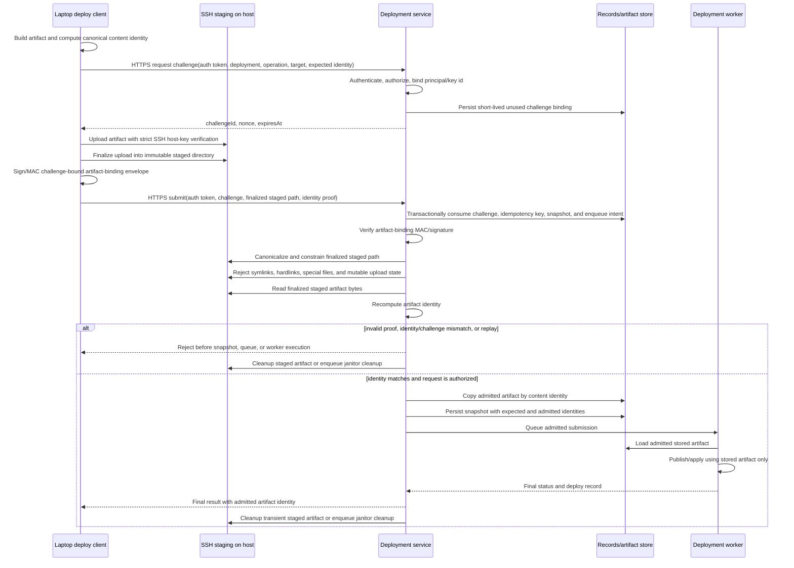

# Deployment Implementation Plan - PR Breakdown

This plan covers implementation of the deployment model described in
[Deployments Design](../designs/deployments-design.md), with the first
working end-to-end milestone prioritized around the `mini` shared-dev flow described in
[Mini Shared-Dev Deployment Design](../designs/mini-deployment.md).

Each PR includes code, tests, and documentation updates together.

Documentation updates are not limited to design/contract/schema docs. When a PR changes real
operator, technician, setup, usage, troubleshooting, or day-to-day workflow behavior, that same PR
must update the corresponding usage/instructions docs too. For `nixos-shared-host` and other
operator-facing deployment flows, this explicitly includes docs such as
[nixos-shared-host-setup.md](../../nixos-shared-host-setup.md)
and
[nixos-shared-host-technician-checklist.md](../../nixos-shared-host-technician-checklist.md)
whenever the reviewed workflow, required commands, operator responsibilities, or troubleshooting
expectations change.

Priority goal:

- get `mini`-based shared dev working end to end for static webapps first
- keep that path aligned with the final deployment design instead of building a throwaway shortcut
- after that first milestone, get static-webapp deploys working to Cloudflare Pages with a real
  `dev -> staging -> prod` flow for Pleomino
- continue from that first successful path until the broader deployment design is implemented

Non-goals:

- no docs-only PRs
- no tests-only PRs
- no untested functionality landing behind "we will test later"
- no local-only shortcuts that contradict the shared-control-plane design for shared environments

Operator UX principle:

- operator-facing flows should not require humans to manually derive deployment identities, Vault
  paths, policy names, target scopes, OIDC issuer values, or claim bindings when those values can be
  derived from reviewed deployment metadata, lane governance metadata, or a reviewed host profile
- `deploy` should provide read-only helpers for deployment-derived facts and safe command/template
  generation; scripts or importable NixOS modules should cover host and identity-provider setup
  where external credentials, secrets, and one-time operator custody are involved
- runbooks should prefer reviewed commands, generated templates, and importable modules over long
  copy/paste command sequences, while still keeping high-risk custody moments explicit:
  initialization, unseal keys, root/bootstrap tokens, IdP bootstrap credentials, and real secret
  values must remain visible operator actions

Verification command convention:

- Prefer the repo wrappers for routine operator and developer flows:
  - use `v` for the authoritative verify/test path
  - use `b` for direct Buck subcommands such as `cquery`, `build`, and `targets`
- If raw `buck2` is required instead of the wrappers, run it from `nix develop` or an equivalent
  repo shell and pass the target platform explicitly:
  - `buck2 test --target-platforms prelude//platforms:default //...`
  - `buck2 cquery --target-platforms prelude//platforms:default //projects/deployments/...`
- Older plan entries that say `buck2 test //...` should be read as the wrapper form `v`, or the
  explicit raw Buck form above when a direct Buck invocation is specifically needed.

Completion criteria:

- `mini` shared-dev static webapps work end to end with tested provisioning, publish, ingress, and
  smoke behavior
- static webapps can deploy to Cloudflare Pages through the shared deployment system with tested
  promotion-safe `dev -> staging -> prod` behavior for Pleomino
- the repo has a coherent implementation of deployment metadata extraction, provider capabilities,
  control-plane authority, immutable artifact handling, retry/rollback/promotion, preview cleanup,
  and authoritative records consistent with
  [Deployments Design](../designs/deployments-design.md)
- the protected/shared model is "Git-triggered, CI-built, Buck2-defined,
  control-plane-admitted deployments" rather than branch-backed
- protected/shared current deployed state is read from control-plane backend state keyed by
  deployment id and environment stage; Git release-pointer files are not runtime deployment inputs
- reviewed deployment-owned files in the deployment domain stay within the repository methodology
  file-size boundary, enforced by the deployment-domain guardrail introduced in PR-44

---

## PR-1: Deployment metadata foundation + `nixos-shared-host` static-webapp contract

### Description

I will establish the smallest reviewed metadata and validation foundation needed to support a real
provider family without baking policy into ad hoc scripts. This PR lands the `nixos-shared-host`
deployment shape for static webapps, the extraction path from `TARGETS`, and validation rules that
keep the later control-plane and host realization work deterministic.

### Scope & Changes

- Add deployment-schema support for the first `nixos-shared-host` provider family shape.
- Add `static-webapp` as the first in-scope component kind for this provider family.
- Add reviewed deployment metadata fields required for the first slice:
  - `appName`
  - `containerPort`
  - optional `healthPath`
  - optional `targetGroup`
  - provider family / publisher / provisioner references
  - `protection_class = "shared_nonprod"` defaulting rules for this provider family
- Add Buck-side extraction for canonical deployment metadata from `TARGETS`.
- Add provider-target identity normalization for `nixos-shared-host`:
  - hostname `${appName}.apps.kilty.io`
  - container identity `${appName}`
  - shared-dev target identity normalization suitable for locking and records later
- Add repo validation for the first provider-family contract:
  - reject missing required fields
  - reject duplicate `appName` values that would collide on hostname
  - reject explicit subdomain-style overrides for this provider family
  - reject use of this provider family with unsupported component kinds
- Add one sample deployment package for a static webapp targeting `mini`.

### Tests (in this PR)

- Add schema tests for `nixos-shared-host` deployment metadata.
- Add Buck extraction tests proving canonical metadata is emitted from `TARGETS`.
- Add validation tests that reject:
  - duplicate `appName`
  - missing `containerPort`
  - invalid `targetGroup`
  - unsupported component kinds for this provider family
- Add contract tests for provider-target identity derivation:
  - `${appName}.apps.kilty.io`
  - normalized container identity
  - normalized shared-dev provider-target identity

### Docs (in this PR)

- Update deployment schema and provider-capability docs for `nixos-shared-host`.
- Document the static-webapp-only initial scope and the required metadata contract.
- Document the normalization rules for hostname and container identity.

### Verification Commands

- `v`
- `b cquery //projects/deployments/...`

### Expected Regression Scope

- `mixed`
- This PR is expected to touch both deployment/build-system code and at least one concrete
  `projects/...` deployment package. Under the current verify policy, build-system changes are
  authoritative, so default `v` / CI runs the full build-system verify scope rather than narrowing
  to project-only selection.

### Acceptance Criteria

- `TARGETS` can express a valid `nixos-shared-host` static-webapp deployment.
- Extraction produces deterministic normalized metadata for that deployment.
- Validation fails closed on hostname collisions and missing required fields.
- Documentation and tests in this PR describe the same first-slice contract.

### Risks

If the first metadata contract is too loose, later control-plane and host-state work will inherit
ambiguity.

### Mitigation

Keep the first provider-family contract intentionally narrow and validate aggressively.

### Consequence of Not Implementing

The `mini` shared-dev path would start from ad hoc local conventions instead of the repository's
authoritative deployment model.

### Downsides for Implementing

This front-loads schema and validation work before visible deployment behavior exists.

### Recommendation

Implement first so the rest of the `mini` work lands on a stable metadata foundation.

---

## PR-2: Authoritative platform state + `nixos-shared-host` realization for shared-dev static targets

### Description

I will implement the authoritative cumulative platform-state model for the reviewed
`nixos-shared-host` provider and teach the host to realize shared-dev static targets declaratively
from that state. This PR covers safe partial-slice behavior, host-side NixOS container generation,
and nginx routing generation, but stops short of the artifact publisher.

### Scope & Changes

- Implement the first authoritative platform-state artifact for `nixos-shared-host` shared-dev deployments.
- Add control-plane or deploy-side logic to update that platform state from:
  - scoped apply inputs
  - authoritative full reconcile inputs
  - explicit removal requests
- Add safe merge semantics so slice-local inputs cannot delete out-of-scope apps.
- Teach the `nixos-shared-host` configuration to consume authoritative platform state and derive:
  - one declarative NixOS container per app
  - one nginx route per app
  - deterministic backend addressing
- Add host-level conflict checks:
  - duplicate hostname rejection
  - duplicate backend identity rejection
  - undeclared hostname routing rejection
- Add a generic static-app-host container shape for the first shared-dev implementation.
- Add a reviewed host-apply path for updating a NixOS shared host declaratively from generated state.

### Tests (in this PR)

- Add platform-state merge tests for:
  - scoped apply create
  - scoped apply update
  - explicit removal
  - authoritative full reconcile
  - omission in scoped apply not implying deletion
- Add Nix or fixture-based host-generation tests proving:
  - container config generation from authoritative platform state
  - nginx route generation from the same input
  - host rejection of duplicate hostnames or backends
- Add an integration test for "partial slice plus preexisting app" proving host realization preserves
  out-of-scope apps.

### Docs (in this PR)

- Document the authoritative platform-state model for `nixos-shared-host`.
- Document scoped apply, authoritative full reconcile, and explicit removal semantics.
- Document the host realization contract for containers, routing, and deterministic backend identity.

### Verification Commands

- `v`
- host-generation evaluation command for the `nixos-shared-host` module as introduced in this PR

### Expected Regression Scope

- `build-system only`
- This PR should stay within deployment/control-plane, host-realization, and test infrastructure
  paths. Under the current verify policy, those build-system changes broaden default `v` / CI to
  the full build-system verify scope rather than `project-impact` selection.

### Acceptance Criteria

- `nixos-shared-host` realizes declarative shared-dev host state from one authoritative cumulative input.
- Scoped apply updates are safe with partial repo slices.
- Host generation is deterministic and fails closed on routing conflicts.
- Documentation and tests describe the same reconciliation semantics.

### Risks

Mixing slice-local manifests with declarative host state can accidentally create delete-on-omission
behavior.

### Mitigation

Make the authoritative platform-state artifact explicit and forbid host realization directly from
informationally incomplete slice inputs.

### Consequence of Not Implementing

The first visible shared-dev deployment flow would either be unsafe for partial slices or rely on a
hand-maintained host registry.

### Downsides for Implementing

Adds control-plane or deploy orchestration complexity before artifacts are flowing end to end.

### Recommendation

Implement second so the first end-to-end publish path lands on the right host-state model.

---

## PR-3: `mini` shared-dev static-webapp publisher + smoke + first end-to-end flow

### Description

I will complete the first priority milestone: a static webapp can be declared in deployment
metadata, realized on `mini`, published into its target container, and validated through the public
hostname under `*.apps.kilty.io`.

### Scope & Changes

- Implement the first built-in publisher for `nixos-shared-host` static webapps.
- Define the first `publishContract` for the generic static app-host container:
  - artifact staging path
  - activation path
  - reload or restart semantics
- Add host/container runtime support for serving the published static artifact.
- Add shared-dev smoke support that validates the public routed hostname rather than only local
  container health.
- Add an operator-facing deploy command or workflow entrypoint for:
  - ensuring target exists
  - publishing the static artifact
  - running smoke
- Record the first deployment result and published artifact identity in whatever durable local
  record form exists at this stage.

### Tests (in this PR)

- Add an end-to-end test that:
  - declares a sample static-webapp deployment for `mini`
  - updates authoritative platform state
  - applies host realization
  - publishes the built artifact into the target container
  - asserts the app is reachable at `https://${appName}.apps.kilty.io`
  - asserts smoke runs against the public routed hostname
- Add failure-path tests for:
  - publish into missing target rejected
  - smoke failure recorded as deploy failure
  - hostname reachable but wrong artifact contents rejected
- Add publisher contract tests for artifact staging and activation behavior.

### Docs (in this PR)

- Document the first complete shared-dev operator flow for static webapps.
- Document the static-webapp publish contract for `nixos-shared-host`.
- Document smoke expectations and the first failure signatures.

### Verification Commands

- `v`
- the first end-to-end shared-dev deploy command sequence introduced in this PR

### Expected Regression Scope

- `mixed`
- This PR is expected to change the deploy/publish tooling and the first concrete shared-dev sample
  wiring used for the end-to-end flow. Because build-system changes are present, default `v` / CI
  still runs the full build-system verify scope rather than a project-targeted subset.

### Acceptance Criteria

- A static webapp can be deployed end to end to `mini`.
- The deployment is reachable at `${appName}.apps.kilty.io`.
- Smoke validates the public target and blocks success on failure.
- The flow is covered by real end-to-end tests in this PR.

### Risks

The first visible end-to-end path can tempt us into hard-coding behavior that later breaks replay,
locking, or provider generality.

### Mitigation

Keep the publisher contract explicit and aligned with the metadata and authoritative platform-state
contracts from PR-1 and PR-2.

### Consequence of Not Implementing

The main near-term goal of working `mini` shared dev for static webapps would remain theoretical.

### Downsides for Implementing

This introduces real deployment mechanics and a heavier integration-test surface early.

### Recommendation

Implement third as the first working milestone for the broader deployment program.

---

## PR-4: Durable deployment records + run classification + provider-target identity persistence

### Description

I will add the first durable deployment-record model and canonical run classification so the system
can stop treating the initial `mini` flow as an opaque imperative script and instead record provider
identity, artifact identity, lifecycle state, and outcome using the repository's canonical terms.

### Scope & Changes

- Implement durable deployment-record persistence with canonical fields for:
  - `operation_kind`
  - `publish_mode`
  - lifecycle state
  - final outcome
  - deployment id
  - provider
  - canonical provider-target identity
  - artifact identity
- Implement record generation for the existing `mini` shared-dev path.
- Add canonical `deploy` and `explicit removal` run classification for the implemented slice.
- Preserve enough target identity to diagnose host/container routing failures.
- Add basic lineage hooks for future retry, rollback, and promotion records.
- Ensure the recorded provider-target identity is derived from authoritative deployment metadata, not
  ambient host state.

### Tests (in this PR)

- Add persistence tests for required deployment-record fields.
- Add classification tests for `deploy` and `explicit removal`.
- Add record contract tests proving canonical provider-target identity is preserved for
  `nixos-shared-host`.
- Extend the existing end-to-end `mini` static deploy test to assert durable record contents.

### Docs (in this PR)

- Document the first implemented deployment-record schema slice and operator-visible meanings.
- Document how provider-target identity is recorded for `nixos-shared-host`.
- Document the distinction between lifecycle state and final outcome for the implemented flows.

### Verification Commands

- `v`
- any record-inspection CLI or fixture verification command introduced in this PR

### Expected Regression Scope

- `build-system only`
- This PR should be confined to deployment runtime, persistence, and record-model code plus owned
  tests. Under the current verify policy, those build-system changes keep default `v` / CI on the
  full build-system verify scope.

### Acceptance Criteria

- The working `mini` shared-dev flow emits canonical durable deployment records.
- Records preserve provider-target identity and artifact identity in a stable, queryable form.
- Tests prove the repo is using canonical terminology instead of provider-local ad hoc fields.

### Risks

If records are bolted on after behavior ships, replay and audit semantics will drift.

### Mitigation

Introduce canonical records before retry, rollback, promotion, or preview behavior expands.

### Consequence of Not Implementing

Later control-plane features would be forced to retrofit state onto an opaque initial deploy path.

### Downsides for Implementing

Adds storage and lifecycle-state complexity before advanced operations are visible to users.

### Recommendation

Implement immediately after the first end-to-end `mini` flow works.

---

## PR-4.5: Versioned `nixos-shared-host` host install / uninstall tooling for real NixOS hosts

### Description

I will add reviewed installation tooling for turning a real NixOS host such as `mini` into a
managed `nixos-shared-host` without relying on one-off manual shell sessions or unsafe edits to
arbitrary host config. This PR introduces versioned install and uninstall scripts that are safe
across repo revisions, resilient to different existing host states, and fail closed when the host's
Nix configuration cannot be updated through a reviewed managed path.

### Scope & Changes

- Add built-in install tooling for a NixOS host to become a managed `nixos-shared-host`.
- Add built-in install tooling for a developer machine so local operator workflows can target a real
  `nixos-shared-host` safely and repeatably.
- Add built-in uninstall tooling that removes only repo-managed `nixos-shared-host` assets and does
  not assume the host is still on the same repo version that installed them.
- Genericize and rename the current operator setup manual so it documents any
  `nixos-shared-host`, not just `mini`, and make the guide invoke the reviewed install/uninstall
  scripts from this PR instead of manual setup steps.
- Introduce a versioned host-install manifest that records:
  - install-tool schema version
  - repo/tool version or fingerprint
  - managed file paths
  - managed system users, directories, and state paths
  - chosen install mode
  - any managed NixOS drop-in/import entrypoints created by the installer
- Keep install/uninstall logic in reviewed TypeScript zx tools; no substantive host mutation logic in
  ad hoc shell scripts.
- Add a reviewed dev-machine install command that accepts required host parameters either:
  - by explicit CLI flags, or
  - by structured stdin input for scripted/automation usage
- Minimum parameterized dev-machine inputs should include:
  - the hostname or SSH destination of the `nixos-shared-host`
  - the remote repo checkout path or managed root path when not defaultable
  - the remote authoritative `statePath`
  - the remote managed runtime root and records root when not defaultable
  - any reviewed SSH or transport mode selectors required by the implementation
- Support at least two reviewed install modes:
  - `emit-only`
    - generate the exact NixOS module snippet, managed state paths, and operator instructions without
      mutating the host's config
  - `managed-dropin`
    - write a dedicated repo-managed drop-in file and a dedicated import/include anchor only when the
      target NixOS config path is explicit and reviewable
- Do not silently edit arbitrary existing host files by regex guesswork.
- Require explicit operator-supplied paths or explicit reviewed detection for:
  - the host's authoritative NixOS config root
  - the managed drop-in destination
  - the authoritative `statePath`
  - the managed runtime root
  - the managed records root
- Make installer behavior robust across varying host states:
  - host already has nginx enabled
  - host already imports extra NixOS modules
  - host already has existing non-managed files under the chosen config root
  - host may be flake-based or non-flake-based
  - host may already have an older managed install manifest from a previous repo version
- Implement uninstall behavior that:
  - reads the versioned managed-install manifest
  - removes only files and directories owned by that manifest
  - preserves non-managed sibling files
  - tolerates already-missing paths
  - supports uninstalling older manifest versions through explicit compatibility shims or fail-closed
    upgrade guidance
- Add a reviewed upgrade path when an installer encounters an older managed version:
  - safe in-place migration when compatibility is reviewed
  - otherwise emit an explicit manual migration refusal rather than making guessed destructive edits
- Add explicit host-preflight checks for:
  - NixOS presence
  - required Nix features
  - write permissions
  - conflicting existing managed install anchors
  - incompatible previously managed versions
  - unsupported host config topology for in-place managed-dropin mode
- Add an operator-facing dry-run mode for install and uninstall.
- Add an operator-facing inspect/status command that reports:
  - whether the host is managed
  - which version installed it
  - which managed paths exist
  - whether the expected NixOS module import is still wired
- Add a reviewed dev-machine configuration/install manifest that records:
  - the selected `nixos-shared-host` destination hostname
  - the chosen remote paths and transport parameters
  - the local tool version or fingerprint that produced the config
  - any repo-managed local config files, shell snippets, or connection profiles created by the installer
- Replace `mini`-specific setup guidance with a generic `nixos-shared-host` installation guide that:
  - explains how to install a host
  - explains how to install a dev machine
  - explains how to inspect status
  - explains how to uninstall safely
  - uses `mini` only as an example host, not as a special-case contract

### Tests (in this PR)

- Add install-manifest schema tests for current and backward-compatible manifest versions.
- Keep all install/uninstall tests non-destructive to the real testhost system:
  - host-mutation tests must run against isolated fixture roots or temp-repo host trees
  - live-system paths such as `/etc/nixos`, `/var/lib`, system users, nginx state, and running host
    services must not be mutated by ordinary test execution
  - any test that needs real-host validation must default to dry-run or explicit opt-in execution
    and must fail closed when the required isolation boundary is not present
- Add fixture-based install tests for:
  - fresh host config root
  - host with preexisting nginx config
  - host with preexisting extra imports
  - flake-based host config
  - non-flake `/etc/nixos` style host config
- Add uninstall tests proving:
  - only manifest-owned paths are removed
  - unrelated sibling files are preserved
  - missing managed paths do not fail uninstall
  - older manifest versions either migrate safely or fail closed with an explicit message
- Add dry-run snapshot tests for install and uninstall.
- Add dev-machine installer tests proving:
  - required host parameters can be supplied by flags
  - the same parameters can be supplied by stdin
  - missing required host parameters fail closed with explicit guidance
  - install output is deterministic for the same parameter set
- Add status/inspect tests for:
  - uninstalled host
  - correctly installed host
  - partially drifted host
- Add integration tests that install, then uninstall, then reinstall into the same fixture host root.

### Docs (in this PR)

- Document the reviewed host install modes for `nixos-shared-host`.
- Document the versioned managed-install manifest contract.
- Document uninstall guarantees and non-goals.
- Rename `mini-setup.md` to a generic `nixos-shared-host` setup/install guide and update any links or
  references accordingly.
- Document the operator decision tree for:
  - `emit-only`
  - `managed-dropin`
  - dev-machine install with flag-based input
  - dev-machine install with stdin-based input
  - uninstall
  - upgrade from an older managed install version

### Verification Commands

- `v`
- install dry-run command for a fixture host root introduced in this PR
- uninstall dry-run command for a fixture host root introduced in this PR

### Expected Regression Scope

- `build-system only`
- This PR should live in installer, host-management, and related test/doc paths rather than
  project-owned app code. Under the current verify policy, default `v` / CI therefore runs the full
  build-system verify scope.

### Acceptance Criteria

- A real NixOS host such as `mini` can be put into a reviewed `nixos-shared-host` shape without
  unsafe ad hoc edits.
- A developer machine can be configured through a reviewed installer to target that
  `nixos-shared-host` using explicit parameterized host input.
- Uninstall removes only managed assets and remains safe across reviewed installer versions.
- The tooling fails closed when the host's Nix configuration cannot be modified through a reviewed
  managed path.
- The genericized `nixos-shared-host` setup guide matches the new installer/uninstaller workflow and
  no longer presents `mini`-specific manual steps as the primary path.
- Tests cover install, uninstall, status, versioning, and host-state variation in the same PR.

### Risks

Host-install tooling can become dangerously destructive if it guesses ownership or edits arbitrary
Nix config files heuristically.

### Mitigation

Use explicit managed install manifests, dedicated managed drop-in paths, dry-run support, and
fail-closed behavior for unsupported host layouts or unknown older versions.

### Consequence of Not Implementing

The `mini` slice would keep depending on tribal manual setup, making real host adoption fragile and
hard to reproduce safely across machines or over time.

### Downsides for Implementing

Adds host-operations complexity and version-compatibility surface area before the shared control
plane is fully in place.

### Recommendation

Implement before the shared-control-plane PR so real hosts can be brought under the reviewed
`nixos-shared-host` shape safely and repeatably.

---

## PR-4.5.1: Deployment-domain test labels + reviewed ownership boundary for verify scoping

### Description

I will make deployment-only verify scoping possible without relying on loose path heuristics by
first establishing an explicit reviewed deployment domain. This PR introduces the first deployment
test taxonomy and the narrow ownership boundary that later selector logic can trust.

### Scope & Changes

- Add an explicit deployment-domain test label, for example:
  - `domain:deployment`
- Ensure deployment-owned tests under the reviewed deployment test area receive that label
  deterministically.
- Introduce the first reviewed deployment-owned path contract for verify policy purposes only.
- Keep the initial deployment-owned allowlist intentionally narrow and explicit, covering only paths
  that are owned by the deployment system rather than the general build system.
- Introduce the complementary reviewed shared-path set that must still broaden to full build-system
  verify, including:
  - shared verify tooling
  - shared Buck/lib/dev helpers
  - prelude, toolchains, and provider infrastructure
  - root Buck/Nix config files
- Add fail-closed guardrails for taxonomy drift:
  - deployment-owned tests must carry the deployment-domain label
  - non-deployment tests must not acquire the deployment-domain label accidentally
- Keep this PR non-executing:
  - no new verify selector behavior yet
  - no deployment-only skipping of the broad build-system suite yet

### Tests (in this PR)

- Add Buck label/cquery tests proving deployment-owned tests are queryable by the reviewed
  deployment-domain label.
- Add policy tests proving reviewed deployment-owned test files are labeled and reviewed
  non-deployment test files are not.
- Add contract tests proving the reviewed shared-path set stays out of the deployment-owned domain.
- Add fail-closed tests proving taxonomy drift is rejected with actionable diagnostics.

### Docs (in this PR)

- Document the reviewed deployment-domain test label and its intended use.
- Document the first reviewed deployment-owned path boundary for verify scoping.
- Document the explicit non-goal that shared build-system paths remain on the full build-system
  verify path.

### Verification Commands

- `v`
- deployment label inspection commands introduced in this PR

### Expected Regression Scope

- `build-system only`
- This PR changes shared test-target generation, verify policy metadata, and related tests. Under the
  current verify policy, default `v` / CI therefore runs the full build-system verify scope.

### Acceptance Criteria

- Deployment-owned tests are queryable through one reviewed Buck label.
- The reviewed deployment-owned boundary is explicit and test-enforced.
- Shared build-system paths are still clearly outside the deployment-only domain.
- The repo has enough explicit metadata to build a fail-closed deployment selector later.

### Risks

If the first deployment-domain boundary is too broad, later deployment-only scoping can silently
skip important non-deployment build-system coverage.

### Mitigation

Keep the allowlist intentionally small, test the negative cases, and require explicit reviewed
labels rather than implicit directory guesses alone.

### Consequence of Not Implementing

Any later deployment-only selector would be forced to guess which tests and paths belong to the
deployment system.

### Downsides for Implementing

Adds taxonomy and maintenance overhead before any verify-runtime savings are visible.

### Recommendation

Implement first so later selector logic rests on explicit reviewed ownership instead of inference.

---

## PR-4.5.2: Fail-closed deployment-impact classifier for `deployment-only` versus full build-system changes

### Description

I will introduce the conservative changed-path classifier that decides whether a change is truly
deployment-only or must still run the full build-system suite. This PR remains intentionally
fail-closed: any ambiguity, shared-path touch, or unknown build-tools path still broadens back to
the current full build-system behavior.

### Scope & Changes

- Add a reviewed deployment-impact classifier over changed repo paths.
- Introduce stable classifier modes for the new policy, for example:
  - `deployment-only`
  - `deployment-and-project-impact`
  - `mixed-build-system`
  - `no-deployment-impact`
- Classify a change as `deployment-only` only when every relevant build-system-owned path is inside
  the reviewed deployment-owned allowlist from PR-4.5.1.
- Treat any touch to reviewed shared paths as an immediate full build-system broadening condition.
- Treat any unknown or unowned `build-tools` path as an immediate full build-system broadening
  condition.
- Recognize deployment project declarations under `projects/deployments/**` as deployment-related
  inputs for selector diagnostics and later union behavior.
- Emit stable diagnostics describing:
  - changed paths
  - deployment-owned paths
  - shared/full-build-system trigger paths
  - project paths
  - classifier mode and reason
- Keep this PR non-executing:
  - the classifier is inspectable and testable
  - default `v` / CI behavior remains unchanged until the next PR

### Tests (in this PR)

- Add classifier tests for safe `deployment-only` changes confined to the reviewed deployment-owned
  allowlist.
- Add tests proving any touch to shared helpers, verify tooling, prelude, toolchains, providers, or
  root Buck/Nix files broadens to the full build-system mode.
- Add fail-closed tests for unknown `build-tools` paths and ambiguous ownership.
- Add diagnostics snapshot tests locking the classifier's stable JSON output.
- Add tests covering deployment package paths under `projects/deployments/**` and their interaction
  with deployment-owned build-system paths.

### Docs (in this PR)

- Document the deployment-impact classifier modes and decision order.
- Document the fail-closed rule that any ambiguity or shared-path touch broadens to full
  build-system verify.
- Document the meaning of deployment-related `projects/deployments/**` changes in the new policy.

### Verification Commands

- `v`
- deployment-impact inspection or explain commands introduced in this PR

### Expected Regression Scope

- `build-system only`
- This PR changes verify selection policy code and shared path-classification helpers. Under the
  current verify policy, default `v` / CI therefore runs the full build-system verify scope.

### Acceptance Criteria

- The repo can classify a change as safely `deployment-only` only when every relevant touched path is
  explicitly reviewed as deployment-owned.
- Any shared or ambiguous path broadens back to the existing full build-system behavior.
- The classifier emits stable diagnostics suitable for explain-selection, CI logs, and future policy
  debugging.

### Risks

The classifier can become unsafely permissive if it tries to "help" by inferring ownership for
paths that were never explicitly reviewed.

### Mitigation

Fail closed on any unknown path, keep the ownership table explicit, and test all broadening
conditions directly.

### Consequence of Not Implementing

There is no safe mechanism to distinguish true deployment-only changes from broader build-system
changes.

### Downsides for Implementing

Adds another reviewed policy table that must be kept in sync as deployment code evolves.

### Recommendation

Implement second so execution wiring can depend on one conservative classifier instead of bespoke
fallback logic.

---

## PR-4.5.3: Verify/CI deployment-only execution path + deployment/project union semantics

### Description

I will wire the new deployment-only policy into `v` and CI so truly deployment-only changes can run
the reviewed deployment suite instead of the full non-deployment build-system suite, while any
shared-path impact still broadens immediately to the current full build-system behavior.

### Scope & Changes

- Add a first-class deployment test scope control, for example:
  - `VBR_DEPLOYMENT_TEST_SCOPE=auto|always|never`
- In `auto`, use the deployment-impact classifier from PR-4.5.2.
- Add verify execution behavior:
  - `deployment-only`: run the deployment-domain Buck test targets plus a reviewed deployment safety
    floor
  - `deployment-and-project-impact`: run the union of the reviewed deployment suite and the existing
    project-impact selection
  - `mixed-build-system`: keep the current full build-system verify scope
  - `no-deployment-impact`: keep existing non-deployment selector behavior
- Add a reviewed deployment safety floor so deployment-only runs cannot silently become empty if the
  label set drifts.
- Add fail-fast guardrails for:
  - `always` requested when the change is not safely `deployment-only`
  - zero resolved deployment-domain test targets
  - zero deployment safety-floor targets
- Keep cheap policy and lint preflight behavior intact where appropriate; only the heavy Buck test
  scope is narrowed for safe deployment-only changes.
- Extend explain-selection output so operators and CI can see whether deployment-only or full
  build-system verify was chosen and why.

### Tests (in this PR)

- Add verify policy tests proving safe deployment-only changes select the reviewed deployment suite.
- Add tests proving deployment-plus-project changes select the reviewed union of deployment scope and
  project-impact scope.
- Add tests proving any shared-path or ambiguous-path change still falls back to the full
  build-system verify scope.
- Add tests for `always` and `never` control behavior, including actionable diagnostics on
  misclassification.
- Add integration-style selection tests proving the deployment-domain Buck query and deployment
  safety floor resolve to stable non-empty targets.

### Docs (in this PR)

- Document the new deployment test scope control and selection behavior.
- Document the distinction between:
  - safe deployment-only changes
  - deployment-plus-project changes
  - full build-system fallback
- Document the operator expectation that touching any non-deployment build-system path still triggers
  the full build-system verify suite.

### Verification Commands

- `v`
- deployment-aware `v --explain-selection` or equivalent verify commands introduced in this PR

### Expected Regression Scope

- `build-system only`
- This PR changes verify execution wiring and selector integration in shared tooling. Under the
  current verify policy, default `v` / CI therefore runs the full build-system verify scope while
  this behavior is being introduced.

### Acceptance Criteria

- Safe deployment-only changes can run the reviewed deployment suite instead of the heavy
  non-deployment build-system suite.
- Deployment-plus-project changes run the reviewed union of deployment coverage and project-impact
  coverage.
- Any shared build-system impact still broadens to the existing full build-system verify path.
- Explain-selection and CI logs make the policy decision auditable.

### Risks

Selector wiring is where a sound classifier can still become unsafe if execution broadens or
narrows the wrong scope.

### Mitigation

Keep the deployment-only path opt-in-able, fail fast on empty deployment selections, and preserve
the current full build-system fallback whenever the classifier is not unquestionably safe.

### Consequence of Not Implementing

The repo would have a documented deployment-only policy boundary but no actual verify/CI execution
path that uses it.

### Downsides for Implementing

Adds another selector path to verify/CI and more policy diagnostics to maintain.

### Recommendation

Implement third so the deployment-only policy becomes useful in practice only after labels,
ownership, and fail-closed classification are already in place.

---

## PR-4.6: Profile-aware remote target resolution + deploy-plan contract for direct `nixos-shared-host` flows

### Description

I will make the reviewed dev-machine install manifest actionable by deploy-side tooling instead of
leaving it as recorded metadata only. This PR introduces a narrow, explicit remote-target contract
for the current direct-mutation `nixos-shared-host` flow without claiming to satisfy the later
shared-control-plane design.

### Scope & Changes

- Teach the deploy-side tooling to read the reviewed `nixos-shared-host` client manifest produced by
  the installer from PR-4.5.
- Add explicit remote-target selection by named profile, for example `--profile mini`, or an
  equivalent reviewed selector surface.
- Define and enforce precedence rules between:
  - profile-derived remote host metadata
  - explicit CLI overrides
- Add a reviewed non-mutating dry-run / plan mode that prints:
  - selected deployment id and label
  - selected profile and destination
  - remote repo path
  - remote authoritative state path
  - remote runtime root
  - remote records root
  - selected artifact source contract
  - whether host apply is expected as a later step
- Fail closed on:
  - missing profile
  - malformed client manifest
  - unsupported reviewed transport mode
  - ambiguous or conflicting explicit overrides
- Keep this PR non-transporting and non-mutating:
  - no SSH execution yet
  - no remote artifact copy yet
  - no remote `nixos-rebuild switch` yet

### Tests (in this PR)

- Add profile-consumption tests proving deploy-side tooling reads the reviewed client manifest
  deterministically.
- Add tests for precedence and conflict behavior between profile-derived values and explicit CLI
  flags.
- Add dry-run / plan snapshot tests locking:
  - destination selection
  - remote path rendering
  - artifact selection summary
- Add fail-closed tests for:
  - missing profile
  - malformed manifest
  - unsupported transport mode

### Docs (in this PR)

- Document the reviewed remote-target profile contract for direct `nixos-shared-host` deploys.
- Document dry-run / plan output and how operators should use it before remote execution exists.
- Document that this remains an interim direct-mutation path and not the later shared-control-plane
  model.

### Verification Commands

- `v`
- the deploy dry-run / plan commands introduced in this PR

### Expected Regression Scope

- `deployment-only`
- Assuming PR-4.5.1 through PR-4.5.3 are complete, this PR should stay within reviewed
  deployment-owned paths and deployment-domain tests. Under the deployment-only verify policy,
  default `v` / CI can run the reviewed deployment suite instead of the full non-deployment
  build-system verify scope.

### Acceptance Criteria

- Operators can select a reviewed remote `nixos-shared-host` target by profile without manually
  retyping the remote repo/state/runtime/records paths.
- The deploy-side tooling fails closed on profile drift or unsupported reviewed transport inputs.
- Dry-run / plan output is deterministic and suitable for both interactive operator use and CI
  preflight.

### Risks

If the profile contract is vague, later remote execution and CI work will inherit ambiguous path and
override behavior.

### Mitigation

Keep the profile surface narrow, deterministic, and explicit about precedence and unsupported modes.

### Consequence of Not Implementing

The reviewed dev-machine install manifest remains disconnected from actual deploy execution.

### Downsides for Implementing

Adds another reviewed contract surface before remote transport is actually available.

### Recommendation

Implement first in the interim remote-flow sequence so transport and CI layers can depend on one
stable profile contract.

---

## PR-4.7: Reviewed SSH transport + remote artifact staging for direct `mini` deploys

### Description

I will make the current `mini` shared-dev flow executable from outside the host by adding a reviewed
remote transport and exact-artifact staging path. This PR keeps the mutation model intentionally
narrow: it still runs the existing direct deploy on `mini`, but it no longer requires operators or
CI to shell into `mini` manually.

### Scope & Changes

- Add a reviewed remote execution path for the current direct `nixos-shared-host` deployment flow.
- Support at least one reviewed transport mode:
  - `ssh`
- Stage an explicit local artifact directory onto the remote host before remote deploy execution.
- Invoke the existing deploy implementation on the remote repo checkout using:
  - the staged remote artifact path
  - the remote authoritative state path
  - the remote runtime root
  - the remote records root
  - the selected deployment label
- Return a stable machine-readable deploy summary from the remote execution path.
- Keep remote repo checkout management out of scope:
  - the remote repo path must already exist
  - the tool must fail closed when the remote repo checkout is missing or unusable
- Keep host apply out of scope in this PR:
  - no automatic remote `nixos-rebuild switch` yet
- Add reviewed staged-artifact cleanup semantics for:
  - normal completion
  - explicit opt-in retention for debugging

### Tests (in this PR)

- Add transport command-assembly tests for the reviewed SSH path.
- Add fixture-based remote execution tests using an isolated fake remote root or reviewed local
  transport shim.
- Add integration tests proving:
  - local artifact is staged remotely
  - remote deploy runs against the staged artifact
  - remote records are written under the reviewed records root
- Add fail-closed tests for:
  - missing remote repo checkout
  - artifact staging failure
  - transport failure
  - remote deploy failure propagation

### Docs (in this PR)

- Document the reviewed direct remote deploy flow for `mini`.
- Document remote artifact staging and cleanup semantics.
- Document what this PR still does not do:
  - no host apply orchestration
  - no shared-control-plane authority

### Verification Commands

- `v`
- the remote deploy commands introduced in this PR

### Expected Regression Scope

- `deployment-only`
- Assuming PR-4.5.1 through PR-4.5.3 are complete, this PR should stay in reviewed
  deployment-owned transport, staging, deploy-wrapper, and deployment-domain test code. Under the
  deployment-only verify policy, default `v` / CI can run the reviewed deployment suite instead of
  the full non-deployment build-system verify scope.

### Acceptance Criteria

- A developer machine can stage a Pleomino artifact to `mini` and run the reviewed direct deploy
  flow without an interactive manual SSH session.
- The remote execution path produces a stable machine-readable result and fails closed on transport,
  staging, or remote deploy errors.
- The implementation reuses the existing direct deploy on `mini` rather than introducing a second
  mutation path.

### Risks

Remote execution can accidentally become a hidden second deploy implementation instead of a transport
wrapper around the existing one.

### Mitigation

Keep the remote layer transport-only: stage the artifact, invoke the existing deploy, return the
result, and avoid duplicating deploy semantics.

### Consequence of Not Implementing

Operators and CI would still need ad hoc manual SSH sessions to use the current `mini` slice from
outside the host.

### Downsides for Implementing

Adds transport, staging, and remote-error-surface complexity before the shared control plane exists.

### Recommendation

Implement second so the direct `mini` slice becomes remotely usable before host apply and CI polish
are layered on top.

---

## PR-4.8: Reviewed remote host-apply orchestration for managed `nixos-shared-host`

### Description

I will close the largest remaining operator gap in the interim direct path by adding a reviewed host
apply step for managed `nixos-shared-host` instances. This PR makes the remote flow feel complete
for `mini` while still staying intentionally outside the later shared-control-plane model.

### Scope & Changes

- Add a reviewed remote host-apply step that can run after a successful remote deploy.
- Support an explicit operator-controlled apply mode, for example:
  - `--apply-host`
  - or a separate reviewed apply subcommand
- Execute the reviewed host apply against the managed `nixos-shared-host` configuration on the
  selected remote host.
- Require explicit opt-in for host apply:
  - remote deploy without apply remains allowed
  - host apply must not happen implicitly by ambient defaults
- Add reviewed preflight checks before host apply:
  - server is managed
  - expected managed wiring is present or inspectable
  - required remote config paths exist
- Add dry-run support for the host-apply step.
- Keep scope limited to the current managed `nixos-shared-host` path:
  - no generic multi-provider apply abstraction yet
  - no control-plane admission/approval semantics yet

### Tests (in this PR)

- Add host-apply command-assembly tests for the reviewed remote path.
- Add fixture-based tests proving host apply:
  - is opt-in
  - fails closed when the host is unmanaged
  - fails closed when managed wiring is missing
  - respects dry-run
- Add integration-style tests for remote deploy plus remote apply using isolated fixture hosts or
  reviewed command shims instead of mutating a live system.
- Add failure-propagation tests proving apply errors remain visible and do not silently report deploy
  success.

### Docs (in this PR)

- Document the reviewed remote host-apply step for managed `nixos-shared-host` instances.
- Document the required operator preconditions for remote apply.
- Document the distinction between:
  - remote deploy
  - remote host apply
  - the later shared-control-plane model

### Verification Commands

- `v`
- the remote host-apply commands introduced in this PR

### Expected Regression Scope

- `deployment-only`
- Assuming PR-4.5.1 through PR-4.5.3 are complete, this PR should stay within reviewed
  deployment-owned host-apply orchestration, preflight logic, and deployment-domain fixture
  coverage. Under the deployment-only verify policy, default `v` / CI can run the reviewed
  deployment suite instead of the full non-deployment build-system verify scope.

### Acceptance Criteria

- A developer machine can complete the current direct Pleomino-to-`mini` flow without a second
  manual SSH step to run `nixos-rebuild switch`.
- Host apply is explicit, dry-runnable, and fail-closed on unmanaged or drifted hosts.
- The implementation remains limited to the current managed `nixos-shared-host` slice and does not
  pretend to satisfy shared-control-plane requirements.

### Risks

Remote host apply is the riskiest direct-mutation convenience step because it touches real host
state.

### Mitigation

Require explicit opt-in, preflight checks, dry-run support, and fixture-based testing rather than
making host apply an implicit side effect of every remote deploy.

### Consequence of Not Implementing

The remote flow would still require a hand-run host-apply step, which keeps Jenkins and dev-machine
automation incomplete.

### Downsides for Implementing

Adds more host-operations logic to an interim path that the later shared-control-plane model will
partially supersede.

### Recommendation

Implement third so the interim direct remote flow is actually complete for real Pleomino-to-`mini`
use.

---

## PR-4.9: Jenkins-ready direct remote deploy flow for Pleomino `dev` on `mini`

### Description

I will package the reviewed direct remote flow into a CI-usable, non-interactive operator surface so
Pleomino can be deployed to `mini` from Jenkins before the later shared-control-plane path exists.
This PR is intentionally narrow and explicitly interim: it standardizes the current direct remote
flow for CI without redefining it as the final shared deployment model.

### Scope & Changes

- Add a reviewed CI-friendly entrypoint or wrapper around the remote direct deploy path introduced in
  PR-4.6 through PR-4.8.
- Make the CI entrypoint explicitly non-interactive and machine-readable.
- Define the minimum reviewed Jenkins contract:
  - remote destination/profile selection
  - artifact input path
  - whether host apply is required
  - required SSH credential and host-key expectations
  - required remote repo checkout expectations
- Add reviewed JSON output suitable for Jenkins parsing and post-step reporting.
- Add a concrete Pleomino `dev` example flow for `mini`.
- Keep scope limited to the current direct path:
  - no shared-control-plane submission
  - no admission or locking
  - no Cloudflare or multi-environment promotion

### Tests (in this PR)

- Add CI-entrypoint contract tests proving the flow is non-interactive.
- Add fail-closed tests for:
  - missing required artifact input
  - missing required credential or host metadata
  - incompatible flag combinations
- Add fixture-based integration tests proving the CI wrapper can:
  - stage the Pleomino artifact
  - run the remote direct deploy
  - optionally run host apply
  - emit stable JSON results

### Docs (in this PR)

- Document the reviewed Jenkins flow for deploying Pleomino `dev` to `mini`.
- Document the minimum CI prerequisites and non-goals.
- Document that this CI path is an interim direct-mutation route pending the later shared-control-plane
  implementation.

### Verification Commands

- `v`
- the Jenkins-oriented direct deploy commands introduced in this PR

### Expected Regression Scope

- `deployment-only`
- Assuming PR-4.5.1 through PR-4.5.3 are complete, this PR should package the existing Pleomino
  `dev` target into a CI-facing deployment wrapper without touching shared build-system paths or new
  project-owned deployment metadata. Under the deployment-only verify policy, default `v` / CI can
  run the reviewed deployment suite instead of the full non-deployment build-system verify scope.

### Acceptance Criteria

- Jenkins can deploy Pleomino `dev` to `mini` through a reviewed non-interactive flow using the
  direct remote path.
- The CI-facing contract is explicit, machine-readable, and fail-closed on missing inputs.
- The documented operator expectations match the implemented CI entrypoint and tests.

### Risks

There is pressure to treat the first working Jenkins path as "good enough" and never return to the
shared-control-plane design.

### Mitigation

Keep the CI flow explicitly documented as an interim direct path and ensure the wrapper reuses the
same reviewed remote layers instead of creating provider-local CI-only semantics.

### Consequence of Not Implementing

The current `mini` slice could be used manually or semi-manually, but not through one reviewed CI
entrypoint for Pleomino.

### Downsides for Implementing

Adds CI-facing surface area that will later need to be realigned with the shared-control-plane
submission path.

### Recommendation

Implement fourth so teams can use a reviewed Pleomino-to-`mini` CI path while PR-5 and later
control-plane work are still pending.

---

## PR-5: Shared control-plane skeleton + admission, locking, and authority rules for `shared_nonprod`

### Description

I will establish the shared-control-plane authority boundary for `shared_nonprod` deployments and
move the `mini` shared-dev flow under that authority. This PR focuses on admission, locking, and
reviewed execution boundaries rather than advanced artifact replay or later lock-resilience
refinements.

### Scope & Changes

- Introduce the first shared control-plane API and worker skeleton for mutating shared deployments.
- Require `nixos-shared-host` `shared_nonprod` mutation to execute through the shared control plane.
- Implement the first shared lock primitive for `nixos-shared-host` on canonical provider-target
  identity so concurrent mutation on the same target is rejected.
- Implement the first admission flow for shared-dev `deploy` and `explicit removal`.
- Freeze an execution snapshot with the deployment metadata and provider-target identity needed for
  the implemented flows.
- Ensure direct local mutation of `mini` shared-dev targets is out of policy for the normal path.
- Move the existing end-to-end `mini` static-webapp deploy flow to submit through this shared path.

### Tests (in this PR)

- Add admission tests for:
  - allowed `shared_nonprod` submission
  - rejected direct local mutation path
  - lock conflict on the same `mini` target
- Add locking tests proving shared runs acquire the canonical provider-target lock before mutation
  and reject concurrent mutation on the same target.
- Add execution-snapshot tests proving required metadata is frozen before mutation.
- Extend the `mini` end-to-end flow to assert control-plane submission, locking, and recorded
  execution-snapshot references.

### Docs (in this PR)

- Document the first shared-control-plane path for `mini` shared-dev deployments.
- Document the initial canonical provider-target locking behavior for shared mutation.
- Document the shared-environment authority rule for `nixos-shared-host`.

### Verification Commands

- `v`
- the shared-control-plane submission command sequence introduced in this PR

### Expected Regression Scope

- `deployment-only`
- Assuming PR-4.5.1 through PR-4.5.3 are complete, this PR should land in reviewed
  deployment-owned control-plane, locking, admission, and deployment-domain test infrastructure
  while reusing existing deployment packages. Under the deployment-only verify policy, default `v`
  / CI can run the reviewed deployment suite instead of the full non-deployment build-system verify
  scope.

### Acceptance Criteria

- `mini` shared-dev deploys run through a reviewed shared control-plane path.
- The system acquires canonical provider-target locks before mutation and rejects concurrent
  mutation on the same target.
- Shared-environment authority rules are enforced and covered by tests.

### Risks

This is the first point where convenience pressure may push toward bypassing the shared execution
boundary.

### Mitigation

Keep the implemented `mini` path narrow and fully routed through the same reviewed API and worker
surface that later providers will use.

### Consequence of Not Implementing

The first production-like shared environment would remain inconsistent with the design's authority
model.

### Downsides for Implementing

Adds operational infrastructure and more moving parts to a flow that was already working locally.

### Recommendation

Implement now so the first working `mini` flow does not become entrenched as an exception.

---

## PR-6: Immutable artifact selection + provenance store + replay snapshot baseline

### Description

I will add the first immutable artifact and replay-snapshot baseline so the shared control plane can
re-run shared deployments from recorded artifact identity rather than ambient local build state.

### Scope & Changes

- Implement artifact identity capture for the existing static-webapp deployment path.
- Add the first artifact/provenance store integration for admitted artifact references.
- Implement replay-snapshot persistence for the existing `mini` path:
  - artifact refs
  - provider-target identity
  - deployment metadata fingerprint
  - provider-config or host-state snapshot references where relevant
- Add exact-artifact publish input support for the current provider family.
- Ensure publisher paths consume resolved artifacts rather than rebuilding implicitly.

### Tests (in this PR)

- Add tests proving replay snapshots preserve the required artifact and target identity fields.
- Add tests rejecting rebuild-on-replay behavior for the implemented shared path.
- Extend the `mini` end-to-end flow to assert replay input can resolve an already recorded artifact.

### Docs (in this PR)

- Document the first replay-snapshot contract slice.
- Document exact-artifact semantics for the implemented `mini` path.
- Document the separation between reusable artifact provenance and deployment-run records.

### Verification Commands

- `v`
- artifact-resolution or replay-inspection commands introduced in this PR

### Expected Regression Scope

- `deployment-only`
- Assuming PR-4.5.1 through PR-4.5.3 are complete, this PR should stay in reviewed
  deployment-owned artifact selection, provenance, replay persistence, and deployment-domain tests.
  Under the deployment-only verify policy, default `v` / CI can run the reviewed deployment suite
  instead of the full non-deployment build-system verify scope.

### Acceptance Criteria

- Shared deploys preserve exact artifact identity and a replay snapshot suitable for reuse.
- The implemented shared path no longer depends on ambient workstation build state for replay.
- Tests prove replay fails closed when exact artifact identity cannot be resolved.

### Risks

Artifact identity and host-state identity can drift if captured from different sources.

### Mitigation

Bind replay snapshots to canonical deployment metadata, provider-target identity, and resolved
artifact refs from the same admitted run.

### Consequence of Not Implementing

Retry and rollback behavior would have to guess from current repo state instead of replaying the
recorded run.

### Downsides for Implementing

Introduces more persistence and artifact-store plumbing before advanced reuse flows are exposed.

### Recommendation

Implement before retry and rollback so reuse behavior starts from exact recorded artifacts.

---

## PR-7: `retry`, `publish-only`, and same-deployment `rollback` for `mini` shared-dev static webapps

### Description

I will extend the now-recorded and replayable `mini` shared-dev path with the first immutable-reuse
operator flows: retry, exact-artifact publish-only, and same-deployment rollback.

### Scope & Changes

- Implement canonical run classification for:
  - `retry`
  - `rollback`
  - shared `--publish-only`
- Require exact artifact or source-run selection for shared replay paths.
- Implement same-deployment rollback candidate selection for the implemented `mini` path.
- Replay from the recorded snapshot rather than today's repo state.
- Preserve parent-run and artifact-lineage relationships in deployment records.
- Drive retry and rollback from explicit admitted run ids and retained replay snapshots; do not
  recover by branch rewind, mutable tag reassignment, release-pointer edits, or current workspace
  rebuilds.

### Tests (in this PR)

- Add tests rejecting:
  - ambiguous shared `--publish-only`
  - rollback without explicit source-run selection
  - replay that would rebuild implicitly
- Add end-to-end tests for:
  - retry of a prior failed or interrupted `mini` deploy
  - exact-artifact publish-only to an existing `mini` target
  - rollback to a prior known-good `mini` run
- Add tests asserting lineage fields are recorded correctly.

### Docs (in this PR)

- Document operator semantics for retry, publish-only, and rollback on the implemented path.
- Document rollback selection and exact-artifact requirements.
- Document replay failure behavior when the recorded artifact is unavailable.
- Document that operator-visible current stage state is the source for live run lineage and
  rollback candidate inspection.

### Verification Commands

- `v`
- retry, rollback, and publish-only command flows introduced in this PR

### Expected Regression Scope

- `deployment-only`
- Assuming PR-4.5.1 through PR-4.5.3 are complete, this PR should change replay/recovery logic and
  deployment-domain tests without adding new project-owned deployment packages or shared
  build-system path touches. Under the deployment-only verify policy, default `v` / CI can run the
  reviewed deployment suite instead of the full non-deployment build-system verify scope.

### Acceptance Criteria

- Shared retry, publish-only, and rollback work for `mini` static-webapp deployments.
- These flows consume recorded artifacts and replay snapshots rather than rebuilding.
- Tests cover success and fail-closed rejection paths.

### Risks

The first rollback implementation can quietly weaken identity or artifact requirements if it is too
operator-friendly.

### Mitigation

Require explicit source-run or exact-artifact selection and reject any replay path that cannot prove
artifact identity and target compatibility.

### Consequence of Not Implementing

The first shared deployment target would have no safe recovery or replay path.

### Downsides for Implementing

Adds operator-facing complexity and more negative validation cases.

### Recommendation

Implement while the `mini` path is still the narrowest shared provider family.

---

## PR-7.1: Rollback-candidate hardening + deployment-domain test modularization

### Description

I will close the first contract gap discovered after PR-7 lands: same-deployment rollback must
fail closed to prior successful normal runs instead of accepting any successful replay-shaped run.
This follow-up also removes deployment-domain methodology drift by modularizing oversized remote
execution coverage without reducing the reviewed behavior surface.

### Scope & Changes

- Tighten same-deployment rollback source selection for the implemented `mini` path so rollback
  candidates must be:
  - the same deployment id
  - target-compatible under the existing replay checks
  - prior successful normal publish runs for the same normal live target
  - visible through control-plane current stage state as a non-current rollback candidate
- Reject rollback candidates sourced from runs classified as:
  - `retry`
  - `rollback`
  - `explicit removal`
- Keep shared `retry` behavior unchanged for the reviewed same-deployment immutable-reuse slice.
- Improve fail-closed rollback diagnostics so operators can see whether rejection came from:
  - non-success final outcome
  - wrong run classification
  - deployment or target incompatibility
- Keep rollback selection derived from durable records and replay snapshots rather than recency or
  "latest known good" heuristics.
- Use control-plane current stage state to reject rollback attempts that only move Git refs, edit
  release-pointer JSON, retag mutable provider artifacts, or point at the current run instead of a
  prior admitted run.
- Split oversized deployment-owned remote-execution test coverage into smaller reviewed modules or
  helpers so the deployment test area stays within repo methodology file-size expectations without
  dropping coverage.

### Tests (in this PR)

- Add tests rejecting rollback sourced from:
  - a prior successful `retry`
  - a prior successful `rollback`
  - an `explicit removal` run
  - a non-successful run
- Add regression tests proving same-deployment source-run reuse stays distinct between:
  - `retry`
  - `rollback`
- Keep end-to-end rollback coverage for:
  - restoring a prior known-good exact artifact
  - failing closed when the chosen source run is not an eligible rollback candidate
- Preserve the existing reviewed remote deploy and host-apply coverage while modularizing the test
  files that currently exceed the methodology size target.

### Docs (in this PR)

- Document that same-deployment rollback candidates are limited to prior successful normal runs for
  the same deployment.
- Document explicitly that successful `retry` and `rollback` runs are not valid default rollback
  sources.
- Document that current-stage-state reads expose retry/rollback lineage and the policy-filtered
  rollback candidate list operators should choose from.
- Document that this PR is a contract-hardening follow-up to PR-7 rather than a new deploy feature
  slice.

### Verification Commands

- `v`
- retry, rollback, and replay command flows introduced in PR-7

### Expected Regression Scope

- `deployment-only`
- Assuming PR-4.5.1 through PR-4.5.3 are complete, this PR should stay within reviewed
  deployment-owned replay-selection logic, deployment-domain tests, and related docs. Under the
  deployment-only verify policy, default `v` / CI can run the reviewed deployment suite instead of
  the full non-deployment build-system verify scope.

### Acceptance Criteria

- Same-deployment rollback accepts only prior successful normal runs for the same deployment.
- Successful `retry`, `rollback`, and `explicit removal` runs are rejected as rollback sources with
  actionable diagnostics.
- The reviewed deployment-domain remote-execution coverage remains behaviorally intact while the
  file-size methodology drift in that test area is removed.

### Risks

Tightening rollback eligibility can break informal operator expectations if anyone was implicitly
treating any successful replay-shaped run as rollback-safe.

### Mitigation

Keep the correction narrow, fail closed with explicit diagnostics, and align tests plus docs to the
same rollback-candidate rule in the same PR.

### Consequence of Not Implementing

The repo would keep a rollback path that is looser than its reviewed contract, and deployment-owned
test coverage would continue to drift from the methodology file-size standard.

### Downsides for Implementing

This is primarily a hardening and modularization PR, so it adds review work without expanding the
operator feature surface.

### Recommendation

Implement immediately after PR-7 so later admission and promotion work builds on a strict rollback
contract instead of preserving an overly permissive replay precedent.

---

## PR-8: Reviewed `lane_policy` + source admission + target-environment run admission

### Description

I will add the core reviewed-source lane model and explicit two-stage admission flow that the main
deployment design requires for protected/shared deployments.

### Scope & Changes

- Implement `lane_policy` resolution for protected/shared deployments.
- Implement source admission:
  - admissible revision selection from the lane's reviewed source-ref policy, including protected `main`, release tags, or explicit reviewed `commit:<sha>` references
  - trusted artifact input selection
- Implement target-environment run admission:
  - freeze target-environment execution snapshot before mutation
- Bind the current `mini` shared-dev path to this admission structure where applicable.
- Record lane-policy and admission-policy references or fingerprints in run records and replay
  snapshots.

### Tests (in this PR)

- Add lane-policy resolution tests.
- Add admission tests for:
  - source revision eligibility
  - target-environment snapshot freezing
  - out-of-policy source-run reuse rejected
- Extend the implemented shared provider tests to assert two-stage admission records and frozen
  snapshots.

### Docs (in this PR)

- Document the two-stage admission flow and how it fits shared environments.
- Document how source admission and target-environment run admission differ.
- Document the first implemented lane-policy contract slice.

### Verification Commands

- `v`
- admission and lane-policy inspection commands introduced in this PR

### Expected Regression Scope

- `mixed-build-system`
- Assuming PR-4.5.1 through PR-4.5.3 are complete, this PR is expected to touch shared
  build-system surfaces in addition to deployment work, because protected/shared deployments likely
  need new reviewed metadata fields and target-definition/extraction support as well as concrete
  deployment declarations. Under the deployment-only verify policy, default `v` / CI must still run
  the full build-system verify scope.

### Acceptance Criteria

- Protected/shared runs use explicit source and target-environment admission stages.
- Lane-policy resolution and admission references are persisted in records.
- Tests prove the system rejects reuse outside current lane policy.

### Risks

Admission semantics are easy to describe loosely and hard to retrofit precisely later.

### Mitigation

Land explicit frozen-snapshot and lane-policy references before promotion broadens provider support.

### Consequence of Not Implementing

The shared deployment flow would still lack the design's intended reviewed-source admission guarantees.

### Downsides for Implementing

Adds substantial policy machinery before broader provider support is available.

### Recommendation

Implement before cross-environment promotion and more advanced provider support.

---

## PR-9: Cloudflare Pages provider slice + Pleomino staging/prod deployment packages

### Description

I will implement the first non-`mini` protected/shared provider slice using Cloudflare Pages and
land the concrete Pleomino deployment packages needed for a real shared `staging` and `prod` flow.
This PR is the first half of the secondary milestone: getting static-webapp deploys to Cloudflare
Pages in the same deployment system rather than only on `mini`.

### Scope & Changes

- Implement the first non-`mini` built-in provider capability entry for `static-webapp`:
  - `cloudflare-pages`
- Implement canonical provider-target identity normalization for Cloudflare Pages.
- Implement the first built-in Cloudflare Pages publisher and smoke runner.
- Add concrete deployment packages for Pleomino:
  - `pleomino-dev` on `nixos-shared-host` remains the shared-dev path
  - `pleomino-staging` on `cloudflare-pages`
  - `pleomino-prod` on `cloudflare-pages`
- Add provider-native config generation or validation rules so Cloudflare target identity stays
  derived from authoritative deployment metadata.
- Reuse the shared control-plane, artifact, record, and admission machinery from earlier PRs.
- Keep scope limited to single-component `static-webapp`, normal deploy, and blocking smoke.

### Tests (in this PR)

- Add Cloudflare Pages provider-capability contract tests.
- Add validation tests for Pleomino staging/prod deployment metadata and canonical target identity.
- Add end-to-end deploy tests for the Cloudflare Pages static-webapp path using admitted exact
  artifacts.
- Add smoke-blocking tests for the Cloudflare Pages public target behavior.
- Add tests rejecting provider-config drift where deployment metadata and provider-native config
  disagree on target identity.

### Docs (in this PR)

- Document the Cloudflare Pages provider capability and publisher contract.
- Document Pleomino's initial `dev -> staging -> prod` topology:
  - `dev` on `mini`
  - `staging` and `prod` on Cloudflare Pages
- Document provider-target identity rules and smoke expectations for Cloudflare Pages.

### Verification Commands

- `v`
- Cloudflare Pages deploy verification commands introduced in this PR

### Expected Regression Scope

- `mixed-build-system`
- Assuming PR-4.5.1 through PR-4.5.3 are complete, this PR is expected to combine new
  provider/control-plane code with concrete Pleomino `projects/deployments/...` packages and the
  reviewed shared build-system surface needed to declare and extract the new provider slice. Under
  the deployment-only verify policy, default `v` / CI must still run the full build-system verify
  scope.

### Acceptance Criteria

- One provider beyond `mini` works end to end for the supported shared/protected static-webapp path.
- Pleomino has concrete `dev`, `staging`, and `prod` deployment packages wired into the deployment
  system.
- The implementation reuses the general control-plane machinery instead of provider-local shortcuts.
- Provider-target identity, smoke, and artifact handling are covered by tests in the same PR.

### Risks

The first external provider can tempt us to add provider-local exceptions that later undermine the
general model.

### Mitigation

Keep the provider slice narrow and make capability rules explicit in tests and docs.

### Consequence of Not Implementing

The deployment system would remain unproven as a general multi-provider model and would not support
the first real Pleomino higher-environment path.

### Downsides for Implementing

This adds real provider complexity and provider-specific failure modes.

### Recommendation

Implement after the shared-control-plane and immutable-reuse foundations are in place so the second
milestone lands on the same rails as the first.

---

## PR-10: Pleomino `dev -> staging -> prod` promotion flow on exact static-webapp artifacts

### Description

I will implement promotion across the concrete Pleomino deployment ids so the secondary
intermediate goal is fully met: one exact static-webapp artifact can move from `dev` evidence
through `staging` and `prod` using the repository's default `same_artifact` model.

### Scope & Changes

- Implement promotion classification for Pleomino across distinct deployment ids in compatible lanes.
- Reuse the exact admitted artifact across Pleomino deployments where lane policy allows
  `same_artifact`.
- Add promotion eligibility checks against current control-plane lane state and reviewed
  source-ref policy.
- Require promotion eligibility to load current stage state for both the selected source deployment
  and the target deployment. Missing or stale current-stage records fail closed; environment
  branches, mutable tags, and release-pointer files are not promotion authority.
- Record:
  - `parent_run_id`
  - `release_lineage_id`
  - `artifact_lineage_id`
- Ensure promotion uses the source run's artifact and source snapshot evidence while still freezing a
  new target-environment execution snapshot for the promoted deployment.
- Prove the complete Pleomino `dev -> staging -> prod` operator path through the shared deployment
  system.

### Tests (in this PR)

- Add tests rejecting:
  - promotion across incompatible lanes
  - promotion from retained but no-longer-eligible source runs
  - promotion that would retarget one deployment dynamically instead of using a distinct deployment id
- Add end-to-end promotion tests across Pleomino `dev`, `staging`, and `prod` using one exact
  artifact.
- Add lineage tests proving artifact and release lineage fields are recorded correctly.
- Add smoke-gated tests proving promotion halts when the staged environment does not satisfy its
  blocking checks.

### Docs (in this PR)

- Document same-artifact promotion semantics using the concrete Pleomino `dev -> staging -> prod`
  example.
- Document the distinction between source-run evidence and target-environment admission.
- Document lineage field meanings for promotion runs.

### Verification Commands

- `v`
- Pleomino promotion command flows introduced in this PR

### Expected Regression Scope

- `deployment-only`
- Assuming PR-4.5.1 through PR-4.5.3 are complete, this PR should add promotion logic on top of the
  Pleomino deployment packages already introduced earlier without touching shared build-system
  paths. Under the deployment-only verify policy, default `v` / CI can run the reviewed deployment
  suite instead of the full non-deployment build-system verify scope.

### Acceptance Criteria

- Pleomino can move through a real `dev -> staging -> prod` flow using exact static-webapp artifacts.
- Promotion respects current lane-policy eligibility and records lineage correctly.
- Promotion uses `--source-run-id` plus control-plane current stage state, not branch movement or
  pointer-file edits, to decide whether the selected source run is still promotable.
- Tests cover both success and fail-closed promotion paths.

### Risks

Promotion semantics are easy to blur with retargeting or rebuild-per-stage behavior.

### Mitigation

Keep this PR limited to `same_artifact` only and reject any path that looks like dynamic retargeting.

### Consequence of Not Implementing

The secondary milestone would remain incomplete because Pleomino would still lack a real higher-
environment promotion path.

### Downsides for Implementing

Adds more record, policy, and operator-surface complexity.

### Recommendation

Implement immediately after Cloudflare Pages deploy support so the second milestone is reached as
early as safely possible.

---

## PR-11: Generalized cross-deployment promotion with `artifact_reuse_mode = "same_artifact"`

### Description

I will generalize the Pleomino-specific promotion path into provider-agnostic cross-deployment
promotion support for all compatible lanes using the repository's default `same_artifact` model.

### Scope & Changes

- Implement promotion classification for distinct deployment ids in compatible lanes.
- Reuse the exact admitted artifact across deployments where lane policy allows `same_artifact`.
- Add promotion eligibility checks against current control-plane lane state and reviewed
  source-ref policy.
- Record:
  - `parent_run_id`
  - `release_lineage_id`
  - `artifact_lineage_id`
- Ensure promotion uses the source run's artifact and source snapshot evidence while still freezing a
  new target-environment execution snapshot for the promoted deployment.

### Tests (in this PR)

- Add tests rejecting:
  - promotion across incompatible lanes
  - promotion from retained but no-longer-eligible source runs
  - promotion that would retarget one deployment dynamically instead of using a distinct deployment id
- Add end-to-end promotion tests across two deployment ids using one exact artifact.
- Add lineage tests proving artifact and release lineage fields are recorded correctly.

### Docs (in this PR)

- Document same-artifact promotion semantics and lane eligibility rules.
- Document the distinction between source-run evidence and target-environment admission.
- Document lineage field meanings for promotion runs.

### Verification Commands

- `v`
- promotion command flows introduced in this PR

### Expected Regression Scope

- `deployment-only`
- Assuming PR-4.5.1 through PR-4.5.3 are complete, this PR should generalize promotion behavior in
  reviewed deployment-owned control-plane code and deployment-domain tests without touching shared
  build-system surfaces. Under the deployment-only verify policy, default `v` / CI can run the
  reviewed deployment suite instead of the full non-deployment build-system verify scope.

### Acceptance Criteria

- Promotion across distinct deployments works with exact artifact reuse.
- Promotion respects current lane-policy eligibility and records lineage correctly.
- Tests cover both success and fail-closed promotion paths.

### Risks

Promotion semantics are easy to blur with retargeting or rebuild-per-stage behavior.

### Mitigation

Keep this PR limited to `same_artifact` only and reject any path that looks like dynamic retargeting.

### Consequence of Not Implementing

The shared deployment model would still lack one of its core cross-environment workflows.

### Downsides for Implementing

Adds more record, policy, and operator-surface complexity.

### Recommendation

Implement before rebuild-per-stage and multi-component rollout so the default promotion model is
solid first.

---

## PR-12: Isolated preview publish + audited preview cleanup

### Description

I will implement preview as a publish mode with explicit isolated target identity and first-class
audited cleanup semantics, consistent with the main design.

### Scope & Changes

- Implement preview publish mode with explicit isolated preview target identity.
- Reject preview paths that try to reuse the normal mutable live target.
- Reject preview paths that rely on operator-invented ad hoc target identity instead of policy-
  defined derivation.
- Implement audited preview cleanup as a first-class control-plane operation.
- Preserve both normal declared provider-target identity and effective preview target identity in
  deployment records.
- Keep preview support limited to providers whose capability entries explicitly allow it.

### Tests (in this PR)

- Add tests rejecting:
  - preview that reuses the normal live target
- Add tests rejecting preview cleanup that targets an unknown or non-preview target identity.
- Add end-to-end preview publish and cleanup tests for one supported provider family.
- Add record tests for effective preview target identity preservation.

### Docs (in this PR)

- Document preview as a publish mode, not a deployment identity.
- Document preview cleanup semantics for the initial audited cleanup path.
- Document provider support boundaries for preview behavior.

### Verification Commands

- `v`
- preview publish and cleanup commands introduced in this PR

### Expected Regression Scope

- `deployment-only`
- Assuming PR-4.5.1 through PR-4.5.3 are complete, this PR should stay in reviewed
  deployment-owned provider-capability, preview lifecycle, cleanup, and record logic plus
  deployment-domain tests. Under the deployment-only verify policy, default `v` / CI can run the
  reviewed deployment suite instead of the full non-deployment build-system verify scope.

### Acceptance Criteria

- Preview uses explicit isolated target identity and never reuses the live target.
- Cleanup is audited, explicit, and covered by tests.
- Preview behavior remains provider-capability-gated and fail-closed.

### Risks

Preview is a common source of implicit side effects and target confusion.

### Mitigation

Model preview target identity explicitly and reject any provider path that cannot isolate it cleanly.

### Consequence of Not Implementing

Preview behavior would remain either unavailable or dangerously ad hoc.

### Downsides for Implementing

Adds more surface area for target identity, lifecycle, and cleanup handling.

### Recommendation

Implement after normal deploy, replay, and promotion semantics are stable.

---

## PR-12.1: Deployment-domain taxonomy ownership split + verify-scope hardening

### Description

I will remove the first recurring false broadening in the deployment-only verify path by moving the
mutable deployment-domain taxonomy data out of the shared test-definition surface and into the
reviewed deployment-owned boundary. The goal is to keep routine deployment test additions or renames
from kicking default `v` / CI back to the full build-system suite while preserving fail-closed
classification behavior.

### Scope & Changes

- Move the mutable reviewed deployment-domain ownership table into the reviewed deployment-owned test
  area under `build-tools/tools/tests/deployments/**`.
- Keep the shared zx-test loader stable:
  - `build-tools/tools/tests/defs.bzl` remains shared test infrastructure
  - root `TARGETS` remains shared test infrastructure
- Update deployment verify-scope classification so the new deployment-domain taxonomy file is
  treated as reviewed deployment-owned rather than an unclassified `build-tools/**` path.
- Keep fail-closed taxonomy behavior unchanged:
  - unclassified reviewed deployment tests still fail
  - reviewed non-deployment tests still must not acquire the deployment-domain label
- Avoid widening deployment ownership to the whole shared test-definition layer just to solve this
  one mutable taxonomy hotspot.

### Tests (in this PR)

- Add or extend boundary tests proving:
  - the moved deployment-domain taxonomy file is classified as reviewed deployment-owned
  - `build-tools/tools/tests/defs.bzl` remains classified as shared
- Add selector-policy tests proving a taxonomy-only change now resolves to `deployment-only`
  instead of `mixed-build-system`.
- Preserve taxonomy-drift tests proving unclassified reviewed deployment tests still fail closed.
- Preserve cquery label tests proving only reviewed deployment-domain tests acquire
  `domain:deployment`.

### Docs (in this PR)

- Document the split between:
  - shared zx-test loader infrastructure
  - deployment-owned taxonomy data for reviewed deployment-domain tests
- Document why routine deployment test additions no longer need to broaden default `v` / CI to the
  full build-system verify scope.
- Document the fail-closed ownership rule for the moved taxonomy data.

### Verification Commands

- `v`
- deployment verify-scope inspection and selection-explain commands touched in this PR

### Expected Regression Scope

- `mixed-build-system`
- Assuming PR-4.5.1 through PR-4.5.3 are complete, this PR is expected to touch both the reviewed
  deployment-owned deployment-domain taxonomy data and the shared verify-scope classification logic
  that decides whether default `v` / CI can narrow safely. This PR should therefore run the full
  build-system verify scope once, so later deployment-only PRs can keep routine deployment test
  taxonomy edits inside the reviewed deployment-owned boundary.

### Acceptance Criteria

- Touching only the deployment-domain taxonomy data no longer classifies as `mixed-build-system`.
- Shared zx-test loader infrastructure remains outside the deployment-owned boundary.
- Reviewed deployment test classification still fails closed on drift or missing ownership entries.
- Verify-scope diagnostics clearly explain the new ownership boundary.

### Risks

Misclassifying shared test-definition infrastructure as deployment-owned could let a genuinely
cross-cutting build-system change bypass the full verify scope.

### Mitigation

Keep the shared loader and root test-definition entrypoints classified as shared, move only the
mutable deployment-domain taxonomy data, and cover the boundary with explicit classifier and
selection tests.

### Consequence of Not Implementing

Future deployment PRs that add, rename, or reclassify reviewed deployment tests will keep
unexpectedly triggering full build-system verify runs, which weakens the practical value of the
deployment-only verify policy.

### Downsides for Implementing

Adds one more ownership split between shared test-definition infrastructure and deployment-owned
taxonomy data.

### Recommendation

Implement immediately after PR-12 so later deployment-only PRs can rely on predictable verify-scope
behavior when they extend reviewed deployment-domain coverage.

---

## PR-13: `--from-changes` grouped submission + prerequisite graph orchestration

### Description

I will add grouped changed-based submission and prerequisite-aware orchestration so the system can
turn repo changes into auditable per-deployment runs without inventing a second source of truth.

### Scope & Changes

- Implement per-deployment run selection from repo changes.
- Add optional batch grouping while preserving per-deployment run identity.
- Implement explicit prerequisite graph evaluation from authoritative deployment metadata.
- Keep prerequisite evaluation direct-edge-only rather than silently introducing transitive
  prerequisite semantics.
- Ensure orchestration still emits independent deployment records even when one CLI invocation
  triggers several runs.

### Tests (in this PR)

- Add tests for changed-based deployment selection.
- Add tests for prerequisite ordering and rejection of invalid graphs.
- Add grouped submission tests proving:
  - each deployment still gets its own run
  - grouping metadata is preserved for audit
  - failures remain attributable to individual runs

### Docs (in this PR)

- Document `--from-changes` semantics and limits.
- Document grouping versus per-deployment run identity.
- Document prerequisite graph expectations and operator-visible behavior.

### Verification Commands

- `v`
- changed-based submission commands introduced in this PR

### Expected Regression Scope

- `deployment-only`
- Assuming PR-4.5.1 through PR-4.5.3 and PR-12.1 are complete, this PR should live in reviewed
  deployment-owned change-selection/orchestration code and deployment-domain tests rather than
  shared build-system selector paths or shared deployment-taxonomy ownership files. Under the
  deployment-only verify policy, default `v` / CI can run the reviewed deployment suite instead of
  the full non-deployment build-system verify scope.

### Acceptance Criteria

- One changed-based invocation can produce auditable per-deployment runs.
- Prerequisite graphs are explicit, validated, and covered by tests.
- Grouping does not blur run identity or ownership.

### Risks

Change-based batching can easily turn into opaque automation if run identity is not preserved.

### Mitigation

Keep grouping additive and auditable while making per-deployment records the source of truth.

### Consequence of Not Implementing

The system would lack a scalable repo-wide submission path.

### Downsides for Implementing

Adds orchestration and audit complexity across multiple deployment ids.

### Recommendation

Implement once single-deployment flows and promotion semantics are stable.

---

## PR-14: Multi-component deployment baseline + rollout-policy enforcement

### Description

I will add the first multi-component deployment slice and enforce explicit rollout policy support so
the system can model larger deployments without drifting into ad hoc component ordering.

### Scope & Changes

- Implement canonical multi-component deployment metadata handling.
- Add component-kind resolution into canonical provider-neutral payload shapes.
- Implement rollout-policy resolution for supported provider/component combinations.
- Keep initial support narrow:
  - reviewed provider capabilities only
  - explicit rollout policy where required
- Preserve provider-target identity and record structure across multi-component runs.

### Tests (in this PR)

- Add validation tests rejecting unsupported multi-component shapes.
- Add rollout-policy tests proving ordering and failure semantics are explicit.
- Add end-to-end tests for one supported multi-component provider family slice.

### Docs (in this PR)

- Document the first supported multi-component slice and its rollout-policy constraints.
- Document the canonical component payload contract and provider limitations.
- Document failure and record semantics for ordered component publish behavior.

### Verification Commands

- `v`
- multi-component deploy verification commands introduced in this PR

### Expected Regression Scope

- `mixed-build-system`
- Assuming PR-4.5.1 through PR-4.5.3 are complete, this PR is expected to combine multi-component
  deployment machinery with at least one concrete reviewed deployment shape and the shared
  build-system surface needed to express that richer metadata shape. Under the deployment-only
  verify policy, default `v` / CI must still run the full build-system verify scope.

### Acceptance Criteria

- At least one reviewed multi-component deployment shape is supported end to end.
- Unsupported shapes fail closed.
- Rollout semantics are explicit, tested, and documented in the same PR.

### Risks

Multi-component support can quickly become a loophole for provider-specific scripting.

### Mitigation

Require explicit provider capability and explicit rollout policy from the first supported slice.

### Consequence of Not Implementing

The deployment system would remain incomplete for larger systems described by the main design.

### Downsides for Implementing

Adds orchestration, failure handling, and record complexity.

### Recommendation

Implement after single-component promotion and preview semantics are stable.

---

## PR-15: `artifact_reuse_mode = "rebuild_per_stage"` + stage-specific admission path

### Description

I will implement the explicit `rebuild_per_stage` lane mode so the system can support environments
that require distinct admitted artifacts per stage without weakening the shared-protected contract.

### Scope & Changes

- Implement lane-policy support for `artifact_reuse_mode = "rebuild_per_stage"`.
- Preserve the one promoted source revision while producing stage-specific admitted artifacts.
- Require target-stage artifact build and admission before publish.
- Keep replay and record semantics explicit so this mode is not mistaken for same-artifact reuse.

### Tests (in this PR)

- Add lane-policy tests for `rebuild_per_stage`.
- Add tests rejecting attempts to treat rebuild-per-stage promotion as publish-only replay.
- Add end-to-end tests for one reviewed rebuild-per-stage promotion path.

### Docs (in this PR)

- Document rebuild-per-stage semantics and how they differ from same-artifact promotion.
- Document target-stage admission and artifact identity expectations.
- Document replay limitations and operator-facing differences.

### Verification Commands

- `v`
- rebuild-per-stage promotion commands introduced in this PR

### Expected Regression Scope

- `deployment-and-project-impact`
- Assuming PR-4.5.1 through PR-4.5.3 are complete, this PR should stay within reviewed
  deployment-owned lane-policy/admission/promotion code while also adding at least one concrete
  deployment declaration to exercise the new lane mode, without touching shared build-system
  surfaces. Under the deployment-only verify policy, default `v` / CI can run the reviewed union of
  deployment coverage and project-impact coverage instead of the full build-system verify scope.

### Acceptance Criteria

- Rebuild-per-stage lanes work without weakening exact artifact identity or target-environment
  admission.
- The system rejects attempts to blur this mode into publish-only artifact reuse.
- Tests and docs cover the differences explicitly.

### Risks

This mode can silently weaken artifact provenance if it is treated as a minor variant of same-artifact
promotion.

### Mitigation

Make lane mode explicit in validation, records, and operator-facing commands from the start.

### Consequence of Not Implementing

The design would remain incomplete for environments that genuinely require stage-specific artifacts.

### Downsides for Implementing

Adds another branch of promotion and admission behavior that must stay coherent.

### Recommendation

Implement only after the default same-artifact path is stable and well tested.

---

## PR-16: Secrets, runtime config, release actions, and migration/alias exceptions closeout

### Description

I will complete the remaining cross-cutting operator and execution contracts that the design calls
out explicitly: secret and runtime-config declaration, reviewed built-in release actions, and
migration or alias exception support for controlled target ownership transitions. This closeout
work should preserve sliceability: reviewed built-in behavior may live in shared implementation
code, but project-specific declarations, policies, and exceptions should remain slice-owned and
referenced by label rather than being pulled into new centralized registries.

### Scope & Changes

- Implement secret-requirement and runtime-config-requirement validation and replay preservation.
- Implement reviewed built-in release-action support for protected/shared flows without requiring a
  centralized per-project registry.
- Implement migration or alias exception objects for controlled live-target ownership transitions.
- Enforce fail-closed handling when replay invariants no longer match current ownership or policy.
- Ensure deployment records preserve the required secret-free config and exception references.
- Keep release-action, migration, and alias-exception declarations slice-owned and label-addressable
  so unrelated deployments do not couple through shared instance registries.

### Tests (in this PR)

- Add validation tests rejecting undeclared runtime config and undeclared secret use.
- Add release-action tests for:
  - allowed built-in actions
  - replay behavior declarations
  - rollback compatibility checks where applicable
- Add migration/alias-exception tests proving:
  - controlled target transition is possible
  - replay fails when ownership has changed without an allowed exception

### Docs (in this PR)

- Document secret and runtime-config contract requirements.
- Document the first built-in release-action support and replay constraints.
- Document migration and alias exception semantics and operator expectations.

### Verification Commands

- `v`
- any release-action or migration verification commands introduced in this PR

### Expected Regression Scope

- `mixed-build-system`
- Assuming PR-4.5.1 through PR-4.5.3 are complete, this closeout PR is expected to touch both
  cross-cutting deployment/control-plane code and the shared build-system surface needed to declare
  new secret/config/release-action/migration metadata, along with concrete deployment declarations
  or exceptions. Under the deployment-only verify policy, default `v` / CI must still run the full
  build-system verify scope.

### Acceptance Criteria

- The remaining major cross-cutting design requirements are implemented and tested.
- Secret, config, release-action, and migration semantics are explicit and fail closed.
- Project-specific declarations and exceptions remain slice-owned; the solution does not introduce
  centralized registries that hurt sliceability.
- The system no longer relies on undocumented assumptions for protected/shared execution.

### Risks

These are cross-cutting features with broad reach, so late-stage drift is easy.

### Mitigation

Anchor each feature to explicit validation, replay, and record contracts in the same PR, and prefer
slice-owned label references over shared instance registries whenever project-specific control data
is introduced.

### Consequence of Not Implementing

The implementation would still fall short of the final deployment design's protected/shared
guarantees.

### Downsides for Implementing

This is broad closeout work touching many layers of the system.

### Recommendation

Implement last as the completeness pass that closes the remaining design gaps after the core flows
are stable.

---

## PR-17: Required-check enforcement + approval-evidence binding for protected/shared admission

### Description

I will close the gap between extracted admission metadata and the actual protected/shared mutating
gate. This PR makes required checks, human approvals, approval reuse rules, prerequisite-mode
evaluation, promotion-compatibility validation, protected/shared execution-boundary enforcement,
and immutable approval-evidence binding first-class admission behavior instead of parsed-but-
advisory metadata.

### Scope & Changes

- Enforce `required_checks` for protected/shared `deploy`, `promotion`, `rollback`, and preview
  flows against the admitted revision or admitted reusable artifact lineage, as appropriate to the
  operation kind.
- Enforce `required_approvals` as blocking protected/shared admission inputs rather than
  documentation-only metadata.
- Enforce the protected/shared extension boundary at admission time:
  - normal protected/shared mutation may execute only vetted built-in adapter, provisioner,
    smoke-runner, and reviewed built-in `release_action` code in the shared control plane
  - deployment-local `deploy.ts`, deployment-local provisioner entrypoints, deployment-local smoke
    entrypoints, and other package-local executable hooks are rejected for the normal
    protected/shared path
  - deployment-local executable hooks remain available only for `local_only` and explicitly
    isolated preview/local targets unless a later reviewed sandboxed exception path is introduced
- Implement the reviewed prerequisite-mode contract for direct prerequisite edges at admission,
  including:
  - `ordering_only`
  - `health_gated`
  - unknown or ad hoc prerequisite modes rejected fail closed
  - `ordering_only` preserving dependency ordering without inventing implicit health or rollout
    coupling
  - `health_gated` requiring a fresh admission-time health verdict unless explicitly documented
    provider-specific evidence is accepted as equivalent
- Implement the explicit promotion-compatibility validation gate before protected/shared promotion
  mutates the target environment:
  - for `artifact_reuse_mode = "same_artifact"`, validate the reviewed default lane-compatibility
    inputs:
    - component ids
    - component kinds
    - publisher type
    - rollout semantics
    - resolved-kind contract and artifact-identity semantics
  - require same-artifact lanes to prove the reused artifact remains environment-neutral across the
    lane
  - treat the following differences as reviewed allowed defaults that do not break promotion
    compatibility on their own:
    - `environment_stage`
    - `admission_policy`
    - normal provider-target identity
    - secrets and secret references
    - smoke endpoints, preview URLs, or equivalent health targets
    - provider-native non-identity settings intentionally derived from environment-specific target
      identity
  - require provisioner behavior to be accounted for explicitly in the lane's reviewed default
    compatibility set or an explicit reviewed compatibility contract before promotion is allowed
  - fail closed on any other compatibility-affecting difference unless it is modeled as an explicit
    reviewed compatibility exception
  - for `artifact_reuse_mode = "rebuild_per_stage"`, reject exact-artifact promotion semantics and
    verify:
    - the selected source run identifies an admitted source revision that is still promotable under
      the current lane policy
    - target-stage build inputs and build-time substitutions remain within the reviewed lane
      compatibility contract before the target-stage artifact is built
  - keep the compatibility gate extensible so later provider-family PRs can add explicit
    provider-specific compatibility inputs such as SSR runtime contract or mobile signing/track
    semantics without bypassing the same reviewed gate
- Introduce approval-evidence capture and binding to the immutable admission payload, including:
  - admitted `deploy_run_id`
  - frozen execution snapshot
  - canonical target identity
  - selected artifact identity or source-run selector
  - reviewed provisioner plan/diff artifact when infra-affecting mutation is in scope
- Implement operation-kind-aware approval rules:
  - `deploy` uses fresh target-environment approval under the current admission policy
  - `promotion` always requires target-environment approval
  - `rollback` requires fresh `production_facing` approval by default unless policy explicitly says
    otherwise
  - `retry` may reuse approval only when the admission policy explicitly allows same-lineage reuse
    and the bound approval remains valid
  - preview inherits the reviewed branch/check posture for the target deployment unless the
    admission policy explicitly defines a stricter preview posture
- Fail closed when approval evidence is stale, revoked, self-approved out of policy, or no longer
  matches the current immutable admission payload.
- Persist approval and required-check evaluation facts in deployment records and replay snapshots
  without storing secret-bearing payloads.
- Keep the admission and approval engine transport-agnostic so later submit/status/run-action
  surfaces can reuse the same reviewed semantics.

### Tests (in this PR)

- Add admission tests proving required checks block mutation when:
  - the admitted revision has not satisfied the target deployment's reviewed check set
  - a reusable artifact or source-run selector lacks the required earlier-environment evidence
- Add admission tests rejecting:
  - protected/shared deployment shapes that require deployment-local executable hooks
  - unknown prerequisite modes
  - `health_gated` prerequisites without a fresh admission-time health verdict or reviewed
    equivalent provider evidence
  - promotion where component ids, component kinds, publisher type, rollout semantics, or
    resolved-kind compatibility inputs do not match the lane contract
  - same-artifact promotion when the artifact is not environment-neutral across the lane
  - promotion where provisioner behavior is outside the lane's reviewed compatibility contract
  - rebuild-per-stage promotion when exact-artifact semantics are requested
  - rebuild-per-stage promotion when target-stage build inputs or build-time substitutions fall
    outside the reviewed lane compatibility contract
- Add admission tests proving:
  - `ordering_only` prerequisites enforce dependency ordering without requiring health evidence
  - reviewed allowed environment-specific differences do not fail promotion compatibility by
    default
- Add approval tests covering:
  - missing approval
  - stale or revoked approval
  - self-approval rejected when out of policy
  - retry approval reuse allowed only when explicitly declared
  - promotion and `production_facing` rollback requiring fresh target-environment approval
- Add tests proving approval evidence fails closed when the frozen execution snapshot, target
  identity, or selected artifact/source-run input changes after approval.
- Extend record and replay tests to assert approval/check evidence references are preserved in a
  secret-safe form.

### Docs (in this PR)

- Document that `admission_policy` required checks and approvals are authoritative blocking inputs,
  not advisory metadata.
- Document the protected/shared execution boundary and the explicit rejection of package-local
  executable hooks in the normal shared-control-plane path.
- Document the reviewed `ordering_only` / `health_gated` prerequisite-mode contract for direct
  prerequisite edges.
- Document the explicit promotion-compatibility validation gate, reviewed default compatibility
  inputs, allowed environment-specific differences, and provisioner-compatibility requirements.
- Document approval-evidence binding, approval reuse, and preview approval posture by operation
  kind.
- Document the protected/shared record and replay requirements for approval/check facts.
- Update any provider-capability wording that still describes these fields as lighter-weight than
  the implemented protected/shared contract.

### Verification Commands

- `v`
- approval/admission inspection and verification commands introduced in this PR

### Expected Regression Scope

- `mixed-build-system`
- Assuming PR-4.5.1 through PR-4.5.3 are complete, this PR is expected to touch shared
  deployment/control-plane code, record/replay contracts, and the reviewed build-system metadata
  surface that defines admission-policy behavior. Under the deployment-only verify policy, default
  `v` / CI must still run the full build-system verify scope.

### Acceptance Criteria

- Required checks and required approvals actually block protected/shared mutation.
- Protected/shared normal-path admission rejects package-local executable hooks and evaluates the
  reviewed prerequisite-mode contract explicitly.
- Promotion mutates only when the reviewed compatibility gate passes for the lane's declared
  `artifact_reuse_mode`.
- Approval evidence binds to one immutable admission payload and fails closed on drift.
- Records and replay snapshots preserve enough secret-safe evidence to explain why a run was
  admissible.
- Tests and docs in this PR describe the same admission and approval behavior.

### Risks

Approval and check enforcement cut across multiple run kinds, so it is easy to accidentally make
one path stricter or looser than the others.

### Mitigation

Centralize policy evaluation, bind approvals to the frozen admission payload, and test every
reviewed operation kind in the same PR.

### Consequence of Not Implementing

Protected/shared deployments would continue to treat required checks and approvals as parsed
metadata rather than authoritative mutating-policy gates.

### Downsides for Implementing

Adds policy-state and evidence-management complexity to the control plane before any new provider
feature is visible to operators.

### Recommendation

Implement immediately after the current cross-cutting closeout work so later control-plane and
provider slices build on real protected/shared admission semantics rather than placeholders.

---

## PR-18: Versioned deploy/control-plane payload contracts + exact RBAC + idempotency

### Description

I will replace the current in-process control-plane skeleton with reviewed contract surfaces that
match the final deployment design: versioned Buck-extraction and control-plane payloads,
machine-readable rejection codes, idempotent submission, first-class lifecycle states beyond
`finished`, and one explicit protected/shared RBAC model shared by CLI and future UI/API clients.

### Scope & Changes

- Introduce one reviewed versioned payload boundary across:
  - Buck metadata extraction
  - the repo-level `deploy` CLI
  - the shared control-plane API
- Introduce versioned reviewed payloads for:
  - extracted deployment metadata
  - submit request/response contracts
  - status/read-model contracts
  - run-action request/response contracts
  - admitted execution-snapshot payloads
  - replay-selector payloads
- Require explicit schema versions and fail-closed reader behavior for those reviewed payloads so
  extraction, CLI submission, and control-plane execution cannot silently reinterpret older data.
- Preserve enough normalized operator intent in the reviewed payloads that separate clients do not
  need undocumented adapter-local conventions to recover preview identity, source-run selection, or
  replay intent.
- Add submit-layer idempotency keys or stable submission ids plus dedupe and
  idempotency-conflict handling for protected/shared mutation requests.
- Expand the control-plane lifecycle model to include:
  - `pending_approval`
  - `queued`
  - `waiting_for_lock`
  - `running`
  - `cancelling`
  - `finished`
  - `cancelled`
- Add machine-readable closed rejection/action-result codes for the reviewed control-plane
  contracts, including cases such as:
  - `lock_conflict`
  - `approval_required`
  - `approval_no_longer_valid`
  - `idempotency_conflict`
  - `unauthorized`
  - `not_resumable`
  - `no_longer_admitted`
- Implement the first-class status/read path used by the repo-level CLI and tests instead of making
  clients infer state from ad hoc files or string parsing.
- Implement first-class run actions for:
  - `cancel` with deterministic reconciliation semantics
  - `resume` with reviewed fail-closed rejection when the targeted run/provider is not actually
    resumable under current rollout and approval policy
- Implement the minimum protected/shared RBAC model and stable action vocabulary using the design's
  explicit distinct roles:
  - `submitter`
  - `approver`
  - `operator`
  - `break_glass`
- Implement the minimum default protected/shared RBAC scopes:
  - `submitter` granted per deployment id by default
  - `approver` granted per deployment id by default
  - `operator` granted per canonical provider-target identity or reviewed lane scope by default
  - `break_glass` granted per canonical provider-target identity or reviewed lane scope by default
- Keep any separately documented broader administrative powers outside this minimum role model so
  the reviewed contract does not collapse `submitter`, `approver`, `operator`, and `break_glass`
  into one ambient privileged actor.
- Preserve secret-safe audit surfaces and stable principal ids in records and operator-visible
  status outputs.

### Tests (in this PR)

- Add contract tests for extracted-metadata, submit, status, run-action, execution-snapshot, and
  replay-selector payload shapes plus machine-readable closed result codes.
- Add versioning tests proving each reviewed payload:
  - carries an explicit schema version
  - fails closed on unknown or unsupported versions
  - does not silently reinterpret older payloads under newer code assumptions
- Add idempotency tests proving:
  - repeated submit with the same normalized payload resolves to the same accepted or rejected
    result
  - repeated submit with the same idempotency key but different payload fails closed
  - repeated run-action submission follows the same rules
- Add lifecycle tests covering:
  - `pending_approval -> queued -> waiting_for_lock -> running -> finished`
  - clean pre-mutation cancellation to `cancelled`
  - in-flight cancellation to `cancelling` plus reconciled terminal state
- Add authz tests rejecting unauthorized submit, status, cancel, preview-cleanup, approval, and
  resume requests.
- Add RBAC tests proving:
  - `submitter`, `approver`, `operator`, and `break_glass` remain distinct reviewed roles
  - `submitter` and `approver` default to deployment-id scope
  - `operator` and `break_glass` default to canonical provider-target identity or reviewed lane
    scope, not repo-wide scope
  - destructive operations such as preview cleanup and target-transition actions require `operator`
    or stronger authority
- Add tests proving non-resumable current provider slices reject `resume` through the reviewed
  run-action contract rather than through ad hoc CLI errors.

### Docs (in this PR)

- Document the reviewed extracted-metadata, submit, status, run-action, execution-snapshot, and
  replay-selector payload contracts plus their stable rejection codes.
- Document lifecycle-state and termination-reason vocabulary for operator-facing tools.
- Document the exact minimum protected/shared RBAC role and scope model and shared action
  vocabulary.
- Document cancellation and resume semantics, including the current fail-closed behavior for
  non-resumable runs.

### Verification Commands

- `v`
- submit/status/run-action command flows introduced in this PR

### Expected Regression Scope

- `mixed-build-system`
- Assuming PR-4.5.1 through PR-4.5.3 are complete, this PR is expected to span reviewed Buck
  extraction payloads, repo-level CLI/control-plane contracts, lifecycle handling, authz, and
  deployment-domain test infrastructure. Under the deployment-only verify policy, default `v` / CI
  must still run the full build-system verify scope.

### Acceptance Criteria

- Protected/shared clients use stable reviewed versioned payloads from Buck extraction through the
  control-plane request and status surfaces.
- Submit and run-action paths are idempotent at the control-plane request layer.
- Lifecycle states beyond `finished` are real, observable, and test-covered.
- Cancel works through the reviewed run-action path, and resume has an explicit fail-closed
  contract even when the current provider/run is not resumable.
- CLI and later control-plane clients can rely on one exact reviewed RBAC role/scope model and one
  machine-readable response model.

### Risks

Contract and lifecycle work can sprawl if every convenience request turns into a new special-case
response shape.

### Mitigation

Keep the contract vocabulary closed, version the payloads explicitly, and reject unsupported actions
through the same reviewed response surface rather than inventing side channels.

### Consequence of Not Implementing

The deployment system would still lack the final model's reviewed control-plane API, lifecycle,
idempotency, and authorization guarantees even if individual provider flows continue to work.

### Downsides for Implementing

Adds operator-surface and state-model complexity that is highly visible and must remain stable.

### Recommendation

Implement after PR-17 so the stable control-plane contracts sit on top of real admission and
approval semantics.

---

## PR-19: Deployment-atomic multi-component replay + `nixos-shared-host` immutable-reuse closeout

### Description

I will close the current reviewed-slice limitation that leaves multi-component
`nixos-shared-host` deploys effectively write-only. This PR records the per-component publish state
needed for deterministic replay and adds deployment-atomic multi-component publish-only, retry,
rollback, and promotion for the reviewed ordered-best-effort static-webapp slice.

### Scope & Changes

- Persist structured per-component artifact, publish, smoke, and live-identity state in deployment
  records and replay snapshots.
- Support multi-component `nixos-shared-host`:
  - `--publish-only`
  - `retry`
  - `rollback`
  - compatible same-artifact `promotion`
    using recorded per-component state rather than single-component assumptions.
- Keep retry and rollback deployment-atomic by default after partial publish failure.
- Allow already-proven-live component no-op reuse only when the adapter can prove:
  - the currently live published identity exactly matches the intended recorded artifact identity
  - no rollout or `release_action` rule requires re-publish
- Fail closed on:
  - missing per-component replay state
  - ambiguous live identity
  - partial-state mismatch
  - component-level drift that breaks deployment-atomic replay safety
- Update the `nixos-shared-host` provider capability and related docs so multi-component immutable
  reuse support and the reviewed built-in `release_actions` posture are documented accurately rather
  than left in the earlier initial-slice wording.

### Tests (in this PR)

- Add end-to-end tests for multi-component:
  - publish-only replay
  - retry
  - rollback
  - cross-deployment promotion
- Add tests proving deployment-atomic behavior after partial publish failure.
- Add tests allowing no-op component reuse only when the live identity matches the intended exact
  artifact and rejecting reuse on any ambiguity.
- Add tests rejecting replay when per-component record or replay state is missing or drifted.
- Add tests covering multi-component replay interaction with the reviewed built-in `release_actions`
  contract.

### Docs (in this PR)

- Document deployment-atomic multi-component replay, retry, rollback, and promotion semantics for
  the reviewed `nixos-shared-host` slice.
- Document the per-component record and replay data model.
- Update provider-capability docs so the reviewed multi-component immutable-reuse and built-in
  `release_actions` support are aligned with the implementation.

### Verification Commands

- `v`
- multi-component replay and promotion command flows introduced in this PR

### Expected Regression Scope

- `deployment-and-project-impact`
- Assuming PR-4.5.1 through PR-4.5.3 are complete, this PR should stay in reviewed deployment-owned
  replay/runtime logic while also adding or updating concrete multi-component deployment fixtures or
  declarations used to exercise the new behavior. Under the deployment-only verify policy, default
  `v` / CI can run the reviewed union of deployment coverage and project-impact coverage instead of
  the full build-system verify scope.

### Acceptance Criteria

- Reviewed multi-component `nixos-shared-host` deployments can be replayed and recovered without
  guessing from current host state.
- Deployment records preserve enough per-component state to make replay, rollback, and promotion
  deterministic.
- The reviewed provider-capability and operator docs match the runtime behavior for multi-component
  immutable reuse and built-in `release_actions`.

### Risks

Partial multi-component success can tempt the implementation into ad hoc component-by-component
recovery rules that silently weaken deployment-atomic semantics.

### Mitigation

Record explicit per-component state, keep the deployment atomic by default, and require exact proof
before any component-level no-op reuse is permitted.

### Consequence of Not Implementing

The repo would keep a multi-component deployment slice that can publish but cannot fully satisfy
the final design's replay, rollback, and promotion expectations.

### Downsides for Implementing

Adds structured replay state and more complex negative-path testing for one provider family.

### Recommendation

Implement after the control-plane contract work is stable so multi-component immutable-reuse can
build on the final protected/shared lifecycle and authz surfaces.

---

## PR-20: Cloudflare Pages rollback + explicit retire/migrate-target workflow closeout

### Description

I will close the remaining operator-surface gap for the reviewed Cloudflare Pages path and add the
first explicit target-retirement / target-migration workflow required by the design. This PR adds
same-deployment Cloudflare rollback on exact admitted artifacts and a separate audited workflow for
retiring or transitioning live target ownership instead of overloading normal deploy/remove
semantics.

### Scope & Changes

- Implement same-deployment Cloudflare Pages rollback using exact artifact reuse plus current
  target-environment admission.
- Apply operation-kind-aware approval rules to Cloudflare rollback, especially fresh
  `production_facing` approval by default unless policy explicitly relaxes it.
- Preserve parent-run, release-lineage, artifact-lineage, provider release identity, and
  normal-versus-preview target distinctions in Cloudflare rollback records.
- Introduce the first reviewed retire/migrate-target workflow for controlled live-target ownership
  transitions:
  - retire one deployment's normal live target
  - migrate target ownership under a reviewed alias/migration exception window
  - require the migration or alias exception object to preserve at least:
    - affected deployment id or deployment ids
    - old normal target identity and new normal target identity when applicable
    - enforced shared lock scope for the exception window
    - approval authority and review ticket or equivalent justification
    - effective start time and expiry or explicit completion condition
    - reconciliation owner
  - require admission and replay validation to consult that exception object when target binding
    has changed
  - fail closed when the exception has expired or been superseded
  - record requesting identity, executing identity, approvals, old target identity, new target
    identity when applicable, and resulting ownership state
- Keep retire/migrate-target separate from normal `deploy`; do not treat generic `--remove` as the
  public abstraction for providers that are not authoritative platform-state hosts.
- Update CLI guidance and provider-capability docs so the reviewed rollback and target-transition
  surfaces are explicit and do not rely on earlier placeholder wording.

### Tests (in this PR)

- Add end-to-end Cloudflare Pages rollback tests for:
  - restoring a prior known-good exact artifact
  - rejecting rollback when the source run is ineligible
  - requiring fresh `production_facing` approval where policy says so
- Add tests rejecting Cloudflare rollback when:
  - the exact artifact is unavailable
  - the selected source run refers to preview rather than the normal live target
  - current lane/admission state no longer authorizes rollback
- Add retire/migrate-target tests covering:
  - successful reviewed target retirement
  - controlled ownership transition under an active exception window
  - the exception's declared shared lock scope preserved and enforced for the transition window
  - expired or missing exception rejected
  - superseded exception rejected
  - authorization and approval failures
  - resulting records and audit payloads preserving old/new target identity correctly

### Docs (in this PR)

- Document Cloudflare Pages rollback semantics and approval requirements.
- Document the reviewed retire/migrate-target workflow and how it differs from normal deploy or
  provider-local cleanup.
- Document the migration or alias exception object's required fields and enforced shared lock-scope
  expectations.
- Update provider-capability and operator docs so reviewed provider-specific rollback and
  target-transition behavior is explicit.

### Verification Commands

- `v`
- Cloudflare rollback and retire/migrate-target command flows introduced in this PR

### Expected Regression Scope

- `mixed-build-system`
- Assuming PR-4.5.1 through PR-4.5.3 are complete, this PR is expected to combine provider/control-
  plane runtime changes with the shared metadata and exception surfaces needed to model reviewed
  target transitions. Under the deployment-only verify policy, default `v` / CI must still run the
  full build-system verify scope.

### Acceptance Criteria

- The reviewed Cloudflare Pages path supports same-deployment rollback using exact admitted
  artifacts and current target-environment admission.
- Retire/migrate-target is a first-class audited workflow rather than an implicit side effect of
  `deploy`.
- Reviewed target transitions depend on an explicit migration or alias exception object whose lock
  scope and lifetime are enforced.
- Operators no longer need ad hoc or overloaded `--remove` semantics to retire or transition live
  targets.
- Tests and docs in this PR describe the same provider/operator surface.

### Risks

Rollback and target-transition work both touch high-risk destructive paths, so hidden ambiguity is
dangerous.

### Mitigation

Keep artifact identity, approval, target-identity transition, and audit recording explicit and
fail closed on any mismatch.

### Consequence of Not Implementing

The repo would still lack the final-model reviewed rollback surface for one of its main higher-
environment providers and would not have the explicit retire/migrate-target workflow the design
calls for.

### Downsides for Implementing

Adds another provider-specific recovery path plus a new high-risk operator workflow that must be
documented very carefully.

### Recommendation

Implement last as the final protected/shared operator-surface closeout after admission, control-
plane, and multi-component replay behavior are stable.

---

## PR-21: Reviewed provisioner plan/diff gate + higher-bar exception contract for infra-affecting mutation

### Description

I will close the remaining gap for protected/shared infra-affecting mutation by making the reviewed
provisioner plan/diff artifact a first-class pre-mutation requirement rather than an implied future
hook. This PR ensures the control plane generates, fingerprints, validates, and records the exact
reviewed plan/diff from the frozen execution snapshot before routine mutation begins, makes normal
deploy/provision-only flows fail closed on destructive replace/delete intent, and defines the
explicit higher-bar exception posture for providers that cannot produce one. This PR also closes
the destructive-intent boundary for built-in release-time actions so destructive data or
infrastructure mutation cannot hide inside an ordinary routine deploy.

### Scope & Changes

- Generate the reviewed provisioner plan/diff artifact for protected/shared infra-affecting runs
  from the frozen execution snapshot before any mutating step begins.
- Fingerprint and bind that plan/diff artifact to the immutable admitted run snapshot so later
  approval, lock-time revalidation, and replay checks all refer to the same reviewed artifact.
- Classify reviewed plan/diff output into non-destructive routine mutation versus destructive
  replace/delete behavior that can remove owned live resources.
- Fail closed when:
  - a required plan/diff artifact is missing
  - regenerated plan/diff output no longer matches the reviewed artifact materially
  - mutation is attempted after plan/diff drift without fresh approval
  - a normal `deploy` or `--provision-only` flow detects destructive replace/delete intent
- Add one explicit provider/provisioner capability contract for infra-affecting mutation:
  - reviewed plan/diff required and supported
  - reviewed higher-bar exception path allowed when no meaningful plan/diff can be produced
  - routine mutation disallowed when neither contract is reviewed
- Add one explicit destructive infra-mutation posture for providers that can remove or replace
  owned live resources:
  - normal deploy/provision-only remains non-destructive by default
  - destructive replace/delete behavior requires a separate reviewed operator path or explicit
    break-glass intent surface rather than piggybacking on routine deploy
  - the destructive path must bind to the same reviewed plan/diff artifact, stronger approval, and
    explicit operator intent/audit recording
- Apply the same non-destructive-by-default contract to built-in `release_actions` that can perform
  destructive data or infrastructure mutation:
  - ordinary protected/shared deploy/retry/promotion/rollback paths fail closed when a declared
    action type is classified as destructive and no separately reviewed workflow/intent surface is
    in use
  - destructive built-in action execution must bind to explicit operator intent, stronger approval,
    and the same reviewed audit boundary rather than silently inheriting routine deploy authority
- Expose operator-facing plan/diff review references through the reviewed control-plane submit or
  status surfaces instead of leaving review to provider-local conventions.
- Persist secret-safe plan/diff references, fingerprints, and approval-binding facts in
  authoritative records and replay snapshots.
- Align provider-capability metadata, admission behavior, and worker execution order around one
  reviewed pre-mutation plan/diff gate.

### Tests (in this PR)

- Add worker-flow tests proving infra-affecting runs generate the reviewed plan/diff before the
  first mutating provider step.
- Add admission and revalidation tests rejecting mutation when:
  - required plan/diff output is unavailable
  - the artifact fingerprint drifts after approval
  - the provider/provisioner has no reviewed plan/diff or higher-bar exception contract
- Add destructive-plan tests proving:
  - normal `deploy` and `--provision-only` fail closed on reviewed delete/replace intent
  - destructive infra mutation is accepted only through the separate reviewed destructive path or
    explicit break-glass intent surface
  - destructive-path approval and audit evidence bind to the same reviewed plan/diff artifact
- Add destructive-action tests proving:
  - destructive built-in `release_actions` are rejected on routine protected/shared paths
  - destructive built-in actions are accepted only through the reviewed destructive-intent
    workflow/intent surface
  - destructive-action execution preserves the stronger approval and audit facts required for later
    review
- Add approval-binding tests proving infra-affecting approval evidence fails closed when the
  reviewed plan/diff artifact changes materially.
- Add provider-capability tests covering:
  - providers that require a reviewed plan/diff
  - providers that use an explicitly reviewed higher-bar exception posture
  - providers rejected because neither posture is declared
- Extend record and replay tests to assert plan/diff references remain retrievable in a secret-safe
  form.

### Docs (in this PR)

- Document the protected/shared worker responsibility to generate and bind reviewed provisioner
  plan/diff output before mutation.
- Document the reviewed non-destructive-by-default provisioner contract and the separate
  destructive-intent workflow for replace/delete behavior.
- Document that destructive built-in `release_actions` follow the same non-destructive defaulting
  philosophy and require the same reviewed destructive-intent workflow rather than routine deploy
  authority.
- Document the higher-bar exception posture for infra-affecting providers that cannot produce a
  meaningful plan/diff artifact.
- Update provider-capability docs so reviewed plan/diff expectations are explicit per provider or
  provisioner family.
- Document the operator-visible plan/diff review surface and the fail-closed behavior on drift.

### Verification Commands

- `v`
- infra-affecting provisioner plan/diff command flows introduced in this PR

### Expected Regression Scope

- `mixed-build-system`
- This PR is expected to touch shared deployment/control-plane behavior, provider-capability
  metadata, and the reviewed metadata or contract surface used to describe infra-affecting
  provisioners. Under the deployment-only verify policy, default `v` / CI must still run the full
  build-system verify scope.

### Acceptance Criteria

- Protected/shared infra-affecting mutation cannot proceed routinely without the reviewed plan/diff
  or an explicitly reviewed higher-bar exception posture.
- Normal `deploy` and `--provision-only` remain non-destructive by default; destructive
  replace/delete behavior requires a distinct reviewed operator path or explicit break-glass
  posture.
- Destructive built-in `release_actions` also require the reviewed destructive-intent workflow and
  cannot be smuggled through the routine deploy path.
- Approval evidence and lock-time revalidation bind to the same reviewed plan/diff artifact.
- Provider-capability docs, tests, and runtime behavior agree on which provisioners require a
  plan/diff and which are exception-only.
- The control plane records enough secret-safe plan/diff evidence to justify later audit and
  replay decisions.

### Risks

Plan/diff handling is easy to weaken accidentally by recomputing from newer inputs or by letting
provider-specific edge cases bypass the same gate.

### Mitigation

Generate the artifact only from the frozen execution snapshot, fingerprint it explicitly, and make
unsupported provider behavior fail closed unless a reviewed higher-bar exception path exists.

### Consequence of Not Implementing

Protected/shared infra-affecting mutation would still lack the design's required reviewed
pre-mutation plan/diff gate.

### Downsides for Implementing

Adds more pre-mutation coordination and provider-capability detail for infra-affecting runs.

### Recommendation

Implement first among the remaining closeout PRs so retention, recovery, and observability all
instrument the final reviewed plan/diff contract rather than a placeholder.

---

## PR-22: Artifact/replay retention + authoritative backend resilience and restore posture

### Description

I will make the operator-facing durability promises in the deployment design real instead of
implicit. This PR covers minimum artifact and replay-bundle retention for supported immutable-reuse
flows, authoritative record and evidence retention, and the reviewed backup, restore-test, failover,
and recovery-objective posture for the protected/shared control plane itself.

### Scope & Changes

- Implement minimum retention enforcement for protected/shared:
  - admitted immutable artifacts
  - immutable dependency closures when required for exact reuse
  - replay bundles and frozen execution snapshots
  - authoritative deployment records
  - approval evidence
  - migration or alias exception records
  - break-glass emergency evidence
- Add retention-aware garbage-collection and deletion safeguards so supported retry, promotion, and
  rollback paths remain usable for the reviewed minimum window.
- Surface explicit operator-facing failure results when:
  - a required artifact has expired or been removed
  - a replay bundle is incomplete
  - a supported reuse path can no longer be satisfied because retention guarantees were violated
- Implement the first reviewed backup and restore-test posture for the authoritative backend and any
  required artifact or evidence stores, including:
  - scheduled durable backups
  - restore-test automation or equivalent reviewed restore validation
  - explicit restore-test cadence by protection class
  - failover or recovery-readiness checks for the production control-plane topology
- Publish one reviewed resilience-objective matrix for the deployment authority itself and align the
  companion docs and runtime policy constants to that same matrix, eliminating current drift between
  design and contract documents.
- Persist backup and restore-test results in reviewed operator-visible state so later observability
  and alerts can consume them directly.

### Tests (in this PR)

- Add retention tests proving supported protected/shared reuse flows retain the exact artifact and
  replay bundle for the reviewed minimum window.
- Add garbage-collection tests rejecting deletion or early expiry of artifacts, replay bundles, or
  evidence still required for an in-policy retry, rollback, or promotion path.
- Add tests proving replay and rollback fail explicitly with operator-meaningful errors when a
  required retained artifact or replay bundle is unavailable.
- Add backup and restore tests that recover a scratch authoritative backend from backup and verify
  records, evidence references, and required replay metadata are restored correctly.
- Add policy tests for protection-class-specific retention, RPO or RTO, and restore-test cadence
  configuration.

### Docs (in this PR)

- Document the operator-facing retention contract for artifacts, replay bundles, and authoritative
  records.
- Document the authoritative control-plane backup, restore-test, and resilience posture, including
  the reviewed objective matrix implemented in this PR.
- Align [deployments-design.md](../designs/deployments-design.md),
  [deployments-contract.md](../../deployments-contract.md), and
  related capability or operator docs to the same reviewed retention and resilience commitments.
- Document the explicit failure behavior when an artifact or replay bundle is missing despite a
  supported reuse request.

### Verification Commands

- `v`
- backup, restore-test, and retention inspection flows introduced in this PR

### Expected Regression Scope

- `mixed-build-system`
- This PR is expected to touch deployment/control-plane storage behavior, artifact and evidence
  retention policy, and the reviewed deployment definitions or configuration that back the
  authoritative control-plane topology. Under the deployment-only verify policy, default `v` / CI
  must still run the full build-system verify scope.

### Acceptance Criteria

- Supported protected/shared immutable-reuse paths remain practically usable for at least the
  reviewed minimum retention windows.
- The system fails explicitly rather than guessing when a required retained artifact or replay
  bundle is unavailable.
- The authoritative control plane has reviewed backup, restore-test, and resilience objectives with
  tested restore behavior.
- Companion docs and implemented policy constants agree on one reviewed resilience and retention
  matrix.

### Risks

Retention and resilience work can drift into vague policy prose if the implementation does not
make the operator-facing guarantees testable.

### Mitigation

Turn the guarantees into explicit policy constants, retention guards, restore tests, and operator-
visible status so the promises are mechanically checkable.

### Consequence of Not Implementing

The repo would still lack the design's required durability guarantees for artifact reuse and would
still rely on undocumented or unverified recovery posture for the deployment authority itself.

### Downsides for Implementing

Adds storage-lifecycle complexity, backup or restore automation, and more cross-document alignment
work.

### Recommendation

Implement next so later recovery and observability work can rely on real retention guarantees and a
reviewed resilience baseline.

---

## PR-23: In-doubt-run recovery + control-plane-outage break-glass reconciliation

### Description

I will close the two remaining recovery-path gaps in the design: the normal protected/shared
in-doubt run after provider-side mutation may have started, and the incident-bounded break-glass
path when the normal control plane itself is unavailable. This PR makes both paths explicit,
fail-closed, auditable, and reconciled back into authoritative records.

### Scope & Changes

- Implement reviewed in-doubt-run detection for protected/shared mutation, including cases such as:
  - worker restart after provider-side mutation begins
  - provider request timeout with uncertain remote acceptance
  - lock lease loss or fencing loss during mutation
  - process death before final record persistence
- Add an authoritative recovery state machine that:
  - reloads the frozen execution snapshot
  - reacquires current lock or fencing authority before continuing
  - reconciles provider state before any duplicate side effects
  - resumes only when duplicate-execution safety is proven
  - otherwise terminates fail closed with explicit operator follow-up requirements
- Reuse the same reconciliation path for post-mutation cancellation so `cancelling` runs do not
  guess about provider state.
- Persist material recovery facts in authoritative records, including:
  - whether recovery occurred
  - which step was in doubt
  - whether provider-state reconciliation succeeded
  - whether execution resumed or terminated after reconciliation
- Implement the explicit control-plane-outage break-glass workflow, including:
  - incident-bounded authorization scope and separate credentials or execution path
  - explicit concurrency protection such as target freeze, fencing, or equivalent reviewed
    protection when the normal online lock service is unavailable
  - exact admitted-artifact reuse preference when a retained admitted artifact is available
  - local or deferred emergency evidence capture
  - mandatory post-incident ingestion or reconciliation of that evidence into authoritative records
- Keep break-glass separate from normal operator convenience paths and require explicit incident
  justification.

### Tests (in this PR)

- Add recovery tests covering:
  - provider mutation timeout with ambiguous remote acceptance
  - worker restart during publish, smoke, or side-effecting `release_actions`
  - lock or fencing loss after mutation start
  - recovery success after provider-state reconciliation proves remote mutation completed
  - fail-closed termination when reconciliation cannot prove whether mutation happened
- Add cancellation tests proving post-mutation cancel flows use reconciliation before choosing a
  terminal record.
- Add break-glass tests covering:
  - required incident reference and emergency authorization
  - concurrency protection against simultaneous normal-path mutation
  - emergency evidence capture and later authoritative ingestion
  - rejection of convenience-path or under-specified break-glass attempts
- Add record tests proving recovery and break-glass facts are preserved in the final authoritative
  record shape.

### Docs (in this PR)

- Document the reviewed in-doubt-run recovery contract and its fail-closed continuation rules.
- Document the protected/shared record fields and operator expectations for recovered runs.
- Document the control-plane-outage break-glass procedure, required evidence, and mandatory
  post-incident reconciliation.
- Document how cancellation after mutation start reuses the same provider-state reconciliation
  contract.

### Verification Commands

- `v`
- recovery, cancellation-reconciliation, and break-glass flows introduced in this PR

### Expected Regression Scope

- `deployment-only`
- This PR should stay within deployment-owned control-plane runtime, records, authz, and
  deployment-domain test infrastructure. Under the deployment-only verify policy, default `v` / CI
  can run the reviewed deployment suite instead of the full non-deployment build-system verify
  scope.

### Acceptance Criteria

- Protected/shared in-doubt runs no longer rely on blind retry or operator memory.
- Recovery always re-establishes authoritative ownership and reconciles provider state before
  continuing mutation.
- Break-glass is an explicit incident-only path with required evidence and mandatory authoritative
  reconciliation afterward.
- Records and tests preserve enough structured facts to explain recovered and emergency execution
  clearly.

### Risks

Recovery logic touches the hardest failure paths in the system, where silent duplication or silent
data loss would be especially dangerous.

### Mitigation

Keep the recovery state machine explicit, require current authority before continuing, and fail
closed whenever reconciliation cannot prove safety.

### Consequence of Not Implementing

Protected/shared execution would still lack the design's reviewed recovery path for ambiguous
provider mutation and the required emergency reconciliation path for control-plane outages.

### Downsides for Implementing

Adds complex negative-path behavior, more state transitions, and an emergency workflow that must be
carefully fenced.

### Recommendation

Implement after resilience and retention are in place so recovery and break-glass can rely on the
reviewed storage, evidence, and retention posture introduced there.

---

## PR-24: Control-plane observability + secret-safe logging and redaction closeout

### Description

I will make the final protected/shared operational contract visible and safe to operate. This PR
adds the required audit events, metrics, alerts, dashboards, and operator-facing views for the
reviewed control-plane lifecycle, while also enforcing the design's fail-closed redaction boundary
for logs, provider output, plan/diff artifacts, replay snapshots, and other operator-visible
payloads.

### Scope & Changes

- Emit structured audit or lifecycle events for the required protected/shared categories,
  including:
  - submission and admission decisions
  - approval grant, reuse, expiry, and revocation
  - lock acquisition, timeout, and release
  - mutation-step start and finish
  - progressive-rollout phase changes when supported
  - cancellation, supersedence, and no-longer-admitted exits
  - preview cleanup
  - in-doubt detection and recovery outcomes
  - break-glass invocation and reconciliation
- Expose the required operational metrics and operator-visible views for:
  - queue depth and queue wait time
  - lock contention and stale-lock or fencing anomalies
  - lifecycle-step durations and retry counts
  - failures by `final_outcome` and `failed_step`
  - age of oldest queued and running runs
  - backup, restore-test, and failover posture
  - in-doubt and recovered-run outcomes
- Add the reviewed alert set for saturation, repeated target failure, stale-lock anomalies,
  failed or overdue backup or restore-test posture, excessive break-glass use, and control-plane
  degradation that threatens the published resilience objectives.
- Introduce one reviewed redaction-classification and enforcement boundary for operator-visible
  payloads:
  - safe to display directly
  - redact before persistence or display
  - reference-only with stable pointer or fingerprint
- Ensure provider stdout or stderr, plan/diff output, smoke failure context, replay snapshots,
  approval evidence, and exception payloads all pass through the same reviewed redaction boundary
  before durable persistence or operator display.
- Store only redacted summaries, structured codes, bounded safe excerpts, or fingerprints when raw
  payload secret safety cannot be proven.
- Make redaction explicit in operator-facing status or debug surfaces so omitted fields are
  understood as intentional safety behavior.

### Tests (in this PR)

- Add event-emission tests for the required lifecycle, approval, recovery, preview-cleanup, and
  break-glass categories.
- Add metrics and alert tests proving the required counters, timers, gauges, and thresholded alert
  conditions are populated for representative success and failure paths.
- Add operator-view tests proving queue, lock, failure, backup or restore, and recovery posture can
  be inspected through the reviewed dashboards or equivalent views introduced in this PR.
- Add redaction tests proving secret-bearing provider output, config content, credentials, and
  uncertain payloads are never persisted or displayed raw in protected/shared observability or
  record surfaces.
- Add tests proving plan/diff artifacts, approval evidence, and replay snapshots follow the same
  fail-closed redaction contract.

### Docs (in this PR)

- Document the minimum required control-plane audit events, metrics, alerts, and dashboards for
  protected/shared mutation.
- Document the secret-safe logging and redaction contract for logs, events, plan/diff artifacts,
  provider output, replay snapshots, and operator-visible summaries.
- Document how redaction is surfaced to operators so omitted values are understood correctly.
- Update companion operator docs to describe the reviewed observability and troubleshooting posture
  after the earlier resilience and recovery PRs land.

### Verification Commands

- `v`
- observability, audit-event, and redaction verification flows introduced in this PR

### Expected Regression Scope

- `deployment-only`
- This PR should stay within deployment-owned control-plane runtime, observability integration,
  record shaping, and deployment-domain test infrastructure. Under the deployment-only verify
  policy, default `v` / CI can run the reviewed deployment suite instead of the full non-deployment
  build-system verify scope.

### Acceptance Criteria

- The protected/shared control plane exposes the required audit events, metrics, alerts, and
  operator-facing views to operate the published resilience and rollout posture.
- Observability surfaces cover recovery and break-glass behavior, not only steady-state deploy
  success.
- Protected/shared logs, audit streams, dashboards, and record-adjacent payloads are secret-safe by
  construction.
- Documentation, dashboards or views, and tests describe the same reviewed observability contract.

### Risks

Observability work can accidentally become a grab bag of ad hoc logs and unsafe payload capture.

### Mitigation

Use one reviewed event and metric vocabulary, centralize redaction enforcement, and fail closed
when payload secret safety cannot be established.

### Consequence of Not Implementing

The repo would still fall short of the design's required operational visibility and secret-safe
observability posture for protected/shared mutation.

### Downsides for Implementing

Adds telemetry, dashboards, alerts, and redaction plumbing across most protected/shared execution
paths.

### Recommendation

Implement after PR-23 so observability instruments the stabilized protected/shared control-plane
core before the final progressive-rollout and bootstrap closeout work lands.

---

## PR-25: Progressive-rollout state model + resume/abort/supersedence + record persistence

### Description

I will close the remaining execution-model gap for deployments whose reviewed rollout behavior is
more complex than a single publish plus smoke pass. This PR adds the explicit progressive-rollout
state machine, gate evaluation contract, first-class `resume` and `abort` behavior, supersedence
rules, and authoritative record persistence required by the design, while keeping unsupported
progressive modes fail-closed unless a reviewed provider capability entry explicitly allows them.

### Scope & Changes

- Implement the progressive-rollout metadata and execution contract for reviewed provider slices,
  including:
  - explicit rollout phases or steps in execution order
  - per-phase advance gates
  - explicit abort rules
  - explicit smoke mode placement
- Add the reviewed progressive phase-state vocabulary:
  - `pending`
  - `running`
  - `paused`
  - `succeeded`
  - `failed`
  - `aborted`
- Implement first-class progressive-run actions on the existing `deploy_run_id`:
  - `resume`
  - `abort`
    with lock reacquisition, paused-state validation, and fail-closed rejection when deterministic
    continuation is not provable.
- Implement explicit supersedence rules for progressive runs so newer runs cannot silently replace
  a running rollout mid-phase unless a reviewed stronger provider rule says so.
- Add the minimum reviewed gate-type vocabulary and evaluation contract needed for the first slice,
  while failing closed on gate types or rollout modes that lack a reviewed provider capability
  contract.
- Preserve per-phase gate evidence, decisions, publish state, and resumability facts in
  authoritative deployment records and replay snapshots.
- Keep rollback from partial progressive state fail-closed by default unless the reviewed provider
  capability and rollout policy explicitly define safe reversal semantics.
- Update provider-capability docs and runtime gating so progressive rollout support is explicit per
  provider family and rollout mode rather than inferred from operator habit.

### Tests (in this PR)

- Add validation tests for progressive-rollout metadata, including rejection of:
  - unsupported rollout modes for the provider family
  - unsupported gate types
  - missing phase order, gate, or abort declarations
- Add execution tests covering:
  - `pending -> running -> succeeded` phase progression
  - `paused` on a non-passing gate whose terminal effect is pause
  - `failed` and `aborted` outcomes according to the declared gate or abort rule
- Add run-action tests proving:
  - `resume` keeps the same `deploy_run_id`, rollout history, and frozen execution snapshot
  - `resume` fails closed when lock ownership, paused state, or deterministic continuation cannot
    be proven
  - `abort` follows the declared rollout-mode policy rather than improvising provider behavior
- Add supersedence tests proving running progressive rollouts are not silently replaced by newer
  runs mid-phase.
- Add record and replay tests asserting per-phase state, gate evidence references, resumability,
  and partial publish facts are preserved deterministically.

### Docs (in this PR)

- Document the progressive-rollout state machine, gate vocabulary, resume or abort semantics, and
  supersedence rules.
- Document the first reviewed provider or rollout-mode slice and the fail-closed behavior for
  unsupported progressive modes.
- Document the required record fields for paused, resumed, failed, and aborted rollouts.
- Update operator docs so progressive rollout becomes an explicit first-class workflow rather than
  an implied future extension of simple publish.

### Verification Commands

- `v`
- progressive-rollout submit, resume, abort, and status flows introduced in this PR

### Expected Regression Scope

- `deployment-only`
- This PR should stay within deployment-owned control-plane runtime, provider-capability handling,
  records, and deployment-domain tests. Under the deployment-only verify policy, default `v` / CI
  can run the reviewed deployment suite instead of the full non-deployment build-system verify
  scope.

### Acceptance Criteria

- Progressive rollout is a real reviewed execution model with explicit phase states, gates,
  resumability, and abort behavior.
- `resume` and `abort` operate on an existing run rather than inventing ad hoc replacement flows.
- Unsupported progressive modes fail closed unless a reviewed provider capability entry says
  otherwise.
- Records and tests preserve enough structured phase history to make later audit, replay, and
  operator decisions deterministic.

### Risks

Progressive rollout can easily devolve into provider-specific improvisation if the phase model,
gate vocabulary, and supersedence rules are not kept explicit.

### Mitigation

Keep the state machine closed, require reviewed provider capability declarations, and fail closed on
any rollout mode or gate type whose deterministic continuation semantics are not proven.

### Consequence of Not Implementing

The design would still lack its required progressive-rollout state handling, resume or abort
policy, and authoritative record persistence.

### Downsides for Implementing

Adds a more complex execution model with more lifecycle states, operator actions, and negative-path
testing.

### Recommendation

Implement after the core observability work so the progressive-run state model can plug into the
stabilized event, metric, and record vocabulary instead of forcing another cross-cutting redesign.

---

## PR-26: Reviewed bootstrap/self-hosting bring-up + deployment-authority recovery path

### Description

I will add the final design-level execution path that is still missing: the reviewed limited
bootstrap mode for bringing up or recovering the deployment authority itself. This PR makes
self-hosting and disaster-recovery bootstrap explicit, bounded, auditable, and separate from the
normal protected/shared deployment path so the system does not gain a second long-lived mutating
authority by accident.

### Scope & Changes

- Introduce one reviewed bootstrap executor path or deployment family dedicated to
  deployment-system-owned infrastructure only.
- Limit bootstrap scope to creating or recovering the minimum dependencies needed for normal
  control-plane operation, such as:
  - control-plane service runtime
  - authoritative backend and lock service
  - artifact or provenance storage
  - secrets or runtime-config integration wiring for the deployment authority itself
  - control-plane ingress, DNS, certificates, or endpoint wiring
  - initial credentials needed for the normal control plane to take ownership
- Implement one explicit bootstrap identity and authorization path distinct from ordinary submit,
  approve, operate, and break-glass roles.
- Require explicit proof of target identity, artifact identity, and ownership of the
  deployment-system resources being mutated, failing closed when that proof is absent.
- Prefer exact immutable admitted artifacts for bootstrap or recovery when available rather than
  silently rebuilding.
- Reconcile or ingest authoritative bootstrap records as soon as the normal control plane is
  available again.
- Keep bootstrap clearly separate from normal protected/shared deploy:
  - no silent fallback from normal deploy into bootstrap
  - no arbitrary application deployment through bootstrap
  - no package-local hooks or other unreviewed mutation paths with bootstrap authority
- Update the reviewed self-hosting repository shape and operator guidance so steady-state control-
  plane updates return to the normal deployment path after bootstrap succeeds.

### Tests (in this PR)

- Add tests for reviewed bootstrap authorization and scope rejection, including failure when:
  - the target is not deployment-system-owned infrastructure
  - the caller uses ordinary deploy authority instead of bootstrap authority
  - artifact identity, target identity, or ownership proof cannot be established
- Add first-install bootstrap tests for bringing up the minimum deployment-authority dependencies
  from a reviewed bootstrap target.
- Add offline recovery bootstrap tests proving the path can restore or recreate the minimum control-
  plane dependencies and then hand authority back to the normal control plane.
- Add reconciliation tests proving deferred bootstrap evidence is ingested into authoritative
  records once the normal control plane is available again.
- Add tests rejecting continued routine updates through bootstrap after the normal control plane is
  healthy.

### Docs (in this PR)

- Document the reviewed bootstrap model, allowed scope, and explicit separation from normal deploy
  and from break-glass.
- Document the operator workflow for first install, trusted CI bootstrap, and offline recovery
  bootstrap.
- Document the minimum bootstrap constraints and the requirement to reconcile authoritative records
  after bootstrap.
- Update self-hosting or control-plane topology docs so bootstrap becomes an explicit, bounded part
  of the implemented deployment system rather than an implied future procedure.

### Verification Commands

- `v`
- bootstrap and deployment-authority recovery flows introduced in this PR

### Expected Regression Scope

- `mixed-build-system`
- This PR is expected to touch deployment/control-plane runtime, deployment-system topology or
  infrastructure declarations, and the reviewed metadata or command surface used for bootstrap
  execution. Under the deployment-only verify policy, default `v` / CI must still run the full
  build-system verify scope.

### Acceptance Criteria

- The repo has one explicit reviewed bootstrap path for creating or recovering the deployment
  authority itself.
- Bootstrap is bounded to deployment-system-owned infrastructure and cannot become a second routine
  deployment system for ordinary applications.
- Bootstrap prefers exact immutable artifacts, fails closed on identity or ownership ambiguity, and
  reconciles authoritative records once the normal control plane resumes.
- Tests and docs in this PR describe the same self-hosting and recovery posture.

### Risks

Bootstrap is inherently high-risk because it exists exactly when the normal authority is missing or
being created.

### Mitigation

Keep the bootstrap scope intentionally tiny, require separate authority and explicit identity proof,
and force routine updates back through the normal control plane immediately after bootstrap.

### Consequence of Not Implementing

The design would still lack its reviewed path for self-hosting bring-up and for recovering the
deployment authority itself without pretending the half-available control plane is already the
normal mutating authority.

### Downsides for Implementing

Adds a special-case executor path and recovery workflow that must remain carefully bounded forever.

### Recommendation

Implement late, after the normal control-plane contracts are stable, so bootstrap can build on the
fully stabilized resilience posture, records, and observability introduced by the earlier PRs.

---

## PR-27: Repo-level `deploy` front-door and preview-policy closeout for `--validate-only`, `--provision-only`, and `--list`

### Description

I will close the remaining public CLI contract gaps so the repo has one reviewed deploy front door
that actually matches the design's documented operator surface. This PR adds the missing
non-mutating and provision-only entry points, their mutual-exclusion rules, and the reviewed
provisioner-input contract for runs that mutate infrastructure without publishing a new artifact,
while also closing the remaining repo-level preview-policy and preview-identity contract gaps.

### Scope & Changes

- Implement `deploy <id> --validate-only` as a reviewed validation-only path that:
  - validates deployment metadata, provider capability rules, referenced Buck targets, and required
    provider-native config presence
  - does not build, resolve, provision, publish, run `release_actions`, or mutate any external
    state
- Implement `deploy --list` as the canonical non-mutating deployment discovery entry point with one
  stable reviewed output contract suitable for scripting and operator discovery.
- Implement `deploy <id> --provision-only` for both `local_only` and protected/shared flows,
  preserving the reviewed rule that provision-only:
  - still validates
  - does not publish
  - does not run publish-phase `release_actions`
  - binds to one admitted source revision and one frozen execution snapshot for protected/shared
    mutation
- Implement the explicit local-only mutating fallback posture on the repo-level `deploy` path:
  - `local_only` mutation may use a local filesystem lock plus a local structured deployment record
  - that local fallback is non-authoritative and must never be used as the locking or record system
    for shared environments
- Require exact immutable selectors for local-only immutable-reuse flows:
  - `local_only --provision-only` with `immutable_resolved_inputs` requires an explicit immutable
    selector such as `--artifact-ref` or an equivalent exact local record reference
  - `local_only --publish-only` requires one explicit immutable artifact selector or equivalent
    exact local record reference
  - local-only immutable-reuse flows must not implicitly reuse "whatever was built most recently"
    or other ambient local state
- Preserve and normalize the canonical preview-selector contract on the repo-level `deploy` entry
  point:
  - preview-safe local or isolated-preview flows accept exactly one explicit selector such as
    `--preview-branch` or `--preview-commit`
  - protected/shared preview publish and preview cleanup use `--source-run-id` as the canonical
    admitted selector
  - all preview identity inputs normalize to one structured reviewed preview-identity field before
    downstream submission
  - ambient git state, current branch, or provider-default inference is rejected as a mutating
    preview selector
- For protected/shared preview cleanup, require the explicit admitted source-run selector to
  resolve both the preview identity and the originating admitted lineage; cleanup must not infer the
  preview from provider-default project state or a normal live target.
- Require preview support to come only from:
  - an explicit deployment preview-policy block
  - or a documented reviewed provider-capability default preview policy that the deployment has
    opted into
- Implement authoritative effective preview-policy resolution, including provider-wide built-in
  defaults for cleanup TTL or equivalent cleanup trigger, smoke behavior, and preview lock-scope
  separation, with validation treating the resolved preview policy as required once preview is in
  use.
- Implement deterministic preview identity derivation rules so one reviewed preview derivation key
  maps to one active preview slot and drives:
  - isolated preview target identity
  - preview URL derivation
  - cleanup ownership
- Require preview cleanup selectors to identify the preview by the same derivation key or admitted
  source-run identity that created it.
- Persist the structured preview identity selector and originating source-run lineage in cleanup
  records so repeated cleanup and audit reads can prove the normal live target was not selected.
- Make preview cleanup safe to repeat idempotently when the targeted preview is already gone.
- Preserve preview cleanup reason, requesting identity, and effective preview target identity in the
  cleanup record shape.
- Preserve preview-cleanup provenance in the cleanup record shape by recording either:
  - the preview's originating source revision
  - or a stable lineage/reference to the preview-producing run when that is the more meaningful
    audit key
- Add the reviewed provisioner input-class contract:
  - `metadata_only`
  - `immutable_resolved_inputs`
- Require an explicit admitted source selector such as `--source-run-id <deploy-run-id>` whenever a
  protected/shared provisioner uses `immutable_resolved_inputs`.
- Preserve explicit operator-visible run classification, lifecycle, and record semantics for
  provision-only runs rather than treating them as malformed publish runs.
- Enforce the documented mutual-exclusion and flag-compatibility rules for:
  - `--validate-only`
  - `--provision-only`
  - `--publish-only`
  - `--preview`
  - `--preview-cleanup`
- Keep the canonical public operator surface on the repo-level `deploy` entry point rather than
  inventing package-local alternatives for these remaining modes.

### Tests (in this PR)

- Add CLI contract tests for `--validate-only`, `--provision-only`, and `--list`.
- Add tests proving `--validate-only` does not build or mutate.
- Add local-only fallback tests proving:
  - local-only mutating runs use the reviewed local lock and structured local record path
  - shared environments reject any attempt to use the local-only fallback path
- Add local-only exact-selector tests proving:
  - `local_only --provision-only` with `immutable_resolved_inputs` rejects ambient or "latest"
    local state and requires an exact immutable selector
  - `local_only --publish-only` rejects implicit latest-local-build reuse and requires an exact
    immutable artifact selector
- Add preview-selector CLI tests proving:
  - preview-safe local or isolated-preview flows require exactly one of `--preview-branch` or
    `--preview-commit`
  - protected/shared preview and preview cleanup require the reviewed admitted selector surface
  - ambiguous or ambient preview identity is rejected before submission
- Add preview-policy tests rejecting:
  - preview without an explicit or provider-default resolved preview policy
  - provider-default preview policy values that are required but not resolved or validated
  - shared/protected preview replay paths that omit required source-run identity
- Add cleanup-identity tests proving preview cleanup:
  - rejects a different derivation key or admitted selector than the preview used at creation time
  - is safe to repeat idempotently when the preview is already absent
- Add cleanup-record tests proving preview cleanup preserves cleanup reason, requesting identity,
  and effective preview target identity.
- Add preview-cleanup provenance tests proving cleanup records preserve the originating source
  revision or the stable preview-producing-run reference used for audit.
- Add tests proving `--provision-only`:
  - skips publish and publish-phase `release_actions`
  - binds one admitted source revision and frozen execution snapshot for protected/shared runs
  - loads no artifact by default for `metadata_only`
  - requires an explicit admitted source selector for `immutable_resolved_inputs`
- Add mutual-exclusion tests rejecting incompatible flag combinations.
- Add record and status tests proving provision-only runs preserve the reviewed lifecycle and
  operator-visible classification.

### Docs (in this PR)

- Document `--validate-only`, `--provision-only`, and `--list` as part of the stable repo-level
  deploy contract.
- Document the explicit non-authoritative local-only fallback posture and its boundary against
  shared-environment mutation.
- Document the exact-selector contract for local-only immutable-reuse flows.
- Document the canonical preview-selector surface and normalization rules on the repo-level `deploy`
  CLI.
- Document authoritative preview-policy resolution, including provider-capability defaults, and the
  reviewed preview-identity derivation contract.
- Document preview cleanup identity selection and idempotent repeat behavior on the repo-level CLI.
- Document the cleanup-record shape for preview cleanup, including the required originating-source
  or preview-producing-run provenance field.
- Document the reviewed provisioner input-class model and selector requirements.
- Document mutual-exclusion rules and operator-facing behavior for the remaining front-door modes.
- Update operator docs so these entry points are explicit and no longer implied future surface.

### Verification Commands

- `v`
- `deploy --list`
- `deploy --deployment <label> --validate-only`
- `deploy --deployment <label> --provision-only`

### Expected Regression Scope

- `deployment-only`
- This PR should stay within deployment-owned CLI/front-door code, control-plane request shaping,
  records, and deployment-domain tests. Under the deployment-only verify policy, default `v` / CI
  can run the reviewed deployment suite instead of the full non-deployment build-system verify
  scope.

### Acceptance Criteria

- The repo-level `deploy` CLI now exposes the full reviewed front-door command surface required by
  the design for `--validate-only`, `--provision-only`, and `--list`.
- Local-only mutating flows have one explicit reviewed non-authoritative lock/record posture, and
  shared environments cannot silently fall back to it.
- Local-only immutable-reuse flows require exact immutable selectors and cannot silently reuse
  ambient or most-recent local build state.
- Preview support, selector inputs, and preview identity derivation are normalized and fail closed
  according to one explicit reviewed public CLI contract.
- Preview cleanup remains identity-safe, repeat-safe, and preserves the reviewed cleanup record
  fields.
- Preview-cleanup records preserve the originating source revision or stable preview-producing-run
  reference required for later audit.
- Provision-only runs have explicit reviewed semantics instead of being a missing or partial
  special case.
- Flag interactions fail closed and match the documented operator contract.
- Tests and docs in this PR describe the same front-door behavior.

### Risks

CLI closeout work can accidentally couple operator intent parsing, provisioning semantics, and
control-plane internals into one hard-to-evolve blob.

### Mitigation

Keep the front-door contract explicit, versioned where shared payloads cross boundaries, and
separate operator-intent normalization from the downstream execution logic.

### Consequence of Not Implementing

The design would still overstate the reviewed repo-level `deploy` surface compared with what the
implementation actually exposes.

### Downsides for Implementing

Adds more operator-facing contract surface that must stay stable and well-tested.

### Recommendation

Implement before the remaining provider-breadth PRs so all later provider slices can rely on the
fully reviewed public command surface.

---

## PR-28: Shared lock authority, queue timeout + default supersedence + stale-run revalidation closeout

### Description

I will close the remaining shared-environment execution-policy gap around lock authority, waiting,
supersedence, and staleness. This PR makes the reviewed shared lock authority model, default queue
timeout, narrow auto-supersedence rules, post-lock revalidation behavior, and terminal-state
recording for stale runs explicit and test-covered rather than left as implied control-plane
behavior.

### Scope & Changes

- Elevate the initial shared lock into the reviewed lease/fencing-aware lock contract for shared
  mutation:
  - explicit lease expiry
  - stale-holder protection such as fencing tokens or equivalent reviewed authority proof
  - fail-closed behavior when the current mutating worker no longer holds valid lock authority
- Implement the reviewed default shared-environment queue behavior:
  - bounded wait by default when the effective lock scope is already held
  - default queue timeout of `30 minutes` unless a stricter reviewed policy is documented for the
    target class
- Implement reviewed effective lock-scope derivation rules for shared environments:
  - default lock scope derived from provider plus normalized canonical provider-target identity
  - explicit lock-scope override allowed only as a reviewed escape hatch
  - overrides must validate as at least as strict as the provider-target-derived default and fail
    closed when they would permit unsafe parallel mutation
- Require preview cleanup to acquire the same effective lock scope that governed the preview being
  destroyed:
  - the isolated preview lock when the preview has one
  - the shared normal deployment lock when policy says the preview shares that scope
- Implement narrow default supersedence rules for queued runs:
  - a later admitted normal `deploy` for the same `deployment_id`, same `publish_mode`, and same
    effective `lock_scope` supersedes older queued normal deploy runs by default
  - supersedence is not inferred across different deployment ids, publish modes, or lock scopes
  - preview supersedence is allowed only for the same isolated preview identity or reviewed preview
    slot policy
  - `retry`, `rollback`, `preview_cleanup`, and `--provision-only` are not auto-superseded by
    default
- Revalidate current invariants after lock acquisition before any mutating step begins, including:
  - current admission state
  - target ownership
  - lock or fencing currency
  - any `health_gated` prerequisite still satisfying its declared health requirement using a fresh
    revalidation-time health verdict unless the reviewed prerequisite contract explicitly allows
    equivalent provider evidence
  - supersedence or stale-run status
- Record explicit terminal behavior for queued or stale runs, including:
  - `termination_reason = lock_timeout`
  - superseded exits
  - no-longer-admitted exits after revalidation
- Keep any optional fail-fast or incident-response queue behavior behind an explicit reviewed policy
  surface rather than an implicit default.

### Tests (in this PR)

- Add locking tests proving:
  - the shared lock uses lease-based authority rather than indefinite ownership
  - stale holders cannot continue mutating after lease or fencing authority is lost
  - a replacement holder cannot be raced by an older stale worker still trying to mutate
- Add queue-behavior tests proving shared runs wait with the reviewed bounded timeout by default.
- Add lock-scope tests covering:
  - default lock-scope derivation from canonical provider-target identity
  - reviewed explicit overrides accepted only when they are at least as strict as the default
  - invalid or unsafe overrides rejected fail closed
  - preview cleanup reuses the same effective lock scope as the preview being destroyed
- Add supersedence tests covering:
  - later normal deploy superseding older queued normal deploys for the same deployment and lock
    scope
  - no inferred supersedence across different deployment ids, publish modes, or lock scopes
  - preview supersedence allowed only for the same isolated preview identity or slot policy
  - `retry`, `rollback`, `preview_cleanup`, and `--provision-only` not auto-superseded by default
- Add post-lock revalidation tests proving stale or no-longer-admitted runs exit without mutation.
- Add revalidation tests proving `health_gated` prerequisites require a fresh revalidation-time
  health verdict by default and reject stale or undocumented substitute evidence.
- Add record and status tests proving timeout, supersedence, and stale-run exits preserve the
  reviewed lifecycle and termination reasons.

### Docs (in this PR)

- Document locking behavior, lease-expiry semantics, and stale-holder/fencing expectations for the
  final shared lock contract.
- Document the default shared queue timeout and waiting semantics.
- Document default effective lock-scope derivation and the reviewed lock-scope override escape
  hatch.
- Document preview cleanup effective-lock-scope reuse.
- Document the narrow default supersedence policy and the run kinds excluded from auto-supersedence.
- Document post-lock revalidation, including health-gated prerequisite rechecks, and operator-
  visible stale-run outcomes.
- Update control-plane operator docs so queue and stale-run behavior is explicit rather than
  adapter-local convention.

### Verification Commands

- `v`
- shared queue and status inspection flows introduced in this PR

### Expected Regression Scope

- `deployment-only`
- This PR should stay within deployment-owned control-plane runtime, lifecycle handling, and
  deployment-domain tests. Under the deployment-only verify policy, default `v` / CI can run the
  reviewed deployment suite instead of the full non-deployment build-system verify scope.

### Acceptance Criteria

- Shared lock authority, waiting behavior, queue timeout, supersedence, and stale-run exits match
  the reviewed design contract.
- Effective lock-scope derivation and explicit override validation are reviewed, explicit, and
  test-covered.
- Stale holders cannot continue mutating after lease or fencing authority is lost, and preview
  cleanup reuses the correct effective lock scope.
- Health-gated prerequisites are revalidated explicitly before mutation rather than trusted from
  earlier queue-entry time.
- Normal deploy supersedence is explicit and narrow by default.
- Non-normal run kinds such as `retry`, `rollback`, `preview_cleanup`, and `--provision-only`
  retain explicit non-superseded behavior unless a reviewed policy says otherwise.
- Tests and docs in this PR describe the same queue and stale-run semantics.

### Risks

Queue and supersedence policy is easy to get subtly wrong in ways that only show up under
concurrency and partial failure.

### Mitigation

Keep the default rules closed and explicit, preserve operator-visible termination reasons, and
cover the negative paths with concurrency-focused tests.

### Consequence of Not Implementing

The shared control plane would still be missing the design's explicit queue timeout, supersedence,
and stale-run policy guarantees.

### Downsides for Implementing

Adds more lifecycle branches and concurrency-heavy test cases.

### Recommendation

Implement immediately after the front-door CLI closeout so the remaining provider slices build on
the final shared waiting and revalidation policy.

---

## PR-29: Canonical non-static component-kind and resolve-contract foundation

### Description

I will expand the deployment foundation beyond the initial static-webapp-only slice so the remaining
provider families can land on one reviewed canonical resolved-component contract instead of
reintroducing provider-specific ad hoc shapes. This PR adds the missing component kinds and
provider-neutral resolved-artifact shapes required for SSR, mobile, service, and third-party
service deployments, while also closing the provider-capability schema gap around default rollout
behavior and protected/shared built-in `release_actions` support declarations.

### Scope & Changes

- Extend authoritative deployment metadata, extraction, and validation for:
  - `ssr-webapp`
  - `mobile-app`
  - `service`
  - `third-party-service`
- Implement the canonical provider-neutral resolved-component contract for those kinds, including:
  - required resolved fields
  - strong immutable artifact identity expectations
  - any required runtime-contract references for the kind
- Extend record and provenance schemas so the new kinds preserve the reviewed resolved-artifact,
  provider-config, and runtime-contract provenance needed for replay and audit.
- Add provider-capability validation hooks so built-in providers must declare support for the new
  kinds before they are considered valid for publication.
- Extend the authoritative provider-capability schema so each reviewed provider can declare:
  - one explicit default rollout mode
  - whether omission of `rollout_policy` is in policy for each reviewed deployment shape
  - whether protected/shared built-in `release_actions` are supported
  - which reviewed built-in action types are allowed or required to be rejected for that provider
    family
- Implement rollout-policy omission validation so:
  - when `rollout_policy` is absent, the provider capability entry's explicit default rollout mode
    applies only for shapes where omission is reviewed and in policy
  - protected/shared multi-component or advanced-rollout shapes fail closed when explicit
    `rollout_policy` is required
  - provider capability entries cannot rely on undocumented implicit rollout defaults
- Backfill the reviewed provider-capability entries for already-implemented providers so their
  default rollout behavior and protected/shared built-in `release_actions` posture are explicit
  instead of implied by runtime convention.
- Extend default smoke-class and release-health classification so the new kinds inherit one reviewed
  baseline instead of provider-local convention.
- Add representative deployment fixtures or sample packages for the new kinds so later provider
  slices exercise reviewed concrete shapes rather than only abstract tests.

### Tests (in this PR)

- Add schema and extraction tests for the new component kinds.
- Add resolve-contract tests proving each new kind emits the reviewed provider-neutral fields and
  immutable artifact identity shape.
- Add validation tests rejecting provider/component combinations that lack reviewed capability
  support.
- Add provider-capability tests proving:
  - explicit default rollout mode is required
  - `rollout_policy` omission is accepted only for shapes where the provider capability says it is
    in policy
  - protected/shared shapes that require explicit rollout metadata fail closed when it is omitted
  - protected/shared built-in `release_actions` support and allowed/rejected action-type
    declarations are explicit
- Add record and provenance tests asserting the new kinds preserve the required artifact,
  provider-config, and runtime-contract references.
- Add smoke-class defaulting tests for `ssr-webapp`, `mobile-app`, `service`, and
  `third-party-service`.

### Docs (in this PR)

- Document the canonical resolved-component registry for the new kinds.
- Update schema, provider-capability, and scenarios docs so the new kinds are part of the reviewed
  implementation contract rather than design-only vocabulary.
- Document the reviewed provider-capability default-rollout contract and the omission-is-in-policy
  rule for `rollout_policy`.
- Document the provider-capability declaration surface for protected/shared built-in
  `release_actions`, including allowed/rejected built-in action types.
- Document artifact identity expectations and record/provenance requirements for the new kinds.
- Document the default smoke or release-health classification for each new kind.

### Verification Commands

- `v`
- resolve and metadata inspection flows introduced in this PR

### Expected Regression Scope

- `mixed-build-system`
- This PR is expected to touch shared build-system metadata extraction, canonical resolve/record
  contracts, provider-capability validation, and concrete deployment fixtures for the new kinds.
  Under the deployment-only verify policy, default `v` / CI must still run the full build-system
  verify scope.

### Acceptance Criteria

- The repo has reviewed authoritative metadata and resolved-artifact contracts for `ssr-webapp`,
  `mobile-app`, `service`, and `third-party-service`.
- Provider capability entries now expose explicit default rollout behavior and protected/shared
  built-in `release_actions` posture instead of relying on undocumented defaults.
- Providers must declare support explicitly before accepting those kinds.
- Records and provenance preserve the information needed to replay and audit the new kinds.
- Tests and docs in this PR describe the same kind-level contract.

### Risks

If kind semantics drift between extraction, resolve, providers, and records, later provider slices
will recreate the same ambiguity this plan has been trying to remove.

### Mitigation

Land the kind registry, resolve shapes, and provenance contract together before widening provider
support.

### Consequence of Not Implementing

The later provider-family PRs would either stall or reintroduce provider-specific artifact contracts
that contradict the design.

### Downsides for Implementing

Adds foundational schema and contract breadth before the corresponding provider adapters are all
visible end to end.

### Recommendation

Implement before the remaining provider-family PRs so they all build on one reviewed non-static
kind foundation.

---

## PR-30: `s3-static` provider family + `aws-s3-sync` static-webapp slice

### Description

I will add the reviewed `s3-static` provider family so the design's static-site model is not
limited to Cloudflare Pages and shared-host publishing. This PR covers repo-owned bucket or CDN
setup, exact-artifact publish, authoritative target identity, and static smoke behavior for S3-like
static hosting.

### Scope & Changes

- Add the authoritative provider-capability entry for `s3-static`.
- Implement the first reviewed `s3-static` provider slice for exactly one `static-webapp`
  component.
- Add canonical `provider_target` identity and lock-scope rules for S3-style static hosting, such
  as bucket plus account or distribution identity.
- Implement the built-in static publisher contract for `aws-s3-sync` or equivalent reviewed
  immutable-artifact upload behavior.
- Implement reviewed provisioner support for `terraform-stack` and `cdktf-stack` where the repo
  owns bucket, CDN, DNS, or related environment setup.
- Add provider-config validation so deployment metadata remains authoritative for target identity
  and repo-owned setup rather than letting provider-local config silently retarget publish.
- Define the reviewed preview, rollout, smoke, and retry posture for the initial `s3-static`
  capability entry, failing closed on unsupported shapes.

### Tests (in this PR)

- Add provider-capability tests for `s3-static`.
- Add validation tests rejecting unsupported component kinds, rollout modes, or preview shapes for
  the reviewed initial slice.
- Add end-to-end tests for:
  - exact-artifact static publish
  - repo-owned provision plus publish flow
  - canonical target-identity and lock-key derivation
  - static HTTP smoke against the reviewed canonical URL
- Add tests rejecting provider-config drift and ambiguous target identity.
- Add retry/idempotency tests for clearly safe retry versus fail-closed ambiguous publish outcomes.

### Docs (in this PR)

- Document the `s3-static` provider capability entry and operator-facing limitations.
- Document the repo-owned provision plus publish workflow for static sites on S3-style hosting.
- Document target-identity, smoke, and retry behavior for the reviewed initial slice.
- Update scenarios docs so S3 static hosting is no longer an abstract example only.

### Verification Commands

- `v`
- `deploy --deployment <label>` flows introduced for the `s3-static` slice

### Expected Regression Scope

- `mixed-build-system`
- This PR is expected to combine provider runtime work, provider-capability metadata, and concrete
  deployment fixtures or provider-config inputs for the new static-hosting slice. Under the
  deployment-only verify policy, default `v` / CI must still run the full build-system verify
  scope.

### Acceptance Criteria

- The repo has one reviewed built-in `s3-static` provider family for `static-webapp` deployments.
- Exact-artifact publish, target identity, provisioner support, and smoke behavior are explicit and
  test-covered.
- Provider-config drift and unsupported shapes fail closed.
- Docs and tests in this PR describe the same provider slice.

### Risks

Static hosting on S3-style infrastructure is easy to trivialize into "just sync files," which hides
target identity, CDN, and setup drift problems.

### Mitigation

Keep target identity authoritative in deployment metadata, validate provider-config drift, and make
repo-owned provisioning and smoke behavior part of the same reviewed slice.

### Consequence of Not Implementing

The design would still claim broader static-hosting fit than the implementation actually provides.

### Downsides for Implementing

Adds another provider family with its own target-identity, retry, and provisioning nuances.

### Recommendation

Implement after the non-static kind foundation so the remaining provider-family breadth begins with
the simplest additional provider slice.

---

## PR-31: `kubernetes` provider family + `helm-release` service and shared-platform slices

### Description

I will add the reviewed `kubernetes` provider family so the deployment model covers service-style
workloads, sidecars, and shared platform deployments rather than only static-webapp hosting. This
PR lands the built-in `helm-release` path, reviewed service and third-party-service component
support, and the first real shared-platform deployment slice such as a shared observability stack.

### Scope & Changes

- Add the authoritative provider-capability entry for `kubernetes`.
- Implement the first reviewed `kubernetes` provider slice with:
  - `service`
  - `third-party-service`
    component kinds
- Add the built-in publisher contract for `helm-release` or the equivalent reviewed Kubernetes
  release path.
- Add reviewed provisioner support for `terraform-stack` and `cdktf-stack` for namespace, ingress,
  storage, service-account, or related cluster-side setup.
- Support the first reviewed deployment shapes for this provider family:
  - single service release
  - service plus sidecar or companion component in one deployment
  - shared platform deployment such as a shared observability stack
- Define the reviewed rollout, smoke, retry, release-action, and partial-publish posture for the
  initial Kubernetes slice, including any explicitly supported progressive mode that the provider
  can read back safely.
- Preserve provider-target identity, namespace or release identity, and per-component publish state
  in authoritative records and replay snapshots.

### Tests (in this PR)

- Add provider-capability tests for `kubernetes`.
- Add validation tests rejecting unsupported mixes, rollout modes, or target shapes for the
  reviewed slice.
- Add end-to-end tests for:
  - single service publish
  - service plus sidecar rollout
  - shared platform deployment publish
  - repo-owned provision plus publish flow
- Add tests covering release-action execution and replay behavior for the reviewed Kubernetes slice.
- Add tests proving canonical target identity, smoke, and partial publish state are preserved in
  records and replay snapshots.

### Docs (in this PR)

- Document the `kubernetes` provider capability entry and supported component shapes.
- Document the built-in `helm-release` contract and the reviewed provisioner options.
- Document how service deployments, sidecars, and shared platform deployments fit the deployment
  model in implementation rather than only in examples.
- Update third-party infrastructure and shared-platform docs so the Kubernetes-backed path is
  explicit and operator-ready.

### Verification Commands

- `v`
- Kubernetes service and shared-platform deploy flows introduced in this PR

### Expected Regression Scope

- `mixed-build-system`
- This PR is expected to touch provider runtime, provider-capability metadata, non-static component
  support, release-action integration, and concrete deployment fixtures for Kubernetes-backed
  systems. Under the deployment-only verify policy, default `v` / CI must still run the full
  build-system verify scope.

### Acceptance Criteria

- The repo has one reviewed built-in `kubernetes` provider family for service-style and
  shared-platform deployments.
- `service` and `third-party-service` deployments are no longer abstract-only kinds.
- Shared platform deployments such as observability stacks are explicitly supported and
  test-covered.
- Docs and tests in this PR describe the same Kubernetes-backed provider slice.

### Risks

Service and platform deployments can blur provisioning, publishing, side effects, and ownership in
ways that tempt adapter-specific shortcuts.

### Mitigation

Keep provider-target identity, publisher contract, provisioner contract, and release-action posture
explicit in the capability entry and record model from the first slice.

### Consequence of Not Implementing

The design would still lack its reviewed service-style and shared-platform provider-family support.

### Downsides for Implementing

Adds a complex provider family with non-trivial setup, release, and observability expectations.

### Recommendation

Implement after `s3-static` so the plan widens from simpler static hosting into the larger service
and shared-platform provider family.

---

## PR-32: `nixos-shared-host` `ssr-webapp` slice + reviewed SSR runtime contract

### Description

I will close the SSR fit gap by extending the existing reviewed host-based provider family to
support `ssr-webapp` as a first-class kind with an explicit runtime contract. This PR makes SSR a
real deployment shape instead of an abstract kind name, while keeping the same immutable-artifact,
target-identity, and replay guarantees used elsewhere in the design.

### Scope & Changes

- Extend the authoritative `nixos-shared-host` capability entry to support reviewed `ssr-webapp`
  deployments.
- Define the reviewed SSR runtime contract for the initial host-based slice, including:
  - immutable SSR application artifact identity
  - runtime expectations needed by the built-in publisher
  - environment-neutral build expectations for promotion-safe lanes
  - runtime-config and secret injection boundaries
- Extend the lane-compatibility contract for promotion-safe SSR lanes so runtime contract,
  publisher type, and required serving-topology assumptions are explicit compatibility inputs.
- Implement host realization and publish support for the SSR slice on managed `nixos-shared-host`
  targets.
- Add built-in smoke or release-health behavior appropriate for the SSR serving contract instead of
  inferring behavior from app structure ad hoc.
- Extend records and replay snapshots so SSR runs preserve the runtime-contract and provider-config
  provenance needed for exact replay and audit.
- Define the reviewed rollout, preview, retry, rollback, and promotion posture for the initial SSR
  slice, failing closed where the host-based path does not yet safely support a behavior.

### Tests (in this PR)

- Add provider-capability tests for `nixos-shared-host` `ssr-webapp` support.
- Add validation tests rejecting unsupported SSR shapes or rollout modes for the reviewed slice.
- Add validation tests rejecting SSR lane promotion when runtime contract, publisher type, or
  serving-topology assumptions fall outside the reviewed compatibility contract.
- Add end-to-end host realization and publish tests for an SSR deployment on a managed host.
- Add HTTP or release-health smoke tests for the SSR runtime contract.
- Add record and replay tests proving SSR runtime-contract and provider-config provenance are
  preserved for later immutable-reuse flows.

### Docs (in this PR)

- Document the reviewed `ssr-webapp` runtime contract for the host-based provider slice.
- Document the SSR-specific lane-compatibility inputs required for promotion-safe lanes.
- Update provider-capability and schema docs so SSR support is explicit and no longer only design
  fit guidance.
- Document smoke, replay, and rollout behavior for the initial SSR slice.
- Update operator docs and scenarios so non-static SSR web apps become an implemented path.

### Verification Commands

- `v`
- host-based SSR deploy flows introduced in this PR

### Expected Regression Scope

- `mixed-build-system`
- This PR is expected to combine new component-kind support, provider runtime changes, host
  realization changes, and concrete SSR deployment fixtures. Under the deployment-only verify
  policy, default `v` / CI must still run the full build-system verify scope.

### Acceptance Criteria

- `ssr-webapp` is a reviewed implemented deployment shape, not just an abstract schema term.
- The reviewed host-based provider slice documents and enforces one explicit SSR runtime contract.
- Promotion-safe SSR lanes have explicit reviewed compatibility inputs instead of relying on
  implicit similarity.
- SSR runs preserve the provenance and replay information required by the design.
- Docs and tests in this PR describe the same SSR deployment slice.

### Risks

SSR support can easily collapse into a vague "service-like" bucket that loses the web-app-specific
runtime and smoke contract the design is trying to preserve.

### Mitigation

Keep `ssr-webapp` explicit, document the runtime contract tightly, and fail closed where the host
path cannot yet prove a behavior safely.

### Consequence of Not Implementing

The design would still overstate SSR support relative to the actual reviewed implementation.

### Downsides for Implementing

Adds a new runtime-bearing deployment shape on top of an existing provider family.

### Recommendation

Implement after the Kubernetes service slice so SSR lands on the broader non-static kind foundation
without being collapsed into the generic service path.

---

## PR-33: `app-store-connect` `mobile-app` slice + staged release-health contract

### Description

I will add the first reviewed mobile-store provider family so the design's `mobile-app` model is no
longer theoretical. This PR covers App Store Connect style release publishing, exact-artifact
promotion through reviewed source-ref lanes, staged rollout or release-health evaluation, and the
reviewed record shape for store-distributed releases.

### Scope & Changes

- Add the authoritative provider-capability entry for `app-store-connect`.
- Implement the first reviewed `mobile-app` publisher slice for signed immutable iOS release
  artifacts.
- Add canonical `provider_target` identity and lane/promotion semantics for App Store Connect style
  tracks or channels.
- Extend the lane-compatibility contract for promotion-safe mobile lanes so store track or channel
  progression, staged-rollout policy, signing model, and publisher type are explicit compatibility
  inputs.
- Implement the built-in publisher contract for upload, processing validation, staged rollout, and
  release-track advancement using admitted immutable artifacts rather than ad hoc local release
  scripts.
- Define the reviewed smoke or release-health contract for mobile-store releases, such as upload
  validation, processing status, installability, staged rollout health, or equivalent provider
  evidence.
- Preserve store submission ids, track state, rollout state, and release-health evidence in
  authoritative records and replay snapshots.
- Define the reviewed preview, retry, rollback, promotion, and progressive rollout posture for the
  initial App Store Connect slice, failing closed where a store behavior cannot be made
  deterministic.

### Tests (in this PR)

- Add provider-capability tests for `app-store-connect`.
- Add validation tests rejecting unsupported mobile shapes or rollout modes for the reviewed slice.
- Add validation tests rejecting mobile-lane promotion when track/channel, staged-rollout policy,
  signing model, or publisher type fall outside the reviewed compatibility contract.
- Add end-to-end tests for:
  - signed artifact upload and submission
  - exact-artifact promotion across reviewed mobile lanes
  - staged rollout or release-health validation
- Add tests proving store-specific release-health evidence is preserved in records and status views.
- Add replay and rollback tests for the reviewed mobile-store reuse flows that are in policy.

### Docs (in this PR)

- Document the `app-store-connect` provider capability entry and built-in publisher contract.
- Document reviewed source-ref mobile lane behavior, track identity, staged release-health semantics, and
  the mobile-specific promotion-compatibility inputs.
- Document the reviewed mobile record, replay, and operator workflow for this provider family.
- Update the mobile-store fit section so App Store Connect is an implemented provider slice.

### Verification Commands

- `v`
- App Store Connect mobile release flows introduced in this PR

### Expected Regression Scope

- `mixed-build-system`
- This PR is expected to touch non-static component-kind support, provider runtime, provider-
  capability metadata, mobile deployment fixtures, and record or replay behavior. Under the
  deployment-only verify policy, default `v` / CI must still run the full build-system verify
  scope.

### Acceptance Criteria

- The repo has one reviewed built-in mobile-store provider family for signed iOS releases.
- Mobile source-ref promotion, store processing, and staged release-health are explicit and
  test-covered.
- Promotion-safe mobile lanes have explicit reviewed compatibility inputs rather than implied store
  similarity.
- Records preserve enough provider-specific release state to support audit and reuse decisions.
- Docs and tests in this PR describe the same mobile-store slice.

### Risks

Mobile-store release systems have asynchronous provider behavior that can tempt the implementation
into polling and state handling that is hard to reason about.

### Mitigation

Keep provider-target identity, release-health evidence, staged state, and reuse rules explicit in
the capability entry and authoritative records from the first slice.

### Consequence of Not Implementing

The design would still overstate mobile-store support relative to the actual implementation.

### Downsides for Implementing

Adds another high-latency provider family with asynchronous release state and store-specific
semantics.

### Recommendation

Implement after the SSR slice so the non-static kind foundation is exercised across both web and
mobile release models before the final mobile-store family lands.

---

## PR-34: `google-play` `mobile-app` slice + staged rollout and release-track progression

### Description

I will complete the mobile-store provider-family coverage by adding the reviewed Google Play slice.
This PR covers Android signed-artifact upload, staged rollout or track progression, exact-artifact
promotion through reviewed source-ref lanes, and the authoritative record model for Google Play style
release state.

### Scope & Changes

- Add the authoritative provider-capability entry for `google-play`.
- Implement the reviewed `mobile-app` publisher slice for signed immutable Android release
  artifacts.
- Add canonical `provider_target` identity and track or channel semantics for Google Play releases.
- Extend the lane-compatibility contract for reviewed Google Play promotion-safe lanes so track or
  channel progression, staged-rollout policy, signing model, and publisher type are explicit
  compatibility inputs.
- Implement the built-in publisher contract for upload, processing, staged rollout, and track
  progression using admitted immutable artifacts.
- Define the reviewed smoke or release-health contract for Google Play style releases, such as
  processing success, staged rollout health, installability, and reviewed track-state evidence.
- Preserve Google Play submission ids, track state, rollout state, and release-health evidence in
  authoritative records and replay snapshots.
- Define the reviewed retry, rollback, promotion, and progressive rollout posture for this mobile
  provider family, failing closed where deterministic continuation cannot be proven.

### Tests (in this PR)

- Add provider-capability tests for `google-play`.
- Add validation tests rejecting unsupported Android/mobile shapes or rollout modes for the reviewed
  slice.
- Add validation tests rejecting Android/mobile lane promotion when track/channel, staged-rollout
  policy, signing model, or publisher type fall outside the reviewed compatibility contract.
- Add end-to-end tests for:
  - signed Android artifact upload and release creation
  - exact-artifact promotion across reviewed mobile lanes
  - staged rollout or track progression with release-health validation
- Add tests proving provider-specific release state is preserved in authoritative records and status
  outputs.
- Add replay and rollback tests for the reviewed Google Play reuse flows that are in policy.

### Docs (in this PR)

- Document the `google-play` provider capability entry and built-in publisher contract.
- Document Android source-ref lane behavior, track identity, staged rollout, and release-health
  semantics, and the Android-specific promotion-compatibility inputs.
- Document the reviewed operator workflow and record expectations for this provider family.
- Update the mobile-store fit section so Google Play is an implemented provider slice alongside App
  Store Connect.

### Verification Commands

- `v`
- Google Play mobile release flows introduced in this PR

### Expected Regression Scope

- `mixed-build-system`
- This PR is expected to touch mobile provider runtime, provider-capability metadata, mobile
  deployment fixtures, and record or replay behavior. Under the deployment-only verify policy,
  default `v` / CI must still run the full build-system verify scope.

### Acceptance Criteria

- The repo has reviewed built-in mobile-store support for signed Android releases.
- Track progression, staged rollout, and release-health behavior are explicit and test-covered.
- Promotion-safe Android/mobile lanes have explicit reviewed compatibility inputs rather than
  implied store similarity.
- Records preserve enough Google Play release state to support audit and reuse decisions.
- Docs and tests in this PR describe the same Android/mobile-store slice.

### Risks

Google Play release behavior adds another asynchronous provider family with store-specific rollout
state and error surfaces.

### Mitigation

Keep the provider-target, rollout state, health evidence, and authoritative record contract explicit
and fail closed when provider behavior cannot be interpreted deterministically.

### Consequence of Not Implementing

The design would still lack full reviewed mobile-store provider-family coverage even if iOS support
exists.

### Downsides for Implementing

Adds a second store-specific provider family with its own release semantics and test surface.

### Recommendation

Implement late so the final mobile-store provider can reuse the same non-static, progressive, and
recording foundations already exercised by the earlier provider-family PRs.

---

## PR-35: Admission attestation, SBOM, and supply-chain policy enforcement closeout

### Description

I will close the remaining admission-policy trust gap by making artifact attestation and
supply-chain policy first-class protected/shared admission behavior instead of leaving those fields
as schema-only design intent. This PR adds the reviewed attestation-verification contract, trusted
builder and signer identity policy, SBOM requirements, and supply-chain admission gates that must
pass before protected/shared mutation is admitted.

### Scope & Changes

- Extend authoritative `admission_policy` support so protected/shared policy objects can define:
  - trusted builder identity or identity set
  - accepted provenance or predicate format
  - artifact-identity binding back to source revision plus build inputs
  - verifier behavior for expired, revoked, or no-longer-trusted attestation material
  - artifact-signature requirements where policy demands them
  - SBOM or equivalent dependency-inventory requirements where policy demands them
  - vulnerability, license, or other supply-chain gates and whether they apply at build admission,
    publish admission, or both
- Implement reviewed attestation and signature verification for protected/shared publishing runs.
- Implement reviewed SBOM-presence and minimum-format validation where the admission policy
  requires it.
- Implement supply-chain gate evaluation as part of mutating admission, failing closed when:
  - attestation material is missing
  - builder or signer identity is untrusted
  - provenance does not bind to the admitted source revision and artifact identity
  - required SBOM material is missing or invalid
  - required vulnerability, license, or equivalent policy gates do not pass
- Preserve attestation, SBOM, and supply-chain evaluation facts in secret-safe records and replay
  snapshots so later audit and replay decisions remain explainable.
- Keep these checks transport-agnostic and reusable across deploy, promotion, rollback, preview,
  and any other protected/shared publish path that consumes an admitted artifact.

### Tests (in this PR)

- Add admission-policy schema and validation tests for the attestation and supply-chain fields.
- Add admission tests rejecting protected/shared mutation when:
  - attestation material is missing
  - builder or signer identity is untrusted
  - provenance does not bind the artifact to the admitted source revision and build inputs
  - attestation is expired, revoked, or otherwise no longer trusted
  - required SBOM material is missing or invalid
  - required vulnerability or license gates fail
- Add tests covering policy timing semantics where supply-chain gates apply at build admission,
  publish admission, or both.
- Extend record and replay tests to assert attestation and supply-chain evaluation facts are
  preserved in a secret-safe form.

### Docs (in this PR)

- Document the protected/shared `admission_policy` attestation, signature, SBOM, and supply-chain
  contract.
- Document how trusted builder or signer identity, provenance format, and artifact/source binding
  are evaluated.
- Document the fail-closed behavior for missing or untrusted attestation material and failed
  supply-chain gates.
- Update contract and operator docs so these protected/shared admission requirements are explicit in
  implementation rather than design-only policy text.

### Verification Commands

- `v`
- admission, attestation, and supply-chain verification flows introduced in this PR

### Expected Regression Scope

- `mixed-build-system`
- This PR is expected to touch admission-policy metadata, shared control-plane admission behavior,
  record or replay contracts, and deployment-domain tests. Under the deployment-only verify policy,
  default `v` / CI must still run the full build-system verify scope.

### Acceptance Criteria

- Protected/shared mutation enforces the reviewed attestation, signature, SBOM, and supply-chain
  gates defined by `admission_policy`.
- Missing, drifted, expired, revoked, or untrusted attestation material fails closed.
- Records and replay snapshots preserve enough secret-safe evidence to explain attestation and
  supply-chain admission decisions.
- Tests and docs in this PR describe the same protected/shared admission trust contract.

### Risks

Supply-chain policy can become a half-implemented checkbox feature if verification, policy timing,
and evidence persistence do not stay aligned.

### Mitigation

Bind the checks to the same admitted artifact identity and source snapshot used for mutation, and
test both positive and fail-closed paths in the same PR.

### Consequence of Not Implementing

The design would still overstate the protected/shared admission contract by naming attestation,
SBOM, and supply-chain gates that the implementation does not actually enforce.

### Downsides for Implementing

Adds more admission-policy breadth, verification logic, and evidence handling to protected/shared
publishing.

### Recommendation

Implement after the provider-family breadth is in place so the final admission trust contract can
be enforced consistently across every reviewed protected/shared publish path.

---

## PR-36: Protected/shared `smoke.exception` policy + explicit smoke-outcome closeout

### Description

I will close the final smoke-policy gap by making protected/shared smoke exceptions explicit,
validated, and enforced through authoritative deployment metadata instead of leaving them as design
guidance. This PR adds the `smoke.exception` object contract, validates its required review fields,
and preserves the reviewed distinction between "publish succeeded" and "smoke failed" in
operator-visible results and records.

### Scope & Changes

- Implement authoritative deployment-metadata support for protected/shared `smoke.exception`.
- Enforce the minimum `smoke.exception` contract, including:
  - `owner`
  - `reason`
  - `scope`
  - one review-boundary field: `review_by` or `expires_at`
  - optional explicit downgrade mode when smoke is reduced rather than omitted
- Fail closed when protected/shared smoke is omitted or downgraded without a valid
  `smoke.exception`.
- Ensure validators and admission logic read `smoke.exception` only from authoritative deployment
  metadata, not provider config files or deployment-local executable hooks.
- Preserve the canonical outcome distinction where:
  - publish may succeed
  - smoke may fail
  - the overall deployment result records that as a distinct operator-visible outcome rather than a
    generic undifferentiated failure
- Support reviewed preview smoke relaxation only when the deployment or provider slice explicitly
  documents that lighter preview smoke posture.
- Keep local-only behavior intentionally looser where the design allows it, without weakening the
  protected/shared contract.

### Tests (in this PR)

- Add metadata-validation tests for `smoke.exception`, including rejection of:
  - missing required fields
  - missing review boundary
  - protected/shared smoke omission without an exception object
  - exception definitions that appear only in provider config or executable hooks
- Add admission and execution tests proving protected/shared smoke remains blocking by default
  unless a valid reviewed `smoke.exception` is present.
- Add tests proving preview may use a lighter smoke policy only when that difference is explicitly
  documented by deployment metadata or provider capability policy.
- Add record and status tests proving "publish succeeded, smoke failed" is preserved as a distinct
  operator-visible result shape.
- Add tests for exception expiry or review-boundary failure where the exception is no longer valid.

### Docs (in this PR)

- Document the protected/shared `smoke.exception` contract and required fields.
- Document when smoke may be downgraded or omitted, and when it must remain blocking.
- Document the operator-visible distinction between publish success and overall smoke failure.
- Update smoke-policy and operator docs so the exception path is explicit and reviewed rather than
  implied by omission.

### Verification Commands

- `v`
- smoke-policy and result-inspection flows introduced in this PR

### Expected Regression Scope

- `mixed-build-system`
- This PR is expected to touch deployment metadata validation, smoke-policy handling, records or
  status surfaces, and deployment-domain tests. Under the deployment-only verify policy, default
  `v` / CI must still run the full build-system verify scope.

### Acceptance Criteria

- Protected/shared smoke remains blocking by default unless a valid reviewed `smoke.exception` is
  present in authoritative deployment metadata.
- Invalid, expired, or missing exceptions fail closed.
- Publish-success and smoke-failure outcomes remain distinguishable in records and operator-facing
  status.
- Tests and docs in this PR describe the same smoke-exception and smoke-outcome contract.

### Risks

Smoke-policy exceptions are easy to weaken through silent omission or by letting provider-local
config bypass authoritative deployment metadata.

### Mitigation

Make the exception object explicit, validate it at the deployment-metadata layer, and preserve the
outcome distinction in canonical records so operators can see exactly what happened.

### Consequence of Not Implementing

The design would still overstate the protected/shared smoke contract by requiring explicit reviewed
exceptions that the implementation does not actually validate or enforce.

### Downsides for Implementing

Adds another protected/shared policy object and more result-shape cases to records and status
surfaces.

### Recommendation

Implement late so the repo-level deployment model, admission trust contract, and protected/shared
smoke posture are explicit before the remaining execution, governance, and compatibility closeout
work lands.

---

## PR-37: `SprinkleRef`/Vault backend + protected/shared credential-lifecycle closeout

### Description

I will close the remaining secret-runtime gap by making `SprinkleRef` and the initial Vault-backed
protected/shared credential model real instead of leaving them as design-level intent. This PR
adds the reviewed secret-contract resolution path, backend boundary, least-privilege credential
posture, renewal/reacquire rules, and fail-closed execution behavior for expiring or revoked
credentials during protected/shared mutation.

### Scope & Changes

- Implement `SprinkleRef` as the authoritative repo-level secret-contract interface for deployment
  runtime inputs.
- Implement Vault as the initial production backend behind that interface for protected/shared
  flows, while keeping the contract backend-switchable so deployment metadata semantics do not
  depend on Vault-specific details.
- Resolve admitted secret-contract references and non-secret secret-version or selector identities
  through the shared control plane without leaking secret material into Buck metadata, checked-in
  files, records, or replay snapshots.
- Define and enforce the protected/shared runtime-credential posture, including:
  - least-privilege provider credentials per lifecycle step and target scope
  - preference for short-lived or renewable credentials where the provider supports them
  - explicit renewal or reacquire behavior when a run may outlive one credential lease
  - fail-closed behavior when a required credential expires, is revoked, or cannot be renewed
- Keep break-glass credentials segregated from routine mutation credentials and usable only through
  the explicitly audited emergency path.
- Preserve the admitted non-secret secret-contract references needed for deterministic retry,
  rollback, and replay without turning secret backends into a second source of truth for deployment
  metadata.

### Tests (in this PR)

- Add secret-contract tests covering:
  - `SprinkleRef` resolution through the reviewed backend boundary
  - missing required secret contracts
  - backend-agnostic contract semantics despite Vault as the initial backend
- Add protected/shared execution tests proving:
  - least-privilege credentials are selected per lifecycle step
  - renewable credentials are renewed or reacquired without widening scope
  - expired, revoked, or non-renewable required credentials fail closed with the affected step
    recorded
- Add tests rejecting secret leakage into Buck metadata, provider-config snapshots, records, replay
  snapshots, logs, or operator-visible status surfaces.
- Add break-glass tests proving emergency credentials remain segregated from the normal execution
  path.

### Docs (in this PR)

- Document `SprinkleRef` as the authoritative secret-contract layer and Vault as the initial
  production backend behind it.
- Document protected/shared credential posture, renewal or reacquire rules, and fail-closed
  behavior on expiry or revocation.
- Document secret-contract replay semantics and the boundary between secret references versus secret
  values.
- Update operator docs so the normal path and break-glass credential models are explicit and
  distinct.

### Verification Commands

- `v`
- secret-contract and credential-lifecycle inspection flows introduced in this PR

### Expected Regression Scope

- `mixed-build-system`
- This PR is expected to touch deployment metadata contracts, shared control-plane runtime input
  resolution, secret backend integration, records or replay handling, and deployment-domain tests.
  Under the deployment-only verify policy, default `v` / CI must still run the full build-system
  verify scope.

### Acceptance Criteria

- Protected/shared mutation uses `SprinkleRef` as the reviewed secret-contract interface and Vault
  as the initial production backend behind it.
- Secret values never cross into Buck metadata, checked-in files, durable records, replay
  snapshots, or unredacted operator-visible surfaces.
- Credential renewal or reacquire behavior is explicit, least-privilege, and fail-closed.
- Tests and docs in this PR describe the same secret-contract and credential-lifecycle model.

### Risks

Secret-contract and credential-lifecycle work can sprawl across many execution paths and become
hard to reason about if the backend boundary and runtime authority are not kept explicit.

### Mitigation

Keep `SprinkleRef` as the stable repo contract, keep Vault behind that boundary, and test
credential-selection, renewal, expiry, and redaction behavior in the same PR.

### Consequence of Not Implementing

The design would still overstate the protected/shared secret and credential model by naming a
repo-level contract, initial backend, and renewal posture that the implementation does not actually
provide.

### Downsides for Implementing

Adds secret-backend integration and more execution-path complexity to the shared control plane.

### Recommendation

Implement first in this final tail so later retry, smoke, and provenance closeout work can rely on
one explicit secret and credential model.

---

## PR-38: Cross-cutting publish-safety, retry, and smoke timeout-budget closeout

### Description

I will close the remaining lifecycle-execution policy gap by implementing the design's explicit
publish-safety, automatic-retry, and timeout-budget contract instead of leaving those behaviors to
provider-local convention. This PR adds the reviewed cross-cutting rules for when a publish may
no-op, when unchanged components may be skipped, when publish or smoke may retry, which steps must
not auto-retry, how backoff and timeout budgets are applied, and how operators see those decisions
in records and status.

### Scope & Changes

- Implement the reviewed step-specific automatic-retry policy:
  - `validate`, `build`, and `resolve` do not auto-retry
  - `provision` does not auto-retry by default
  - `publish` may auto-retry only for clearly transient failures when the adapter can prove the
    earlier attempt did not take effect or prove the retry is idempotent for that provider
  - `smoke` may auto-retry only for transient readiness or network failures
- Implement the reviewed cross-cutting publish-safety contract:
  - publishers consume explicit resolved artifact inputs and never rediscover artifacts from mutable
    local working state
  - when a provider exposes enough identity to compare the current live release with the resolved
    artifact identity, an exact identity match is treated as a no-op by default rather than forcing
    a redundant re-publish
  - when one component in a multi-component deployment is unchanged, it may be skipped only when
    the adapter can prove live identity match and rollout, provider, and `release_action` policy do
    not require republish
  - when the adapter cannot prove live identity match safely, it may republish conservatively but
    must not claim the component was proven unchanged
- Implement the reviewed publish retry ceiling of up to `2` retries with backoff and fail closed
  behavior when duplicate-execution safety cannot be proven.
- Implement the reviewed smoke timeout-budget model and standardized default smoke classes:
  - `static-webapp`: `5 minutes` total budget including retries
  - `ssr-webapp`: `10 minutes` total budget including retries
  - `mobile-app`: adapter-defined release-health validation rather than URL smoke by default
  - `service` and `third-party-service`: `10 minutes` total budget including retries
- Implement explicit timeout or budget override support only through deployment metadata or explicit
  built-in adapter policy, never through undocumented per-environment convention.
- Preserve retry attempt counts, budget exhaustion, and retry-decision facts in records and
  operator-visible status so automatic retry reduces false negatives without hiding the final
  outcome.
- Keep provider adapters responsible for the provider-specific proof of safe retry while enforcing
  one shared control-plane policy vocabulary and one reviewed operator contract.

### Tests (in this PR)

- Add lifecycle-policy tests proving:
  - `validate`, `build`, and `resolve` never auto-retry
  - `provision` does not auto-retry by default
  - `publish` retries only on reviewed safe transient cases
  - ambiguous or non-idempotent publish results fail closed without blind retry
- Add publish-safety tests proving:
  - exact live-identity match results in a no-op only when the provider can prove it
  - unchanged components may be skipped only when rollout and `release_action` posture permit it
  - ambiguous live identity does not get reported as proven unchanged
- Add smoke-policy tests proving:
  - default smoke timeout budgets derive from component kind or explicit smoke runner class
  - smoke retries stay within the total timeout budget
  - retries do not hide final smoke failure
  - undeclared timeout overrides are rejected
- Add record and status tests proving retry counts, retry reasons, and timeout-budget exhaustion are
  preserved in operator-visible outputs.
- Extend provider-slice tests where needed so built-in adapters prove their reviewed retry posture
  through the shared policy contract.

### Docs (in this PR)

- Document the cross-cutting automatic-retry policy by lifecycle step.
- Document the cross-cutting publish-safety and no-op/unchanged-component rules.
- Document the standardized smoke timeout-budget defaults and override rules.
- Document the operator-visible meaning of no-op publish decisions, automatic retry, backoff,
  budget exhaustion, and final smoke failure after retries.
- Update provider-capability and operator docs so retry posture is explicit rather than inferred.

### Verification Commands

- `v`
- lifecycle retry and smoke-budget inspection flows introduced in this PR

### Expected Regression Scope

- `mixed-build-system`
- This PR is expected to touch shared control-plane lifecycle logic, smoke-policy handling,
  provider-adapter retry hooks, record or status surfaces, and deployment-domain tests. Under the
  deployment-only verify policy, default `v` / CI must still run the full build-system verify
  scope.

### Acceptance Criteria

- Publishers follow one reviewed no-op/unchanged-component publish-safety contract instead of
  provider-local convention.
- Automatic retry behavior matches the reviewed step-by-step contract instead of adapter-local
  convention.
- Smoke timeout budgets are explicit, standardized, and test-covered across the implemented
  component kinds.
- Operators can see when no-op/skip decisions or retries occurred, why they were permitted, and why
  a run still failed.
- Tests and docs in this PR describe the same retry and timeout-budget behavior.

### Risks

Retry logic is dangerous when the shared policy says one thing and an adapter quietly does another.

### Mitigation

Centralize the shared retry policy, require provider slices to prove safe retry explicitly, and
persist retry decisions in records so they remain auditable.

### Consequence of Not Implementing

The design would still overstate the reviewed execution policy by describing explicit retry ceilings
and timeout budgets that the implementation does not actually enforce.

### Downsides for Implementing

Adds more lifecycle-policy machinery and more negative-path testing across multiple provider slices.

### Recommendation

Implement after the secret and credential closeout so retry and timeout handling land on one stable
execution-input model.

---

## PR-39: Source-ref governance + lane-protection validation closeout

### Description

I will close the remaining source-governance gap by turning the design's reviewed source-ref
assumptions into one reviewed, testable contract instead of leaving them as prose-only repo policy.
This PR adds the lane-governance model, source-ref policy expectations, and verification surface
that prove protected/shared source refs are actually safe sources of admission authority.

### Scope & Changes

- Define the reviewed lane-governance contract for protected/shared lanes, including:
  - reviewed source-ref classes and stage mapping
  - required checks that must pass before source admission
  - trusted reporter identities or equivalent normal-path admission authority
  - required approval boundaries for later stages
- Require protected/shared lane policies to reference or resolve one authoritative governance object
  rather than relying on undocumented SCM defaults.
- Implement validation or verification commands that compare the declared governance contract with
  actual server-side source protection or equivalent SCM policy for supported repo backends, failing
  closed on drift or missing required protection.
- Preserve governance verification facts in operator-visible inspection output so deployment
  admission is not silently trusting unverified lane governance assumptions.
- Keep emergency direct-mutation exceptions explicit and tied to the same reviewed break-glass
  posture used elsewhere in the deployment design.

### Tests (in this PR)

- Add lane-governance schema and validation tests for the new source-ref protection contract.
- Add verification tests rejecting:
  - missing required source-ref policy
  - missing required checks
  - missing trusted reporter identities
  - missing required approval boundaries
  - drift between declared governance policy and the actual SCM protection state
- Add admission-path tests proving protected/shared lane validation fails closed when the reviewed
  governance contract cannot be satisfied or verified.
- Add operator-surface tests proving governance verification results are visible through the reviewed
  inspection path.

### Docs (in this PR)

- Document the reviewed lane-governance and source-ref protection contract.
- Document how required checks, trusted reporters, and approval boundaries are enforced or verified.
- Document emergency exceptions for direct mutation and how they relate to the break-glass path.
- Update operator docs so source-governance verification is part of the normal protected/shared
  deployment posture.

### Verification Commands

- `v`
- lane-governance and branch-protection verification flows introduced in this PR

### Expected Regression Scope

- `mixed-build-system`
- This PR is expected to touch protected/shared lane-policy metadata, admission validation,
  external-policy verification code, and deployment-domain tests. Under the deployment-only verify
  policy, default `v` / CI must still run the full build-system verify scope.

### Acceptance Criteria

- Protected/shared lane source-ref policy has one explicit reviewed governance contract instead of prose-only
  assumptions.
- Missing or drifted source-ref protection fails closed for the protected/shared path.
- Operators can inspect whether source-governance requirements are actually satisfied.
- Tests and docs in this PR describe the same lane-governance contract.

### Risks

SCM governance is partly external to the repo, so it is easy to accidentally document guarantees
that the runtime never checks.

### Mitigation

Turn the policy into explicit governance metadata plus verification commands and fail closed when
required protection cannot be proven.

### Consequence of Not Implementing

The design would still rely on unverified source-governance assumptions for promotion authority and
required-check enforcement.

### Downsides for Implementing

Adds cross-system verification work at the boundary between repo policy and external SCM controls.

### Recommendation

Implement after the execution-policy closeout so the final promotion-authority contract is
mechanically checkable instead of remaining prose-only.

---

## PR-40: Record/replay schema-version + runner-identity provenance closeout

### Description

I will close the final compatibility and provenance gap in the deployment record model. This PR
makes versioned records and replay snapshots explicit, preserves the implementation identities of
the built-in runners that materially influenced execution, makes recorded `release_actions`
replay-plan semantics authoritative during replay, completes the remaining explicit
`release_actions` metadata contract, and completes the remaining minimum record and replay
compatibility guarantees that the design expects operators and future tooling to rely on.

### Scope & Changes

- Require explicit `schema_version` fields on durable deployment records and replay snapshots.
- Implement reviewed reader behavior for record or replay compatibility:
  - handle supported versions explicitly
  - migrate when a reviewed migration path exists
  - otherwise fail closed with a clear incompatibility error
- Preserve stable implementation identities for the built-in:
  - publisher runner
  - provisioner runner
  - smoke runner
  - `release_actions` runner when it materially influenced execution
- Preserve the recorded `release_actions` plan snapshot needed for replay-safe immutable reuse,
  including where applicable:
  - stable built-in action type
  - phase placement
  - `run_condition`
  - abort behavior
  - whether later lifecycle steps may proceed on failure
  - declared artifact or runtime inputs consumed by the action
  - replay-context dispositions such as `rerun`, `skip`, or `fail`
  - duplicate-execution-safety posture
  - rollback data-compatibility posture
- Implement the remaining explicit validated action-contract vocabulary for protected/shared
  built-in `release_actions`, including:
  - closed `run_condition` values such as `success_only`, `failure_only`, and `always`
  - explicit phase-placement validation
  - explicit abort/failure-propagation semantics
  - fail-closed rejection of incomplete or ad hoc action metadata
- Complete the remaining minimum record or replay provenance fields that earlier PRs introduced only
  slice-by-slice, including where applicable:
  - canonical principal-shape audit fields
  - preview-cleanup context
  - `failed_step`
  - rollout resumability state
  - latest accepted run-action summary
  - stable policy-content fingerprints or snapshot references
- Require replay paths such as retry, rollback, promotion, and same-deployment `--publish-only` to
  obey the recorded `release_actions` plan snapshot rather than reinterpreting current metadata:
  - recorded `rerun` actions may run again only for the replay context they declared
  - recorded `skip` actions must not be re-run
  - recorded `fail` actions must terminate the replay clearly rather than improvising
  - missing or incompatible recorded action-plan snapshots fail closed
- Fail closed when replay compatibility cannot be proven for the stored schema version or stored
  runner identities.
- Align deployment-record, replay-snapshot, and operator-status surfaces around one reviewed
  compatibility and provenance vocabulary rather than ad hoc per-slice persistence details.

### Tests (in this PR)

- Add schema-version tests proving records and replay snapshots:
  - store explicit versions
  - reject unknown unsupported versions
  - migrate only through reviewed explicit compatibility paths
- Add provenance tests proving runner implementation identities are preserved and compared during
  replay compatibility checks.
- Add action-contract validation tests proving built-in `release_actions` must declare:
  - stable built-in type
  - phase placement
  - `run_condition`
  - abort behavior
  - later-lifecycle failure-propagation posture
  - declared artifact/runtime inputs when required by the action type
- Add tests rejecting unknown `run_condition` values, incomplete action metadata, or ad hoc
  non-reviewed action-contract fields.
- Add record-contract tests covering the remaining minimum required and conditionally required
  fields introduced in this PR.
- Add replay-plan tests proving recorded `release_actions` dispositions are preserved and enforced
  for `rerun`, `skip`, and `fail` during supported replay contexts.
- Add replay tests proving runs fail closed when runner compatibility or snapshot compatibility
  cannot be established.

### Docs (in this PR)

- Document the reviewed record and replay versioning contract.
- Document the operator-visible meaning of runner implementation identity and replay compatibility
  failure.
- Document the complete built-in `release_actions` contract, including per-action metadata fields,
  closed `run_condition` vocabulary, abort behavior, and failure-propagation semantics.
- Document the recorded `release_actions` replay-plan snapshot contract and the fail-closed replay
  behavior when the stored action plan does not authorize rerun.
- Document the remaining minimum record and provenance fields now required by the full deployment
  model.
- Align schema, contract, and operator docs so record/replay compatibility is explicit and stable.

### Verification Commands

- `v`
- record-schema and replay-compatibility inspection flows introduced in this PR

### Expected Regression Scope

- `deployment-only`
- This PR should stay within deployment-owned persistence, replay, compatibility handling, and
  deployment-domain test infrastructure. Under the deployment-only verify policy, default `v` / CI
  can run the reviewed deployment suite instead of the full non-deployment build-system verify
  scope.

### Acceptance Criteria

- Records and replay snapshots carry explicit schema versions and fail closed when compatibility
  cannot be proven.
- Built-in runner implementation identities are preserved wherever they materially influence replay
  safety.
- Built-in `release_actions` use one explicit reviewed metadata contract rather than ad hoc action
  fields or implicit runtime behavior.
- Replay obeys the recorded `release_actions` plan snapshot rather than silently re-running or
  skipping actions from current metadata.
- The remaining minimum record and provenance requirements from the design are explicit and
  test-covered.
- Tests and docs in this PR describe the same compatibility and provenance contract.

### Risks

Late record-model closeout can accidentally create backwards-compatibility promises that are vague
or impossible to verify in replay.

### Mitigation

Keep the compatibility contract explicit, version every persisted boundary, and fail closed whenever
execution provenance is no longer trustworthy.

### Consequence of Not Implementing

The design would still overstate the durability and replay-safety contract by requiring explicit
schema and runner-identity compatibility that the implementation does not actually preserve.

### Downsides for Implementing

Adds more persistence-contract strictness and compatibility testing to the record model.

### Recommendation

Implement last so every earlier slice can converge on one final versioned record and replay
contract.

---

## PR-41: `failure_only` release-action execution closeout

### Description

I will close the remaining `release_actions` execution gap by making the reviewed
`run_condition = "failure_only"` contract real at runtime rather than validation-only metadata.
This PR ensures failure-scoped actions run in the documented lifecycle phases when publish or smoke
fails, records their execution and failure semantics canonically, and keeps replay behavior
fail-closed and explicit instead of silently skipping declared failure-path actions.

### Scope & Changes

- Implement runtime execution semantics for built-in `release_actions` with
  `run_condition = "failure_only"` across the reviewed `nixos-shared-host` flow.
- Add explicit phase handling so failure-scoped actions may run only in the documented contexts:
  - `pre_publish` actions after a pre-publish failure boundary when that phase can fail
  - `post_publish_pre_smoke` actions after publish succeeds but before or when smoke is skipped due
    to an earlier failure boundary
  - `post_smoke` actions after smoke completes with a failed outcome
- Ensure the deploy runtime distinguishes:
  - actions that should run on the success path
  - actions that should run on the failure path
  - actions that should run in both paths via `run_condition = "always"`
- Record failure-path release-action execution using the same canonical failed-step and
  outcome-model vocabulary already used for success-path actions.
- Make failure-path release-action execution participate in the reviewed abort and later-lifecycle
  failure-propagation semantics rather than bypassing them through ad hoc error handling.
- Ensure replay gating for retry, rollback, promotion, and same-deployment `--publish-only` uses
  the recorded action-plan snapshot for failure-path actions as well as success-path actions.
- Fail closed when the runtime cannot determine whether a declared failure-path action should run in
  the current replay context.
- Update any helper abstractions that currently conflate "not on the success path" with "never
  execute".

### Tests (in this PR)

- Add execution tests proving `failure_only` actions run when:
  - publish fails after the action's declared phase becomes relevant
  - smoke fails for `post_smoke`
  - a deployment declares `always` and the failure-path action still runs
- Add negative tests proving `failure_only` actions do not run on successful deploys.
- Add replay tests proving failure-path actions:
  - obey recorded `rerun`, `skip`, and `fail` dispositions
  - respect duplicate-safety requirements in replay contexts where rerun is allowed
  - fail closed when the stored replay plan does not authorize rerun
- Add failure-record tests proving the recorded failed step and final outcome remain canonical when
  a failure-path release action runs or fails.
- Add regression tests proving the existing success-path release-action behavior remains unchanged
  for `success_only` and `always`.

### Docs (in this PR)

- Document the runtime semantics for `run_condition = "failure_only"` across the reviewed deploy
  lifecycle.
- Document which failure boundaries may trigger each release-action phase.
- Document operator-visible behavior when a failure-path release action itself fails.
- Align the release-action contract docs with the actual replay and failure-path execution model.

### Verification Commands

- `v`
- release-action replay and failure-path inspection flows introduced in this PR

### Expected Regression Scope

- `deployment-only`
- This PR should stay within deployment-owned release-action execution, replay handling, record
  persistence, and deployment-domain tests. Under the deployment-only verify policy, default `v` /
  CI can run the reviewed deployment suite instead of the full non-deployment build-system verify
  scope.

### Acceptance Criteria

- Declared built-in `failure_only` release actions execute in the reviewed failure-path contexts
  instead of being silently skipped.
- `always` actions execute in both success and failure paths where their declared phase applies.
- Failure-path release-action replay obeys the recorded action-plan snapshot and duplicate-safety
  contract.
- Records, tests, and docs all describe the same failure-path release-action behavior.

### Risks

Failure-path lifecycle work can accidentally blur which phase is responsible for which outcome and
create ambiguous operator expectations.

### Mitigation

Keep the triggering rules phase-specific, preserve canonical failed-step vocabulary, and fail closed
whenever the runtime cannot prove the intended failure-path behavior.

### Consequence of Not Implementing

The deployment design would continue to advertise `failure_only` as a reviewed built-in contract
value even though the runtime never executes it.

### Downsides for Implementing

Adds more branching and test surface to the release-action runtime and replay model.

### Recommendation

Implement immediately after the current record/replay closeout so the reviewed release-action
contract is behaviorally complete before any later provider or workflow expansion depends on it.

---

## PR-42: Cross-provider runner-identity provenance parity for replayable deployment families

### Description

I will close the remaining replay-provenance gap by extending the PR-40 runner-identity contract
from `nixos-shared-host` to every replayable deployment family. This PR makes record and replay
compatibility checks use stable runner implementation identities across Cloudflare Pages, S3
static, Kubernetes, App Store Connect, and Google Play rather than relying only on provider-local
type strings or partial per-provider fields.

### Scope & Changes

- Add reviewed runner-identity persistence for every replayable provider family, including where
  applicable:
  - publisher runner identity
  - provisioner runner identity
  - smoke runner identity
  - any other built-in runner identity that materially affects replay safety for that provider
- Extend durable deployment records and replay snapshots for replayable providers so runner
  identities are stored explicitly rather than inferred indirectly from current code.
- Add shared compatibility helpers so replay paths compare stored runner identities against the
  current built-in implementation identities and fail closed on mismatch.
- Apply that compatibility gate to replay-capable flows including:
  - same-deployment `--publish-only`
  - retry
  - rollback
  - promotion
  - preview-source reuse where replay provenance is authoritative
- Add reviewed migration or compatibility behavior for already-persisted provider records that lack
  the new runner-identity fields:
  - migrate explicitly where the identity can be derived safely
  - otherwise reject with a clear incompatibility error
- Align provider-specific record schemas and replay snapshot schemas so the cross-provider runner
  provenance contract uses one reviewed vocabulary instead of ad hoc per-provider persistence.
- Backfill any provider-specific provenance tests that currently cover schema versioning but not
  runner-identity replay safety.

### Tests (in this PR)

- Add record and replay-snapshot tests proving every replayable provider stores explicit runner
  identities.
- Add replay-compatibility tests for Cloudflare Pages, S3 static, Kubernetes, App Store Connect,
  and Google Play proving:
  - replay succeeds when stored runner identities match current built-in identities
  - replay fails closed when a stored runner identity no longer matches
  - migrated older records only replay when reviewed compatibility can be proven
- Add promotion and rollback tests for non-`nixos-shared-host` providers proving the runner
  compatibility gate applies to cross-run artifact reuse.
- Add regression tests proving current replay flows still work for matching identities and reviewed
  migrated schemas.

### Docs (in this PR)

- Document the cross-provider runner-identity provenance contract for replayable providers.
- Document the operator-visible failure mode when replay compatibility fails because a stored runner
  identity no longer matches the current implementation.
- Document any reviewed migration behavior for older provider records and snapshots that predate the
  explicit runner-identity fields.
- Align the record/replay compatibility docs so `nixos-shared-host` is no longer a special-case
  provenance contract.

### Verification Commands

- `v`
- provider replay-compatibility inspection flows introduced in this PR

### Expected Regression Scope

- `deployment-only`
- This PR should stay within deployment-owned record schemas, replay resolution, compatibility
  helpers, provider-specific deploy/replay code, and deployment-domain tests. Under the
  deployment-only verify policy, default `v` / CI can run the reviewed deployment suite instead of
  the full non-deployment build-system verify scope.

### Acceptance Criteria

- Every replayable provider family stores explicit runner implementation identities in the reviewed
  record and replay surfaces.
- Replay, rollback, retry, promotion, and other immutable-reuse flows fail closed when runner
  compatibility cannot be proven.
- Older provider records either migrate through reviewed explicit compatibility paths or fail closed
  clearly.
- Tests and docs describe one consistent cross-provider runner-provenance contract.

### Risks

Cross-provider provenance hardening can accidentally create inconsistent migration behavior or
provider-specific exceptions that are hard for operators to reason about.

### Mitigation

Centralize the compatibility vocabulary, keep migrations explicit and minimal, and reject any older
persisted shape whose runner provenance cannot be proven safely.

### Consequence of Not Implementing

The deployment plan would continue to overstate PR-40 by implying cross-provider replay provenance
hardening that only fully exists for `nixos-shared-host`.

### Downsides for Implementing

Adds schema, migration, and replay-compatibility work across several provider slices at once.

### Recommendation

Implement last so all replayable provider families converge on one final provenance and
compatibility contract before the deployment model is treated as fully complete.

---

## PR-43: Repo-level deploy front-door validation semantics + provision-only contract closeout

### Description

I will close the remaining repo-level `deploy` front-door gaps left behind after the earlier PR-27
surface landed only partially. This PR makes `--validate-only` enforce the reviewed validation
contract instead of only checking file presence, and it finishes the reviewed `--provision-only`
operator path so the public CLI surface matches the documented deployment model for supported
provider families.

### Scope & Changes

- Harden `deploy <id> --validate-only` so it validates the full reviewed non-mutating contract for
  the selected deployment rather than returning success after provider-config existence checks only.
- Require `--validate-only` to validate, as applicable for the selected provider slice:
  - deployment metadata extraction and fail-closed schema/contract checks
  - provider capability compatibility for the declared deployment shape
  - referenced Buck target presence and reviewed target-kind expectations
  - provider-native config parsing and semantic validation
  - provider-target/config drift checks already enforced by mutating paths
- Reuse the same reviewed provider-config validators already used by deploy-time execution paths so
  validation and mutation do not drift on what counts as a valid provider-native config.
- Add one reviewed provider-validation helper surface for repo-level front-door validation instead
  of leaving validation semantics implicit inside provider-specific mutating flows.
- Finish repo-level `deploy <id> --provision-only` for the provider families whose plan already
  says the public front door should support it.
- Replace current hard rejection of `--provision-only` with reviewed provision-only execution where
  the provider contract is metadata/provisioner driven and does not require publish-phase artifact
  mutation.
- Preserve the reviewed provision-only rules on the repo-level front door:
  - provision-only still validates
  - provision-only does not publish
  - provision-only does not run publish-phase `release_actions`
  - protected/shared provision-only binds one admitted source revision and one frozen execution
    snapshot whenever the provisioner uses immutable resolved inputs
- Fail closed when a provider family or deployment shape still does not have a reviewed
  provision-only contract, and make that refusal explicit and documented rather than looking like a
  temporary hole in the front door.
- Align repo-level front-door output and classification semantics so validation-only and
  provision-only runs preserve the reviewed operator vocabulary instead of ad hoc success payloads.
- Remove or update tests that currently lock in the incomplete behavior as the intended contract.

### Tests (in this PR)

- Add repo-level CLI tests proving `--validate-only` fails closed on invalid provider-native config
  content, not just missing files.
- Add provider-validation tests for reviewed config semantics, including at least:
  - malformed Cloudflare `wrangler.jsonc`
  - provider-target/config drift for Cloudflare Pages
  - equivalent semantic validation for every provider family that exposes repo-level validation
- Add tests proving `--validate-only` validates referenced deployment/component targets and still
  performs no build, publish, provision, `release_actions`, or external mutation.
- Replace the current repo-level tests that assert `--provision-only` rejection for supported
  provider families with tests that prove the reviewed provision-only behavior.
- Add provision-only tests proving:
  - publish is skipped
  - publish-phase `release_actions` are skipped
  - protected/shared provision-only uses the reviewed admission and frozen-snapshot path when
    immutable resolved inputs are involved
  - unsupported provider families or unsupported deployment shapes still fail closed clearly
- Add record/status tests proving provision-only preserves canonical run classification, lifecycle
  state, and final outcome semantics on the repo-level front door.
- Add regression tests proving normal deploy, preview, rollback, and promotion behavior continue to
  use the same provider validators and are not weakened by the front-door validation refactor.

### Docs (in this PR)

- Update the PR-27-facing portions of the deployment plan and companion deployment docs so the
  repo-level `deploy` operator surface matches the implemented validation and provision-only
  contract exactly.
- Document what `--validate-only` guarantees, including which classes of provider-native config and
  metadata drift it must reject before any mutation path can run.
- Document which provider families and deployment shapes support repo-level `--provision-only`, and
  which still fail closed by design.
- Document the operator-visible output and record semantics for validation-only and provision-only
  runs.

### Verification Commands

- `v`
- repo-level `deploy --validate-only` and `deploy --provision-only` inspection flows introduced in
  this PR

### Expected Regression Scope

- `deployment-only`
- This PR should stay within deployment-owned front-door CLI code, provider validation helpers,
  provider-specific provision-only wiring, record/classification handling, and deployment-domain
  tests. Under the deployment-only verify policy, default `v` / CI can run the reviewed deployment
  suite instead of the full non-deployment build-system verify scope.

### Acceptance Criteria

- `deploy <id> --validate-only` fails closed on invalid provider-native config content and reviewed
  metadata/provider drift instead of only checking that files exist.
- Repo-level validation and mutating provider paths use the same reviewed provider-config semantic
  checks so operators do not see contradictory behavior between validate and deploy.
- Repo-level `--provision-only` is implemented for the provider families and deployment shapes that
  the plan says should support it, with tests and docs describing the same behavior.
- Unsupported provision-only shapes fail closed explicitly and are documented as such.

### Risks

Front-door cleanup work can accidentally widen validation beyond reviewed provider contracts or
introduce inconsistent provision-only behavior across providers.

### Mitigation

Centralize provider validation hooks, reuse existing mutating-path semantic validators wherever
possible, and keep provision-only enablement limited to reviewed provider/deployment shapes with
explicit tests and docs.

### Consequence of Not Implementing

The deployment plan would continue to overstate PR-27 by advertising repo-level validation and
provision-only contracts that the current front door does not actually satisfy.

### Downsides for Implementing

This adds one more late cleanup PR and touches several provider front-door surfaces that currently
look stable from the outside.

### Recommendation

Implement after PR-42 as the final front-door contract closeout so the deployment plan is not
declared fully complete while the public CLI still has known behavior gaps.

---

## PR-44: Deployment-domain methodology compliance closeout for file-size boundaries

### Description

I will close the remaining methodology gap identified during plan review: the deployment system is
functionally implemented and tested, but some deployment-owned files still violate the hard file-size
boundary from [Project Documentation Methodology](../../../AGENTS.md).
This PR brings the deployment area into explicit compliance by splitting oversized deployment-owned
modules and tests into smaller reviewed units without weakening behavior, coverage, or the deployment
contracts already established by earlier PRs.

### Scope & Changes

- Audit deployment-owned implementation, test, and support files against the methodology file-size
  rule.
- Split any deployment-owned files over the reviewed limit into smaller modules with clear
  responsibilities.
- Prioritize cleanup of oversized deployment-domain test files and any deployment-owned runtime files
  that cross or drift close enough to the limit to create immediate recurrence risk.
- Preserve existing deployment contracts, target names, and reviewed operator behavior while
  refactoring file boundaries.
- Keep refactors surgical:
  - no new deployment features
  - no contract expansion
  - no semantic behavior changes except where required to preserve existing behavior after the split
- Add or tighten shared deployment-test helpers only where that reduces duplication and keeps the new
  split files readable.
- Add a reviewed deployment-domain compliance check or equivalent guardrail so future
  deployment-owned files fail closed when they exceed the methodology limit.
- Ensure any new compliance guardrail is scoped so it enforces the methodology requirement without
  broadening into unrelated style-policy churn.

### Tests (in this PR)

- Add deployment-domain compliance tests proving reviewed deployment-owned files fail closed when
  they exceed the file-size limit.
- Update or add regression tests proving the refactored deployment tests and helpers still cover the
  same runtime and policy behavior after the split.
- Add tests proving any new deployment-domain file-size guardrail reports actionable diagnostics,
  including the offending file path and measured line count.
- Re-run the representative deployment suite covering:
  - `nixos-shared-host` contract and end-to-end deploy behavior
  - platform-state and promotion flows
  - Cloudflare Pages deploy, promotion, preview, and rollback flows
  - deployment verify-scope and control-plane policy coverage
- Add tests proving the new helper boundaries do not silently drop deployment-domain labels,
  taxonomy wiring, or verify-scope ownership semantics.

### Docs (in this PR)

- Update the deployment plan and any companion deployment docs that reference implementation
  completion so they no longer leave the methodology-compliance gap implicit.
- Document the deployment-domain methodology guardrail and how contributors should respond when a
  deployment-owned file exceeds the reviewed size limit.
- Document the intended module boundaries for any split deployment helpers or large test fixtures
  where future contributors might otherwise recombine responsibilities.

### Verification Commands

- `v`
- deployment-domain compliance or size-check commands introduced in this PR
- representative deployment-domain Buck targets covering the refactored areas

### Expected Regression Scope

- `deployment-only`
- This PR should stay within deployment-owned implementation, deployment-domain tests, and any
  deployment-scoped compliance wiring needed to enforce the methodology rule. Under the
  deployment-only verify policy, default `v` / CI can run the reviewed deployment suite instead of
  the full non-deployment build-system verify scope.

### Acceptance Criteria

- Deployment-owned files in the reviewed deployment domain comply with the methodology file-size
  limit.
- Oversized deployment-domain tests or helpers are split into smaller reviewed modules without loss
  of coverage or operator-visible behavior.
- The repo has a fail-closed deployment-domain guardrail that prevents this methodology gap from
  silently returning.
- Tests and docs in this PR describe the same deployment-domain compliance contract.

### Risks

Late cleanup refactors can accidentally change behavior in subtle ways if large tests or helpers are
split mechanically rather than along real responsibility boundaries.

### Mitigation

Keep the PR behavior-preserving, split along existing seams, preserve representative deployment
end-to-end coverage, and add explicit compliance checks so the cleanup does not rely on manual
discipline alone.

### Consequence of Not Implementing

The deployment plan could look functionally complete while still failing the repository methodology
review that treats file-size compliance as a mandatory checkpoint rather than an optional cleanup.

### Downsides for Implementing

This is cleanup-heavy work late in the plan and does not add new operator-visible deployment
features.

### Recommendation

Implement after PR-43 as the final deployment-domain methodology closeout so the deployment plan can
be considered fully implemented not only functionally, but also against the reviewed repo
methodology.

---

## PR-45: Cross-provider promotion compatibility contract for flexible `dev` lanes

### Description

I will add a reviewed cross-provider promotion-compatibility model so `dev` can remain operationally
flexible without forcing `staging` and `prod` to inherit that flexibility. This PR replaces the
current blanket rejection of provider and publisher mismatches during promotion with an explicit,
fail-closed compatibility contract that can allow a lower environment such as `dev` on
`nixos-shared-host` to promote into a higher environment on a different provider family when the
lane declares that behavior and the source/target deployments still match the reviewed artifact,
component, runtime, and rollout semantics for that promotion family.

### Scope & Changes

- Introduce a reviewed promotion-compatibility contract that distinguishes:
  - strict same-provider / same-publisher promotion within higher environments
  - explicitly reviewed cross-provider promotion from flexible lower environments such as `dev`
- Add authoritative metadata or lane-policy support for declaring when a lane allows
  cross-provider promotion on specific stage edges.
- Keep the default fail-closed posture:
  - provider mismatch still rejects promotion unless the lane explicitly opts into a reviewed
    cross-provider compatibility mode
  - publisher mismatch still rejects promotion unless the reviewed compatibility contract proves the
    source artifact and target publish contract are compatible
- Replace the current hard-coded provider/publisher equality gate with a closed compatibility
  evaluation that compares:
  - component ids
  - component kinds
  - resolved artifact semantics
  - runtime contract
  - rollout semantics
  - provisioner behavior where relevant
  - any reviewed provider-family-specific compatibility inputs
- Define the repo policy for flexible lower environments:
  - `dev` may differ from higher environments when the lane explicitly allows that shape
  - higher-environment promotion edges such as `staging -> prod` remain strict unless the reviewed
    compatibility contract says otherwise
  - target-environment admission, target provider config, target smoke, and target publish behavior
    remain authoritative for the promoted run
- Generalize the compatibility model across reviewed deployment families rather than limiting it to
  one component kind:
  - static webapps
  - SSR webapps
  - mobile-app deployments
  - service / third-party-service deployments where the reviewed provider capability and runtime
    contract can express cross-provider promotion compatibility
- Ensure lanes declaring `artifact_reuse_mode = "same_artifact"` continue to require
  environment-neutral artifacts even when providers differ across the promotion edge.
- Keep `rebuild_per_stage` semantics unchanged:
  - cross-provider flexibility must not silently turn exact-artifact promotion into rebuild-per-stage
  - lanes that need stage-specific builds must still use the reviewed rebuild-per-stage path
- Update Pleomino's reviewed `dev -> staging -> prod` model so `dev` on `nixos-shared-host` can
  promote into Cloudflare Pages staging/prod through the new reviewed compatibility contract.

### Tests (in this PR)

- Add compatibility tests proving provider/publisher mismatch remains rejected by default when no
  reviewed cross-provider promotion contract is declared.
- Add tests proving reviewed flexible-`dev` lanes allow cross-provider promotion only on the
  declared stage edges and still reject the same mismatch on undeclared edges.
- Add end-to-end Pleomino promotion tests proving:
  - `pleomino-dev` on `nixos-shared-host` can promote into `pleomino-staging` on Cloudflare Pages
  - `pleomino-staging` can promote into `pleomino-prod` under the lane's reviewed higher-environment
    compatibility rules
  - lineage fields and exact-artifact reuse semantics remain correct across the flexible `dev`
    boundary
- Add tests for reviewed non-static deployment families proving the compatibility gate evaluates
  closed inputs rather than raw provider equality:
  - matching reviewed runtime/artifact contract passes when the lane allows it
  - runtime-contract drift, rollout drift, artifact-contract drift, or provisioner drift still fail
    closed
- Add tests rejecting:
  - cross-provider promotion on lanes that do not explicitly opt in
  - cross-provider promotion where source artifacts are not environment-neutral
  - cross-provider promotion that would blur `same_artifact` and `rebuild_per_stage`
  - cross-provider promotion where the target provider's reviewed capability entry does not declare
    compatibility for that component kind / runtime contract
- Extend front-door and replay tests to prove target-environment admission, smoke, and provider
  config validation remain target-authoritative even when the source run came from a different
  provider family.

### Docs (in this PR)

- Update [Deployments Design](../designs/deployments-design.md) to
  define the reviewed cross-provider promotion-compatibility model for flexible lower environments.
- Update [Deployment Contract](../../deployments-contract.md) so it
  no longer implies unconditional provider/publisher equality when a reviewed cross-provider
  compatibility contract is declared.
- Update [Deployment Provider Capabilities](../../deployment-provider-capabilities.md)
  to document which provider families and component/runtime contracts support cross-provider
  promotion and which still fail closed.
- Update the Pleomino example docs so they describe the reviewed `dev` flexibility and the stricter
  higher-environment expectations consistently.
- Document the operator-facing rule of thumb:
  - `dev` may be operationally different
  - promotion still uses one explicit reviewed compatibility contract rather than an informal
    exception

### Verification Commands

- `v`
- promotion compatibility and end-to-end promotion flows introduced or updated in this PR

### Expected Regression Scope

- `deployment-only`
- This PR should stay within deployment-domain policy extraction, promotion-compatibility
  evaluation, provider-capability wiring, concrete deployment fixtures/packages, and
  deployment-domain tests/docs. Under the deployment-only verify policy, default `v` / CI can run
  the reviewed deployment suite instead of the full non-deployment build-system verify scope.

### Acceptance Criteria

- The repo no longer treats provider and publisher equality as an unconditional prerequisite for
  promotion.
- Cross-provider promotion is allowed only through one explicit reviewed compatibility contract and
  still fails closed by default.
- Flexible `dev` lanes can promote into different higher-environment provider families when the
  lane declares that shape and the reviewed compatibility inputs match.
- Higher-environment promotion behavior remains explicit, reviewable, and target-authoritative for
  admission, provider config, publish, and smoke.
- Tests and docs in this PR describe the same cross-provider promotion contract.

### Risks

Relaxing provider/publisher equality can accidentally turn promotion into an under-specified
"artifact seems close enough" path, especially if the compatibility model is open-ended or relies
on provider-local heuristics.

### Mitigation

Keep the compatibility surface closed and declarative, make cross-provider promotion opt-in at the
lane level, preserve target-authoritative admission/publish/smoke behavior, and reject any
provider-family combination that lacks a reviewed compatibility contract.

### Consequence of Not Implementing

The deployment system would continue to reject the common and operationally sensible shape where
`dev` runs on a cheaper or more flexible shared host while `staging` and `prod` use the production
provider family, leaving the plan stricter than the repo's intended environment model.

### Downsides for Implementing

This broadens the promotion-compatibility surface and requires careful contract work across
multiple deployment families rather than a small static-webapp-only exception.

### Recommendation

Implement after PR-44 as the final promotion-compatibility closeout so the deployment plan matches
the intended flexible-`dev`, strict-higher-environment operating model without weakening the
reviewed protected/shared promotion contract.

---

## PR-46: Buck-authoritative repo front-door closeout + internal extracted-metadata boundary

### Description

I will close the remaining source-of-truth gap between the deployment design and the current
front-door implementation by removing the public mutating `--deployment-json` bypass from the
repo-level `deploy` workflow and making Buck/TARGETS the only reviewed public source of deployment
metadata. Versioned extracted-metadata documents will remain in policy only as internal
implementation contracts between extraction, the front door, tests, and the shared control plane,
not as a second public operator input surface that can bypass authoritative Buck metadata.

### Scope & Changes

- Make Buck/TARGETS authoritative for the public repo-facing deploy workflow:
  - protected/shared and local deploy runs must resolve deployment metadata from
    `--deployment <label>` or another Buck-backed selector
  - the public repo-level `deploy` front door must not accept arbitrary checked-in or ad hoc
    deployment JSON as a mutating input path
- Narrow the extracted-metadata document role to an internal contract:
  - keep the versioned extracted-metadata schema as the reviewed implementation boundary between
    Buck extraction, control-plane submission, and isolated tests/tools
  - document that extracted-metadata documents are generated artifacts, not a second operator-owned
    source of truth
- Remove or explicitly internalize the current public `--deployment-json` mutating path:
  - either retire it from the public CLI entirely, or
  - move it behind an explicitly non-public internal/test-only entrypoint that the repo-level
    operator interface does not advertise or rely on
- Rework reviewed integration and e2e tests so public-front-door coverage exercises real Buck /
  `TARGETS` resolution rather than direct deployment-JSON injection.
- Keep fail-closed validation behavior:
  - provider config validation
  - component-kind validation
  - lane/admission metadata resolution
  - deployment discovery via Buck queries
- Preserve versioned payload-contract work already introduced for downstream components, but make
  the contract origin unambiguous:
  - extracted metadata is produced from Buck
  - the public CLI does not treat hand-authored JSON as authoritative deployment definition

### Tests (in this PR)

- Replace public-front-door integration tests that currently mutate through `--deployment-json`
  with temp-workspace tests that define real `TARGETS` and invoke the public CLI through
  `--deployment <label>`.
- Add contract tests proving the public repo-level `deploy` front door rejects `--deployment-json`
  for mutating execution paths.
- Add tests proving `--list`, `--validate-only`, and ordinary deploy flows still resolve
  authoritative metadata from Buck and fail closed on malformed provider config or target-kind
  drift.
- Add tests for the internal extracted-metadata document boundary proving:
  - documents are generated from Buck extraction
  - internal consumers still accept the reviewed versioned schema
  - public operator workflows do not rely on hand-authored deployment JSON
- Extend replay / front-door tests where needed so the reviewed operator contract remains exercised
  after the `--deployment-json` public-path removal.

### Docs (in this PR)

- Update [Deployments Design](../designs/deployments-design.md) and
  [Deployment Contract](../../deployments-contract.md) to make the
  public-versus-internal metadata boundary explicit:
  - `TARGETS` is the only public reviewed source of truth
  - extracted-metadata documents are internal versioned contracts, not peer operator inputs
- Update repo deploy-front-door docs/help text to remove or clearly internalize the
  `--deployment-json` path.
- Document the reviewed testing posture for deployment e2e coverage so future tests continue to
  exercise Buck-authoritative metadata resolution.
- Update any reviewed operator-facing usage docs whose invocation examples or workflow assumptions
  change because of the front-door contract tightening.

### Verification Commands

- `v`
- deploy front-door contract / extraction / e2e flows updated in this PR

### Expected Regression Scope

- `deployment-only`
- This PR should stay within deployment front-door, Buck extraction/query wiring, payload-contract
  boundary code, deployment fixtures, and deployment-domain tests/docs. Under the deployment-only
  verify policy, default `v` / CI can run the reviewed deployment suite rather than the full
  non-deployment build-system verify scope.

### Acceptance Criteria

- The public repo-level `deploy` workflow no longer accepts hand-authored deployment JSON as a
  mutating source of truth.
- Public deploy/list/validate flows resolve authoritative metadata from Buck / `TARGETS`.
- Versioned extracted-metadata documents remain available only as reviewed internal contracts.
- Tests and docs in this PR describe the same source-of-truth boundary.

### Risks

Removing the public JSON bypass can break a large amount of existing fixture and end-to-end test
coverage if the replacement Buck-backed test harness is not ready first.

### Mitigation

Land the Buck-backed fixture scaffolding and migrate reviewed tests in the same PR so the source of
truth gets stricter without sacrificing coverage.

### Consequence of Not Implementing

The deployment system would continue to carry a public path that contradicts the design's
authoritative-metadata invariant, making it possible for operator workflows and tests to validate a
less strict contract than the one the design claims.

### Downsides for Implementing

This increases fixture/setup work in tests and may make some integration scenarios slower or more
verbose because they now need real Buck-visible deployment packages.

### Recommendation

Implement first after PR-45 so the final closeout work builds on one unambiguous source-of-truth
boundary for all later control-plane and approval-surface work.

---

## PR-47: Shared deploy control-plane API + authoritative backend / worker split closeout

### Description

I will close the remaining gap between the reviewed deployment design's shared-control-plane
architecture and the current in-process/file-backed execution path by introducing the real reviewed
protected/shared control-plane service boundary: a submission/status API, a separate worker loop or
worker service, and an authoritative backend for runs, queue state, locks, idempotency, and
status. The goal of this PR is not to change deployment semantics, but to move the already-reviewed
protected/shared behavior onto the architecture the design says operators should rely on.

### Scope & Changes

- Add the reviewed shared-control-plane service surface for protected/shared mutation:
  - submit API using the existing versioned request/response contracts
  - status/read API for polling and operator inspection
  - reviewed run-action API for cancel / resume / abort behavior already in policy
- Split execution authority across the intended roles:
  - the repo-level `deploy` CLI becomes a thin authenticated client for protected/shared mutation
  - the control-plane service persists the authoritative run/submission state
  - a separate worker loop or sibling worker service claims queued runs and performs provider-side
    mutation
- Introduce an authoritative backend for protected/shared state:
  - submissions
  - run actions
  - queue state
  - idempotency records
  - lock ownership / fencing state
  - status/read models and authoritative run references
- Keep the reviewed filesystem/JSON implementation only where it is still appropriate:
  - isolated fixture tests
  - explicitly local dev harnesses
  - compatibility shims during migration
  - but not as the normal reviewed protected/shared operator backend
- Ensure protected/shared CLI flows no longer perform direct in-process submit-and-run execution
  against local records roots as the normal architecture.
- Preserve already-reviewed behavior during the migration:
  - immutable execution snapshots
  - admission and revalidation
  - queue/supersedence behavior
  - lock fencing
  - replay / recovery / retention / observability hooks
- Add reviewed startup/configuration support for the control-plane service and worker processes so a
  homelab or single-host shared deployment setup can run the intended architecture without ad hoc
  local wiring.

### Tests (in this PR)

- Add integration tests covering submit/status/run-action behavior through the reviewed API surface
  rather than direct in-process helper calls.
- Add end-to-end tests proving the repo-level CLI submits protected/shared runs to the service and
  reads status back through the API instead of mutating provider state locally.
- Add queue / worker split tests proving:
  - the API can accept and persist a run while no worker has claimed it yet
  - a separate worker process or worker harness claims the queued run and executes it
  - status remains durable across API and worker restarts
- Add backend durability tests proving the authoritative backend preserves:
  - submissions
  - idempotency
  - queue state
  - lock state / fencing evidence
  - run-action persistence
- Extend recovery / resilience / observability tests so they still pass through the new service /
  worker / backend boundary rather than only through local in-process helpers.
- Add compatibility tests for the transitional local harness so deployment-domain tests can still run
  deterministically without requiring external infrastructure.

### Docs (in this PR)

- Update [Deployments Design](../designs/deployments-design.md) to mark
  the shared-control-plane API / worker / authoritative-backend architecture as the reviewed
  implemented execution model for protected/shared mutation.
- Update [Deployment Contract](../../deployments-contract.md) and
  operational docs so the repo-level CLI is documented as a client of the control-plane service,
  not an in-process peer mutator.
- Add operator/technician docs for:
  - starting the control-plane service
  - starting the worker loop
  - configuring the authoritative backend
  - local reviewed test/harness usage
- Update operator setup/instructions docs to match the reviewed shared-control-plane architecture,
  including
  [nixos-shared-host-setup.md](../../nixos-shared-host-setup.md)
  and
  [nixos-shared-host-technician-checklist.md](../../nixos-shared-host-technician-checklist.md)
  wherever the install, startup, usage, or troubleshooting steps change.

### Verification Commands

- `v`
- reviewed control-plane API / worker / backend integration flows introduced in this PR

### Expected Regression Scope

- `deployment-only`
- This PR should stay within deployment control-plane runtime, CLI client wiring, backend/locking
  infrastructure, harness configuration, and deployment-domain tests/docs. Under the deployment-only
  verify policy, default `v` / CI can run the reviewed deployment suite rather than the full
  non-deployment build-system verify scope.

### Acceptance Criteria

- Protected/shared mutation goes through a reviewed control-plane service boundary with a separate
  worker execution path.
- The authoritative backend, not local ad hoc records-root execution, is the normal persistence and
  coordination layer for protected/shared runs.
- The repo-level CLI acts as a client for protected/shared mutation instead of directly executing
  the shared-control-plane logic in-process.
- Existing protected/shared semantics remain preserved across the service/backend migration.

### Risks

This is an architectural migration across the control-plane trust boundary, so regressions in
submission, queueing, locking, or restart behavior could be subtle and hard to diagnose if the new
backend and worker split land without strong integration coverage.

### Mitigation

Keep the contracts versioned and stable, preserve a reviewed local harness for deterministic tests,
and expand integration coverage around submission, worker claim, restart, recovery, and status
reads in the same PR.

### Consequence of Not Implementing

The deployment system would continue to claim a service/API/worker/backend architecture in the
design while the normal protected/shared path remained an in-process local execution model with a
weaker authority boundary than the reviewed steady-state contract.

### Downsides for Implementing

This adds operational surface area, backend configuration, and more involved integration testing for
the deployment system itself.

### Recommendation

Implement after PR-46 so the real shared-control-plane architecture lands on the already-correct
Buck-authoritative front-door contract rather than preserving the older metadata bypasses.

---

## PR-48: Pending-approval advancement + reviewed approval service closeout

### Description

I will close the remaining approval-lifecycle gap by adding the reviewed protected/shared approval
service and approval-grant operator flow that advances an existing `pending_approval` run into the
next admissible lifecycle state instead of leaving approval as a static evidence check with no
first-class same-run advancement path. This PR turns the already-reviewed approval-binding model
into a complete operator workflow.

### Scope & Changes

- Add the reviewed approval service / approval-grant path for protected/shared runs:
  - approval submission/grant request contract
  - approval persistence with explicit approver identity and binding facts
  - same-run advancement from `pending_approval` into `queued` / next admissible execution state
- Keep approval bound to the existing reviewed immutable payload:
  - `deploy_run_id` / submission identity
  - canonical target identity
  - payload fingerprint
  - provisioner plan fingerprint when infra-affecting mutation is in scope
  - source-run selector / replay selector when applicable
- Add explicit authorization and policy handling for approval operations:
  - approver role and scope enforcement
  - self-approval rejection by default
  - fail-closed handling for expired, revoked, superseded, or drifted approval inputs
- Ensure approval advancement does not create a second run:
  - the existing run remains the authoritative object
  - lifecycle progression, lineage, and audit state stay attached to that run
  - idempotent repeated approval requests for the same payload resolve safely
- Extend status/read surfaces so operators can distinguish:
  - pending approval
  - approval granted
  - approval no longer valid
  - run resumed into queue/execution
- Integrate the reviewed approval flow with existing retry / promotion / rollback policy:
  - `promotion` always uses target-environment approval
  - rollback freshness rules remain policy-driven
  - retry approval reuse remains constrained by the reviewed admission policy

### Tests (in this PR)

- Add end-to-end control-plane tests proving a run in `pending_approval` can be approved and then
  advances on the same run id rather than creating a second run.
- Add idempotency tests for repeated approval requests against the same pending run.
- Add authorization tests rejecting:
  - self-approval where policy forbids it
  - unauthorized approvers
  - wrong scope / wrong target identity
  - approval against a drifted payload or plan fingerprint
- Add tests proving approval expiry or revocation while queued/running fails closed with the
  canonical `approval_no_longer_valid` behavior.
- Extend CLI/API/status tests so operator tooling can observe approval state transitions without
  string parsing.
- Extend provider-family e2e tests where protected/shared approval is meaningful so the approval
  path is exercised on real deploy flows, not only synthetic fixtures.

### Docs (in this PR)

- Update [Deployments Design](../designs/deployments-design.md) to
  document the reviewed approval-grant flow and same-run advancement behavior for
  `pending_approval`.
- Update [Deployment Contract](../../deployments-contract.md) so
  the approval lifecycle is fully described as an operator-visible, versioned control-plane
  contract rather than only an admission precondition.
- Add operator docs for reviewing and approving pending protected/shared runs, including the
  expected failure cases when approval inputs are stale, invalid, or drifted.
- Update operator/technician workflow docs so the reviewed approval steps, run-state expectations,
  and incident-handling instructions stay aligned with the implemented flow, including
  [nixos-shared-host-setup.md](../../nixos-shared-host-setup.md)
  and
  [nixos-shared-host-technician-checklist.md](../../nixos-shared-host-technician-checklist.md)
  when those docs describe the affected control-plane workflow.

### Verification Commands

- `v`
- approval service / pending-approval advancement flows introduced in this PR

### Expected Regression Scope

- `deployment-only`
- This PR should stay within deployment control-plane approval services, status/read models,
  authorization/policy handling, CLI/API approval wiring, and deployment-domain tests/docs. Under
  the deployment-only verify policy, default `v` / CI can run the reviewed deployment suite rather
  than the full non-deployment build-system verify scope.

### Acceptance Criteria

- Protected/shared runs in `pending_approval` can be advanced through a reviewed approval-grant
  workflow on the same run.
- Approval remains fail-closed on drift, expiry, revocation, or authorization mismatch.
- Status/read surfaces expose approval state and approval-driven lifecycle progression clearly.
- Tests and docs in this PR describe the same approval-service contract.

### Risks

Approval advancement touches the same area as admission, idempotency, authorization, and queueing,
so a weak implementation could accidentally allow duplicate advancement, stale approvals, or second
run creation.

### Mitigation

Bind approvals strictly to the existing payload fingerprint and run identity, keep the advancement
contract idempotent, and exercise the flow through end-to-end pending-approval integration tests in
the same PR.

### Consequence of Not Implementing

The deployment system would continue to support `pending_approval` only as a terminal waiting state
without the reviewed same-run approval-service behavior the design promises operators.

### Downsides for Implementing

This adds more state transitions and operator-surface complexity to the control plane.

### Recommendation

Implement after PR-47 so the approval service lands on the real reviewed control-plane API and
authoritative backend rather than on the older in-process/shared-records execution shape.

---

## PR-49: Authoritative backend durability + deploy-record closeout

### Description

I will close the remaining authoritative-backend gap by making the reviewed Postgres backend the
canonical store for live worker ownership and final deploy records, so long-running or recovered
runs cannot be reclaimed and re-executed after a short queue-claim timeout and control-plane
results are no longer sourced from local JSON mirrors as the authority.

### Scope & Changes

- Extend the reviewed authoritative backend schema to persist canonical protected/shared deploy
  records keyed by `deploy_run_id` / submission identity rather than treating `<records-root>/runs`
  as the only durable record authority.
- Persist lifecycle transitions into the backend as first-class control-plane state:
  - accepted / queued
  - waiting for lock
  - claimed / running
  - paused / cancelling when applicable
  - finished / cancelled with terminal outcome and record linkage
- Replace one-shot worker queue claims with reviewed durable worker ownership:
  - claim heartbeat / renewal while execution is active
  - fail-closed claim expiry and replacement-worker takeover rules
  - explicit fencing-aware finalize / recovery checks before a worker may continue or settle an
    in-doubt run
- Serve control-plane status / result reads from the authoritative backend, with
  `<records-root>/control-plane/*.json` and `<records-root>/runs/*.json` remaining operator-readable
  mirrors rather than the queue / lock / deploy-record authority.
- Keep the reviewed local `pgmem://...` harness aligned with the same claim, record, and read
  contracts so deployment-domain tests remain deterministic without external infrastructure.
- Preserve the PR-48 approval-service model without changing approval semantics:
  - this PR hardens the backend lifecycle the approval flow runs on
  - it does not redefine approval policy or same-run approval advancement

### Tests (in this PR)

- Add integration tests proving a long-running shared-host run remains singly owned beyond the
  normal claim lease and is not re-executed by a second worker.
- Add recovery tests proving replacement workers can take over only after the reviewed backend
  ownership / expiry rules allow it, and that duplicate finalization is rejected fail-closed.
- Add tests proving canonical deploy records are written to and read from the authoritative backend
  by `deploy_run_id` and submission id, while the JSON mirror still lands under `<records-root>`.
- Extend service/status/result tests so final result reads still work from authoritative backend
  state when local mirror timing differs.
- Extend deterministic `pgmem://...` harness coverage so backend claim heartbeat, record
  persistence, and result/status reads are exercised in deployment-domain tests.

### Docs (in this PR)

- Update [Deployments Design](../designs/deployments-design.md) to
  state explicitly that the reviewed authoritative backend now backs both protected/shared deploy
  records and durable claimed-running worker ownership.
- Update [Deployment Contract](../../deployments-contract.md) so
  protected/shared status/result semantics and deploy-record authority describe Postgres as the
  authoritative record store, with JSON as operator-readable mirrors.
- Add operator docs describing:
  - canonical backend state vs filesystem mirrors
  - durable worker-ownership / recovery behavior
  - what operators should trust during in-doubt recovery or restore testing
- Update
  [nixos-shared-host-setup.md](../../nixos-shared-host-setup.md)
  and
  [nixos-shared-host-technician-checklist.md](../../nixos-shared-host-technician-checklist.md)
  wherever they describe where authoritative run state and final records live or how operators
  inspect them.

### Verification Commands

- `v`
- reviewed backend claim / recovery / deploy-record authority flows introduced in this PR

### Expected Regression Scope

- `deployment-only`
- This PR should stay within deployment control-plane backend schema, worker ownership / recovery,
  status/result reads, record persistence, harness coverage, and deployment-domain tests/docs.
  Under the deployment-only verify policy, default `v` / CI can run the reviewed deployment suite
  rather than the full non-deployment build-system verify scope.

### Acceptance Criteria

- A long-running protected/shared run cannot be reclaimed and re-executed while its reviewed worker
  still holds authoritative ownership.
- Replacement-worker recovery fails closed unless the backend ownership / expiry rules make
  takeover authoritative.
- Canonical protected/shared deploy records are persisted in and read from the authoritative
  backend, not only from local JSON files.
- JSON records and control-plane files remain operator-readable mirrors rather than the sole
  authority.

### Risks

This changes the control-plane backend contract for running-worker ownership and final records, so
an incomplete migration could make recovery behavior ambiguous or drift service reads away from the
persisted canonical state.

### Mitigation

Land the schema and read-path migration together, preserve deterministic `pgmem://...` coverage for
long-running claim / recovery cases, and add end-to-end tests that exercise canonical record reads
through the reviewed service surfaces in the same PR.

### Consequence of Not Implementing

The deployment system would continue to describe Postgres as the authoritative protected/shared
backend while still allowing duplicate execution after claim expiry and leaving deploy records
authoritative only on local files.

### Downsides for Implementing

This adds more backend schema, migration, and recovery-test complexity to the deployment system
itself.

### Recommendation

Implement after PR-48 so the pending-approval advancement / approval-service flow lands first and
this PR can harden the backend lifecycle it relies on without overlapping that approval-specific
work.

---

## PR-49.1: Backend-only control-plane authority + mirror removal

### Description

I will remove the always-written operator-readable control-plane / deploy-record mirror so the
reviewed authoritative backend becomes the only routine source of truth for protected/shared queue
state, worker ownership, status/result reads, and canonical deploy records. Because there are no
real users yet, this PR should optimize for the cleanest single-authority design rather than
preserving backward compatibility with filesystem-based record paths.

### Scope & Changes

- Make the authoritative backend the first and only normal runtime persistence path for protected
  / shared control-plane state:
  - write submissions directly to the backend
  - write execution snapshots directly to the backend
  - write canonical protected/shared deploy records directly to the backend
- Remove routine mirror writes to `<records-root>/control-plane/*.json` and
  `<records-root>/runs/*.json` for protected/shared control-plane submissions, snapshots, and final
  records.
- Replace file-ingest and file-sync helpers with backend-native create/read/update APIs so the
  backend no longer depends on local JSON files to ingest authoritative state.
- Make the authoritative backend the normal read path for protected/shared control-plane state:
  - read submit / status / result state directly from the backend
  - read recovery state directly from the backend
  - read replay / inspection source records directly from the backend
  - update `deployment-control-plane-read.ts` so status and control-plane reads stop resolving
    through on-disk submissions
- Remove filesystem discovery from normal reviewed flows, including recovery, replay, admission,
  and status/read resolution. No reviewed path should scan `<records-root>/runs`,
  `<records-root>/control-plane/submissions`, or hidden mirror directories to rediscover
  authoritative state.
- Replace file-path-first contracts with backend-native identifiers in public and reviewed
  interfaces:
  - submission id
  - `deploy_run_id`
  - reviewed API or CLI export handle when a serialized artifact is explicitly requested
- Remove `recordPath`, `resultRecordPath`, snapshot-path, and similar mirror-path semantics from
  normal responses and reviewed contracts so filesystem mirrors are no longer part of the runtime
  interface.
- Keep JSON only as optional explicit export / inspect tooling generated from backend state on
  demand, not as routine persistence or a second operator-facing runtime record authority.
- Keep `<records-root>` only for artifacts that genuinely need host-local durable files, not for
  control-plane authority, record discovery, or status/result resolution.
- Update the local `pgmem://...` harness so deterministic tests still exercise the same
  backend-native write, read, status, recovery, and record contracts without relying on mirrored
  JSON files.

### Tests (in this PR)

- Add tests proving protected/shared control-plane submit / status / result flows work when the
  backend is the only normal runtime store and no submission or deploy-record mirror files exist.
- Add tests proving `deployment-control-plane-read.ts` resolves status and control-plane state from
  the backend rather than from on-disk submissions.
- Add tests proving recovery, replay, admission, and inspection flows use backend-native
  identifiers and do not require directory scans or `<records-root>/runs/*.json` inputs.
- Add tests proving long-running ownership, recovery, and finalization stay correct when routine
  mirror writes are fully disabled.
- Add negative tests proving reviewed code paths fail closed if a caller tries to rely on removed
  mirror-only inputs such as `recordPath`, `resultRecordPath`, or snapshot-path contracts.

### Docs (in this PR)

- Update [Deployments Design](../designs/deployments-design.md) to
  state explicitly that protected/shared control-plane state is backend-only in normal operation
  for both writes and reads.
- Update [Deployment Contract](../../deployments-contract.md) to
  remove mirror-language and path-bearing contract fields that imply a second operator-facing
  runtime record copy.
- Update operator docs to describe the reviewed backend query, inspect, and export paths that
  replace direct filesystem inspection for control-plane state.
- Update
  [nixos-shared-host-setup.md](../../nixos-shared-host-setup.md)
  and
  [nixos-shared-host-technician-checklist.md](../../nixos-shared-host-technician-checklist.md)
  anywhere they still instruct operators to trust routine control-plane JSON files under
  `<records-root>`.

### Verification Commands

- `v`
- reviewed backend-only submit / status / result / replay / recovery flows introduced in this PR

### Expected Regression Scope

- `deployment-only`
- This PR should stay within deployment control-plane read/write contracts, operator tooling,
  backend-native replay or inspect flows, docs, and deployment-domain tests.

### Acceptance Criteria

- Protected/shared control-plane queue state, worker ownership, status/result reads, and canonical
  deploy records no longer depend on always-written JSON mirrors under `<records-root>`.
- Reviewed replay, recovery, and operator-inspection flows work from authoritative backend state
  and stable identifiers rather than mirror-path discovery.
- Removed mirror paths fail closed when accidentally used as authoritative inputs.

### Risks

This removes a familiar operator inspection surface and changes record-location assumptions in
replay, recovery, and inspection tooling, so incomplete migration could strand some reviewed
workflows between backend-native and path-based contracts.

### Mitigation

Land backend-native inspect/export flows in the same PR, remove path-based fallbacks together, and
keep deterministic `pgmem://...` coverage for submit, status, replay, and recovery paths with no
filesystem mirror present.

### Consequence of Not Implementing

The control plane would keep paying the ambiguity cost of a second operator-visible copy of
authoritative state even though the backend is already the intended truth source.

### Downsides for Implementing

Operators lose simple SSH-and-open-a-JSON-file inspection for protected/shared control-plane state
unless the reviewed CLI or API export tooling is used instead.

### Recommendation

Implement immediately after PR-49 while the backend-authority migration is still fresh, so we can
delete mirror-dependent contracts before any real users build habits or tooling around them.

---

## PR-50: Service-only protected/shared client boundary closeout

### Description

I will remove the remaining peer-mutator protected/shared client paths by making every reviewed
`nixos-shared-host` mutation entrypoint act as a thin client of the central control plane instead
of falling back to in-process local submission or SSH peer authority when service configuration is
missing.

### Scope & Changes

- Remove the repo front-door fallback that directly calls the shared-host control-plane logic
  in-process for `shared_nonprod` when context-selected control-plane metadata is absent or invalid;
  same-host mutation must fail closed or submit through the reviewed service. `--control-plane-url`
  remains only for commands without deployment context or explicit reviewed overrides.
- Make same-host `deploy`, `--publish-only`, `--provision-only`, and explicit removal flows use the
  reviewed service boundary rather than local peer mutation.
- Rework the reviewed remote-profile and Jenkins wrapper flows so they submit to the central
  control plane instead of remaining SSH peer mutators:
  - wrappers may still perform reviewed artifact staging, plan rendering, or host-preflight work
  - admission, lock acquisition, orchestration, run-action handling, and final deploy-record
    authority remain central control-plane responsibilities
- Add one reviewed client configuration model for service endpoint selection and required auth
  material across same-host, remote-profile, and Jenkins callers.
- Preserve PR-48 approval / run-action semantics by routing those operator actions through the same
  control-plane API rather than introducing parallel local advancement paths.
- Fail closed with explicit machine-readable errors when a protected/shared caller lacks required
  service configuration or attempts to mix legacy peer-mutation flags with service-only mode.

### Tests (in this PR)

- Add repo CLI tests proving shared-host same-host mutation rejects missing service configuration and
  submits through the service for all supported mutation kinds.
- Add remote-profile and Jenkins wrapper contract tests proving those flows become control-plane
  submission clients rather than direct peer mutators.
- Add end-to-end tests proving service-routed same-host, remote-profile, and Jenkins submissions
  all preserve the same admission, locking, and deploy-record semantics.
- Add fail-closed tests for missing service endpoint, missing auth, unsupported mixed-mode flags,
  and service-unavailable behavior.
- Extend operator-surface tests so the machine-readable summaries for same-host, remote-profile, and
  Jenkins callers continue to report authoritative submission / result information from the control
  plane.

### Docs (in this PR)

- Update [Deployments Design](../designs/deployments-design.md) and
  [Deployment Contract](../../deployments-contract.md) so
  protected/shared client paths are documented uniformly as submission clients of the central
  control plane rather than a mix of service and peer-mutator execution models.
- Remove operator docs that describe reviewed SSH peer mutation or local in-process shared-host
  mutation as normal protected/shared workflows.
- Update
  [nixos-shared-host-setup.md](../../nixos-shared-host-setup.md)
  and
  [nixos-shared-host-technician-checklist.md](../../nixos-shared-host-technician-checklist.md)
  to document the reviewed same-host, remote-profile, and Jenkins service-submission workflows,
  including required service endpoint / auth configuration.
- Document the fail-closed error cases and migration guidance for callers that still expect the
  older peer-mutator behavior.

### Verification Commands

- `v`
- reviewed service-only client / wrapper submission flows introduced in this PR

### Expected Regression Scope

- `deployment-only`
- This PR should stay within deployment front-door client wiring, remote-profile / Jenkins wrapper
  control-plane submission flow, service configuration handling, machine-readable result surfaces,
  and deployment-domain tests/docs. Under the deployment-only verify policy, default `v` / CI can
  run the reviewed deployment suite rather than the full non-deployment build-system verify scope.

### Acceptance Criteria

- Every reviewed `nixos-shared-host` protected/shared mutation path submits through the central
  control-plane service instead of falling back to local or SSH peer mutation.
- Same-host, remote-profile, and Jenkins callers all use one explicit reviewed service/client
  boundary with fail-closed configuration behavior.
- Approval, run-action, locking, orchestration, and deploy-record authority remain centralized
  behind the service boundary for every protected/shared client mode.
- Tests and operator docs describe the same service-only client model.

### Risks

This changes every remaining reviewed mutation entrypoint for the shared-host slice, so a weak
migration could strand operators, break wrapper automation, or accidentally preserve an undocumented
peer-mutator escape hatch.

### Mitigation

Land the migration with explicit fail-closed errors, stable machine-readable client outputs, and
end-to-end coverage for same-host, remote-profile, and Jenkins submission flows in the same PR.

### Consequence of Not Implementing

The deployment system would continue to claim a central protected/shared mutation authority while
still shipping reviewed local or SSH peer-mutator paths that bypass the service boundary.

### Downsides for Implementing

This forces remaining callers to adopt explicit service configuration and may require wrapper /
operator workflow changes during migration.

### Recommendation

Implement after PR-49 so all reviewed clients switch only once the authoritative backend already
owns durable worker claims, status/result reads, and deploy-record persistence.

---

## PR-51: Provider-capability registry closeout + generated doc parity

### Description

I will close the remaining provider-capability contract gap by making the reviewed built-in
provider-capability registry complete, typed, DRY, and fail-closed instead of leaving part of the
normative contract only in documentation prose. This PR makes one reviewed source of truth cover
the built-in provider capability surface and ensures the code, tests, and docs stay synchronized.

### Scope & Changes

- Expand the code-side provider-capability model so it can represent the full reviewed capability
  contract currently described in
  [Deployment Provider Capabilities](../../deployment-provider-capabilities.md),
  including fields such as:
  - canonical target identity / lock-key posture
  - preview support and cleanup posture
  - smoke / release-health posture
  - retry / idempotency posture
  - provisioner support posture
  - protected/shared eligibility posture
- Keep the implementation within methodology and SoC guardrails by splitting the provider-capability
  registry into small reviewed modules rather than growing one oversized monolithic file:
  - shared type / helper module
  - one small capability entry module per built-in provider family
  - one thin reviewed aggregation / lookup layer
- Adopt the DRY source-of-truth model for provider capabilities:
  - code-side reviewed capability entries become the authoritative structured source
  - the provider-capabilities doc is generated or rendered from that reviewed source rather than
    being hand-maintained prose for values that the runtime also needs to know
- Keep prose-only rationale or explanatory notes in the docs where useful, but move normative
  contract facts into the structured reviewed source so docs and runtime do not drift.
- Add fail-closed generation / sync behavior so any reviewed capability change that is not reflected
  in the rendered doc output is rejected by tests or tooling.
- Preserve the existing public provider-capability API shape where possible for consumers that only
  need the narrower helper subset today, while extending the typed internal contract to carry the
  full reviewed capability surface.

### Tests (in this PR)

- Replace the current spot-check provider-capability tests with fail-closed contract tests proving:
  - every reviewed built-in provider in docs exists in the structured code registry
  - every required capability field is present for every reviewed built-in provider
  - rendered provider-capability doc output matches the structured registry exactly for normative
    contract values
  - no extra reviewed provider appears in code without a corresponding reviewed doc entry
- Add tests proving the split provider-capability modules still produce one deterministic reviewed
  registry and do not regress existing lookup helpers.
- Add negative tests proving generation / parity checks fail closed when:
  - a required field is omitted from a provider capability entry
  - docs drift from the structured registry
  - a new provider is added without the required reviewed capability data
- Add tests proving the capability-rendering path is deterministic and stable across repeated runs.

### Docs (in this PR)

- Update
  [Deployment Provider Capabilities](../../deployment-provider-capabilities.md)
  so its normative provider entries are rendered from or explicitly locked to the reviewed
  structured capability registry rather than duplicated by hand.
- Document the reviewed DRY source-of-truth rule for built-in provider capabilities:
  - structured capability entries own normative contract values
  - docs may add rationale and examples, but must not redefine those values independently
- Update any companion deployment docs that describe how provider capability support is reviewed so
  they point at the new authoritative capability-registry boundary.

### Verification Commands

- `v`
- provider-capability generation / parity verification commands introduced in this PR

### Expected Regression Scope

- `deployment-only`
- This PR should stay within deployment-domain provider-capability registry code, deployment-domain
  tests, and provider-capability docs. Under the deployment-only verify policy, default `v` / CI
  can run the reviewed deployment suite rather than the full non-deployment build-system verify
  scope.

### Acceptance Criteria

- The repo has one reviewed structured provider-capability source of truth for all built-in
  providers.
- Every required reviewed capability field is represented in code for every built-in provider
  currently in policy.
- The normative provider-capabilities doc stays in deterministic sync with that structured source.
- Tests fail closed on missing fields, undocumented providers, or doc/runtime drift.

### Risks

Turning a prose-heavy normative registry into a structured reviewed source can accidentally lose
important explanatory context, or can create churn if generation boundaries are vague.

### Mitigation

Keep the structured capability layer limited to normative contract facts, keep explanatory prose in
the doc where it adds value, and make the rendering / parity boundary explicit and deterministic.

### Consequence of Not Implementing

The deployment plan would continue to overstate closure of the provider-capability contract while a
meaningful part of that reviewed registry remains duplicated between docs and runtime with only
partial test coverage.

### Downsides for Implementing

This adds one more reviewed generation / parity surface and may require modest refactoring of
current capability helpers to consume the richer typed registry.

### Recommendation

Implement after PR-50 as the final closeout for the remaining provider-capability doc/runtime drift
so the deployment plan can be signed off as both implemented and reviewably synchronized.

---

## PR-52: Backend-native protected/shared control-plane contract parity + mirror-path removal closeout

### Description

I will close the remaining backend-only authority gap left after the first mirror-removal pass by
removing the last normal-path dependence on filesystem-backed control-plane submission/snapshot
ingest, status lookup by mirror path, and mirror-path-bearing runtime contracts for reviewed
protected/shared flows. This PR is the backend-native contract closeout: the authoritative backend
becomes the only normal reviewed source for protected/shared submit, status, replay-source, and
record resolution, while JSON materialization remains available only for explicit export, fixture,
or restore-test scenarios.

### Scope & Changes

- Replace the remaining shared-host control-plane file-ingest flow with backend-native create/update
  behavior so reviewed protected/shared submit / run-action / finalize paths no longer need to sync
  authoritative submission or snapshot state from on-disk JSON before deleting it.
- Remove the normal reviewed `submissionPath` / submission-file fallback from shared protected/shared
  status-reading helpers and require backend-native identifiers and backend/service configuration for
  normal status reads.
- Remove mirror-path-first semantics from reviewed protected/shared machine-readable runtime
  contracts where they still persist, including fields such as:
  - `submissionPath`
  - `executionSnapshotPath`
  - `recordPath`
  - `resultRecordPath`
- Keep any remaining path-bearing values only where they are explicitly scoped to:
  - isolated fixture harnesses
  - explicit export / inspect tooling
  - restore / resilience testing artifacts
  - non-protected/shared provider-local record storage that is still intentionally file-backed
- Make shared-host replay, promotion-source lookup, recovery, and inspect flows resolve authoritative
  state by backend-native identifiers such as:
  - `deploy_run_id`
  - `submission_id`
    rather than by scanning `<records-root>` or assuming a surviving run mirror exists.
- Add fail-closed compatibility behavior for callers that still try to use removed mirror-only
  lookup paths or mirror-path-bearing runtime contracts.
- Keep the implementation within methodology guardrails by splitting any remaining mixed-responsibly
  helpers as needed rather than growing one catch-all backend/mirror compatibility module.

### Tests (in this PR)

- Add backend-native submit / status / run-action tests proving reviewed protected/shared flows work
  when no durable submission or snapshot mirror files exist under `<records-root>/control-plane`.
- Add tests proving the shared protected/shared status path resolves by backend-native identifiers and
  no longer accepts reviewed mirror-path-driven normal lookup.
- Add replay / promotion-source / recovery tests proving shared-host source resolution still works
  after the local run mirror under `<records-root>/runs/*.json` has been deleted.
- Add negative tests proving removed mirror-only inputs and mirror-path-bearing runtime expectations
  fail closed with actionable diagnostics.
- Add contract tests proving reviewed protected/shared machine-readable responses no longer require
  filesystem mirror fields in their normal runtime shape.

### Docs (in this PR)

- Update [Deployments Design](../designs/deployments-design.md),
  [Deployment Contract](../../deployments-contract.md), and
  [Deployment Schema](../../deployments-schema.md) so the normal
  protected/shared submit / status / result / replay surfaces are documented consistently as
  backend-native and identifier-based rather than path-based.
- Update
  [nixos-shared-host-setup.md](../../nixos-shared-host-setup.md)
  and
  [nixos-shared-host-technician-checklist.md](../../nixos-shared-host-technician-checklist.md)
  to remove guidance that treats `<records-root>/control-plane/*.json` or `<records-root>/runs/*.json`
  as the normal reviewed operator surface.
- Document the reviewed distinction between:
  - backend-native runtime authority
  - explicit export / inspect JSON
  - fixture / restore-test materialization

### Verification Commands

- `v`
- backend-native status / replay / inspect / export verification commands introduced in this PR

### Expected Regression Scope

- `deployment-only`
- This PR should stay within deployment control-plane read/write contracts, shared replay/recovery
  helpers, machine-readable result surfaces, and deployment-domain tests/docs. Under the
  deployment-only verify policy, default `v` / CI can run the reviewed deployment suite rather than
  the full non-deployment build-system verify scope.

### Acceptance Criteria

- Reviewed protected/shared submit / status / run-action / replay / recovery flows no longer depend
  on routine submission, snapshot, or deploy-record mirrors under `<records-root>`.
- Reviewed protected/shared runtime contracts no longer expose mirror-path fields as part of the
  normal machine-readable interface.
- Shared-host replay and promotion-source lookup continue to work from authoritative backend state
  even when local run mirrors are absent.
- Tests and operator docs describe the same backend-native authority model.

### Risks

This removes the last transitional bridge between backend-native authority and mirror-path-based
runtime behavior, so incomplete cleanup could strand some reviewed helper flows between old and new
contracts.

### Mitigation

Land backend-native resolution, fail-closed negative tests, and operator-doc cleanup together in
the same PR, while keeping explicit export tooling available for inspection and restore testing.

### Consequence of Not Implementing

The deployment plan and short contract would continue to overstate backend-only closeout while the
reviewed runtime still carries normal-path mirror ingestion, mirror-path lookup, and path-bearing
response semantics.

### Downsides for Implementing

This removes familiar transitional escape hatches and may require small fixture/helper migrations
where tests or tools still assume local mirror paths exist during normal reviewed flows.

### Recommendation

Implement immediately after PR-51 so later protected/shared provider routing work lands on one
fully backend-native runtime contract instead of extending transitional mirror semantics further.

---

## PR-53: Cloudflare Pages protected/shared central service routing + control-plane parity closeout

### Description

I will close the remaining reviewed protected/shared execution-boundary gap for Cloudflare Pages by
migrating its reviewed shared/prod mutation flows onto the same central control-plane service /
worker / authoritative-backend architecture already required by the deployment contract. This PR
stops treating reviewed Cloudflare Pages protected/shared deploys as local `recordsRoot` peer
mutators and makes them true clients of the central protected/shared control plane, matching the
reviewed architecture already used by the current shared-host service path.

### Scope & Changes

- Add reviewed central-service submission support for Cloudflare Pages protected/shared mutation so
  the repo-level deploy front door no longer performs local file-backed control-plane execution for:
  - normal deploy
  - same-artifact promotion
  - rebuild-per-stage promotion
  - rollback
  - preview publish
  - preview cleanup
  - reviewed target-transition workflows such as `retire-target` / `migrate-target`
- Reuse one reviewed central authority for Cloudflare Pages protected/shared flows:
  - admission / approval
  - queueing and idempotency
  - lock ownership / fencing
  - worker execution
  - authoritative status and result reads
  - canonical deploy-record persistence
- Remove normal-path Cloudflare Pages reliance on provider-local local-disk control-plane submission
  helpers rooted only in `recordsRoot`.
- Align Cloudflare Pages machine-readable submit / status / result behavior with the backend-native
  protected/shared contract closed in PR-52 rather than returning local record-path-oriented
  execution details.
- Keep any remaining local-only Cloudflare helper paths limited to:
  - isolated fixture harnesses
  - explicit compatibility shims during migration
  - non-protected/shared paths, if any remain intentionally local and reviewed
- Preserve already-reviewed Cloudflare semantics during the routing migration, including:
  - exact-artifact promotion behavior
  - preview target derivation and cleanup policy
  - smoke and public-target validation
  - target-transition approval and exception handling

### Tests (in this PR)

- Add integration tests proving reviewed Cloudflare Pages protected/shared submit / status / result
  flows go through the central service / worker / backend path rather than local peer mutation.
- Add end-to-end Pleomino staging/prod tests proving the reviewed Cloudflare Pages path preserves:
  - deploy
  - promotion
  - rollback
  - preview publish / cleanup
    through the central service boundary.
- Add fail-closed tests for:
  - missing service endpoint or auth configuration where the reviewed client path requires it
  - service unavailable behavior
  - unsupported mixed-mode local-plus-service flags
  - callers that still expect local `recordsRoot` peer mutation for reviewed protected/shared flows
- Add contract tests proving Cloudflare Pages protected/shared machine-readable outputs stay aligned
  with the backend-native identifier-based control-plane contract rather than local path-bearing
  summaries.

### Docs (in this PR)

- Update [Deployments Design](../designs/deployments-design.md) and
  [Deployment Contract](../../deployments-contract.md) so reviewed
  Cloudflare Pages protected/shared flows are documented as clients of the same central control
  plane rather than as a provider-local special case.
- Update
  [Deployment Provider Capabilities](../../deployment-provider-capabilities.md)
  and any other companion docs that currently imply Cloudflare Pages protected/shared deploys use a
  different reviewed control-plane boundary.
- Document operator-visible migration guidance and fail-closed diagnostics for callers moving from
  local `recordsRoot` execution to the central service/client path.

### Verification Commands

- `v`
- reviewed Cloudflare Pages service-routed protected/shared verification commands introduced in this PR

### Expected Regression Scope

- `deployment-only`
- This PR should stay within deployment control-plane routing for Cloudflare Pages, repo front-door
  client wiring, protected/shared machine-readable result surfaces, and deployment-domain
  tests/docs. Under the deployment-only verify policy, default `v` / CI can run the reviewed
  deployment suite rather than the full non-deployment build-system verify scope.

### Acceptance Criteria

- Reviewed Cloudflare Pages `shared_nonprod` and `production_facing` mutation no longer bypasses
  the central control-plane service / worker / backend authority.
- Pleomino staging/prod Cloudflare Pages flows preserve their reviewed semantics while routing
  through the central protected/shared service boundary.
- Reviewed Cloudflare Pages protected/shared machine-readable outputs align with the backend-native
  control-plane contract rather than local record-path-oriented execution details.
- Tests and docs describe the same central-service architecture for Cloudflare Pages protected/shared
  flows.

### Risks

This changes the reviewed execution boundary for an already-broad provider slice, so weak migration
could break staging/prod operator flows or leave Cloudflare Pages split between two inconsistent
protected/shared architectures.

### Mitigation

Land the service-routing migration with end-to-end staging/prod coverage, explicit fail-closed
mixed-mode errors, and docs that clearly retire the older local peer-mutator model in the same PR.

### Consequence of Not Implementing

The deployment plan would continue to claim one reviewed protected/shared control-plane
architecture while Cloudflare Pages staging/prod flows still bypass it through provider-local local
execution.

### Downsides for Implementing

This adds central-service migration work to an already-featureful provider slice and may require
CLI and test-harness adjustments where callers still assume local provider-specific execution.

### Recommendation

Implement after PR-52 so Cloudflare Pages service routing lands on the final backend-native
protected/shared contract and the remaining execution-boundary gap closes in one pass.

---

## PR-54: Operator-doc parity closeout for service-routed client install and approval-grant workflows

### Description

I will close the remaining operator-documentation parity gaps identified after the protected/shared
service-boundary and approval-flow work landed. This PR makes the reviewed operator setup and
technician docs describe the same service-routed client-profile contract and same-run
`pending_approval -> approve` workflow that the current implementation and tests already enforce.

### Scope & Changes

- Update the reviewed operator docs so the documented `nixos-shared-host` client install flow
  matches the implemented client-profile contract, including:
  - required `--control-plane-url`
  - reviewed `--control-plane-token-env` usage for protected/shared submission
  - the expectation that the installed client profile persists the service endpoint and auth-env
    binding alongside the SSH transport details
- Update the technician checklist so the short SOP path no longer implies that a remote profile can
  be installed correctly without the reviewed service configuration required by the current
  protected/shared client model.
- Add explicit operator-facing approval-grant workflow guidance for runs that enter
  `lifecycleState = pending_approval`, including:
  - the reviewed inspection fields that must be checked before approval
  - the same-run invariant that approval advances the existing `deploy_run_id` rather than creating
    or resubmitting a new deploy
  - the reviewed request shape / command example or equivalent operator procedure for invoking the
    run-action approval path
  - fail-closed guidance for stale payload fingerprints, stale provisioner-plan fingerprints, and
    unauthorized/self-approval attempts
- Align the setup guide, technician checklist, and any companion deployment-operator docs that
  describe the same flows so they all present one reviewed service-only operator model.
- Keep this PR documentation-led but still test-backed:
  - no behavioral changes unless a tiny surface adjustment is required to make the documented
    workflow exact
  - if any such adjustment is needed, land it in the same PR with matching tests and docs

### Tests (in this PR)

- Add or extend doc-parity tests proving the reviewed operator docs mention the required
  service-routed client install inputs:
  - `--control-plane-url`
  - `--control-plane-token-env` where the reviewed flow requires it
- Add or extend doc-parity tests proving the operator docs describe the reviewed
  `pending_approval` approval-grant path rather than only telling operators to "use the API"
  abstractly.
- Add focused contract tests, if needed, that lock down any small reviewed CLI or machine-readable
  surface relied on by the updated docs so the examples cannot drift again.

### Docs (in this PR)

- Update [NixOS Shared Host Setup](../../nixos-shared-host-setup.md)
  with the exact reviewed client-install and approval-grant workflows.
- Update
  [NixOS Shared Host Technician Checklist](../../nixos-shared-host-technician-checklist.md)
  so the short-form SOP reflects the same service endpoint, token-env, and approval-grant
  requirements as the full setup guide.
- Update any related control-plane/operator docs that reference these flows so the repo presents one
  consistent reviewed operator story for protected/shared `nixos-shared-host` mutation.

### Verification Commands

- `v`
- reviewed doc-parity / operator-surface verification commands introduced in this PR

### Expected Regression Scope

- `deployment-only`
- This PR should stay within deployment-domain operator docs, doc-parity checks, and any minimal
  deployment-owned helper or contract coverage needed to keep those docs exact. Under the
  deployment-only verify policy, default `v` / CI can run the reviewed deployment suite rather than
  the full non-deployment build-system verify scope.

### Acceptance Criteria

- The documented `nixos-shared-host` client install workflow includes the same reviewed service
  endpoint and auth-env requirements as the implemented client-profile contract.
- The documented `pending_approval` operator workflow explains how to approve the existing run on
  the same `deploy_run_id` using the reviewed approval-grant path.
- Tests fail closed if these operator docs drift away from the reviewed service-routed client or
  approval-grant contracts again.
- Operator docs, tests, and the current reviewed runtime describe the same protected/shared
  operator-facing workflow.

### Risks

Because this is a closeout PR, there is a temptation to "fix" the gap with prose that still leaves
important request fields or fail-closed approval semantics implicit.

### Mitigation

Back the doc updates with explicit parity tests and keep the operator examples grounded in the
reviewed client-install and run-action contract surfaces already implemented in the repo.

### Consequence of Not Implementing

The deployment plan could appear complete while the operator docs still under-document the current
service-routed client contract and the reviewed approval-grant workflow required for real
protected/shared operations.

### Downsides for Implementing

This adds one more closeout PR focused mostly on documentation parity and drift-prevention rather
than new deployment behavior.

### Recommendation

Implement immediately after PR-53 so the final reviewed deployment plan closes with operator docs,
tests, and runtime behavior in sync.

---

## PR-55: Final deployment-owned methodology waiver removal + support-file guardrail parity closeout

### Description

I will close the remaining methodology and guardrail gap left after the earlier deployment-domain
file-size closeout work: a deployment-owned support file still relies on an active size exception,
and the deployment-domain size guardrail does not yet cover every reviewed deployment-owned support
path that should fail closed under the same methodology rule. This PR removes that residual waiver,
brings the remaining deployment-owned support file(s) into explicit compliance with the repository
methodology, and extends the deployment-domain compliance guardrail so future deployment-owned
support files cannot drift outside enforcement just because they live outside the three primary
deployment source prefixes.

### Scope & Changes

- Audit the remaining deployment-owned methodology file-size exceptions and identify which entries,
  if any, are still deployment-owned rather than general build-system or planner debt.
- Split or otherwise refactor the remaining deployment-owned over-limit support file(s) so they
  comply with the hard 250-line methodology boundary without changing the reviewed deployment
  contract or operator-visible behavior.
- Remove the deployment-owned file-size waiver(s) that become obsolete after that refactor.
- Extend the reviewed deployment-domain size guardrail so it covers deployment-owned support files
  that are part of the deployment implementation but currently sit outside the narrow path prefixes
  enforced by the existing deployment-domain file-size test.
- Keep the deployment-owned path contract explicit and fail closed:
  - do not broaden the deployment-domain methodology guardrail to unrelated non-deployment Nix or
    planner files
  - do add the reviewed deployment-owned support paths that are part of the deployment system's
    real implementation boundary
- Add or tighten ownership/parity checks so the deployment-domain file-size guardrail and the
  deployment-owned boundary cannot silently drift apart again.
- Keep this PR behavior-preserving:
  - no new deployment features
  - no contract expansion
  - no operator-workflow changes except any documentation clarifications required to describe the
    refined support-file ownership boundary

### Tests (in this PR)

- Add or extend deployment-domain file-size compliance tests proving the reviewed deployment-owned
  support-file set fails closed when any member exceeds the methodology limit.
- Add regression tests proving the deployment-owned support-file guardrail includes the
  refactored/reclassified support paths and still excludes unrelated non-deployment Nix/planner
  files.
- Add parity tests proving:
  - deployment-owned file-size exceptions no longer contain residual deployment support files once
    this PR lands
  - the deployment-domain file-size guardrail and reviewed deployment-owned support-path contract
    stay synchronized
- Re-run representative deployment-domain regression coverage for the refactored support-file area
  so the file split does not weaken behavior or test semantics.

### Docs (in this PR)

- Update this deployment plan so the methodology/guardrail closeout no longer implicitly assumes
  deployment-owned support-file compliance that still depended on a waiver before this PR.
- Document the reviewed deployment-owned support-file boundary that is now included in the
  deployment-domain methodology guardrail.
- Document contributor expectations for handling future deployment-owned support files that would
  otherwise exceed the methodology file-size limit.

### Verification Commands

- `v`
- deployment-domain file-size or ownership-parity verification commands introduced or tightened in
  this PR
- representative deployment-domain Buck targets covering the refactored support-file area

### Expected Regression Scope

- `deployment-only`
- This PR should stay within deployment-owned implementation/support files, deployment-domain
  methodology guardrails, and deployment-domain tests. Under the deployment-only verify policy,
  default `v` / CI can run the reviewed deployment suite rather than the full non-deployment
  build-system verify scope.

### Acceptance Criteria

- No deployment-owned support file still relies on an active methodology file-size waiver.
- Reviewed deployment-owned support files comply with the 250-line methodology limit.
- The deployment-domain file-size guardrail fails closed for the full reviewed deployment-owned
  implementation/support boundary rather than only the narrower primary source prefixes.
- Tests and docs in this PR describe the same deployment-owned methodology/guardrail contract.

### Risks

Because the remaining gap sits at the edge between deployment-owned code and shared build-system
support, it is easy to either leave the guardrail too narrow or over-broaden it into unrelated
build-system files.

### Mitigation

Keep the deployment-owned support boundary explicit, test both positive and negative ownership
cases, and remove the residual waiver only in the same PR that proves the refined guardrail covers
the intended support-file set.

### Consequence of Not Implementing

The deployment plan would still overstate methodology completion by claiming full deployment-domain
file-size closeout while a deployment-owned support file remains waived and outside the practical
fail-closed guardrail boundary.

### Downsides for Implementing

This is another closeout-focused PR centered on ownership and compliance hygiene rather than new
deployment features.

### Recommendation

Implement immediately after PR-54 so the final deployment plan closes with no residual
deployment-owned methodology waiver or support-file guardrail ambiguity.

---

## PR-56: Protected/shared `s3-static` and `kubernetes` central control-plane + immutable-reuse parity closeout

### Description

I will close the remaining protected/shared provider-runtime gap identified in review: `s3-static`
and `kubernetes` are already modeled as reviewed provider families and their capability entries say
they are in policy for protected/shared use, but the current public front doors still execute them
locally and the initial slices still stop short of the full protected/shared replay/control-plane
contract. This PR routes reviewed protected/shared `s3-static` and `kubernetes` mutation through
the shared control-plane architecture, adds the missing admitted-artifact / source-run reuse
workflows required for the reviewed provider slices, and updates the provider-capability/runtime
surfaces so these families match the same fail-closed protected/shared contract already expected by
the deployment design and deployment contract.

### Scope & Changes

- Move protected/shared `s3-static` and `kubernetes` mutation off local direct-execution front-door
  paths and onto the reviewed shared control-plane submit / worker / authoritative-record flow.
- Keep `local_only` behavior explicit and separate:
  - `local_only` may still use the local reviewed path when that remains in policy
  - `shared_nonprod` and `production_facing` must act only as thin authenticated submitters to the
    control-plane API for mutating runs
- Add the missing immutable-reuse workflow support needed for the reviewed provider slices:
  - exact-artifact `--publish-only` where the provider slice is intended to support delayed
    publish or safe retry
  - explicit same-deployment `--rollback` where the reviewed provider contract permits rollback
  - explicit `--source-run-id` handling for protected/shared replay and promotion-safe source
    selection
  - reviewed `--provision-only` semantics where the provider capability or deployment contract says
    infra-affecting mutation is in policy and must still bind to one admitted source revision plus
    frozen execution snapshot
- Freeze execution snapshots and authoritative protected/shared records for these providers using
  the same backend-native control-plane identifiers and storage posture already required by the
  deployment contract.
- Extend provider-specific guarded-path validation so unsupported combinations still fail closed,
  but reviewed protected/shared flows no longer fail simply because the provider remained on an
  initial local-only execution path.
- Update provider-capability entries, protected/shared eligibility notes, and any reviewed runtime
  helpers so the documented support matrix matches the real implemented replay / promotion /
  rollback / provision-only posture for these families.
- Keep the implementation scoped to the reviewed built-in provider slices already present in the
  repo:
  - do not invent unreviewed preview semantics for providers whose capability entries still say
    preview is not reviewed
  - do not broaden providers beyond the component kinds, rollout modes, and provisioner contracts
    already reviewed or explicitly added in this PR

### Tests (in this PR)

- Add protected/shared front-door contract tests proving public repo-level `s3-static` and
  `kubernetes` mutation routes through the shared control-plane path instead of local direct
  execution.
- Add control-plane integration / e2e coverage for protected/shared `s3-static` and `kubernetes`
  deploy flows using the authoritative backend-native submit/status/result contracts.
- Add replay / immutable-reuse tests for the reviewed provider slices proving:
  - `--publish-only` reuses an admitted immutable artifact instead of rebuilding implicitly
  - `--rollback` requires the reviewed same-deployment source-run selection and fails closed when
    the source run is out of policy
  - `--provision-only`, when in policy for the reviewed slice, still binds to admitted source
    evidence and frozen execution snapshots rather than behaving as an unbound mutable shortcut
- Add provider-capability parity tests proving the generated normative capability docs stay in sync
  with the newly reviewed protected/shared control-plane and replay posture for `s3-static` and
  `kubernetes`.
- Add regression tests proving protected/shared runs for these providers preserve backend-native
  identifiers, authoritative records, canonical provider-target identity, and exact-artifact
  lineage under the shared control-plane path.

### Docs (in this PR)

- Update [Deployments Design](../designs/deployments-design.md) and
  [Deployment Contract](../../deployments-contract.md) where
  necessary so provider examples and protected/shared control-plane language explicitly include the
  now-reviewed `s3-static` and `kubernetes` service-routed execution path.
- Update
  [Deployment Provider Capabilities](../../deployment-provider-capabilities.md)
  to describe the implemented protected/shared replay / rollback / provision-only posture for these
  providers and remove any stale "initial slice only" wording that this PR supersedes.
- Update any operator or provider-family usage docs affected by the new control-plane path so the
  repo presents one consistent reviewed story for protected/shared `s3-static` and `kubernetes`
  mutation.

### Verification Commands

- `v`
- reviewed protected/shared control-plane submission / status verification commands for `s3-static`
  and `kubernetes` introduced in this PR
- representative provider-family regression targets covering replay / rollback / provision-only
  semantics for these slices

### Expected Regression Scope

- `mixed`
- This PR changes deployment/build-system runtime code, provider-capability metadata/docs, and
  deployment-domain tests. Under the current verify policy, default `v` / CI should run the full
  reviewed build-system scope rather than narrowing to project-only selection.

### Acceptance Criteria

- Protected/shared `s3-static` and `kubernetes` mutating runs no longer bypass the shared
  control-plane architecture.
- The reviewed provider slices for these families support the protected/shared immutable-reuse and
  execution-boundary flows they claim to support, and fail closed for flows that remain out of
  policy.
- Authoritative backend-native records and control-plane identifiers are preserved for these
  providers just as they are for other reviewed protected/shared families.
- Capability docs, tests, and runtime behavior describe the same protected/shared support posture
  for `s3-static` and `kubernetes`.

### Risks

Because these providers already have working local reviewed slices, it is easy to preserve behavior
by accidentally leaving a hidden peer-mutator path in place for protected/shared use, which would
keep the architectural gap alive under a different entrypoint.

### Mitigation

Make the public protected/shared front doors fail closed unless they route through the shared
control-plane path, and back the migration with end-to-end service-routed tests plus provider-
capability parity checks.

### Consequence of Not Implementing

The repo would continue to claim these providers are reviewed for protected/shared policy while
their real mutating execution still violates the deployment contract's central control-plane
requirement and leaves replay/provision semantics narrower than the design promises.

### Downsides for Implementing

This is a broad provider-runtime closeout touching multiple front doors, capability entries, and
control-plane integrations at once.

### Recommendation

Implement immediately after PR-55 so the remaining provider-family runtime gap is closed before the
plan claims full end-state parity with the deployment design and contract.

---

## PR-57: Deployment design / authoring / front-door contract parity closeout

### Description

I will close the remaining design-document drift identified in review: the deployment design still
describes the operator and authoring story in terms such as `deploy <deployment-id>` and
`deployment(name = "deploy", ...)`, while the reviewed repo-level interface now resolves
authoritative deployment metadata from Buck-backed selectors via `--deployment <label>` and the
reviewed exported macro surface is provider-specific helpers plus `deployment_target`. This PR
brings the design, plan, contract, and onboarding examples into exact parity with the implemented
front-door and authoring contract so the repo no longer asks readers to infer outdated or
non-existent interfaces.

### Scope & Changes

- Audit the deployment docs for stale or ambiguous interface wording around:
  - `deploy <deployment-id>` versus the reviewed `--deployment <label>` front door
  - generic `deployment(...)` examples versus the actual reviewed provider-specific macro surface
    and `deployment_target` rule
  - deployment-id identity versus Buck-label selector usage in operator workflows
- Update the docs so they distinguish clearly between:
  - deployment id as the conceptual identity of the release target
  - canonical Buck label selection as the reviewed public repo-level operator input
- Normalize authoring examples to the real reviewed macro surface:
  - use provider-specific macros where those are the reviewed author entrypoint
  - mention `deployment_target` only in implementation-facing sections where that lower-level rule
    is actually relevant
  - remove or rewrite any example that suggests an unimplemented generic `deployment(...)` macro
- Update first-time authoring and operator walkthrough sections so validation and submission
  examples match the reviewed CLI exactly.
- Add lightweight compatibility wording where useful so the design can still discuss deployment ids
  as a conceptual model without implying that bare deployment-id strings are the current reviewed
  CLI input shape.
- Keep this PR doc-and-contract focused:
  - do not expand the runtime surface
  - do not add new deploy aliases unless they are explicitly reviewed in this PR with tests and
    contract updates
  - prefer making the docs exact to the current reviewed interface rather than broadening the
    interface to match stale prose

### Tests (in this PR)

- Add or extend deploy front-door contract tests that lock down the reviewed `--deployment <label>`
  requirement and reject stale or unreviewed input shapes where necessary.
- Add or extend authoring-surface / extraction tests proving the documented provider-specific macro
  entrypoints remain the reviewed way to define deployment packages.
- Add targeted doc-parity or rendered-surface tests, if needed, that fail closed when the reviewed
  CLI or exported deployment authoring surface drifts away from the updated documentation examples.

### Docs (in this PR)

- Update [Deployments Design](../designs/deployments-design.md) so its
  operator-facing and author-facing examples match the implemented reviewed interface exactly.
- Update [Deployment Contract](../../deployments-contract.md) and
  this deployment plan wherever stale wording still implies a bare deployment-id CLI or a generic
  `deployment(...)` authoring macro.
- Update any companion onboarding or scenario docs whose examples still reflect the older or more
  abstract interface wording.

### Verification Commands

- `v`
- reviewed deploy-front-door / doc-parity verification commands introduced or tightened in this PR

### Expected Regression Scope

- `deployment-only`
- This PR should stay within deployment-domain docs, front-door contract tests, and any small
  deployment-owned parity helpers needed to keep those docs exact. Under the deployment-only verify
  policy, default `v` / CI can run the reviewed deployment suite rather than the full non-
  deployment build-system verify scope.

### Acceptance Criteria

- The deployment design, contract, and plan all describe the same reviewed public deploy interface
  and deployment authoring surface.
- No reviewed onboarding/example section still suggests an unimplemented generic `deployment(...)`
  macro or a bare `deploy <deployment-id>` operator contract when the real reviewed interface is
  `--deployment <label>`.
- Tests fail closed if the reviewed front-door or authoring surface drifts away from the updated
  docs again.

### Risks

Because the design intentionally talks at both conceptual and operator levels, doc updates can
accidentally over-correct and erase useful conceptual language instead of clarifying the difference
between conceptual deployment identity and the concrete reviewed CLI input.

### Mitigation

Preserve deployment-id language where it explains the model, but make every operator example and
authoring walkthrough use the exact reviewed interface and back that wording with parity tests.

### Consequence of Not Implementing

The repo would keep a confusing split where the runtime is mostly correct but the design and plan
still direct readers toward outdated CLI and authoring shapes, undermining onboarding and making it
harder to tell which deployment interfaces are actually reviewed.

### Downsides for Implementing

This is a closeout PR centered on contract and documentation exactness rather than new runtime
capability.

### Recommendation

Implement immediately after PR-56 so the final deployment plan closes with both runtime behavior
and design/front-door guidance in exact parity.

---

## PR-58: Provider-capability/design summary parity + reviewed fail-closed coverage closeout

### Description

I will close the remaining review-identified gap where the deployment design's onboarding summary
and the reviewed provider-capability/runtime surface no longer say the same thing. In the current
state, the authoritative provider-capability registry and runtime validators correctly reject some
shapes, but the design summary still presents stale provider inventory and stale Cloudflare Pages
provisioner support. This PR makes the design summary exact to the reviewed capability registry and
adds the missing fail-closed tests so future drift is caught immediately.

### Scope & Changes

- Audit the deployment design's provider summary and related onboarding summary sections against:
  - the authoritative provider-capability registry
  - the rendered provider-capabilities doc
  - the reviewed runtime extraction and validation behavior
- Update the design summary so it reflects the reviewed built-in provider surface exactly:
  - include the full current reviewed provider set where the summary is intended to enumerate it
  - remove any stale implication that protected/shared `cloudflare-pages` supports deployment-owned
    provisioners
  - keep the design's broader conceptual model language only where it is clearly labeled as model
    scope rather than reviewed built-in provider support
- Tighten the wording around capability-summary tables so readers can tell which statements are:
  - abstract deployment-model possibilities
  - reviewed built-in provider support in the current repository
- Add fail-closed parity checks so design-summary claims cannot drift from the authoritative
  provider-capability registry without a targeted update in the same PR.
- Add the missing negative-path validation coverage for reviewed Cloudflare Pages constraints that
  are already enforced in runtime code but not directly locked down in deployment-domain tests:
  - explicit `rollout_policy` rejection
  - deployment-owned protected/shared provisioner rejection
  - protected/shared `release_actions` rejection
- Keep this PR focused on reviewed parity and guardrails:
  - do not widen provider support
  - do not implement new provisioner or release-action behavior
  - do not treat the broad final-model design as automatically implemented where the capability
    registry still marks a narrower reviewed slice

### Tests (in this PR)

- Add or extend parity tests that fail closed when the provider summary in
  [Deployments Design](../designs/deployments-design.md) drifts from
  the authoritative provider-capability registry or rendered provider-capabilities doc for the
  reviewed onboarding-summary fields covered by that table.
- Add targeted deployment-domain validation tests proving Cloudflare Pages rejects:
  - multi-component plus explicit-rollout shapes outside the reviewed slice
  - deployment-owned protected/shared provisioners
  - protected/shared `release_actions`
- Extend any existing provider-capability parity tests as needed so the reviewed provider inventory
  and reviewed per-provider support posture remain deterministic across registry, docs, and runtime
  validation.

### Docs (in this PR)

- Update [Deployments Design](../designs/deployments-design.md) to make
  its provider summary and related onboarding prose exact to the reviewed capability registry.
- Update [Deployment Provider Capabilities](../../deployment-provider-capabilities.md),
  if needed, only where wording must be clarified to match the reviewed runtime and design-summary
  contract more precisely.
- Update this plan's closeout wording if needed so the plan does not imply that the broader design
  model is already fully implemented when the reviewed provider slice is intentionally narrower.

### Verification Commands

- `v`
- reviewed deployment-domain parity and validation targets introduced or tightened in this PR

### Expected Regression Scope

- `deployment-only`
- This PR should stay within deployment-domain docs, provider-capability parity tests, and
  deployment-domain validation coverage. Under the deployment-only verify policy, default `v` / CI
  can run the reviewed deployment suite rather than the full non-deployment build-system verify
  scope.

### Acceptance Criteria

- The deployment design's provider summary no longer contradicts the authoritative
  provider-capability registry or the reviewed runtime support posture.
- Cloudflare Pages reviewed-slice constraints that are already enforced in runtime validation are
  covered directly by deployment-domain tests and fail closed on drift.
- The plan, design, provider-capabilities doc, and parity tests make it clear which shapes are part
  of the repository's reviewed implementation today versus only part of the broader deployment
  model.

### Risks

Because the design intentionally documents both the full model and the current reviewed slice, doc
edits can accidentally over-narrow the design or, in the other direction, continue to present
reviewed support as broader than the actual capability registry and runtime validators allow.

### Mitigation

Keep the conceptual model language where it helps architectural understanding, but back every
reviewed provider-summary claim with parity tests tied to the authoritative capability registry and
direct negative-path validation coverage.

### Consequence of Not Implementing

The repo would continue to present a partially contradictory deployment story: the runtime and
capability registry would remain mostly correct, but the design summary would still misstate
reviewed provider support and the missing negative-path tests would leave that drift easier to
reintroduce.

### Downsides for Implementing

This is another closeout PR centered on parity, guardrails, and documentation exactness rather than
new end-user deployment capability.

### Recommendation

Implement immediately after PR-57 so the deployment plan ends with one final reviewed parity pass
covering the remaining provider-summary drift and its missing fail-closed tests.

---

## PR-59: Provider-capability operator-contract parity closeout for Buck-backed deployment selectors

### Description

I will close the remaining reviewed operator-contract drift still present inside the
provider-capability source and rendered capability docs. The current repo-level deploy front door is
reviewed around Buck-backed selectors such as `--deployment <label>`, but at least one reviewed
provider capability entry still describes operator workflows using stale bare `deploy <deployment>`
shapes, and the current parity coverage only proves the rendered doc matches the capability
registry rather than proving either one matches the reviewed public deploy contract. This PR makes
the provider-capability source, rendered capability docs, and parity guardrails exact to the
reviewed front door so this stale wording cannot persist or reappear silently.

### Scope & Changes

- Audit the reviewed provider-capability source, generated capability doc, and any related
  design-summary rendering helpers for stale operator examples that still imply a bare deployment id
  CLI input instead of the reviewed Buck-backed selector contract.
- Update affected provider-capability entries so reviewed operator examples use the exact public
  front-door shape:
  - `deploy --deployment <label> ...`
  - keep deployment-id language only where it is clearly conceptual rather than presented as the
    reviewed CLI input form
- Regenerate or otherwise update the rendered provider-capabilities doc so its operator examples
  stay in exact parity with the corrected capability source wording.
- Tighten the parity guardrail so it fails closed not only when the rendered doc drifts from the
  capability registry, but also when reviewed provider-facing operator examples drift from the
  reviewed repo-level deploy contract.
- Keep this PR narrowly scoped to parity and guardrails:
  - no runtime deploy-behavior changes
  - no provider-capability expansion
  - no new front-door aliases

### Tests (in this PR)

- Add or extend provider-capability parity tests proving reviewed provider-facing operator examples
  reject stale bare `deploy <deployment>` wording when the reviewed contract requires
  `--deployment <label>`.
- Add fail-closed coverage for the rendered provider-capabilities doc so regenerated content cannot
  stay in parity with a stale source entry that still contradicts the reviewed public front door.
- Add or tighten negative-path tests, if needed, proving the guardrail reports actionable drift when
  a provider capability entry reintroduces outdated operator examples.

### Docs (in this PR)

- Update [Deployment Provider Capabilities](../../deployment-provider-capabilities.md)
  so reviewed operator examples use the same Buck-backed selector contract as the public repo-level
  deploy interface.
- Update this deployment plan if needed so the closeout wording explicitly covers provider-capability
  operator-contract parity in addition to the broader design/front-door parity work already planned.
- Update any small contributor-facing generation or parity guidance comments associated with the
  provider-capability rendering flow so future edits preserve the reviewed selector-based contract.

### Verification Commands

- `v`
- reviewed provider-capability parity / doc-generation verification commands introduced or tightened
  in this PR

### Expected Regression Scope

- `deployment-only`
- This PR should stay within deployment-domain capability metadata, rendered docs, and parity
  guardrails. Under the deployment-only verify policy, default `v` / CI can run the reviewed
  deployment suite rather than the full non-deployment build-system verify scope.

### Acceptance Criteria

- No reviewed provider-capability entry or rendered capability-doc operator example still implies a
  bare `deploy <deployment>` public contract where the reviewed interface requires
  `--deployment <label>`.
- The provider-capability source, rendered capability doc, and reviewed deploy-front-door contract
  describe the same operator input shape.
- Tests fail closed if stale operator wording is reintroduced in the reviewed provider-capability
  surface.

### Risks

Because the capability registry is also the source for rendered documentation, it is easy to treat
"registry and doc match each other" as sufficient even when both still drift from the reviewed
public deploy contract.

### Mitigation

Make the parity tests compare reviewed provider-facing operator wording against the reviewed
front-door contract directly, not only against another generated artifact.

### Consequence of Not Implementing

The repo would keep one small but real source of operator confusion: the public deploy contract
would be reviewed around `--deployment <label>`, while the provider-capability surface could still
teach outdated bare deployment-id invocation shapes.

### Downsides for Implementing

This is a narrow closeout PR focused on wording and guardrails rather than visible deployment
capability.

### Recommendation

Implement immediately after PR-58 so the deployment plan ends with one final fail-closed parity pass
covering the remaining provider-capability operator-contract drift.

---

## PR-60: `s3-static` / `kubernetes` provider-capability runtime parity closeout

### Description

I will close the remaining parity gap identified after PR-56 through PR-59: the reviewed
`s3-static` and `kubernetes` protected/shared runtime paths now support control-plane-routed
mutation plus reviewed rollback and provision-only flows, but the authoritative
provider-capability registry still describes older initial-slice limits, and the current parity
guardrail proves only "registry matches rendered docs" rather than "registry matches implemented
runtime behavior." This PR updates the authoritative capability entries and adds runtime-backed
parity coverage so the normative provider contract, generated docs, and protected/shared front-door
behavior cannot drift apart silently again.

### Scope & Changes

- Audit the authoritative provider-capability entries for `s3-static` and `kubernetes` against the
  reviewed protected/shared runtime and service-path tests already present in the repo.
- Update the `s3-static` capability entry so it no longer describes the pre-PR-56 initial slice for
  the reviewed protected/shared path:
  - document the reviewed control-plane-routed protected/shared mutation posture
  - document the reviewed exact-artifact `--publish-only` / retry / rollback posture actually in
    policy
  - document the reviewed `--provision-only` posture where that path is implemented
- Update the `kubernetes` capability entry the same way so its reviewed protected/shared
  rollback / immutable-reuse / provision-only posture matches the implemented front door rather
  than the earlier initial-slice wording.
- Regenerate or otherwise update the rendered provider-capabilities doc and any rendered design
  summary output that derives from those authoritative capability entries.
- Tighten the provider-capability parity guardrail so it fails closed when reviewed runtime-backed
  provider behavior drifts from the authoritative capability registry, not only when rendered docs
  drift from the registry.
- Keep the PR scoped to capability-contract parity and guardrails:
  - no new provider-family behavior
  - no expansion beyond the already implemented reviewed protected/shared runtime flows
  - no unrelated control-plane refactors

### Tests (in this PR)

- Add or extend runtime-backed parity tests proving the authoritative `s3-static` capability entry
  matches the reviewed protected/shared front-door posture for:
  - control-plane-routed mutation
  - reviewed `--provision-only`
  - reviewed same-deployment rollback / immutable-reuse flows
- Add or extend the same runtime-backed parity coverage for `kubernetes`.
- Tighten provider-capability contract tests so they fail closed when the registry still claims
  older initial-slice limits after the reviewed runtime and service-path tests prove broader
  implemented protected/shared support.
- Keep rendered-doc parity coverage in place so both layers are enforced together:
  - registry versus runtime-backed reviewed behavior
  - registry versus generated provider-capability docs / design-summary output

### Docs (in this PR)

- Update [Deployment Provider Capabilities](../../deployment-provider-capabilities.md)
  so the `s3-static` and `kubernetes` entries describe the implemented reviewed protected/shared
  rollback / immutable-reuse / provision-only posture rather than stale initial-slice wording.
- Update any small rendered summary or contributor-facing parity guidance tied to the provider
  registry so it is explicit that reviewed provider-capability entries must stay aligned with
  implemented protected/shared runtime behavior, not just generated documentation.
- Update this deployment plan if needed so the late-stage parity closeout language explicitly covers
  runtime-backed provider-capability parity for `s3-static` and `kubernetes`.

### Verification Commands

- `v`
- reviewed provider-capability parity / generation / deployment-domain verification commands
  introduced or tightened in this PR
- representative protected/shared `s3-static` and `kubernetes` parity targets that prove the
  capability contract matches the implemented service-routed runtime

### Expected Regression Scope

- `deployment-only`
- This PR should stay within deployment-domain capability metadata, rendered docs, parity
  guardrails, and deployment-domain tests that compare those artifacts with already implemented
  runtime behavior. Under the deployment-only verify policy, default `v` / CI can run the reviewed
  deployment suite rather than the full non-deployment build-system verify scope.

### Acceptance Criteria

- The authoritative `s3-static` capability entry no longer understates the reviewed protected/shared
  control-plane, rollback, or provision-only posture that is already implemented and tested.
- The authoritative `kubernetes` capability entry no longer understates the reviewed
  protected/shared control-plane, rollback, or provision-only posture that is already implemented
  and tested.
- Provider-capability parity tests fail closed when the registry and rendered docs drift from the
  reviewed runtime-backed provider behavior for these slices.
- The plan, authoritative capability registry, and generated provider-facing docs describe the same
  reviewed provider support posture for `s3-static` and `kubernetes`.

### Risks

Because the provider-capability registry is both a runtime contract surface and a documentation
source, it is easy to preserve internal consistency between the registry and rendered docs while
still leaving both stale relative to the reviewed protected/shared runtime behavior.

### Mitigation

Compare the authoritative capability entries directly against runtime-backed reviewed provider
tests, not only against generated markdown output, and keep the guardrail scoped to the already
implemented provider slices so it remains deterministic and actionable.

### Consequence of Not Implementing

The deployment plan would continue to overstate late-stage parity closeout while the authoritative
provider-capability contract for two reviewed provider families still understates implemented
protected/shared behavior.

### Downsides for Implementing

This is another narrow parity/guardrail closeout PR rather than visible new deployment capability,
and it adds more coupling between capability metadata and runtime-backed tests.

### Recommendation

Implement immediately after PR-59 so the deployment plan ends with one last runtime-backed
provider-capability parity pass covering the remaining `s3-static` and `kubernetes` contract drift.

---

## PR-61: Runtime-evidence parity hardening for `s3-static` / `kubernetes` capability closeout

### Description

I will close the residual gap left after PR-60: the provider-capability parity layer now documents
the reviewed `s3-static` and `kubernetes` protected/shared posture, but the current guardrail still
proves that the registry contains expected wording rather than proving that the authoritative
capability contract stays aligned with the implemented protected/shared retry / rollback /
provision-only runtime behavior. This PR hardens that final parity layer by grounding it in
reviewed runtime evidence and by extending the missing same-deployment exact-artifact retry
coverage for both provider families.

### Scope & Changes

- Replace or refactor the current `s3-static` / `kubernetes` provider-capability runtime-parity
  helper so it validates against one reviewed runtime-evidence surface rather than only checking for
  duplicated hard-coded capability strings.
- Keep the parity contract explicit and deterministic:
  - derive the reviewed protected/shared posture from a shared runtime-facing contract/helper or
    another reviewed evidence source already exercised by provider service-path tests
  - do not loosen the guardrail into best-effort wording checks
- Extend the reviewed `s3-static` protected/shared service-path parity coverage to execute the
  same-deployment exact-artifact `--publish-only` path without `--rollback` and prove it is treated
  as reviewed retry behavior.
- Extend the reviewed `kubernetes` protected/shared service-path parity coverage the same way so
  retry behavior is proven by runtime-backed tests rather than inferred from rollback coverage.
- Tighten the provider-capability contract guardrail so it fails closed when:
  - the capability registry drifts from reviewed runtime evidence
  - retry posture is documented but not actually covered by the reviewed protected/shared parity
    tests
- Keep the PR scoped to the residual parity gap:
  - no new provider-family behavior
  - no control-plane architecture changes beyond parity wiring
  - no expansion beyond the already implemented reviewed `s3-static` / `kubernetes`
    protected/shared runtime flows

### Tests (in this PR)

- Add or extend runtime-backed parity tests proving the authoritative `s3-static` capability entry
  matches the reviewed protected/shared front-door posture for:
  - control-plane-routed mutation
  - reviewed `--provision-only`
  - reviewed same-deployment exact-artifact retry
  - reviewed same-deployment rollback / immutable-reuse flows
- Add or extend the same runtime-backed parity coverage for `kubernetes`.
- Add fail-closed provider-capability contract coverage proving the parity guardrail no longer
  passes when capability text stays stale-but-self-consistent while the reviewed runtime evidence
  changes.
- Keep rendered-doc and design-summary parity coverage in place so all reviewed layers stay
  enforced together:
  - registry versus runtime-backed reviewed behavior
  - registry versus generated provider-capability docs
  - registry versus generated design-summary output

### Docs (in this PR)

- Update [Deployment Provider Capabilities](../../deployment-provider-capabilities.md)
  only as needed so the reviewed `s3-static` and `kubernetes` entries continue to describe the
  implemented protected/shared retry / rollback / provision-only posture exactly.
- Update any small contributor-facing parity guidance associated with provider-capability rendering
  or validation so it is explicit that reviewed runtime parity must be backed by implementation
  evidence rather than duplicated literal wording.
- Update this deployment plan if needed so the late-stage provider-capability closeout language
  explicitly includes runtime-evidence parity hardening and the missing retry-path coverage.

### Verification Commands

- `v`
- reviewed provider-capability parity / generation / deployment-domain verification commands
  introduced or tightened in this PR
- representative protected/shared `s3-static` and `kubernetes` service-path parity targets proving
  deploy, `--provision-only`, same-deployment retry, and rollback all remain aligned with the
  authoritative capability contract

### Expected Regression Scope

- `deployment-only`
- This PR should stay within deployment-domain capability metadata, parity helpers, rendered docs,
  and deployment-domain tests that compare those reviewed artifacts with already implemented runtime
  behavior. Under the deployment-only verify policy, default `v` / CI can run the reviewed
  deployment suite rather than the full non-deployment build-system verify scope.

### Acceptance Criteria

- The `s3-static` provider-capability parity guardrail is backed by reviewed runtime evidence rather
  than only duplicated capability wording.
- The `kubernetes` provider-capability parity guardrail is backed by reviewed runtime evidence
  rather than only duplicated capability wording.
- Reviewed protected/shared parity tests for both providers explicitly cover same-deployment
  exact-artifact retry in addition to provision-only and rollback.
- Provider-capability parity tests fail closed when the registry, rendered docs, or design summary
  drift from the reviewed runtime-backed provider behavior for these slices.

### Risks

If the parity layer keeps reusing duplicated wording as its source of truth, the repo can preserve
internal consistency between registry and generated docs while still drifting from implemented
runtime behavior.

### Mitigation

Anchor the parity guardrail to reviewed runtime evidence that is exercised by the provider
service-path tests, and add explicit retry-path coverage so that the documented immutable-reuse
contract is proven end to end.

### Consequence of Not Implementing

The deployment plan would still overstate provider-capability closeout while `s3-static` and
`kubernetes` retain one last gap between the reviewed runtime contract and the guardrails that are
supposed to enforce it.

### Downsides for Implementing

This is another narrow parity-and-tests closeout PR rather than visible new deployment capability,
and it adds one more reviewed coupling point between provider runtime evidence and capability
metadata.

### Recommendation

Implement immediately after PR-60 so the plan closes with one final fail-closed pass over
runtime-evidence parity and retry-path coverage for `s3-static` and `kubernetes`.

---

## PR-62: Provider-capability parity source unification for `s3-static` / `kubernetes`

### Description

I will close the residual gap left after PR-61: the reviewed `s3-static` and `kubernetes`
service-path tests now cover deploy, `--provision-only`, same-deployment retry, and rollback, but
the provider-capability parity layer can still succeed through one extra hand-maintained
runtime-evidence table instead of deriving its expectations directly from the reviewed
runtime-facing contract exercised by those tests. This PR removes that duplicate parity source so
the late-stage provider-capability closeout is actually grounded in one shared reviewed runtime
evidence surface rather than self-consistent duplicated wording.

### Scope & Changes

- Remove the standalone duplicate runtime-evidence source currently used only to tell the
  provider-capability parity layer what `s3-static` and `kubernetes` are expected to support.
- Refactor the `s3-static` / `kubernetes` provider-capability parity helper so it derives reviewed
  retry / rollback / provision-only / protected-shared expectations from one shared
  runtime-facing contract or helper that is already exercised by the reviewed provider service-path
  tests.
- Keep the parity contract explicit and deterministic:
  - no best-effort wording matching
  - no fallback duplicated expectation table that can drift independently from runtime behavior
  - no new provider-family behavior beyond the already reviewed `s3-static` / `kubernetes`
    protected/shared slices
- Keep the reviewed provider-capability registry and rendered docs as normative output surfaces, but
  make the parity guardrail depend on the same reviewed runtime-facing source that drives the
  service-path assertions.
- Keep the PR scoped to parity-source unification and fail-closed guardrails:
  - no new deployment features
  - no control-plane architecture changes beyond parity-source wiring
  - no broad provider-capability refactor outside the reviewed `s3-static` / `kubernetes` parity
    path

### Tests (in this PR)

- Add fail-closed parity coverage proving the `s3-static` guardrail no longer passes through a
  stale-but-self-consistent duplicate expectation table.
- Add the same fail-closed parity coverage for `kubernetes`.
- Add or extend contract tests proving the reviewed provider-capability validator and the reviewed
  service-path parity assertions consume the same reviewed runtime-facing evidence source for:
  - control-plane-routed mutation
  - reviewed `--provision-only`
  - same-deployment exact-artifact retry
  - same-deployment rollback / immutable reuse
- Preserve rendered-doc and design-summary parity coverage so all reviewed layers remain enforced
  together:
  - runtime-facing evidence versus capability registry
  - capability registry versus generated provider-capability docs
  - capability registry versus generated design-summary output

### Docs (in this PR)

- Update [Deployment Provider Capabilities](../../deployment-provider-capabilities.md)
  only if needed so the reviewed `s3-static` and `kubernetes` entries still describe the same
  retry / rollback / provision-only posture after the parity source is unified.
- Update any contributor-facing parity guidance so it states explicitly that reviewed
  provider-capability parity must be derived from the shared runtime-facing evidence surface rather
  than from duplicated literal expectation tables.
- Update this deployment plan if needed so the late-stage provider-capability closeout language no
  longer implies that PR-61 alone eliminated the duplicate parity source.

### Verification Commands

- `v`
- reviewed provider-capability parity / generation / deployment-domain verification commands
  introduced or tightened in this PR
- representative protected/shared `s3-static` and `kubernetes` parity targets proving the validator
  and service-path assertions stay locked to one reviewed runtime-facing evidence source

### Expected Regression Scope

- `deployment-only`
- This PR should stay within deployment-domain provider-capability parity helpers, rendered docs,
  contributor guidance, and deployment-domain tests for the already implemented `s3-static` /
  `kubernetes` runtime behavior. Under the deployment-only verify policy, default `v` / CI can run
  the reviewed deployment suite rather than the full non-deployment build-system verify scope.

### Acceptance Criteria

- The `s3-static` provider-capability parity guardrail no longer depends on a standalone duplicate
  runtime-evidence table.
- The `kubernetes` provider-capability parity guardrail no longer depends on a standalone duplicate
  runtime-evidence table.
- The reviewed validator and reviewed service-path parity assertions both derive their expectations
  from the same shared runtime-facing evidence source.
- Provider-capability parity tests fail closed when the registry, rendered docs, or reviewed
  runtime-facing evidence drift apart for these provider slices.

### Risks

If the repo keeps one extra hand-maintained parity source, it can preserve internal consistency
inside the parity layer while still drifting from the reviewed runtime contract it is supposed to
enforce.

### Mitigation

Remove the duplicate expectation table, anchor both validation and parity assertions to one shared
runtime-facing contract, and keep the fail-closed negative coverage in the same PR.

### Consequence of Not Implementing

The deployment plan would continue to overstate the final `s3-static` / `kubernetes`
provider-capability closeout while one duplicate parity source still allows stale but internally
consistent validation behavior.

### Downsides for Implementing

This is another narrow closeout PR focused on guardrail exactness rather than visible deployment
behavior, and it adds a small amount of coupling between the provider-capability validator and the
reviewed runtime-facing contract.

### Recommendation

Implement immediately after PR-61 so the final provider-capability parity closeout is backed by one
reviewed runtime-facing source of truth rather than by duplicated expectation tables.

---

## PR-63: Approval-summary backend-native response boundary closeout

### Description

I will close one residual protected/shared API-boundary leak left after the broader control-plane
closeout work: the reviewed submit/status/run-action responses are supposed to expose stable
backend-native identifiers and lifecycle state only, but the current approval summary still leaks a
local approval-record filesystem path. This PR removes that mirror-path detail from the reviewed
public response contract, keeps approval persistence internal, and tightens fail-closed coverage so
future approval-surface changes cannot reintroduce filesystem-path leakage through a nested field.

### Scope & Changes

- Remove approval-record filesystem path exposure from the reviewed protected/shared response
  surface:
  - submit responses
  - status responses
  - run-action responses
- Refine the approval summary contract so it keeps reviewed public identity and state fields only:
  - approval state
  - approval id
  - approval names
  - approver identity
  - payload / target / source binding fields already needed for reviewed operator semantics
- Keep approval persistence and local approval-record storage as internal implementation details:
  - no reviewed client dependency on repo-local approval-record paths
  - no new public filesystem-ref fallback for approval lookup or mutation
- Update the approval-grant path so any internal revoke / revalidation / execution checks use
  backend-native or internal-only plumbing instead of depending on a path returned through the
  reviewed public response payload.
- Keep the PR narrowly scoped to the residual response-boundary leak:
  - no new approval semantics
  - no new operator workflow
  - no broad control-plane refactor beyond removing the leaked filesystem-path field from the
    reviewed surface

### Tests (in this PR)

- Add or extend contract tests proving reviewed protected/shared submit/status/run-action responses
  fail closed if an approval summary reintroduces any approval-record filesystem path field.
- Extend approval-grant coverage so same-run approval, revalidation, and revoke-path tests no
  longer depend on reading an approval-record path from the reviewed response payload.
- Add targeted response-shape coverage proving nested approval metadata follows the same
  backend-native boundary as the top-level protected/shared response contract.
- Preserve negative-path coverage proving filesystem-mirror fields remain rejected for reviewed
  protected/shared status lookup and operator flows.

### Docs (in this PR)

- Update [Deployment Contract](../../deployments-contract.md) if
  needed so the reviewed protected/shared response-boundary language explicitly covers approval
  summary fields as part of the same no-filesystem-mirror rule.
- Update any operator-facing or contributor-facing approval-service docs that currently imply
  approval-record paths are part of the reviewed client-visible contract.
- Update this deployment plan if needed so the late-stage control-plane closeout language no longer
  implies the response-boundary cleanup is already fully complete.

### Verification Commands

- `v`
- reviewed deployment-domain control-plane contract / approval-flow verification commands introduced
  or tightened in this PR

### Expected Regression Scope

- `deployment-only`
- This PR should stay within deployment-domain control-plane contracts, approval helpers,
  operator-facing docs, and deployment-domain tests for the already implemented approval-service
  behavior. Under the deployment-only verify policy, default `v` / CI can run the reviewed
  deployment suite rather than the full non-deployment build-system verify scope.

### Acceptance Criteria

- No reviewed protected/shared submit/status/run-action response exposes an approval-record
  filesystem path.
- The reviewed approval summary keeps stable identifiers and state needed for operator workflows
  without leaking internal storage details.
- Approval-flow tests fail closed if a filesystem-mirror field is reintroduced anywhere in the
  reviewed public response surface.
- The plan, contract docs, and deployment-domain tests describe the same backend-native approval
  response boundary.

### Risks

Because the approval summary is nested inside an otherwise cleaned-up response envelope, it is easy
to treat that nested field as an internal convenience and accidentally preserve one last path leak
inside an otherwise backend-native contract.

### Mitigation

Treat nested approval metadata as part of the same reviewed public response contract, remove the
path field in the same PR that tightens fail-closed response-shape coverage, and keep any
path-based approval persistence strictly internal.

### Consequence of Not Implementing

The deployment plan would continue to overstate the protected/shared API-boundary closeout while
approval responses still expose one implementation-detail filesystem path that clients are not
supposed to depend on.

### Downsides for Implementing

This is another narrow contract-and-tests closeout PR rather than visible deployment capability,
and it may require a little extra internal test plumbing where current approval tests reach
conveniently for a path exposed by the public response.

### Recommendation

Implement immediately after PR-62 so the reviewed control-plane response surface is fully
backend-native before treating the late-stage protected/shared API boundary as closed.

---

## PR-64: Kubernetes rollback-identity parity correction closeout

### Description

I will close one remaining internal contradiction in the late-stage provider-capability parity
layer: the reviewed Kubernetes runtime contract and generated capability docs now describe
same-deployment rollback in terms of the canonical release target identity, but one
immutable-reuse wording path still says live-target identity and the shared parity helper encodes
that stale wording instead of rejecting it. This PR makes the Kubernetes rollback-identity contract
internally consistent across the shared helper, authoritative capability entry, rendered docs, and
fail-closed tests so the parity layer actually catches this class of drift.

### Scope & Changes

- Audit the reviewed Kubernetes rollback-identity wording across:
  - the shared runtime-facing parity helper
  - the authoritative Kubernetes capability entry
  - the rendered provider-capabilities doc
  - any related deployment-domain parity tests
- Refactor the shared parity helper so provider-specific rollback-identity expectations are derived
  consistently for every reviewed section that describes rollback-source eligibility, not only for
  the first retry/idempotency bullets.
- Update the Kubernetes immutable-reuse wording so it matches the reviewed canonical release-target
  identity contract everywhere the rollback-source rule is described.
- Preserve the distinct reviewed `s3-static` live-target identity wording where that provider's
  contract actually differs; do not flatten both providers onto one generic rollback-identity
  phrase.
- Keep the PR narrowly scoped to reviewed rollback-identity parity correction:
  - no new provider-family behavior
  - no rollout, retry, or rollback semantic expansion beyond the already implemented reviewed slice
  - no broad refactor outside the late-stage provider-capability parity path

### Tests (in this PR)

- Add fail-closed parity coverage proving Kubernetes rollback-identity wording must stay aligned
  across retry/idempotency and immutable-reuse sections rather than drifting between release-target
  and live-target language.
- Extend the shared runtime-parity contract tests so they fail when the helper still accepts stale
  Kubernetes live-target wording in sections that should derive from the canonical release-target
  identity contract.
- Preserve provider-specific negative-path coverage proving `s3-static` keeps its reviewed
  live-target identity wording while Kubernetes keeps its reviewed release-target identity wording.
- Keep rendered-doc parity coverage in place so registry, shared helper, and generated capability
  docs all fail closed together when rollback-identity wording drifts.

### Docs (in this PR)

- Update [Deployment Provider Capabilities](../../deployment-provider-capabilities.md)
  only as needed so the reviewed Kubernetes rollback-source contract is described consistently in
  every relevant section.
- Update any small contributor-facing parity guidance so it is explicit that provider-specific
  rollback-identity wording must be derived from the shared reviewed runtime contract rather than
  hand-maintained section-by-section phrases.
- Update this deployment plan if needed so the late-stage `s3-static` / `kubernetes` parity
  closeout language no longer implies that PR-62 fully eliminated all provider-specific rollback
  identity drift.

### Verification Commands

- `v`
- reviewed provider-capability parity / generation / deployment-domain verification commands
  introduced or tightened in this PR
- representative `s3-static` and `kubernetes` parity targets proving provider-specific
  rollback-identity wording remains aligned with the shared reviewed runtime contract

### Expected Regression Scope

- `deployment-only`
- This PR should stay within deployment-domain provider-capability parity helpers, rendered docs,
  contributor guidance, and deployment-domain tests for the already implemented `s3-static` /
  `kubernetes` runtime behavior. Under the deployment-only verify policy, default `v` / CI can run
  the reviewed deployment suite rather than the full non-deployment build-system verify scope.

### Acceptance Criteria

- The shared parity helper no longer accepts stale Kubernetes live-target rollback wording where the
  reviewed contract requires canonical release-target identity wording.
- The authoritative Kubernetes capability entry and rendered provider-capability doc describe the
  same reviewed rollback-source identity contract in every relevant section.
- The reviewed `s3-static` and `kubernetes` provider slices preserve their intentionally different
  rollback-identity wording without cross-provider drift.
- Deployment-domain parity tests fail closed if provider-specific rollback-identity wording becomes
  internally inconsistent again.

### Risks

Because the late-stage parity layer already looks structurally complete, small wording mismatches
inside provider-specific helper branches can be easy to miss and can survive while the surrounding
tests still appear comprehensive.

### Mitigation

Drive every rollback-identity expectation from the same reviewed provider-specific contract inputs,
and keep fail-closed negative coverage that proves Kubernetes and `s3-static` are checked against
their own distinct reviewed identity rules.

### Consequence of Not Implementing

The deployment plan would continue to overstate the final `s3-static` / `kubernetes`
provider-capability parity closeout while one Kubernetes rollback-source rule still contradicts
itself and the shared helper keeps accepting that contradiction.

### Downsides for Implementing

This is another narrow parity-and-tests closeout PR rather than visible deployment capability, and
it adds a bit more precision to provider-specific wording contracts that some readers may find
fussy.

### Recommendation

Implement immediately after PR-63 so the late-stage parity layer closes with one final fail-closed
pass over provider-specific rollback-identity consistency.

---

## PR-65: Operator-documentation parity closeout + clean usage-path split for `mini`

### Description

I will close the remaining operator-facing documentation gap left after the broader deployment and
control-plane closeout: the reviewed `nixos-shared-host` setup/checklist docs are now supposed to
describe the service-routed `mini` install and remote-profile flow, but the current canonical setup
guide still contains stale service-only remote-profile instructions, stale client-install examples,
and one mixed-audience path that sends operators through design- and contract-heavy material before
they can complete the real install. This PR updates the canonical operator docs to match the
implemented `mini` host workflow exactly and adds fail-closed coverage so the operator-facing usage
path stays current without overwhelming readers with implementation detail.

### Scope & Changes

- Audit the reviewed operator-facing `nixos-shared-host` docs against the current implemented
  service-routed `mini` workflow:
  - server install on `mini`
  - control-plane service and worker bring-up
  - client-profile install on dev machines and Jenkins workers
  - reviewed remote-profile deploy and plan flows
  - same-run approval grant workflow for `pending_approval`
- Update the canonical setup guide so it no longer documents stale service-only remote-profile
  behavior:
  - remove or rewrite any `--apply-host`, `--apply-host-dry-run`, or host-apply-override guidance
    for service-only remote profiles
  - remove stale filesystem-mirror-oriented remote summary language when the reviewed flow now
    returns backend-native control-plane results
  - make the reviewed `--control-plane-url` / token-env client-profile contract explicit wherever
    the current install flow depends on it
- Tighten the `mini` install and usage examples so the real-world operator path is explicit and
  minimal:
  - one reviewed default `mini` server install sequence
  - one reviewed control-plane bring-up sequence
  - one reviewed client-profile install command
  - one reviewed remote plan command
  - one reviewed remote deploy command
  - one reviewed approval-grant example
- Add one explicit operator-facing usage front door for the reviewed deployment docs so people can
  start from examples, capabilities, and day-to-day workflows rather than from implementation or
  normative design material.
- Keep the audience split explicit:
  - operator-facing usage docs focus on reviewed commands, examples, capabilities, and workflows
  - design / contract / provider-capability docs remain the implementation and normative references
- Keep the PR narrowly scoped to documentation parity and operator-doc structure:
  - no deployment-behavior changes
  - no new provider capabilities
  - no expansion beyond the already implemented reviewed `mini` / `nixos-shared-host` flow

### Tests (in this PR)

- Extend the reviewed operator-doc parity coverage so the setup guide and technician checklist fail
  closed when client-install examples drift from the current service-client contract:
  - required `--control-plane-url`
  - reviewed token-env binding when documented
- Add fail-closed doc coverage proving service-only remote-profile docs do not reintroduce stale
  `--apply-host`, `--apply-host-dry-run`, or remote host-apply override guidance for the reviewed
  service-only path.
- Add or extend doc-contract coverage proving reviewed remote-profile usage docs describe the
  backend-native control-plane result shape rather than stale filesystem-mirror record-path
  semantics.
- Add or extend operator-entrypoint coverage proving the reviewed docs keep one clear usage-oriented
  front door for `mini` install and daily workflow guidance while preserving links to the deeper
  design and contract references.

### Docs (in this PR)

- Update [NixOS Shared Host Setup](../../nixos-shared-host-setup.md)
  so every reviewed `mini` install, client-profile, plan, deploy, and approval example matches the
  current implemented service-routed workflow.
- Update [NixOS Shared Host Technician Checklist](../../nixos-shared-host-technician-checklist.md)
  only as needed so it stays the short SOP version of that same reviewed workflow.
- Add or update one explicit operator-facing deployment usage front door so the reviewed docs offer
  a clean path centered on real-world examples, capabilities, and workflows instead of forcing most
  readers through implementation-detail-heavy design material first.
- Update companion deployment docs only as needed so the audience split is explicit: usage docs for
  operators, design/contract/provider-capability docs for deeper reference and implementation
  review.

### Verification Commands

- `v`
- reviewed deployment-domain documentation parity / operator-doc contract verification commands
  introduced or tightened in this PR
- representative doc-contract targets proving:
  - `mini` client-install examples remain aligned with the current service-client contract
  - service-only remote-profile docs stay aligned with the implemented no-host-apply behavior
  - the reviewed operator-facing usage front door stays present and current

### Expected Regression Scope

- `deployment-only`
- This PR should stay within deployment-domain operator docs, doc-parity guardrails, and
  deployment-domain tests for the already implemented `mini` / `nixos-shared-host` workflow. Under
  the deployment-only verify policy, default `v` / CI can run the reviewed deployment suite rather
  than the full non-deployment build-system verify scope.

### Acceptance Criteria

- The canonical `mini` install guidance is safe to hand to operators without sending them through a
  stale service-only remote-profile path.
- The setup guide and technician checklist both describe the current reviewed service-routed client
  install and remote deploy flow, including the required control-plane service endpoint contract.
- The reviewed operator-facing docs expose one clear usage-oriented entrypoint focused on real-world
  examples, capabilities, and workflows rather than implementation detail first.
- Deployment-domain doc-contract tests fail closed if stale host-apply guidance, stale client
  install examples, or stale filesystem-mirror result language is reintroduced into the reviewed
  operator docs.

### Risks

Because the implementation is now largely complete, it is easy for the canonical setup guide to
retain stale examples from earlier remote-execution slices while the surrounding deployment system
continues evolving, which creates documentation that looks authoritative but is not safe for real
operators to follow.

### Mitigation

Tie the reviewed operator docs directly to the current service-client and remote-profile contracts,
keep the operator-facing usage path explicit and minimal, and add fail-closed deployment-domain
tests that reject the specific stale guidance patterns already found in review.

### Consequence of Not Implementing

The deployment plan would continue to overstate operator-readiness for the `mini` host path while
the canonical setup guide still contains stale commands and the reviewed docs still lack one clean
usage-oriented front door for operators and technicians.

### Downsides for Implementing

This is a documentation-and-guardrails closeout PR rather than new deployment capability, and it
adds one more layer of reviewed doc-contract coverage that will need to evolve carefully as the
operator workflow changes.

### Recommendation

Implement immediately after PR-64 so the deployment plan closes with the reviewed `mini` install
path both implemented and safe to hand to operators.

---

## PR-66: Direct Vault runtime resolution + admitted secret-reference replay closeout

### Description

I will close the remaining secret-runtime design gap left after the initial `SprinkleRef` / Vault
slice. The current implementation enforces the reviewed secret lifecycle rules, but the
protected/shared runtime still consumes an exported `deployment-vault-fixture@1` handoff file
rather than reading Vault directly, and admission / replay still preserve mostly contract-level
`secret_requirements` instead of one explicit admitted set of non-secret resolved secret
references. This PR moves the reviewed production path to direct Vault-backed runtime resolution
while preserving `SprinkleRef` as the stable repo contract and making retry / rollback / promotion
semantics explicit through admitted secret-reference snapshots rather than ambient backend state.

### Scope & Changes

- Keep `SprinkleRef` as the authoritative repo-level secret contract for deployment inputs, but
  extend the admitted protected/shared secret model so the runtime does not depend on an exported
  fixture as the production handoff path.
- Replace the current production-oriented fixture handoff with a reviewed direct Vault runtime
  backend for protected/shared execution:
  - the worker / runtime reads secret material from Vault at execution time
  - the control plane and replay snapshots preserve only non-secret reference material
  - the local / fixture-backed path remains available only for reviewed tests, local harnesses, and
    explicit bootstrap-oriented workflows
- Introduce one explicit admitted secret-reference shape that records the resolved non-secret
  secret identities needed for deterministic protected/shared execution and replay, such as:
  - backend kind
  - contract id
  - stable backend reference or selector identity
  - immutable version / generation / lease selector when the backend provides one
  - target-scope and lifecycle-step binding needed to prove least-privilege use
- Update protected/shared admission so:
  - initial deploys freeze the admitted secret-reference set before queueing / locking
  - same-deployment `retry` and `rollback` reuse that recorded admitted reference set by default
  - `promotion` resolves a new target-environment admitted reference set for the target deployment
  - replay fails closed when the recorded admitted reference set can no longer be resolved exactly
- Update replay snapshots, deploy records, and any required control-plane execution snapshots so
  they preserve the reviewed non-secret admitted secret references rather than only contract ids,
  while still never persisting secret values.
- Keep the runtime credential-lifecycle rules explicit and backend-safe:
  - least-privilege credentials remain step- and target-scope-bound
  - renew / reacquire behavior remains explicit
  - break-glass credentials remain segregated from the routine path
  - required secret resolution still fails closed on expiry, revocation, or non-exact reference
    drift
- Keep the implementation boundary explicit:
  - `TARGETS` and deployment metadata declare secret contracts
  - admission resolves and freezes non-secret secret references
  - runtime fetches secret values directly from Vault using that frozen reference set
  - records / snapshots preserve references only, never values

### Tests (in this PR)

- Add or extend secret-runtime tests proving the reviewed production path reads secrets through the
  direct Vault backend boundary rather than requiring `VBR_DEPLOYMENT_VAULT_FIXTURE_PATH` for the
  normal protected/shared path.
- Add admitted-reference tests proving protected/shared admission freezes one explicit non-secret
  secret-reference set and that same-deployment `retry` / `rollback` reuse that exact set while
  `promotion` resolves a fresh target-environment set.
- Add replay tests proving protected/shared replay and exact-artifact reuse fail closed when a
  recorded admitted secret reference has been deleted, revoked, version-drifted, or otherwise
  cannot be resolved exactly.
- Add redaction / leakage tests proving direct Vault integration still never writes secret values
  into Buck metadata, control-plane payloads, replay snapshots, deploy records, logs, or
  operator-visible status surfaces.
- Add fixture / local-harness tests proving the reviewed `deployment-vault-fixture@1` path remains
  available for isolated local tests and explicit bootstrap-oriented workflows without becoming the
  normal production dependency.
- Add or extend end-to-end protected/shared provider tests covering at least one real secret-
  consuming flow on the reviewed runtime path so the admitted-reference model is exercised by the
  same deploy flows operators use, not only by isolated backend tests.

### Docs (in this PR)

- Update the deployment design / contract / secrets docs so they describe the final reviewed
  secret-runtime model accurately:
  - `SprinkleRef` as the stable repo contract
  - Vault as the initial production backend behind that contract
  - admitted secret references as the replay / retry / rollback source of truth
  - direct runtime Vault reads for normal protected/shared execution
- Update operator-facing secrets docs and the Vault bootstrap runbook so they clearly distinguish:
  - the normal production path
  - the local / fixture-backed test path
  - how retry / rollback / promotion interact with admitted secret references
- Document the exact non-secret admitted secret-reference shape, what makes a reference stable
  enough for replay, and which parts may or may not appear in durable records.

### Verification Commands

- `v`
- secret-runtime, replay, and admitted-reference inspection flows introduced or tightened in this
  PR
- representative deployment-domain targets proving:
  - direct Vault-backed protected/shared runtime resolution works on the reviewed path
  - retry / rollback reuse exact admitted secret references
  - promotion resolves new target-environment references
  - secret values never leak into durable or operator-visible surfaces

### Expected Regression Scope

- `mixed-build-system`
- This PR is expected to touch deployment metadata contracts, admission snapshots, replay
  snapshots, provider runtime helpers, Vault backend integration, secret-lifecycle behavior,
  deployment-domain docs, and deployment-domain tests. Under the deployment-only verify policy,
  default `v` / CI must still run the full build-system verify scope because this changes
  cross-cutting protected/shared execution contracts rather than doc-only behavior.

### Acceptance Criteria

- The reviewed normal protected/shared runtime path reads secret material directly from Vault rather
  than from an exported fixture file.
- Protected/shared admission freezes one explicit non-secret admitted secret-reference set that is
  reused by same-deployment `retry` / `rollback` and re-resolved for `promotion`.
- Replay, exact-artifact reuse, and protected/shared execution fail closed when the recorded
  admitted secret references cannot be resolved exactly or no longer satisfy the reviewed
  least-privilege contract.
- Secret values never cross into Buck metadata, checked-in files, control-plane payloads, replay
  snapshots, deploy records, logs, or operator-visible status surfaces.
- Docs and tests describe the same final secret-runtime model, including the boundary between the
  production Vault path and the retained fixture-backed local/test path.

### Risks

This work cuts across admission, replay, runtime secret resolution, and provider execution, so it
is easy to accidentally replace one transitional secret-source-of-truth problem with another if the
boundary between declared contracts, admitted references, and runtime-fetched secret material is
not kept extremely explicit.

### Mitigation

Keep `SprinkleRef` as the only repo contract, make admitted secret references first-class and
versioned, keep Vault behind the backend boundary, preserve the fixture path only for local/test
workflows, and add fail-closed replay / redaction tests in the same PR.

### Consequence of Not Implementing

The deployment docs and runbooks would continue to describe a transitional model in which Vault is
nominally the production source of truth but the reviewed runtime still depends on a file export,
and retry / rollback would continue to rely on weaker contract-id-level replay semantics than the
design calls for.

### Downsides for Implementing

This is a broad protected/shared execution slice that will touch several provider runtimes and
snapshot contracts at once, and it will likely require careful migration of existing tests and
local harnesses that currently assume the fixture-backed backend is the only runtime path.

### Recommendation

Implement next, immediately after PR-65, so the newly improved secrets usage and Vault bootstrap
docs can converge on the final reviewed production model instead of continuing to carry a clearly
transitional caveat.

---

## Recommended Work Order Summary

1. PR-1 through PR-3: get `mini` shared-dev static webapps working end to end on the final-model
   rails.
2. PR-4 through PR-4.5: add durable records and bring real `nixos-shared-host` instances under a
   reviewed install / uninstall model.
3. PR-4.5.1 through PR-4.5.3: add the fail-closed deployment-only verify policy so deployment
   system changes can avoid the heavy non-deployment build-system suite without weakening safety.
4. PR-4.6 through PR-4.9: add the interim direct remote-execution path so Pleomino can deploy to
   `mini` from a dev machine and Jenkins before the shared control plane exists.
5. PR-5 through PR-8: turn that first provider slice into a real shared deployment system with
   control-plane authority, initial shared locking, immutable artifacts, replay, and admission.
6. PR-9 through PR-10: reach the secondary milestone by adding Cloudflare Pages static-webapp deploys
   and a full Pleomino `dev -> staging -> prod` flow.
7. PR-11 through PR-13, with PR-12.1 verify-scope hardening immediately after preview: generalize
   that second milestone across providers, preview, deployment-test ownership cleanup, and
   changed-based orchestration.
8. PR-14 through PR-16: close the remaining model gaps for multi-component rollout,
   rebuild-per-stage, and cross-cutting protected/shared semantics.
9. PR-17 through PR-20: harden protected/shared admission, prerequisite-mode and
   promotion-compatibility validation, and control-plane contracts, then close the remaining
   replay, rollback, target-transition, and execution-boundary gaps needed for the full reviewed
   operator model.
10. PR-21 through PR-24: finish the infra-affecting plan/diff gate, destructive-intent workflow,
    and the core protected/shared operational closeout for retention, resilience, recovery,
    break-glass, observability, and redaction.
11. PR-25 through PR-26: finish progressive rollout and the reviewed bootstrap/self-hosting core
    so the full protected/shared execution model is in place.
12. PR-27 through PR-29: close the remaining front-door CLI contract, exact local immutable-
    selector and preview-policy boundary, shared locking plus queue/effective-lock-scope policy,
    and the non-static component-kind plus provider-capability rollout/default-action foundation.
13. PR-30 through PR-34: add the remaining provider-family breadth across S3 static hosting,
    Kubernetes service/shared-platform deployments, SSR hosting, and both mobile-store release
    families.
14. PR-35 through PR-36: close the remaining protected/shared policy contracts for admission
    attestation/supply-chain enforcement and explicit smoke exceptions.
15. PR-37 through PR-38: close the remaining protected/shared execution contracts for secrets,
    credential lifecycle, publish safety, automatic retry, and smoke timeout budgets.
16. PR-39 through PR-40: close lane-governance verification plus the core record/replay,
    compatibility, provenance, and explicit `release_actions` contract work.
17. PR-41 through PR-43: close the remaining behavioral, replay-provenance, and repo-level
    front-door contract gaps for failure-path `release_actions`, cross-provider runner identity,
    and validation/provision-only semantics so the full deployment design is implemented end to
    end.
18. PR-44 through PR-45: finish deployment-domain methodology compliance and then close the final
    promotion-compatibility gap so flexible `dev` environments can promote into stricter higher
    environments through one explicit reviewed cross-provider contract.
19. PR-46 through PR-48: close the remaining review-identified end-state gaps by restoring
    Buck/TARGETS as the sole public source of truth for deploy metadata, moving protected/shared
    mutation onto the reviewed control-plane service / backend / worker architecture, and adding
    the first-class approval-service flow that advances `pending_approval` runs without creating a
    second run.
20. PR-49 through PR-50: harden the authoritative backend / worker-ownership contract and then
    remove the remaining protected/shared peer-mutator client paths so every reviewed same-host,
    remote-profile, and Jenkins caller routes through one central control-plane authority backed by
    authoritative Postgres records.
21. PR-51: close the remaining provider-capability registry gap by making the reviewed built-in
    provider capability surface complete, structured, DRY, and deterministically synchronized with
    the normative provider-capabilities documentation.
22. PR-52: finish the backend-only protected/shared closeout by removing residual mirror ingestion,
    mirror-path lookup, mirror-path-bearing runtime contracts, and stale operator guidance.
23. PR-53: migrate reviewed Cloudflare Pages protected/shared flows onto the central
    service / worker / backend boundary so staging/prod no longer bypass the shared control-plane
    architecture through local provider-specific execution.
24. PR-54: close the remaining operator-doc parity gaps so the reviewed setup/checklist guidance
    matches the implemented service-routed client install contract and the same-run approval-grant
    workflow for `pending_approval` runs.
25. PR-55: remove the last deployment-owned methodology file-size waiver and extend the
    deployment-domain size guardrail to the full reviewed deployment-owned support-file boundary so
    the plan is closed against the methodology and fail-closed guardrail contract, not just the
    functional deployment behavior.
26. PR-56: move protected/shared `s3-static` and `kubernetes` mutation onto the shared
    control-plane architecture and close the remaining immutable-reuse / replay / provision-only
    parity gaps for those reviewed provider families.
27. PR-57: close the remaining deployment design / authoring / front-door drift so the reviewed
    docs, examples, and contract language exactly match the implemented `--deployment <label>`
    interface and provider-specific authoring surface.
28. PR-58: close the remaining provider-capability/design-summary drift and add the missing
    fail-closed deployment-domain tests that lock reviewed provider support posture to the
    authoritative capability registry and runtime validation behavior.
29. PR-59: close the remaining provider-capability operator-example drift so the reviewed
    capability source, rendered capability docs, and public deploy-front-door contract all use the
    same Buck-backed `--deployment <label>` selector shape.
30. PR-60: close the remaining `s3-static` and `kubernetes` provider-capability parity gap so the
    authoritative capability registry, rendered docs, and reviewed protected/shared runtime-backed
    tests all describe the same rollback / immutable-reuse / provision-only posture.
31. PR-61: harden that final `s3-static` / `kubernetes` closeout by tying provider-capability
    parity to reviewed runtime evidence instead of duplicated wording and by adding the missing
    same-deployment retry coverage for both provider families.
32. PR-62: finish that late-stage `s3-static` / `kubernetes` parity closeout by removing the last
    duplicate runtime-evidence table so the validator and service-path parity assertions derive
    from one shared reviewed runtime-facing source.
33. PR-63: remove the last approval-summary filesystem-path leak so reviewed protected/shared
    submit/status/run-action responses are fully backend-native rather than mostly backend-native.
34. PR-64: close the remaining Kubernetes rollback-identity drift so the late-stage
    provider-capability parity helper actually fails closed on provider-specific rollback contract
    inconsistencies.
35. PR-65: close the remaining operator-facing `mini` documentation gap so the reviewed setup,
    checklist, and usage entrypoint all match the implemented service-routed install and remote
    workflow without sending operators through stale or implementation-detail-heavy guidance.
36. PR-66: close the remaining secret-runtime end-state gap by replacing the production
    fixture-handoff model with direct Vault-backed runtime resolution and explicit admitted secret-
    reference replay semantics for retry, rollback, and promotion.
37. PR-67: remove the remaining fixture-path front-door misnaming by replacing
    `VBR_DEPLOYMENT_VAULT_FIXTURE_PATH` with one neutral secret-fixture env var and by making the
    reviewed operator/docs/test surface explicit that the fixture path is for local, test, and
    bootstrap-oriented workflows rather than the normal production Vault path.
38. PR-68: finish the fixture-surface naming cleanup by renaming the remaining fixture-only schema,
    helper, and documentation language away from Vault-specific terminology where the code is
    actually talking about a repo-owned secret fixture format rather than direct Vault access.
39. PR-69: move the reviewed production Vault credential story to a JWT-first remote-Vault
    credential-provider contract so deployment tooling obtains short-lived Vault tokens itself
    instead of requiring humans, CI glue, or a co-located Vault host to pre-mint `VAULT_TOKEN`.

## PR-67: Neutral fixture env var cutover + explicit fixture-vs-direct-Vault docs

### Description

I will remove the remaining front-door misnaming around the local/test fixture path by replacing
`VBR_DEPLOYMENT_VAULT_FIXTURE_PATH` with one neutral secret-fixture env var and by tightening the
operator-facing documentation so it is impossible to confuse the fixture override with the normal
direct-Vault runtime path. This is a direct cutover for the env var name; no compatibility alias is
needed for this repo.

### Scope & Changes

- Replace `VBR_DEPLOYMENT_VAULT_FIXTURE_PATH` everywhere in reviewed runtime code, tests, helpers,
  scripts, and docs with one neutral fixture env var such as
  `VBR_DEPLOYMENT_SECRET_FIXTURE_PATH`.
- Keep the runtime precedence explicit and reviewed:
  - the fixture env var is an intentional local/test/bootstrap override
  - direct Vault runtime resolution uses `VAULT_ADDR` plus `VAULT_TOKEN`
  - the runtime must fail closed when neither path is configured for required secret-consuming
    flows
- Update the secret-runtime helper and backend wording so callers can tell at a glance when they
  are configuring the fixture path versus the real Vault path.
- Update operator-facing docs, examples, and front-door parity assertions so they clearly answer:
  - when to use the fixture path
  - when not to use the fixture path
  - which path is the reviewed production/default path
  - how fixture precedence interacts with direct Vault env vars
- Keep `SprinkleRef` unchanged as the stable repo-level secret contract/interface above both the
  direct Vault path and the fixture override path.

### Tests (in this PR)

- Add or update deployment-domain tests proving the new neutral fixture env var is the only
  reviewed fixture override path and that the old Vault-named env var is no longer accepted.
- Add precedence tests proving the neutral fixture env var overrides direct Vault env vars only when
  intentionally set, and that runs without either configuration fail closed.
- Update docs/front-door parity tests so they fail if reviewed docs blur the boundary between the
  fixture override path and the direct Vault production path.
- Update representative provider secret-runtime tests so the renamed env var is exercised in the
  local/test path and direct Vault coverage remains intact.

### Docs (in this PR)

- Update the deployment secrets API, secrets usage guide, and Vault bootstrap runbook so they use
  the neutral fixture env var consistently and state plainly that:
  - direct Vault is the reviewed production path
  - the fixture env var is for local development, isolated tests, and explicit bootstrap-oriented
    workflows
  - operators should not treat the fixture override as the normal production runtime mechanism
- Update any operator or troubleshooting docs that currently imply the fixture path is the normal
  Vault runtime path.

### Verification Commands

- `v`
- targeted deployment-domain tests covering:
  - neutral fixture env var resolution
  - fixture-versus-direct-Vault precedence
  - fail-closed behavior when neither path is configured
  - docs/front-door parity for the renamed env var and clarified workflow guidance

### Expected Regression Scope

- `mixed-build-system`
- This PR is expected to touch secret-runtime helpers, provider deployment tests, deployment-domain
  docs, and front-door parity assertions because the env var name appears across reviewed runtime
  and operator-facing surfaces.

### Acceptance Criteria

- The reviewed fixture override env var no longer contains `VAULT` in its name.
- Direct Vault resolution remains the reviewed production/default path.
- Reviewed docs and tests make it unambiguous when the fixture path should and should not be used.
- `SprinkleRef` remains the stable contract layer and is not conflated with either runtime transport
  path.

### Risks

This is a broad naming cutover across runtime, tests, and docs, so the main risk is leaving one
stale front-door surface behind and reintroducing confusion about whether the fixture path is part
of the reviewed production contract.

### Mitigation

Do a direct repo-wide replacement, update the parity tests in the same PR, and make the reviewed
docs state the direct-Vault-versus-fixture split in one explicit canonical wording.

### Consequence of Not Implementing

Operators and contributors would continue to see a Vault-named fixture env var that implies real
Vault usage even when the code is actually reading a repo-owned local/test fixture file.

### Downsides for Implementing

This is a disruptive naming cutover for local harnesses and tests, so any stray references to the
old env var will fail until they are updated together.

### Recommendation

Implement immediately after PR-66 so the newly landed direct-Vault runtime work does not leave a
misleading fixture override name in the reviewed public surface.

## PR-68: Neutral fixture schema/helper naming + fixture contract docs cleanup

### Description

I will finish the remaining fixture-surface naming cleanup by renaming the fixture-only schema,
helper, and documentation language away from Vault-specific terminology wherever the code is
actually talking about the repo-owned secret fixture format rather than direct Vault access. This
keeps the real Vault backend naming only on the surfaces that actually talk to Vault.

### Scope & Changes

- Rename the fixture-specific schema and helper terminology to neutral secret-fixture language, for
  example replacing `deployment-vault-fixture@1` and similarly scoped helper/type names with one
  reviewed secret-fixture contract name.
- Keep direct Vault code and naming intact where the backend actually performs Vault metadata/data
  resolution through `VAULT_ADDR` and `VAULT_TOKEN`.
- Audit reviewed docs and examples so they stop referring to the local/test fixture as if it were
  itself a Vault runtime path.
- Ensure the final reviewed terminology draws one explicit line between:
  - `SprinkleRef` as the contract layer
  - admitted secret references as the replay/runtime reference layer
  - the secret fixture as the local/test override format
  - Vault as the initial production backend

### Tests (in this PR)

- Add or update fixture schema compatibility tests proving the reviewed secret-fixture schema name
  and shape are used consistently across runtime helpers, local/test fixtures, and end-to-end
  deployment-domain tests.
- Update deployment-domain taxonomy/parity coverage so fixture wording drift is caught in the same
  reviewed suites that guard the operator docs.
- Add or tighten tests ensuring direct Vault paths still use Vault-specific naming and behavior
  while fixture-only paths use neutral fixture naming.

### Docs (in this PR)

- Update the shared deployment/secrets docs and the Vault bootstrap runbook so fixture examples use
  neutral secret-fixture terminology consistently.
- Document the fixture format as a local/test/bootstrap contract rather than a production runtime
  transport, and keep the direct Vault path described separately and explicitly.
- Add or tighten one canonical explanation of how `SprinkleRef`, admitted secret references, direct
  Vault access, and the secret fixture each relate without overlapping names.

### Verification Commands

- `v`
- targeted deployment-domain tests covering:
  - fixture schema/helper naming parity
  - direct-Vault-versus-fixture terminology boundaries
  - operator/docs parity for the final reviewed secret-runtime vocabulary

### Expected Regression Scope

- `mixed-build-system`
- This PR is expected to touch fixture schema/constants, fixture-oriented tests, and deployment
  docs because the cleanup is intentionally about the remaining reviewed naming surface rather than
  runtime behavior changes.

### Acceptance Criteria

- Fixture-only schema and helper names no longer imply that the local/test fixture is itself a
  direct Vault runtime path.
- Direct Vault naming remains only on code/docs that actually speak to Vault.
- Reviewed documentation uses one coherent vocabulary for `SprinkleRef`, admitted secret references,
  direct Vault, and the secret fixture.

### Risks

The main risk is partial renaming that leaves mixed terminology and makes the final secret-runtime
surface harder to reason about than either the old or new wording alone.

### Mitigation

Keep the scope limited to fixture-only names, preserve direct Vault names where they are
semantically correct, and update the docs/tests in the same PR so the final vocabulary is
internally consistent.

### Consequence of Not Implementing

Even after the env-var cutover, the repo would still carry fixture-specific Vault wording in schema
names and examples that can continue to blur the distinction between the fixture override and the
real Vault backend.

### Downsides for Implementing

This is mostly a naming/documentation cleanup slice, so it adds churn across tests and docs without
materially changing the deployed runtime behavior.

### Recommendation

Implement immediately after PR-67 so the direct-Vault closeout is followed by one short, coherent
cleanup pass that leaves the reviewed secret-runtime vocabulary in its final state.

## PR-69: JWT-first remote Vault credential provider + production token-minting closeout

### Description

I will replace the current production assumption that callers pre-populate `VAULT_TOKEN` with a
reviewed JWT-first Vault credential-provider flow. The deployment tooling will treat Vault as a
remote service, obtain or read a signed workload JWT from the deployment environment, exchange it
with Vault's JWT auth method for a short-lived scoped Vault token, and use that token internally for
the existing direct Vault metadata/data reads. This makes the normal production path independent of
where Vault is hosted and removes the need for humans or ad hoc CI glue to mint deployment tokens
before running `deploy`.

### Scope & Changes

- Add a reviewed Vault credential-provider layer for deployment secret resolution with JWT as the
  normal production provider.
- Define one explicit JWT provider configuration surface, for example:
  - `VAULT_ADDR` for the remote Vault API endpoint
  - `VBR_VAULT_AUTH_METHOD=jwt`
  - `VBR_VAULT_JWT_ROLE` for the Vault JWT role used by the deployment identity
  - one reviewed JWT source such as `VBR_VAULT_JWT`, `VBR_VAULT_JWT_FILE`, or a CI-specific JWT
    source adapter
- Exchange the workload JWT through Vault's JWT auth endpoint and keep the returned Vault token
  in-memory for the duration of the deployment run.
- Preserve direct Vault secret resolution semantics after authentication:
  - admitted secret references still pin the reviewed Vault version for replay
  - runtime reads still use the existing KV v2 metadata/data API shape
  - `targetScopes`, `allowedSteps`, `credentialClass`, and `refreshMode` validation remain
    fail-closed
- Remove AppRole from the reviewed production deployment runtime path. AppRole may remain documented
  only as a bootstrap/debugging fallback if still needed for manual operator workflows, but not as
  the normal deployment-tool credential story.
- Keep `VAULT_TOKEN` only as an explicit low-level test / break-glass / operator override, not as
  the default reviewed production contract.
- Ensure the runtime does not rely on Vault being installed locally, running on the deployment
  machine, or reachable through a host-local DNS override.
- Make missing, expired, invalid-audience, invalid-issuer, and rejected-claim JWT failures produce
  clear operator-facing errors without falling back to fixtures or broader credentials.

### Tests (in this PR)

- Add unit tests for the Vault credential-provider resolver covering:
  - JWT provider selection
  - missing JWT role/source failures
  - explicit rejection of ambiguous mixed auth configuration
  - low-level `VAULT_TOKEN` override only when the break-glass/test provider is explicitly selected
- Extend the fake Vault test server or add a focused auth fixture so tests cover JWT login followed
  by the existing direct metadata/data secret reads.
- Add end-to-end deployment-domain tests proving production secret-consuming flows can run with a
  remote Vault URL plus JWT provider config and no pre-minted `VAULT_TOKEN`.
- Add fail-closed tests for invalid JWT login responses, missing Vault client token, Vault auth
  `403`, and expired / wrong-audience JWT cases.
- Keep fixture override tests intact and prove fixture usage remains limited to reviewed
  local/test/bootstrap workflows rather than becoming a fallback for JWT auth failures.
- Update docs/front-door parity tests so reviewed docs describe JWT-first production auth and no
  longer imply that manual `VAULT_TOKEN` minting is the normal deployment path.

### Docs (in this PR)

- Update the Vault bootstrap runbook to configure Vault JWT auth roles for deployment identities as
  the reviewed production machine-auth path.
- Update deployment secrets API and secrets usage docs so the production runtime contract is
  JWT-first remote Vault auth rather than caller-supplied `VAULT_TOKEN`.
- Document the expected CI/workload identity claims, audience, issuer, role binding, token TTL, and
  policy attachment model at the operator level.
- Document `VAULT_TOKEN` as a low-level break-glass/test/debug path only, with guidance not to use
  root tokens, AppRole SecretIDs, or long-lived Vault tokens for normal deploys.
- Update troubleshooting guidance for common JWT auth failures and for remote Vault connectivity /
  TLS / DNS issues when Vault is not co-located with the deployment runner.

### Verification Commands

- `v`
- targeted deployment-domain tests covering:
  - JWT credential-provider resolution
  - Vault JWT login and direct secret reads
  - fail-closed auth and claim-mismatch cases
  - fixture-vs-JWT separation
  - docs/front-door parity for the final production credential workflow

### Expected Regression Scope

- `mixed-build-system`
- This PR is expected to touch deployment secret runtime code, Vault direct backend tests, fake Vault
  auth test support, operator docs, and docs parity assertions because it changes the reviewed
  production credential contract rather than only adding one new environment variable.

### Acceptance Criteria

- Normal reviewed production deploys no longer require callers to pre-mint `VAULT_TOKEN`.
- Deployment tooling can authenticate to a remote Vault instance with JWT and use the resulting
  short-lived Vault token for the existing direct Vault secret reads.
- The runtime does not assume Vault is running on the deployment machine.
- AppRole is not the reviewed normal production deployment credential path.
- Fixture exports remain optional local/test/bootstrap-only workflows.
- Reviewed docs, tests, and operator guidance describe one coherent JWT-first production Vault auth
  model with `VAULT_TOKEN` limited to explicit break-glass/test/debug use.

### Risks

The main risk is coupling the deployment runtime too tightly to one CI provider's claim shape or JWT
delivery mechanism. A second risk is creating confusing fallback behavior where JWT auth failures
silently fall back to raw tokens or fixtures and weaken the reviewed production contract.

### Mitigation

Keep the credential-provider interface provider-neutral, make claim bindings explicit in docs and
tests, require an explicit auth method selection, and fail closed on missing or invalid JWT auth
without automatic fallback to fixtures or broad Vault tokens.

### Consequence of Not Implementing

Operators would continue needing to mint `VAULT_TOKEN` outside the deployment tooling, which keeps
the production workflow dependent on ad hoc CI glue, manual bootstrap commands, or assumptions about
Vault running on the deployment host.

### Downsides for Implementing

This is a real production-auth contract change and requires reviewed Vault JWT role setup plus
deployment-runtime test infrastructure for auth flows. Local/manual workflows also need a clearer
debug story because JWT becomes the normal production path instead of a generic pre-minted token.

### Recommendation

Implement after PR-68 so the fixture terminology cleanup lands first, then make the final production
Vault story JWT-first, remote-host-safe, and owned by deployment tooling rather than operator shell
state.

---

## PR-70: Deployment-derived Vault bootstrap helpers + secret-template operator UX

### Description

I will remove the remaining hand-derived Vault setup strings from the operator workflow by teaching
the repo-level `deploy` command to print reviewed, deployment-derived Vault bootstrap material. This
PR does not hide Vault initialization, unseal, root-token custody, or real secret entry; it makes the
repeatable, metadata-derived parts of the runbook deterministic and machine-readable so operators do
not copy target scopes, contract ids, policy names, role claims, or Vault paths by hand.

### Scope & Changes

- Add read-only `deploy` helper output for Vault bootstrap, for example:
  - `deploy --deployment <label> --print-vault-bootstrap`
  - optional format selectors such as `--vault-bootstrap-format=json|shell|hcl|markdown`
- Add read-only secret template output, for example:
  - `deploy --deployment <label> --print-vault-secret-templates`
  - optional format selectors such as `--vault-secret-template-format=json|files`
- Derive all values that can safely come from reviewed deployment metadata:
  - deployment id and label
  - provider and canonical provider-target identity
  - normal target scope from `providerTargetIdentityFor(deployment)`
  - current run lock scope when a `--deploy-run-id` lookup is explicitly requested
  - secret contract ids from `secret_requirements`
  - KV v2 mount/path mapping from the reviewed `secret://...` contract convention
  - allowed deployment steps from each secret requirement
  - deployment environment stage
  - repository claim from lane governance metadata instead of hardcoding repository strings in docs
- Add explicit operator-supplied inputs for IdP/Vault values that are not authoritative deployment
  metadata:
  - issuer URL
  - Vault audience
  - deployment client id
  - Vault JWT role name
  - policy name override
  - optional extra bound claims
- Provide conservative deterministic defaults only where the default is clearly mechanical and
  documented, such as a sanitized read policy name derived from the deployment id.
- Emit one reviewed bootstrap bundle containing:
  - Vault JWT auth config command or structured equivalent
  - read policy HCL for the deployment's required secret paths
  - JWT role creation command with derived and operator-supplied bound claims
  - secret JSON templates with `value = "<fill-me>"`, reviewed `allowedSteps`, reviewed
    `targetScopes`, `refreshMode`, and `credentialClass`
  - deployment runtime environment exports for the reviewed JWT-first Vault runtime
  - warnings for values that are intentionally operator-owned rather than derivable
- Fail closed when:
  - the deployment cannot be resolved from the public repo source of truth
  - a secret contract id is not a reviewed Vault-style `secret://...` id
  - required IdP/Vault values are missing for command output that would otherwise be executable
  - lane governance repository metadata is missing when repository-bound claims are requested
  - no secret requirements exist and the requested output would otherwise imply secrets were wired
- Keep the helper read-only:
  - no Vault writes
  - no Keycloak writes
  - no secret values accepted unless a later reviewed import path is added
  - no automatic fallback to broad claims or wildcard target scopes
- Update the Vault bootstrap runbook so most policy, role, target-scope, and secret-template steps
  invoke the new `deploy` helpers instead of requiring manual derivation.
- Treat [vault-production-bootstrap.md](../../vault-production-bootstrap.md)
  as an in-scope operator surface for this PR, and keep the runbook's happy path aligned with the
  generated `deploy` helper output rather than preserving parallel manual instructions.
- Update any docs that still show hardcoded repository claims such as old repository names when the
  value should come from lane governance metadata.

### Tests (in this PR)

- Add CLI contract tests for `--print-vault-bootstrap` covering:
  - JSON output shape
  - shell/HCL or Markdown output when introduced
  - deterministic policy and role rendering for a fixture deployment
  - derived provider-target identity and target scope
  - repository claim derived from lane governance metadata
- Add secret-template tests proving:
  - every `secret_requirements` entry receives one template
  - `secret://...` contracts map to the reviewed KV v2 path convention
  - `allowedSteps` and `targetScopes` match the deployment contract
  - deployments with no secrets produce explicit empty/no-op output rather than misleading
    placeholder secrets
- Add fail-closed tests for:
  - unsupported secret contract ids
  - missing required issuer/audience/client/role inputs when executable command output is requested
  - missing lane governance repository metadata for repository-bound claims
  - incompatible flag combinations with mutation, preview, rollback, or control-plane action flags
- Add docs/front-door parity tests proving the Vault bootstrap runbook uses the new reviewed helper
  surface for derivable Vault setup material.

### Docs (in this PR)

- Update [vault-production-bootstrap.md](../../vault-production-bootstrap.md)
  so the operator path starts with `deploy --print-vault-bootstrap` and
  `deploy --print-vault-secret-templates` for deployment-derived material.
- Document which values are derived, which values are operator-supplied, and which high-risk steps
  remain intentionally manual.
- Document the stable output schemas for machine-readable bootstrap and secret-template output.
- Document how to use the generated templates in CI and during first-time Vault bootstrap without
  committing real secret values.

### Verification Commands

- `v`
- targeted deployment-domain tests covering:
  - Vault bootstrap helper output
  - Vault secret-template helper output
  - repository-claim derivation from lane governance
  - docs/front-door parity for the simplified operator workflow

### Expected Regression Scope

- `mixed-build-system`
- This PR touches the public `deploy` CLI surface, deployment metadata readers, Vault operator docs,
  and docs parity coverage. Under the deployment-only verify policy, default `v` / CI should run the
  full build-system verify scope unless the reviewed classifier has already proven this exact change
  set is safely deployment-owned.

### Acceptance Criteria

- Operators no longer need to manually derive target scopes, Vault paths, policy HCL, role bindings,
  or secret JSON templates from the deployment contract.
- `deploy` emits deterministic, reviewed, machine-readable Vault bootstrap and secret-template
  material for a deployment label.
- The helper derives repository-bound claims from lane governance metadata rather than hardcoded
  docs examples.
- High-risk custody steps remain explicit operator actions rather than hidden side effects.
- Tests and docs describe the same simplified operator workflow.

### Risks

The helper could become unsafe if it turns reviewed templates into implicit mutation or if it invents
defaults for identity-provider values that should remain operator-owned.

### Mitigation

Keep the new `deploy` surfaces read-only, require explicit issuer/audience/client/role inputs for
executable output, and fail closed instead of generating broad or wildcard bindings.

### Consequence of Not Implementing

Operators will keep copying deployment-derived strings by hand, which is error-prone and can drift
from reviewed deployment metadata, especially for repository claims, target scopes, and secret
contract paths.

### Downsides for Implementing

Adds another public `deploy` read-only surface and output schema that must remain stable enough for
operator scripts and CI preflight usage.

### Recommendation

Implement immediately after PR-69 so the JWT-first production Vault flow becomes pleasant and
deterministic before more secret-consuming deployment packages are added.

---

## PR-71: Importable `mini` identity-provider module + reviewed workload-JWT minting helper

### Description

I will turn the `mini` identity-provider setup from a long runbook block into reviewed reusable
tooling. This PR adds an importable NixOS module for the practical Keycloak-on-`mini` default and a
small reviewed token-minting helper for CI or operators that need to produce the workload JWT
consumed by the JWT-first Vault credential provider from PR-69.

### Scope & Changes

- Add an importable NixOS module, for example:
  - `build-tools/tools/nix/shared-host-identity-provider-module.nix`
- Model the Keycloak defaults currently documented in the Vault bootstrap runbook:
  - hostname default for `identity.apps.kilty.io`
  - loopback HTTP listener for reverse proxying
  - nginx virtual host and ACME wiring hooks where safe to default
  - local PostgreSQL-backed Keycloak service
  - out-of-store database password file path
  - no committed bootstrap admin password or client secrets
- Parameterize host-specific settings using NixOS options or `lib.mkDefault` values so real host
  config can override:
  - identity hostname
  - ACME email or certificate integration
  - Keycloak HTTP port
  - database password file
  - firewall behavior
  - whether nginx/ACME are managed by this module or by existing host config
- Add Nix evaluation tests proving the module imports cleanly and exposes the expected service,
  package, listener, nginx, and password-file configuration without storing secrets in the Nix store.
- Update the optional `mini` service-module docs to list the identity-provider module next to the
  existing Postgres and Vault modules.
- Add a reviewed workload-JWT minting helper, for example:
  - `build-tools/tools/bin/deploy-vault-jwt`
  - backed by a TypeScript implementation under `build-tools/tools/deployments/`
- Support explicit non-interactive inputs:
  - `--issuer`
  - `--client-id`
  - `--client-secret-env`
  - `--out`
  - optional expected `--audience`
  - optional expected bound claims such as `--expect-claim key=value`
- Fetch the token endpoint from OIDC discovery instead of requiring operators to hand-build the
  Keycloak token URL.
- Mint a client-credentials access token and write it to the requested output path with restrictive
  permissions where the platform supports it.
- Add an optional `--inspect` or `--print-claims` mode that decodes the JWT payload without printing
  the client secret and verifies expected issuer, audience, `azp`, and configured bound claims.
- Fail closed when:
  - OIDC discovery fails
  - the token endpoint is missing
  - the client secret environment variable is unset
  - the token response has no access token
  - expected issuer, audience, or bound claims are absent
  - the output path would overwrite a non-regular file
- Keep this helper separate from the main `deploy` runtime path:
  - `deploy` continues to consume `VBR_VAULT_JWT` or `VBR_VAULT_JWT_FILE`
  - the helper is optional CI/operator glue for IdPs that use client credentials
  - later CI-specific workload identity adapters can be added without changing the Vault runtime
    contract
- Update the Vault bootstrap runbook to use the importable NixOS module and token-minting helper
  instead of embedding all Keycloak service config and raw `curl` token-minting commands inline.
- Treat [vault-production-bootstrap.md](../../vault-production-bootstrap.md)
  as an in-scope operator surface for this PR, and require its `mini` IdP setup path to use the
  reviewed module/helper flow introduced here.

### Tests (in this PR)

- Add Nix evaluation tests for the `mini` identity-provider module covering:
  - service enabled
  - expected package selected
  - listener binds to loopback by default
  - nginx virtual host wiring when enabled
  - database password file remains an out-of-store path
  - no bootstrap admin password or client secret is introduced by the reusable module
- Add token-helper tests using a fake OIDC provider covering:
  - discovery-based token endpoint resolution
  - successful client-credentials token minting
  - output-file writing
  - claim inspection and expected-claim validation
  - no client secret leakage in logs or JSON output
- Add fail-closed token-helper tests for:
  - missing secret env var
  - failed discovery
  - token endpoint returning non-2xx
  - missing access token
  - issuer/audience/bound-claim mismatch
  - unsafe output path
- Add docs/operator parity tests proving the runbook uses the module and helper rather than raw
  copy/paste Keycloak config and token endpoint construction for the happy path.

### Docs (in this PR)

- Update [nixos-shared-host-setup.md](../../nixos-shared-host-setup.md)
  and related `mini` usage docs to mention the reviewed identity-provider module.
- Update [vault-production-bootstrap.md](../../vault-production-bootstrap.md)
  so the Keycloak-on-`mini` path imports the module, then configures realm/client details in
  Keycloak, then uses `deploy-vault-jwt` for token minting.
- Document the exact split between:
  - reviewed NixOS module defaults
  - operator-owned IdP realm/client setup
  - secret custody for bootstrap admin and client credentials
  - runtime Vault JWT consumption by `deploy`
- Document troubleshooting for discovery, token minting, claim mismatch, and file permission
  failures.

### Verification Commands

- `v`
- targeted deployment-domain tests covering:
  - identity-provider Nix module evaluation
  - token-helper fake OIDC flows
  - claim validation and secret redaction
  - operator docs parity for the simplified IdP workflow

### Expected Regression Scope

- `mixed-build-system`
- This PR adds an importable NixOS service module, a new reviewed bin entrypoint, deployment-domain
  token helper tests, and operator docs. Under the deployment-only verify policy, run the full
  build-system verify scope unless classifier coverage has already reviewed these module and bin
  paths as deployment-owned.

### Acceptance Criteria

- Setting up `mini` as the IdP no longer requires operators to copy a full Keycloak NixOS service
  block from the runbook.
- The reviewed reusable module can be imported by a flakes-based NixOS host and overridden safely by
  host config.
- CI or operators can mint the workload JWT through a reviewed helper without hand-building token
  endpoint URLs or printing secrets.
- The main deployment runtime remains provider-neutral and continues to consume only the reviewed
  JWT source environment contract.
- Tests and docs cover the module, helper, failure modes, and operator custody boundaries.

### Risks

The helper could accidentally become a Keycloak-only runtime dependency or encourage storing IdP
client secrets in repo-managed files.

### Mitigation

Use OIDC discovery, keep the helper optional and outside the deploy runtime, require client secrets
through environment or reviewed host secret stores, and document that real secret values never enter
the repo or Nix store.

### Consequence of Not Implementing

The production Vault workflow would still depend on a long manual IdP setup block and raw `curl`
commands, making the operator experience brittle despite the JWT-first runtime being implemented.

### Downsides for Implementing

Adds a new reviewed host module and a small OIDC client helper surface that must be maintained as
Keycloak and NixOS module options evolve.

### Recommendation

Implement after PR-70 so the generated Vault bootstrap material and the reviewed IdP setup helper
land as one coherent operator-UX improvement sequence.

---

## PR-72: Cloudflare preview-cleanup secret boundary + AppRole operator-doc closeout

### Description

I will close the remaining JWT/Vault closeout gaps found after PR-71: Cloudflare Pages preview
cleanup is still a destructive protected/shared provider operation that reads an ambient
`CLOUDFLARE_API_TOKEN`, and the `mini` operator docs still present AppRole as part of the normal
deployment secret workflow. This PR brings preview cleanup under the same reviewed secret/admission
boundary as publish and smoke, then tightens the operator docs so AppRole is no longer described as
the reviewed production deployment credential path.

### Scope & Changes

- Extend the reviewed deployment secret requirement step model so provider cleanup credentials can
  be expressed without ambient environment variables, for example:
  - add a reviewed `preview_cleanup` lifecycle step
  - preserve existing `publish`, `smoke`, and `release_actions.*` semantics unchanged
  - keep validation fail-closed for unknown or unsupported secret requirement steps
- Update Cloudflare Pages preview cleanup so the normal protected/shared path:
  - resolves cleanup credentials through the admitted secret-reference runtime
  - uses the same Vault/JWT-backed direct secret path as other production secret-consuming flows
  - does not read `CLOUDFLARE_API_TOKEN` directly except in an explicitly reviewed low-level
    break-glass/test path if one is retained
  - records only non-secret admitted reference material in execution snapshots, replay snapshots,
    deploy records, logs, and operator-visible status
- Require Cloudflare preview-cleanup submissions to preserve the cleanup admitted secret-reference
  set needed for deterministic execution and replay.
- Update the concrete Pleomino Cloudflare Pages deployment packages, or a reviewed shared helper if
  preferred, so staging/prod declare the Cloudflare API token contract needed by publish and preview
  cleanup instead of depending on ambient wrangler shell state.
- Make preview-cleanup behavior fail closed when:
  - the deployment does not declare the required cleanup credential
  - the admitted reference cannot be resolved exactly
  - the credential is not authorized for `preview_cleanup`
  - both a reviewed secret runtime path and an ambient provider token are present in a conflicting
    way
- Remove stale AppRole normal-path wording from the `mini` setup and usage docs:
  - AppRole may be mentioned only as an explicit bootstrap/debugging fallback when that distinction
    is necessary
  - the normal production deployment credential story must remain JWT-first remote Vault auth
  - docs must point operators at `deploy --print-vault-bootstrap`, `deploy-vault-jwt`, and the
    reviewed `VBR_VAULT_AUTH_METHOD=jwt` runtime contract for normal deployments

### Tests (in this PR)

- Add or extend Cloudflare Pages preview-cleanup tests proving:
  - cleanup uses admitted secret references for the reviewed protected/shared path
  - secret values are not persisted in records, snapshots, logs, or operator-visible responses
  - missing or unauthorized `preview_cleanup` credentials fail closed before mutation
  - the old ambient `CLOUDFLARE_API_TOKEN` path is rejected for normal protected/shared cleanup
  - any retained break-glass/test token path is explicit, audited, and not selected by default
- Add deployment requirement validation tests for the new `preview_cleanup` secret step.
- Add extraction tests proving the concrete Pleomino Cloudflare Pages `TARGETS` emit the required
  Cloudflare API token secret requirements for publish and preview cleanup.
- Add docs/front-door parity tests proving:
  - the setup guide and usage guide no longer present AppRole as the normal deployment secret path
  - the Vault runbook remains the canonical place for any explicitly documented bootstrap/debugging
    AppRole fallback
  - operator docs describe JWT-first remote Vault auth for normal deployments and secret fixture
    usage only for reviewed local/test/bootstrap workflows

### Docs (in this PR)

- Update [Deployment Secrets API](../../deployment-secrets-api.md)
  and [Secrets Usage](../../secrets-usage.md) to include the
  reviewed `preview_cleanup` lifecycle step and explain how provider cleanup credentials are
  declared, admitted, and consumed.
- Update [Deployment Contract](../../deployments-contract.md) if
  needed so preview cleanup is clearly inside the protected/shared admitted secret-reference
  boundary.
- Update [NixOS Shared Host Setup](../../nixos-shared-host-setup.md)
  and [NixOS Shared Host Usage](../../nixos-shared-host-usage.md)
  so the `mini` secret workflow is JWT-first and does not direct normal operators toward AppRole.
- Update [Vault Production Bootstrap Runbook](../../vault-production-bootstrap.md)
  only as needed to preserve the explicit boundary between bootstrap/debugging fallbacks and the
  normal JWT-first deployment runtime.

### Verification Commands

- `v`
- targeted deployment-domain tests covering:
  - Cloudflare Pages preview-cleanup secret runtime behavior
  - deployment requirement validation for `preview_cleanup`
  - Pleomino Cloudflare Pages secret requirement extraction
  - docs/front-door parity for JWT-first operator guidance and AppRole fallback wording

### Expected Regression Scope

- `mixed-build-system`
- This PR touches deployment secret contracts, Cloudflare Pages provider execution, concrete
  deployment packages, provider/runtime tests, and operator docs. Under the deployment-only verify
  policy, run the full build-system verify scope unless classifier coverage proves the exact changed
  paths are safely deployment-owned.

### Acceptance Criteria

- Cloudflare Pages preview cleanup no longer depends on an ambient `CLOUDFLARE_API_TOKEN` for the
  reviewed protected/shared path.
- Preview-cleanup credentials are declared through `secret_requirements`, admitted as non-secret
  references, and consumed through the reviewed Vault/JWT-backed runtime boundary.
- Pleomino Cloudflare Pages staging/prod deployments declare the reviewed Cloudflare API token
  contracts needed for publish and cleanup.
- Secret values still never cross into Buck metadata, checked-in files, control-plane payloads,
  replay snapshots, deploy records, logs, or operator-visible status surfaces.
- `mini` operator docs describe one coherent JWT-first production Vault credential story, with
  AppRole limited to explicit bootstrap/debugging fallback wording if it remains documented at all.
- Tests fail closed if ambient provider-token cleanup or stale AppRole normal-path guidance is
  reintroduced.

### Risks

This change cuts across provider cleanup, secret lifecycle typing, concrete deployment metadata,
and operator docs. The main risk is accidentally making cleanup credentials too broad or creating a
compatibility path that silently falls back to ambient provider tokens.

### Mitigation

Keep `preview_cleanup` as a narrow reviewed lifecycle step, require explicit secret requirements,
reuse the existing admitted secret-reference runtime, and add fail-closed tests for both missing
credentials and ambient-token fallback.

### Consequence of Not Implementing

The deployment plan would continue to overstate the final JWT/Vault closeout: preview cleanup would
remain outside the reviewed secret boundary, and `mini` operators would still see AppRole described
as part of the normal deployment secret workflow.

### Downsides for Implementing

Adds one more reviewed lifecycle step and requires updating concrete deployment metadata and tests
that previously assumed preview cleanup could use provider ambient shell state.

### Recommendation

Implement immediately after PR-71 so the JWT-first Vault and identity-provider closeout is followed
by one final pass over destructive provider cleanup and operator-facing credential guidance.

---

## PR-73: In-memory Vault credential context + ambient auth removal

### Description

I will replace the deployment runtime's ambient Vault credential handoff with an explicit in-memory
secret context. The deploy front door will receive or construct a typed Vault credential object,
hand it directly to the secret resolver, exchange it for a Vault token inside that resolver, and
clear all references when the deployment scope exits. This PR intentionally breaks the current
`VBR_VAULT_JWT`, `VBR_VAULT_JWT_FILE`, and `VBR_VAULT_AUTH_METHOD` runtime contract in favor of a
cleaner design because there are no current users that need compatibility.

### Scope & Changes

- Introduce a first-class deployment secret context that is passed explicitly from the deploy front
  door to provider execution code instead of being discovered from `process.env`.
- Add a typed in-memory Vault credential model, for example:
  - `kind = "jwt"` with Vault address, Vault JWT role, workload JWT value, and optional login path
  - `kind = "token"` only if a reviewed bootstrap/debug path still needs an explicit in-memory
    token credential
  - no file path credential for the normal deploy runtime
- Define the boundary between credential sources and secret resolution:
  - PR-73 owns the typed in-memory secret context and Vault resolver contract
  - later credential-source PRs own how a human, Jenkins job, or host secret store obtains the
    short-lived OIDC/JWT material that populates that context
  - provider execution code must not know whether a credential came from PKCE, device login,
    Jenkins, service-account minting, or another reviewed source
- Update the deployment Vault runtime preparer so the normal secret-consuming path:
  - reads stable Vault/IdP metadata from `vault_runtime`
  - accepts an already-materialized typed in-memory Vault credential from a credential-source
    adapter
  - optionally constructs a typed credential from test-only/fake inputs for resolver tests
  - returns a typed secret context instead of mutating `process.env`
  - never writes `.local/deploy-vault/*.jwt`
- Replace the env-driven Vault credential provider with an explicit resolver API that accepts the
  typed credential object and performs `auth/jwt/login` without reading ambient Vault variables.
- Thread the deployment secret context through every provider front door that can resolve deployment
  secrets, including:
  - Cloudflare Pages publish, smoke, preview, and preview cleanup
  - `s3-static`
  - `kubernetes`
  - NixOS shared-host deploys
  - mobile-store providers if they consume deployment secrets
- Remove normal-runtime support for `VBR_VAULT_JWT`, `VBR_VAULT_JWT_FILE`,
  `VBR_VAULT_AUTH_METHOD`, and `VAULT_TOKEN` from deployment secret resolution.
- Add guardrails so provider code and child-process wrappers do not inherit or log Vault workload
  JWTs, Vault tokens, or deployment client secrets.
- Keep secret fixture support explicit and typed as a separate test/local context, not as an ambient
  environment fallback selected by the production resolver.

### Tests (in this PR)

- Add Vault secret resolver tests proving:
  - an explicit in-memory JWT credential logs in to Vault and reads authorized secrets
  - no JWT file is created for the normal auto-minted path
  - `process.env` is not mutated with `VBR_VAULT_JWT`, `VBR_VAULT_JWT_FILE`,
    `VBR_VAULT_AUTH_METHOD`, `VBR_VAULT_JWT_ROLE`, or `VAULT_TOKEN`
  - Vault JWTs and Vault tokens are not included in thrown errors, logs, deploy records, replay
    snapshots, or operator-visible status
- Add deploy front-door tests proving the secret context is created from `vault_runtime` metadata
  and an explicit in-memory credential source, then passed to provider execution without ambient
  credential variables.
- Add provider-path tests for each secret-consuming provider proving secret reads use the explicit
  context and fail closed when the context is missing.
- Add child-process/environment scrub tests proving provider subprocesses do not inherit Vault JWTs,
  Vault tokens, or deployment client secrets unless a reviewed command explicitly receives a
  non-secret reference.
- Add negative tests proving stale ambient variables do not silently affect normal deployment secret
  resolution.
- Add boundary tests proving provider code receives only the typed context and cannot observe which
  credential source produced it.

### Docs (in this PR)

- Update [Deployment Secrets API](../../deployment-secrets-api.md)
  to describe the explicit deployment secret context and the in-memory Vault credential contract.
- Update [Secrets Usage](../../secrets-usage.md) so operators see
  `vault_runtime` plus a reviewed credential source as the normal runtime inputs, not Vault JWT
  environment variables or JWT files.
- Update [Deployment Contract](../../deployments-contract.md) and
  [Deployment Schema](../../deployments-schema.md) if needed to
  clarify that `vault_runtime` contains stable public routing/identity metadata only.
- Update [Vault Production Bootstrap Runbook](../../vault-production-bootstrap.md)
  to remove normal-runtime instructions for `VBR_VAULT_JWT`, `VBR_VAULT_JWT_FILE`,
  `VBR_VAULT_AUTH_METHOD`, and `VAULT_TOKEN`, and to document that workload JWTs and Vault tokens
  remain in memory during deploy execution.

### Verification Commands

- `v`
- targeted deployment-domain tests covering:
  - explicit in-memory Vault credential login and secret reads
  - deploy front-door secret-context creation from `vault_runtime`
  - provider secret-resolution paths without ambient Vault auth
  - child-process environment scrubbing
  - docs parity for the no-JWT-file/no-ambient-auth operator workflow

### Expected Regression Scope

- `mixed-build-system`
- This PR replaces a cross-provider secret runtime contract, threads a new context through provider
  front doors, removes ambient Vault auth behavior, and updates operator docs. Under the
  deployment-only verify policy, run the full build-system verify scope unless classifier coverage
  proves every changed path is safely deployment-owned.

### Acceptance Criteria

- Normal deployments never write workload JWTs to disk.
- Normal deployments never communicate Vault workload JWTs or Vault tokens through `process.env`.
- Deployment secret resolution receives an explicit typed context and fails closed when the context
  is missing or does not authorize the requested secret.
- Provider front doors and subprocess wrappers cannot accidentally inherit Vault JWTs, Vault tokens,
  or deployment client secrets.
- Secret fixture usage remains available only through an explicit typed local/test context.
- Operator docs present one clean runtime story: `vault_runtime` metadata plus the deployment client
  credential source, with workload JWTs and Vault tokens held only in memory.

### Risks

This PR changes the runtime contract that every secret-consuming provider depends on. The main risk
is missing one provider path or subprocess helper that still expects ambient environment variables.

### Mitigation

Remove the ambient path instead of keeping a compatibility fallback, thread the typed context through
all provider APIs in one pass, add fail-closed tests for missing context, and add environment scrub
tests around subprocess boundaries.

### Consequence of Not Implementing

The deployment runtime would continue to rely on ambient process state or short-lived JWT files for
credential handoff, leaving avoidable leak surfaces and making secret resolution harder to reason
about.

### Downsides for Implementing

Requires a coordinated provider API change and more explicit plumbing through deploy execution code,
which is more invasive than improving the current environment/file handoff.

### Recommendation

Implement after PR-72, once all known secret-consuming provider operations are under the reviewed
secret boundary, so the final runtime contract can be simplified across providers in one coherent
breaking change.

---

## PR-74: Deployment credential sources for human, SSH, and Jenkins workflows

### Description

I will add reviewed credential-source adapters that populate the in-memory deployment secret context
from human login, SSH/headless login, and Jenkins automation without requiring operators to export a
long-lived deployment client secret by hand. This PR builds on PR-73's typed in-memory Vault
credential context: credential sources may use browser/device/Jenkins mechanisms to obtain a
short-lived OIDC token or mint a workload JWT, but provider code receives only the explicit typed
secret context and never sees ambient Vault JWT files or Vault auth environment variables.

### Scope & Changes

- Add a deployment credential-source model that is separate from the provider secret resolver, for
  example:
  - `interactive_pkce` for local desktop human deploys
  - `interactive_device` for SSH/headless human deploys when the IdP supports device authorization
  - `interactive_print_url` for SSH/headless fallback when device authorization is unavailable
  - `jenkins_client_secret` for Jenkins Credentials-bound client-secret minting
  - `jenkins_oidc` or `external_oidc_token` for Jenkins/workload-identity federation into Vault
- Extend `vault_runtime` or a reviewed companion runtime config so deployments can declare the
  stable non-secret defaults for:
  - preferred credential source
  - Keycloak/OIDC issuer and audience
  - CLI public client id for human login
  - service-account client id for automation minting when needed
  - Jenkins credential binding name or expected token env name when the source is Jenkins-managed
  - Vault JWT role and bound claim expectations
- Implement local interactive OIDC Authorization Code + PKCE for human deploys:
  - use a public OIDC client with PKCE required
  - open the system browser only when the CLI detects a local interactive desktop session
  - always print the authorization URL for transparency and recovery
  - receive the callback on a local loopback listener with an ephemeral port
  - validate issuer, audience, client id, and deployment-bound claims before constructing the
    in-memory Vault credential
- Define the human-token authorization claim model:
  - document and validate how Keycloak emits deployer group, realm-role, or client-role claims for
    interactive human tokens
  - bind Vault roles for human deploys to reviewed deployer groups/roles plus repository and
    deployment environment claims
  - keep service-account `azp`/client-id binding separate from human identity binding
  - map human identity claims such as `preferred_username` and `email` into Vault identity metadata
    for audit readability
- Harden the PKCE callback implementation:
  - generate high-entropy `state`, nonce, and verifier values
  - bind the callback listener only to loopback addresses
  - use an ephemeral port unless an operator explicitly requests a fixed one for SSH tunneling
  - require exact redirect URI matching
  - consume the callback once, then close the listener
  - timeout and fail closed when login is not completed
- Implement SSH/headless behavior:
  - detect `SSH_CONNECTION`, `SSH_TTY`, missing GUI display variables, and `CI=true`
  - never launch a browser on a remote/headless host by default
  - prefer OAuth 2.0 Device Authorization Grant when supported by the issuer
  - otherwise print the PKCE authorization URL plus explicit SSH tunnel instructions for the
    loopback callback
  - provide explicit flags such as `--login-browser=auto|open|print|device` so operators can
    override detection safely
- Implement Jenkins best-practice automation sources:
  - support Jenkins `withCredentials` Secret Text binding for Keycloak service-account client
    secrets without treating that env var as an internal deploy runtime contract
  - support Jenkins-provided external OIDC/workload-identity tokens when the Jenkins installation can
    act as an issuer trusted by Vault
  - keep the Jenkins credential visible only to the deploy front door credential-source adapter, then
    convert it into an in-memory typed Vault credential
  - document Jenkins same-agent/process-inspection caveats for environment-bound credentials
  - require `set +x`, Jenkins masking, and no env-dump artifacts in scripted examples
  - fail closed in CI when no non-interactive credential source is configured
- Define Vault role claim templates for each source:
  - human PKCE/device tokens bind to deployer group/role, repository, and deployment environment
  - Jenkins client-secret automation binds to service client id, repository, job or deployment
    target, and deployment environment
  - Jenkins/external OIDC automation binds to Jenkins issuer, job/repository/branch/environment
    claims, and the expected Vault audience
- Add command UX for credential source selection:
  - default to local PKCE on local desktop terminals
  - default to device/print-only login on SSH/headless sessions
  - default to configured Jenkins source when `CI=true` and Jenkins markers are present
  - reject interactive browser login in CI unless explicitly allowed for a reviewed debugging path
  - keep persistent auth caching out of this PR unless PR-75's cache policy explicitly enables it
- Add redaction and logging guardrails so authorization URLs, device codes, client secrets, OIDC
  tokens, Vault JWTs, and Vault tokens are never persisted in deploy records, replay snapshots,
  logs, or operator-visible status beyond the minimum user-facing login prompt material.

### Tests (in this PR)

- Add credential-source selection tests proving:
  - local macOS/non-SSH interactive sessions choose browser-capable PKCE by default
  - SSH/headless sessions print or use device flow without launching an inaccessible browser
  - CI/Jenkins sessions reject interactive login unless explicitly configured
  - explicit `--login-browser`/credential-source flags override auto-detection predictably
- Add interactive PKCE tests with a fake OIDC provider proving:
  - verifier/challenge generation and callback validation work
  - authorization URLs are printed
  - system-browser launch is skipped for SSH/headless sessions
  - issuer, audience, client id, and deployment-bound claims are validated before Vault login
  - callback listener binding, state validation, one-shot consumption, and timeout behavior are
    fail-closed
- Add human-token claim-binding tests proving group/role claims are required for interactive deploys
  and that service-account-only claim checks are not accidentally reused for human tokens.
- Add device-flow tests with a fake OIDC provider proving:
  - the CLI displays the verification URI and user code
  - polling succeeds when the browser-side authorization completes
  - timeout, denied, and slow-down responses fail closed without leaking tokens
- Add Jenkins source tests proving:
  - Jenkins Secret Text binding can provide a Keycloak client secret only to the credential-source
    adapter
  - Jenkins/external OIDC token sources can produce a typed in-memory Vault credential without a
    Keycloak client secret
  - CI fails closed when neither a Jenkins credential binding nor an external OIDC token source is
    configured
  - Jenkins-provided secrets and tokens are redacted from logs and not inherited by provider
    subprocesses
  - Jenkins shell examples and subprocess wrappers do not preserve env dumps or debug traces that
    expose credential bindings
- Add end-to-end deployment-domain tests proving every credential source feeds the same typed
  in-memory secret context consumed by PR-73's resolver.

### Docs (in this PR)

- Update [Vault Production Bootstrap Runbook](../../vault-production-bootstrap.md)
  with Keycloak setup guidance for:
  - a public CLI client using Authorization Code + PKCE for human deploys
  - device authorization support for SSH/headless deploys when available
  - a Jenkins service-account client only when Jenkins credential binding is the chosen automation
    source
  - Jenkins OIDC/workload-identity federation when the Jenkins installation supports it
  - separate Vault role claim bindings for human group/role tokens, service-account automation
    tokens, and Jenkins OIDC tokens
- Update [Deployment Secrets API](../../deployment-secrets-api.md)
  and [Secrets Usage](../../secrets-usage.md) to describe
  credential sources as adapters that populate the in-memory secret context, not as provider runtime
  environment variables.
- Update [Deployment Schema](../../deployments-schema.md) to
  document any new `vault_runtime` credential-source fields and the rule that only non-secret
  routing/identity metadata may be stored in deployment metadata.
- Add Jenkins Pipeline examples showing:
  - `withCredentials([string(credentialsId: ..., variable: ...)])` for service-account client-secret
    minting
  - an external OIDC token source when Jenkins federation is configured
  - `set +x` and log-masking expectations for scripted shell steps
  - avoiding env dumps, archived workspace files, and debug traces that can reveal Jenkins-bound
    credentials
- Document remote SSH behavior so operators know that the CLI prints a URL or device code instead of
  launching a browser on the server.

### Verification Commands

- `v`
- targeted deployment-domain tests covering:
  - credential-source auto-detection
  - interactive PKCE callback flow
  - SSH/headless print-only and device authorization flows
  - Jenkins credential binding and Jenkins/external OIDC token sources
  - redaction and subprocess environment scrubbing
  - docs parity for human, SSH, and Jenkins credential-source workflows

### Expected Regression Scope

- `mixed-build-system`
- This PR adds new deploy front-door credential-source behavior, OIDC flow helpers, Jenkins
  automation support, CLI UX, tests, and operator docs. Under the deployment-only verify policy, run
  the full build-system verify scope unless classifier coverage proves all changed OIDC/Jenkins
  helper paths are safely deployment-owned.

### Acceptance Criteria

- Local human deploys can authenticate through browser-based PKCE without a deployment client secret.
- SSH/headless human deploys do not launch an inaccessible browser and instead use device flow or a
  printed PKCE URL with tunnel instructions.
- Human deploy tokens are authorized through reviewed group/role claims plus deployment-bound
  repository/environment claims, not service-account-only claim bindings.
- Jenkins deploys can use Jenkins Credentials best practices for service-account client-secret
  minting, or Jenkins/external OIDC federation when configured.
- Jenkins examples and runtime wrappers avoid leaking Jenkins-bound credentials through shell traces,
  env dumps, logs, artifacts, or provider subprocess inheritance.
- CI fails closed instead of prompting for interactive login when no automation credential source is
  configured.
- All credential sources produce the same explicit in-memory secret context consumed by the deploy
  runtime.
- No provider code reads deployment auth material from ambient Vault JWT files or Vault auth
  environment variables.
- Docs give operators one clear choice matrix for local desktop, SSH/headless, and Jenkins
  deployments.

### Risks

OIDC login UX varies across local terminals, SSH sessions, Keycloak capabilities, and Jenkins
installations. The main risk is overfitting to one environment or accidentally falling back to an
interactive prompt in CI.

### Mitigation

Keep credential-source selection explicit and testable, prefer device flow for headless sessions,
make browser launch opt-in outside local desktop auto-detection, fail closed in CI, and cover Jenkins
credential binding plus external OIDC token sources with fake-provider tests.

### Consequence of Not Implementing

The in-memory secret context would still need a manually supplied client secret for many deploys,
leaving human SSH workflows awkward and Jenkins workflows under-specified despite removing JWT files
and ambient Vault auth from provider runtime code.

### Downsides for Implementing

Adds OIDC CLI login UX, device-flow handling, Jenkins-specific operator guidance, and more credential
source selection logic that must be maintained alongside Keycloak and Jenkins configuration changes.

### Recommendation

Implement after PR-73 so the credential-source UX lands on top of the explicit in-memory secret
context rather than extending the old ambient env/file Vault authentication contract.

---

## PR-75: Deployment auth diagnostics, session policy, and operator UX closeout

### Description

I will add the operator and CI diagnostics needed to make PR-73 and PR-74 usable without guesswork.
This PR introduces reviewed auth-explain and auth-doctor commands, makes the session/cache policy an
explicit product decision, improves Vault/IdP/Jenkins failure messages, and adds redaction parity
tests so credential-source UX stays safe as it becomes more helpful.

### Scope & Changes

- Add deployment auth inspection commands that do not perform provider mutations:
  - `deploy auth doctor --deployment <target>` explains which credential source would be selected,
    why, and what required metadata/config is missing
  - `deploy auth explain-vault-role --deployment <target>` prints expected issuer, audience, Vault
    role, policy name, and bound claim keys without printing secret values
  - `deploy auth print-login --deployment <target>` prints the PKCE/device login instructions
    without launching a browser
  - `deploy auth print-jenkins-help --deployment <target>` prints Jenkins credential binding and
    pipeline guidance for the selected deployment
- Define the session/cache policy for interactive login:
  - default to no persistent token/session cache unless the PR explicitly introduces an OS
    credential-store-backed cache
  - if a cache is added, store only the minimum refresh/session material in a platform credential
    store, never in repo files, `.local`, shell history, or plain env files
  - add `deploy auth status` and `deploy auth logout` only when persistent cache is implemented
  - ensure cached sessions are scoped by issuer, client id, repository, deployment environment, and
    credential source
- Improve failure diagnostics with distinct, actionable categories:
  - IdP discovery unavailable or issuer mismatch
  - browser/device login denied, expired, or timed out
  - Vault JWT login rejected because issuer, audience, role, group/role, or bound claims did not
    match
  - Vault policy denied the requested secret path
  - Jenkins credential binding missing or visible only outside the `withCredentials` block
  - CI attempted an interactive credential source
- Add a reusable redaction utility for auth-related diagnostics and logs:
  - redact OIDC access tokens, refresh tokens, auth codes, PKCE verifiers, device codes, client
    secrets, Vault JWTs, Vault tokens, and Jenkins-bound secret values
  - allow printing non-secret routing and identity metadata such as issuer URL, Vault address,
    audience, role name, policy name, claim names, and verification URI
  - keep one redaction policy for CLI output, exceptions, deploy records, replay snapshots, and test
    diagnostics
- Add a credential-source matrix generator for docs and CLI help so local desktop, SSH/headless,
  Jenkins Secret Text, Jenkins OIDC, and unsupported CI cases stay aligned.
- Add operator-safe debug mode that increases structural diagnostics without printing secret values
  or raw tokens.

### Tests (in this PR)

- Add auth-doctor tests proving:
  - the selected credential source and selection reason are reported for local desktop, SSH/headless,
    Jenkins, and CI environments
  - missing `vault_runtime`, missing IdP metadata, missing Jenkins credential binding, and unsupported
    CI setups produce actionable non-secret errors
  - doctor commands do not mint tokens, contact provider mutation APIs, or read deployment secret
    values
- Add explain-vault-role tests proving expected issuer, audience, policy, role, and bound claim
  names are printed without client secrets, JWTs, or Vault tokens.
- Add session/cache policy tests proving either:
  - no persistent auth cache exists and repeated login material is kept memory-only
  - or the cache uses the reviewed OS credential-store path with correct scoping and logout behavior
- Add failure-diagnostic tests with fake IdP and fake Vault responses for discovery failure, login
  denial, audience mismatch, missing group/role claim, Vault JWT role rejection, and Vault policy
  denial.
- Add redaction snapshot tests covering representative logs, thrown errors, deploy records, replay
  snapshots, Jenkins help output, PKCE URLs, device-flow prompts, and debug output.
- Add docs parity tests proving the generated credential-source matrix and Jenkins examples match
  the CLI help text.

### Docs (in this PR)

- Update [Vault Production Bootstrap Runbook](../../vault-production-bootstrap.md)
  with a troubleshooting section organized by the new diagnostic categories.
- Update [Secrets Usage](../../secrets-usage.md) with the operator
  command flow:
  - inspect metadata with `deploy auth doctor`
  - inspect Vault role expectations with `deploy auth explain-vault-role`
  - print SSH-safe login instructions with `deploy auth print-login`
  - print Jenkins guidance with `deploy auth print-jenkins-help`
- Update [Deployment Secrets API](../../deployment-secrets-api.md)
  to document redaction rules, session/cache behavior, and diagnostic boundaries.
- Update [Deployment Schema](../../deployments-schema.md) if the
  credential-source matrix introduces reviewed metadata fields that need schema coverage.
- Add or update Jenkins Pipeline snippets with auth-doctor preflight examples that fail before
  provider mutation when credentials are missing or mis-scoped.

### Verification Commands

- `v`
- targeted deployment-domain tests covering:
  - auth doctor and explain commands
  - session/cache policy
  - fake IdP/Vault/Jenkins failure diagnostics
  - redaction snapshots across CLI output, logs, records, and replay material
  - generated credential-source matrix and docs/help parity

### Expected Regression Scope

- `mixed-build-system`
- This PR adds CLI commands, diagnostics, generated/help docs, redaction utilities, fake IdP/Vault
  failure tests, and optional platform credential-store integration. Under the deployment-only verify
  policy, run the full build-system verify scope unless classifier coverage proves all changed auth
  UX paths are safely deployment-owned.

### Acceptance Criteria

- Operators can run a non-mutating auth doctor command to understand the selected credential source
  and missing setup before a deploy.
- SSH users can print login instructions without launching a browser.
- Jenkins users can print deployment-specific credential binding guidance and fail before mutation
  when credentials are missing.
- Vault role expectations are visible without exposing secret values.
- IdP, Vault, Jenkins, and CI failures produce distinct actionable errors.
- Session/cache behavior is explicit, tested, and documented.
- Redaction tests fail if JWTs, Vault tokens, auth codes, PKCE verifiers, device codes, client
  secrets, or Jenkins-bound secrets appear in logs, errors, records, snapshots, or debug output.

### Risks

Better diagnostics can accidentally become a new secret-leak surface, especially when printing URLs,
device prompts, Jenkins examples, or debug output.

### Mitigation

Centralize redaction, snapshot representative output, separate non-secret routing metadata from
credential material, and keep all doctor/explain commands read-only and mutation-free.

### Consequence of Not Implementing

The credential-source architecture would be secure but harder to operate: users would still need to
infer why local, SSH, Jenkins, or Vault auth failed from low-level IdP and Vault errors.

### Downsides for Implementing

Adds another layer of CLI UX and test fixtures, and a persistent session cache if one is chosen
would introduce platform-specific credential-store behavior to maintain.

### Recommendation

Implement after PR-74 so all human, SSH, and Jenkins credential sources exist before adding the
diagnostic and session UX that explains them.

---

## PR-76: Reviewed public PKCE callback profile for externally reachable deploy hosts

### Description

I will make externally reachable PKCE callbacks a reviewed deployment-auth design instead of an
ad-hoc operator override. This PR introduces a first-class callback profile for human PKCE deploys
so shared deploy hosts can print login URLs whose redirect URI points at the deploy host by default,
without requiring an SSH loopback forward. Loopback remains the fallback for local developer
machines and unconfigured deployments. The PR must also migrate the existing reviewed deployment
targets to the new metadata shape, using the concrete `mini` hostnames already in service for
deployment auth: Vault at `https://secrets.apps.kilty.io:8200`, the IdP issuer at
`https://identity.apps.kilty.io/realms/deployments`, and the reviewed reverse-proxied callback URL
`https://deploy-auth.apps.kilty.io/oidc/callback`.

### Scope & Changes

- Add reviewed `vault_runtime.pkce_callback` metadata for the public CLI client:
  - `mode = "loopback" | "public_host"`
  - external redirect fields used in the rendered authorization URL and Keycloak allowlist:
    `external_scheme`, `external_host`, optional `external_port`, and `external_path`
  - local listener fields used only by the deploy command: `bind_host`, `bind_port`, and optional
    `bind_path`
  - support both direct public callback mode and reverse-proxy mode by allowing the external URI to
    differ from the local bind URI
  - allow `external_scheme = "https"` with no explicit external port so reverse-proxied callbacks
    can render as `https://deploy-auth.apps.kilty.io/oidc/callback`
  - allow `external_scheme = "http"` and explicit external ports for non-proxied dev/test callback
    profiles when they are reviewed and allowlisted
- Update existing deployment targets, not just schemas and helpers, so checked-in deployments that
  already use `mini` Vault runtime metadata gain the reviewed callback profile in the same PR:
  - preserve `vault_runtime.addr = "https://secrets.apps.kilty.io:8200"`
  - preserve `vault_runtime.oidc_issuer = "https://identity.apps.kilty.io/realms/deployments"`
  - preserve `vault_runtime.deployment_environment = "mini"`
  - add the reviewed reverse-proxy profile with `external_scheme = "https"`,
    `external_host = "deploy-auth.apps.kilty.io"`, no explicit external port,
    `external_path = "/oidc/callback"`, and a stable local `bind_port`
  - update both deployment metadata and runbook examples so production, staging, and docs do not
    drift from the same `mini` hostname inventory
- Update credential-source selection so `interactive_pkce` resolves callback configuration in this
  precedence order:
  - CLI flags for emergency/operator override
  - environment variables for host-local deploy-runner configuration
  - reviewed deployment metadata from `vault_runtime.pkce_callback`
  - loopback fallback when no public callback profile is configured
- Switch public-host PKCE mode from ephemeral bind ports to a stable reviewed local bind port so
  reverse-proxy rules, firewall rules, runbooks, and diagnostics can be deterministic. Keycloak
  redirect URI allowlisting must use the external redirect URI, not the local bind URI.
- Add NixOS/reverse-proxy support for the reviewed `mini` shape:
  - route `https://deploy-auth.apps.kilty.io/oidc/callback` to the deploy command's local callback
    listener, for example `http://127.0.0.1:<stable-bind-port>/oidc/callback`
  - keep the local bind port off the public firewall when nginx or another reverse proxy terminates
    HTTPS on the same host
  - allow direct-public profiles to open the bind port only when the deployment metadata explicitly
    requests that shape
- Keep the callback listener one-shot, state-checked, timeout-bound, and code-only:
  - reject state mismatches
  - consume exactly one callback
  - close the listener after success, failure, timeout, or command interruption
  - never print auth codes, PKCE verifiers, access tokens, refresh tokens, workload JWTs, or Vault
    tokens
- Add preflight validation for public-host mode:
  - fail before printing the login URL when the configured port cannot be bound
  - print a non-secret diagnostic when the external redirect URI or local bind profile is missing
    required fields
  - explain that the OIDC client must allow the exact external redirect URI
  - explain that the browser must be able to reach the external URL while the deploy command waits
- Keep device authorization as the preferred browserless flow when the issuer supports it, but allow
  public-host PKCE to be the default printed-login behavior for reviewed shared deploy hosts where
  device authorization is unavailable or not desired.

### Tests (in this PR)

- Add PKCE callback profile unit tests proving:
  - loopback mode preserves the existing `127.0.0.1` redirect URI and loopback bind behavior
  - reverse-proxy public-host mode prints `https://deploy-auth.apps.kilty.io/oidc/callback` with no
    explicit external port in `redirect_uri`
  - direct public-host mode can still print an explicit reviewed external port when configured
  - public-host mode binds the configured local `bind_host`/`bind_port` and fails clearly when the
    bind port is unavailable
  - invalid hosts, URL-shaped hosts, missing ports, and unsupported schemes fail before any login URL
    is printed
- Add fake-OIDC integration tests proving:
  - the authorization URL uses the same reviewed redirect URI that the token exchange submits
  - the external redirect URI used for authorization/token exchange may differ from the local bind
    URI that receives the reverse-proxied callback
  - state mismatch and missing-code callbacks still fail without leaking auth codes
  - one-shot callback consumption still closes the public listener after success or rejection
- Add credential-source selection tests for CLI flag, environment, metadata, and loopback-fallback
  precedence.
- Add deployment metadata extraction/schema tests proving every existing `mini` Vault-backed
  deployment target has the expected Vault address, IdP issuer, deployment environment, and reviewed
  public callback profile.
- Add auth diagnostic tests proving `deploy auth doctor` and `deploy auth print-login` describe the
  selected callback profile without minting tokens or printing secret values.
- Add redaction tests covering printed PKCE URLs, callback diagnostics, bind errors, and timeout
  errors.

### Docs (in this PR)

- Update [Deployment Schema](../../deployments-schema.md) with the
  `vault_runtime.pkce_callback` shape, allowed modes, required fields, and precedence rules.
- Update the checked-in `projects/deployments/**/TARGETS` deployment metadata that already points at
  `mini` Vault/IdP infrastructure so the new public callback profile is present on those deployment
  targets, not only documented as a future option.
- Update [Deployment Secrets API](../../deployment-secrets-api.md)
  with the public-host PKCE flags, environment variables, metadata fallback, and security boundary.
- Update [Vault Production Bootstrap Runbook](../../vault-production-bootstrap.md)
  with Keycloak redirect URI allowlist examples for
  `https://deploy-auth.apps.kilty.io/oidc/callback`, the nginx/reverse-proxy route to the local
  bind listener, the firewall/DNS requirements for shared deploy hosts, and a single `mini` hostname
  table covering `identity.apps.kilty.io`, `secrets.apps.kilty.io`, and
  `deploy-auth.apps.kilty.io`.
- Update [Secrets Usage](../../secrets-usage.md) with operator
  examples showing:
  - local desktop loopback PKCE
  - shared deploy-host public callback PKCE
  - device-flow fallback
  - SSH loopback forwarding only for deployments without a reviewed public callback profile

### Verification Commands

- `v`
- targeted deployment-domain tests covering:
  - PKCE callback profile parsing and precedence
  - reverse-proxied public-host callback rendering, local listener bind, and one-shot behavior
  - fake OIDC authorization URL / token exchange redirect URI parity
  - existing `mini` deployment target metadata migration
  - auth doctor / print-login diagnostics
  - docs/schema parity and auth redaction snapshots

### Expected Regression Scope

- `mixed-build-system`
- This PR changes interactive deployment auth runtime behavior, deployment metadata parsing,
  diagnostics, tests, and operator docs. Under the deployment-only verify policy, run the full
  build-system verify scope unless classifier coverage proves all changed PKCE/auth paths are safely
  deployment-owned.

### Acceptance Criteria

- A deployment with reviewed `vault_runtime.pkce_callback.mode = "public_host"` prints a PKCE login
  URL whose `redirect_uri` uses the reviewed external redirect URI by default.
- The reviewed `mini` public callback profile renders
  `https://deploy-auth.apps.kilty.io/oidc/callback` with no explicit port in the browser-facing URL,
  while the deploy command listens on the separate stable local bind host/port behind the reverse
  proxy.
- Existing checked-in `mini` Vault-backed deployments are updated in the same PR to include the
  reviewed public callback profile while preserving the current `mini` IdP and Vault hostnames:
  `identity.apps.kilty.io` for OIDC, `secrets.apps.kilty.io:8200` for Vault, and
  `deploy-auth.apps.kilty.io` for the external PKCE callback.
- A browser that can reach the configured host/port can complete the callback without an SSH
  loopback forward.
- Keycloak/OIDC redirect URI allowlisting is deterministic because it uses the reviewed external
  redirect URI, while reverse-proxy routing and local bind configuration are documented separately.
- Deployments without a public callback profile keep the existing loopback-safe behavior.
- Public callback listeners remain one-shot, state-validated, timeout-bound, and closed after
  completion.
- Public callback diagnostics are actionable and contain no auth codes, PKCE verifiers, tokens,
  client secrets, workload JWTs, or Vault tokens.
- Operator docs clearly distinguish public-host PKCE, loopback PKCE, SSH forwarding, and device
  authorization.

### Risks

Making the callback externally reachable by default on shared deploy hosts increases the importance
of exact redirect URI allowlisting, reverse-proxy routing, listener lifetime, and redaction. Hostname
autodetection can also be wrong in VPN, split-DNS, NAT, or IPv6 environments, and proxy/bind
misconfiguration could produce a login URL that Keycloak accepts but cannot deliver to the waiting
deploy process.

### Mitigation

Require reviewed metadata for public-host defaults instead of silently deriving hostnames, separate
the external redirect URI from the local bind URI, validate the local bind before printing the URL,
document the nginx/reverse-proxy route for `deploy-auth.apps.kilty.io`, keep loopback as the
unconfigured fallback, preserve one-shot state validation, and cover public callback diagnostics with
redaction snapshots.

### Consequence of Not Implementing

SSH/headless operators would still need loopback forwarding or device authorization even on deploy
hosts that are intentionally reachable from their browsers, leaving the printed PKCE login URL less
useful for shared production deploy workflows.

### Downsides for Implementing

Adds another reviewed deployment-auth metadata surface, requires DNS, reverse-proxy, local bind, and
Keycloak redirect allowlist coordination, and introduces stable callback-port contention that must be
handled with clear preflight failures.

### Recommendation

Implement after PR-75 so the callback profile builds on the credential-source selection, diagnostics,
redaction, and operator UX already introduced for human, SSH/headless, and Jenkins deployment auth.

---

## PR-77: Server-owned deployment login sessions and OIDC callback endpoint

### Description

I will move the reviewed interactive deployment login ownership from an ephemeral repo-level CLI
listener to the long-running deployment service on `mini`. This PR introduces server-owned OIDC
login sessions so `mini` can receive `https://deploy-auth.apps.kilty.io/oidc/callback`, validate
the browser login, and bind the authenticated human principal to a pending deployment intent. The
laptop becomes an operator client that opens the login URL and observes status; it no longer needs to
own the PKCE callback listener for shared/protected `mini` deployment workflows.

### Scope & Changes

- Add service-owned deployment auth session storage to the shared control-plane service:
  - generate and persist a short-lived auth session id
  - store OIDC `state`, `nonce`, PKCE verifier, requested deployment/action metadata, expiry, and
    requested credential-source mode without writing secret material to deployment records
  - consume each callback exactly once and expire abandoned sessions deterministically
- Add HTTP endpoints to the deployment service:
  - `POST /api/v1/auth/login` to create a login session and return a non-secret login URL plus
    session id
  - `GET /oidc/callback` to receive Keycloak redirects for server-owned PKCE sessions
  - `GET /api/v1/auth/session?sessionId=...` to report login/session status to CLI clients
- Reuse the existing OIDC discovery, authorization URL, token exchange, JWT validation, claim
  binding, redaction, and failure-diagnostic helpers from PR-74 through PR-76 rather than creating a
  parallel auth implementation.
- Keep the reviewed public callback hostname inventory:
  - `identity.apps.kilty.io` as the issuer
  - `deploy-auth.apps.kilty.io` as the browser-facing callback host
  - `secrets.apps.kilty.io:8200` as the Vault API used later by the worker
- Make the service validate human claims server-side:
  - required audience
  - issuer
  - repository claim
  - deployment environment claim
- Record only a redacted authenticated principal and authorization decision in control-plane
  submissions; never persist OIDC auth codes, PKCE verifiers, access tokens, refresh tokens,
  workload JWTs, Vault tokens, or provider credentials.
- Remove CLI-owned PKCE callback handling from protected/shared deployment flows. Local developer
  auth tests should exercise the same service-owned callback path against an isolated test service
  rather than carrying a second production callback mode.

### Tests (in this PR)

- Add unit tests for auth session creation, expiry, one-shot consumption, state mismatch rejection,
  nonce handling, and callback replay rejection.
- Add fake-OIDC service integration tests proving:
  - `/api/v1/auth/login` returns a login URL whose `redirect_uri` is
    `https://deploy-auth.apps.kilty.io/oidc/callback`
  - `/oidc/callback` exchanges the code using the same redirect URI
  - successful callback produces an authenticated principal without exposing tokens
  - expired, missing, mismatched, and replayed callbacks fail closed
- Add redaction snapshot tests for login URLs, callback errors, auth session status, service logs,
  and control-plane records.
- Add guardrail tests proving protected/shared deploys do not start CLI-owned callback listeners or
  accept laptop-owned callback URLs.

### Docs (in this PR)

- Update [Deployment Secrets API](../../deployment-secrets-api.md)
  with the server-owned auth session endpoints, schemas, and redaction boundary.
- Update [Vault Production Bootstrap Runbook](../../vault-production-bootstrap.md)
  so Step 9 presents one normal interactive deployment story: `mini` owns the login session,
  receives the callback, and authorizes the deployment request.
- Update [NixOS Shared Host Setup](../../nixos-shared-host-setup.md)
  so `deploy-auth.apps.kilty.io` points at the deployment service callback endpoint rather than a
  one-shot CLI listener in the reviewed server-mode path.

### Verification Commands

- `v`
- targeted deployment-domain tests covering:
  - service auth session lifecycle
  - fake OIDC callback handling
  - auth principal derivation
  - callback redaction
  - protected/shared callback guardrails
  - docs/schema parity

### Expected Regression Scope

- `mixed-build-system`
- This PR changes deployment service HTTP APIs, auth runtime behavior, redaction, and operator docs.
  Under the deployment-only verify policy, run the full build-system verify scope unless classifier
  coverage proves the new auth-service surface stays deployment-owned.

### Acceptance Criteria

- A remote client can request a login session from `mini` and receive a browser login URL without
  starting a local callback listener.
- Keycloak redirects to `https://deploy-auth.apps.kilty.io/oidc/callback`, and the deployment
  service on `mini` consumes the callback.
- The service records an authenticated human principal and authorization evidence without persisting
  token material.
- Callback sessions are one-shot, timeout-bound, state-validated, and redacted.
- Protected/shared interactive deploys do not start laptop/CLI-owned callback listeners.

### Risks

Moving PKCE state into a long-running service creates a durable auth-session surface that could leak
or replay sensitive material if session storage, logging, or callback validation is loose.

### Mitigation

Persist only minimal session state, encrypt or avoid storing token material, enforce short expiry,
consume sessions atomically, centralize redaction, and add fake-OIDC replay/state-mismatch tests.

### Consequence of Not Implementing

`mini` can expose a public callback route, but shared/protected interactive deploys still require the
actual `deploy` process to run on `mini` or a tunnel back to the laptop.

### Downsides for Implementing

Adds a real service auth/session subsystem and intentionally removes the simpler CLI-owned listener
path from protected/shared deployment workflows.

### Recommendation

Implement first in the deployment-server sequence so all later remote-client, Vault, artifact, and
status work has a server-side authenticated principal to build on.

---

## PR-78: Remote deployment client mode and server-derived authorization boundary

### Description

I will add a reviewed remote-client deployment mode where the laptop submits deployment intent to
the `mini` deployment service instead of running the protected/shared mutation path locally. The
service, not the client, derives `requestedBy`, authorization grants, and approval evidence from the
server-owned authenticated session introduced in PR-77. The repo-level `deploy` command becomes a
client for protected/shared server-mode deployments: it starts or reuses a login session, submits the
deployment request, and polls or streams status.

### Scope & Changes

- Add a remote/server-mode client path to the repo-level `deploy` front door:
  - submit deployment intent to a configured control-plane URL
  - start service-owned login when the service requires authentication
  - open or print the returned login URL
  - poll session and deployment status until the submission is queued, rejected, or finished
- Add a stable remote-client configuration contract:
  - deployment-context-selected `controlPlanes.<name>` service-client metadata as the normal path
  - `--control-plane-url` / `VBR_DEPLOY_CONTROL_PLANE_URL` only for commands without deployment
    context or explicit reviewed overrides
  - optional `--remote <name>` profile selection that resolves through checked-in `controlPlanes`
  - no client-side Vault JWT, provider token, or PKCE callback material in normal server mode
- Rework protected/shared service submission authorization:
  - reject client-supplied `requestedBy` and authorization grants in normal remote mode
  - derive principal and grants from the authenticated service session
  - remove trusted-client identity and grant paths from protected/shared submissions
- Add an explicit service-side authorization decision before queueing:
  - submitter role for allowed shared/staging deploys
  - approver role for approval actions
  - operator role for cancel/resume/abort
  - production-facing approval requirements enforced by the existing admission policy
- Remove protected/shared direct mutation from the laptop front door. Protected/shared client calls
  must route through the service boundary.
- Return machine-readable summaries that contain backend-native identifiers:
  - auth session id
  - submission id
  - deploy run id when available
  - lifecycle state
  - final outcome
  - redacted failure category and action

### Tests (in this PR)

- Add remote-client CLI tests proving protected/shared deploys submit to the service instead of
  preparing local Vault credentials or starting a local callback listener.
- Add service authorization tests proving `requestedBy` and grants are derived from the authenticated
  session rather than trusted from request JSON.
- Add rejection tests for:
  - unauthenticated protected/shared submissions
  - client-supplied forged principals
  - missing roles
  - production-facing approval requirements
  - stale or expired auth sessions
- Add run-action tests proving approve/cancel/resume/abort use the same server-derived principal
  boundary.
- Add result-surface tests proving the CLI prints stable service identifiers and redacted errors.

### Docs (in this PR)

- Update [Deployments Usage](../../deployments-usage.md) with the
  remote/server-mode operator workflow from a laptop.
- Update [Deployment Secrets API](../../deployment-secrets-api.md)
  with the remote-client submission flow and authenticated service boundary.
- Update `mini` setup docs so operators know they are using service-owned login and hosted
  deployment service submission for protected/shared deploys.

### Verification Commands

- `v`
- targeted deployment-domain tests covering:
  - remote-client protected/shared submission
  - server-derived authorization
  - forged-principal rejection
  - approval/run-action authorization
  - machine-readable result parity
  - docs/schema parity

### Expected Regression Scope

- `mixed-build-system`
- This PR touches repo-level deploy front-door routing, service authorization, status/result
  contracts, and operator docs. Run full build-system verification unless the deployment-impact
  classifier safely isolates all changed paths.

### Acceptance Criteria

- A laptop can submit a protected/shared deployment request to the `mini` service without running the
  provider mutation locally.
- The service derives the authenticated principal and authorization decision server-side.
- Forged client identities are rejected or ignored.
- Approval and run-action paths use the same authorization boundary as submissions.
- The CLI reports service-native status and final results without local record-path assumptions.

### Risks

Remote-client UX can accidentally create a second authorization model if the service continues to
accept trusted client identity fields for convenience.

### Mitigation

Fail closed on client-supplied principals in server mode, centralize authorization decisions, and
snapshot request/response boundaries.

### Consequence of Not Implementing

The deployment service may own login sessions, but laptop users would still need to know low-level
service APIs instead of using a coherent `deploy` client workflow.

### Downsides for Implementing

Requires a breaking front-door simplification: protected/shared deployment commands become remote
service submissions instead of local provider mutation.

### Recommendation

Implement after PR-77 so remote-client submission can depend on a real server-owned authenticated
principal.

---

## PR-79: Worker-owned Vault runtime and server-side credential sources

### Description

I will move production Vault credential preparation for service-backed deployments out of the laptop
client and into the `mini` worker execution path. In the deployment-server model, the worker is the
trusted runtime that mints or obtains short-lived Vault workload credentials, reads direct Vault
secrets through the typed in-memory secret context, and performs provider execution. The client only
authenticates the human request; it never receives or forwards Vault JWTs, Vault tokens, provider
secrets, PKCE verifiers, or client secrets.

### Scope & Changes

- Move `prepareDeploymentVaultRuntime(...)` from the client-side front-door path into the
  service-backed worker execution path for protected/shared submissions.
- Extend control-plane execution snapshots with non-secret Vault runtime metadata needed by the
  worker:
  - Vault address
  - OIDC issuer
  - audience
  - service-account client id
  - role name
  - deployment environment
  - repository claim
  - required human claim summary where needed for authorization audit
- Keep secret credential inputs on `mini` only:
  - service account client secret env/file reference
  - external OIDC token env reference
  - future workload identity source
  - no client-submitted secret values
- Add a server-mode credential-source policy:
  - interactive human PKCE authenticates the submitter, not the worker's Vault credential
  - worker Vault access uses server-local secret references or a reviewed `mini` workload identity
    source
  - fixture, ambient-token, and client-supplied secret paths are invalid for protected/shared
    service-backed deployments
- Activate the typed in-memory secret context only inside worker execution and clear it after the run.
- Ensure replay snapshots, control-plane payloads, deploy records, logs, and status responses include
  only redacted credential-source metadata and never the secret material.
- Remove direct laptop-side Vault credential preparation from protected/shared deployment entry
  points.
- Clarify the boundary between artifact production and secret-bearing deployment execution:
  - client-side artifact builds may be allowed by the artifact admission contract in PR-80
  - client-side builds must not receive Vault JWTs, Vault tokens, provider credentials, or deployment
    secret material
  - the `mini` worker remains the only runtime that prepares Vault credentials and performs
    protected/shared provider mutation

### Tests (in this PR)

- Add worker execution tests proving service-backed Cloudflare Pages deploys prepare Vault runtime on
  the worker, not in the laptop/client process.
- Add negative tests proving protected/shared remote submissions fail if the worker-side credential
  source is missing or misconfigured before provider mutation.
- Add redaction tests covering execution snapshots, submission/status responses, deploy records,
  replay snapshots, logs, and thrown errors.
- Add rejection tests proving protected/shared service-backed deploys fail closed on fixture,
  ambient-token, or client-supplied secret inputs.
- Add tests proving an admitted client-built artifact path does not cause the client process to mint,
  receive, or forward Vault/provider credentials.
- Add fake Vault / fake IdP integration tests proving the worker mints a fresh JWT, logs into Vault,
  reads only admitted secret references, and clears credential memory after execution.

### Docs (in this PR)

- Update [Vault Production Bootstrap Runbook](../../vault-production-bootstrap.md)
  to state that server-mode human login authorizes the request, while the `mini` worker owns Vault
  runtime credentials.
- Update [Secrets Usage](../../secrets-usage.md) with the worker-side
  secret boundary and server-local credential configuration.
- Update deployment service setup docs with required environment variables or secret-file references
  for worker-side credential sources.
- Update artifact/deployment docs to state that client-built artifacts are allowed only as
  non-secret inputs to server-side artifact admission, not as authority for deployment mutation.

### Verification Commands

- `v`
- targeted deployment-domain tests covering:
  - worker-side Vault runtime preparation
  - direct Vault admitted-reference resolution
  - missing worker credential failures
  - protected/shared client-side credential rejection
  - client-built artifact credential-boundary coverage
  - redaction snapshots
  - protected/shared fixture and ambient credential rejection

### Expected Regression Scope

- `mixed-build-system`
- This PR changes the secret-runtime trust boundary for service-backed deployments and affects
  provider execution. Run the full build-system verify scope unless deployment-only classifier
  coverage proves all changed paths stay deployment-owned.

### Acceptance Criteria

- Protected/shared server-mode deploys do not mint or carry Vault credentials in the laptop client.
- The `mini` worker mints or obtains the Vault workload credential during execution.
- Provider execution receives only the typed in-memory secret context.
- Control-plane records and replay material remain free of JWTs, Vault tokens, client secrets, and
  provider secrets.
- Protected/shared service-backed deploys reject fixture, ambient-token, and client-supplied secret
  inputs.
- Client-built artifacts, when later admitted by the service, do not expand the client into the
  Vault/provider secret boundary.

### Risks

Moving credential preparation into the worker can break existing service-backed provider paths if
they rely on ambient process context set by the client front door.

### Mitigation

Make the worker-side path the protected/shared execution contract, add fake IdP/Vault end-to-end
tests, and snapshot credential redaction everywhere the worker writes state.

### Consequence of Not Implementing

The laptop would remain part of the production secret boundary, which contradicts the deployment
server goal and makes server-owned callbacks only a partial UX improvement.

### Downsides for Implementing

Requires a breaking trust-boundary cleanup across service submission, worker execution, secrets,
records, and replay snapshots.

### Recommendation

Implement after PR-78 so the service can authenticate and authorize the human request before the
worker takes over Vault/runtime credentials.

---

## PR-80: Artifact admission and materialization contract for remote deployments

### Description

I will replace laptop-local artifact paths in protected/shared service submissions with a reviewed
artifact admission contract. In the deployment-server model, `mini` does not have to build every
artifact, but it must admit one immutable artifact before protected/shared mutation. This PR lets
artifacts be produced by the server, the client, CI, or an earlier admitted run, then has the `mini`
service fingerprint, store or resolve, admit, snapshot, and deploy only the admitted artifact under
control-plane authority.

### Scope & Changes

- Add a versioned artifact input contract for protected/shared service submissions:
  - `server_build`: submit source revision, deployment label, build target, and build policy; `mini`
    materializes the artifact
  - `client_upload`: submit source/build provenance plus artifact bytes or an archive upload session;
    `mini` stores and admits the uploaded artifact
  - `ci_attested`: submit an immutable artifact reference plus CI provenance/attestation; `mini`
    verifies and admits the referenced artifact
  - `existing_admitted_artifact`: submit a prior admitted run/artifact selector for promotion,
    retry, rollback, preview, preview cleanup, or publish-only flows
- Replace protected/shared `artifactDir` submissions with artifact input descriptors. A laptop may
  build an artifact, but it cannot ask `mini` to deploy a path on the laptop.
- Add server-side artifact admission:
  - compute or verify content digest on `mini`
  - enforce size, archive format, symlink, executable-bit, and path traversal policy
  - store uploaded or materialized artifacts in a retained artifact store before provider mutation
  - record source revision, build target, producer kind, artifact digest, artifact storage reference,
    and replay snapshot
  - reject dirty or unpinned protected/shared submissions unless the dirty state is represented by an
    explicit reviewed source bundle or patch artifact admitted by the server
- Add worker-side materialization for `server_build`:
  - fetch or update the reviewed checkout on `mini`
  - verify the requested commit
  - build the deployment artifact from the reviewed target
  - admit the resulting artifact through the same artifact admission path as uploads and CI outputs
- Add upload support for `client_upload`:
  - create a bounded upload session after auth/admission prechecks
  - stream or post the artifact archive to the service
  - compute digest server-side rather than trusting a client-supplied checksum
  - bind upload completion to the authenticated submission and reject orphaned or expired uploads
- Add verification support for `ci_attested`:
  - verify the referenced artifact is immutable and retrievable
  - validate required CI provenance or attestation fields
  - admit the artifact only after digest and source/build metadata match the deployment policy
- Preserve exact-artifact reuse for promotion, rollback, preview, and publish-only operations:
  - source-run selection remains backend-native
  - publish-only must not rebuild
  - rollback must replay the admitted exact artifact
- Update Cloudflare Pages protected/shared service routing so provider publish always receives an
  admitted artifact reference, regardless of whether the artifact was built on `mini`, uploaded from
  the client, produced by CI, or selected from a previous admitted run.

### Tests (in this PR)

- Add service-contract tests proving protected/shared submissions reject laptop-local artifact paths
  while accepting reviewed artifact input descriptors.
- Add artifact admission tests for:
  - server-side digest computation
  - archive normalization and path traversal rejection
  - size/type limit enforcement
  - upload session expiry and orphan cleanup
  - producer-kind provenance recording
  - replay snapshot artifact identity
- Add `server_build` materialization tests using an isolated fixture repo:
  - pinned commit builds successfully
  - missing commit fails closed
  - dirty/unpinned source fails for protected/shared deploys
- Add `client_upload` tests proving:
  - client-built archives can be uploaded and admitted
  - the server computes the digest and stores the artifact before mutation
  - corrupted, oversized, expired, orphaned, and path-unsafe uploads fail closed
  - upload metadata does not grant the client Vault/provider credentials
- Add `ci_attested` tests proving immutable references and required provenance are verified before
  admission.
- Add Cloudflare Pages service tests proving deploy, promotion, rollback, preview, and preview
  cleanup keep exact-artifact semantics under the new admission contract.
- Add rejection tests proving protected/shared submissions cannot use laptop-local artifact
  directories or client-resolved build output paths without uploading/admitting the artifact.

### Docs (in this PR)

- Update [Deployment Secrets API](../../deployment-secrets-api.md)
  and [Deployments Usage](../../deployments-usage.md) with the
  artifact admission contract, including `server_build`, `client_upload`, `ci_attested`, and
  `existing_admitted_artifact` examples.
- Update [Deployment Contract](../../deployments-contract.md) with
  the distinction between artifact producer, source identity, admitted artifact identity, and replay
  artifact identity.
- Update operator docs so production examples never submit a laptop `dist` path directly, but may
  either request a server build or upload a local build artifact for server admission.

### Verification Commands

- `v`
- targeted deployment-domain tests covering:
  - artifact input contract validation
  - artifact admission and storage
  - server-build materialization
  - client-upload admission
  - CI-attested artifact admission
  - Cloudflare Pages protected/shared service routing
  - exact-artifact replay/promotion/rollback parity
  - artifact provenance docs parity

### Expected Regression Scope

- `mixed-build-system`
- This PR affects artifact resolution, upload/admission behavior, build/materialization behavior,
  Cloudflare Pages service submissions, and replay contracts. Run full build-system verification
  unless classifier coverage proves all touched surfaces are deployment-owned.

### Acceptance Criteria

- Laptop remote-client protected/shared deploys no longer submit local artifact paths; they submit a
  reviewed artifact input descriptor or upload an artifact for server admission.
- The `mini` service admits one immutable artifact before protected/shared provider mutation.
- The admitted artifact may come from a server build, client upload, CI-attested reference, or prior
  admitted run.
- Artifact identity, source identity, and replay provenance are recorded and redacted correctly.
- Promotion, rollback, preview, and publish-only still replay admitted exact artifacts.
- Protected/shared submissions reject laptop-local artifact directories and client-resolved build
  output paths unless the artifact bytes are uploaded and admitted by the service.

### Risks

Allowing client-built artifact uploads increases service surface area, artifact storage needs, and
supply-chain risk compared with server-only builds.

### Mitigation

Treat uploads as untrusted artifact inputs until admitted, compute digest server-side, enforce
archive and size policy, retain admitted artifacts before mutation, bind approvals to the admitted
artifact digest, and keep Vault/provider credentials exclusively on `mini`.

### Consequence of Not Implementing

Remote-client deploys would force all initial artifacts to be built on `mini` or by CI, which would
unnecessarily reject useful laptop-build workflows even when the server could safely admit and deploy
the resulting immutable artifact.

### Downsides for Implementing

Adds upload/session/storage policy and artifact-admission complexity, and local builds remain weaker
than CI attestations unless paired with strong provenance.

### Recommendation

Implement after PR-79 so the worker already owns the trusted secret/runtime boundary before the
service starts admitting artifacts from multiple producer modes.

---

## PR-81: Hosted `mini` deployment service ingress, status, and operator UX

### Description

I will make the `mini` deployment service a real hosted operator surface rather than a local HTTP
helper. This PR adds reviewed NixOS/nginx wiring for the deployment API and auth callback, improves
remote-client status/log UX, and documents the laptop-as-client workflow end to end. The result is a
coherent operator experience: submit from the laptop, authenticate in the browser, watch the run on
`mini`, and receive a stable final record summary.

### Scope & Changes

- Add or extend NixOS modules for hosted deployment service ingress:
  - `deploy.apps.kilty.io` or an explicitly reviewed deployment-service hostname
  - `deploy-auth.apps.kilty.io/oidc/callback` routed to the same service's callback endpoint
  - TLS via the existing `apps.kilty.io` wildcard certificate
  - host-owned nginx wiring for the current monolithic `mini` configuration
  - private service bind address and no public exposure of worker-only ports
- Add deployment service process configuration docs and examples:
  - service command
  - worker command
  - database URL secret source
  - service auth/session configuration
  - worker-side Vault credential-source configuration
  - records/artifact/cache roots
  - upload session and admitted-artifact storage roots
- Improve remote-client status UX:
  - poll status with concise phase messages
  - surface pending approval state and approval instructions
  - print final record summary and deploy run id
  - surface artifact admission phase, upload progress, admitted artifact digest, and producer kind
  - provide machine-readable JSON mode for automation
  - include redacted failure diagnostics from auth, artifact admission, worker, Vault, provider
    publish, and smoke phases
- Add optional log tail or event stream endpoint only if it can be redacted and bounded; otherwise
  document the initial polling-only UX and leave streaming for a later PR.
- Do not expose bearer-token human deployment as part of the normal hosted operator path. Human
  operators authenticate through the service-owned OIDC session flow.

### Tests (in this PR)

- Add NixOS module eval tests for service and callback ingress using the reviewed `mini` hostname
  inventory.
- Add service startup/config tests for required database, records root, auth session, and worker
  credential-source configuration.
- Add hosted upload/admitted-artifact storage config tests proving uploaded artifacts are retained
  before mutation and worker-only storage paths are not exposed publicly.
- Add remote-client UX tests for:
  - submit/login/status/final-result flow
  - client upload progress and admitted artifact digest display
  - pending approval summary
  - failed auth/artifact-admission/Vault/provider/smoke diagnostics
  - JSON output stability
  - token/log redaction
- Add doc-contract tests proving operator docs use hosted service URLs rather than stale laptop-local
  control-plane URLs for the reviewed `mini` path.

### Docs (in this PR)

- Update [NixOS Shared Host Setup](../../nixos-shared-host-setup.md)
  with hosted deployment service and worker bring-up.
- Update [NixOS Shared Host Usage](../../nixos-shared-host-usage.md)
  with the laptop-as-client workflow.
- Update [Deployment Secrets API](../../deployment-secrets-api.md)
  with hosted service URL examples, upload/admission examples, and status/result shapes.
- Update [Vault Production Bootstrap Runbook](../../vault-production-bootstrap.md)
  so Step 9 points operators at hosted `mini` deployment service login for normal interactive
  deploys.

### Verification Commands

- `v`
- targeted deployment-domain tests covering:
  - NixOS module eval for hosted service/callback ingress
  - service config validation
  - hosted upload/admitted-artifact storage validation
  - remote-client status/result UX
  - redacted diagnostics
  - docs/operator-contract parity

### Expected Regression Scope

- `mixed-build-system`
- This PR touches NixOS module wiring, service configuration, hosted artifact storage,
  remote-client UX, and docs. Run full build-system verification unless deployment-domain classifier
  coverage safely scopes the change.

### Acceptance Criteria

- `mini` exposes a reviewed HTTPS deployment service endpoint and callback endpoint.
- The service and worker can be configured as long-running host services with private backend ports.
- A laptop operator can submit, authenticate, monitor, and receive final results without running
  provider mutation locally.
- Hosted status output shows artifact admission state and admitted artifact identity for server
  builds, client uploads, CI-attested artifacts, and prior admitted artifacts.
- Status and failure output are actionable, stable, and redacted.
- Operator docs no longer imply that the reviewed server-mode path depends on laptop-local callback
  listeners or artifact paths.

### Risks

Exposing the deployment service over HTTPS increases the operational and security importance of
service auth, TLS, firewall posture, and redacted logs.

### Mitigation

Keep private bind defaults, require explicit nginx/TLS wiring, and add redaction tests for hosted
service logs, status responses, and operator-facing diagnostics.

### Consequence of Not Implementing

The core server-side architecture may exist, but operators would still lack a clear hosted endpoint,
service setup path, or usable laptop-client workflow.

### Downsides for Implementing

Adds host-service deployment and operator UX work that must stay synchronized with auth, worker,
artifact admission, and storage contracts.

### Recommendation

Implement after PR-80 so the hosted operator surface can document the final server-owned auth,
worker-owned secrets, and artifact-admission behavior together.

---

## PR-82: Deployment-server contract hardening and obsolete local-run surface removal

### Description

I will make the deployment-server model the only production contract for protected/shared `mini`
deployments. This PR removes obsolete local-run surfaces instead of carrying parallel production
paths: no laptop-owned callbacks, no laptop-local artifact paths, no client-side Vault runtime, no
trusted client principals, and no fixture paths in protected/shared submission or worker execution.
Client-built artifacts remain valid only after upload and server-side admission. The production story
is intentionally narrow: the laptop may build and submit artifacts, but `mini` admits artifacts and
performs deployment mutation.

### Scope & Changes

- Make protected/shared `mini` deployments require a configured deployment service endpoint or
  profile. Missing service configuration fails before auth, artifact, or provider mutation work
  begins.
- Remove or hard-disable obsolete protected/shared entry points:
  - CLI-owned public-host PKCE callback selection
  - laptop-local `artifactDir` or path-only artifact submission
  - ambient Vault JWT / Vault token / provider-token inputs
  - fixture credential sources
  - client-supplied principals or authorization grants
  - direct laptop provider mutation for protected/shared deployments
- Add concise fail-closed diagnostics for each rejected surface:
  - missing deployment service URL
  - callback host not routed to the service
  - Keycloak redirect allowlist missing the service-owned callback URL
  - local artifact path supplied without upload/admission to a protected/shared service deployment
  - ambient credential input supplied to a protected/shared service deployment
  - forged or client-supplied identity fields
- Update generated docs, examples, and capability/operator-contract text so production examples only
  show the deployment-server path and reviewed artifact producer modes.
- Remove shims and tests that only exist to keep protected/shared laptop-run workflows available.

### Tests (in this PR)

- Add guardrail tests proving protected/shared remote-client deploys fail closed on:
  - CLI-owned public-host callback selection
  - laptop-local artifact directories or path-only artifact descriptors
  - ambient Vault tokens/JWTs
  - fixture credential sources
  - direct laptop provider mutation
  - forged client principal/grant fields
- Add diagnostics tests for missing service URL, stale callback routing, Keycloak redirect mismatch,
  rejected path-only artifacts, rejected ambient credentials, and forged identity fields.
- Add doc-contract tests proving production examples point to server-owned login, worker-owned
  secrets, server-admitted artifacts, and hosted `mini` status/result URLs.
- Remove test expectations that require protected/shared local-run behavior to be supported.

### Docs (in this PR)

- Update [Deployments Usage](../../deployments-usage.md) so the
  protected/shared production workflow is laptop client to hosted `mini` service.
- Update [Vault Production Bootstrap Runbook](../../vault-production-bootstrap.md)
  so Step 9 no longer implies that an operator manually supplies a JWT, runs a laptop callback
  listener, or deploys from a laptop artifact path without upload/admission.
- Update [Deployment Provider Capabilities](../../deployment-provider-capabilities.md)
  and generated summaries so Cloudflare Pages protected/shared capability text describes only the
  deployment-server path.
- Add a short operator contract summary:
  - authenticate through `mini`
  - authorize on `mini`
  - prepare secrets on `mini`
  - upload, build, verify, or select artifacts for admission on `mini`
  - admit immutable artifacts on `mini`
  - mutate providers from `mini`

### Verification Commands

- `v`
- targeted deployment-domain tests covering:
  - server-mode guardrails
  - stale callback diagnostics
  - rejected local-run surfaces and path-only artifact submissions
  - docs/capability parity
  - redaction snapshots

### Expected Regression Scope

- `mixed-build-system`
- This PR is a broad operator-contract cleanup across front-door routing, auth diagnostics,
  deployment docs, and capability text. Run the full build-system verify scope unless deployment
  classifier coverage proves all touched surfaces are deployment-owned.

### Acceptance Criteria

- Protected/shared `mini` deployments require the deployment-server path.
- Laptop-owned callbacks, laptop-local artifact paths, ambient Vault credentials, fixture credential
  sources, trusted client identities, and direct laptop provider mutation are rejected.
- Client-built artifacts remain allowed only through service upload/admission, with server-recorded
  immutable artifact identity.
- Production docs and generated capability text present one story: laptop client, `mini` server.
- Diagnostics fail before mutation and explain the required server-owned replacement.
- No protected/shared tests require obsolete local-run behavior.

### Risks

Existing tests or scripts may still encode the earlier laptop-run assumptions, and this PR will
break them by design.

### Mitigation

Update tests and docs in the same PR, fail before mutation with targeted diagnostics, and avoid
introducing flags that would keep two production contracts alive.

### Consequence of Not Implementing

The repo would carry two competing protected/shared stories, causing operators to keep asking
whether callbacks, artifact admission, secrets, and provider mutation belong to the laptop or to
`mini`.

### Downsides for Implementing

Introduces intentional breaking changes across deployment entry points, tests, examples, and
operator docs.

### Recommendation

Implement after PR-81 as the contract-hardening closeout so the new architecture becomes the
protected/shared production path rather than another optional mode.

---

## PR-83: Artifact identity binding and one-time submission challenge for deployment-server uploads

### Description

I will harden remote artifact submission so an authenticated deployment request is cryptographically
bound to the exact artifact bytes that the service admits. A naked `expectedArtifactIdentity` is not
enough; it is only the canonical content digest. The hardened contract is an artifact-binding proof:
the expected identity, deployment envelope, service-authenticated client identity, challenge id,
nonce, and finalized staged upload reference are canonicalized and authenticated with a reviewed
MAC/signature scheme before mutation. The laptop client may still build and upload artifacts, but the
authenticated payload must include this challenge-bound proof. The service must issue a short-lived,
single-use challenge only after authenticating and authorizing the caller, verify the proof under
strict HTTPS and SSH host-key assumptions, atomically consume the challenge with submission creation,
recompute the artifact identity from a constrained finalized upload, and reject mismatches or
replayed challenges before queueing worker execution. Cleanup is service-owned; client cleanup is
only an opportunistic fast path.

### Scope & Changes

- Extend the protected/shared deployment-server submit contract with explicit artifact-binding data:
  - single-component `expectedArtifactIdentity`
  - multi-component `expectedComponentArtifactIdentities`
  - top-level expected composite identity when applicable
  - `artifactBindingProof` containing `challengeId`, nonce reference, proof algorithm/key id,
    canonical payload fingerprint, and MAC/signature
- Make remote clients compute expected artifact identities locally before upload using the same
  canonical artifact hashing rules as server admission.
- Add a reviewed proof algorithm for protected/shared clients. The implementation may use a
  deployment-client HMAC secret or an asymmetric signing key, but it must not treat the digest string
  alone as authorization. The proof must cover the immutable request envelope and be verified
  server-side before admission or queueing.
- Add a service-owned challenge flow for protected/shared submissions:
  - client requests a challenge for deployment id, operation kind, provider target identity,
    publish behavior, source/replay selection, and expected artifact identities
  - service authenticates the request token, authorizes the deployment/operation, and binds the
    challenge to the authenticated principal and verification key id
  - service returns `challengeId`, nonce, expiration, and binding metadata
  - client signs/MACs the challenge-bound artifact envelope and includes the proof in the
    authenticated submit request
  - service rejects final submit when the token/principal/key id differs from the identity that
    received the challenge
  - service consumes the challenge exactly once and rejects stale, already-used, binding-mismatched,
    or principal-mismatched submissions
- Define the challenge binding fingerprint over the immutable request envelope:
  - schema version
  - deployment id and label
  - operation kind and publish behavior
  - provider target identity / lock scope
  - authenticated service principal/client identity
  - proof verification key id
  - expected artifact identity or component identities
  - source run / rollback / promotion fields when present
  - idempotency key semantics
  - finalized staged upload reference
  - challenge id and nonce
- Reject submissions when the artifact-binding proof is missing, malformed, uses an unreviewed
  algorithm/key id, fails verification, or verifies against a different canonical envelope.
- Require strict transport security for protected/shared remote deployments:
  - service URLs must be HTTPS unless an explicit local-only test fixture marks the path non-production
  - TLS certificate validation must be enabled; insecure TLS flags fail closed for protected/shared
    profiles
  - SSH staging must use strict host-key verification through reviewed known-hosts/pinning behavior
  - bearer tokens, nonces, proofs, and full staged paths must never be logged or echoed in command
    diagnostics
- Make challenge consumption, idempotency recording, execution snapshot creation, and queue enqueue
  atomic. The implementation must use one backend transaction or equivalent unique constraints and
  compare-and-set semantics so concurrent submits, process crashes, or retries cannot create duplicate
  queue entries, lose accepted submissions, or reuse consumed challenges.
- Harden staged upload handling:
  - remote clients upload into a temporary directory and then atomically finalize to an immutable
    staged directory referenced by the proof
  - service canonicalizes the staged path and verifies it is under the configured artifact staging
    root
  - service rejects symlinks, hardlinks escaping the staged tree, device files, sockets, FIFOs, and
    mutable/incomplete upload markers
  - service hashes and copies from the finalized tree only, then publishes exclusively from the
    admitted content-addressed store
- Make service admission recompute the artifact identity from the staged upload and reject before
  snapshot/queue creation if it differs from the expected identity in the challenged request.
- Store expected identity, recomputed identity, canonical envelope fingerprint, challenge id, proof
  algorithm/key id, and verification result in the admission/provenance record when they match, so
  records can prove the authenticated request and admitted bytes were identical without leaking proof
  secrets.
- Ensure idempotency cannot mask artifact substitution:
  - same idempotency key + same challenge/request fingerprint can return the existing submission
  - same idempotency key + different expected artifact identity, proof, or challenge fails as a
    conflict
  - reused challenges fail even when the rest of the request body matches
- Ensure rejected challenge, stale challenge, identity mismatch, and unauthorized submissions do not
  leave retained staged artifacts by default; `--retain-remote-artifact` must not preserve artifacts
  for auth/challenge/admission failures unless a future explicitly reviewed debug mode is added.
- Move staging cleanup authority to the service:
  - the service deletes rejected or accepted staged uploads after admission/failure whenever possible
  - failed cleanup creates a bounded janitor record rather than depending on the client remaining
    connected
  - retention/debug overrides require server-side authorization and are recorded in audit output
- Keep challenge records secret-safe and bounded by retention policy; never log bearer tokens,
  nonces, or full artifact paths in operator-facing output.
- Update hosted upload/admission status output to show the expected/admitted artifact identity and a
  redacted challenge status summary.

### Tests (in this PR)

- Add artifact identity contract tests for local client hashing parity with service admission across:
  - static-webapp artifacts
  - SSR webapp artifacts
  - executable-bit and path-order normalization cases
  - multi-component composite identities
- Add service-submit tests proving protected/shared submissions reject:
  - missing expected artifact identity
  - naked expected artifact identity without a binding proof
  - malformed or unsigned artifact-binding proof
  - proof signed/MACed over a different deployment, operation, source, staged path, or artifact
    identity
  - unsupported proof algorithm or unknown key id
  - challenge requested without a valid service token
  - final submit authenticated as a different principal/key id than the challenge request
  - challenge request over insecure service transport
  - submit over insecure service transport
  - mismatched expected artifact identity
  - missing challenge
  - expired challenge
  - reused challenge
  - challenge bound to a different deployment, operation, source run, publish behavior, or artifact
    identity
  - same idempotency key with different challenge, proof, or expected artifact identity
- Add backend race/crash tests proving challenge consumption, idempotency state, snapshot creation,
  and queue enqueue are atomic under concurrent identical and conflicting submissions.
- Add remote execution tests proving:
  - the client computes the expected identity before SSH upload
  - the authenticated request carries the expected identity, challenge fields, and artifact-binding
    proof
  - token, proof, challenge, and identity failures happen before worker queueing
  - strict SSH host-key verification is used for staging
  - insecure TLS or insecure SSH profiles fail closed for protected/shared deployments
  - finalized staged uploads are canonicalized under the staging root
  - symlinks, hardlinks escaping the staged tree, special files, and incomplete upload markers are
    rejected before admission
  - service-owned cleanup or janitor records handle rejected auth/challenge/admission paths
  - `--retain-remote-artifact` does not retain rejected protected/shared artifacts unless the server
    authorizes and audits a reviewed debug-retention mode
- Add worker tests proving workers publish only server-admitted stored artifacts and never consume
  transient staged upload paths from the client request.
- Add redaction tests for challenge failures, artifact mismatch diagnostics, and status/result output.

### Docs (in this PR)

- Update [Deployments Usage](../../deployments-usage.md) with the
  hardened remote upload flow: compute identity, request challenge, upload, submit, admission, and
  cleanup.
- Update [NixOS Shared Host Usage](../../nixos-shared-host-usage.md)
  with operator-facing explanations of expected artifact identity, artifact-binding proof, admitted
  artifact identity, strict HTTPS/SSH host-key requirements, service-owned cleanup, and one-time
  challenge failures.
- Update [Deployment Secrets API](../../deployment-secrets-api.md)
  with the challenge endpoint/request/response shape, artifact-binding proof schema, supported proof
  algorithms/key ids, transport requirements, atomic consume/submit semantics, cleanup/janitor
  records, and redaction rules.
- Update [Deployment Provider Capabilities](../../deployment-provider-capabilities.md)
  and generated summaries so protected/shared providers advertise artifact identity binding and
  replay-resistant submission challenges.

### Verification Commands

- `v`
- targeted deployment-domain tests covering:
  - artifact identity parity
  - artifact-binding proof generation and verification
  - authenticated challenge issuance
  - challenge issuance/consumption/replay rejection
  - principal/key-id mismatch rejection
  - proof-envelope tamper rejection
  - strict HTTPS and SSH host-key guardrails
  - transactional consume/snapshot/enqueue behavior
  - finalized staging path canonicalization and TOCTOU guardrails
  - service-side identity mismatch rejection
  - idempotency conflict behavior
  - service-owned cleanup and janitor behavior on rejected submissions
  - worker stored-artifact-only execution
  - docs/capability parity
  - redaction snapshots

### Expected Regression Scope

- `mixed-build-system`
- This PR changes protected/shared service request schemas, remote client upload behavior, service
  admission, artifact storage contracts, status output, cleanup rules, and operator docs. Run the
  full build-system verify scope unless deployment classifier coverage proves all touched surfaces
  are deployment-owned.

### Acceptance Criteria

- Protected/shared remote deployments cannot submit path-only uploaded artifacts.
- Every protected/shared artifact submission includes expected artifact identity data in the
  authenticated request.
- Expected artifact identity is treated as a canonical content digest only; mutation requires a
  valid challenge-bound artifact-binding proof over the immutable request envelope.
- Challenge issuance requires an authenticated, authorized caller and binds the challenge to that
  caller's principal/client identity and proof verification key id.
- Final submit fails when the authenticated caller, key id, deployment envelope, source selection,
  staged upload reference, or expected artifact identity differs from the challenge binding.
- Protected/shared service calls require validated HTTPS, and protected/shared SSH staging requires
  strict host-key verification.
- The service verifies the proof before artifact admission, snapshot creation, queueing, worker
  execution, provider mutation, or publish activation.
- Challenge consumption, idempotency fingerprinting, snapshot creation, and queue enqueue are atomic
  or protected by equivalent uniqueness/compare-and-set constraints.
- Staged upload paths are finalized, canonicalized under the staging root, and rejected on symlinks,
  escaping hardlinks, special files, or incomplete upload markers before hashing.
- The service recomputes artifact identity from uploaded bytes and rejects mismatches before
  snapshot creation, queueing, worker execution, provider mutation, or publish activation.
- Every protected/shared submission consumes a short-lived service challenge exactly once.
- Replayed, stale, unsigned, proof-tampered, cross-deployment, cross-operation, cross-source, and
  cross-artifact challenge use fails closed with redacted diagnostics.
- Idempotency cannot reuse a key for a different artifact identity, proof, or challenge binding.
- Worker execution reads only service-admitted stored artifacts, never transient client upload paths.
- Rejected auth/challenge/admission paths are cleaned up by the service or recorded for bounded
  janitor cleanup; client cleanup is not required for security.
- Records and status output expose enough expected/admitted identity evidence for audit without
  leaking tokens, nonces, proof secrets, or sensitive paths.

### Risks

This raises the contract complexity for remote clients and service submissions. Hash parity bugs,
challenge-expiration edge cases, backend transaction errors, SSH host-key setup mistakes, or staging
canonicalization bugs could temporarily block valid deploys.

### Mitigation

Share the canonical artifact identity and artifact-binding envelope implementation between client
and service paths, require reviewed TLS/SSH transport profiles, keep challenge TTL and backend
atomicity behavior explicit in tests, make diagnostics precise and redacted, provide a service-owned
cleanup janitor, and preserve normal idempotent retry only for byte-for-byte identical challenged
requests.

### Consequence of Not Implementing

A valid service token would authenticate the request, and the service would compute an admitted
artifact identity, but the authenticated payload would still name a staged server path and a naked
digest instead of proving that the authorized client bound this challenge to these exact uploaded
bytes. That leaves an avoidable substitution/replay gap between SSH upload and service admission.
Without authenticated challenge issuance, strict transport assumptions, atomic challenge consumption,
staging canonicalization, and service-owned cleanup, the system would still have MITM, race, TOCTOU,
and retention footguns around the hardened artifact-binding path.

### Downsides for Implementing

Adds a new service endpoint, request-schema migration work, client-side artifact hashing,
artifact-binding proof generation, challenge state storage, verification-key management, and stricter
transport/staging/cleanup behavior that may require updating existing fixtures, host SSH trust
configuration, backend persistence code, and operator scripts.

### Recommendation

Implement immediately after PR-82, before treating hosted protected/shared deployment-server flows as
production-hardened.

---

## PR-84: Atomic challenged-submit transaction and artifact-binding provenance closeout

### Description

I will close the transactional gap in PR-83's challenged submit path so a challenge is never consumed
unless the matching idempotency state, admitted-artifact provenance, execution snapshot, and queue
intent commit together. The service must resolve an idempotent retry before burning a one-time
challenge, and an accepted submission must be recoverable when the client retries the same
idempotency key, challenge, and request fingerprint after a lost response. The same change also makes
the artifact-binding audit evidence durable: the records must show which challenge, proof key,
canonical envelope, expected identity, and recomputed admitted identity were accepted without storing
secret proof material.

### Scope & Changes

- Add a backend-owned `acceptChallengedArtifactSubmission` transaction or equivalent compare-and-set
  primitive that covers:
  - idempotency lookup and conflict detection
  - challenge freshness, unused-state, principal/key-id match, and fingerprint match
  - challenge consumption
  - admitted artifact provenance persistence
  - execution snapshot creation
  - worker queue enqueue
- Preserve idempotent retry semantics:
  - same idempotency key + same challenge/request fingerprint returns the existing submission
    without trying to consume the challenge again
  - same idempotency key + different challenge, proof, expected identity, source, staged reference,
    or canonical envelope fails as an idempotency conflict
  - challenge reuse without a matching accepted idempotent submission fails as replay
- Ensure process crashes cannot leave a consumed challenge without a recoverable accepted submission.
  If artifact admission succeeds but the backend transaction fails, the retry path must still be able
  to re-verify and either commit or reject without producing duplicate queue entries.
- Persist secret-safe artifact-binding provenance with the accepted submission:
  - challenge id
  - authenticated principal/client identity and proof key id
  - proof algorithm
  - canonical envelope fingerprint
  - expected artifact identity or component identities
  - recomputed admitted artifact identity
  - verification decision and timestamp
  - admitted stored-artifact reference
- Keep proof secrets, challenge nonces, bearer tokens, and full staged paths out of records and
  diagnostics unless a field is explicitly redacted or hashed for audit.
- Update status/result payloads to expose the redacted provenance summary needed to prove the
  authenticated request and admitted bytes matched.

### Tests (in this PR)

- Add backend transaction tests proving a successful challenged submit commits idempotency state,
  challenge consumption, provenance, snapshot, and queue intent atomically.
- Add crash-window tests for failures after challenge verification but before backend commit; retries
  with the same idempotency key/challenge/fingerprint must return or create exactly one accepted
  submission.
- Add concurrent submit tests for:
  - identical requests racing on the same idempotency key
  - different proofs or expected identities racing on the same idempotency key
  - challenge replay without the accepted idempotency fingerprint
  - queue uniqueness under repeated retries
- Add provenance tests proving accepted submissions store expected identity, recomputed identity,
  canonical envelope fingerprint, challenge id, proof algorithm/key id, and verification result.
- Add redaction tests proving proof secrets, bearer tokens, nonces, and full staged paths are absent
  from stored records and operator-facing output.

### Docs (in this PR)

- Update [Deployment Secrets API](../../deployment-secrets-api.md)
  with the exact idempotent retry and replay behavior for challenged submissions.
- Update [Deployments Contract](../../deployments-contract.md) with
  the atomic accept semantics and provenance fields.
- Update [NixOS Shared Host Usage](../../nixos-shared-host-usage.md)
  with the operator-facing retry behavior and redacted audit summary.

### Verification Commands

- `v`
- targeted deployment-domain tests covering:
  - challenged-submit backend transaction behavior
  - idempotent retry after lost responses
  - challenge replay rejection
  - queue uniqueness under concurrency
  - artifact-binding provenance persistence
  - redaction snapshots

### Expected Regression Scope

- `mixed-build-system`
- This PR changes the protected/shared submit persistence boundary, idempotency semantics, queue
  insertion, status output, and docs. Run full build-system verification unless deployment classifier
  coverage proves all changed surfaces are deployment-owned.

### Acceptance Criteria

- A challenge cannot be consumed unless the accepted idempotency record, provenance, snapshot, and
  queue intent are durably committed together.
- Retrying the same idempotency key, challenge, and canonical request fingerprint returns the
  existing accepted submission even after the one-time challenge is consumed.
- Retrying the same idempotency key with any different artifact identity, proof, challenge, staged
  reference, source, or canonical envelope fails as a conflict.
- Replaying a consumed challenge without the accepted idempotency fingerprint fails closed.
- Concurrent challenged submits cannot create duplicate snapshots or queue entries.
- Accepted records contain enough redacted proof/admission provenance to audit that the authenticated
  request and admitted bytes matched.

### Risks

The backend transaction boundary may need to span code that currently performs artifact admission,
idempotency, and queueing in separate helpers, and poorly scoped locking could add latency or
deadlocks under concurrent submit load.

### Mitigation

Keep artifact byte hashing outside long database locks where possible, then commit only the verified
accept decision in a narrow transaction guarded by unique constraints for challenge id, idempotency
fingerprint, snapshot id, and queue id.

### Consequence of Not Implementing

A process crash or lost response can burn a valid challenge without leaving an accepted submission
for the client to recover, and audit records cannot prove which authenticated envelope and admitted
bytes were accepted.

### Downsides for Implementing

Adds a backend transaction primitive, stricter uniqueness constraints, more provenance fields, and
additional race/crash tests around the submit path.

### Recommendation

Implement before marking PR-83 complete or production-ready.

---

## PR-85: Protected/shared transport enforcement and immutable staged-upload closeout

### Description

I will make the PR-83 transport and staged-artifact assumptions executable rather than
configuration-dependent. Protected/shared clients must fail closed unless service traffic uses
validated HTTPS and SSH staging uses reviewed host-key verification. The uploaded artifact reference
must also become a service-constrained, immutable staged object: clients upload to a temporary path,
atomically finalize under a configured staging root, and the service admits only that finalized tree
after canonicalization and filesystem safety checks.

### Scope & Changes

- Add protected/shared service URL validation before challenge or submit requests:
  - require `https:` for non-fixture service URLs
  - allow `http://127.0.0.1`, `http://localhost`, or equivalent only when an explicit local-fixture
    profile marks the flow non-production
  - fail closed when TLS validation is disabled or an insecure TLS override is present
- Make remote SSH/rsync staging require reviewed host-key verification for protected/shared paths:
  - require a configured known-hosts file, host key pin, or equivalent reviewed trust profile
  - remove fallback to default SSH host-key behavior when the reviewed trust profile is absent
  - keep local/dev fixtures explicit and visibly non-production
- Replace direct rsync into the final artifact directory with temp-upload plus atomic finalize:
  - create a unique temporary upload directory under the configured staging root
  - upload only into the temporary directory
  - write and verify a completion marker or manifest before finalization
  - atomically rename to a finalized immutable staged directory
  - prevent subsequent writes into the finalized directory
- Add service-side staged-path admission checks:
  - canonicalize with realpath semantics
  - require the finalized path to live under the configured staging root
  - reject relative paths, path traversal, symlinks, escaping hardlinks, device files, sockets, FIFOs,
    and incomplete upload markers
  - hash and copy only from the finalized tree into the admitted content-addressed store
- Redact bearer tokens, proof material, nonces, and full staged paths from SSH, rsync, challenge, and
  submit diagnostics.

### Tests (in this PR)

- Add client tests proving protected/shared challenge and submit requests reject plain HTTP,
  non-local fixture HTTP, disabled TLS validation, and insecure TLS override flags.
- Add remote-shell tests proving protected/shared staging rejects missing known-hosts or host-key
  pins and uses strict SSH host-key options when configured.
- Add upload-flow tests proving artifacts are uploaded to a temporary directory and finalized with an
  atomic rename before proof submission.
- Add service admission tests proving finalized paths must canonicalize under the configured staging
  root and reject traversal, arbitrary server-visible paths, symlinks, escaping hardlinks, special
  files, and incomplete uploads.
- Add mutation-window tests proving the service hashes and stores only the finalized tree and workers
  publish only the admitted stored artifact.
- Add redaction tests for SSH/rsync command diagnostics and failed challenge/submit output.

### Docs (in this PR)

- Update [NixOS Shared Host Setup](../../nixos-shared-host-setup.md)
  with staging-root configuration, reviewed known-hosts/pinning setup, and local-fixture exceptions.
- Update [NixOS Shared Host Usage](../../nixos-shared-host-usage.md)
  with HTTPS and SSH host-key requirements for protected/shared deploys.
- Update [Deployment Secrets API](../../deployment-secrets-api.md)
  with staged-upload lifecycle and redacted diagnostic rules.

### Verification Commands

- `v`
- targeted deployment-domain tests covering:
  - protected/shared HTTPS enforcement
  - TLS-validation fail-closed behavior
  - strict SSH host-key verification
  - temp-upload and atomic-finalize behavior
  - staging-root canonicalization
  - filesystem safety rejection
  - admitted-store-only worker execution
  - command/output redaction

### Expected Regression Scope

- `mixed-build-system`
- This PR changes protected/shared remote-client transport validation, SSH/rsync staging behavior,
  artifact admission, worker artifact references, and operator docs. Run full build-system
  verification unless deployment classifier coverage proves all changed surfaces are
  deployment-owned.

### Acceptance Criteria

- Protected/shared service clients cannot request challenges or submit artifacts over insecure HTTP
  except explicitly marked local-only fixtures.
- Protected/shared service clients fail closed when TLS validation is disabled.
- Protected/shared SSH staging requires reviewed known-hosts or pinning and never silently falls back
  to default SSH host-key behavior.
- Final staged artifact references are canonicalized under the configured staging root.
- The service admits only immutable finalized upload directories and rejects arbitrary
  server-visible paths, mutable uploads, symlinks, escaping hardlinks, and special files.
- Workers publish only admitted content-addressed artifacts, never transient staged upload paths.

### Risks

Operators may need to add explicit known-hosts, host-key pins, staging-root configuration, or local
fixture flags before existing remote deploy tests and scripts continue to work.

### Mitigation

Provide precise diagnostics, docs, and fixture helpers that make the production path strict while
keeping test-only insecure transport explicit and auditable.

### Consequence of Not Implementing

The design would rely on callers to choose secure URLs and SSH behavior correctly, and a proven
artifact envelope could still name an arbitrary or mutable server-visible path.

### Downsides for Implementing

Requires remote-shell workflow changes, staging-root configuration, stricter fixture setup, and more
filesystem safety tests.

### Recommendation

Implement before any protected/shared deployment-server upload path is used outside explicit local
fixtures.

---

## PR-86: Authorized challenge issuance and proof-key binding closeout

### Description

I will make challenge issuance use the same deployment authorization boundary as final submit. A
challenge is not just a nonce service; it is an authorization artifact for one authenticated
principal, proof key, deployment, operation, target, source, publish behavior, idempotency intent, and
expected artifact identity. The challenge endpoint must reject unauthorized requested operations
before persisting any challenge, and final submit must prove that the active authenticated identity
and proof key are the same ones that received the challenge.

### Scope & Changes

- Route challenge issuance through the same authorization boundary and operation authorization checks
  used by protected/shared final submit.
- Bind each challenge record to:
  - authenticated principal/client identity
  - proof verification key id
  - deployment id and label
  - operation kind and publish behavior
  - provider target identity and lock scope
  - source, replay, rollback, or promotion selection when present
  - expected artifact identity or component identities
  - idempotency-key semantics and canonical envelope fingerprint
- Reject challenge requests before persistence when:
  - the bearer token is missing, invalid, expired, or maps to no allowed deployment principal
  - the caller lacks permission for the requested deployment, operation, target, source, or publish
    behavior
  - the proof key id is unknown, disabled, unreviewed, or not assigned to the authenticated principal
  - the requested envelope cannot be canonicalized into the challenge fingerprint
- Make final submit recompute the same authorization context and reject when the active token,
  principal, proof key id, deployment envelope, or expected artifact identities differ from the
  challenge binding.
- Ensure unauthorized or malformed challenge requests do not create challenge rows, retained staged
  artifacts, queue entries, snapshots, or janitor records except bounded secret-safe audit denials
  where the backend already records rejected authorization attempts.
- Keep diagnostics redacted while still distinguishing authentication failure, authorization denial,
  unknown proof key, and binding mismatch.

### Tests (in this PR)

- Add challenge issuance tests proving unauthorized deployment ids, operations, provider targets,
  source selections, publish behaviors, and expected identities are rejected before a challenge record
  is persisted.
- Add proof-key registry tests proving unknown, disabled, unassigned, or algorithm-mismatched key ids
  are rejected at challenge issuance and final submit.
- Add final-submit tests proving token/principal/key-id drift between challenge and submit fails
  before artifact admission, snapshot creation, queueing, worker execution, or provider mutation.
- Add binding tests proving challenges cannot be replayed across deployment, operation, target,
  source, publish behavior, idempotency semantics, or expected artifact identity.
- Add audit/redaction tests proving denied challenge attempts expose no tokens, nonces, proof
  secrets, or full staged paths.

### Docs (in this PR)

- Update [Deployment Secrets API](../../deployment-secrets-api.md)
  with challenge authorization requirements, proof-key registry behavior, and binding-mismatch
  responses.
- Update [Deployments Contract](../../deployments-contract.md) with
  the challenge-as-authorized-envelope contract.
- Update [Deployment Provider Capabilities](../../deployment-provider-capabilities.md)
  and generated summaries so artifact challenge support implies authenticated and authorized
  challenge issuance, not just final-submit authorization.

### Verification Commands

- `v`
- targeted deployment-domain tests covering:
  - authorized challenge issuance
  - proof-key registry checks
  - final-submit principal/key drift
  - cross-deployment and cross-operation challenge replay
  - no challenge persistence on denied issuance
  - docs/capability parity
  - redaction snapshots

### Expected Regression Scope

- `mixed-build-system`
- This PR changes protected/shared challenge issuance, authz integration, proof-key validation,
  submit binding checks, generated capability text, and docs. Run full build-system verification
  unless deployment classifier coverage proves all changed surfaces are deployment-owned.

### Acceptance Criteria

- Challenge issuance authenticates and authorizes the caller for the requested deployment operation
  before persisting a challenge.
- Unauthorized or malformed challenge requests persist no usable challenge.
- Challenge records are bound to the authenticated principal/client identity and reviewed proof key
  id for the requested envelope.
- Final submit fails when the active authenticated identity or proof key differs from the challenge
  recipient.
- Challenges cannot be replayed across deployment, operation, provider target, source, publish
  behavior, idempotency semantics, or expected artifact identity.
- Capability docs and generated summaries do not imply that challenge issuance is merely
  token-authenticated.

### Risks

The challenge endpoint may need more shared authorization plumbing than the current lightweight route,
and fixtures that only supplied bearer-token authentication will need full operation authorization
context.

### Mitigation

Reuse the existing final-submit authorization boundary, add small fixture helpers for authorized
challenge issuance, and keep denied-challenge diagnostics specific but redacted.

### Consequence of Not Implementing

Attackers or misconfigured clients with any accepted service token could mint challenges for
operations they are not authorized to request, leaving final submit as the only authorization gate and
weakening the challenge's security meaning.

### Downsides for Implementing

Adds authorization wiring to the challenge route, proof-key registry validation, stricter fixtures,
and more generated documentation parity checks.

### Recommendation

Implement before treating PR-83 challenge records as security-relevant authorization artifacts.

---

## PR-87: Protected/shared cleanup authority and explicit local-fixture transport closeout

### Description

I will close the remaining protected/shared hardening gaps from PR-83 and PR-85 by making rejected
remote staged-artifact cleanup service-owned and by requiring explicit local-fixture marking before
any loopback HTTP control-plane URL is accepted. This PR removes the last convenience paths where a
client-side retention flag or implicit localhost exception can weaken the reviewed deployment-server
contract.

### Scope & Changes

- Move rejected protected/shared staged-artifact cleanup authority out of the ordinary laptop client
  path:
  - cleanup after auth, challenge, proof, identity, staging-admission, or queue-precondition failure
    must be requested, performed, or durably recorded by the service
  - client-side cleanup remains an opportunistic fast path only and is not relied on for security
  - failed service cleanup creates a bounded janitor record with redacted staged-reference metadata
  - accepted submissions may still clean up transient staging after admission, but admitted
    content-addressed artifacts remain available through the reviewed retention model
- Make `--retain-remote-artifact` inapplicable to protected/shared auth/challenge/admission
  failures unless a future reviewed server-authorized debug-retention mode exists.
- Ensure rejected-path retention is not controlled solely by the client request or CLI flag.
- Tighten protected/shared service-client URL validation:
  - remove implicit `allowLoopbackHttp` bypasses from manifest and flag resolution
  - require `VBR_DEPLOY_LOCAL_FIXTURE_SERVICE=1` or an equivalent reviewed fixture profile before
    accepting `http://127.0.0.1`, `http://localhost`, or equivalent loopback URLs
  - keep HTTPS aliases such as `mini` unchanged
  - preserve TLS-validation fail-closed behavior for all protected/shared profiles
- Update any installer, prompt, Jenkins, remote-profile, and test fixture helpers that currently
  rely on unmarked loopback HTTP so fixture intent is explicit in data or environment.

### Tests (in this PR)

- Add remote execution tests proving `--retain-remote-artifact` does not preserve staged artifacts
  for protected/shared auth, challenge, proof, identity, or staged-admission failures.
- Add service cleanup tests proving rejected staged artifacts are removed by the service when
  possible, and failed cleanup creates a bounded redacted janitor record.
- Add tests proving accepted submissions may clean transient staging while preserving admitted
  content-addressed artifacts for retry, rollback, and audit.
- Add client-config tests proving manifest and flag resolution reject loopback HTTP unless
  `VBR_DEPLOY_LOCAL_FIXTURE_SERVICE=1` or a reviewed local fixture profile marks the flow
  non-production.
- Update existing fixture tests so local HTTP usage is visibly marked as fixture-only instead of
  accepted by default.
- Add redaction tests proving janitor records and cleanup diagnostics do not expose bearer tokens,
  proof material, challenge nonces, or full staged paths.

### Docs (in this PR)

- Update [NixOS Shared Host Usage](../../nixos-shared-host-usage.md)
  to describe service-owned cleanup, janitor records, and the limits of
  `--retain-remote-artifact` for protected/shared failures.
- Update [NixOS Shared Host Setup](../../nixos-shared-host-setup.md)
  to document the explicit local-fixture marker required for loopback HTTP profiles.
- Update [Deployment Secrets API](../../deployment-secrets-api.md)
  with rejected-upload cleanup, janitor record, and debug-retention non-goal semantics.
- Update [Deployments Contract](../../deployments-contract.md)
  with the invariant that protected/shared cleanup and fixture transport exceptions are
  service-authorized or explicitly fixture-marked, not implicit client conveniences.

### Verification Commands

- `v`
- targeted deployment-domain tests covering:
  - rejected staged-artifact service cleanup
  - janitor record creation and redaction
  - `--retain-remote-artifact` rejection/ignore behavior on auth, challenge, proof, identity, and
    admission failures
  - admitted-artifact retention preservation for accepted submissions
  - loopback HTTP rejection without explicit fixture marking
  - fixture-marked loopback HTTP acceptance
  - docs/contract parity

### Expected Regression Scope

- `mixed-build-system`
- This PR changes protected/shared remote execution cleanup, service-client transport validation,
  fixture setup, operator docs, and contract text. Run full build-system verification unless the
  deployment classifier proves all touched surfaces are deployment-owned.

### Acceptance Criteria

- Rejected protected/shared auth/challenge/admission paths do not leave retained staged artifacts
  because of a client-side retention flag.
- Cleanup of rejected staged artifacts is service-owned or represented by a bounded redacted janitor
  record; it does not depend on the laptop client remaining connected.
- `--retain-remote-artifact` cannot preserve protected/shared rejected artifacts without a future
  reviewed server-authorized debug-retention mode.
- Manifest and flag based service-client resolution reject loopback HTTP unless the flow is
  explicitly marked as a local fixture.
- Existing production aliases continue to resolve to validated HTTPS, and TLS-disable overrides still
  fail closed.
- Documentation, tests, and generated/operator-facing contracts describe the same cleanup and
  local-fixture transport behavior.

### Risks

Tests and local workflows that used loopback HTTP implicitly will fail until their fixture intent is
made explicit, and service cleanup introduces another persistence path that must stay redacted and
bounded.

### Mitigation

Keep fixture marking small and obvious, update test helpers in the same PR, make janitor records
minimal and secret-safe, and preserve accepted-artifact retention separately from transient staging
cleanup.

### Consequence of Not Implementing

The protected/shared deployment-server path would still have two production hardening holes: failed
artifact submissions could be retained by a client-controlled flag, and loopback HTTP could be used
without the explicit non-production fixture marker required by the plan and docs.

### Downsides for Implementing

Adds service cleanup and janitor-record plumbing, tightens fixture setup, and intentionally breaks
unmarked local HTTP shortcuts that may be convenient during development.

### Recommendation

Implement before considering the PR-83 through PR-86 deployment-server hardening sequence complete.

---

## PR-88: Mandatory protected/shared service authentication + challenge-envelope parity closeout

### Description

I will close the remaining reviewed gaps in the protected/shared deployment-server path by making
service-token enforcement mandatory for non-fixture protected/shared service endpoints, requiring
artifact challenge issuance to carry expected artifact identity data before persistence, binding the
stored challenge envelope to the finalized staged artifact reference, and ensuring rejected
protected/shared auth-boundary failures trigger service-owned staged-artifact cleanup or bounded
janitor recording. This PR turns the remaining hardening assumptions from PR-83 through PR-87 into
fail-closed behavior in the ordinary hosted path instead of leaving them dependent on optional
service configuration or client-side best effort.

### Scope & Changes

- Require reviewed bearer-token authentication for protected/shared deployment-service routes in
  non-fixture mode:
  - fail service startup or route initialization when the protected/shared deployment-server is
    configured without a reviewed bearer-token requirement
  - keep explicit local-fixture service modes visibly non-production and separate from the reviewed
    protected/shared hosted path
  - remove the implicit "missing token means allow all" behavior for protected/shared challenge and
    submit routes
- Make artifact challenge issuance reject protected/shared upload requests that omit:
  - `expectedArtifactIdentity` for single-component submissions
  - `expectedComponentArtifactIdentities` and `expectedCompositeArtifactIdentity` when the request
    uses multi-component exact-artifact inputs
  - any other required identity fields already implied by the reviewed exact-artifact contract
- Extend the stored challenge binding and returned binding fingerprint so the authorized immutable
  request envelope covers:
  - the finalized staged artifact reference used by final submit
  - the exact expected artifact identity fields
  - the same source/publish/idempotency selectors already enforced at submit time
- Make final-submit verification compare the stored staged-reference binding against the authenticated
  submit payload so a challenge issued for one finalized staged tree cannot authorize a different one
  even when the proof MAC verifies.
- Ensure protected/shared rejected submissions clean up staged artifacts or persist a bounded janitor
  record even when failure happens before the current challenged-submit cleanup wrapper:
  - bearer-token rejection
  - missing or invalid auth-session authorization boundary
  - challenge issuance rejection after the service can identify the staged reference
  - final-submit authorization rejection before the challenged accept path begins
- Keep the cleanup authority service-owned:
  - client-side remote cleanup remains opportunistic only
  - the reviewed contract does not depend on the laptop client surviving long enough to clean up
    failed protected/shared submissions
- Update status and contract wording so the reviewed deployment-server flow no longer describes the
  service token as optional for the protected/shared path.

### Tests (in this PR)

- Add service bootstrap and route tests proving protected/shared deployment-server challenge and
  submit routes fail closed when the reviewed bearer-token requirement is missing.
- Add service API tests proving challenge issuance rejects upload requests with missing expected
  artifact identity fields before challenge persistence.
- Add challenge/proof tests proving the stored challenge binding includes the finalized staged
  artifact reference and that final submit rejects staged-reference drift even when other request
  fields match.
- Add protected/shared cleanup tests proving staged-artifact cleanup or bounded janitor recording
  still happens when failure occurs:
  - before request-body challenge persistence
  - during auth-session or authorization-boundary resolution
  - before the current challenged-submit acceptance wrapper runs
- Add hosted remote-execution tests proving a bearer-token failure or early authorization failure does
  not rely on laptop-side cleanup to avoid retained staged artifacts.
- Add docs/contract parity tests proving protected/shared deployment-server docs no longer describe
  the service token as optional and that challenge docs require expected artifact identities at
  issuance time.

### Docs (in this PR)

- Update [Deployment Secrets API](../../deployment-secrets-api.md)
  with mandatory protected/shared service-token enforcement, required expected-identity fields for
  challenge issuance, and staged-reference challenge binding semantics.
- Update [NixOS Shared Host Usage](../../nixos-shared-host-usage.md)
  so the reviewed hosted path treats the deployment-service token as required for protected/shared
  service flows and explains the fail-closed behavior for missing identity fields or early auth
  rejection.
- Update [NixOS Shared Host Setup](../../nixos-shared-host-setup.md)
  to remove any ambiguity that an unconfigured hosted service can accept protected/shared traffic and
  to clarify which paths remain fixture-only.
- Update [Deployments Contract](../../deployments-contract.md) with
  the invariant that the authorized challenge envelope covers the finalized staged reference and that
  protected/shared rejected submissions are cleaned up or janitor-recorded by the service even on
  early auth failures.

### Verification Commands

- `v`
- targeted deployment-domain tests covering:
  - protected/shared service-token fail-closed behavior
  - missing expected-identity rejection at challenge issuance
  - staged-reference binding parity between challenge and final submit
  - no challenge persistence on malformed identity input
  - early auth-failure cleanup or janitor recording
  - hosted remote-exec retained-artifact fail-closed behavior
  - docs/contract parity

### Expected Regression Scope

- `mixed-build-system`
- This PR changes protected/shared deployment-server auth requirements, challenge/request binding,
  early rejection cleanup behavior, hosted remote-exec expectations, and operator docs. Run full
  build-system verification unless deployment classifier coverage proves all changed surfaces are
  deployment-owned.

### Acceptance Criteria

- The reviewed protected/shared deployment-server path cannot accept challenge or submit requests
  without an active reviewed bearer-token requirement unless the flow is explicitly marked as a local
  fixture.
- Protected/shared challenge issuance fails closed when expected artifact identity fields are missing
  for exact-artifact upload requests.
- The stored challenge binding and returned binding fingerprint cover the finalized staged artifact
  reference used by final submit.
- Final submit fails when the finalized staged reference differs from the staged reference bound into
  the authorized challenge envelope.
- Rejected protected/shared auth or authorization failures do not rely on laptop-side cleanup to
  avoid retained staged artifacts.
- Service-owned cleanup or bounded janitor recording still applies when failure happens before the
  current challenged-submit acceptance wrapper.
- Documentation, tests, and contract text all describe the same mandatory protected/shared
  service-auth and challenge-envelope behavior.

### Risks

This will intentionally break any leftover local or fixture setups that were still relying on an
unconfigured hosted service token requirement or on challenge issuance without full expected-identity
data, and the cleanup path may need more request-context plumbing for early rejection cases.

### Mitigation

Keep fixture-only service modes explicit, update the affected helpers and docs in the same PR, reuse
the existing janitor path where possible, and make the early rejection diagnostics precise without
leaking tokens, proofs, or staged paths.

### Consequence of Not Implementing

The plan would still overstate the protected/shared hardening of the hosted deployment-server path:
operators could start the service without mandatory bearer-token enforcement, challenge issuance
could persist requests without expected artifact identity data, the stored challenge binding would
still omit the finalized staged reference, and some early auth failures would still depend on
best-effort client cleanup instead of the service-owned cleanup contract.

### Downsides for Implementing

Adds stricter service configuration requirements, removes a permissive startup mode from the reviewed
protected/shared path, expands challenge-binding persistence, and requires more early-failure cleanup
coverage in tests and helpers.

### Recommendation

Implement before treating the PR-83 through PR-87 deployment-server hardening sequence as complete.

---

## PR-89: Workflow-separated control-plane roles and composable authorization scopes

### Description

I will extend the reviewed deployment authorization model so deploy submission, approval, and
admission-evidence reporting become separate first-class capabilities instead of being implicitly
coupled. This PR introduces a new `admission_reporter` role, keeps `submitter` and `approver`
independent, preserves existing `operator` / `break_glass` / infrastructure `bootstrap` semantics,
and adds richer scope kinds so each project can express human and automation policies per
deployment, per environment, or more broadly where intended.

The design goal is flexibility without precommitting to one release policy. After this PR, the same
model can support:

- humans submit + humans approve
- CI reports checks + humans submit/approve
- CI submits + humans approve
- CI submits + CI approves in lower-risk scopes
- project-specific policy differences
- environment-specific policy differences

without needing a new ad hoc role or claim shape for each workflow.

### Scope & Changes

- Add a new control-plane authorization role:
  - `admission_reporter`
- Preserve existing role separation:
  - `submitter`
  - `approver`
  - `operator`
  - `break_glass`
  - `bootstrap` remains specific to deployment-system-owned bootstrap flows and is not reused for
    routine deploy authorization
- Extend reviewed authorization scope semantics beyond only `deployment_id` and
  `provider_target_identity` so the model can express both narrow human grants and broader
  automation grants:
  - `deployment_id`
  - `project`
  - `environment_stage`
  - `admission_domain`
- Define canonical derivation rules for the new scope values so policy matching stays tied to
  reviewed deployment metadata instead of IdP-local naming conventions:
  - `deployment_id` comes from extracted deployment metadata
  - `project` comes from reviewed deployment ownership metadata derived from the deployment package
    or label family, not from branch names or free-form IdP strings
  - `environment_stage` comes from reviewed deployment metadata such as `dev`, `staging`, or `prod`
  - `admission_domain` values are enumerated reviewed contract values such as `all_deployments`,
    not ad hoc wildcard text
- Define explicit scope-matching rules for each role:
  - `submitter` may match deployment, project, or environment scopes
  - `approver` may match deployment, project, or environment scopes
  - `admission_reporter` may match deployment, project, environment, or a reviewed admission-wide
    scope such as `all_deployments`
  - `operator` continues to match the provider target identity
  - `break_glass` remains incident-scoped
- Update authorization records, status payloads, and persisted session snapshots so multiple grants
  can be carried and audited together instead of deriving a single implicit role from operation kind.
- Document the intended policy interpretation:
  - role assignment is orthogonal to deployment protection class
  - policy choices such as "CI may submit prod but not approve prod" are expressed by grant shape,
    not by hard-coded environment assumptions in the control plane

### Tests (in this PR)

- Add contract tests for the new `admission_reporter` role and expanded scope kinds.
- Add authorization-matching tests proving:
  - deployment-scoped grants authorize only the exact deployment
  - project-scoped grants authorize all deployments in that project but not other projects
  - environment-scoped grants authorize all deployments in that stage but not other stages
  - admission-domain grants authorize admission reporting only, not submission or approval
- Add negative tests proving:
  - `admission_reporter` does not imply `submitter`
  - `submitter` does not imply `approver`
  - `submitter` does not imply `admission_reporter`
  - wildcard-style scopes do not accidentally authorize unrelated roles
- Add status/record contract tests proving multi-grant authorization snapshots serialize
  deterministically and remain redacted where appropriate.

### Docs (in this PR)

- Update [Deployments Design](../designs/deployments-design.md) with
  the reviewed role model and scope semantics.
- Update [Deployment Contract](../../deployments-contract.md) to
  document the new `admission_reporter` role, the preserved meaning of `bootstrap`, and the new
  composable scope kinds.
- Update [Deployment Scenarios](../../deployment-scenarios.md) with
  example policy shapes:
  - human submitter + human approver
  - CI reporter + human submitter
  - CI submitter + human approver
  - CI submitter + CI approver in lower-risk scopes

### Verification Commands

- `v`
- targeted deployment-domain tests covering:
  - control-plane authz scope matching
  - multi-grant authorization serialization
  - role-separation fail-closed behavior
  - docs/contract parity

### Expected Regression Scope

- `mixed-build-system`
- This PR changes deployment authorization contracts, authz matching logic, and reviewed docs used
  by both service and operator flows. Run full build-system verification unless deployment
  classifier coverage proves all touched surfaces are deployment-owned.

### Acceptance Criteria

- The reviewed authorization model can represent independent `submitter`, `approver`, and
  `admission_reporter` grants for the same principal.
- Scope matching can express policy at deployment, project, environment, and admission-domain
  levels without overloading one scope kind with wildcard string hacks.
- Scope values are canonically derived from reviewed deployment metadata so IdP policy naming
  cannot silently drift from repo truth.
- Nothing in the contract forces CI or humans into one fixed workflow; policy remains grant-driven.
- Documentation and tests describe the same role and scope semantics.

### Risks

If scope semantics are underspecified, later claim-mapping and service-enforcement work will drift
or accidentally broaden authorization.

### Mitigation

Introduce the scope kinds and matching rules first, document their intended use explicitly, and add
fail-closed tests before wiring them into IdP-derived grants.

### Consequence of Not Implementing

The repo would continue to treat routine submission and evidence reporting as effectively the same
capability, making it impossible to express safe per-project workflows without ad hoc exceptions.

### Downsides for Implementing

This adds conceptual surface area to the authorization model before user-facing policy mapping is
visible in Keycloak or the CLI.

### Recommendation

Implement first so later Keycloak mapping and service-enforcement work lands on an explicit,
workflow-flexible authorization model.

---

## PR-90: OIDC / Keycloak claim-to-grant mapping for human and automation principals

### Description

I will replace the current "derive one grant from operation kind" auth-session behavior with
reviewed claim-to-grant mapping that can emit multiple authorization grants for a single principal.
This PR makes Keycloak the source of policy membership while keeping the control-plane grant model
repo-owned and deterministic. The mapping must support both human user sessions and automation
principals such as service accounts or OIDC clients, rather than assuming every grant comes from
human `groups` membership alone.

The design supports both narrow human groups and broader automation principals:

- humans may receive deployment-scoped grants such as:
  - `submitter` for `pleomino-dev`
  - `approver` for `pleomino-prod`
  - `admission_reporter` for `pleomino-staging`
- CI may receive broader grants such as:
  - `admission_reporter` for `all_deployments`
  - `submitter` for `environment_stage=dev`
  - optionally `approver` for `environment_stage=dev`

This PR does not hard-code those policies. It implements a reviewed mapping system that can support
them.

### Scope & Changes

- Replace single-grant auth-session derivation with multi-grant mapping from validated OIDC claims.
- Use reviewed token claims already present in the deployment login flow:
  - issuer / audience / client-id binding
  - `groups`
  - bound deployment claims such as `deployment_environment` and `repository`
- Add a reviewed group-to-grant mapping scheme for human principals:
  - `deploy-submitters-<project>-<env>`
  - `deploy-approvers-<project>-<env>`
  - `deploy-admission-reporters-<project>-<env>`
- Add a reviewed mapping scheme for automation principals that can support broader scopes without
  requiring per-deployment group churn:
  - service-account or client-principal identity matching for reviewed automation subjects such as
    Jenkins
  - project-scoped automation grants
  - environment-scoped automation grants
  - admission-domain automation grants
- Define mapping precedence and composition rules when both identity-derived automation grants and
  group-derived human grants are present so one session can carry a deterministic union of reviewed
  grants without accidental privilege escalation.
- Make the auth-session authorization payload persist every derived grant so later service
  boundaries can make independent decisions about submission, approval, and evidence reporting.
- Keep the human-claim requirement and existing repository/environment bound-claim enforcement in
  place so policy mapping remains tied to the reviewed deployment context rather than generic realm
  membership.
- Define reviewed Keycloak examples for:
  - project/environment-scoped human groups
  - service-account or client-principal mapping for CI identities
  - environment-scoped CI submitter groups
  - global or project-level CI admission-reporter groups
  - optional CI approver groups for lower-risk environments

### Tests (in this PR)

- Add auth-session tests proving one authenticated principal can receive multiple grants at once.
- Add mapping tests proving:
  - human deployment-scoped groups become deployment-scoped grants
  - automation principal identity claims become reviewed automation grants without requiring
    per-deployment group membership
  - CI environment groups become environment-scoped grants
  - CI admission-wide groups become `admission_domain` grants
  - unrelated groups do not create grants
- Add fail-closed tests proving:
  - missing `groups` claims do not produce implicit authorization
  - malformed group names are ignored or rejected deterministically
  - a valid human token without the relevant group still authenticates but does not receive the
    corresponding control-plane capability
- Add status-response tests proving authenticated session status exposes the derived grant set
  consistently for operator diagnostics.

### Docs (in this PR)

- Update [Vault Production Bootstrap Runbook](../../vault-production-bootstrap.md)
  with the reviewed Keycloak group conventions for:
  - submitters
  - approvers
  - admission reporters
  - automation principals
- Update [NixOS Shared Host Setup](../../nixos-shared-host-setup.md)
  to document the new group families and how deploy auth sessions derive multiple grants.
- Update [Deployments Contract](../../deployments-contract.md)
  with the invariant that OIDC sessions may carry multiple reviewed grants and that repository /
  environment bound claims remain mandatory.
- Update [Deployment Scenarios](../../deployment-scenarios.md)
  with concrete policy examples for:
  - human-only production approval
  - CI dev auto-submit
  - CI global evidence reporting
  - CI lower-environment auto-approval

### Verification Commands

- `v`
- targeted deployment-domain tests covering:
  - auth-session grant derivation
  - Keycloak group mapping conventions
  - bound-claim fail-closed behavior
  - status/diagnostics parity

### Expected Regression Scope

- `mixed-build-system`
- This PR changes deployment auth-session behavior, Keycloak mapping contracts, and operator docs
  for login/session setup. Run full build-system verification unless deployment classifier coverage
  proves all touched surfaces are deployment-owned.

### Acceptance Criteria

- A single authenticated deployment auth session can carry multiple reviewed grants.
- Human and automation principals can be mapped to deployment-, project-, environment-, and
  admission-domain-scoped grants using reviewed Keycloak conventions.
- Automation principals do not have to rely on per-deployment group churn; reviewed service-account
  or client-principal mappings can grant broader scoped capabilities deterministically.
- The mapping model is flexible enough to support future per-project workflow differences without
  changing the control-plane role model again.
- Documentation and tests describe the same Keycloak mapping contract.

### Risks

If group naming or mapping precedence is ambiguous, operators may create principals that appear
authenticated but receive surprising grant sets.

### Mitigation

Keep the mapping convention explicit and documented, add deterministic tests for ambiguous cases,
and surface the resolved grant set in auth-session diagnostics.

### Consequence of Not Implementing

The control plane would have a more expressive authorization model on paper but no reviewed way to
derive those grants from real Keycloak sessions.

### Downsides for Implementing

This requires additional Keycloak documentation and increases auth-session complexity compared with
the current one-grant-per-operation shortcut.

### Recommendation

Implement second so service enforcement and CLI/Jenkins behavior can rely on real claim-derived
grant sets instead of synthetic role assumptions.

---

## PR-91: Enforce admission-evidence authority and align human / CI reporting workflows

### Description

I will make the control plane enforce the distinction between "may submit a deploy" and "may report
admission evidence." This PR closes the gap exposed by `--admit-and-deploy`: the convenience flag
and any future CI-generated check evidence will continue to use the same underlying
`admissionEvidence` channel, but the service will reject `checks` evidence unless the authenticated
principal also has an `admission_reporter` grant matching the deployment.

This keeps the mechanism shared between humans and CI while allowing different UX:

- humans may use `--admit-and-deploy` as a convenience flag when authorized
- CI should generally submit structured evidence produced by real verification steps
- both routes are governed by the same `admission_reporter` authorization boundary

This PR enforces that boundary on the current submit-time evidence path without foreclosing future
standalone evidence-ingestion workflows. The same grant model must remain valid if the repo later
adds a reviewed "report evidence now, submit later" flow.

### Scope & Changes

- Add a new service-side authorization decision for client-supplied admission checks:
  - protected/shared submissions carrying `admissionEvidence.checks` must have an
    `admission_reporter` grant matching the deployment
- Keep existing submit authorization requirements independent:
  - `submitter` still governs whether a deploy may be requested
  - `approver` still governs approval actions
  - `admission_reporter` governs whether check evidence may be asserted
- Apply this boundary consistently across:
  - direct hosted control-plane submissions
  - remote-profile deploy flows
  - Jenkins wrapper / automation paths
- Keep the evidence-authorization model reusable for future standalone evidence ingestion:
  - current enforcement applies to submit-time `admissionEvidence.checks`
  - future reviewed evidence-only APIs must reuse the same `admission_reporter` authorization model
    rather than inventing a parallel role
- Keep the convenience UX but document it correctly:
  - `--admit-and-deploy` becomes an authorized shortcut for constructing check evidence, not an
    unconditional local bypass
- Clarify CI workflow expectations:
  - CI may use the same evidence mechanism
  - CI should normally report structured evidence after real validation rather than relying on the
    human convenience flag
- Extend audit/provenance fields for check evidence so the record can distinguish:
  - human manual reporting
  - CI pipeline reporting
  - future imported external-status reporting
- Update diagnostics so failures clearly say whether a request lacked `submitter`,
  `admission_reporter`, or `approver`.

### Tests (in this PR)

- Add protected/shared service-boundary tests proving:
  - a plain `submitter` cannot submit `admissionEvidence.checks`
  - an `admission_reporter` without `submitter` still cannot submit a deploy
  - a principal with both grants can submit a deploy with check evidence
- Add remote-profile tests proving `--admit-and-deploy` fails closed for authorized submitters
  lacking `admission_reporter`.
- Add Jenkins / automation tests proving structured evidence submission succeeds only when the
  automation principal has `admission_reporter`.
- Add diagnostics tests proving rejection messages distinguish:
  - unauthorized deploy submission
  - unauthorized check reporting
  - unauthorized approval
- Add audit/provenance tests proving stored evidence records can distinguish human and CI reporting
  methods.

### Docs (in this PR)

- Update [NixOS Shared Host Usage](../../nixos-shared-host-usage.md)
  to explain that `--admit-and-deploy` is an authorized reporting shortcut rather than a universal
  local escape hatch.
- Update [Deployment Scenarios](../../deployment-scenarios.md)
  with reviewed examples of:
  - human authorized manual check reporting
  - CI-reported evidence after real validation
  - CI submitter without approval
  - CI submitter + CI approver in lower-risk scopes
- Update [Deployments Contract](../../deployments-contract.md)
  so the admission-evidence boundary explicitly requires `admission_reporter`.
- Update operator-facing setup and troubleshooting docs with the new rejection reasons and how to
  distinguish missing submitter vs missing reporter access.

### Verification Commands

- `v`
- targeted deployment-domain tests covering:
  - service-boundary evidence authorization
  - remote `--admit-and-deploy` fail-closed behavior
  - Jenkins / automation evidence authorization
  - evidence provenance / audit fields
  - diagnostics and docs parity

### Expected Regression Scope

- `mixed-build-system`
- This PR changes protected/shared service authorization boundaries, remote/Jenkins deploy flows,
  evidence persistence, diagnostics, and operator docs. Run full build-system verification unless
  deployment classifier coverage proves all touched surfaces are deployment-owned.

### Acceptance Criteria

- Protected/shared deploy submission and admission-evidence reporting are enforced as distinct
  capabilities.
- `--admit-and-deploy` only works when the authenticated principal has both the right to submit the
  deploy and the right to report checks for that scope.
- CI can use the same evidence mechanism through structured reporting without requiring a separate
  hard-coded control-plane path.
- The authorization model remains reusable for future standalone evidence-reporting flows even
  though this PR only enforces the current submit-time evidence path.
- Rejection diagnostics and docs make the missing capability clear.

### Risks

Existing local or automation flows that relied on "submitter implies evidence reporting" will begin
failing until their grants are updated.

### Mitigation

Land precise diagnostics, update runbooks in the same PR, and add fixture coverage for both human
and CI reporting paths so the migration behavior is obvious.

### Consequence of Not Implementing

Any authorized deploy submitter would still be able to self-assert passed checks, defeating the
main purpose of separating deploy submission from admission evidence authority.

### Downsides for Implementing

This adds another authorization decision to protected/shared submit flows and requires more policy
setup for both humans and automation.

### Recommendation

Implement after PR-89 and PR-90 so the new role and claim mapping already exist before the service
starts rejecting unauthorized evidence.

---

## PR-92: Admission-requirement introspection + `--admit-and-deploy` discoverability closeout

### Description

I will close the operator UX gap exposed by the current `--admit-and-deploy` flow: the required
check names are authoritative in reviewed deployment metadata, but the CLI currently expects users
to already know them. This PR makes admission requirements discoverable through reviewed read-only
surfaces and actionable diagnostics so operators do not need to inspect `TARGETS` files just to
learn valid check names, approvals, or allowed refs for a deployment.

The goal is to keep the repository metadata authoritative while making the normal user path
self-describing:

- deployment metadata remains the source of truth for `required_checks`, `required_approvals`, and
  `allowed_refs`
- read-only CLI output should surface those requirements directly for the selected deployment
- `--admit-and-deploy` errors should guide users toward the authoritative requirement names instead
  of failing with a bare arity error

### Scope & Changes

- Add a reviewed read-only deploy introspection surface for admission requirements, for example:
  - `deploy --describe`
  - or an expanded `deploy --validate-only` / `deploy --print-json` response
- Surface, at minimum, the authoritative deployment-specific values for:
  - `admission_policy` ref
  - `allowed_refs`
  - `required_checks`
  - `required_approvals`
  - whether `--admit-and-deploy` is relevant for the selected workflow
- Make `--admit-and-deploy` discoverable and self-correcting:
  - if passed with no value, fail with actionable guidance
  - when possible, include the deployment's required check names in that guidance
  - when the deployment has no required checks, say so explicitly rather than implying a hidden
    required value exists
- Keep the checked-in deployment metadata authoritative:
  - do not introduce a second registry of check names
  - derive displayed values from the same extracted deployment/admission-policy data used for
    admission enforcement
- Extend explain/inspection UX where useful so operators can see the same requirement set through:
  - deploy read-only output
  - status / troubleshooting flows
  - Jenkins or remote-profile wrappers when they surface admission guidance
- Keep the UX clear about authorization boundaries:
  - discovering a required check name does not imply the caller may report that check
  - the output should distinguish "this check is required" from "this principal may assert it"

### Tests (in this PR)

- Add CLI tests proving the reviewed read-only introspection surface prints:
  - `admission_policy`
  - `allowed_refs`
  - `required_checks`
  - `required_approvals`
- Add tests proving `--admit-and-deploy` with no value fails with actionable diagnostics that
  include the deployment's required check names when present.
- Add tests proving deployments with zero required checks produce explicit "no required checks"
  guidance instead of a misleading placeholder value.
- Add wrapper tests proving remote-profile and Jenkins-facing surfaces preserve the same
  discoverability guidance where they expose `--admit-and-deploy` behavior.
- Add docs-parity tests proving operator docs and CLI examples stay aligned on how required check
  names are discovered.

### Docs (in this PR)

- Update [NixOS Shared Host Usage](../../nixos-shared-host-usage.md)
  with a concrete "how do I discover the right `--admit-and-deploy` value?" workflow.
- Update [NixOS Shared Host Setup](../../nixos-shared-host-setup.md)
  to document the read-only requirement-inspection path before the first protected/shared submit.
- Update [Deployments Usage](../../deployments-usage.md)
  so the global operator docs explain where required check names come from and how to inspect them.
- Update [Deployments Contract](../../deployments-contract.md)
  to state that admission requirements remain metadata-derived and user-visible through reviewed
  inspection surfaces.

### Verification Commands

- `v`
- targeted deployment-domain tests covering:
  - deploy admission introspection output
  - `--admit-and-deploy` missing-value diagnostics
  - remote/Jenkins discoverability parity
  - docs parity

### Expected Regression Scope

- `deployment-only`
- This PR should stay within reviewed deployment-owned CLI/read-only UX, wrapper behavior, and
  operator docs. Under the deployment-only verify policy, default `v` / CI can run the reviewed
  deployment suite unless implementation details force shared build-system selector changes.

### Acceptance Criteria

- Operators can discover the authoritative required check names for a deployment through a reviewed
  read-only CLI path.
- `--admit-and-deploy` no longer fails with a non-actionable message when the missing value can be
  derived from reviewed deployment metadata.
- The CLI does not require users to inspect checked-in `TARGETS` files just to learn valid
  admission requirement names.
- The UX keeps authorization and discoverability distinct: users can see required checks without the
  system implying they are authorized to report them.
- Tests and docs describe the same discoverability workflow.

### Risks

If the introspection UX drifts from the actual admission metadata, operators may trust stale or
incomplete guidance and submit the wrong evidence.

### Mitigation

Derive all displayed requirement values from the same extracted deployment/admission-policy data
used by admission enforcement, and lock the behavior with docs-parity and CLI snapshot tests.

### Consequence of Not Implementing

Protected/shared deploy UX would remain unnecessarily opaque: users would keep hitting avoidable
CLI errors or reading repo internals to discover valid admission inputs.

### Downsides for Implementing

This adds another read-only CLI/documentation surface that must stay synchronized with deployment
metadata and admission behavior.

### Recommendation

Implement immediately after PR-91 so the repo not only enforces the `admission_reporter` boundary,
but also tells operators how to discover the valid requirement names that boundary governs.

---

## PR-93: Control-plane reviewed-ref snapshotting and client/service source-revision parity

### Description

I will close the remaining protected/shared admission gap where the client and the control plane can
disagree about the reviewed deployment source revision. Today the client may construct
`--admit-and-deploy` evidence against its local view of the reviewed source ref while the control plane
admits the deploy against a different commit in its own repo state. This PR makes the control plane
authoritative for the reviewed source snapshot while keeping that authority explicit, auditable, and
safe for concurrent submissions.

The reviewed model should become:

- the deployment metadata still determines which source-ref policy applies to the target stage
- the control plane snapshots the reviewed source ref for each submission instead of relying on ambient
  long-lived local branch state
- admission binds required checks to the snapshotted commit SHA for that submission
- clients may provide an expected source revision, but the service must fail closed if the fetched
  reviewed ref does not match that expectation

### Scope & Changes

- Add a reviewed control-plane source snapshot step for protected/shared submissions:
  - derive the reviewed source ref from deployment metadata and lane source-ref policy
  - fetch only that reviewed ref from the configured SCM remote
  - store it in a submission-scoped namespace instead of mutating shared long-lived refs or the
    checked-out worktree
- Make the fetched commit SHA the authoritative `sourceRevision` for admission binding, replay
  snapshots, and stored run provenance.
- Keep the fetch model concurrency-safe:
  - different submissions may snapshot different commits of the same reviewed ref
  - different services may snapshot different reviewed refs concurrently
  - no submission should overwrite another submission's snapshotted ref
- Avoid unsafe repo mutation on the control-plane host:
  - do not `git pull` a checked-out worktree during submission handling
  - do not trust arbitrary user-supplied refs as admission source-of-truth
  - do not reuse one mutable local branch ref as the admission subject for all submissions
- Add explicit client/service source-parity support:
  - allow the client to send the expected reviewed source revision it believes it is deploying
  - require the service to compare that expectation against the freshly snapshotted reviewed ref
  - reject when they differ, with diagnostics that show both SHAs and the reviewed source ref
- Make remote-profile and direct service submissions converge on the same source-of-truth model so
  `--admit-and-deploy`, artifact provenance, retry, and rollback all refer to the same reviewed
  source snapshot.
- Keep local prechecks useful but not authoritative:
  - local CLI guidance may still inspect the local repo for operator convenience
  - final admission authority must come from the service-owned reviewed-ref snapshot
- Define retention and cleanup for submission-scoped snapshot refs so the service does not leak
  unbounded ref state over time.

### Tests (in this PR)

- Add control-plane tests proving the service snapshots the reviewed source ref into a
  submission-scoped namespace and binds admission to that fetched commit SHA.
- Add concurrency tests proving multiple submissions can snapshot:
  - different reviewed refs concurrently
  - different commits of the same reviewed ref concurrently
  - without cross-talk or ref clobbering
- Add client/service parity tests proving a submission fails closed when:
  - the client expects commit `A`
  - the service snapshots reviewed commit `B`
  - and the rejection surfaces both values clearly
- Add remote-profile tests proving stale generic service rejections are replaced by actionable
  client-visible diagnostics that explain local-vs-service reviewed-commit mismatch.
- Add replay / provenance tests proving stored `sourceRevision` comes from the service-owned
  reviewed snapshot rather than ambient worktree state.
- Add cleanup tests proving submission-scoped snapshot refs are retained only as long as reviewed
  control-plane policy requires.

### Docs (in this PR)

- Update [Deployments Design](../designs/deployments-design.md) to
  describe the control-plane-side reviewed-ref snapshot model and why protected/shared admission is
  bound to that snapshotted commit rather than a human operator's ambient checkout.
- Update [Mini Shared-Dev Deployment Design](../designs/mini-deployment.md)
  with the reviewed source-ref snapshot flow for `mini`, including how concurrent
  submissions remain isolated.
- Update [Deployments Usage](../../deployments-usage.md) with
  operator guidance for diagnosing client/service source-revision mismatch and when
  `--admit-for-commit` is appropriate.
- Update [NixOS Shared Host Usage](../../nixos-shared-host-usage.md)
  to explain that protected/shared admission is finalized against the service-owned reviewed source
  snapshot, not implicitly against the operator's local checkout.
- Update troubleshooting/runbook docs with the new mismatch diagnostic and the safe remediation
  steps: sync the service-side reviewed ref or intentionally submit against the reviewed commit the
  service requires.

### Verification Commands

- `v`
- targeted deployment-domain tests covering:
  - control-plane reviewed-ref snapshotting
  - submission-scoped ref isolation
  - client/service expected-source mismatch rejection
  - remote-profile diagnostics
  - replay/provenance parity
  - docs parity

### Expected Regression Scope

- `deployment-only`
- This PR stays within reviewed deployment service behavior, control-plane admission snapshotting,
  remote-profile diagnostics, and deployment docs. Under the deployment-only verify policy, default
  `v` / CI can run the reviewed deployment suite unless implementation details force shared
  build-system selector changes.

### Acceptance Criteria

- Protected/shared admission binds required checks to a service-owned reviewed source snapshot for
  the submission.
- The control plane no longer depends on ambient long-lived local branch state for the authoritative
  source revision of a submission.
- Concurrent submissions can safely snapshot different reviewed refs or different commits of the
  same reviewed ref without mutating each other's admission source.
- Client/service source-revision mismatches fail closed with diagnostics that clearly explain the
  reviewed source ref, the service-required commit, and the client-submitted commit.
- Retry, rollback, replay, and stored provenance all continue to use the same authoritative
  snapshotted source revision.

### Risks

Adding service-side SCM fetch/snapshot logic introduces new failure modes around SCM connectivity,
snapshot cleanup, and ref retention policy on the control-plane host.

### Mitigation

Keep the fetch scope narrow to the reviewed deployment ref, use submission-scoped snapshot refs,
fail closed on fetch or parity mismatch, and cover concurrency/cleanup behavior with targeted
control-plane tests.

### Consequence of Not Implementing

Protected/shared deploys will continue to suffer from ambiguous local-vs-service source-of-truth
behavior, leaving operators to discover commit mismatches only after the service rejects the
submission.

### Downsides for Implementing

This adds SCM snapshot bookkeeping and a new expected-source parity contract to protected/shared
submissions, which makes the control plane more stateful than a simple ambient-worktree design.

### Recommendation

Implement immediately after PR-92 so the improved `--admit-and-deploy` UX is backed by one
consistent service-owned reviewed source snapshot instead of still depending on whichever repo state
the client and control plane happen to have locally.

---

## PR-94: Service-owned lane-governance verification and operator-transparent evidence synthesis

### Description

I will close the remaining protected/shared governance UX gap by keeping lane-governance
verification as a required admission boundary while removing the need for humans to hand-assemble
`admissionEvidence.laneGovernance` JSON during normal reviewed deploy flows. Today the system has a
verifier, but the common operator path still requires a separate manual governance-evidence step
even when the deployment service is already in the best position to verify and record the live SCM
protection state.

The reviewed model should become:

- protected/shared admission still fails closed when lane governance cannot be verified
- the deployment service performs the normal governance verification itself for supported SCM
  backends instead of expecting operators to construct the fact by hand
- the verified governance fact is recorded in admission output and stored run provenance so the
  boundary remains explicit and auditable
- explicit `--admission-evidence-json` governance input remains available only for exceptional or
  compatibility paths where automatic service-owned verification is not available

### Scope & Changes

- Add a service-owned lane-governance verification path for protected/shared service-backed
  submissions:
  - resolve the deployment's authoritative lane-governance metadata from the reviewed repo
  - fetch the live SCM protection state for the governed repository/branch set from the supported
    backend
  - verify that live state against the reviewed lane policy before queueing the submission
- Make governance verification operator-transparent for the normal `deploy --profile mini` and
  hosted control-plane submit paths:
  - do not require operators to hand-build `laneGovernance` JSON for the standard reviewed flow
  - synthesize the admitted governance fact inside the service when verification succeeds
  - fail closed with actionable drift diagnostics when verification fails
- Keep governance evidence explicit even when it is automatic:
  - store the verified governance fact in the admitted policy evaluation
  - surface it through status, record, and troubleshooting paths
  - preserve the distinction between "the service verified governance" and "a client supplied
    governance evidence"
- Define backend support boundaries explicitly:
  - start with the SCM backend(s) already modeled in reviewed deployment metadata
  - reject unsupported backends with clear guidance instead of silently skipping governance
    verification
  - keep the current explicit-evidence escape hatch only where automatic verification is genuinely
    unavailable
- Improve submit-time UX:
  - standard protected/shared deploys should need only the normal submission inputs plus check or
    approval evidence already required by policy
  - manual governance-evidence assembly should move out of the day-to-day operator workflow
- Preserve testability and determinism:
  - factor the live-governance snapshot lookup behind reviewed interfaces that can be mocked in
    deployment tests
  - keep the verification output shape aligned with the existing `DeploymentLaneGovernanceFact`
    contract

### Tests (in this PR)

- Add control-plane tests proving protected/shared service-backed submissions succeed without a
  client-supplied `laneGovernance` evidence payload when the service can verify governance itself.
- Add failure tests proving submissions still fail closed when:
  - source protections drift from reviewed policy
  - the SCM backend is unsupported for automatic verification
  - the service cannot fetch the live governance snapshot
- Add status/record tests proving the stored policy evaluation still contains the verified
  lane-governance fact after automatic synthesis.
- Add compatibility tests proving explicit governance evidence remains supported only for the
  reviewed exceptional paths that still require it.
- Add docs-parity and operator-flow tests proving the normal deploy workflow no longer instructs
  users to hand-assemble governance evidence for supported service-backed flows.

### Docs (in this PR)

- Update [Deployments Usage](../../deployments-usage.md) to
  describe governance verification as a service-owned admission step for normal protected/shared
  deploys, rather than a manual evidence-construction chore.
- Update [NixOS Shared Host Usage](../../nixos-shared-host-usage.md)
  with the simplified operator workflow and the remaining cases, if any, where explicit governance
  evidence is still needed.
- Update [NixOS Shared Host Setup](../../nixos-shared-host-setup.md)
  so first-time operators understand which governance prerequisites the service verifies
  automatically and what credentials/config the service needs to do so.
- Update [Deployments Design](../designs/deployments-design.md) to
  state that the security value is in verification of live governance state, not in requiring
  humans to manually serialize the fact.
- Update troubleshooting docs/runbooks with the new failure modes and remediation guidance for live
  governance drift or SCM lookup failures.

### Verification Commands

- `v`
- targeted deployment-domain tests covering:
  - automatic service-owned governance verification
  - governance drift rejection
  - unsupported-backend fail-closed behavior
  - admitted-record/status governance provenance
  - docs and operator-flow parity

### Expected Regression Scope

- `deployment-only`
- This PR stays within reviewed deployment service admission behavior, SCM-governance verification
  plumbing, operator UX, and deployment docs. Under the deployment-only verify policy, default
  `v` / CI can run the reviewed deployment suite unless implementation details force shared
  build-system selector changes.

### Acceptance Criteria

- Normal protected/shared service-backed deploys no longer require operators to hand-build
  governance evidence for supported SCM backends.
- The deployment service still fails closed when live lane governance cannot be verified or does not
  match the reviewed lane policy.
- Stored admission/status output preserves the verified governance fact so the boundary remains
  explicit and auditable.
- Unsupported or degraded verification paths produce clear guidance rather than silently weakening
  governance enforcement.
- Tests and docs describe the same simplified operator workflow.

### Risks

Moving governance verification into the service introduces new dependencies on live SCM-policy
lookup, backend credentials, and backend-specific failure handling.

### Mitigation

Keep the backend interface narrow, fail closed on lookup or verification errors, start with the
reviewed SCM backend set already modeled in deployment metadata, and cover success/failure behavior
with targeted service tests.

### Consequence of Not Implementing

Protected/shared deploys will keep imposing a manual governance-evidence step that is operationally
redundant, easy to misuse, and out of proportion to the actual security value of the check.

### Downsides for Implementing

The deployment service becomes responsible for one more live policy lookup and one more
backend-integration surface, which increases admission complexity compared with today's
operator-supplied evidence model.

### Recommendation

Implement immediately after PR-93 so the new service-owned reviewed-source snapshot model is
matched by a service-owned governance-verification path, eliminating the remaining manual
admission-evidence chore from normal protected/shared deploys.

---

## PR-95: Declarative Keycloak deploy-auth groups derived from deployment targets

### Description

I will remove the remaining operator-owned Keycloak group-shape drift by making the deployment repo
the reviewed source of truth for deploy-auth group definitions and mapper expectations, while still
keeping routine `deploy` flows read-only. Today the control plane derives human grants from
deterministic group names such as `deploy-submitters-<project>-<env>` and
`deploy-admission-reporters-<project>-<env>`, but operators must still create and maintain those
groups manually in Keycloak even though the names are already derivable from reviewed deployment
metadata.

The reviewed model should become:

- deployment targets remain the source of truth for which deploy-auth groups should exist
- the repo can generate the reviewed Keycloak group/mapping shape from deployment metadata without
  hardcoded per-deployment strings
- NixOS/flake-driven Keycloak configuration on `mini` can import or reconcile that reviewed group
  shape during rebuild or switch
- the client CLI can derive and explain the expected group shape for one deployment or one failed
  authorization without requiring operators to reverse-engineer naming conventions by hand
- human or service-account membership assignment remains a separate reviewed identity-management
  step rather than becoming a side effect of routine `deploy`

### Scope & Changes

- Add a reviewed deployment-auth group derivation layer that computes Keycloak group definitions
  from deployment targets:
  - derive `deploy-submitters-<project>-<env>`
  - derive `deploy-approvers-<project>-<env>`
  - derive `deploy-admission-reporters-<project>-<env>`
  - derive the reviewed automation group patterns already supported by the control plane where that
    improves declarative provisioning
- Add a read-only deployment helper surface for operator diagnostics and generation:
  - print the expected human and automation group names for one deployment or the reviewed
    deployment set
  - explain which reviewed groups are required for a specific action such as submit, approve, or
    submit-time check reporting
  - print reviewed example admin commands or next-step guidance derived from deployment metadata
    instead of forcing operators to handcraft raw `kcadm.sh` arguments from memory
  - generate reviewed Keycloak realm/group data without mutating Keycloak directly
  - keep routine `deploy` read-only with respect to Keycloak and identity policy
- Improve operator-facing authorization failures:
  - when the control plane rejects a human principal for missing `submitter`, `approver`, or
    `admission_reporter`, surface the derived reviewed group names in the CLI error
  - point operators at the reviewed `deploy auth ...` or `deploy admin ...` helper surface rather
    than only emitting a generic missing-grant message
  - keep the failure read-only; diagnostics may suggest admin actions but must not mutate Keycloak
    from the ordinary deploy path
- Add a declarative Keycloak wiring path for `mini`:
  - generate realm import material or another reviewed desired-state artifact from deployment
    metadata
  - feed that artifact into the existing Keycloak-on-NixOS configuration path during rebuild/switch
  - support deterministic creation/update of deploy-auth groups and the `deployment-cli` group
    mapper configuration
- Keep identity membership separate from deployment-target metadata:
  - do not encode individual user membership in deployment targets
  - allow a separate reviewed identity file or reconciliation input to map humans and automation
    principals into the derived groups
  - make the split explicit in docs so operators understand “group shape” versus “group members”
- Preserve fail-closed behavior:
  - missing groups or missing membership must still result in authenticated-but-unauthorized
    service behavior rather than broad fallback access
  - malformed or ad hoc IdP groups must not create implicit authorization

### Tests (in this PR)

- Add derivation tests proving deployment metadata deterministically produces the expected Keycloak
  group names for human and automation scopes.
- Add CLI diagnostics tests proving:
  - read-only helper commands print the expected group names for one deployment
  - missing-grant failures surface the correct derived groups for submitter, approver, and
    admission-reporter actions
  - the suggested next-step commands stay aligned with the reviewed deployment metadata
- Add generation tests proving the reviewed Keycloak realm/group artifact stays aligned with the
  deployment target set and with the control-plane claim-to-grant mapping contract.
- Add NixOS/module tests proving the `mini` Keycloak configuration can consume the generated
  realm/group shape during evaluation or switch-time reconciliation.
- Add docs-parity tests proving operator docs, generation output, and auth-session mapping examples
  all describe the same group conventions.
- Add fail-closed tests proving the generation path does not silently invent wildcard groups or
  broaden scopes beyond the reviewed deployment metadata.

### Docs (in this PR)

- Update [Vault Production Bootstrap Runbook](../../vault-production-bootstrap.md)
  to describe Keycloak group creation as a declarative repo-derived step rather than manual string
  assembly.
- Update [NixOS Shared Host Setup](../../nixos-shared-host-setup.md)
  with the reviewed `mini` rebuild/switch path that provisions deploy-auth group definitions and
  mappers from deployment metadata.
- Update [Deployments Usage](../../deployments-usage.md) with the
  new read-only helper command(s) for:
  - inspecting expected Keycloak groups for a deployment
  - understanding which groups are needed for a specific action
  - interpreting missing-grant failures without dropping into raw IdP tooling
- Update [NixOS Shared Host Usage](../../nixos-shared-host-usage.md)
  with the operator-facing workflow for:
  - understanding which deploy-auth groups a reviewed deployment expects
  - distinguishing missing group shape from missing user membership
  - using the read-only CLI helpers before escalating to admin actions
- Update [Deployments Schema](../../deployments-schema.md) if
  needed to document any reviewed metadata or generated-artifact contract introduced by the
  derivation path.
- Update troubleshooting docs/runbooks to distinguish:
  - missing declaratively provisioned group shape
  - missing user membership in an existing derived group
  - missing or stale Keycloak client `groups` mapper configuration

### Verification Commands

- `v`
- targeted deployment-domain tests covering:
  - Keycloak group derivation
  - CLI authorization diagnostics
  - generated realm/group artifact parity
  - NixOS/Keycloak wiring for `mini`
  - docs and diagnostics parity

### Expected Regression Scope

- `deployment-only`
- This PR stays within reviewed deployment metadata derivation, Keycloak provisioning helpers,
  NixOS/Keycloak wiring, and operator docs. Under the deployment-only verify policy, default
  `v` / CI can run the reviewed deployment suite unless implementation details force shared
  build-system selector changes.

### Acceptance Criteria

- Reviewed deployment metadata deterministically defines the Keycloak deploy-auth groups that must
  exist for each deployment/environment.
- Operators no longer need to handcraft deploy-auth group names in Keycloak for new or changed
  deployments.
- `deploy` remains read-only with respect to Keycloak policy state, but operators have a reviewed
  helper for inspecting or exporting the expected group shape and for understanding which groups are
  required for a given action.
- `mini` can provision or reconcile the reviewed deploy-auth group definitions and mapper shape via
  NixOS/flake-driven configuration.
- Human or automation membership assignment remains explicit and separate from the deployment-target
  source of truth.

### Risks

Declarative IdP provisioning introduces a new coordination boundary between deployment metadata,
generated Keycloak state, and the lifecycle of the host’s identity service.

### Mitigation

Keep the generated Keycloak shape narrowly scoped to group definitions and mapper expectations,
preserve a strict separation between group shape and membership, and cover derivation/import parity
with targeted tests and docs checks.

### Consequence of Not Implementing

Operators will continue to maintain Keycloak group definitions manually even though the required
group shape is already derivable from reviewed deployment targets, leaving avoidable setup drift in
the deploy-auth path.

### Downsides for Implementing

This adds one more generated deployment artifact and one more Keycloak-on-NixOS integration surface,
which increases declarative identity-management complexity compared with today’s fully manual group
setup.

### Recommendation

Implement immediately after PR-94 so the simplified capability-group auth model is paired with a
repo-derived Keycloak provisioning path, eliminating the last manual group-shape chore without
making routine deploy commands mutate identity policy.

---

## PR-96: Authorized `deploy admin` workflows for Keycloak identity mutations

### Description

I will close the remaining operator-experience asymmetry by keeping `deploy` as the single reviewed
operator CLI while introducing a separate authorized `deploy admin` namespace for identity-policy
mutation. Today the cleanest trust boundary is “routine `deploy` stays read-only, raw `kcadm.sh`
handles admin changes,” but that still leaves operators switching mental models and tools. We want
the same reviewed deployment metadata to drive both the read-only guidance path and the privileged
admin path, without accidentally granting Keycloak-admin authority to ordinary deploy submitters.

The reviewed model should become:

- ordinary `deploy` commands stay read-only with respect to Keycloak
- privileged identity operations live under `deploy admin ...` instead of raw `kcadm.sh`
- `deploy admin` actions require their own reviewed admin grants derived from the same deployment
  scope model, not the ordinary `submitter` / `approver` / `admission_reporter` groups
- admin changes are auditable and explicit, with a reviewed plan/apply or explain/apply split

### Scope & Changes

- Add a reviewed `deploy admin` namespace for identity-management tasks related to deploy auth:
  - `deploy admin keycloak plan`
  - `deploy admin keycloak sync`
  - `deploy admin keycloak grant-user` or an equivalent reviewed membership-assignment command
  - any other minimal helper needed to keep operators inside the reviewed CLI instead of raw
    `kcadm.sh`
- Add a distinct admin authorization model:
  - define separate admin capabilities such as Keycloak read/admin or group-shape-admin versus
    membership-admin
  - do not reuse ordinary deploy capability groups as permission to mutate Keycloak
  - support the same reviewed scope model where appropriate, such as project-scoped,
    environment-scoped, or global deploy-admin authority
- Add reviewed Keycloak group conventions for admin capabilities:
  - examples may include forms like `deploy-admin-keycloak-read-project-<project>` and
    `deploy-admin-keycloak-write-project-<project>` or equivalent reviewed naming
  - preserve least privilege so a human may administer only the parts of deploy auth they are meant
    to own
- Keep admin operations explicit and auditable:
  - plan/explain commands show exactly which groups, mappers, or memberships would change
  - apply commands require explicit reviewed admin authorization and record the acting principal,
    scope, and requested mutation
  - fail closed when admin credentials or grants are missing
- Keep the derived deployment metadata contract central:
  - the admin commands consume the same reviewed group-shape derivation introduced in PR-95
  - no hardcoded per-deployment group names should live only in the admin path
  - ordinary missing-grant failures can recommend `deploy admin ...` next steps without themselves
    gaining mutation authority

### Tests (in this PR)

- Add authorization tests proving `deploy admin` capabilities are separate from ordinary deploy
  capabilities.
- Add scope tests proving an admin grant can be constrained by project, environment, or other
  reviewed scope instead of implicitly becoming global.
- Add plan/apply tests proving `deploy admin keycloak plan` is deterministic and that `sync` /
  membership mutation paths fail closed without the required reviewed admin grant.
- Add audit/provenance tests proving admin actions record the acting principal, granted scope, and
  requested identity mutation.
- Add docs-parity tests proving the `deploy admin` commands, Keycloak admin group conventions, and
  troubleshooting guidance all describe the same reviewed contract.

### Docs (in this PR)

- Update [Vault Production Bootstrap Runbook](../../vault-production-bootstrap.md)
  to present `deploy admin` as the reviewed operator surface for Keycloak identity mutations,
  replacing raw `kcadm.sh` as the primary human workflow.
- Update [Deployments Usage](../../deployments-usage.md) with the
  split between:
  - ordinary read-only `deploy auth ...` diagnostics
  - privileged `deploy admin ...` identity changes
- Update [NixOS Shared Host Usage](../../nixos-shared-host-usage.md)
  with the reviewed operator/admin flow for:
  - interpreting missing-grant and missing-admin-grant failures
  - choosing between read-only `deploy auth ...` helpers and privileged `deploy admin ...`
  - applying reviewed Keycloak membership or group-shape changes without dropping to raw IdP tools
- Update [NixOS Shared Host Setup](../../nixos-shared-host-setup.md)
  with the reviewed admin-grant conventions and the expected host-side credential sources for
  `deploy admin` operations.
- Update troubleshooting docs so missing ordinary deploy access and missing deploy-admin access are
  clearly distinguishable to operators.

### Verification Commands

- `v`
- targeted deployment-domain tests covering:
  - deploy-admin authorization separation
  - scoped admin-grant matching
  - plan/apply identity-mutation behavior
  - audit/provenance parity
  - docs and CLI parity

### Expected Regression Scope

- `deployment-only`
- This PR stays within deployment-domain CLI/admin authorization behavior, Keycloak admin workflow
  design, audit/provenance, and docs. Under the deployment-only verify policy, default `v` / CI can
  run the reviewed deployment suite unless implementation details force shared build-system selector
  changes.

### Acceptance Criteria

- Operators can stay within the reviewed `deploy` CLI family for both deploy-auth diagnostics and
  privileged Keycloak admin workflows.
- Ordinary deploy capability groups do not grant Keycloak-admin authority.
- `deploy admin` mutations require separate reviewed admin grants and fail closed when those grants
  are absent.
- Admin operations remain explicit, scoped, and auditable.
- CLI guidance and docs no longer force operators to reconstruct raw IdP-admin commands from
  scratch for common reviewed workflows.

### Risks

Adding a privileged admin namespace to `deploy` increases the blast radius of the CLI if its
authorization boundary or credential handling is underspecified.

### Mitigation

Keep `deploy admin` authorization independent from ordinary deploy grants, require explicit admin
credentials and grants for any mutation path, preserve plan/apply separation, and audit every admin
mutation with the same rigor as deploy control-plane actions.

### Consequence of Not Implementing

Operators will continue to rely on raw IdP-admin tooling for membership and policy mutations even
after PR-95 makes the desired group shape derivable from reviewed deployment metadata, leaving the
CLI story asymmetric and harder to teach.

### Downsides for Implementing

This introduces another authorization vocabulary and another privileged CLI surface that must be
maintained, tested, and documented carefully.

### Recommendation

Implement immediately after PR-95 so the repo-derived Keycloak provisioning story is paired with a
reviewed, authorized, single-CLI admin workflow instead of leaving operators split between `deploy`
and raw IdP tooling.

---

## PR-97: Reviewed remote-profile apply for declarative Keycloak admin changes

### Description

I will close the remaining operational gap in the reviewed Keycloak admin flow by letting an
authorized client command stage declarative identity changes and then trigger the existing reviewed
host-apply path on `mini`, without requiring an operator to SSH in and hand-edit host files. After
PR-96, operators can stay inside `deploy admin ...` for reviewed planning and local artifact
generation, but the final application step still assumes direct host access or an out-of-band
rebuild workflow. We want the same reviewed `--profile mini` model that already exists for remote
deploys to cover declarative Keycloak membership and group-shape updates too, while preserving pure
flake evaluation and the existing fail-closed host-apply guardrails.

The reviewed model should become:

- Keycloak group shape and membership remain declarative reviewed inputs rather than live
  laptop-to-Keycloak mutation
- an authorized client can run a reviewed `deploy admin ... --profile mini` flow that updates the
  reviewed identity artifact in the remote config workspace
- host application stays explicit, dry-runnable, preflighted, and auditable instead of becoming an
  implicit side effect
- operators no longer need interactive SSH sessions just to apply reviewed deploy-auth membership
  changes on `mini`

### Scope & Changes

- Extend the reviewed `deploy admin keycloak` surface with a remote-profile apply path for managed
  shared hosts:
  - support `--profile <name>` for the reviewed `mini` workflow
  - support explicit host-apply selection such as `--apply-host` and `--apply-host-dry-run` or an
    equivalent reviewed opt-in
  - reject unsafe or ambiguous combinations the same way the reviewed remote deploy path does
- Keep the remote mutation declarative:
  - update reviewed Keycloak JSON inputs in the remote config workspace or equivalent reviewed
    managed path
  - do not turn `deploy admin` into a laptop-driven live Keycloak mutation client
  - preserve pure flake evaluation by keeping the applied artifacts under the reviewed flake/config
    root rather than relying on impure absolute paths outside it
- Reuse the existing reviewed remote host-apply guardrails wherever possible:
  - require the target to be a managed `nixos-shared-host` install
  - keep preflight checks for wiring, state path, runtime root, and records root
  - keep dry-run support and explicit apply opt-in
  - run the reviewed host-apply command rather than arbitrary remote shell mutation
- Keep authorization and audit boundaries strict:
  - remote profile transport alone must not authorize Keycloak mutation
  - the acting principal must still hold the separate reviewed deploy-admin Keycloak grant required
    for shape or membership mutation
  - record both the requested identity change and whether a reviewed remote host-apply dry-run or
    switch was requested
- Close the aggregate-shape/operator-flow gap introduced by the local-only PR-96 implementation:
  - ensure the reviewed remote path can update the authoritative shared realm-shape artifact rather
    than only a one-deployment scratch file when the host imports a repo-wide realm definition
  - keep the reviewed workflow coherent for both shape and membership artifacts under one
    client-driven admin model

### Tests (in this PR)

- Add remote-profile CLI tests proving the reviewed Keycloak admin path accepts `--profile <name>`
  only for supported managed-host workflows and rejects unsafe flag combinations.
- Add fixture-based tests proving remote Keycloak admin updates preserve pure config-root artifact
  placement and do not require impure absolute host paths.
- Add command-assembly tests proving the reviewed admin path reuses the explicit remote host-apply
  dry-run/switch contract rather than inventing an ad hoc SSH mutation path.
- Add authorization tests proving possession of remote-profile transport details is insufficient
  without the separate reviewed deploy-admin Keycloak grant.
- Add audit/provenance tests proving the resulting record captures the acting principal, requested
  identity mutation, remote profile target, and whether host apply was dry-run or switch.
- Add docs-parity tests proving the `deploy admin ... --profile mini` guidance, pure-flake config
  expectations, and troubleshooting all describe the same reviewed contract.

### Docs (in this PR)

- Update [Deployments Usage](../../deployments-usage.md) with the
  reviewed client-driven Keycloak admin flow, including when to use local artifact generation
  versus `--profile mini` remote application.
- Update [NixOS Shared Host Usage](../../nixos-shared-host-usage.md)
  to document the no-manual-SSH reviewed path for applying deploy-auth membership and group-shape
  changes from a client machine.
- Update [NixOS Shared Host Setup](../../nixos-shared-host-setup.md)
  to document the expected pure config-root layout for reviewed Keycloak realm artifacts and how
  the remote admin path updates them safely.
- Update [Vault Production Bootstrap Runbook](../../vault-production-bootstrap.md)
  so the reviewed bootstrap/admin story no longer implies that operators must log into `mini` to
  apply routine reviewed Keycloak membership changes.
- Update troubleshooting docs to distinguish:
  - missing deploy-admin Keycloak grant
  - missing reviewed remote profile or SSH trust material
  - remote host-apply preflight failure
  - pure-flake config artifact placement mistakes

### Verification Commands

- `v`
- targeted deployment-domain tests covering:
  - reviewed remote-profile Keycloak admin CLI behavior
  - remote host-apply command assembly and preflight reuse
  - authorization and audit parity
  - pure-flake artifact placement
  - docs and operator-flow parity

### Expected Regression Scope

- `deployment-only`
- This PR stays within deployment-domain reviewed admin CLI behavior, remote-profile orchestration,
  managed-host apply integration, pure-flake Keycloak artifact handling, and docs. Under the
  deployment-only verify policy, default `v` / CI can run the reviewed deployment suite unless
  implementation details force shared build-system selector changes.

### Acceptance Criteria

- Operators can apply reviewed Keycloak membership and group-shape changes to `mini` from a client
  machine without interactive SSH editing.
- The reviewed remote admin path keeps Keycloak mutation declarative and compatible with pure flake
  evaluation.
- Host apply remains explicit, preflighted, dry-runnable, and fail-closed.
- Remote-profile access does not weaken the separate deploy-admin Keycloak authorization boundary.
- The reviewed docs describe one coherent client-driven operator workflow for deploy-auth shape and
  membership changes on managed shared hosts.

### Risks

Combining Keycloak admin mutation with remote host-apply orchestration could accidentally blur the
boundary between declarative reviewed changes and live remote mutation, or could widen the blast
radius of a client-side admin command if transport, apply, and authorization semantics are not kept
strictly separate.

### Mitigation

Keep the remote admin flow declarative, require explicit host-apply opt-in, reuse the existing
managed-host preflight contract, preserve separate deploy-admin authorization, and cover the path
with fixture-based tests plus docs-parity checks before recommending it as the normal operator
workflow.

### Consequence of Not Implementing

Operators will keep falling back to manual SSH sessions, impure host-local file paths, or ad hoc
out-of-band rebuild steps to finish reviewed Keycloak membership changes, leaving the PR-96 admin
story operationally incomplete for the main `mini` workflow.

### Downsides for Implementing

This adds another reviewed remote orchestration surface to the deployment domain and requires
careful coordination between remote profile transport, declarative config artifact ownership, and
managed host-apply semantics.

### Recommendation

Implement immediately after PR-96 so the reviewed Keycloak admin CLI becomes fully usable for the
normal `mini` workflow, closing the last manual-SSH/operator-friction gap without abandoning pure
flake evaluation or the reviewed host-apply safety model.

---

## PR-98: Opinionated reviewed Keycloak admin UX defaults

### Description

I will close the operator UX gap that remains after PR-97 by making the reviewed `deploy admin
keycloak` flow derive the internal Keycloak-admin details it already knows, instead of requiring
operators to reconstruct them manually on the command line. After PR-97, the reviewed workflow is
authorized and end-to-end, but the common operator path still demands low-level inputs such as
`--acting-principal`, `--admin-group`, explicit artifact locations, and an awkward distinction
between "grant this to me" versus "grant this to another user". In practice that means the CLI
still exposes internal authorization plumbing instead of presenting the smallest reviewed command a
human operator should need.

The reviewed model should become:

- the operator supplies the deployment, the requested capability, and optionally the target user
- reviewed remote-profile execution derives the authenticated acting principal from the same login
  session already required for the mutation
- reviewed deployment metadata and command kind derive the expected admin-group scope instead of
  requiring operators to know internal group names
- common self-service flows default to the logged-in user identity while still allowing explicit
  cross-user grants when needed
- escape hatches stay available for unusual workflows, but the happy-path command is short,
  teachable, and obvious

### Scope & Changes

- Simplify the reviewed `deploy admin keycloak` CLI contract for the common remote-profile path:
  - derive `actingPrincipal` from the authenticated reviewed session instead of requiring
    `--acting-principal` for normal `--profile <name>` execution
  - derive the expected reviewed admin-group name from `--deployment` plus command/action instead
    of requiring `--admin-group` on the happy path
  - keep explicit overrides only where they are genuinely needed for exceptional workflows or
    testing
- Add opinionated self-service membership flows:
  - support a first-class `grant-self` flow or an equivalent default where `grant-user` infers the
    current logged-in email/principal when no explicit target user is provided
  - keep explicit `--user-email` support for authorized operators granting access to another human
  - ensure the resulting UX cleanly distinguishes "grant me this reviewed capability" from
    "grant another user this reviewed capability"
- Hide reviewed artifact-path details on the happy path:
  - keep reviewed remote-profile realm and membership artifact locations implicit
  - prevent operators from needing to reason about `realm-file`, `membership-file`, or mutable
    generated-file placement during the normal `--profile mini` flow
  - preserve the explicit local-artifact path only for intentionally local/non-remote admin
    workflows
- Improve error recovery and next-step guidance:
  - when authorization fails, print the minimal next reviewed command rather than placeholders such
    as `<membership-admin-principal>`
  - if the acting session lacks the required reviewed admin grant, explain the missing grant in
    terms of the current user and requested action
  - if a self-service grant is impossible, tell the operator which minimal explicit input is still
    required and why
- Preserve the fail-closed security model while simplifying UX:
  - inferred defaults must not broaden authority or silently choose a broader admin scope than the
    deployment/action requires
  - remote-profile transport must continue to require reviewed authentication and separate reviewed
    deploy-admin grants
  - audit output must record which values were inferred versus explicitly supplied

### Tests (in this PR)

- Add CLI tests proving the reviewed remote-profile happy path no longer requires
  `--acting-principal` or `--admin-group` when the command has enough information to infer them.
- Add tests proving self-service grant flows default to the logged-in user identity while
  preserving explicit cross-user grants.
- Add authorization tests proving inferred defaults do not weaken the separate reviewed
  deploy-admin Keycloak grant boundary or broaden scope matching.
- Add error-guidance tests proving missing authorization or missing target-user data surfaces
  concise, actionable commands without leaking placeholder-heavy internal vocabulary.
- Add audit/provenance tests proving inferred acting principal, inferred admin-group scope, and
  explicit overrides are all recorded clearly.
- Add docs-parity tests proving the operator-facing examples and troubleshooting now reflect the
  shortened happy-path UX.

### Docs (in this PR)

- Update [Deployments Usage](../../deployments-usage.md) with the
  minimal reviewed Keycloak admin commands for self-service and cross-user grants.
- Update [NixOS Shared Host Usage](../../nixos-shared-host-usage.md)
  to document the simplified `--profile mini` operator flow and when explicit overrides are still
  required.
- Update [NixOS Shared Host Setup](../../nixos-shared-host-setup.md)
  so the reviewed bootstrap/runbook guidance no longer expects operators to know internal
  Keycloak-admin principal or group names for routine flows.
- Update [Vault Production Bootstrap Runbook](../../vault-production-bootstrap.md)
  to show the reduced-input reviewed admin commands used during human onboarding and break-glass
  recovery.
- Update troubleshooting docs to distinguish:
  - inferred happy-path success
  - missing reviewed deploy-admin grant
  - missing explicit target-user override for cross-user workflows
  - unusual local-artifact workflows that still require advanced flags

### Verification Commands

- `v`
- targeted deployment-domain tests covering:
  - reviewed Keycloak admin CLI default inference
  - self-service versus cross-user grant behavior
  - authorization and scope fail-closed behavior
  - audit/provenance parity for inferred values
  - docs and operator-flow parity

### Expected Regression Scope

- `deployment-only`
- This PR stays within deployment-domain reviewed admin CLI ergonomics, session-derived identity
  inference, scoped authorization guidance, audit/provenance, and docs. Under the deployment-only
  verify policy, default `v` / CI can run the reviewed deployment suite unless implementation
  details force shared build-system selector changes.

### Acceptance Criteria

- Operators can perform the common reviewed Keycloak admin flow without knowing or typing internal
  `acting-principal` or `admin-group` values.
- The normal reviewed `--profile mini` flow requires only deployment, action, and optionally a
  target user when granting to someone else.
- Self-service reviewed grants have a clear, minimal UX that defaults to the logged-in user where
  appropriate.
- Inferred defaults remain narrow, explicit in audit output, and fail closed when the acting
  session lacks the required reviewed authority.
- Docs, help text, and error guidance present one teachable happy-path command for the common
  operator workflow.

### Risks

Reducing the number of required flags could accidentally hide important authorization boundaries,
infer the wrong target identity, or make advanced workflows harder to reason about if the CLI stops
being explicit in the wrong places.

### Mitigation

Infer only values that are already authoritative in the reviewed session or deployment metadata,
record every inferred value in audit output, preserve explicit overrides for exceptional workflows,
and require tests proving the happy path stays narrow without weakening any reviewed authorization
checks.

### Consequence of Not Implementing

Even after PR-97, operators will continue to face a command surface that feels like internal
plumbing rather than a reviewed product workflow, slowing routine onboarding and making common
deploy-auth recovery steps harder to teach and trust.

### Downsides for Implementing

This adds another layer of CLI inference and demands careful documentation so advanced operators can
still tell which values were inferred, overridden, or denied.

### Recommendation

Implement immediately after PR-97 so the newly completed reviewed remote Keycloak admin path is
also genuinely usable by humans, not just technically complete.

---

## PR-99: Provider-agnostic identity admin surface and first-install bootstrap

### Description

I will close the design gap exposed by PR-98 by removing the IdP implementation name from the
reviewed operator CLI and by making fresh-install bootstrap work without ad hoc console repair.
Today the operator story still says `deploy admin keycloak ...`, which leaks the current backing
implementation into the public reviewed contract even though the underlying workflow is really
"reconcile reviewed identity-provider shape" and "grant reviewed human membership". That naming
would make a future non-Keycloak implementation look like a breaking conceptual mismatch even if
the reviewed workflow stayed the same.

At the same time, the current fresh-install bootstrap path still has a chicken-and-egg failure
mode: the reviewed remote admin path now correctly requires an authoritative human email in the
interactive auth session, but a brand-new installation can still start with an identity-provider
shape that does not emit that email claim yet. The long-term reviewed design should be:

- operator CLI talks about reviewed identity-provider shape and reviewed human membership, not a
  specific implementation brand
- provider-specific artifacts, import JSON, or host services remain internal implementation details
- first-install bootstrap brings up the minimal reviewed interactive-login contract before any
  reviewed remote admin command depends on it
- the reviewed repo and host config own deterministic bootstrap shape, while host-local config owns
  the first trusted operator binding
- after bootstrap, the normal reviewed admin flow is the same teachable operator path used for all
  future reconciliation and onboarding

### Scope & Changes

- Replace the public reviewed CLI namespace that currently names Keycloak with a provider-agnostic
  reviewed identity-admin surface, for example:
  - `deploy admin identity plan`
  - `deploy admin identity sync`
  - `deploy admin identity grant-user`
  - or an equivalent reviewed naming that clearly expresses "identity-provider shape and
    membership" without committing to a vendor
- Preserve the current reviewed workflow semantics while hiding implementation choice:
  - `plan` remains read-only and explains reviewed identity-provider shape and admin conventions
  - `sync` reconciles reviewed provider shape, client contract, and mapper/claim expectations
  - `grant-user` mutates reviewed human membership
  - internal implementation adapters may still target Keycloak-generated JSON today, but the
    public CLI, docs, and audit schema stop calling that out as the operator-facing concept
- Introduce a reviewed first-install bootstrap contract in the host/module layer so a fresh
  installation starts with a minimal working human login path:
  - bootstrap the reviewed public human client contract needed for interactive deploy auth
  - bootstrap the reviewed claim contract required for self-service admin flows, including
    authoritative human email emission
  - bootstrap the reviewed admin-group shape needed to authorize the first operator to reconcile
    fuller provider shape later
  - keep the first trusted operator binding in host-local config or host-local mutable input rather
    than in a repo-global shared membership artifact
- Make bootstrap deterministic and provider-agnostic at the reviewed layer:
  - the host module should no longer seed an empty provider realm/import artifact when it can seed
    a minimal reviewed identity bootstrap shape instead
  - the reviewed bootstrap shape should be derived from the same repo-owned conventions the normal
    `sync` flow uses wherever possible
  - provider-specific JSON field names, mapper spellings, or realm import quirks remain internal
    to the implementation adapter
- Keep steady-state ownership clear:
  - repo-managed reviewed shape defines the provider-agnostic contract for clients, claims, groups,
    and deploy-admin scope conventions
  - host-local bootstrap config defines which first human is trusted to complete reconciliation
  - normal operator workflows after bootstrap use the same reviewed `deploy admin identity ...`
    commands as ongoing maintenance
- Provide a compatibility and migration story:
  - either keep `deploy admin keycloak ...` as a deprecated alias for one transition window or add
    an equally explicit migration/fail message that points operators to the new provider-agnostic
    command family
  - update any remote-profile transport, diagnostics, and error-recovery text so happy-path
    commands and next-step hints use the new namespace consistently

### Tests (in this PR)

- Add CLI tests proving the reviewed public admin namespace no longer exposes the current IdP
  vendor name in help text, errors, JSON schemas, or happy-path commands.
- Add compatibility tests for any temporary deprecated alias so existing operator scripts fail
  predictably or migrate cleanly.
- Add module/bootstrap tests proving a fresh reviewed identity-provider installation starts with:
  - the minimal interactive human login client contract
  - authoritative human email claim emission in the reviewed contract
  - bootstrap deploy-admin group shape
  - no repo-stored first-human secret or shared personal membership artifact
- Add integration tests proving a fresh-install bootstrap operator can:
  - authenticate through the reviewed interactive flow
  - run the provider-agnostic reviewed `sync` command
  - grant reviewed human membership through the provider-agnostic reviewed `grant-user` command
  - do so without out-of-band console edits
- Add regression tests proving provider-specific implementation details remain behind adapters and
  do not leak back into public CLI text, diagnostics, or docs.
- Add docs-parity tests proving first-install and steady-state operator runbooks use the new
  provider-agnostic command family consistently.

### Docs (in this PR)

- Update [Deployments Usage](../../deployments-usage.md) to use
  the provider-agnostic reviewed identity-admin command family everywhere the public operator
  workflow is described.
- Update [NixOS Shared Host Usage](../../nixos-shared-host-usage.md)
  to describe the reviewed first-install bootstrap story and the steady-state provider-agnostic
  operator commands.
- Update [NixOS Shared Host Setup](../../nixos-shared-host-setup.md)
  so a new installation can follow one reviewed bootstrap path without console-only IdP repair.
- Update [Vault Production Bootstrap Runbook](../../vault-production-bootstrap.md)
  to replace implementation-branded admin commands with provider-agnostic ones and to document the
  host-local first-operator bootstrap contract.
- Update troubleshooting docs to distinguish:
  - fresh-install bootstrap alignment
  - steady-state reviewed shape reconciliation
  - first-operator binding issues
  - ordinary human membership onboarding
  - provider-specific implementation debugging that remains internal or advanced-only

### Verification Commands

- `v`
- targeted deployment-domain tests covering:
  - provider-agnostic admin CLI naming
  - bootstrap module/install flow
  - first-operator authentication and reconciliation
  - steady-state identity shape and human membership workflows
  - docs and operator-flow parity

### Expected Regression Scope

- `deployment-only`
- This PR stays within deployment-domain reviewed admin CLI naming, identity-provider bootstrap
  ownership, remote-profile onboarding flow, implementation-adapter boundaries, and docs. Under the
  deployment-only verify policy, default `v` / CI can run the reviewed deployment suite unless
  implementation details force shared build-system selector changes.

### Acceptance Criteria

- The reviewed public operator CLI no longer names Keycloak or any other specific IdP
  implementation family.
- A fresh reviewed shared-host installation can bootstrap the first trusted human operator without
  out-of-band console edits just to make the interactive login contract usable.
- After bootstrap, operators use one provider-agnostic reviewed command family for both ongoing
  identity-provider shape reconciliation and human membership grants.
- Provider-specific implementation details remain internal adapters, artifacts, or module internals
  rather than public operator concepts.
- Docs describe one coherent fresh-install plus steady-state story that should remain stable even if
  the backing IdP implementation changes later.

### Risks

Generalizing the public CLI without a clear internal adapter boundary could produce vague naming,
half-migrated docs, or a reviewed bootstrap path that still secretly depends on implementation-
specific console knowledge. Combining the naming change with bootstrap ownership also risks making
the PR too broad unless the public contract and the host bootstrap seam are kept very explicit.

### Mitigation

Define one clear reviewed provider-agnostic command family, keep the existing implementation behind
an adapter, derive bootstrap shape from the same reviewed conventions as steady-state sync, keep
the first-operator binding host-local, and require tests proving a fresh install can reach the
normal reviewed operator workflow with no out-of-band console repair.

### Consequence of Not Implementing

The reviewed deployment admin story will remain tied to one specific IdP brand in its public
contract, and future installations will keep carrying a fragile bootstrap gap where the first human
operator may need manual implementation-specific repair before the reviewed workflow can even begin.

### Downsides for Implementing

This introduces a user-visible command migration and requires careful separation between reviewed
public concepts and the current Keycloak-backed internals. It also adds bootstrap ownership
requirements to the host/module layer that will need disciplined documentation and testing.

### Recommendation

Implement next, before expanding the reviewed identity admin workflow further, so the public
operator contract becomes implementation-agnostic and future shared-host installs start from a
fully aligned reviewed bootstrap path instead of depending on one-off console repair.

---

## PR-100: Declarative existing-realm identity bootstrap migration

### Description

I will close the remaining upgrade gap exposed immediately after PR-99 by making existing shared-
host identity-provider installations converge to the reviewed bootstrap contract without requiring
manual admin-console edits. PR-99 made fresh installs substantially better by generating a minimal
reviewed bootstrap shape on disk and by renaming the public operator CLI to provider-agnostic
identity-admin commands. But an installation whose persisted provider realm already exists can
still remain on the old live shape even after `pull-switch`, because the current bootstrap path is
seed-only and the normal reviewed `deploy admin identity sync` flow still depends on the login
contract already being correct.

That leaves an unacceptable chicken-and-egg failure mode for upgrades: the repo and host module
may already know the reviewed bootstrap contract, including authoritative human email emission and
bootstrap identity-admin groups, but the live persisted realm can still lack those fields until an
operator performs out-of-band vendor-console surgery. The reviewed design should instead be:

- host-local rebuild/update can reconcile the reviewed bootstrap identity contract on both fresh
  installs and existing persisted realms
- the first human interactive login contract becomes declarative host state rather than a manual
  repair step
- the reviewed provider-agnostic `deploy admin identity ...` flow remains the steady-state human
  operator path, but it no longer has to bootstrap itself through a broken live login contract
- provider-specific migration mechanics remain internal implementation details behind the host
  module or adapter seam

### Scope & Changes

- Add a reviewed existing-realm migration/apply path that can reconcile the live persisted
  identity-provider realm to the reviewed bootstrap contract during host upgrade, not just on
  first-install file seeding.
- Keep the reviewed bootstrap contract narrow and deterministic:
  - interactive human client redirect/callback contract
  - authoritative human email claim emission required for reviewed self-service flows
  - reviewed bootstrap global identity-admin groups
  - optional host-local first-operator bootstrap membership binding
- Ensure the migration path is safe for already-running hosts:
  - detect whether the reviewed bootstrap contract is missing or stale in the live realm
  - apply only the reviewed bootstrap delta needed to restore the login/admin contract
  - preserve unrelated reviewed steady-state membership and deployment-derived state
  - make the operation idempotent across repeated `switch` / upgrade runs
- Keep the layering explicit:
  - repo-owned reviewed shape still defines the bootstrap contract
  - host-local config still defines the optional first trusted operator binding
  - steady-state human onboarding and deployment-specific group grants still flow through
    `deploy admin identity sync` and `deploy admin identity grant-user`
  - provider-specific APIs, import/update mechanisms, or persistence details remain internal
- Fix the current shared-host operational seam where generated bootstrap files can exist on disk
  but not actually become effective live provider state on an already-initialized host.
- Provide explicit reviewed upgrade behavior:
  - a previously initialized host should be able to move from pre-PR-99 state to the new
    authoritative-email bootstrap contract with no manual admin-console edits
  - diagnostics should clearly distinguish bootstrap migration failure from steady-state human
    authorization failure

### Tests (in this PR)

- Add upgrade-path tests proving an existing persisted reviewed identity-provider realm created
  before PR-99 can be reconciled to the new bootstrap contract without manual console changes.
- Add host/module tests covering:
  - fresh install bootstrap seeding
  - existing-realm bootstrap migration
  - idempotent repeated activation/switch behavior
  - safe preservation of unrelated reviewed state
- Add integration tests proving that, after upgrade migration:
  - human interactive login emits authoritative reviewed email
  - the bootstrap operator can run `deploy admin identity sync`
  - the bootstrap operator can run `deploy admin identity grant-user`
  - no out-of-band vendor-console repair is required
- Add diagnostics tests proving reviewed failure messages distinguish:
  - live bootstrap contract missing or stale
  - first-operator binding missing
  - steady-state identity-admin authorization missing
  - provider-internal migration/apply failure
- Add regression tests for any host tmpfiles/runtime-linking or activation behavior required to
  make generated reviewed bootstrap artifacts reliably become live provider input on upgraded
  systems.

### Docs (in this PR)

- Update [NixOS Shared Host Setup](../../nixos-shared-host-setup.md)
  to describe one declarative path that covers both fresh installs and upgrades of existing
  reviewed identity-provider realms.
- Update [NixOS Shared Host Usage](../../nixos-shared-host-usage.md)
  to clarify that provider bootstrap migration happens during host reconciliation and that
  `deploy admin identity ...` remains the steady-state human operator path after login is aligned.
- Update [Vault Production Bootstrap Runbook](../../vault-production-bootstrap.md)
  to remove any remaining manual admin-console upgrade steps from the normal reviewed recovery
  story.
- Update [Deployments Usage](../../deployments-usage.md) and any
  related troubleshooting docs so upgrade guidance clearly separates:
  - declarative bootstrap migration during host reconciliation
  - steady-state reviewed identity sync
  - ordinary human membership onboarding
  - unusual provider-internal break-glass debugging

### Verification Commands

- `v`
- targeted deployment-domain tests covering:
  - existing-realm bootstrap migration
  - fresh-install bootstrap regression protection
  - interactive reviewed login contract after upgrade
  - bootstrap operator reconciliation and grant flows
  - diagnostics and operator-runbook parity

### Expected Regression Scope

- `deployment-only`
- This PR stays within deployment-domain reviewed identity bootstrap ownership, shared-host
  reconciliation behavior, live realm migration/apply seams, operator diagnostics, and docs. Under
  the deployment-only verify policy, default `v` / CI can run the reviewed deployment suite unless
  implementation details force shared build-system selector changes.

### Acceptance Criteria

- A shared-host installation with an already-existing persisted reviewed identity-provider realm
  can upgrade to the PR-99 bootstrap contract without manual admin-console edits.
- After host reconciliation, human interactive login emits the authoritative reviewed email needed
  for provider-agnostic self-service admin flows.
- The first trusted operator can proceed directly into the reviewed `deploy admin identity sync`
  and `deploy admin identity grant-user` flow after upgrade, rather than performing out-of-band
  vendor-specific repair.
- Fresh-install bootstrap remains working, and repeated upgrades remain idempotent.
- Docs describe one coherent reviewed bootstrap-and-upgrade story that does not require operators
  to understand provider-specific console recovery for normal installations.

### Risks

Applying bootstrap deltas to an already-live persisted realm could accidentally overwrite reviewed
state that should remain host- or operator-managed, or could create a brittle migration seam if
provider-specific update mechanics are not kept sharply internal and idempotent.

### Mitigation

Keep the reviewed migration contract intentionally narrow, reconcile only the bootstrap fields
required for human login and first-operator admin authority, preserve unrelated state, require
idempotent tests for repeated activation, and make diagnostics clearly identify whether failure is
in bootstrap migration or later steady-state operator authorization.

### Consequence of Not Implementing

Even after PR-99, existing shared-host installations will still need manual vendor-console repair
to adopt the reviewed bootstrap contract, leaving the upgrade story inconsistent with the repo's
declarative philosophy and slowing every future bootstrap-contract evolution.

### Downsides for Implementing

This adds another reconciliation seam to the host/module layer and requires careful testing against
live persisted provider state, not just generated import artifacts on disk.

### Recommendation

Implement immediately after PR-99 so the reviewed identity-admin bootstrap story becomes genuinely
declarative for both fresh installs and upgrades, not just for brand-new hosts.

---

## PR-101: Declarative host-secret handling for identity bootstrap migration

### Description

I will close the follow-on gap exposed during PR-100 rollout by making the reviewed identity
bootstrap migration compatible with declarative host-managed secrets, instead of depending on
manual file-permission fixes for the Keycloak database password. On `mini`, the reviewed migration
hooks now need to read `deploymentHost.identityProvider.databasePasswordFile` before the unprivileged
Keycloak service starts, but the long-standing reviewed bootstrap guidance still creates
`/var/lib/deployment-host-secrets/keycloak-db-password` as a root-owned `0600` host secret.
That mismatch is especially important in this repo because the host already runs Vault and has been
using `SprinkleRef` as the reviewed secret-contract layer, while concrete secret files remain a
host-runtime concern rather than a repo-managed artifact.

The reviewed design should be:

- host-managed secret files stay owned and protected by the host secret system
- reviewed service migration hooks that must read those secrets do so through a declarative systemd
  privilege boundary, not through ad hoc chmod/chgrp instructions
- the main identity-provider process remains unprivileged
- reviewed docs and tests describe portable `nixos-rebuild switch` host reconciliation behavior,
  not a local shell alias such as `pull-switch`
- `SprinkleRef` remains the stable repo-level contract for deployment secrets, while the host module
  cleanly consumes host-managed runtime secret paths for its own bootstrap dependencies

### Scope & Changes

- Update the shared-host identity-provider module so the reviewed pre-start/post-start migration
  hooks can read `databasePasswordFile` without requiring operators to loosen secret permissions or
  depend on a stable static `keycloak` user/group ownership contract.
- Keep the reviewed host-secret contract narrow and explicit:
  - the database password file remains a host-managed out-of-store secret path
  - root-only or similarly restricted file ownership remains supported
  - the main Keycloak runtime should remain unprivileged after startup
  - the reviewed migration path should not require manual `chmod`, `chgrp`, or console repair
- Make the systemd boundary declarative:
  - ensure only the startup/migration steps that truly need secret access receive it
  - preserve fail-closed behavior when the secret path is missing, unreadable for the intended
    startup boundary, or misconfigured
  - avoid coupling module correctness to whether the host exposes a resolvable static `keycloak`
    account versus a dynamic runtime identity
- Align the reviewed secret story with the repo's existing secret architecture:
  - keep `SprinkleRef` as the stable repo contract/interface
  - treat Vault or another host secret backend as the concrete host-side provider
  - allow `deploymentHost.identityProvider.databasePasswordFile` to point at a host-managed secret
    path produced by the reviewed host secret system
- Remove local-environment assumptions from operator guidance and tests:
  - do not rely on `pull-switch` in docs or verification
  - describe host reconciliation in terms of portable `nixos-rebuild switch` usage or equivalent
    reviewed host rebuild flows

### Tests (in this PR)

- Add module/systemd tests proving the identity-provider startup and migration path succeeds when
  `databasePasswordFile` is a root-owned restricted secret file.
- Add regression tests proving the reviewed migration hooks do not require manual permission
  changes or static `keycloak` passwd/group entries.
- Add host-module tests covering:
  - host-managed secret path configuration for `databasePasswordFile`
  - startup/migration success with restricted secret permissions
  - fail-closed behavior when the secret path is missing or misconfigured
  - preservation of the unprivileged main Keycloak runtime
- Add docs-parity tests proving the reviewed setup/runbook guidance uses portable host rebuild
  commands rather than the `pull-switch` alias.
- Add deployment-domain regression tests proving PR-100 existing-realm bootstrap migration still
  works end-to-end when the database secret remains host-protected.

### Docs (in this PR)

- Update [NixOS Shared Host Setup](../../nixos-shared-host-setup.md)
  to document the reviewed host-secret contract for the identity-provider database password without
  requiring manual permission relaxation.
- Update [Vault Production Bootstrap Runbook](../../vault-production-bootstrap.md)
  so the reviewed bootstrap path is compatible with host-managed secrets, Vault-backed operator
  expectations, and restricted secret-file permissions.
- Update any related secret/runtime docs to clarify that:
  - `SprinkleRef` remains the repo-level secret contract
  - concrete host secret files are supplied by the host secret system
  - reviewed identity bootstrap migration consumes those paths declaratively
- Replace `pull-switch` references in affected setup or test-oriented docs with portable rebuild
  guidance such as `nixos-rebuild switch --flake ...` or equivalent reviewed host commands.

### Verification Commands

- `v`
- targeted deployment-domain and host-module tests covering:
  - restricted host-secret startup behavior
  - existing-realm identity bootstrap migration
  - docs parity for portable rebuild guidance
  - reviewed secret-contract and host-runtime boundary behavior

### Expected Regression Scope

- `deployment-only`
- This PR stays within deployment-domain shared-host identity-provider startup privileges,
  host-secret consumption, existing-realm migration reliability, and docs. Under the
  deployment-only verify policy, default `v` / CI can run the reviewed deployment suite unless
  implementation details force shared build-system selector changes.

### Acceptance Criteria

- A host with a root-owned restricted `databasePasswordFile` can complete reviewed identity
  bootstrap migration with no manual permission changes.
- The reviewed identity-provider module supports host-managed secret paths cleanly, including the
  current Vault-oriented/shared-host secret-management approach used on `mini`.
- The main Keycloak runtime remains unprivileged even though the reviewed startup/migration path
  can read the required host secret declaratively.
- Operators do not need to understand or repair `keycloak` file ownership details to complete
  reviewed bootstrap or upgrade flows.
- Docs and tests use portable host rebuild guidance rather than relying on the local `pull-switch`
  alias.

### Risks

Changing the systemd privilege boundary around Keycloak startup could accidentally broaden runtime
privileges or obscure which parts of the reviewed flow are allowed to read host secrets.

### Mitigation

Keep elevated secret access limited to the minimal startup/migration boundary, preserve the
unprivileged main service process, add targeted tests for restricted secret files and failure
cases, and document the host-secret contract explicitly in the reviewed runbooks.

### Consequence of Not Implementing

Even with PR-100, operators will still hit non-declarative host-secret permission failures during
identity bootstrap migration and will be forced into one-off manual fixes that conflict with the
repo's `SprinkleRef`/Vault-oriented secret-management philosophy.

### Downsides for Implementing

This adds more subtle systemd/startup-boundary reasoning to the host module and requires careful
testing so the reviewed privilege fix does not accidentally widen long-lived service access.

### Recommendation

Implement immediately after PR-100 so the reviewed identity bootstrap upgrade path becomes
compatible with declarative host-managed secrets and portable host rebuild flows, not just with
manually repaired local setups.

---

## Companion Docs

- [Deployments Design](../designs/deployments-design.md)
- [Deployment Contract](../../deployments-contract.md)
- [Deployment Schema](../../deployments-schema.md)
- [Deployment Provider Capabilities](../../deployment-provider-capabilities.md)
- [Deployment Scenarios](../../deployment-scenarios.md)
- [Mini Shared-Dev Deployment Design](../designs/mini-deployment.md)
- [Vault Production Bootstrap Runbook](../../vault-production-bootstrap.md)
