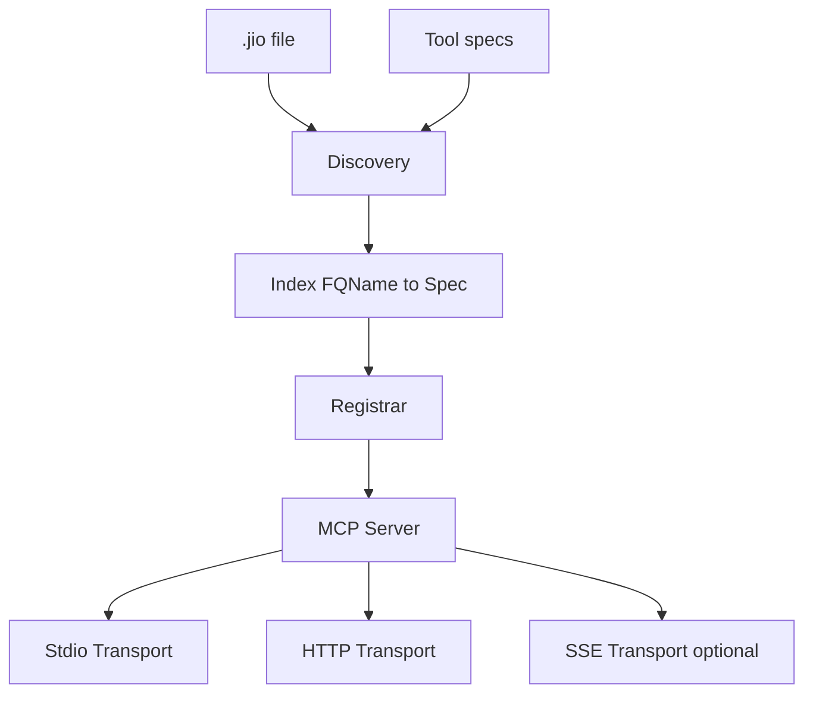
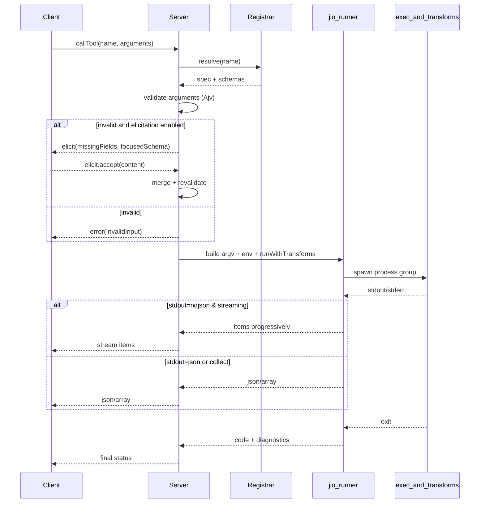
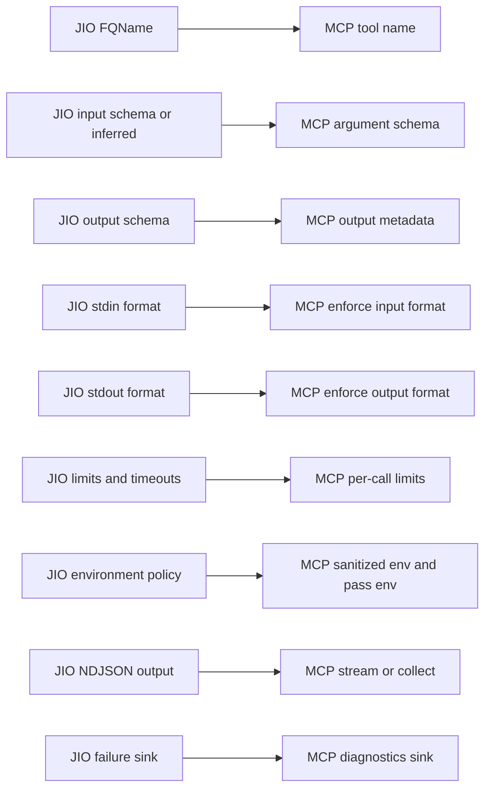
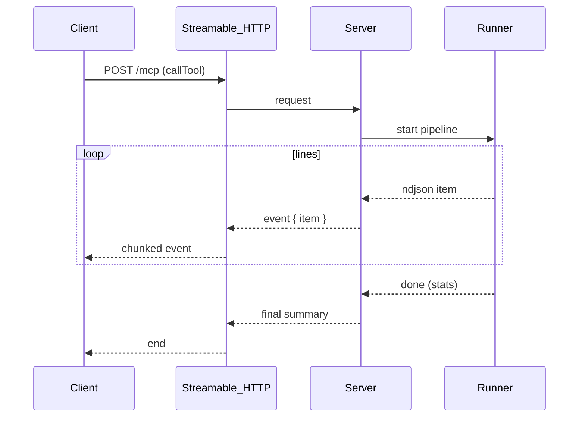
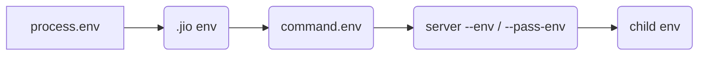

### jio MCP Server Design (jio --mcp-server)

This document specifies a new jio mode, `jio --mcp-server`, which launches an MCP server that exposes every discovered jio tool as an MCP tool, using the official TypeScript SDK. The mapping from jio specs to MCP is natural thanks to JSON Schema alignment for inputs and well-defined JSON/NDJSON outputs.

Reference SDK: https://github.com/modelcontextprotocol/typescript-sdk

## Objectives

- Zero‑config: turn a repo with `*.tool.json` into an MCP server.
- Preserve jio guarantees: deterministic argv, streaming transforms, schemas, limits, timeouts, sanitized env.
- Provide excellent client UX: explicit schemas, optional elicitation, streaming where possible.

## High-level Architecture



- Discovery/build index reuse jio’s existing logic.
- Registrar maps each jio spec to an MCP tool:
  - name: FQName
  - schema: `tool.inputSchema` or inferred
  - handler: invoke jio runner with proper limits/env/timeout
  - metadata: description, output schema (for docs/validation on client side)

## Request Lifecycle



## CLI Interface

```text
jio --mcp-server [--transport=stdio|http] [--http-port=3000] [--http-host=127.0.0.1]
                 [--clean-env|--no-clean-env]
                 [--pass-env NAME]... [--env NAME=VALUE]...
                 [--timeout-ms N]
                 [--max-stdin-bytes N] [--max-stdout-json-bytes N]
                 [--max-ndjson-line-bytes N] [--max-argv-tokens N] [--max-argv-bytes N]
                 [--max-concurrent-calls N] [--queue-size N] [--queue-timeout-ms N]
                 [--max-items-per-call N] [--collect-bytes N]
                 [--default-collect] [--strict-ndjson] [--safe-mode]
                 [--log-level=info|debug]
```

## Capability Model

- tools: expose every jio tool as an MCP tool.
- elicitation (optional): interactively complete missing inputs.
- resources (optional): expose spec files read‑only for transparency.
- prompts (optional): helper prompts such as `list-tools`/`explain-tool`.

## Mapping: jio → MCP



## Handler Semantics

1. Resolve tool by FQName; load spec (cached) and schemas.
2. Validate MCP arguments against `tool.inputSchema` (or inferred):
   - On failure: either elicit (if enabled) or return an error.
3. Build argv via jio `buildArgv(spec, args)`; enforce argv caps.
4. Build env with `buildChildEnv`:
   - Clean env defaults; preserve `LANG`, `LC_ALL`, `SSL_CERT_FILE`, `GIT_SSH_COMMAND`, `SSH_AUTH_SOCK`, etc.
   - Apply `.jio.env`, `command.env`, and MCP server `--pass-env` (supports globs) and `--env` overlays.
5. Run via `runWithTransforms` with merged limits and timeouts; set up group kill and graceful shutdown.
6. Output mapping:
   - `stdoutTransform.format=json`: return object; optionally validate against `tool.outputSchema` (on failure → error or sink).
   - `ndjson`: stream items (Streamable HTTP) or collect to a JSON array (default if `--default-collect`).
7. Errors: map jio exit precedence to MCP error taxonomy:
   - 1 (input validation) → InvalidInput
   - 65 (transform parsing/JSON validation) → TransformError
   - 66 (in file missing) → NotFound
   - 69 (spawn error) → SpawnError
   - 78 (config/limits) → ConfigError
   - 124 (timeout) → Timeout

## Streaming Model (HTTP)



Cancellation: client closes the stream → Server aborts with SIGTERM → after 5s, SIGKILL.

### Control messages and elicitation (PR5)

- Tools may emit special control objects via stdout:
  - NDJSON line or final JSON document containing `"$jio.ctl": true` and optionally `"$jio.ctl.elicit": { ... }`.
- Server behavior:
  - JSON mode (non‑streaming): if the final document is a control message, the server returns a success‑shaped response with `result.control.elicit` instead of `structuredContent`.
  - NDJSON mode (streaming/SSE): previously streamed items may already be delivered; on the first control line, the server stops the tool and returns `result.control.elicit` in the final JSON‑RPC frame.
  - ignoreControlMessages: when `command.ignoreControlMessages=true` (or per‑call `_meta.ignoreControlMessages=true`), the server does not interpret control messages and passes them through as normal output.
  - NDJSON wrapping: collected NDJSON responses are wrapped as an object `{ items: [...] }`, so `structuredContent` is always an object for MCP SDK parsing.

### Cancellation result semantics

- When a request is cancelled via `notifications/cancelled { requestId }`, the server attempts to terminate the underlying process group (stdin close, SIGTERM, then SIGKILL after 5s).
- The call resolves with an error result (non‑zero exit mapped to MCP error), and no final `notifications/progress` “done” message is emitted.

## Elicitation (Optional)

When Ajv reports missing/invalid fields, the server can send an elicitation request (message + focused schema) allowing the client to complete or correct arguments. This follows the SDK’s elicitation pattern (see examples in the SDK repo: https://github.com/modelcontextprotocol/typescript-sdk). If the client declines, the server returns a structured InvalidInput error.

## Resources & Prompts (Optional)

- Resources: register spec paths, `readResource` returns the spec JSON; useful for audit and documentation.
- Prompts:
  - `list-tools`: friendly listing with short descriptions and paths.
  - `explain-tool {name}`: parameters, input/output schema summaries, example invocations.

## Safety & Policy

- Safe mode: `--safe-mode` disallows shell transforms; only pass through stdout and validate formats, for hardened deployments.
- Name collisions: jio already errors on duplicate FQNames; MCP server startup fails with a clear diagnostic.
- Logging: `--log-level=debug` enables structured JSON logs for spawn/terminate/exit and sink summaries.
- HTTP transport is localhost-only by default (`--http-host=127.0.0.1`). To bind externally, specify `--http-host` explicitly.
- Strict streaming caps: NDJSON/streaming responses enforce hard limits by default (per-call item cap via `--max-items-per-call`, byte caps via `--max-stdout-json-bytes`/`--max-ndjson-line-bytes`). On cap breach, the server terminates the call with a structured error and summary.

## Environment knobs

- `JIO_MCP_HTTP_JSON_RESPONSE`: when set to `1`, the HTTP MCP transport responds with JSON bodies instead of SSE streams. Useful for debugging and simple clients.
- `JIO_MCP_PROGRESS`: when set to `0`, progress notifications are disabled even when clients provide a `_meta.progressToken`.

## Server limits and concurrency

Server-level knobs can override per-spec limits and control throughput:

- Limits (precedence: server flag > spec default):
  - `--max-stdin-bytes N`
  - `--max-stdout-json-bytes N`
  - `--max-ndjson-line-bytes N`
  - `--max-argv-tokens N`
  - `--max-argv-bytes N`
  - `--max-items-per-call N` (collectItems)
  - `--collect-bytes N` (collectBytes)
- Concurrency:
  - `--max-concurrent-calls N` (default: unlimited)
  - `--queue-size N` (default: 0 → immediate rejection when full)
  - `--queue-timeout-ms N` (default: 0)

Behavior:

- When the server is busy and queue is full, requests are rejected (HTTP 503/SSE error; stdio: MCP error).
- With a non-zero queue, waiting requests are admitted FIFO up to `queue-size`; if not admitted before `queue-timeout-ms`, they are rejected.

## Configuration Precedence



- Limits precedence: server CLI overrides > spec defaults.
- Env precedence: process → `.jio.env` → `command.env` → server `--env`/`--pass-env`.

## Minimal Implementation Sketch

```ts
import { McpServer } from "@modelcontextprotocol/sdk/server/mcp.js";
import { StdioServerTransport } from "@modelcontextprotocol/sdk/server/stdio.js";
// import { StreamableHTTPServerTransport } from "@modelcontextprotocol/sdk/server/streamableHttp.js";

async function main() {
  const server = new McpServer({ name: "jio-mcp", version: await readVersion() });
  const { specs } = await discoverJioTools();

  for (const [fq, spec] of specs) {
    server.tool({
      name: fq,
      description: spec.tool?.description || fq,
      schema: spec.tool?.inputSchema || generateInputSchemaFromParameters(spec),
      handler: async ({ args, signal, log }) => {
        // 1) validate args (Ajv), optionally elicit
        // 2) build argv + env (clean env + passEnv globs)
        // 3) runWithTransforms with limits/timeouts
        // 4) return json or array (collect or stream)
        return { type: "json", ok: true };
      },
    });
  }

  const transport = new StdioServerTransport();
  await server.connect(transport);
}
```

## Error Taxonomy

- InvalidInput (Ajv error; optionally elicitation flow)
- TransformError (stdin/stdout parsing/validation failures, exit 65)
- NotFound (`--in` ENOENT)
- SpawnError (exec/transform spawn failure, exit 69)
- ConfigError (argv/limits/format), exit 78
- Timeout (exit 124)

## Testing Strategy

- Unit:
  - tool registration (names, schemas)
  - Ajv validation and elicitation path
  - env policy (clean env, passEnv exact and glob)
  - limits/timeout precedence

- Integration:
  - stdio transport: call tools, verify JSON/NDJSON outputs (collect)
  - HTTP transport: stream NDJSON items; cancel mid‑stream
  - failure sink invoked on invalid output; caps respected
  - duplicate tools fail startup

- E2E:
  - clients list tools and call with valid/invalid inputs
  - large streams respect `max*` caps and produce expected exit codes

## Phased Rollout

1. Stdio transport, non‑streaming NDJSON (collect) + JSON; no elicitation.
2. Streamable HTTP with progressive item streaming + cancellation.
3. Elicitation support; resources and prompts; `--safe-mode` profile.
4. Docs: add “Using jio as an MCP server” to the user manual.

---

This design leverages the MCP TypeScript SDK’s primitives for server and transports, while reusing jio’s solid core (discovery, argv building, transforms, validation, limits, and termination) to provide a schema‑first, streaming‑capable tool surface to MCP clients.

### Proposed PR scopes

To land this feature with minimal risk and clear review boundaries, we will split the work into focused PRs. Each PR will include tests (unit and/or integration) and will keep behavior stable for existing `jio` CLI usage unless explicitly noted.

The implementation will be split into focused PRs to ensure clear review boundaries and maintain stability for existing `jio` CLI usage. Each PR will include comprehensive tests and preserve backward compatibility unless explicitly noted.

**PR 1: Core refactor for reuse (no behavior change)**

- Extract and export internal APIs from the runner so the server can reuse them without invoking the CLI: `buildIndex` (discovery), `readSpec`, `generateInputSchemaFromParameters`, `buildArgv`, `buildChildEnv`, `runWithTransforms`.
- Light module splits if needed (e.g., `tools/jio/core/{discovery,argv,env,run}.ts`) while preserving public CLI behavior.
- Tests: unit coverage for discovery, argv rendering edge cases, env passthrough globbing; keep existing tests green.

**PR 2: MCP server skeleton + stdio transport (JSON and collected NDJSON only)**

- Add `tools/jio/mcp/server.ts` implementing minimal server using `@modelcontextprotocol/sdk` with stdio transport.
- Add `jio --mcp-server` CLI flag wiring to start the server; reuse discovery to register tools with inferred or explicit input schemas.
- Handler path: validate args with Ajv, build argv/env, call `runWithTransforms` with `collect=true` for NDJSON, return JSON/array to MCP client. Map exit codes to MCP error taxonomy.
- Tests: unit for registration and error mapping; integration test invoking a simple JSON and NDJSON tool via stdio transport.

**PR 3: HTTP transport with progressive NDJSON streaming and cancellation**

- Add optional HTTP transport (`--transport=http --http-port/--http-host`) using SDK's streamable HTTP server; stream NDJSON items progressively, collect JSON documents.
- Implement request-scoped abort → SIGTERM → SIGKILL after 5s.
- Tests: integration for streaming, backpressure tolerance, and mid-stream cancellation.

**PR 4: Server-level limits, caps, and concurrency controls**

- Expose server flags for limits and precedence over spec defaults: `--max-stdin-bytes`, `--max-stdout-json-bytes`, `--max-ndjson-line-bytes`, `--max-argv-*`, `--max-items-per-call`, `--timeout-ms`, `--max-concurrent-calls` (queue excess).
- Thread these into `runWithTransforms` runtime options; enforce per-call caps and fair queuing.
- Tests: unit for precedence and cap breaches; integration for concurrent requests and queue behavior.

**PR 5: Elicitation support (optional)**

- When Ajv reports invalid/missing args and elicitation is enabled, send an elicitation request (message + focused schema) and accept updated args; otherwise return InvalidInput.
- Tests: unit for elicitation decisioning; integration covering accept/decline flows.

**PR 6: Resources and prompts (optional)**

- Register read-only resources for spec files; implement helper prompts `list-tools` and `explain-tool {name}`.
- Tests: unit for resource resolution; integration for prompts returning expected summaries.

**PR 7: Safe mode and policy hardening**

- `--safe-mode` disallows shell transforms at runtime; only pass through stdout and enforce formats. Validate configuration at startup and per-call.
- Tighten name collision handling and logging controls (`--log-level`).
- Tests: unit for safe-mode enforcement; integration ensuring transforms are blocked while passthrough still works.

**PR 8: Env policy surface for server**

- Add server `--clean-env|--no-clean-env`, `--pass-env NAME|GLOB`, and `--env NAME=VALUE` overlays; reuse `buildChildEnv` with precedence: process → `.jio.env` → `command.env` → server flags.
- Tests: unit for exact and glob passthrough; integration for precedence and sanitization.

**PR 9: Robustness and diagnostics**

- Improve structured diagnostics for spawn/terminate/sink summaries; propagate sink diagnostics in server logs at `--log-level=debug`.
- Harden edge cases (BOM stripping, CRLF, trailing NDJSON without newline) in server return paths as needed.
- Tests: targeted cases for diagnostics and tricky stream edges.

**PR 10: Documentation and examples**

- Update `jio-user-manual.md` with "Using jio as an MCP server" section, including stdio and HTTP usage, limits, env policy, and streaming behaviors.
- Add small example specs and a smoke script to demonstrate MCP client calls against the server.
- Tests: lightweight e2e example in CI invoking the server in stdio mode.
