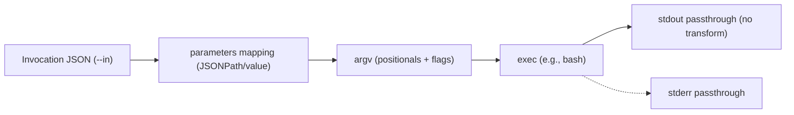
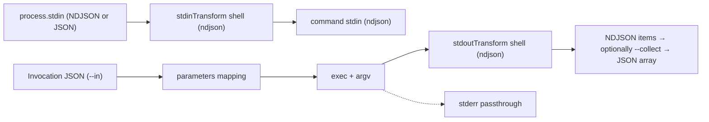
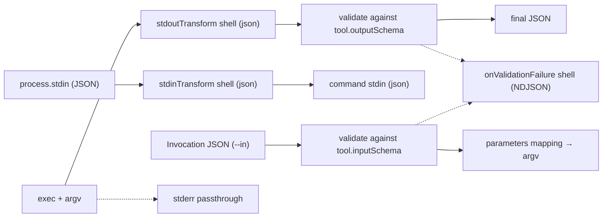

### jio User Manual

This guide helps you integrate jio into your workflow. It focuses on practical usage: how to define tools, run them, pass inputs, stream data, validate schemas, manage environment, handle limits/timeouts, and troubleshoot.

This manual applies to macOS/Linux (POSIX). Windows is not supported.

## Overview

**jio** turns existing CLIs into predictable, JSON‑first building blocks. You describe how a tool should be invoked and how its input/output are shaped, and jio runs it once with strong guarantees around streaming, validation, limits, timeouts, and environment hygiene.

### What jio is

- **A declarative spec for CLI invocation**: map JSON to argv; optionally run shell transforms on stdin/stdout.
- **A JSON/NDJSON adaptor**: enforce formats and validate with JSON Schema.
- **A streaming runner**: honors backpressure; avoids buffering large streams except where necessary (single JSON document modes with explicit caps).
- **A safety wrapper**: applies resource limits, timeouts with graceful termination, and minimized environments by default.

### What jio is not

- Not a general workflow engine or scheduler (no DAGs, retries, scheduling).
- Not a replacement for `jq`/`awk`/`sed` (it can call them; it doesn’t reimplement them).
- Not a build system (no caching/incremental compilation rules).
- Not an RPC server/client (no network service built‑in; it wraps CLIs you already use).

### How it compares

- **vs jq/yq**: Those transform JSON/YAML; jio orchestrates CLI IO and validation around them. You can use jq/yq inside jio transforms.
- **vs bash/make**: Bash can do everything imperatively; jio adds a small, explicit, reusable spec that’s easier to share and validate. Make builds dependency graphs; jio focuses on single invocations with clear IO contracts.
- **vs task runners (npm scripts, just, make)**: Those run commands but don’t give you JSON IO contracts, schema validation, or streaming/limits semantics out of the box.
- **vs ETL/orchestration frameworks**: jio is lightweight and local, not a distributed pipeline manager. Use it where you want simple, reliable, JSON‑based CLI interop.

### Example use cases

- Wrap `curl` to always emit structured JSON and validate responses.
- Wrap `gh`/`kubectl`/`git` invocations with stable parameters and JSON output.
- Convert NDJSON logs with a transform and collect them into arrays for further processing.
- Gate CLI outputs behind JSON Schema for safer scripting in CI/CD.
- Normalize environment for tools that break under inherited shells by defaulting to a clean env.

### Core guarantees you can rely on

- Single command execution per invocation (transforms may be separate processes, but your target command runs once).
- Streaming IO with backpressure; caps and limits avoid unbounded memory use.
- Strict format enforcement: NDJSON lines or single JSON documents as declared.
- JSON Schema validation for input (`--in`) and output (when specified).
- Resource controls: argv/line/document size caps; timeouts with SIGTERM→SIGKILL.
- Deterministic argv construction from explicit mappings; no templating surprises.
- Sanitized environment by default with opt‑in passthrough.

## What is jio?

jio is a thin, declarative wrapper that lets you present existing command‑line tools as JSON‑first utilities.

- Accept JSON or NDJSON input
- Map JSON fields to argv (positionals and/or flags)
- Optionally transform stdin/stdout via shell snippets
- Validate input and output with JSON Schema
- Stream data without buffering everything in memory

You define each tool in a `*.tool.json` spec and run it with `jio <toolRef>`.

## Quick start

If you’re new to jio, the quickest path is to declare a default package, write a minimal tool spec, and run it with a tiny invocation object. The steps below walk through that flow so you can see how a spec becomes a concrete command invocation.

1. Create a `.jio` file at your repo root:

```json
{ "defaultPackage": "io.example" }
```

2. Define a tool spec, for example `tools/echo.tool.json`:

```json
{
  "tool": { "name": "echo" },
  "command": {
    "package": "io.example",
    "exec": "echo",
    "parameters": {
      "msg": { "type": "string", "path": "$.message", "position": 1 }
    }
  }
}
```

3. Invoke it:

```bash
echo '{"message":"hello"}' > in.json
jio io.example.echo --in in.json --dry-run
jio io.example.echo --in in.json
```

`--dry-run` prints the planned `exec`, `argv`, `cwd`, and env keys; the second command executes it.

## Installation and environment

- jio is part of this repository’s toolchain and is available in the development shell.
- The CLI is named `jio`. Run `jio --help` and `jio --version` to verify.
- jio resolves the root directory by:
  1. `$JIO_ROOT` if set
  2. Otherwise, walking upward to find a `.jio` file
  3. Otherwise, using the current working directory

## Discovering tools

- `jio --list` prints discovered tools as `{package}.{name}`\t`/path/to/spec`.
- `jio --where <toolRef>` prints the path to the spec for the given tool.
- `<toolRef>` can be a fully‑qualified name (`{package}.{name}`) or a bare `name` if `.jio.defaultPackage` is configured.

The `.jio` file supports:

```json
{
  "configVersion": "1",
  "defaultPackage": "io.example",
  "ignore": ["node_modules/", ".git/", "dist/"],
  "globs": ["**/*.tool.json"],
  "excludeGlobs": ["**/deprecated/*.tool.json"],
  "env": { "GLOBAL_ENV": "1" }
}
```

- `globs`/`excludeGlobs` control which specs are scanned
- `env` is merged into all tool environments (see Environment handling)

## Spec structure (overview)

Every jio tool is described by a `*.tool.json` file. The `tool` section captures identity and optional schemas; the `command` section defines exactly how the underlying process is executed, how arguments are constructed, and how streaming transforms behave. Think of this as an executable contract that other scripts and teammates can reuse.

Each `*.tool.json` has two sections: `tool` and `command`.

```json
{
  "tool": {
    "name": "demo",
    "title": "Optional title",
    "description": "Optional description",
    "inputSchema": {
      /* JSON Schema for invocation JSON */
    },
    "outputSchema": {
      /* JSON Schema for final output */
    }
  },
  "command": {
    "package": "io.example",
    "exec": "bash",
    "workingDir": "./scripts",
    "inheritCallerCwd": false,
    "env": { "FOO": "BAR" },
    "envPassthrough": ["GIT_SSH_COMMAND"],
    "defaultBooleanStyle": "presence",
    "timeoutMs": 10000,
    "limits": {
      "maxArgvTokens": 4096,
      "maxArgvBytes": 262144,
      "maxStdinBytes": 16777216,
      "maxStdoutJsonBytes": 33554432,
      "maxNdjsonLineBytes": 1048576,
      "collectItems": 1000000,
      "collectBytes": 536870912,
      "sinkMaxBytes": 1048576,
      "sinkMaxItems": 1000,
      "sinkMaxRatePerSec": 100,
      "sinkWriteTimeoutMs": 500,
      "sinkCloseTimeoutMs": 1000
    },
    "parameters": {
      /* see next section */
    },
    "stdinTransform": { "shell": "jq -c '.items[]'", "format": "ndjson" },
    "stdoutTransform": { "shell": "jq -c .", "format": "ndjson" },
    "onValidationFailure": { "shell": "tee /dev/stderr > /dev/null" }
  }
}
```

## Mapping JSON to argv (parameters)

You declare how to build argv explicitly via `command.parameters`.

Parameters are the heart of jio. They translate fields from a small JSON object (provided via `--in`) into concrete argv tokens. By keeping this mapping explicit, jio avoids hidden conventions and produces deterministic command lines that are easy to audit with `--dry-run`.

Parameter fields:

- `path` (JSONPath) or `value` (literal); never both
- `type`: `string | number | boolean | array | object`
- `required`: error when missing unless `default` is provided
- `default`: value used when missing/null
- `position`: 1‑based positional index for non‑flag params (must be unique and positive)
- `flag`: set to true to render as a named flag
- `flagName`: required when `flag: true` (e.g., `"--name"`)
- `booleanStyle`: `"presence"` or `"equals"` (default `presence` or `command.defaultBooleanStyle`)
- `collectionStyle` for arrays/objects: `"repeatArg" | "repeatFlag" | "csv" | "kv" | "separate"`
- `csvSeparator`: character used when `collectionStyle: "csv"` (default ",")
- `flagValueStyle` (optional, for scalar and CSV cases): `"equals" | "separate"` controls `--flag=value` vs `--flag value`

JSONPath subset (RFC‑compatible):

To keep mappings safe and predictable, jio supports a conservative, RFC‑compatible subset of JSONPath. You’ll mostly use simple property selection, unions, and array steps; filter expressions and custom functions are intentionally disallowed.

- Property selectors: `$.a.b`, `$.a.*`
- Bracket string keys: `$['k']`, unions `$['a','b']`
- Arrays: `$[0]`, `$[1,3]`, `$[1:4]`, `$[*]`
- Not supported: filters (e.g. `?()`), custom functions, `@` current‑node.

Rendering rules and examples:

These patterns determine how values become argv tokens. They mirror common CLI styles so you can match the conventions of the tools you wrap. Use `--dry-run` to verify the resulting argv before executing.

- Order: positionals first (by `position`), then flags (sorted by `flagName` internally)
- String/number: as string tokens. With `flag: true`:
  - `flagValueStyle: "equals"` → `--name=value`
  - `flagValueStyle: "separate"` → `--name value`
- Boolean:
  - `presence` → `--flag` only when true; omitted when false
  - `equals` → `--flag=true|false`
- Arrays:
  - `repeatArg` → `cmd a b c`
  - `repeatFlag` → `--tag=a --tag=b --tag=c`
  - `separate` → `--label a --label b`
  - `csv` → join into one token, e.g., `a,b` or `--list=a,b` (use `flagValueStyle` to choose equals vs separate)
- Objects (`kv`): `--key=value` for each key (scalar values only)
- Empty arrays/objects are skipped unless `required: true`
- If `type` is not `array` but the JSONPath returns an array, jio fails with a configuration error
- Large numbers: jio warns if values exceed 2^53‑1 (JSON number precision)

## Input vs. data stream

jio has two input channels:

It helps to separate “configuration” (the small invocation object used for argv mapping) from “data” (the stream that flows through the tool). This separation lets you pass large datasets via stdin without bloating argv or conflating concerns.

1. Invocation JSON (for argv mapping)

- Provided via `--in file.json`
- Validated against `tool.inputSchema` if present
- Required when at least one parameter uses a `path`, is `required: true`, and has no `default`

2. Data stream on stdin (for `stdinTransform`)

- Piped from process stdin
- The transform’s output must match `stdinTransform.format` (`ndjson` or `json`)
- For `json` format, jio buffers the JSON document up to `maxStdinBytes`

These two inputs are independent. `--in` is not read from stdin.

## Transforms

Transforms are small shell snippets that adapt raw stdin/stdout streams to the JSON/NDJSON forms your tool expects or produces. They run as separate processes, and jio enforces the declared formats on their outputs, so you never accidentally feed non‑JSON to your command or emit malformed lines.

stdinTransform

- Runs a shell snippet (`/bin/sh -c` or `bash -c` when available) that receives the caller’s stdin
- jio enforces the declared `format` on the transform’s OUTPUT before passing it to the command
- Formats:
  - `ndjson`: jio parses line by line, skipping blank lines and tolerating CRLF; invalid lines fail the stage
  - `json`: jio concatenates, strips BOM if present, enforces `maxStdinBytes`, and parses once

stdoutTransform

- Receives the command’s stdout
- Must declare `format: "ndjson" | "json"` and jio enforces it
- If omitted, jio passes the command’s stdout through unmodified

Notes

- When executing `bash`, jio adds `--noprofile --norc` for isolation
- If `bash -c|-lc` is provided without a command, jio defaults to `cat` to pass input through

## End‑to‑end flow examples (with diagrams)

### A) argv‑only mapping (no transforms)

When you only map fields from invocation JSON into argv, jio just builds tokens and runs your command once.



Spec (excerpt):

```json
{
  "tool": { "name": "curl_get" },
  "command": {
    "package": "io.example",
    "exec": "curl",
    "parameters": {
      "url": { "type": "string", "path": "$.url", "position": 1 },
      "header": {
        "type": "array",
        "path": "$.headers[*]",
        "flag": true,
        "flagName": "-H",
        "collectionStyle": "separate"
      },
      "insecure": { "type": "boolean", "flag": true, "flagName": "-k", "default": false }
    }
  }
}
```

Invocation JSON (`--in inv.json`):

```json
{ "url": "https://example.com", "headers": ["Accept: application/json"] }
```

Resulting argv (conceptual):

```text
-lc curl https://example.com -H Accept: application/json
```

The actual spawned process is `exec: bash` with the argv list above.

### B) NDJSON streaming with collect

Common when you need to emit multiple JSON items and optionally collect them into one array.



Spec (excerpt):

```json
{
  "tool": { "name": "emit_items" },
  "command": {
    "package": "io.example",
    "exec": "jq",
    "parameters": {
      "filter": { "type": "string", "value": ".", "position": 1 }
    },
    "stdinTransform": { "shell": "jq -c '.items[]'", "format": "ndjson" },
    "stdoutTransform": { "shell": "jq -c .", "format": "ndjson" }
  }
}
```

Invocation JSON (`--in inv.json`):

```json
{ "items": [{ "i": 1 }, { "i": 2 }, { "i": 3 }] }
```

Usage:

```bash
jio io.example.emit --in inv.json --collect
```

Output (one JSON array due to `--collect`):

```json
[{ "i": 1 }, { "i": 2 }, { "i": 3 }]
```

If you omit `--collect`, the output is three NDJSON lines instead.

### C) JSON→JSON with schemas and a failure sink

This example validates input and output and routes validation failures to a sink.



Spec (excerpt):

```json
{
  "tool": {
    "name": "sum",
    "inputSchema": {
      "type": "object",
      "properties": { "nums": { "type": "array", "items": { "type": "number" } } },
      "required": ["nums"]
    },
    "outputSchema": {
      "type": "object",
      "properties": { "sum": { "type": "number" } },
      "required": ["sum"]
    }
  },
  "command": {
    "package": "io.example",
    "exec": "jq",
    "parameters": { "filter": { "type": "string", "value": "{sum:(.a+.b)}", "position": 1 } },
    "stdinTransform": {
      "shell": "jq -c '{a: (.nums[0] // 0), b: (.nums[1] // 0)}'",
      "format": "json"
    },
    "stdoutTransform": { "shell": "jq -c .", "format": "json" },
    "onValidationFailure": { "shell": "jq -c . >> failures.ndjson" }
  }
}
```

Invocation JSON:

```json
{ "nums": [40, 2] }
```

Run:

```bash
echo '{}' | jio io.example.sum --in inv.json
```

Flow:

- `stdinTransform` converts stdin `{}` to `{"a":40,"b":2}` using `--in` values
- Command computes `{"sum":42}`
- `stdoutTransform` keeps it as JSON; `tool.outputSchema` validates
- On any validation error, an NDJSON diagnostic is appended to `failures.ndjson`

### D) Parameter mapping — equals vs separate

Demonstrates `flagValueStyle` with scalars and CSV arrays.

```json
{
  "tool": { "name": "opts" },
  "command": {
    "package": "io.example",
    "exec": "printf",
    "parameters": {
      "format": { "type": "string", "value": "%s\n", "position": 1 },
      "nameEq": {
        "type": "string",
        "flag": true,
        "flagName": "--name",
        "flagValueStyle": "equals",
        "value": "alice"
      },
      "nameSep": {
        "type": "string",
        "flag": true,
        "flagName": "--name",
        "flagValueStyle": "separate",
        "value": "bob"
      },
      "listCsvEq": {
        "type": "array",
        "flag": true,
        "flagName": "--list",
        "collectionStyle": "csv",
        "csvSeparator": ",",
        "flagValueStyle": "equals",
        "value": [1, 2, 3]
      },
      "listCsvSep": {
        "type": "array",
        "flag": true,
        "flagName": "--list",
        "collectionStyle": "csv",
        "csvSeparator": ",",
        "flagValueStyle": "separate",
        "value": [4, 5]
      }
    }
  }
}
```

Resulting argv (conceptual):

```text
printf --name=alice --name bob --list=1,2,3 --list 4,5
```

### E) RepeatFlag vs separate for arrays

```json
{
  "tool": { "name": "tagged_request" },
  "command": {
    "package": "io.example",
    "exec": "curl",
    "parameters": {
      "url": { "type": "string", "value": "https://example.com", "position": 1 },
      "tagsRepeat": {
        "path": "$.tags",
        "type": "array",
        "flag": true,
        "flagName": "-H",
        "collectionStyle": "repeatFlag"
      },
      "labelsSep": {
        "path": "$.labels",
        "type": "array",
        "flag": true,
        "flagName": "--label",
        "collectionStyle": "separate"
      }
    }
  }
}
```

Invocation JSON:

```json
{ "tags": ["x", "y"], "labels": ["red", "blue"] }
```

Resulting argv (conceptual):

```text
--tag=x --tag=y --label red --label blue
```

## Output handling and validation

Validation turns ad‑hoc scripts into reliable building blocks. When you declare `outputSchema`, jio checks each emitted item (for NDJSON) or the entire document (for JSON) so downstream tooling can trust the shape of the data. You control whether invalid NDJSON lines merely log to a sink or whether JSON document errors fail the stage.

With `tool.outputSchema`:

- For `stdoutTransform.format: "ndjson"`: each item is validated; invalid items are reported to stderr and written to the failure sink (if configured) but do not abort the stream
- For "json": the single JSON document is validated; on failure, the stage fails

NDJSON specifics

- `--collect` or `--collect-ndjson` converts the NDJSON stream into a single JSON array on stdout
- You can cap collection with `--collect-limit N` and `--collect-bytes N` (or via spec `limits`)
- jio enforces per‑line limits: `maxNdjsonLineBytes`

JSON document specifics

- jio enforces `maxStdoutJsonBytes` while buffering the JSON document

## Environment handling

By default, jio runs children with a minimal, sanitized environment (`--clean-env`).

Many flaky CI issues stem from accidental environment inheritance. jio defaults to a clean env (with sensible keep‑lists) so your tools behave consistently across shells and machines. You can still pass through exactly what you need, either explicitly or via safe globs.

Preserved by default:

- `PATH`, `WORKSPACE_ROOT`, `NODE_BIN`, `NODE_OPTIONS`, `NODE_PATH`, `HOME`, `TMPDIR`, `TEMP`, `TMP`
- Locale/SSL/SSH defaults: `LANG`, `LC_ALL`, `SSL_CERT_FILE`, `GIT_SSH_COMMAND`, `SSH_AUTH_SOCK`

Ways to pass additional env:

- Root `.jio.env` merges into all tools
- Per‑tool `command.env` merges over root env
- CLI `--env NAME=VALUE` can set variables per invocation
- `--pass-env NAME` (repeatable) copies variables from the parent environment; supports glob patterns like `AWS_*` and `GCP_*`
- `command.envPassthrough` (array) whitelists parent variables when `--clean-env` is in effect

Disable cleaning:

- `--no-clean-env` runs with the parent environment (still overlaying `.jio.env`, `command.env`, and `--env`)

## Timeouts and termination

Long‑running processes happen. jio applies a clear, two‑phase timeout strategy so handlers can flush and children can shut down gracefully before a hard kill. This makes timeouts observable and recoverable in pipelines.

- Configure `command.timeoutMs` (spec) or override with `--timeout-ms N`
- On timeout, jio:
  1. signals SIGTERM to the process group (or descendant PIDs)
  2. prints a single timeout note to stderr
  3. after 5s, escalates to SIGKILL
- Exit status for timeouts: `124`

## Limits and resource caps

Spec/CLI options (CLI overrides spec limits):

Input spikes and huge outputs are a fact of life. Limits help you contain risk and detect misconfigurations early. You can tune caps per spec and override them per run to strike the right balance between safety and throughput.

- `--max-argv-tokens N`, `--max-argv-bytes N`
- `--max-stdin-bytes N`
- `--max-stdout-json-bytes N`
- `--max-ndjson-line-bytes N`
- `--collect-limit N`, `--collect-bytes N`

Failure sink limits (for `onValidationFailure`):

- `sinkMaxBytes` (default 1MiB), `sinkMaxItems` (default 1000), `sinkMaxRatePerSec` (default 100/s)
- `sinkWriteTimeoutMs` (default 500ms), `sinkCloseTimeoutMs` (default 1000ms)

## Failure sink (onValidationFailure)

If `command.onValidationFailure.shell` is set, jio starts the sink process. jio writes structured NDJSON objects to the sink for:

Think of the failure sink as your “black box recorder” for malformed inputs or outputs. It’s decoupled from the main data path, runs with the same sanitized env, and provides a durable place to aggregate diagnostics without crashing successful runs.

- Input validation failures: `{ reason: "input", object: <invocation>, message: <ajv_error> }`
- Output validation or parse issues: `{ reason: "stdout"|"output"|"stdin", object: <snippet>, message: <text> }`

The sink runs with the same sanitized environment policy as the main command (respects `.jio.env`, `command.env`, `--env`, `envPassthrough`, and `--pass-env`).

Set `JIO_SINK_DEBUG=1` to emit a one‑line summary of drops and writes at shutdown.

## Secrets integration (optional)

If the repository root contains `secretspec.toml` and the `secretspec` binary is on PATH, jio will automatically wrap the execution as:

Secrets often live in environment variables or external providers. If you use SecretSpec, jio can automatically wrap your command so secrets are injected at runtime without baking them into specs or shell history.

```
secretspec run [--profile <env>] [--provider <name>] -- <exec> <argv...>
```

You can force enabling/disablement via environment:

- `JIO_SECRETS=1` forces wrapping
- `JIO_SECRETS_DISABLE=1` disables wrapping

If `secretspec.toml` exists but the binary is missing, jio prints a warning and continues without wrapping.

## CLI reference

```
jio <toolRef> [--in file.json] [--dry-run] [--list] [--where <toolRef>]

Flags:
  -h, --help                     Show help
  -v, --version                  Show version
      --list                     List discovered tools (FQName -> path)
      --where REF                Print the path to the tool spec for REF
      --in FILE                  Invocation JSON file
      --dry-run                  Print plan without executing
      --collect|--collect-ndjson For ndjson output, return a single JSON array
      --collect-limit N          Max items to collect before failing
      --collect-bytes N          Max bytes to collect before failing
      --timeout-ms N             Override spec timeout (ms)
      --max-argv-tokens N        Cap number of argv tokens
      --max-argv-bytes N         Cap total argv bytes
      --max-stdin-bytes N        Cap bytes read from stdin
      --max-stdout-json-bytes N  Cap size of JSON output
      --max-ndjson-line-bytes N  Cap per-line NDJSON bytes
      --clean-env | --no-clean-env  Minimal env by default; disable to passthrough all
      --pass-env NAME            Pass env var from parent (repeatable; supports globs)
      --env NAME=VALUE           Set explicit env var for child (repeatable)
      --input-schema             Print effective input schema (explicit or inferred)
      --output-schema            Print output schema; non-zero exit if absent

Environment:
  JIO_SINK_DEBUG=1   Emit failure sink summary line at shutdown
```

## Exit codes (for automation)

When integrating jio into scripts and CI, rely on these exit codes to branch logic. Configuration/limits errors (78) are distinct from parse/validation errors (65) and timeouts (124), making it straightforward to emit targeted guidance or retries.

- `0` success (or child exit code when non-zero is propagated)
- `1` input validation failure
- `65` transform parse error or JSON output validation error
- `66` `--in` file not found (ENOENT)
- `69` spawn failure (e.g., missing binary)
- `78` configuration/limits error (argv/limits/format issues)
- `124` timeout

## Examples

The following examples are pragmatic patterns we see most often in practice. Use them as templates and adapt parameter styles to the conventions of the tools you wrap.

Positional and booleans

```json
{
  "tool": { "name": "ls" },
  "command": {
    "package": "io.example",
    "exec": "bash",
    "parameters": {
      "sub": { "type": "string", "value": "-lc", "position": 1 },
      "cmd": { "type": "string", "value": "ls", "position": 2 },
      "all": { "type": "boolean", "flag": true, "flagName": "-a", "default": true },
      "long": { "type": "boolean", "flag": true, "flagName": "-l", "default": true }
    },
    "stdoutTransform": { "shell": "jq -c .", "format": "ndjson" }
  }
}
```

Array flags (repeatFlag, separate, csv)

```json
{
  "tool": { "name": "label" },
  "command": {
    "package": "io.example",
    "exec": "bash",
    "parameters": {
      "sub": { "type": "string", "value": "-lc", "position": 1 },
      "cmd": { "type": "string", "value": "printf '%s' '{}'", "position": 2 },
      "labelsRepeat": {
        "path": "$.labels",
        "type": "array",
        "flag": true,
        "flagName": "--label",
        "collectionStyle": "repeatFlag"
      },
      "labelsSep": {
        "path": "$.labels",
        "type": "array",
        "flag": true,
        "flagName": "--label",
        "collectionStyle": "separate"
      },
      "labelsCsv": {
        "path": "$.labels",
        "type": "array",
        "flag": true,
        "flagName": "--label",
        "collectionStyle": "csv",
        "csvSeparator": ",",
        "flagValueStyle": "equals"
      }
    },
    "stdoutTransform": { "shell": "cat", "format": "json" }
  }
}
```

JSONPath union + CSV positional

```json
{
  "tool": { "name": "clone" },
  "command": {
    "package": "io.gh",
    "exec": "bash",
    "parameters": {
      "sub": { "type": "string", "value": "-lc", "position": 1 },
      "repo": {
        "path": "$['owner','repo']",
        "type": "array",
        "position": 2,
        "collectionStyle": "csv",
        "csvSeparator": "/"
      }
    },
    "stdoutTransform": { "shell": "jq -c .", "format": "ndjson" }
  }
}
```

## Troubleshooting

- "tool not found"
  - Ensure your `.jio` file sets `defaultPackage` for bare names or use fully‑qualified names
  - Run `jio --list` to see discovered tools and paths; check `globs`/`excludeGlobs`

- "invalid input"
  - Your invocation JSON (`--in`) didn’t pass `tool.inputSchema` – jio prints the first validation error to stderr. Exit code: `1`.

- "invalid NDJSON line" / "invalid JSON output"
  - For NDJSON, invalid lines are logged and sent to the failure sink but don’t stop the stream
  - For JSON, validation or parse failures abort the stage and exit with `65`

- "stdin/ndjson/json bytes limit exceeded"
  - Increase the corresponding `--max-*` flag or the spec `limits`

- "argv tokens/bytes limit exceeded"
  - Reduce your parameter expansion or increase `--max-argv-*`

- Timeouts
  - Increase `--timeout-ms` or reduce runtime; review logs for the timeout message; exit `124`

- Secrets wrapper message
  - If `secretspec.toml` exists but the `secretspec` binary is missing, jio warns and proceeds without wrapping

## Best practices

- Keep `inputSchema` and `outputSchema` tight for early error detection
- Prefer `repeatFlag` or `separate` for arrays when your CLI expects multiple flags
- Use `flagValueStyle` when a CLI requires `--flag value` instead of `--flag=value`
- Be mindful of numeric precision; pass large integers as strings when required by the underlying CLI
- For large NDJSON, consider `--collect` only when you truly need a single JSON array
- Use `--dry-run` to audit env keys, argv, and working directory before executing

## Reference: printing schemas

- `--input-schema` prints the effective input schema (explicit or inferred from parameter mappings)
- `--output-schema` prints the output schema (exits non‑zero if absent)
- Using both flags prints `{ inputSchema, outputSchema }` (non‑zero if `outputSchema` absent)

## Reference: `--dry-run` output

`jio --dry-run` prints a JSON object like:

```json
{
  "exec": "bash",
  "argv": ["-lc", "..."],
  "cwd": "/abs/path",
  "envKeys": ["HOME", "LANG", "PATH", ...],
  "stdoutTransform": "jq -c .",
  "stdinTransform": "jq -c '.items[]'"
}
```

## Safety and IO behavior

- EPIPE on stdout/stderr: jio exits 0 like standard UNIX tools
- jio tolerates blank lines and CRLF in NDJSON streams
- BOM (UTF‑8) is stripped on the first NDJSON line and at the start of JSON documents
- stderr from all stages is passed through to the user

## Platform support

POSIX systems (macOS/Linux). Windows is not supported.
