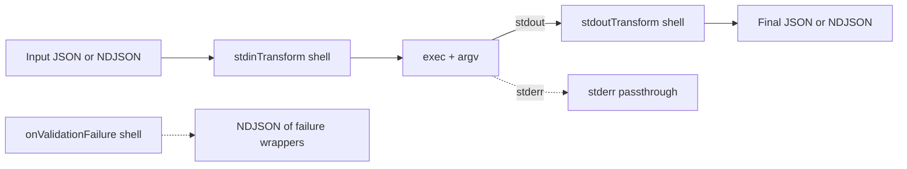

# JIO Specification (formerly JSON-CLI)

> **Scope**: This document specifies the **jio** tool (formerly jio) and the structure of `*.tool.json` files.

### Top-level metadata (required/recommended)

At the top-level of each `*.tool.json` file, include the following metadata:

- `"specVersion": "1.0.0"` **(required)** — version of this specification understood by the runner.
- `"jsonPathDialect": "jsonpath-plus@8"` — declares the JSONPath dialect (see §4).
- `"schemaDialect": "https://json-schema.org/draft/2020-12/schema"` — schema dialect for `inputSchema`/`outputSchema`.

Runners MUST reject specs whose `specVersion` major is unsupported.

---

## Why jio exists

Many CLI tools don’t speak JSON. **jio** is a thin, declarative wrapper that makes them behave like JSON-first APIs:

1. Accept **JSON** or **NDJSON** input.
2. Map JSON fields to **argv** (positional and/or flags).
3. Optionally transform the input stream into the command’s **stdin** (`stdinTransform`).
4. Run the command **once** per invocation.
5. Transform command **stdout** into **JSON/NDJSON** (`stdoutTransform`).
6. Validate input/output against JSON Schema.
7. Optionally route validation failures to a handler (`onValidationFailure`).

Design goals: small surface area, streaming-friendly, minimal reinvention of shell semantics, explicit mappings rather than magic.

> **Platform support**: POSIX (Linux/macOS). **Windows is not supported.**

---

## At a glance



- **Single process invocation**: The command is started **once**.
- **Streaming**: NDJSON flows through `stdinTransform` → command stdin; command stdout flows into `stdoutTransform` (if present) and back out as JSON/NDJSON. If `stdoutTransform` is omitted, command stdout is passed through unmodified.
- **Validation failures** (input or output) can be routed to `onValidationFailure` as **NDJSON** items.

---

## 1) Discovery & Resolution

### Root directory

Resolve the root directory in this order:

1. If `$JIO_ROOT` is set → use it.
2. Else, walk upward from the current working directory until a file named **`.jio`** is found; use its directory.
3. Else, use the current working directory.

### Root file: `.jio` (optional)

```json
{
  "defaultPackage": "io.example",
  "ignore": ["node_modules/", ".git/", "dist/"],
  "globs": ["**/*.tool.json"],
  "excludeGlobs": ["**/deprecated/*.tool.json"],
  "env": { "GLOBAL_ENV": "1" }
}
```

- `defaultPackage`: used when a tool is invoked by a bare `name` (no dot).
- `ignore`: directory prefixes to skip during scanning.
- `globs` / `excludeGlobs`: control which `*.tool.json` files are loaded.
- `env`: environment variables applied to **all** tools (merged with the process env and overridden by per-tool `command.env`).

### Loading tools & building the index

- Scan the root per the config above.
- Parse every matching `*.tool.json` file.
- Validate each file against the **Formal Schema** (§12).
- Compute **FQName** = `{command.package}.{tool.name}` for each tool.
- Build an index keyed by FQName; **error** on duplicates.

### Selecting a tool to run

CLI form:

```
jio <toolRef> [--in file.json] [--dry-run] [--list] [--where <toolRef>]
```

- `<toolRef>` is either `{package}.{name}` or a **bare `name`**.
- Bare `name` resolves via `.jio.defaultPackage` → FQName `{defaultPackage}.{name}`.
- Input can be provided with `--in file.json` or via stdin. If both are present, `--in` wins.

---

## 2) Spec structure

The spec has two siblings: **`tool`** and **`command`**.

### `tool` (identity & schemas)

- `name` — short identifier within the package (used in FQName).
- `title` — human-friendly title.
- `description` — one- or two-sentence description.
- `inputSchema` — JSON Schema to validate incoming JSON/NDJSON. Validate _as fully as specified_ by the schema.
- `outputSchema` — JSON Schema to validate transformed output (JSON/NDJSON). Validate _as fully as specified_.

### `command` (process & transforms)

- `package` — reverse-DNS-like namespace (used in FQName).
- `exec` — the binary to run (e.g., `"scaf"`).
- `workingDir` (optional) — directory to spawn the process in.
  - Default resolution: relative paths are resolved **relative to the directory containing the `*.tool.json` file**, unless an absolute path is provided.
  - If `inheritCallerCwd: true`, relative paths (or an omitted `workingDir`) resolve relative to the caller’s current working directory.
  - Absolute paths are used as-is regardless of `inheritCallerCwd`.
- `env` (optional) — per-tool environment (merged over process env and `.jio.env`). **Precedence**: `process.env` < root `.jio.env` < per-tool `command.env`. In `--dry-run`, print env **keys only** and redact values matching `*_TOKEN`, `*_SECRET`, `*PASSWORD*`, etc. **Secrets** SHOULD be provided via [SecretSpec](https://github.com/cachix/secretspec) files and referenced by the runner rather than embedded directly.
- `defaultBooleanStyle` (optional) — `"presence"` (default) or `"equals"`.
- `parameters` — **explicit mapping** from JSON → argv (see §4).
- `stdinTransform` (optional) — shell pipeline that converts input JSON/NDJSON into **stdin** bytes for the command.
  - `shell`: executed with `/bin/sh -c "<shell>"`.
  - `format`: `"json"` | `"ndjson"` — **MUST be enforced**.
- `stdoutTransform` (required) — shell pipeline that converts stdout into **JSON/NDJSON**.
  - `shell`: e.g., `"jq -c ."`
  - `format`: `"json"` | `"ndjson"` describing what it emits.
- **Shell robustness example (recommended)**

```sh
# stdinTransform example
set -euo pipefail
jq -c '.[]' | sed 's/foo/bar/g'

# Or explicitly call bash with pipefail enabled:
bash -euo pipefail -c 'jq -c . | grep -v "^#"'
```

`onValidationFailure` (optional) — shell pipeline to receive **NDJSON** wrappers for validation failures:

- Each line is a JSON object:
  ```json
  { "reason": "input|stdin|stdout|output", "object": <offending>, "message": "details if any" }
  ```
- Implementations SHOULD keep streaming even when failures occur (except fatal cases like unreadable top-level input).
- `timeoutMs` (optional) — wall-clock deadline for the entire run.

> **Trust note**: Tool specs and transform shell strings are **trusted configurations**. Treat them like code (they run via `/bin/sh -c`).

---

## 3) Complete example

```json
{
  "tool": {
    "name": "new",
    "title": "Scaffold: create project",
    "description": "Wraps `scaf new` to scaffold a project using JSON input.",
    "inputSchema": {
      "type": "object",
      "properties": {
        "template": { "type": "string" },
        "exampleArg": { "type": "number" },
        "exampleFlag": { "type": "boolean" }
      },
      "required": ["template"]
    },
    "outputSchema": {
      "type": "object",
      "properties": {
        "level": { "type": "string" },
        "msg": { "type": "string" },
        "ts": { "type": "string" }
      },
      "required": ["level", "msg", "ts"]
    }
  },

  "command": {
    "package": "io.example.scaf",
    "exec": "scaf",
    "workingDir": "./",
    "env": { "SCHEMA": "enabled" },
    "defaultBooleanStyle": "presence",
    "timeoutMs": 60000,

    "parameters": {
      "subcommand": { "type": "string", "value": "new", "position": 1 },
      "template": { "path": "$.template", "type": "string", "required": true, "position": 2 },
      "exampleArg": {
        "path": "$.exampleArg",
        "type": "number",
        "flag": true,
        "flagName": "--example-arg"
      },
      "exampleFlag": {
        "path": "$.exampleFlag",
        "type": "boolean",
        "flag": true,
        "flagName": "--example-flag"
      }
    },

    "stdinTransform": {
      "shell": "jq -c .",
      "format": "ndjson"
    },

    "stdoutTransform": {
      "shell": "jq -c '.events[] | {level, msg, ts}'",
      "format": "ndjson"
    },

    "onValidationFailure": {
      "shell": "jq -c . >> errors.ndjson"
    }
  }
}
```

**Invocation example**

```bash
echo '{"template":"cli","exampleArg":123,"exampleFlag":true}' | jio scaf.new
# Resolves to FQName io.example.scaf.new
# Final argv: scaf new cli --example-arg=123 --example-flag
```

---

## 4) Parameters mapping (JSON → argv)

There is **no argv template**. You explicitly define how to build argv.

### Field reference

- `path` — JSONPath expression into the **invocation JSON** (not streaming stdin). **Dialect**: `jsonpath-plus@8`. Allowed subset for portability: property/array selectors, wildcards `*`, unions, and slices. **Disallowed**: script expressions and function extensions. See grammar: https://github.com/JSONPath-Plus/JSONPath#readme
- `value` — static literal string (mutually exclusive with `path`).
- `type` — `"string" | "number" | "boolean" | "array" | "object"`.
- `required` — missing value is an error (unless `default` is present).
- `default` — used when the value is missing/null.
- `position` — 1-based positional index; positionals are rendered **first** in ascending order.
- `flag` — if `true`, render as a named flag (`--flagName...`).
- `flagName` — required when `flag=true` (e.g., `"--example-arg"`).
- `booleanStyle` — `"presence"` (default) vs `"equals"`.
- `collectionStyle` — controls arrays/objects expansion (replaces older `repeatRule`):
  - `"repeatArg"` — each array element becomes its own positional arg.
  - `"repeatFlag"` — each array element becomes a repeated flag like `--tag=value`.
  - `"csv"` — join array with a separator into **one** arg; set `csvSeparator` (default: `","`).
  - `"kv"` — expand object/map into `--key=value` pairs (order of keys is implementation-defined; recommend lexical by key).
  - `"separate"` — render value as a separate arg: `--flag value` instead of `--flag=value`.

> **No implicit case conversion**: Field names and flag names are **not** auto-converted. Be explicit with `flagName` and `path`.

### Rendering rules & coercion

- **Order**: positionals (sorted by `position`) first, then flags. For deterministic flags, prefer sorting by `flagName`.
- **String/number**: convert to string tokens without extra quoting; pass as argv vectors, not joined strings.
- **Boolean**:
  - `presence`: render `--flagName` only when `true`.
  - `equals`: render `--flagName=true|false`.
- **Coercion**:
  - `null` → if `required:true` → **error**; else **skipped** unless `default` is provided.
  - Numbers stringify with `String(n)`; **warn** about precision for values > 2^53‑1.
  - Empty arrays/objects → **skipped** unless `required:true`.
- **Objects (`kv`)**: for each key→value, emit `--key=value`. Values must be scalars.
- **CSV**: join with `csvSeparator` into a single token (positional or flag value).

### Examples

**Boolean presence**

```json
{ "exampleFlag": true }
```

→ `--example-flag`

**CSV with custom separator**

```json
"labels": {
  "path": "$.labels",
  "type": "array",
  "flag": true,
  "flagName": "--labels",
  "collectionStyle": "csv",
  "csvSeparator": ";"
}
```

Input:

```json
{ "labels": ["red", "blue"] }
```

→ `--labels=red;blue`

**KV expansion**

```json
"opts": { "path": "$.opts", "type": "object", "flag": true, "collectionStyle": "kv" }
```

Input:

```json
{ "opts": { "a": "1", "b": "2" } }
```

→ `--a=1 --b=2`

---

## 5) Input & output streaming

**Two channels (explicit):**

- **Invocation JSON (args channel):** Loaded **only** from `--in <file.json>`. This object is used to build `argv` via `parameters`. `--in` is **required** if there exists at least one parameter that (a) uses `path`, (b) is `required:true`, and (c) does not provide a `default`. Otherwise, `--in` is optional and any path‑mapped parameters without values are skipped or use their `default`.
- **Data stream (stdin channel):** Read from **stdin** and fed to `stdinTransform` (if present). This stream is independent of the invocation JSON and can be NDJSON or JSON as required by the transform.

**Execution steps**

1. **Load invocation JSON** from `--in` and validate against `tool.inputSchema`. Abort on failure (see §6).
2. **Build argv (once)** from the invocation JSON via `parameters`.
3. **Acquire data stream** from `process.stdin` (or `/dev/null` if not used).
4. **stdinTransform** (optional): pipe the data stream into `/bin/sh -c "<stdinTransform.shell>"`. The runner **MUST** enforce `stdinTransform.format` on the transform's **output** before it is connected to the command.
5. **Run the command** (`exec + argv`) with merged env and `workingDir`.
6. **stdoutTransform** (optional): if present, pipe command stdout into `/bin/sh -c "<stdoutTransform.shell>"`; the runner **MUST** enforce its declared `format`. If omitted, command stdout is passed through unmodified.
7. **Emit output** from the stdout transform as `"ndjson"` or `"json"`.
8. **stderr**: all stage stderrs pass through to the parent stderr.
9. **Timeout**: if `timeoutMs` is set, the runner applies a **two‑phase shutdown**: send **SIGTERM to the process group**, wait a grace period (default **5s**), then **SIGKILL** (see pseudocode below).

**Streaming & backpressure (implementation guidance)**

- Use OS pipes and native stream backpressure; **do not buffer entire streams in memory**.
- Treat lines as UTF-8; tolerate CRLF; ignore a UTF-8 BOM if present.
- When parsing NDJSON, silently skip blank lines (or warn).
- Note: `pipefail` is enabled when the runner executes `bash`. For `/bin/sh` fallback, the runner uses `set -eu`. If your transform requires `pipefail`, invoke `bash` explicitly in the transform.

**Simple Node (TypeScript) pseudocode for the three pipelines with backpressure**

```ts
import { spawn } from "node:child_process";
import { pipeline } from "node:stream/promises";

type Stage = ReturnType<typeof spawn>;

function spawnShell(cmd: string, opts: any = {}): Stage {
  // Require pipefail semantics in shell stages
  const shell = `/bin/sh`;
  const arg = ["-c", `set -euo pipefail; ${cmd}`];
  // detached creates a new process group so we can kill the whole group later
  return spawn(shell, arg, { stdio: ["pipe", "pipe", "pipe"], detached: true, ...opts });
}

export async function run(spec, invObj, dataIn, out, err, abortSignal) {
  const p1: Stage | null = spec.command.stdinTransform
    ? spawnShell(spec.command.stdinTransform.shell)
    : null;

  const cmd = spawn(spec.command.exec, buildArgv(spec, invObj), {
    stdio: ["pipe", "pipe", "pipe"],
    cwd: resolveWorkingDir(spec),
    env: mergeEnv(spec),
    detached: true,
  });

  const p2: Stage = spawnShell(spec.command.stdoutTransform.shell);

  // Wire stderr passthrough with backpressure-friendly piping
  if (p1) p1.stderr.pipe(err, { end: false });
  cmd.stderr.pipe(err, { end: false });
  p2.stderr.pipe(err, { end: false });

  // Data stream → stdinTransform? → cmd.stdin
  const intoCmd = p1 ? p1.stdout : dataIn; // enforce p1.format before piping if needed
  const intoP2 = cmd.stdout;

  const pipes = [];
  if (p1) pipes.push(pipeline(dataIn, p1.stdin));
  pipes.push(pipeline(intoCmd, cmd.stdin));
  pipes.push(pipeline(intoP2, p2.stdin));
  // stdoutTransform → out
  pipes.push(pipeline(p2.stdout, out));

  const procs = [p1, cmd, p2].filter(Boolean) as Stage[];

  // Timeout handling: two‑phase group termination
  const killer = setTimeout(() => terminateGroup(procs, err), spec.command.timeoutMs ?? 0);
  if (!spec.command.timeoutMs) clearTimeout(killer);

  // Abort support
  abortSignal?.addEventListener("abort", () => terminateGroup(procs, err));

  // Await all pipelines; prefer the first failing stage (see exit precedence)
  await Promise.allSettled(pipes);
  const failure = await firstFailingStage(procs);
  if (failure) {
    const { name, code, signal } = failure;
    err.write(`jio: stage failed: ${name} code=${code} signal=${signal}\n`);
    process.exitCode = code || 1;
  }
}

function terminateGroup(procs: Stage[], err: NodeJS.WritableStream) {
  for (const p of procs) {
    try {
      process.kill(-p.pid, "SIGTERM");
    } catch {}
  }
  setTimeout(() => {
    for (const p of procs) {
      try {
        process.kill(-p.pid, "SIGKILL");
      } catch {}
    }
  }, 5000);
  err.write("jio: timeout — sent SIGTERM to process groups; will SIGKILL after 5s\n");
}

async function firstFailingStage(procs: Stage[]) {
  // prefer the first non-zero exit in start order: p1 → cmd → p2
  const order = ["stdinTransform", "exec", "stdoutTransform"];
  const results = await Promise.all(
    procs.map(
      (p) => new Promise((res) => p.on("exit", (code, signal) => res({ p, code, signal }))),
    ),
  );
  for (let i = 0; i < procs.length; i++) {
    const { code, signal } = results[i] as any;
    if (code && code !== 0) return { name: order[i], code, signal };
    if (signal) return { name: order[i], code: 1, signal };
  }
  return null;
}
```

---

### Exit code precedence (normative)

- A non‑zero from **any** stage fails the run.
- Prefer the **first failing stage’s** code and name (stdinTransform → exec → stdoutTransform).
- When using shells, runners MUST enable/require **pipefail** semantics so failures in early pipeline segments are not masked.

## 6) Validation semantics

- **Validate as much as schemas specify**: if the schema has constraints, enforce them.
- **Input**: apply `tool.inputSchema` to the **invocation JSON**.
  - If invalid:
    - If `onValidationFailure` is defined → emit one wrapper line (reason=`"input"`), then **abort**.
    - Else → fail with error (no execution).
- **Output**: apply `tool.outputSchema`.
  - If `stdoutTransform.format == "ndjson"`: validate **each line**.
  - If `"json"`: validate the single JSON document.
  - On failure:
    - If `onValidationFailure` is defined → emit wrapper line (reason=`"output"`), then **continue streaming**.
    - Else → write an error to stderr and **continue** (recommended), or provide a `--strict-output` runner flag (out of scope).
  - **Always log** invalid/dropped output items to **stderr** with a short reason and the first 200 bytes of the offending payload.

### Failure wrapper object

All routed failures are sent as **NDJSON** to `onValidationFailure.shell`:

```json
{
  "reason": "input | stdin | stdout | output",
  "object": <the offending value as JSON>,
  "message": "validator or parser message (if available)"
}
```

> Notes:
>
> - `stdin` and `stdout` reasons are available for runners that implement additional checks (e.g., transform parse errors); they’re optional.
> - The handler receives raw lines; it may log, store, or transform them further.

---

## 7) CLI

```
jio <toolRef> [--in file.json] [--dry-run] [--list] [--where <toolRef>]
```

- `<toolRef>`: `{package}.{name}` or bare `name` (resolved via `.jio.defaultPackage`).
- `--in <file.json>`: **required** when any parameter uses `path`; the invocation JSON for argv mapping is read **only** from this file. Stdin is reserved for the data stream to `stdinTransform`.
- `--dry-run`: print resolved argv and transform shells; do not execute (env values redacted).
- `--list`: list discovered tools (FQName → file path).
- `--where <toolRef>`: show the filesystem path to the spec.
- **Platform support**: POSIX only (Linux/macOS). **Windows is not supported**.
- Exit codes (recommended):
  - `0` success
  - `65` JSON parse error
  - `66` input file missing
  - `69` spawn failure
  - `78` config error (invalid spec, duplicate FQNames, unreadable `.jio`)
  - `124` timeout (runner-enforced wall-clock exceeded)

---

## 8) Expanded examples

### A) Booleans and static subcommand

```json
{
  "tool": {
    "name": "flags",
    "title": "Demo flags runner",
    "description": "Showcases boolean flag styles and static subcommand values."
  },
  "command": {
    "package": "io.example.demo",
    "exec": "demo",
    "parameters": {
      "subcommand": { "type": "string", "value": "run", "position": 1 },
      "dryRun": {
        "path": "$.dryRun",
        "type": "boolean",
        "flag": true,
        "flagName": "--dry-run",
        "booleanStyle": "equals"
      },
      "verbose": {
        "path": "$.verbose",
        "type": "boolean",
        "flag": true,
        "flagName": "--verbose",
        "booleanStyle": "presence"
      }
    },
    "stdoutTransform": { "shell": "jq -c .", "format": "ndjson" }
  }
}
```

Input:

```json
{ "dryRun": true, "verbose": false }
```

Invocation:

```
demo run --dry-run=true
```

### B) Arrays & objects: repeatArg / repeatFlag / csv / kv

```json
{
  "tool": {
    "name": "repeat",
    "title": "Array example",
    "description": "Demonstrates repeatArg/repeatFlag/csv/kv behaviors."
  },
  "command": {
    "package": "io.example.arrays",
    "exec": "tool",
    "parameters": {
      "ids": { "path": "$.ids", "type": "array", "position": 2, "collectionStyle": "repeatArg" },
      "tags": {
        "path": "$.tags",
        "type": "array",
        "flag": true,
        "flagName": "--tag",
        "collectionStyle": "repeatFlag"
      },
      "labels": {
        "path": "$.labels",
        "type": "array",
        "flag": true,
        "flagName": "--labels",
        "collectionStyle": "csv",
        "csvSeparator": ";"
      },
      "opts": { "path": "$.opts", "type": "object", "flag": true, "collectionStyle": "kv" }
    },
    "stdoutTransform": { "shell": "jq -c .", "format": "ndjson" }
  }
}
```

Input:

```json
{ "ids": ["a", "b"], "tags": ["x", "y"], "labels": ["red", "blue"], "opts": { "a": "1", "b": "2" } }
```

CLI:

```
tool a b --tag=x --tag=y --labels=red;blue --a=1 --b=2
```

### C) CSV stdin with NDJSON out

```json
{
  "tool": {
    "name": "to-csv",
    "title": "CSV stdin from JSON",
    "description": "Transforms JSON to CSV lines for tools that expect CSV on stdin."
  },
  "command": {
    "package": "io.example.csv",
    "exec": "tool-csv",
    "parameters": {
      "mode": { "type": "string", "value": "ingest", "position": 1 }
    },
    "stdinTransform": {
      "shell": "jq -r '[.template, .exampleArg] | @csv'",
      "format": "json"
    },
    "stdoutTransform": {
      "shell": "jq -c .",
      "format": "ndjson"
    }
  }
}
```

---

## 9) Example Implementation plan (for a Node/TypeScript/zx-wrapper runner)

1. **Parse CLI args** (`yargs` or minimal custom): `toolRef`, `--in`, `--dry-run`, `--list`, `--where`.
2. **Resolve root** (env → `.jio` → cwd). Load `.jio` JSON if present.
3. **Scan for specs** using `fast-glob` honoring `ignore`, `globs`, `excludeGlobs`.
4. **Load + validate specs** using `ajv` (Draft-07 or 2020-12). Build index `{ FQName → spec }`.
5. **Resolve tool** by `toolRef` (prepend defaultPackage for bare `name`). Confirm file path.
6. **Acquire input stream**: if `--in` then `fs.createReadStream`, else `process.stdin`.
7. **(Removed)** Heuristic input format detection. Invocation JSON comes **only** from `--in`. Stdin is treated as the data stream.
8. **Validate input** against `tool.inputSchema`.
   - For NDJSON: validate each parsed line; invalid lines → write wrapper to `onValidationFailure` if defined; otherwise print to stderr and skip. Fatal if the **top-level invocation** object is invalid.
9. **Build argv (once)** from the invocation JSON using `parameters`.
   - Implement coercions, boolean styles, `collectionStyle` behaviors, `csvSeparator`, and deterministic ordering (positionals by `position`, flags by `flagName`).
10. **Spawn pipeline** (`child_process.spawn` or `execa`):
    - If `stdinTransform`: spawn `/bin/sh -c "<shell>"`; pipe input → stdinTransform.stdin; use stdinTransform.stdout as command.stdin.
    - Spawn the command with `exec` + `argv`, `cwd`, and merged env.
    - Spawn `/bin/sh -c "<stdoutTransform.shell>"`; pipe command.stdout → stdoutTransform.stdin; pipe stdoutTransform.stdout → `process.stdout`.
    - Pipe all `.stderr` to `process.stderr`.
11. **Validation on output**: parse stdoutTransform output as NDJSON or JSON according to its `format`; validate per `tool.outputSchema`. Invalid items → emit wrappers to `onValidationFailure` (if defined) and continue.
12. **onValidationFailure pipeline**: if configured, spawn once and write wrappers to its stdin as NDJSON lines; allow it to consume until EOF.
13. **Timeout**: apply a global wall-clock via `AbortController` / timers; on timeout, perform **two‑phase shutdown**: send **SIGTERM to each process group** (negative PID), wait **5s**, then **SIGKILL**. Ensure children of shells are in the same group (use `detached: true`).
14. **Exit precedence**: a non‑zero from **any** stage fails the run. Prefer the **first failing stage’s** code & name (stdinTransform → exec → stdoutTransform). Require `pipefail`-equivalent behavior for shell stages so early failures are not masked by pipelines.
15. **Windows**: not supported.
16. **Security**: treat specs as trusted code (they contain shell strings). Do not load untrusted specs.
17. **Performance**: avoid buffering; rely on streaming and backpressure; read/write in UTF-8; handle CRLF; ignore BOM gracefully.

---

## 10) FAQs & gotchas

- **Why not auto-case-convert flags/fields?**  
  To keep behavior explicit and predictable. Use `flagName` and `path` directly.

- **Do I need both `stdinTransform` and `parameters`?**  
  Not always. If the CLI only uses argv and already emits JSON, you can omit `stdinTransform` and choose a trivial `stdoutTransform`.

- **What if the CLI is interactive?**  
  Prefer non-interactive flags. Otherwise, design `stdinTransform` to feed required prompts deterministically.

- **What about environment variables per transform?**  
  Keep transforms small and stateless; if env is needed, embed it in the shell string or set it via `command.env` and reference it in the shell (trusted config).

---

## 11) Complete tool template

```json
{
  "specVersion": "1.0.0",
  "jsonPathDialect": "jsonpath-plus@8",
  "schemaDialect": "https://json-schema.org/draft/2020-12/schema",
  "tool": {
    "name": "<shortName>",
    "title": "<Human title>",
    "description": "<Brief description>",
    "inputSchema": { "type": "object" },
    "outputSchema": { "type": "object" }
  },
  "command": {
    "package": "io.example.<ns>",
    "exec": "<binary>",
    "workingDir": "./",
    "env": {},

    "defaultBooleanStyle": "presence",
    "timeoutMs": 60000,

    "parameters": {
      "<paramName>": {
        "path": "$.<field>",
        "type": "string",
        "position": 1
      },
      "<flagName>": {
        "path": "$.<field>",
        "type": "array",
        "flag": true,
        "flagName": "--flag",
        "collectionStyle": "repeatFlag"
      }
    },

    "stdinTransform": {
      "shell": "jq -c .",
      "format": "ndjson"
    },
    "stdoutTransform": {
      "shell": "jq -c .",
      "format": "ndjson"
    },
    "onValidationFailure": {
      "shell": "jq -c . >> errors.ndjson"
    }
  }
}
```

---

## 12) Formal JSON Schema

```json
{
  "type": "object",
  "required": ["specVersion", "tool", "command"],
  "properties": {
    "tool": {
      "type": "object",
      "required": ["name"],
      "properties": {
        "name": {
          "type": "string"
        },
        "title": {
          "type": "string"
        },
        "description": {
          "type": "string"
        },
        "inputSchema": {
          "type": "object"
        },
        "outputSchema": {
          "type": "object"
        }
      },
      "additionalProperties": false
    },
    "command": {
      "type": "object",
      "required": ["package", "exec", "parameters"],
      "properties": {
        "package": {
          "type": "string"
        },
        "exec": {
          "type": "string"
        },
        "workingDir": {
          "type": "string"
        },
        "env": {
          "type": "object",
          "additionalProperties": {
            "type": "string"
          }
        },
        "defaultBooleanStyle": {
          "type": "string",
          "enum": ["presence", "equals"],
          "default": "presence"
        },
        "inheritCallerCwd": {
          "type": "boolean",
          "default": false
        },
        "timeoutMs": {
          "type": "integer",
          "minimum": 1
        },
        "parameters": {
          "type": "object",
          "additionalProperties": {
            "allOf": [
              {
                "type": "object",
                "properties": {
                  "path": {
                    "type": "string"
                  },
                  "value": {
                    "type": "string"
                  },
                  "type": {
                    "type": "string",
                    "enum": ["string", "number", "boolean", "array", "object"]
                  },
                  "required": {
                    "type": "boolean"
                  },
                  "default": {},
                  "position": {
                    "type": "integer",
                    "minimum": 1
                  },
                  "flag": {
                    "type": "boolean"
                  },
                  "flagName": {
                    "type": "string"
                  },
                  "booleanStyle": {
                    "type": "string",
                    "enum": ["presence", "equals"]
                  },
                  "collectionStyle": {
                    "type": "string",
                    "enum": ["repeatArg", "repeatFlag", "csv", "kv", "separate"]
                  },
                  "csvSeparator": {
                    "type": "string",
                    "maxLength": 1
                  }
                },
                "oneOf": [
                  { "required": ["path", "type"] },
                  { "required": ["value", "type"] },
                  { "required": ["default", "type"] }
                ]
              },
              {
                "if": {
                  "properties": {
                    "flag": {
                      "const": true
                    }
                  }
                },
                "then": {
                  "required": ["flagName"]
                }
              }
            ]
          }
        },
        "stdinTransform": {
          "type": "object",
          "properties": {
            "shell": {
              "type": "string"
            },
            "format": {
              "type": "string",
              "enum": ["ndjson", "json"]
            }
          },
          "additionalProperties": false
        },
        "stdoutTransform": {
          "type": "object",
          "required": ["shell", "format"],
          "properties": {
            "shell": {
              "type": "string"
            },
            "format": {
              "type": "string",
              "enum": ["ndjson", "json"]
            }
          },
          "additionalProperties": false
        },
        "onValidationFailure": {
          "type": "object",
          "properties": {
            "shell": {
              "type": "string"
            }
          },
          "required": ["shell"],
          "additionalProperties": false
        }
      },
      "additionalProperties": false
    },
    "specVersion": {
      "type": "string",
      "const": "1.0.0"
    },
    "jsonPathDialect": {
      "type": "string",
      "const": "jsonpath-plus@8"
    },
    "schemaDialect": {
      "type": "string",
      "const": "https://json-schema.org/draft/2020-12/schema"
    }
  },
  "additionalProperties": false
}
```

---

**Runner validation rules (beyond JSON Schema)**

- Positional indexes (`position`) MUST be **unique and positive** across all parameters; violations are a **config error (78)**.
- Enforce declared transform formats (`stdinTransform.format`, `stdoutTransform.format`).

**End of spec.**
