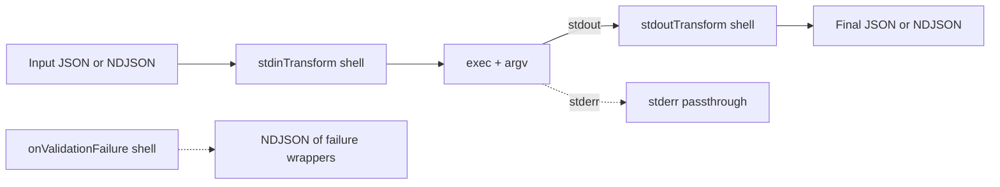

# JIO Specification (formerly JSON-CLI)

> **Scope**: This document specifies the **jio** tool (formerly jio) and the structure of `*.tool.json` files.

### Top-level metadata (required/recommended)

At the top-level of each `*.tool.json` file, include the following metadata:

- `"specVersion": "1.0.0"` **(required)** — version of this specification understood by the runner.
- `"jsonPathDialect": "jsonpath-plus@8"` — declares the JSONPath dialect (see §4).
- `"schemaDialect": "https://json-schema.org/draft/2020-12/schema"` — schema dialect for `inputSchema`/`outputSchema`.

Runners MUST reject specs whose `specVersion` major is unsupported.

// Deprecated: the runner now enforces an RFC 9535 JSONPath subset via a jsonpath-plus adapter (see §4).

---

## Why jio exists

Many CLI tools don’t speak JSON. **jio** is a thin, declarative wrapper that makes them behave like JSON-first APIs:

1. Accept **JSON** or **NDJSON** input.
2. Map JSON fields to **argv** (positional and/or flags).
3. Optionally transform the input stream into the command’s **stdin** (`stdinTransform`).
4. Run the command **once** per invocation.
5. Transform command **stdout** into **JSON/NDJSON** (`stdoutTransform`).
6. Validate input/output against JSON Schema.
7. Optionally route validation failures to a handler (`onValidationFailure`).

Design goals: small surface area, streaming-friendly, minimal reinvention of shell semantics, explicit mappings rather than magic.

> **Platform support**: POSIX (Linux/macOS). **Windows is not supported.**

---

## At a glance



- **Single process invocation**: The command is started **once**.
- **Streaming**: NDJSON flows through `stdinTransform` → command stdin; command stdout flows into `stdoutTransform` (if present) and back out as JSON/NDJSON. If `stdoutTransform` is omitted, command stdout is passed through unmodified (passthrough mode).
- **Validation failures** (input or output) can be routed to `onValidationFailure` as **NDJSON** items.

---

## 1) Discovery & Resolution

### Root directory

Resolve the root directory in this order:

1. If `$JIO_ROOT` is set → use it.
2. Else, walk upward from the current working directory until a file named **`.jio`** is found; use its directory.
3. Else, use the current working directory.

### Root file: `.jio` (optional)

```json
{
  "configVersion": "1",
  "defaultPackage": "io.example",
  "ignore": ["node_modules/", ".git/", "dist/"],
  "globs": ["**/*.tool.json"],
  "excludeGlobs": ["**/deprecated/*.tool.json"],
  "env": { "GLOBAL_ENV": "1" }
}
```

- `configVersion`: when present, the runner validates `.jio` against `https://static.kilty.io/jio/config.schema.json`.
- `defaultPackage`: used when a tool is invoked by a bare `name` (no dot).
- `ignore`: directory prefixes to skip during scanning.
- `globs` / `excludeGlobs`: control which `*.tool.json` files are loaded.
- `env`: environment variables applied to **all** tools (merged with the process env and overridden by per-tool `command.env`).

### Loading tools & building the index

- Scan the root per the config above.
- Parse every matching `*.tool.json` file.
- Validate each file against the **Formal Schema** (§12).
- Compute **FQName** = `{command.package}.{tool.name}` for each tool.
- Build an index keyed by FQName; **error** on duplicates.

### Selecting a tool to run

CLI form:

```
jio <toolRef> [--in file.json] [--dry-run] [--list] [--where <toolRef>]
```

- `<toolRef>` is either `{package}.{name}` or a **bare `name`**.
- Bare `name` resolves via `.jio.defaultPackage` → FQName `{defaultPackage}.{name}`.
- Input can be provided with `--in file.json` or via stdin. If both are present, `--in` wins.

---

## 2) Spec structure

The spec has two siblings: **`tool`** and **`command`**.

### `tool` (identity & schemas)

- `name` — short identifier within the package (used in FQName).
- `title` — human-friendly title.
- `description` — one- or two-sentence description.
- `inputSchema` — JSON Schema to validate incoming JSON/NDJSON. Validate _as fully as specified_ by the schema.
- `outputSchema` — JSON Schema to validate transformed output (JSON/NDJSON). Validate _as fully as specified_.

### `command` (process & transforms)

- `package` — reverse-DNS-like namespace (used in FQName).
- `exec` — the binary to run (e.g., `"scaf"`).
- `workingDir` (optional) — directory to spawn the process in.
  - Default resolution: relative paths are resolved **relative to the directory containing the `*.tool.json` file**, unless an absolute path is provided.
  - If `inheritCallerCwd: true`, relative paths (or an omitted `workingDir`) resolve relative to the caller’s current working directory.
  - Absolute paths are used as-is regardless of `inheritCallerCwd`.
- `env` (optional) — per-tool environment (merged over process env and `.jio.env`). **Precedence**: `process.env` < root `.jio.env` < per-tool `command.env`. In `--dry-run`, print env **keys only** and redact values matching `*_TOKEN`, `*_SECRET`, `*PASSWORD*`, etc. **Secrets** SHOULD be provided via SecretSpec files and referenced by the runner rather than embedded directly.
- `defaultBooleanStyle` (optional) — `"presence"` (default) or `"equals"`.
- `parameters` — **explicit mapping** from JSON → argv (see §4).
- `stdinTransform` (optional) — shell pipeline that converts input JSON/NDJSON into **stdin** bytes for the command.
  - `shell`: executed with `/bin/sh -c "<shell>"`.
  - `format`: `"json"` | `"ndjson"` — **MUST be enforced**.
- `stdoutTransform` (optional) — shell pipeline that converts stdout into **JSON/NDJSON**.
  - `shell`: e.g., `"jq -c ."`
  - `format`: `"json"` | `"ndjson"` describing what it emits.
  - If omitted, command stdout is passed through unmodified.

---

## 4) Parameters mapping (JSON → argv)

There is **no argv template**. You explicitly define how to build argv.

### Field reference

- `path` — JSONPath expression into the **invocation JSON** (not streaming stdin).
  - Accepted subset (RFC 9535‑compatible):
    - Property selectors: `$.a.b`, `$.a.*`
    - Bracket string keys: `$['k']`, unions `$['a','b']`
    - Arrays: `$[0]`, `$[1,3]`, `$[1:4]`, `$[*]`
  - Rejected: filters or scripts (`?(`…`)`), function calls, and `@` current-node.
  - Return shape rules:
    - If the mapping `type` is `array`, the JSONPath may return an array (used with `collectionStyle`).
    - If `type` is not `array` and JSONPath returns an array, the runner fails with a config error.
- `value` — static literal string (mutually exclusive with `path`).
- `type` — `"string" | "number" | "boolean" | "array" | "object"`.
- `required` — missing value is an error (unless `default` is present).
- `default` — used when the value is missing/null.
- `position` — 1-based positional index; positionals are rendered **first** in ascending order. Indices MUST be unique and positive.
- `flag` — if `true`, render as a named flag (`--flagName...`).
- `flagName` — required when `flag=true` (e.g., `"--example-arg"`).
- `booleanStyle` — `"presence"` (default) vs `"equals"`.
- `collectionStyle` — controls arrays/objects expansion: `"repeatArg" | "repeatFlag" | "csv" | "kv" | "separate"`.
- `csvSeparator` — used when `collectionStyle: "csv"` (default: `","`).

### Rendering rules & coercion

- **Order**: positionals (sorted by `position`) first, then flags. For deterministic flags, prefer sorting by `flagName`.
- **String/number**: convert to string tokens without extra quoting; pass as argv vectors, not joined strings.
- **Boolean**:
  - `presence`: render `--flagName` only when `true`.
  - `equals`: render `--flagName=true|false`.
- **Coercion**:
  - `null` → if `required:true` → **error**; else **skipped** unless `default` is provided.
  - Numbers stringify with `String(n)`; **warn** about precision for values > 2^53‑1.
  - Empty arrays/objects → **skipped** unless `required:true`.
- **Objects (`kv`)**: for each key→value, emit `--key=value`. Values must be scalars.
- **CSV**: join with `csvSeparator` into a single token (positional or flag value).
- **Separate (arrays)**: emit repeated pairs `[flag, value]` for each element, e.g., `--label red --label blue`.

---

## 5) Input & output streaming

**Two channels (explicit):**

- **Invocation JSON (args channel):** Loaded **only** from `--in <file.json>`. This object is used to build `argv` via `parameters`. `--in` is **required** if there exists at least one parameter that (a) uses `path`, (b) is `required:true`, and (c) does not provide a `default`. Otherwise, `--in` is optional and any path‑mapped parameters without values are skipped or use their `default`.
- **Data stream (stdin channel):** Read from **stdin** and fed to `stdinTransform` (if present). This stream is independent of the invocation JSON and can be NDJSON or JSON as required by the transform.

**Execution steps**

1. **Load invocation JSON** from `--in` and validate against `tool.inputSchema`. Abort on failure (see §6).
2. **Build argv (once)** from the invocation JSON via `parameters`.
3. **Acquire data stream** from `process.stdin` (or `/dev/null` if not used).
4. **stdinTransform** (optional): pipe the data stream into `/bin/sh -c "<stdinTransform.shell>"`. The runner **MUST** enforce `stdinTransform.format` on the transform's **output** before it is connected to the command. For `format: "json"`, the runner caps the buffered JSON size by `maxStdinBytes` and fails if exceeded.
5. **Run the command** (`exec + argv`) with merged env and `workingDir`.
6. **stdoutTransform** (optional): if present, pipe command stdout into `/bin/sh -c "<stdoutTransform.shell>"`; the runner **MUST** enforce its declared `format`. If omitted, command stdout is passed through unmodified.
7. **Emit output** from the stdout transform as `"ndjson"` or `"json"`.
8. **stderr**: all stage stderrs pass through to the parent stderr.
9. **Timeout**: if `timeoutMs` is set, the runner applies a **two‑phase shutdown**: send **SIGTERM to the process group**, wait a grace period (default **5s**), then **SIGKILL** (descendant scan performed again before SIGKILL).

**Streaming & backpressure (implementation guidance)**

- Use OS pipes and native stream backpressure; **do not buffer entire streams in memory**.
- Treat lines as UTF-8; tolerate CRLF; ignore a UTF-8 BOM if present.
- When parsing NDJSON, silently skip blank lines (or warn).
- Note: `pipefail` is enabled when the runner executes `bash`. For `/bin/sh` fallback, the runner uses `set -eu`. If your transform requires `pipefail`, invoke `bash` explicitly in the transform.

---

## 12) Formal JSON Schema

```json
{
  "type": "object",
  "required": ["specVersion", "tool", "command"],
  "properties": {
    "tool": {
      "type": "object",
      "required": ["name"],
      "properties": {
        "name": { "type": "string" },
        "title": { "type": "string" },
        "description": { "type": "string" },
        "inputSchema": { "type": "object" },
        "outputSchema": { "type": "object" }
      },
      "additionalProperties": false
    },
    "command": {
      "type": "object",
      "required": ["package", "exec", "parameters"],
      "properties": {
        "package": { "type": "string" },
        "exec": { "type": "string" },
        "workingDir": { "type": "string" },
        "env": { "type": "object", "additionalProperties": { "type": "string" } },
        "defaultBooleanStyle": {
          "type": "string",
          "enum": ["presence", "equals"],
          "default": "presence"
        },
        "timeoutMs": { "type": "integer", "minimum": 1 },
        "parameters": {
          "type": "object",
          "additionalProperties": {
            "allOf": [
              {
                "type": "object",
                "properties": {
                  "path": { "type": "string" },
                  "value": { "type": "string" },
                  "type": {
                    "type": "string",
                    "enum": ["string", "number", "boolean", "array", "object"]
                  },
                  "required": { "type": "boolean" },
                  "default": {},
                  "position": { "type": "integer", "minimum": 1 },
                  "flag": { "type": "boolean" },
                  "flagName": { "type": "string" },
                  "booleanStyle": { "type": "string", "enum": ["presence", "equals"] },
                  "collectionStyle": {
                    "type": "string",
                    "enum": ["repeatArg", "repeatFlag", "csv", "kv", "separate"]
                  },
                  "csvSeparator": { "type": "string", "maxLength": 1 }
                },
                "oneOf": [
                  { "required": ["path", "type"] },
                  { "required": ["value", "type"] },
                  { "required": ["default", "type"] }
                ]
              },
              {
                "if": {
                  "type": "object",
                  "required": ["flag"],
                  "properties": { "flag": { "const": true } }
                },
                "then": {
                  "anyOf": [
                    {
                      "type": "object",
                      "properties": { "flagName": {} },
                      "required": ["flagName"]
                    },
                    {
                      "type": "object",
                      "properties": {
                        "type": { "const": "object" },
                        "collectionStyle": { "const": "kv" }
                      }
                    }
                  ]
                }
              }
            ]
          }
        },
        "stdinTransform": {
          "type": "object",
          "properties": {
            "shell": { "type": "string" },
            "format": { "type": "string", "enum": ["ndjson", "json"] }
          },
          "additionalProperties": false
        },
        "stdoutTransform": {
          "type": "object",
          "properties": {
            "shell": { "type": "string" },
            "format": { "type": "string", "enum": ["ndjson", "json"] }
          },
          "required": ["shell", "format"],
          "additionalProperties": false
        },
        "onValidationFailure": {
          "type": "object",
          "properties": { "shell": { "type": "string" } },
          "required": ["shell"],
          "additionalProperties": false
        }
      },
      "additionalProperties": false
    },
    "specVersion": { "type": "string", "const": "1.0.0" },
    "jsonPathDialect": { "type": "string", "const": "jsonpath-plus@8" },
    "schemaDialect": { "type": "string", "const": "https://json-schema.org/draft/2020-12/schema" }
  },
  "additionalProperties": false
}
```

---

**Runner validation rules (beyond JSON Schema)**

- Positional indexes (`position`) MUST be **unique and positive** across all parameters; violations are a **config error (78)**.
- Enforce declared transform formats (`stdinTransform.format`, `stdoutTransform.format`).
- If `type` is not `array` and JSONPath returns an array, fail with a config error (suggest using `collectionStyle`).

**End of spec.**
