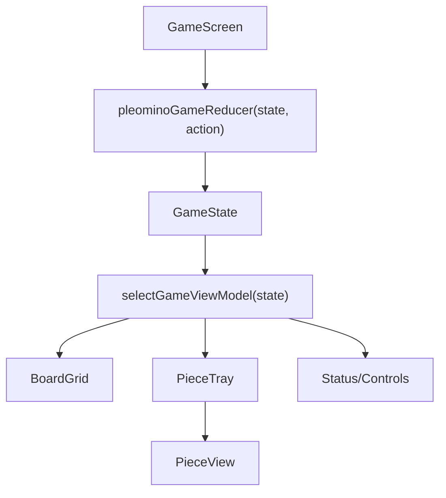

# Pleomino Vite Webapp Design Doc (`docs/pleomino-design.md`)

## Summary

Create a detailed design document for a `scaf`-generated `ts/webapp-ssr-vite` app that implements a single-player, sandbox-only virtual board puzzle using React Native Web components.  
The doc will be implementation-ready and aligned to repo conventions (`METHODOLOGY.XML`, scaffold contracts, Starlark API usage, and PR workflow).

## Key Changes / Design Content

1. **Scaffold + Build Integration**

- Specify bootstrap command: `scaf new ts webapp-ssr-vite pleomino --yes`.
- Define `TARGETS` usage with `node_webapp(name = "app_raw")` and `node_asset_stage(name = "app", app = ":app_raw", labels = ["lang:node","kind:app","webapp:ssr","framework:vite"], out = "dist")`.
- Keep SSR baseline intact; game runs in client-hydrated RN Web UI with deterministic initial state for SSR.

2. **System Architecture**

- Document module boundaries (single responsibility, small-file decomposition) for:
  - `game-state` (board/pieces/placement state + reducers/actions)
  - `geometry` (rotation, flip, normalization, collision, bounds)
  - `interaction` (drag/rotate/flip/snap lifecycle)
  - `ui` (Board, PieceTray, PieceSprite, Control strip, Status)
  - `persistence` (optional local storage restore/reset; no server state)
- Include explicit data flow: user input → interaction handler → reducer/state transition → derived selectors → render.

3. **Game Model + Rules**

- Board fixed to **10 columns x 15 rows**.
- Piece schema in design doc:
  - `pieceId`, `color`, `baseCells: Array<{x,y}>`, `transform`, `position`, `isPlaced`.
- Transform schema:
  - `rotation: 0|90|180|270`, `flipped: boolean`.
- Placement validity:
  - all transformed cells in bounds
  - no overlap
  - win when every board cell is filled exactly once.
- Piece catalog strategy (locked): **manual extraction from product photos**, then hardcoded JSON catalog with exact color + shape coordinates.
- Include a concrete workflow for catalog extraction and normalization (anchor-cell normalization + dedupe by canonical signature).

4. **Interaction + UX Specification**

- Dragging via RN Web responder/pointer-compatible handlers on piece surfaces.
- Snap-to-grid on drop with pixel-to-cell conversion.
- Rotation and flip controls per selected piece (toolbar buttons + keyboard shortcuts).
- Invalid drops revert to last valid position with deterministic feedback.
- Visual language:
  - board grid, high-contrast occupied/empty states,
  - color-accurate piece rendering,
  - selected-piece affordances,
  - mobile + desktop responsive layouts.
- Accessibility:
  - keyboard move/rotate/flip controls,
  - ARIA labels/roles on controls and board status text,
  - non-color-only validity indicators.

5. **Engineering Constraints + Quality Gates**

- Document file-size and SoC constraints from methodology (target ≤250 lines/module).
- Deterministic behavior requirements (no timing-dependent placement logic).
- Explicit non-goals for v1: multiplayer, challenge-card mode, solver/hints, backend sync.
- PR checklist section aligned with `getting-started-on-a-pr.md`:
  - `i && b && v` baseline,
  - target-specific tests,
  - deterministic failure signatures and recovery notes.

## Public APIs / Interfaces / Types To Define in the Doc

- `PieceDefinition`, `PieceTransform`, `PlacedPiece`, `BoardState`, `GameState`.
- Geometry interfaces:
  - `transformCells(baseCells, transform)`,
  - `translateCells(cells, origin)`,
  - `isPlacementValid(boardSize, occupiedSet, cells)`,
  - `computeWinState(gameState)`.
- Interaction interfaces:
  - `beginDrag(pieceId, pointer)`,
  - `updateDrag(pointer)`,
  - `commitDrop()`,
  - `rotateSelected(direction)`,
  - `flipSelected(axis)`.

## Test Plan (to include in the design doc)

1. **Unit tests**

- transform correctness (all rotations + flip combinations)
- canonical normalization stability
- overlap/bounds/win detection
- pixel-to-grid snapping determinism.

2. **Component tests**

- piece drag lifecycle (start/move/drop)
- rotate/flip updates rendered geometry correctly
- invalid placement rollback behavior.

3. **Integration tests**

- full-board solve path reaches win state
- no-overlap invariant maintained across random interaction sequences
- SSR render + hydration consistency (no state mismatch warnings).

4. **Manual acceptance scenarios**

- desktop mouse and mobile touch interactions
- keyboard-only placement flow
- reset/new-game behavior and optional persistence restore.

## Assumptions / Defaults

- Source of truth for piece geometry/colors is manual cataloging from product photos.
- v1 scope is **sandbox-only** gameplay on an empty 10x15 board.
- React Native Web is the primary component layer; no canvas/WebGL dependency in v1.
- The design doc is authored as implementation-ready guidance in `docs/pleomino-design.md` and references scaffold and macro contracts without changing them.

## Implementation Status

- PR-1 is implemented in `projects/apps/pleomino` with scaffolded SSR app wiring:
  - `node_webapp(name = "app_raw")`
  - `node_asset_stage(name = "app", app = ":app_raw", labels = ["lang:node","kind:app","webapp:ssr","framework:vite"], out = "dist")`
- The template placeholder screen is replaced by a deterministic pleomino shell:
  - board container with fixed `10x15` grid rendering
  - piece-tray placeholder panel for pre-catalog state
- Domain foundations are landed as pure modules:
  - board constants: `src/game/board.ts`
  - type contracts: `src/game/types.ts`
  - geometry helpers: `src/game/geometry.ts`
  - placement validity helpers: `src/game/placement.ts`
  - deterministic initial state: `src/game/state.ts`
- PR-1 test coverage is wired in `projects/apps/pleomino/test`:
  - `game-geometry.test.ts`
  - `game-placement.test.ts`
  - updated SSR smoke test: `entry-server.test.ts`
- PR-2 piece catalog pipeline is implemented in `projects/apps/pleomino`:
  - static catalog source: `src/game/piece-catalog.ts`
  - catalog validation: `src/game/piece-catalog-validation.ts`
  - validated state wiring: `src/game/state.ts`
  - tests:
    - `test/game-piece-catalog.test.ts`
    - `test/entry-server.test.ts` (catalog render assertion)
- PR-3 board/tray rendering and reducer-driven state are implemented in
  `projects/apps/pleomino`:
  - reducer/actions: `src/game/reducer.ts`
  - selector-only view models: `src/game/selectors.ts`
  - UI components:
    - `src/ui/game-screen.tsx`
    - `src/ui/board-grid.tsx`
    - `src/ui/piece-tray.tsx`
    - `src/ui/piece-view.tsx`
  - tests:
    - `test/game-reducer.test.ts`
    - `test/game-components.test.tsx`
    - `test/entry-server.test.ts` (deterministic SSR markup handshake assertion)
- PR-4 drag-and-drop with snapping and rollback is implemented in `projects/apps/pleomino`:
  - pure interaction helpers: `src/game/interaction.ts`
  - board cell-size constant shared by render + interaction: `src/game/board.ts`
  - responder wiring:
    - `src/ui/game-screen.tsx`
    - `src/ui/piece-tray.tsx`
    - `src/ui/piece-view.tsx`
  - tests:
    - `test/game-interaction.test.ts`
    - `test/game-drag-flow.test.ts`
- PR-5 rotate/flip controls, keyboard accessibility, and win detection are implemented in
  `projects/apps/pleomino`:
  - transform + selection state:
    - `src/game/types.ts`
    - `src/game/state.ts`
    - `src/game/piece-transform.ts`
  - reducer action support for tray + placed-instance transforms:
    - `src/game/reducer.ts`
  - solved-state detector:
    - `src/game/win.ts`
    - `src/game/selectors.ts`
  - UI interactions:
    - single tap/click rotates selected/targeted piece
      - left mouse click rotates counter-clockwise
      - right mouse click rotates clockwise
    - double tap/click flips selected/targeted piece
    - tap/click + drag preserves movement behavior
    - keyboard controls (`Arrow` move preview, `Enter` commit, `Esc` revert, `R/Q` rotate,
      `F` flip)
    - status banner includes solved-state feedback
  - tests:
    - `test/game-reducer.test.ts` (transform actions)
    - `test/game-drag-browser.test.tsx` (tap/double-tap + drag behavior)
    - `test/game-keyboard-browser.test.tsx` (keyboard flow)
    - `test/game-win.test.ts` (win detector)
- PR-6 runtime reliability, persistence, and release readiness are implemented in
  `projects/apps/pleomino`:
  - persistence + schema validation:
    - `src/game/persistence.ts`
    - `src/ui/game-screen.tsx` (safe restore/save wiring)
  - deterministic new-game + reset controls:
    - `src/ui/game-screen.tsx`
  - render/perf hardening:
    - memoized view selector factory in `src/game/selectors.ts`
    - memoized tray/piece rendering in `src/ui/piece-tray.tsx` and `src/ui/piece-view.tsx`
  - UI polish:
    - toolbar removed from runtime surface
    - refined status/control layout with same keyboard and tap/drag contracts
  - tests:
    - `test/game-persistence.test.ts`
    - `test/game-screen-persistence-browser.test.tsx`
    - `test/game-stability.test.ts`
    - updated `test/entry-server.test.ts` for release UI contract
- PR-1.5 is implemented in verify preflight selection:
  - new selector utility: `build-tools/tools/lib/project-impact-selector.ts`
  - verify wiring: `build-tools/tools/dev/verify/template-test-scope.ts`
  - tests:
    - `build-tools/tools/tests/verify/project-impact-selector.policy.test.ts`
    - `build-tools/tools/tests/verify/template-test-scope.policy.test.ts`
  - docs updated:
    - `build-tools/docs/build-system-design.md`
    - `docs/handbook/getting-started-on-a-pr.md`
- PR-7 minimal toolbar shell and action wiring are implemented in `projects/apps/pleomino`:
  - new toolbar component:
    - `src/ui/game-toolbar.tsx`
  - game-screen integration:
    - `src/ui/game-screen.tsx`
    - `src/ui/game-screen-styles.ts`
    - `src/ui/piece-tray.tsx` (reset removed from tray; toolbar is canonical action surface)
  - reducer placeholder action wiring:
    - `src/game/reducer.ts` (`history/undo`, `history/redo`, `solve/request`)
  - tests:
    - `test/game-toolbar.test.tsx`
    - `test/game-reducer.test.ts` (placeholder no-op contract)
- PR-9 solver core with deterministic candidate generation and C++/WASM search is implemented in
  `projects/apps/pleomino` and `projects/libs/pleomino-solver-wasm`:
  - C++ wasm solver target + export wrapper:
    - `projects/libs/pleomino-solver-wasm/src/solver.cc`
    - `projects/libs/pleomino-solver-wasm/TARGETS`
  - app wasm asset staging:
    - `projects/apps/pleomino/TARGETS` (client/server wasm destinations)
  - pure solver modules:
    - `src/game/solver/solver-types.ts`
    - `src/game/solver/candidate-generation.ts`
    - `src/game/solver/wasm-runtime.ts`
    - `src/game/solver/solver.ts`
  - tests:
    - `test/game-solver-candidates.test.ts`
    - `test/game-solver-wasm.test.ts`
- PR-10 interestingness scoring and ranked solution selection are implemented in
  `projects/apps/pleomino`:
  - scoring internals:
    - `src/game/solver/interestingness-metrics.ts`
    - `src/game/solver/interestingness.ts`
  - orchestration updates:
    - `src/game/solver/solver.ts` (top-K ranking and deterministic tie-breakers)
  - tests:
    - `test/game-solver-interestingness.test.ts`
    - `test/game-solver-wasm.test.ts` (ranking determinism contract)
- PR-11 solve UI integration and non-blocking orchestration are implemented in
  `projects/apps/pleomino`:
  - async solve orchestration + stale-request cancellation token:
    - `src/ui/game-screen-solve.ts`
    - `src/ui/game-screen.tsx`
  - atomic solve apply reducer path with history integration:
    - `src/game/reducer.ts` (`solve/apply`)
  - toolbar solve-state feedback:
    - `src/ui/game-toolbar.tsx`
  - tests:
    - `test/game-history-reducer.test.ts`
    - `test/game-solve-browser.test.tsx`
    - `test/game-solve-cancellation-browser.test.tsx`
    - `test/game-toolbar.test.tsx`
- PR-12 worker-backed solve runtime path is implemented in `projects/apps/pleomino`:
  - worker runtime orchestration + deterministic fallback:
    - `src/game/solver/solver-runtime.ts`
    - `src/game/solver/solver-runtime-worker.ts`
  - `src/ui/game-screen-solve.ts` (runtime entrypoint switch)
  - tests:
    - `test/game-solve-worker-browser.test.tsx`
    - `test/game-solver-runtime.test.ts`
    - updated `test/game-solve-browser.test.tsx`
    - updated `test/game-solve-cancellation-browser.test.tsx`
- PR-13 solve preview/hash regression-proofing is implemented in `projects/apps/pleomino`:
  - explicit regression suite for solve lifecycle preview + hash contracts:
    - `test/game-solve-preview-hash-regression.test.tsx`
  - solve integration suite remains focused on primary solve/undo/redo and unsolved paths:
    - updated `test/game-solve-browser.test.tsx`
- PR-14 solve interaction latency guardrail and baseline are implemented in
  `projects/apps/pleomino`:
  - checked-in latency baseline fixture:
    - `test/fixtures/solve-interaction-latency-baseline.json`
  - dedicated interaction latency guardrail regression suite:
    - `test/game-solve-latency-guardrail.test.tsx`
  - target wiring for focused PR validation:
    - `TARGETS` (`nix_node_test(name = "pr14_latency", ...)`)
- PR-15 seeded solve randomness and explicit empty-board solve mode are implemented in
  `projects/apps/pleomino`:
  - seeded top-window candidate selection:
    - `src/game/solver/seeded-selection.ts`
    - `src/game/solver/solver.ts` (`SolverRequest.randomSeed`, `selectionWindowSize`)
    - `src/ui/game-screen-solve.ts` (request-scoped explicit seeds)
  - focused seeded + empty-board solve coverage:
    - `test/game-solver-seeded-selection.test.ts`
    - updated `test/game-solve-browser.test.tsx`
    - updated `test/game-solver-runtime.test.ts`
  - target wiring for focused PR validation:
    - `TARGETS` (`nix_node_test(name = "pr15_seeded", ...)`)

## Domain Foundations (PR-1 Locked Conventions)

- Coordinate system:
  - `x` increases to the right
  - `y` increases downward
  - all geometry units are board-cell integers
- Rotation convention:
  - clockwise around origin `(0,0)`
  - valid values: `0|90|180|270`
- Flip convention:
  - horizontal mirror across vertical axis (`x -> -x`)
  - represented as `PieceTransform.flipped: boolean`
- Normalization convention:
  - transformed cell sets are normalized by min-anchoring to `(0,0)`
  - canonical order is stable sort by `y`, then `x`
- Placement validity contract:
  - `isPlacementValid(boardSize, occupiedSet, cells)` returns true only when:
    - every cell is within board bounds
    - no transformed cell key overlaps the occupied set

## Piece Catalog Source of Truth (PR-2)

The only runtime source of truth for piece geometry and color is
`projects/apps/pleomino/src/game/piece-catalog.ts`.
All piece entries are validated by `validatePieceCatalog(...)` in
`src/game/piece-catalog-validation.ts` before they are exposed through
`createInitialGameState(...)`.

### Manual extraction workflow

1. Capture normalized top-down product photos with one piece-color mapping per piece ID.
2. Transcribe piece cells in integer board-cell units into `piece-catalog.ts`.
3. Min-anchor each piece to `(0,0)` and keep deterministic y-then-x cell ordering.
4. Run catalog validation tests and confirm canonical signatures are unchanged unless the edit is intentional.

### Normalization rules

- Every piece must have non-empty integer `baseCells`.
- No duplicate cells are allowed within a piece.
- `pieceId` values are unique across the catalog.
- Canonical signatures (from normalized cell ordering) are unique across pieces.

### Update protocol

1. Edit only `src/game/piece-catalog.ts` for geometry/color changes.
2. Run `projects/apps/pleomino/test/game-piece-catalog.test.ts` via `v //projects/apps/pleomino:unit`.
3. If a shape change is intentional, update the golden metadata/signature assertions in
   `test/game-piece-catalog.test.ts` in the same PR.
4. Keep `createInitialGameState()` wired to the validated catalog and do not duplicate catalog data in UI code.

### Piece IDs and color tokens

- `purple-2-1`: `#a855f7` (purple)
- `red-2-2`: `#ef4444` (red)
- `green-2-2`: `#22c55e` (green)
- `blue-3-1`: `#3b82f6` (blue)
- `yellow-1-2-1`: `#facc15` (yellow)
- `orange-2-1-2`: `#f97316` (orange)
- `black-1-1-1-1`: `#000000` (black)
- `white-1-1`: `#ffffff` (white)

### Ownership expectations

- Product-level catalog updates require a single owner-reviewed PR.
- Any catalog edit must include validation test updates when signatures/metadata change.
- Reducer/UI code must consume the validated catalog from state, not ad hoc piece constants.

## Reducer + UI Architecture (PR-3)

### Component tree and data flow

- Input flow: `PieceView` plus status/control actions dispatch reducer actions in `GameScreen`.
- State flow: reducer returns a new `GameState` deterministically.
- Render flow: UI consumes only selector outputs (`selectGameViewModel`) and does not derive
  mutable ad hoc view state.

### Action contracts

- `piece/select`:
  - sets `selectedPieceId` for known pieces
  - unknown `pieceId` is a no-op
- `piece/preview`:
  - stores board-cell preview origin for a piece (`previewByPieceId[pieceId]`)
  - preview coordinates are integer-normalized
- `piece/commit`:
  - transforms candidate cells from catalog geometry + piece transform
  - validates with `isPlacementValid(boardSize, occupiedSet, candidateCells)` using occupied cells
    from all other placed pieces
  - on success: upserts placed piece and clears preview
  - on failure: applies deterministic revert to last committed position (or `null` for never-placed
    pieces)
- `piece/revert`:
  - restores preview for selected piece to last committed placement position or `null`
- `board/reset`:
  - clears placements/selection/previews to deterministic initial values

### Reducer invariants

- Board occupancy is derived only from committed `board.placedPieces`; previews are non-committed.
- Placement validity is centralized in existing geometry/placement utilities and never re-implemented
  in UI.
- Reducer updates are pure and deterministic; no timing-dependent or random behavior is allowed.
- `BoardGrid`, `PieceTray`, and status/control panels render from selector output only.

## Drag Contract (PR-4)

### Event lifecycle

1. `piece/select` is dispatched when drag starts on a piece card.
2. `beginDragSession(...)` captures deterministic drag session state:
   - `pieceId`
   - grabbed shape-cell anchor (`grabbedCell`) from the exact tray cell under pointer-down
3. `previewCellFromDrag(...)` converts pointer movement into board-cell preview origins and dispatches
   `piece/preview`.
4. Drag end dispatches `piece/commit` for the active piece.

### Snap formula

- Board cell conversion:
  - `cellX = floor((pageX - boardLeft) / BOARD_CELL_SIZE)`
  - `cellY = floor((pageY - boardTop) / BOARD_CELL_SIZE)`
- Final preview origin:
  - `preview = pointerCell - grabbedCell`
- All preview coordinates are integer board units and flow through reducer normalization.

### Tray supply + rendering rules

- Tray entries represent piece types with fixed initial supply `5` per type.
- `remainingCount = 5 - placedCount(pieceId)`, clamped to `>= 0`.
- Drag start is blocked when `remainingCount === 0`.
- Each valid commit appends a new placed instance and consumes one unit of supply.
- Tray piece rendering is full-size (same board cell size), with no per-piece border, ID label, or
  selected-state text label.

### Rollback rules

- Commits always route through `reduceCommitPiece(...)` and existing
  `isPlacementValid(boardSize, occupiedSet, candidateCells)`.
- Valid commit:
  - upsert into `board.placedPieces`
  - clear preview for that piece
- Invalid commit:
  - revert preview to last committed position for placed pieces
  - revert preview to `null` for never-placed pieces

### Troubleshooting notes

- Browser/device pointer differences are contained by RN Web responder events plus pure drag math.
- Board hit-testing uses the measured board element rectangle in page coordinates and the shared
  `BOARD_CELL_SIZE` constant so render + interaction remain aligned.
- If drag events terminate unexpectedly, `onResponderTerminate` follows the same commit path as
  release for deterministic state transitions.

## Appendix A: Development Plan (PR Sequence)

This plan follows the same PR structure used in `docs/design-history/quad-alignment-48.md`.
Each PR includes implementation, tests, and documentation updates together.

Scope: deliver a production-ready sandbox pleomino webapp on `ts/webapp-ssr-vite` with React
Native Web UI, exact piece catalog, deterministic game rules, and SSR-safe hydration behavior.
Non-goals: challenge cards, multiplayer, hint/solver engine, backend sync.

---

## PR-1: Scaffold the app and land deterministic game-domain foundations

### Description

I will scaffold the Vite SSR app and implement core domain primitives: board constants,
piece/transform types, geometry transforms, and placement validity logic.

### Scope & Changes

- Scaffold app using `scaf new ts webapp-ssr-vite pleomino --yes` under `projects/apps/pleomino`.
- Replace template placeholder UI with minimal game shell (board container + tray placeholders).
- Add domain modules:
  - board dimensions (`10x15`)
  - type definitions (`PieceDefinition`, `PieceTransform`, `PlacedPiece`, `GameState`)
  - pure geometry helpers (`rotate/flip/normalize/translate`)
  - pure validity helpers (`inBounds`, `noOverlap`, `isPlacementValid`)
- Keep module boundaries small and explicit per methodology.

### Tests (in this PR)

- Unit tests for geometry invariants:
  - all 4 rotations are deterministic
  - flip behavior is deterministic and composable with rotation
  - normalization gives stable canonical forms
- Unit tests for placement validity:
  - in-bounds acceptance/rejection
  - overlap rejection
  - empty-board placement acceptance
- SSR smoke test still passes with the new shell route.

### Docs (in this PR)

- Add "Implementation Status" and "Domain Foundations" notes to `docs/pleomino-design.md`.
- Document final type signatures and transform conventions (origin, axis direction, units).

### Acceptance Criteria

- App boots in dev/prod SSR with game shell visible.
- Geometry and placement tests pass and are deterministic.
- No file-size/SoC violations introduced.

### Risks

Coordinate-system mistakes (row/column inversion) could invalidate downstream logic.

### Mitigation

Lock axis conventions in types + tests in this PR before UI interactions land.

### Consequence of Not Implementing

Later PRs would build on unstable geometry logic and incur repeated rework.

### Downsides for Implementing

Some up-front investment before visible gameplay.

### Recommendation

Implement.

## Operational Notes (PR-6)

- Persistence policy:
  - runtime key: `pleomino.game-state.v1`
  - persisted payload is versioned and validated before restore
  - invalid/corrupt/incompatible payloads fall back to `createInitialGameState()`
- Recovery behavior:
  - storage read/write/clear failures do not break reducer flow
  - `Reset Board` restores deterministic initial reducer state
  - `New Game` clears local persistence and restores deterministic initial reducer state
- Release verification commands:
  - baseline: `i && b && v`
  - pleomino app-specific checks:
    - `cd projects/apps/pleomino && pnpm run build:ssr`
    - `cd projects/apps/pleomino && pnpm run test`
  - SSR contract must continue to expose built server/client artifacts through
    `node_asset_stage(name = "app", app = ":app_raw", labels = ["lang:node","kind:app","webapp:ssr","framework:vite"], out = "dist")`

---

## PR-1.5: Make verify test selection dependency-aware by default

### Description

I will add a deterministic selector mode that, by default, runs tests for changed projects plus
projects that depend on those changed projects, while preserving the existing build-system
inclusion/exclusion behavior.

### Scope & Changes

- Add a new selection mode in verify preflight:
  - `project-impact` (default for non-build-system-only app/lib changes)
- Keep existing selector outcomes for build-system paths:
  - if build-system paths are touched, keep current build-system selection/fallback rules
  - if only template/build-system scope applies, continue using existing mixed/full behavior
- Add deterministic project-impact graph resolution:
  - map changed files to owning project(s) (app/lib/package boundaries)
  - compute downstream dependents recursively via repo dependency graph (reverse deps /
    transitive consumers, including dependents-of-dependents to full fixed point)
  - select tests for:
    - changed project targets
    - all recursive dependent project targets (full downstream closure)
  - de-duplicate and stable-sort target list for reproducible logs
- Keep existing diagnostics contract and extend it with:
  - `mode: "project-impact" | existing modes`
  - `changedProjects`
  - `dependentProjects`
  - `selectedTargets`
  - `reason` when fallback to mixed/full is used
- Reuse existing utilities for:
  - changed-path classification
  - build-system path detection
  - target discovery/query execution
  - verify log diagnostics emission
- Add guardrails to avoid runtime regressions:
  - cache per-run project-owner mapping
  - bound graph traversals to a single reverse-deps walk per verify invocation
  - skip graph expansion when there are zero project-owned file changes

### Tests (in this PR)

- Selector unit tests:
  - changed app selects only that app’s tests when no dependents exist
  - changed lib selects lib tests plus all downstream consumer project tests, recursively through
    dependents-of-dependents
  - mixed app/lib edits produce union without duplicates
  - build-system change still routes to existing build-system scope logic
  - unrelated dirty ignored paths (for example `.vite-cache`) do not widen scope
- Integration test for verify preflight:
  - fixture repo with 3+ projects and known dependency edges
  - assert `project-impact` mode emits expected stable `selectedTargets`
  - assert fallback mode and diagnostics remain unchanged for build-system edits
- Performance regression test:
  - assert selector runtime remains within existing preflight budget on representative fixture

### Docs (in this PR)

- Update `docs/handbook/getting-started-on-a-pr.md`:
  - add `project-impact` mode explanation and troubleshooting
  - clarify when/why verify falls back to mixed/full scope
- Update `build-tools/docs/build-system-design.md`:
  - document selector decision order and diagnostics fields
  - record the contract that build-system scope logic is preserved

### Acceptance Criteria

- With only `projects/apps/pleomino/**` changes, verify excludes unrelated projects by default.
- With shared-lib changes, verify includes the full recursive downstream consumer closure.
- Build-system-trigger behavior is unchanged from current guardrails.
- Selector diagnostics clearly explain chosen mode and selected targets.
- No measurable global verify-time regression from selector computation.

### Risks

Incorrect ownership mapping or reverse-deps expansion could under-select required tests.

### Mitigation

Use conservative fallback: when classification/graph resolution is ambiguous, promote to existing
mixed/full behavior and emit explicit diagnostics.

### Consequence of Not Implementing

Project-local PRs continue paying unnecessary verify cost and noisy unrelated target execution.

### Downsides for Implementing

Adds selector complexity and maintenance burden in preflight logic.

### Recommendation

Implement.

---

## PR-1.6: Add opt-in compliance verify mode for project plus full dependency closure

### Description

I will add an opt-in verify mode that runs tests for a caller-specified set of projects and all of
their dependencies, intended for compliance, certification, or release-gate workflows that require
broader assurance than default project-impact selection.

### Scope & Changes

- Add a new explicit verify selector mode:
  - `project-closure` (opt-in, never default)
- Add user-facing invocation contract (CLI flag/config) to pass one or more project identifiers.
- CLI UX proposal (aligned with build-system philosophy: one outer command, explicit modes,
  deterministic diagnostics):
  - Keep `v` as the single user-facing entrypoint; no new top-level command.
  - Add explicit selector flag:
    - `v --selector project-closure --project projects/apps/pleomino`
    - `v --selector project-closure --project projects/apps/pleomino --project projects/libs/shared-ui`
  - Add comma form for shell ergonomics (equivalent to repeated flags):
    - `v --selector project-closure --projects projects/apps/pleomino,projects/libs/shared-ui`
  - Add explain-only mode to preview scope without running tests:
    - `v --selector project-closure --project projects/apps/pleomino --explain-selection`
  - Validation contract:
    - fail fast if `project-closure` is set without at least one `--project`/`--projects` value
    - fail fast on unknown project identifiers, with nearest-match suggestions
    - reject ambiguous aliases; require canonical repo-relative project paths
  - Output contract:
    - human summary line (mode, requested project count, closure project count, target count)
    - stable JSON diagnostics in verify log (same deterministic schema used by other selector modes)
  - CI/compliance ergonomics:
    - allow env alias `VERIFY_SELECTOR=project-closure` and `VERIFY_PROJECTS=<csv>` as exact
      equivalents to CLI flags for pipeline wiring; CLI flags take precedence when both are set.
- Resolve target set deterministically:
  - seed with specified projects
  - traverse dependencies recursively (full transitive closure, including
    dependencies-of-dependencies to fixed point)
  - include tests owned by every project in closure
  - de-duplicate and stable-sort targets
- Preserve existing build-system handling:
  - build-system change logic remains authoritative and unchanged
  - if build-system rules require broader scope, keep current fallback behavior
- Extend diagnostics with closure-specific evidence:
  - `mode: "project-closure"`
  - `requestedProjects`
  - `resolvedDependencyClosure`
  - `selectedTargets`
  - `fallbackReason` when broadening occurs

### Tests (in this PR)

- Selector unit tests:
  - single requested project includes itself + full recursive dependency closure
  - multiple requested projects resolve merged closure without duplicate targets
  - unknown/invalid project id returns clear error before verify execution
  - build-system path changes still apply existing fallback/broad-scope policy
- Integration test:
  - fixture dependency graph with known fan-in/fan-out
  - assert closure membership and stable `selectedTargets` output
- Performance test:
  - assert closure computation remains bounded and does not regress default-mode latency

### Docs (in this PR)

- Update `docs/handbook/getting-started-on-a-pr.md` with:
  - when to use `project-closure`
  - invocation examples
  - expected runtime tradeoffs versus default mode
- Update `build-tools/docs/build-system-design.md` with:
  - selector decision precedence between default and opt-in modes
  - closure diagnostics schema and troubleshooting

### Acceptance Criteria

- Users can opt into `project-closure` and specify one or more projects.
- Verify includes tests for requested projects and their full recursive dependency closure.
- Build-system-triggered scope rules remain unchanged.
- Diagnostics clearly show requested projects, resolved closure, and final selected targets.
- Default verify behavior is unchanged when `project-closure` is not requested.

### Risks

Large dependency closures may increase runtime and be overused in normal PR flows.

### Mitigation

Keep mode explicit opt-in, document intended compliance use, and print projected target count before
execution so users can confirm cost.

### Consequence of Not Implementing

Teams needing compliance-grade project verification must either run full-suite verify or rely on ad
hoc target lists, reducing reproducibility and confidence.

### Downsides for Implementing

Adds another selector mode and additional maintenance surface in verify tooling.

### Recommendation

Implement.

---

## PR-2: Add exact piece catalog and validation pipeline

### Description

I will encode the exact piece shapes/colors from product photos into a source-controlled catalog and
add validation to prevent malformed definitions.

### Scope & Changes

- Add static piece catalog module (hardcoded JSON/TS constant) with:
  - `pieceId`
  - exact color token
  - `baseCells`
- Add catalog validator:
  - non-empty cell sets
  - integer unit coordinates
  - no duplicate cells per piece
  - unique piece IDs
- Add canonical-signature check to detect accidental duplicates/edits.
- Wire catalog into initial game-state creation.

### Tests (in this PR)

- Unit tests validating all catalog entries pass schema and integrity checks.
- Snapshot/golden-style test for catalog metadata (piece count, IDs, color tokens).
- Canonical-signature regression test to catch unintentional shape drift.

### Docs (in this PR)

- In `docs/pleomino-design.md`, add "Piece Catalog Source of Truth" subsection:
  - manual extraction workflow
  - normalization rules
  - update protocol when catalog changes
- Record final piece IDs/colors and catalog ownership expectations.

### Acceptance Criteria

- Catalog loads without runtime assertions.
- Validation tests fail on malformed or duplicate shapes.
- Initial state uses the exact catalog as the only source of truth.

### Risks

Manual transcription errors from source photos.

### Mitigation

Validator + regression tests + explicit update checklist in docs.

### Consequence of Not Implementing

Gameplay could ship with incorrect pieces or unstable future edits.

### Downsides for Implementing

Initial data-entry effort and test maintenance.

### Recommendation

Implement.

---

## PR-3: Implement board/tray rendering and reducer-driven game state

### Description

I will implement the core visual layout and reducer architecture so pieces can be displayed and
selected with deterministic state transitions.

### Scope & Changes

- Build RN Web components:
  - `GameScreen`
  - `BoardGrid`
  - `PieceTray`
  - `PieceView`
  - `Toolbar` (disabled action placeholders initially)
- Implement reducer/actions for:
  - piece selection
  - preview positioning
  - placement commit/revert
  - reset board
- Render board and tray from selectors only (no ad hoc mutable UI state).

### Tests (in this PR)

- Reducer tests for action/state transition correctness.
- Component tests for:
  - board cell rendering shape
  - piece rendering from catalog
  - selected-piece highlighting
- SSR hydration test to ensure deterministic initial markup/state handshake.

### Docs (in this PR)

- Add architecture diagram/text for component tree + reducer/data flow in
  `docs/pleomino-design.md`.
- Document action contracts and reducer invariants.

### Acceptance Criteria

- All pieces render in tray; board renders 10x15 grid.
- Selection and reset state transitions are deterministic and tested.
- Hydration mismatch warnings are absent in test/dev flow.

### Risks

State duplication between view and reducer can cause drift.

### Mitigation

Single reducer source-of-truth plus selector-based rendering only.

### Consequence of Not Implementing

Interaction PRs would rely on brittle UI-local state.

### Downsides for Implementing

More plumbing before advanced interactions.

### Recommendation

Implement.

---

## PR-4: Ship drag-and-drop with snapping and invalid-drop rollback

### Description

I will implement draggable piece interactions on desktop and touch, with snap-to-grid drop and
invalid-placement rollback.

### Scope & Changes

- Add interaction layer for pointer/responder events on pieces.
- Implement drag session state:
  - drag start anchor
  - live preview coordinates
  - drop commit path
- Convert pixel coordinates to board units and snap on drop.
- Invalid drop behavior: revert to previous valid position and keep user feedback deterministic.

### Tests (in this PR)

- Interaction tests:
  - drag start/move/end lifecycle
  - snap-to-grid behavior
  - invalid placement rollback path
- Integration tests for overlap and out-of-bounds rejection via drag flow.
- Manual acceptance checklist for mouse + touch behavior.

### Docs (in this PR)

- Add "Drag Contract" subsection to `docs/pleomino-design.md`:
  - event lifecycle
  - snap formula
  - rollback rules
- Add troubleshooting notes for pointer/touch edge cases.

### Acceptance Criteria

- Pieces are draggable and snap correctly.
- Invalid drops never corrupt occupancy state.
- Desktop and touch interactions both pass defined checks.

### Risks

Pointer event differences between browsers/devices.

### Mitigation

RN Web responder-first handling plus deterministic fallback logic.

### Consequence of Not Implementing

Core gameplay objective is unreachable in v1.

### Downsides for Implementing

Complex interaction surface with higher test burden.

### Recommendation

Implement.

---

## PR-5: Add rotate/flip controls, keyboard accessibility, and win detection

### Description

I will implement rotate/flip controls for pieces, keyboard controls for accessibility, and final
win-state detection.

### Scope & Changes

- Add piece transform actions:
  - rotate clockwise/counterclockwise
  - flip horizontal (and/or chosen single-axis policy from design)
- Add keyboard bindings for selected piece movement/rotation/flip.
- Add win detector: game is solved when board is fully covered with no overlap/gaps.
- Add status banner and solved-state UI feedback.

### Tests (in this PR)

- Unit tests for transform action correctness on placed and unplaced pieces.
- Accessibility interaction tests for keyboard control flow.
- Integration tests for full solve path triggering solved state.
- Negative integration test: near-complete board with gaps does not trigger win.

### Docs (in this PR)

- Update `docs/pleomino-design.md` with transform UX, keyboard mapping, and win semantics.
- Document accessibility guarantees and known limitations.

### Acceptance Criteria

- Users can rotate/flip pieces through UI and keyboard controls.
- Win state triggers only on exact full coverage.
- Accessibility pathways are test-covered and functional.

### Risks

Transforming a selected piece during drag may introduce ambiguous state transitions.

### Mitigation

Define and enforce one deterministic rule (e.g., disallow transform during active drag or apply to
preview only) and test it.

### Consequence of Not Implementing

Game would miss required interaction features and completion criteria.

### Downsides for Implementing

More edge-case handling for transform + drag interplay.

### Recommendation

Implement.

---

## PR-6: Polish runtime reliability, persistence, and release readiness

### Description

I will harden behavior for long sessions, add optional local persistence, and finalize
production-readiness checks.

### Scope & Changes

- Add optional local persistence for in-progress board state (versioned storage key + safe
  restore).
- Add reset/new-game flow that is deterministic and clears persisted state as intended.
- Add performance guardrails:
  - memoized selectors where needed
  - avoid unnecessary rerenders during drag
- Validate SSR/prod pipeline behavior with final app wiring (`build:ssr`, `start:ssr`,
  `node_asset_stage` output expectations).

### Tests (in this PR)

- Persistence tests:
  - restore valid state
  - ignore corrupt/incompatible payloads
  - reset behavior with storage
- Stability/integration tests for repeated drag/transform cycles without state corruption.
- Final SSR/prod smoke tests on built artifacts and route rendering.

### Docs (in this PR)

- Add "Operational Notes" section in `docs/pleomino-design.md`:
  - persistence policy
  - failure recovery behavior
  - release verification commands (`i && b && v` + app-specific checks)
- Mark design sections with implemented status and any follow-up backlog items.

### Acceptance Criteria

- App remains stable across repeated interactions and reloads.
- Persistence is safe, versioned, and non-breaking on bad data.
- Final verification passes in repo-standard workflow.

### Risks

Persisted schema drift across future iterations.

### Mitigation

Storage versioning + safe parse + fallback-to-fresh-state behavior.

### Consequence of Not Implementing

Higher chance of runtime regressions and poor user continuity across sessions.

### Downsides for Implementing

Additional maintenance for persistence compatibility.

### Recommendation

Implement.

## Appendix B: Proposed PR Sequence for Minimal Toolbar + Undo/Redo + Interesting Solve

This is a design-only proposal (no implementation in this section). The goal is to add a minimalist toolbar with `Reset`, `Undo`, `Redo`, and `Solve` while keeping drag UX fast, deterministic, and aligned with current URL-hash state persistence.

### UX Direction (applies across all PRs)

- Toolbar is minimal, icon-first, single row, no text labels by default.
- Controls order: `Reset`, `Undo`, `Redo`, `Solve`.
- Placement:
  - large mode: anchored top-right outside board collision area.
  - small mode: anchored top-center with compact spacing and safe-area inset support.
- State affordances:
  - disabled opacity for unavailable actions (undo stack empty, redo stack empty, solve running).
  - subtle active press feedback only (no heavy chrome).
- Accessibility:
  - each button has explicit `accessibilityLabel` and keyboard focus ring.
  - keyboard shortcuts: `Cmd/Ctrl+Z` undo, `Cmd/Ctrl+Shift+Z` redo, `R` reset, `S` solve.

---

## PR-7: Introduce Minimal Toolbar Shell and Action Wiring

### Scope

- Add a new `GameToolbar` component with four icon buttons:
  - reset
  - undo
  - redo
  - solve
- Mount toolbar in `game-screen` layout without reducing board/tray usable area.
- Wire existing reset action to toolbar reset button.
- Add no-op placeholders for undo/redo/solve dispatch paths (feature flags internal to reducer/action layer).

### Implementation Notes

- Reuse existing button/pressable utilities already used in UI.
- Keep styles in existing style modules; avoid new styling framework.
- Add deterministic test IDs for each toolbar action.

### Tests

- Component test: toolbar renders all 4 controls in both large/small layouts.
- Interaction test: reset button dispatches existing reset path.
- Accessibility test: labels exist and buttons are focusable.

### Acceptance Criteria

- Toolbar is visible and non-overlapping in all responsive modes.
- Reset behavior unchanged from current behavior.

---

## PR-8: Add Undo/Redo via Reducer History (Primary Path)

### Scope

- Introduce reducer-level history stacks:
  - `past: GameStateSnapshot[]`
  - `present: GameState`
  - `future: GameStateSnapshot[]`
- Define history policy:
  - record only committed semantic actions (place, rotate, flip, reset, solve-commit).
  - do not record transient drag-preview updates.
- Implement actions:
  - `history/undo`
  - `history/redo`
  - `history/push` (internal reducer helper)

### URL-State Contract

- URL hash remains source of truth for persisted state.
- Encode/decode only `present` state in URL (not full history) to keep hash compact and deterministic.
- On load, initialize empty history with decoded `present`.

### Performance Constraints

- Use structural sharing/snapshot minimization where possible.
- Cap `past` stack length (proposed default: 200 commits) with FIFO truncation.

### Tests

- Reducer tests:
  - undo restores previous committed state exactly.
  - redo restores undone state.
  - new commit clears `future`.
  - preview-only actions do not add history entries.
- Browser test:
  - button and keyboard undo/redo paths both function.

### Acceptance Criteria

- Undo/redo are instant and deterministic.
- No regression in drag-frame responsiveness.

---

## PR-9: Build Solver Core with Constraint Search and Deterministic Candidate Generation

### Scope

- Add a pure solver module (no UI coupling) that searches valid full-board tilings.
- Inputs:
  - board dimensions
  - piece catalog
  - current committed placements (treated as locked constraints)
  - remaining piece inventory
- Outputs:
  - one or more complete valid placements (or empty when unsolved within budget).

### Algorithm (base)

- Precompute all valid piece placements per orientation and board origin.
- Use exact-cover style search with aggressive pruning:
  - choose next empty cell with minimum candidate count (MRV heuristic).
  - forward-check piece inventory and occupancy feasibility.
  - deterministic candidate order (stable sort) for reproducible output.
- Enforce hard budget:
  - max node expansions
  - max wall-clock budget per solve request

### Solve Semantics

- Preferred behavior: solve current constrained board.
- If no solution under current constraints and budget, return explicit `unsolved` result (no hidden fallback).

### Tests

- Unit tests:
  - candidate generation correctness (bounds/overlap/orientation).
  - solver finds known solvable fixtures.
  - solver returns unsolved on contradictory fixtures.
- Performance test:
  - fixed benchmark fixture must complete under target budget.

### Acceptance Criteria

- Solver is pure, deterministic, and bounded.
- No UI thread blocking in test environment expectations.

---

## PR-10: Interestingness Scoring and Ranked Solve Selection

### Scope

- Extend solver to rank complete solutions by an `interestingnessScore`.
- Keep feasibility and scoring separated:
  - Phase 1: generate top-K feasible solutions under budget.
  - Phase 2: score and select highest-ranked solution.

### Interestingness Heuristics (proposed weighted sum)

- `symmetryScore` (highest weight):
  - horizontal mirror agreement
  - vertical mirror agreement
  - 180-degree rotational agreement
- `patternRepetitionScore`:
  - repeated local motifs in color/orientation neighborhoods.
- `rhythmScore`:
  - balanced spacing and periodicity of repeated shape families.
- `edgeAestheticScore`:
  - penalize noisy/jagged boundary transitions.
- `colorDistributionScore`:
  - reward visually balanced color spread across quadrants.

### Determinism Rules

- Fixed heuristic weights in code.
- Stable tie-breakers:
  1. higher score
  2. fewer search nodes consumed
  3. lexicographic canonical board signature

### Tests

- Unit tests per scoring component.
- Ranking tests with crafted fixtures where preferred visual pattern is known.
- Determinism test: repeated runs return same chosen solution signature.

### Acceptance Criteria

- `Solve` picks aesthetically ranked solution, not just first feasible solution.
- Ranking behavior is reproducible across runs.

---

## PR-11: UI Integration for Solve + Non-Blocking Execution + Polish

### Scope

- Wire `Solve` button to asynchronous solver pipeline.
- Add solving states:
  - idle
  - solving
  - solved-applied
  - unsolved
- On success:
  - commit chosen solution as one atomic reducer action (`solve/apply`), so undo returns to pre-solve state.
- On failure:
  - preserve current board and show lightweight unsolved feedback.

### Responsiveness

- Run solve off main interaction path (worker or deferred task boundary).
- Keep drag/keyboard interactions disabled only while solve commit is pending.
- Add cancellation token for stale solve requests.

### Tests

- Browser integration:
  - solve button transitions and final placement application.
  - undo after solve restores exact pre-solve board.
  - redo reapplies solved board.
- Regression tests:
  - no ghost preview artifacts after solve/undo/redo.
  - URL hash updates only after committed solve apply.

### Acceptance Criteria

- Toolbar fully functional with robust primary-path behavior.
- No measurable interaction latency regression.

---

## Cross-PR Guardrails

- Keep modules under file-size limits; split solver internals by responsibility:
  - placement generation
  - search engine
  - scoring
  - orchestration
- Reuse existing geometry/placement/reducer utilities before introducing new helpers.
- Preserve SSR/hydration contracts and avoid client/server className drift.
- Maintain deterministic behavior and stable test outputs.
- Verify sequence per PR:
  - `direnv` load
  - `i && b && v <new-tests>`
  - do not run full-suite `v` unless explicitly requested.

---

## PR-12: Move Solve Execution to Worker-backed Runtime Path

### Scope

- Move solve execution to a dedicated worker-backed path for browser runtime.
- Keep deterministic request/response contracts and stale-request cancellation semantics.
- Preserve deterministic fallback behavior where workers are unavailable.

### Responsiveness

- Solver compute runs off the main thread via Web Worker in client runtime.
- Main-thread interaction lock remains minimal:
  - lock only during final solve apply commit boundary.
  - no broad lock during background search.
- Stale worker responses are ignored via deterministic request token checks.

### Tests

- Browser integration:
  - worker solve request/response path applies solved result correctly.
  - stale worker response is ignored after board mutation/cancel.
- Determinism:
  - worker and fallback path return equivalent solve-apply outcomes for fixed fixtures.

### Acceptance Criteria

- Solve primary path is worker-backed in browser runtime.
- Stale-request cancellation remains deterministic and race-safe.

---

## PR-13: Add Explicit Solve/Undo/Redo Regression-proofing for Preview and Hash Contracts

### Scope

- Add explicit regression-proofing for post-solve UI cleanup and persistence contracts.
- Guarantee no preview ghost artifacts after solve apply, undo, and redo transitions.
- Preserve commit-driven URL hash behavior under solve lifecycle.

### Tests

- Regression tests:
  - no ghost preview cells after solve apply + undo + redo cycle.
  - URL hash remains unchanged during solve-in-flight.
  - URL hash updates only after committed solve apply.

### Acceptance Criteria

- Dedicated regression tests prevent preview ghost and hash-contract regressions.
- Solve lifecycle persistence behavior is deterministic and commit-bounded.

---

## PR-14: Add Solve Interaction Latency Guardrail and Baseline

### Scope

- Add explicit performance guardrails tied to solve interactions.
- Introduce repeatable interaction-latency measurement around solve lifecycle and apply commit.
- Enforce bounded threshold against a checked-in baseline fixture.
- Update `Implementation Status` notes so PR-11 through PR-14 responsibilities are auditable.

### Tests

- Performance tests:
  - solve-trigger interaction latency benchmark stays within target threshold.
  - no measurable regression vs baseline fixture for primary solve path.

### Acceptance Criteria

- Performance guardrail suite demonstrates no measurable interaction-latency regression.
- Baseline update process is deterministic and documented.

### Baseline Update Process

1. Run the dedicated guardrail target:
   - `v //projects/apps/pleomino:pr14_latency`
2. If the threshold needs intentional adjustment, update only
   `test/fixtures/solve-interaction-latency-baseline.json` in the same PR.
3. Keep update policy deterministic:
   - baseline fields store p95 measurements for the fixed fixture.
   - regression budget (`maxRegressionVsBaselineMs`) is explicit and bounded.
   - hard maxima remain enforced (`maxSolveTriggerLatencyMsP95`,
     `maxSolveApplyCommitLatencyMsP95`).
4. Re-run `v //projects/apps/pleomino:pr14_latency` and verify no unrelated test contracts changed.

---

## PR-15: Add Seeded Solve Randomness and Empty-board Solve Mode

### Scope

- Add controlled randomness to solve result selection so repeated solves can yield varied valid layouts.
- Preserve reproducibility by making randomness seed-driven (no unseeded/non-deterministic runtime behavior).
- Explicitly support solve requests from an empty board state (no locked placements).
- Keep worker/runtime and reducer contracts unchanged for solved/unsolved application semantics.

### Solve Behavior

- Randomness model:
  - generate/rank a bounded solution pool as today.
  - select from a top-ranked candidate window using a seeded PRNG.
  - default seed source is request-scoped and explicit in solver request payload.
- Determinism contract:
  - same board state + same seed + same budget => same selected solution signature.
  - different seeds may produce different valid signatures from the candidate pool.
- Empty-board mode:
  - when `lockedPlacements` is empty, solver runs full-board solve against inventory constraints.
  - no special fallback path; success/failure remains budget-bounded and explicit.

### Implementation Notes

- Reuse existing candidate generation, ranking, and wasm search outputs before adding new helpers.
- Keep randomness selection in orchestration layer (after feasibility/ranking), not in C++ search core.
- Extend `SolverRequest` with optional/randomness fields without breaking current callers.
- Ensure worker message contracts include any new solve randomness parameters.

### Tests

- Unit tests:
  - seeded selection stability: same seed yields same selected signature.
  - seed variation: different seeds can produce different selected signatures for multi-solution fixtures.
  - empty-board request path returns solved result on known solvable fixture.
- Runtime tests:
  - worker and fallback runtime parity for seeded requests.
  - solve/apply integration remains stable with randomized-but-seeded results.

### Acceptance Criteria

- Solve behavior supports controlled variety without sacrificing reproducibility.
- Empty-board solve path is explicitly covered and validated.
- Existing solve lifecycle contracts (undo/redo/hash/latency guardrails) remain green.
