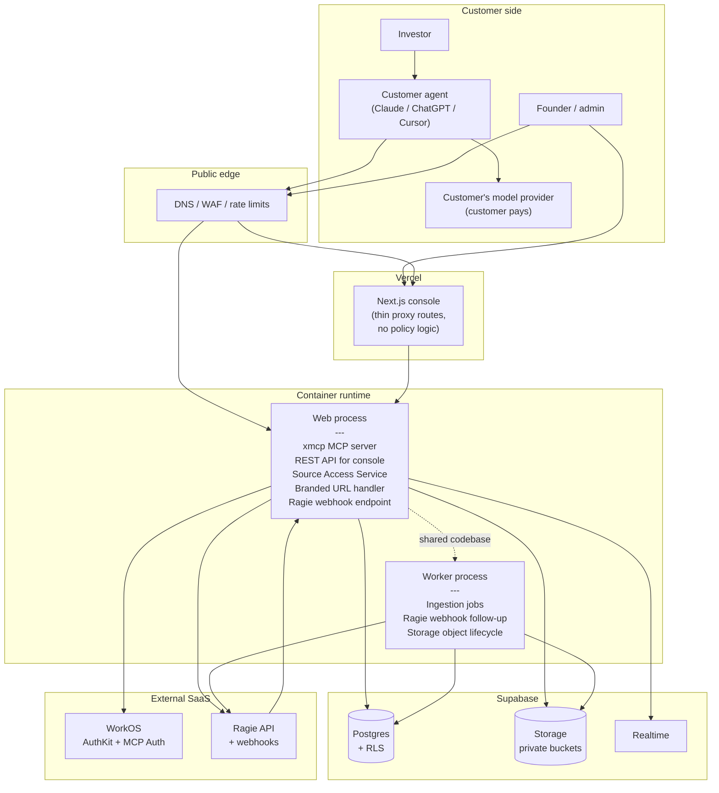
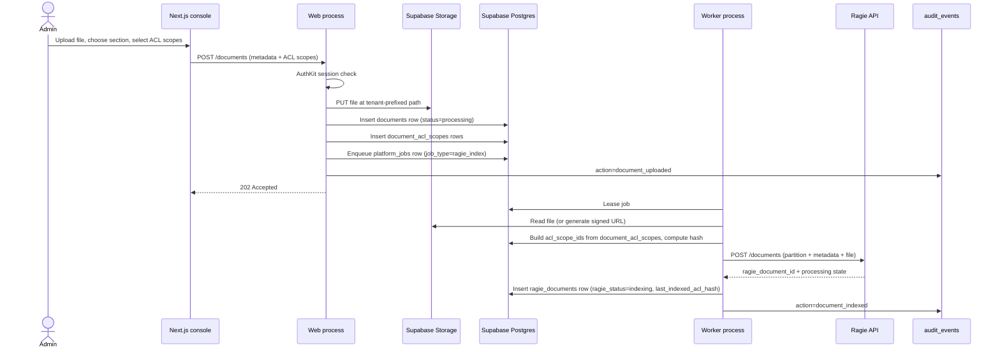
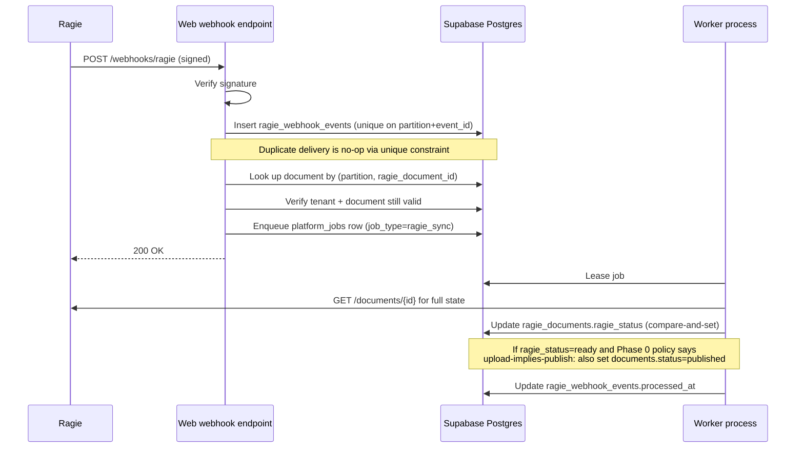
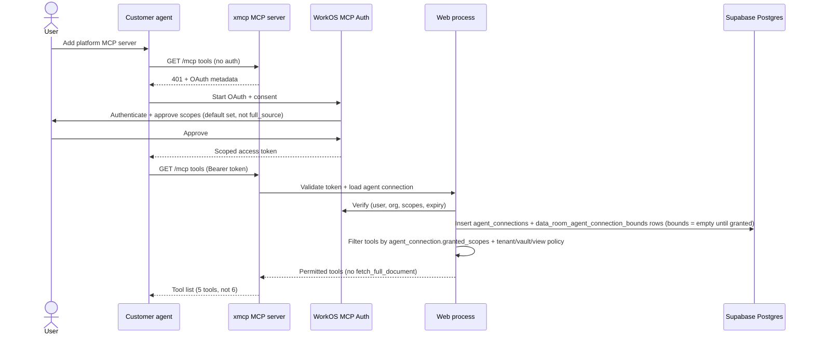
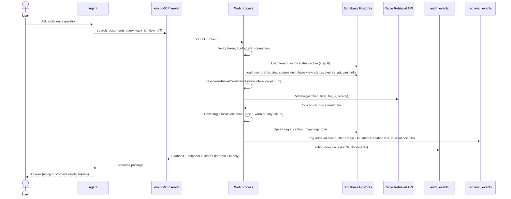
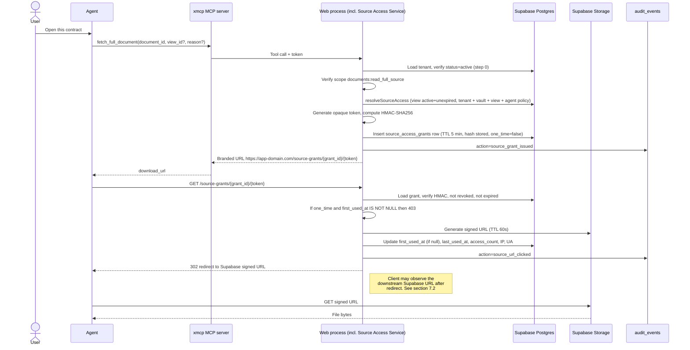
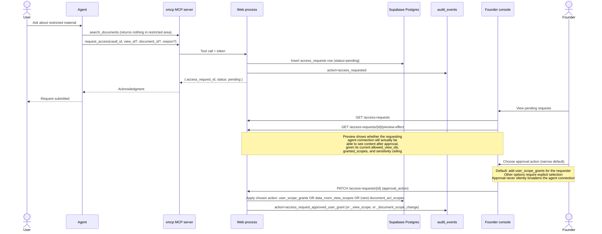
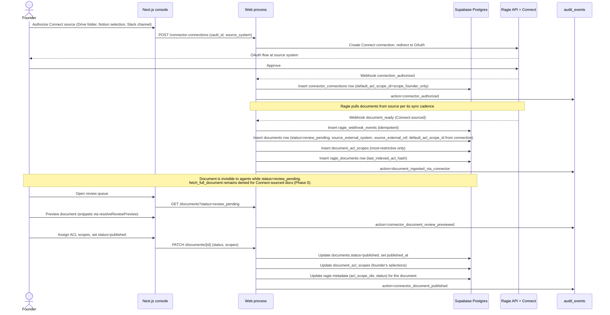
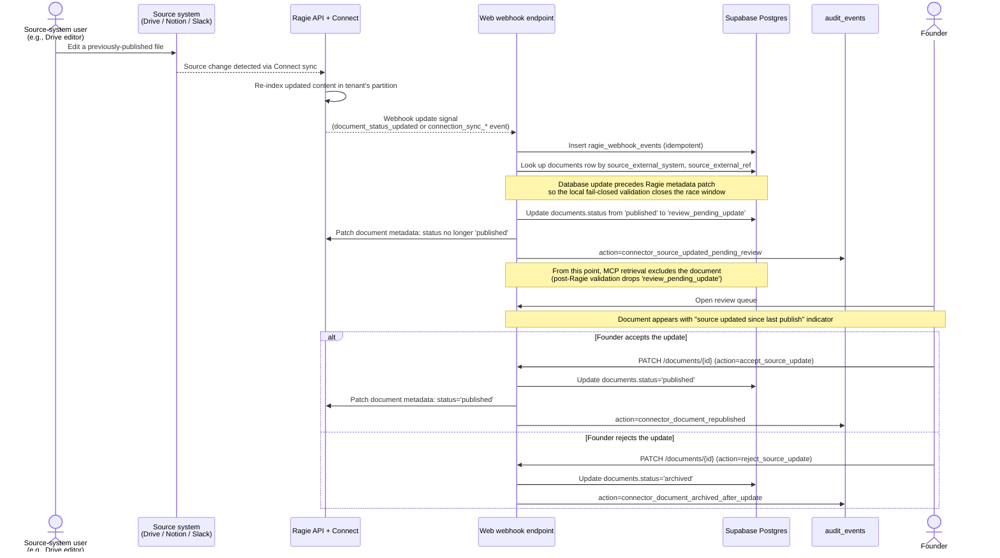

# Phase 0 Architecture: Permissioned Document Retrieval Platform

**Date:** April 27, 2026
**Status:** Phase 0 target architecture for design-partner pilot
**Scope:** Data room application for investor diligence, 3–10 design-partner customers
**Boundary:** Management console + permissioned remote MCP server

---

## 1. Executive summary

The product is a **permissioned MCP service**. Customers and their investors point their own AI agents (Claude, ChatGPT, Cursor, custom MCP clients) at our MCP endpoint and search authorized documents. We store originals, enforce policy at the boundary, audit egress, and surface citations. Ragie does the retrieval work. Customer agents pay their own model tokens.

Phase 0 commits to:

```text
Vercel-hosted Next.js management console
+ single TypeScript codebase deployed as two process types
  (web = MCP server + REST API + Source Access Service + webhook endpoint;
   worker = ingestion + Ragie webhook follow-up + lifecycle jobs)
+ WorkOS AuthKit (humans) + WorkOS MCP Auth (agents)
+ Supabase Postgres + Storage + Realtime
+ Ragie as the invisible managed RAG backend, one partition per tenant
+ Ragie Connect for throwaway demo-quality multi-source ingestion
  (Drive, Notion, Slack). Connect-sourced documents are
  searchable through MCP, but fetch_full_document is denied for them
  in Phase 0; full-file delivery is direct-upload only. Connect
  replacement still required before first paying customer.
+ First-party GitHub snapshot importer as a Phase 0 must-have.
  Ragie's public connector API does not expose GitHub/git as a source type
  as of the May 2, 2026 docs/OpenAPI review, so GitHub is implemented by
  our worker using a narrowly-installed GitHub App, source hygiene filters,
  Supabase Storage snapshots, and Ragie document ingestion.
+ Source Access Service as the single chokepoint for document content
+ six-tool MCP catalog (five default-visible, one gated):
  list_vaults, list_data_room_sections, search_documents, fetch_source,
  request_access, fetch_full_document
+ OpenTofu IaC, invoked through deployment-owned `opentofu-stack` provisioners
  (no separate top-level `infra/` tree); state in S3/R2
+ Buck/Nix builds; admitted immutable artifacts; secrets via SprinkleRef/Vault
```

The **security rule** that drives the architecture:

> External agents can only retrieve, view, or download content that both the current human user **and** the current agent connection are authorized to access. Authorization is computed before every Ragie call and before every source delivery. Post-filtering is never trusted as the security boundary, though a fail-closed local validation is performed after Ragie returns results as defense in depth.

The **product principle**:

> Users do not chat in our UI. Customers and investors bring their own agent. Our service ends at a permissioned MCP surface plus source/citation tooling.

The **demo thesis**:

> The same vault, queried by three different agents (admin, Investor A, Investor B), returns visibly different evidence packages — proving permission-aware retrieval, investor-specific views, and audited egress.

---

## 2. Scope

### 2.1 In scope for Phase 0

- Single application: data room for investor diligence
- Single tenant model: one WorkOS organization = one internal tenant
- Direct upload (console drag-and-drop or signed upload URL)
- Connector-sourced ingestion via Ragie Connect for a small set of high-value sources (Drive, Notion, Slack). Connect-sourced documents are searchable and produce snippets through `fetch_source`; `fetch_full_document` is denied for them in Phase 0. Explicitly throwaway demo implementation; replacement still scheduled before first paying customer.
- GitHub repository ingestion as a first-party Phase 0 source because it is a must-have and Ragie's current public connector source-type enum does not include GitHub or generic git. Scope: one explicitly selected GitHub repository, default branch only, README/ADR/docs/prose plus selected code files, no commit history, no private forks, no org-wide installation, source snapshots mirrored to Supabase Storage before Ragie indexing, founder review before investor visibility, and `fetch_full_document` denied for GitHub-sourced documents unless separately uploaded directly.
- Six-tool MCP catalog: five default-visible tools, one high-risk gated egress tool, no content-mutation tools
- Human auth via WorkOS AuthKit
- Agent auth via WorkOS MCP Auth (OAuth)
- Pooled Supabase + pooled Ragie (no siloed deployments)
- One Ragie partition per tenant
- Source Access Service as the single document-content chokepoint
- Tenant-leak test suite from day one
- Three-context demo (Admin, Investor A, Investor B) on a shared vault

### 2.2 Explicit non-goals

These are real product capabilities. They are not being argued against; they are sequenced. Each deferred item has a promotion trigger documented in section 19.

| Deferred                                                                                         | Why deferred for Phase 0                                                                                                                 |
| ------------------------------------------------------------------------------------------------ | ---------------------------------------------------------------------------------------------------------------------------------------- |
| Email ingestion + quarantine + classification                                                    | Cleartext-transport concerns; secure-upload-only is enough for the pilot                                                                 |
| Custom connectors for sources Ragie Connect doesn't support (except the Phase 0 GitHub importer) | Defer until 2+ design partners ask for the same unsupported source                                                                       |
| Production-grade replacement for the Phase 0 throwaway Connect implementation                    | Demo-quality is sufficient until the first paying customer is contracted; replacement is a hard gate before that point                   |
| Living FAQ / propose-and-approve artifact workflow                                               | Strong product hypothesis but unvalidated; FAQ.md as ordinary upload is the validation path                                              |
| Eval automation (LangSmith, Ragas, golden-query gates)                                           | Manual golden-query script is enough for Phase 0 quality monitoring                                                                      |
| Enterprise SSO + SCIM                                                                            | Not needed for design partners; AuthKit-only is sufficient                                                                               |
| WorkOS FGA                                                                                       | Local ACL tables handle the current resource hierarchy cleanly                                                                           |
| Multi-app abstraction                                                                            | Building for one app (data room); abstractions emerge with the second                                                                    |
| Branches as a separate concept from views                                                        | `data_room_views.base_view_id` covers one-level additive inheritance                                                                     |
| Tools: `summarize_documents`, `create_agent_task`, `export_citations`, all write tools           | None required for the demo; each carries its own egress and audit profile                                                                |
| Source-preview URLs from `fetch_source`                                                          | `fetch_source` returns inline passages only in Phase 0; URL-based preview gated by tenant/view policy is a Phase 1 feature               |
| Spacelift                                                                                        | OpenTofu with S3/R2 state is enough until infra change traffic justifies managed execution                                               |
| Native chat UI                                                                                   | Validates the BYO-agent thesis before considering one                                                                                    |
| Multi-region / data residency                                                                    | First EU contract triggers this work                                                                                                     |
| Entity extraction                                                                                | No structured-metadata use case yet has demand                                                                                           |
| Multiple Ragie metadata-policy versions                                                          | One policy in Phase 0; reindex per tenant on any change                                                                                  |
| Separate ingestion-worker microservice                                                           | Two process types in one codebase covers reliability without service split                                                               |
| Provider abstraction layer (RetrievalProvider interface, filter DSL, etc.)                       | Premature; stable internal IDs and canonical originals preserve the exit path                                                            |
| Per-document rate limits                                                                         | Three-dimension limits cover Phase 0 threat model                                                                                        |
| Streaming download proxy with mid-TTL revocation and byte-level audit                            | Branded redirect handler with short TTLs is sufficient; full byte audit and mid-TTL revocation require a streaming proxy that's deferred |
| Subtractive view inheritance                                                                     | Additive overlay covers Phase 0 demo cleanly                                                                                             |
| Multi-level base-view chains                                                                     | One level (`view → base_view`) is enough; deeper chains add complexity without earned value                                              |
| HMAC secret rotation                                                                             | Single source-grant HMAC secret in Phase 0; versioned rotation contract documented but not exercised                                     |

---

## 3. Architectural principles (load-bearing)

These five principles are the architecture. Every other decision in this document is downstream of them, and any future change should be tested against them.

1. **The MCP server and the Source Access Service together are the only externally-reachable paths that return document content.** Agents enter through MCP. The console UI calls the same Source Access Service that MCP calls; nothing else returns chunks or source files.
2. **Authorization is computed before every retrieval and every source delivery.** A single function (`resolveRetrievalConstraints` or `resolveSourceAccess`) computes the partition, filter, and allowed operations from authoritative state. The agent's request supplies only the query string and citation IDs; never filters. After Ragie returns results, a fail-closed local validation runs as defense in depth — but the pre-filter remains the security boundary.
3. **Tenant isolation runs through three layers: Ragie partitions, Ragie metadata pre-filters, and Postgres RLS as defense-in-depth.** All three are exercised by the tenant-leak test suite before every deploy. Composite tenant-aware foreign keys add a fourth layer at the schema level for high-risk relationships.
4. **Originals stay in Supabase Storage; Ragie is replaceable.** Internal IDs are ours; Ragie IDs are stored as provider references and never leave our boundary. Agents see our IDs, our citation model, our URLs.
5. **No platform-owned answer-generation model in the production path.** Customer agents own answer generation and pay the associated model-token costs. (Ragie internally uses managed models for parsing, embedding, and reranking; that is a managed-service implementation detail, not a platform-operated answer model.)

---

## 4. Glossary

| Term                      | Meaning                                                                                                                |
| ------------------------- | ---------------------------------------------------------------------------------------------------------------------- |
| **MCP**                   | Model Context Protocol; how external agents call our tools                                                             |
| **Agent**                 | Customer-controlled AI client (Claude, ChatGPT, Cursor, etc.)                                                          |
| **Tenant**                | One customer organization, 1:1 with a WorkOS organization                                                              |
| **Vault**                 | One data room                                                                                                          |
| **Section**               | A node in a vault's section map (e.g., "05 Financials and Metrics")                                                    |
| **View**                  | A permissioned projection of a vault, typically per investor or guest group                                            |
| **ACL scope**             | A logical grant tag attached to documents, views, and user grants                                                      |
| **Tool scope**            | A capability grant on an agent connection (e.g., `documents:search`); distinct from an ACL scope                       |
| **Ragie partition**       | A Ragie namespace; one per tenant in this design                                                                       |
| **Citation**              | A chunk-level reference returned by retrieval, mapped to our internal IDs                                              |
| **Agent connection**      | A scoped, revocable OAuth grant from a human to a specific agent client                                                |
| **Source Access Service** | The internal service that mediates all document-content delivery (citation passages, full documents, console previews) |
| **Source access grant**   | A row recording an authorized source delivery, queryable for revocation and debugging                                  |
| **Audit event**           | An immutable record of an action that occurred (MCP call, console action, system event)                                |

---

## 5. System overview

### 5.1 High-level component diagram



Read this as: every chunk and every source URL flows through `Web process → MCP boundary or branded URL handler → Agent`. The console UI does not bypass the Source Access Service for source delivery.

### 5.2 Process topology

| Component             | Runtime                                                                                          | Notes                                                                                                                                       |
| --------------------- | ------------------------------------------------------------------------------------------------ | ------------------------------------------------------------------------------------------------------------------------------------------- |
| Next.js console       | Vercel                                                                                           | Frontend + thin authenticated API routes that proxy to the web process. **No policy logic in Vercel routes.**                               |
| Web process           | Container runtime (Fly / Render / Railway / Cloud Run)                                           | xmcp MCP server, REST API for console, Source Access Service, branded URL handler, Ragie webhook endpoint. Handles all user-facing traffic. |
| Worker process        | Same container runtime                                                                           | Ingestion jobs, Ragie webhook follow-up, storage cleanup. Same Docker image as web; different entry point.                                  |
| Database              | Supabase Postgres                                                                                | Source of truth. RLS enabled on tenant-scoped tables.                                                                                       |
| Object storage        | Supabase Storage                                                                                 | Originals, generated previews. Private buckets, tenant-prefixed paths.                                                                      |
| Realtime              | Supabase Realtime                                                                                | Console processing-status updates only.                                                                                                     |
| Job queue             | Postgres-backed `platform_jobs` table + `LISTEN/NOTIFY`                                          | No separate broker in Phase 0.                                                                                                              |
| Identity              | WorkOS AuthKit + MCP Auth                                                                        |                                                                                                                                             |
| Retrieval             | Ragie                                                                                            | One partition per tenant; metadata filters do role/view/sensitivity scoping.                                                                |
| Audit / observability | Postgres audit tables + structured logs                                                          | No LangSmith.                                                                                                                               |
| IaC                   | OpenTofu, invoked through deployment-owned `opentofu-stack` provisioners (§17.3); state in S3/R2 | No Spacelift.                                                                                                                               |
| Build / deploy        | Buck2 + Nix; admitted immutable artifacts published through the repo `deploy` front door (§17)   | Vercel git auto-build is not the protected/shared production path.                                                                          |

### 5.3 The boundary rules

Two externally-reachable surfaces:

- **Console REST API** — humans only, WorkOS AuthKit session. Handles upload, vault config, view management, audit viewing, source preview. Calls the Source Access Service for any source delivery.
- **MCP server** — agents only, WorkOS MCP Auth OAuth bearer token. Returns retrieval results and source URLs. Calls the Source Access Service for any source delivery.

`search_documents` returns bounded snippets inline as part of the retrieval response (mediated by the Retrieval Gateway and the post-Ragie local validation). All follow-up access — citation passages, full documents, console previews — goes through the Source Access Service. Both paths converge there, which preserves a single auditable code path while allowing the console to legitimately preview content.

Vercel API routes are stateless: they verify the AuthKit session and forward to the web process. Policy logic does not live in Vercel.

---

## 6. Authorization model

### 6.1 One source of truth

Supabase tables. WorkOS provides identity, organization membership, and basic roles (`admin`, `member`). Supabase owns scope grants, view memberships, agent connections, and per-document ACL tags.

WorkOS FGA is **not** used in Phase 0. Local ACL tables handle the current resource hierarchy with clear, testable joins.

Postgres RLS is enabled on tenant-scoped tables as defense in depth. The web process always applies tenant filters in queries; RLS catches developer mistakes and contributes to SOC-2 evidence.

### 6.2 The retrieval authorization function

```typescript
function resolveRetrievalConstraints(args: {
  user: WorkOSUser;
  agentConnection: AgentConnection;
  vaultId: string;
  viewId?: string;
}): {
  ragiePartition: string;
  metadataFilter: RagieFilter;
  resolvedViewId: string;
  allowedScopeIds: string[];
  maxSensitivityRank: number;
};
```

Steps:

0. Load tenant; reject unless `tenants.status = 'active'`.
1. Verify the user is a member of the tenant that owns the vault.
2. Load `agent_connection`; verify it is not revoked or expired; verify `granted_scopes` (tool scopes such as `documents:search`) permits the requested operation.
3. Load the data-room bounds for this connection (`data_room_agent_connection_bounds` keyed by `(tenant_id, agent_connection_id)`). **Absence of a bounds row is `AuthzDenied`, not a permissive default.** If the row exists, verify the vault is in `allowed_vault_ids` and the user is permitted on the vault.
4. Resolve the view (see view resolution rule in 6.3).
5. Compute `effective_acl_scope_ids`:
   - Start with the resolved view's scopes (from `data_room_view_scopes`, including base-view inheritance).
   - Intersect with the user's ACL scope grants (from `user_scope_grants`).
   - The agent connection itself does not carry an independent ACL-scope list; its access is constrained by `allowed_view_ids`, `granted_scopes`, and `max_sensitivity_rank`. ACL-scope narrowing is achieved by limiting the agent's allowed views.
6. Select the tenant's Ragie partition: `prod_tenant_{tenant_id}`.
7. Build the Ragie metadata filter:
   - `tenant_id = current tenant`
   - `vault_id = current vault`
   - `status = "published"`
   - `acl_scope_ids ∈ effective_acl_scope_ids`
   - `sensitivity_rank ≤ min(agent_connection.max_sensitivity_rank, view sensitivity ceiling)`

Any failure throws a typed `AuthzDenied` before any Ragie call. There is no code path that calls Ragie retrieval without going through this function.

### 6.3 View resolution rule

The optional `view_id` parameter (on `search_documents`, `fetch_source`, and `fetch_full_document`) follows a strict rule:

- If the agent connection has **exactly one** allowed view for the vault → infer that view; `view_id` is optional.
- If the agent has **multiple** allowed views → `view_id` is required; omitting it returns `AuthzDenied`.
- If the agent has **no** views for the vault → return `AuthzDenied`.
- An omitted `view_id` is **never** treated as "union of all visible views."

Additionally, the resolved view must be **active and unexpired**:

- `data_room_views.status = 'active'`
- `data_room_views.expires_at IS NULL` OR `expires_at > now()`

Expired or non-active views are treated as inaccessible for both retrieval and source access. This applies uniformly across all three view-aware tools.

`data_room_agent_connection_bounds.allowed_vault_ids` and `allowed_view_ids` are non-null arrays (default `'{}'`). An empty array means "no allowed vaults/views," not "all" — security code is easier to reason about when absence means absence.

### 6.4 Base-view inheritance rule

Phase 0 supports at most **one level** of base-view inheritance:

- A child view (`base_view_id IS NOT NULL`) inherits all scopes from its base view via `data_room_view_scopes`.
- A child view may **add** overlay scopes (additive inheritance).
- A child view may **not** subtract individual base scopes (subtractive inheritance is deferred — see promotion triggers).
- A view's `base_view_id` may not point to itself (self-reference rejected).
- A base view may not itself have a `base_view_id` (chains are rejected; one level only).
- Cycles are rejected at view-creation time.

These rules are enforced in `resolveRetrievalConstraints` and tested in the tenant-leak suite.

### 6.5 Post-Ragie local validation (defense in depth)

After Ragie returns candidates, run a fail-closed validation against authoritative DB state before returning results:

1. Map each Ragie document/chunk ID to the internal document/citation ID via `ragie_citation_mappings`.
2. Verify each document belongs to the current `tenant_id` and `vault_id`.
3. Verify `documents.status = 'published'` (this excludes both `'review_pending'` and `'review_pending_update'` Connect-sourced documents; the latter is the state assigned when Ragie reports an upstream source change after a previous publish, see §8.8.7).
4. Verify document ACL scopes (from `document_acl_scopes`) still intersect the resolved `effective_acl_scope_ids`.
5. Verify `sensitivity_rank ≤ ceiling`.
6. Drop any result that fails. Write an `audit_events` warning row indicating which check failed.

This is **not** post-filtering as the security boundary. The pre-filter remains the boundary. This step is a fail-closed assertion that catches metadata drift, Ragie bugs, document status changes between indexing and retrieval, ACL changes after indexing, and implementation mistakes in filter construction. If the assertion ever fires in production, it's a signal of a deeper bug to investigate.

`ragie_documents.last_indexed_acl_hash` (a hash of the document's ACL scope set at index time) helps debug whether a validation failure stems from stale Ragie metadata vs. a logic bug — at incident time, comparing the current `document_acl_scopes` hash to `last_indexed_acl_hash` immediately identifies drift.

### 6.6 The source access authorization function

```typescript
function resolveSourceAccess(args: {
  callerContext: McpCallerContext | ConsoleCallerContext;
  citationId?: string;
  documentId?: string;
  viewId?: string;
  accessType: "inline_passage" | "full_document" | "console_preview";
}):
  | {
      authorized: true;
      document: Document;
      resolvedViewId: string;
      deliveryMode: "inline_passage" | "branded_redirect";
      ttlSeconds: number;
    }
  | { authorized: false; reason: string };
```

Steps:

0. Load tenant; reject unless `tenants.status = 'active'`.
1. Apply the view-resolution rule from 6.3 (including active-and-unexpired check).
2. Verify caller-context-specific permissions:

| Caller         | Effective permissions                                                                     |
| -------------- | ----------------------------------------------------------------------------------------- |
| MCP caller     | `human_user_grants ∩ resolved_view_scopes ∩ agent_connection_tool_scopes ∩ tenant_policy` |
| Console caller | `human_user_grants ∩ console_role_permissions ∩ tenant_policy`                            |

The console may legitimately preview content the user owns or administers; an agent is always restricted to the additional intersection with its tool-scope grants. The agent connection has no independent ACL-scope list; ACL scoping is mediated through the resolved view.

### 6.7 Human vs agent permissions

Human grants and agent grants answer different questions and are intersected:

- **Human grant** — what can this person reach? (ACL scopes via `user_scope_grants`)
- **Agent grant** — what can this client do on behalf of that person? (tool scopes via `agent_connections.granted_scopes` plus `max_sensitivity_rank` in platform-db; `allowed_vault_ids` and `allowed_view_ids` in `data_room_agent_connection_bounds` in data-room-db)

This separation enables (a) per-agent revocation without disabling the human, (b) per-tool risk profiles (search vs. full-document fetch require different tool scopes), and (c) clean audit attribution.

Phase 0 agent tool-scope set:

| Tool scope                   | Default | Purpose                        |
| ---------------------------- | ------: | ------------------------------ |
| `vaults:list`                |      on | List visible vaults            |
| `sections:list`              |      on | List visible section map       |
| `documents:search`           |      on | Search authorized chunks       |
| `documents:read_snippet`     |      on | Fetch authorized passages      |
| `documents:read_metadata`    |      on | Read visible document metadata |
| `documents:read_full_source` | **off** | Fetch full source documents    |
| `access:request`             |      on | Submit access requests         |

Out of scope for Phase 0: `exports:create`, all `admin:*`, all write scopes.

### 6.8 Access-request approval semantics

Approving an `access_requests` row is the riskiest write operation in Phase 0 because, done carelessly, it can broaden a document's visibility beyond the requesting party. The default approval flow uses the **narrowest** grant that satisfies the request:

| Approval action          | Effect                                                                                             | When to use                                                                                             |
| ------------------------ | -------------------------------------------------------------------------------------------------- | ------------------------------------------------------------------------------------------------------- |
| `add_user_scope_grant`   | Insert a `user_scope_grants` row for the requesting user against an existing scope                 | Default. Grants this specific person access without changing document tagging                           |
| `add_view_scope`         | Insert a `data_room_view_scopes` row attaching an investor-specific scope to the requester's view  | When a whole view (e.g., Investor A) should gain access                                                 |
| `add_document_acl_scope` | Insert a `document_acl_scopes` row tagging the document with a scope visible to a broader audience | **Rare and deliberate**. Must be confirmed in the console with explicit "promote into broader scope" UX |

Each action writes a distinct audit signature:

```text
audit_events.action ∈ {
  access_request_approved_user_grant,
  access_request_approved_view_scope,
  access_request_approved_document_scope_change,
  access_request_rejected
}
```

The console's approval UI defaults to `add_user_scope_grant`. The other two require explicit selection.

**Approval never silently broadens an agent connection.** A `user_scope_grants` row affects what the human user can reach, but the requesting agent connection is still bounded by its existing `granted_scopes` and `max_sensitivity_rank` (in `agent_connections`) plus `allowed_vault_ids` and `allowed_view_ids` (in `data_room_agent_connection_bounds`). If the founder's intent is for the requesting agent to gain access to higher-risk tools (e.g., `documents:read_full_source`) or to a new view, the console must explicitly modify the agent connection or require the user to reconnect/reauthorize the agent.

The console approval UI shows a preview of whether the requesting agent will actually be able to see the newly granted content given its current connection limits, so a founder doesn't approve a request that has no practical effect for the requesting agent.

### 6.9 Review-queue preview authorization (Phase 0 throwaway)

Connect-sourced documents land in `documents.status = 'review_pending'` (first ingestion) or transition to `'review_pending_update'` (when Ragie reports an upstream source update after a previous publish, see §8.8.7). Both are dropped by the standard post-Ragie validation in §6.5. To allow founders to preview these documents and decide whether to publish, a separate authorization path is defined — strictly distinct from the MCP retrieval path, with no agent exposure.

```typescript
function resolveReviewPreview(args: {
  consoleUser: WorkOSUser;
  vaultId: string;
  documentId?: string;
  query?: string;
}): {
  ragiePartition: string;
  metadataFilter: RagieFilter;
  // Includes documents.status IN ('review_pending', 'review_pending_update', 'published')
};
```

Steps:

0. Verify `tenants.status = 'active'`.
1. Verify the console session is authenticated via WorkOS AuthKit.
2. Verify the console user has `admin` or `founder` role on the tenant.
3. Verify the vault belongs to the tenant.
4. Build a Ragie metadata filter:
   - `tenant_id`, `vault_id` required
   - `status IN ('review_pending', 'review_pending_update', 'published')`
   - `document_id` if specified (single-document preview)
   - No ACL scope filter (admin sees all in their tenant; that is the point of the review queue)
5. Run the retrieval call.
6. Run a relaxed post-Ragie validation: same as §6.5 but allowing `'review_pending'` and `'review_pending_update'` in addition to `'published'`.
7. Write an `audit_events` row with `action = connector_document_review_previewed`.

Non-negotiable constraints:

- This path is **never** exposed through MCP. The `data-room-mcp-tools` package may not call `resolveReviewPreview`; it is reachable only from console REST handlers.
- It returns snippets only; it does **not** create `source_access_grants` rows; it does **not** issue full-document URLs.
- It is gated by console role, not by the agent-scope model.
- Every call writes an audit row; query text and document IDs are recorded under the same trace-hygiene policy as `retrieval_events.query_text` (§14.5).

This preserves the rule that `'review_pending'` and `'review_pending_update'` documents are invisible to agents while still allowing founders to do the placement/review work the connector flow requires.

---

## 7. Source Access Service

The Source Access Service is the single chokepoint for document-content delivery beyond search snippets. It is called by both the MCP server (for `fetch_source` and `fetch_full_document`) and the console (for source preview).

### 7.1 Responsibilities

- Resolve source-access authorization (`resolveSourceAccess`)
- Issue branded source URLs that resolve to short-lived Supabase signed URLs
- Create `source_access_grants` rows for every URL issued (but not for inline passage delivery)
- Write `audit_events` rows for every access decision and click
- Enforce rate limits (three dimensions: agent connection, user, tenant)
- Re-validate grants at click time (branded URL handler)

### 7.2 The branded redirect pattern

Source URLs returned to agents and the console are on our domain, not Supabase or Ragie. Each URL embeds both the grant ID and an opaque token; only the token's HMAC hash is stored in the database.

**Token format and storage.** The token is generated as 32 random bytes encoded as URL-safe base64. Storage uses HMAC-SHA256, not a bare hash:

```text
grant_token_hash = HMAC-SHA256(source_grant_secret, raw_token)
```

The `source_grant_secret` lives in the runtime secret manager. A versioned-secret contract is documented for future rotation: a `token_secret_version` column would be added to `source_access_grants` when rotation ships. Phase 0 uses a single secret version; rotation itself is deferred to Phase 1.

Using HMAC rather than a bare hash defends against database exposure: an attacker with read access to `source_access_grants` cannot brute-force tokens without the HMAC secret.

**Flow:**

```text
Agent calls fetch_full_document(document_id, view_id?, reason?)
  → Source Access Service authorizes (tenant + view + agent scope policy)
  → generates random opaque token; computes HMAC hash
  → creates source_access_grants row with grant_token_hash, expires_at=now+5min
  → writes audit_events row (action=source_grant_issued)
  → returns https://app-domain.com/source-grants/{grant_id}/{token}

Agent or user opens the URL
  → branded URL handler in web process receives request
  → looks up grant by ID; rejects if not found (403)
  → recomputes HMAC of provided token; rejects on mismatch (403)
  → rejects if revoked_at is set (403) or expired (410)
  → rejects if grant.one_time = true and first_used_at is already set (403)
  → issues a fresh, very-short-TTL (60s) Supabase signed URL
  → updates first_used_at (if null), last_used_at, access_count, last_access_ip, last_access_user_agent
  → 302 redirects to the signed URL
  → writes audit_events row (action=source_url_clicked)
```

What this buys us:

- Branded user-facing URL in the MCP response (no Ragie or raw Supabase exposure at the MCP boundary)
- Click-time re-validation (revocation enforced when the user attempts to use the URL)
- Click-event audit (every actual access, with a per-grant access count)
- Resistance to URL guessing (HMAC hash, not bare hash, and the token is the bearer secret)
- Bypass window shrinks to the downstream Supabase signed URL TTL (~60s)

What we explicitly do not claim:

- **The HTTP client never sees a Supabase URL.** The branded URL handler returns a 302 to a short-lived Supabase signed URL. Some clients (browsers, agents that surface the redirect chain) may expose that final URL in dev tools, server logs, or referrer headers. The branding boundary holds at the MCP response, not at the client's final observed URL. Eliminating client visibility of the downstream URL would require a streaming proxy.
- **Mid-TTL revocation** of an already-redirected Supabase signed URL. If the grant is revoked at second 30 of the downstream URL's 60-second TTL, that URL remains valid until it expires.
- **Byte-level download audit.** With a redirect to a Supabase signed URL, we reliably log issuance and click but not completed download bytes. `source_access_grants.bytes_delivered` may therefore be null in Phase 0.

All three limitations are accepted Phase 0 constraints. A streaming proxy that adds full-URL containment, mid-TTL revocation, and byte-level audit is on the Phase 1 promotion list and ships when a high-sensitivity customer requires it.

### 7.3 `fetch_full_document` requirements

`fetch_full_document` is part of Phase 0, but it is a high-risk egress tool. The complete spec — these are standard requirements, not fallback rules:

- Agent connection must hold `documents:read_full_source` (non-default scope)
- Tenant policy must enable full-document fetch (`tenant_policies.full_document_fetch_enabled`)
- Vault policy must enable full-document fetch (`vaults.full_document_fetch_enabled`)
- View policy must enable full-document fetch (`data_room_views.full_document_fetch_enabled`) — view resolved per the 6.3 rule, including active-and-unexpired check
- Tenant must be `tenants.status = 'active'`
- Document must be direct-upload (`documents.source_external_system IS NULL`); Connect-sourced and GitHub-sourced documents are not eligible for `fetch_full_document` in Phase 0 (see §8.8 and §8.9). Investors who need a particular external-source document downloadable can have it directly uploaded by the founder.
- All six must be true (logical AND)
- Branded URL TTL ≤ 5 minutes (grant lifetime)
- Downstream Supabase signed URL TTL ≤ 60 seconds (issued at click time)
- One document per call (no bulk fetch)
- Three-dimension rate limits enforced (per agent connection, per user, per tenant)
- Branded host only on the MCP response (the client may observe the downstream Supabase URL after redirect; see 7.2)
- Both `source_access_grants` row and `audit_events` row written
- Source URL token is opaque random; only its HMAC hash is stored
- `one_time` defaults to false in Phase 0 (agents may follow redirects more than once); enabled per-tenant only when validated against target agent clients

### 7.4 Operations that create grants vs. audit-only events

Not every operation that returns content creates a `source_access_grants` row. The distinction is whether a reusable URL is issued. In Phase 0, only `fetch_full_document` and console source previews issue URLs; `fetch_source` returns inline passages only.

| Operation                                                                                              |                            Creates grant row?                            | Audit event                                              |
| ------------------------------------------------------------------------------------------------------ | :----------------------------------------------------------------------: | -------------------------------------------------------- |
| `search_documents` (bounded snippets inline)                                                           |                                    No                                    | `tool_call` + `retrieval_event`                          |
| `fetch_source` (inline passage, no URL)                                                                |                                    No                                    | `tool_call` + `source_passage_delivered`                 |
| `fetch_full_document`                                                                                  |                   Yes (`access_type='full_document'`)                    | `tool_call` + `source_grant_issued`                      |
| Branded URL clicked                                                                                    | Updates existing grant (`first_used_at`, `last_used_at`, `access_count`) | `source_url_clicked`                                     |
| Console source preview (URL-based)                                                                     |                  Yes (`access_type='console_preview'`)                   | `console_action` + `source_grant_issued`                 |
| Console inline preview (no URL, e.g., text view)                                                       |                                    No                                    | `console_action` + `source_passage_delivered`            |
| Console review-queue preview (Connect-sourced `review_pending` docs; via `resolveReviewPreview`, §6.9) |                                    No                                    | `console_action` + `connector_document_review_previewed` |
| `request_access`                                                                                       |                                    No                                    | `tool_call` + `access_requested`                         |

The rule: a grant row is created whenever a reusable URL is issued. Inline content delivery is audit-only.

### 7.5 Permission distinction by access type

| Access type               | Typical scope                                  | Source                                                                                       |
| ------------------------- | ---------------------------------------------- | -------------------------------------------------------------------------------------------- |
| Search result snippets    | `documents:search`                             | Inline in MCP `search_documents` response (via Retrieval Gateway, not Source Access Service) |
| Citation passage (inline) | `documents:read_snippet`                       | Inline in `fetch_source` response                                                            |
| Full document             | `documents:read_full_source`                   | Branded redirect URL via Source Access Service                                               |
| Console preview           | (human user permission only, no agent context) | Branded redirect URL or inline text via Source Access Service                                |

### 7.6 `fetch_source` re-checks authorization on every call

A citation ID returned from a previous `search_documents` call is **not** a permanent capability. Each `fetch_source(citation_id, view_id?)` call must:

1. Load the citation mapping.
2. Load the document.
3. Re-run `resolveSourceAccess` with the current user, agent connection, and resolved view (which includes the tenant status check, the view active/unexpired check, and the full caller-context permission check).
4. Verify tenant/vault/view/scope/sensitivity all still apply.
5. Return or deny.
6. Write the audit row.

This prevents an old citation from surviving permission changes (revocation, scope reduction, document status change, view expiry).

---

## 8. Ragie retrieval design

### 8.1 Partition strategy: one partition per tenant

```
partition = "prod_tenant_{tenant_id}"
```

Ragie partition names must be lowercase alphanumeric and may include `_` and `-` only. The platform therefore derives this value from a lowercase internal tenant UUID or another normalized tenant key, never directly from an arbitrary WorkOS organization slug. The Ragie client wrapper always sends the partition explicitly on every partition-aware operation; relying on Ragie's default partition behavior is forbidden.

All vault, section, view, and ACL scoping is done via metadata filters. Reasoning:

- Minimizes partition count (10 design partners → 10 partitions)
- Trivial webhook routing (partition uniquely identifies tenant)
- Smaller blast radius for Ragie pricing or operational changes

Promotion to per-vault partitions is documented in section 19.

### 8.2 Required metadata on every Ragie document

```json
{
  "tenant_id": "tenant_123",
  "vault_id": "vault_789",
  "internal_document_id": "doc_abc",
  "section_id": "section_financials",
  "section_path": "05 Financials and Metrics",
  "acl_scope_ids": ["scope_common_investor", "scope_investor_a"],
  "status": "published",
  "sensitivity_rank": 20,
  "document_kind": "financial_statement",
  "created_at_unix": 1770000000,
  "updated_at_unix": 1770000000
}
```

Ragie reserves default metadata keys such as `document_id`, `document_type`, `document_source`, `document_name`, and `document_uploaded_at`, and rejects user metadata keys beginning with `_`. The platform never attempts to overwrite those keys. Internal IDs therefore use platform-owned names such as `internal_document_id` rather than `document_id`. Metadata values stay within Ragie's supported types (`string`, `number`, `boolean`, and list-of-string) and the 1000-value metadata limit.

`acl_scope_ids` is built from the `document_acl_scopes` join table at index time and on every update — not from `documents.default_acl_scope_id` alone. A document can belong to multiple scopes (e.g., common investor pool + Investor A overlay).

`document_kind` is free-text (not a Postgres enum) so future kinds (e.g., `faq`, `memo`) can be added without migration.

The hash of this metadata's `acl_scope_ids` set is also written to `ragie_documents.last_indexed_acl_hash`, so post-Ragie validation failures can be diagnosed as drift vs. logic bugs (section 6.5).

### 8.3 Ragie array-filter semantics validation (week 1 spike, blocking)

The entire ACL model assumes that Ragie's `$in` operator against an array-valued metadata field has **any-overlap** semantics:

```text
Document metadata: acl_scope_ids = ["A", "B"]
Filter: { "acl_scope_ids": { "$in": ["B", "C"] } }
Expected result: document is eligible (B is in both)
```

Ragie's public metadata-filter documentation currently describes this exact any-overlap behavior for list-of-string metadata and `$in` filters, but Gate 1 still requires a real live-call regression before the production path relies on it. Documentation can drift, account behavior can differ, and this encoding is security-critical.

If the assumption fails, fall back to a boolean-per-scope encoding:

```json
"acl_scope_common_investor": true,
"acl_scope_investor_a": true
```

with filters constructed as `$or` over the boolean keys. This is more verbose but avoids array-filter ambiguity.

### 8.4 Retrieval filter and call

For Investor A searching a vault view:

```json
{
  "partition": "prod_tenant_123",
  "query": "What are the revenue trends and main risks?",
  "filter": {
    "$and": [
      { "tenant_id": "tenant_123" },
      { "vault_id": "vault_789" },
      { "status": "published" },
      { "acl_scope_ids": { "$in": ["scope_common_investor", "scope_investor_a"] } },
      { "sensitivity_rank": { "$lte": 20 } }
    ]
  },
  "top_k": 20,
  "rerank": true,
  "max_chunks_per_document": 3
}
```

Every filter field is computed by `resolveRetrievalConstraints` from authoritative state. The agent supplies only the query string.

Ragie metadata filtering is treated as a pre-filter. Reranking may reduce the number of returned chunks, so callers do not treat `top_k` as a guaranteed result count, but reranking is not allowed to broaden the authorized document set.

### 8.5 Citation mapping

`ragie_citation_mappings` is the bridge between Ragie chunk IDs and our internal IDs. Agents never see Ragie IDs; they receive our citation UUIDs.

### 8.6 Document lifecycle: product status vs. provider status

`documents.status` and `ragie_documents.ragie_status` are **deliberately separate**:

| Field                          | Meaning                     | Lifecycle                                                                                                                                                    |
| ------------------------------ | --------------------------- | ------------------------------------------------------------------------------------------------------------------------------------------------------------ |
| `documents.status`             | Product visibility decision | `processing` → `published` (or `archived`, `rejected`)                                                                                                       |
| `ragie_documents.ragie_status` | Provider processing state   | Ragie statuses such as `pending`, `partitioning`, `partitioned`, `refined`, `chunked`, `indexed`, `summary_indexed`, `keyword_indexed`, `ready`, or `failed` |

For Phase 0 demo simplicity, the worker promotes `documents.status = 'published'` when `ragie_documents.ragie_status = 'ready'` and the document was uploaded directly through the console. This is a Phase 0 product policy ("upload = publish after successful Ragie indexing"), not an automatic schema-level coupling. A future phase can interpose human review (e.g., for email-ingested or connector-sourced documents) by changing the worker policy without changing the schema.

The post-Ragie local validation always checks `documents.status = 'published'`, never `ragie_documents.ragie_status`. This means if a document is unpublished (e.g., archived) but still indexed in Ragie, it will not appear in retrieval results.

### 8.7 Evidence response shape

The MCP `search_documents` tool returns a stable, Ragie-free response shape:

```json
{
  "results": [
    {
      "citation_id": "our_citation_uuid",
      "document_id": "our_document_uuid",
      "title": "Customer Contracts Summary",
      "section_path": "08 Contracts",
      "snippet": "...",
      "page_range": "3-4",
      "score": 0.82
    }
  ]
}
```

Agents never receive Ragie IDs, Ragie URLs, Ragie partition names, or Ragie branding.

### 8.8 Ragie Connect ingestion (Phase 0 throwaway)

Phase 0 uses Ragie Connect to provide demo-quality multi-source ingestion from Drive, Notion, and Slack. GitHub is not part of Ragie Connect in Phase 0; it is implemented through the first-party snapshot importer in §8.9. Connect-sourced documents are searchable through MCP and produce snippets through `fetch_source`, but `fetch_full_document` is denied for them in Phase 0 (the storage principle is strained for Connect-sourced documents — see §8.8.3). This is **explicitly throwaway**: it must be replaced with a production-grade implementation before the first paying customer. The replacement triggers and the constraints that make the throwaway version safe are documented here.

#### 8.8.1 What Connect does

A founder authorizes a Connect source (e.g., a specific Drive folder) through Ragie's OAuth-hosted flow. Ragie returns a connection identifier. Documents in that source are pulled into the tenant's Ragie partition with the metadata we configure per connection. Webhook events are delivered through the same Ragie webhook path used for direct uploads. The platform does not pull file content from Ragie or mirror it to Supabase Storage; for Connect-sourced documents, retrieval and snippet delivery work, but full-file fetch is not supported in Phase 0.

#### 8.8.2 Constraints that keep the throwaway version safe

The demo-quality nature of the implementation does not extend to security or permission boundaries. The following constraints are non-negotiable even in throwaway mode:

- **Most-restrictive default ACL.** Every Connect-sourced document lands with `documents.default_acl_scope_id` set to the tenant's most-restrictive scope (typically `scope_founder_only`). The founder explicitly promotes documents into investor-visible scopes through the console review queue. **Connect does not map source-system permissions to ACL scopes** — that work belongs to the production replacement.
- **Review-pending status.** Connect-sourced documents land in `documents.status = 'review_pending'` (not `'published'`). Post-Ragie validation drops them from retrieval until the founder reviews and publishes. The console review path uses `resolveReviewPreview` (§6.9), which is console-only, admin/founder-only, and writes audit events with `action = connector_document_review_previewed`; it never creates source-access grants and is never reachable from MCP.
- **`fetch_full_document` is disabled** for Connect-sourced documents. The broader implementation rule is `source_external_system IS NOT NULL`, which also covers GitHub (§8.9). This sidesteps the proxy-vs-source-system-redirect question entirely: retrieval and snippet delivery work normally, but full-file egress is blocked. Demo flow stays in `search_documents` and `fetch_source`. If a particular Connect-sourced document needs to be downloadable for the demo, the founder can directly upload a copy through the console (where it becomes a regular direct-upload document) — content-wise it appears in both paths, with the Connect-indexed version supporting search and the directly-uploaded copy supporting full-file fetch.
- **Same audit shape for the operations that exist.** Connect-sourced documents produce the same `retrieval_events` and `audit_events` shape for `search_documents` and `fetch_source` as direct-upload documents — same citation IDs, same internal document IDs, same query hashes. They do not create `source_access_grants` for full-document fetch in Phase 0 because `fetch_full_document` is denied for Connect-sourced documents (§7.3, §8.8.3). An investor's security review of "what gets logged when an agent searches or fetches a snippet from a Connect-sourced document" gets the same answer as for direct uploads.
- **Tenant isolation.** Connect connections, like all other tenant-scoped resources, are subject to RLS, composite tenant-aware FKs, and the tenant-leak suite. A connection authorized for Tenant A cannot be referenced by a worker job operating on Tenant B.
- **Scoped sources only.** A Connect connection authorizes the _narrowest possible_ source-system surface: one Drive folder (not a whole Drive or My Drive), one selected Notion page tree or workspace-scoped selection, and one Slack channel (not workspace-wide content sync). The console UI guides the founder to a single resource at authorization time wherever Ragie's connector flow permits it. Whole-organization or whole-workspace authorizations are not permitted in Phase 0; if a design partner attempts one, the connection is rejected. This containment is what makes the "Ragie holds OAuth tokens" tradeoff (§14.1) acceptable for a demo. Notion has an additional Ragie limitation: public docs state one Notion connector per Ragie account per workspace, with permissions shared for that workspace token. Gate 5 must validate this is acceptable for the demo tenant before any external Notion connector flow is shown.
- **Connector branding boundary.** Ragie Connect's authorization UX must not expose Ragie branding to the founder during demo flows. If the OAuth handoff visibly transits a Ragie-branded portal page, the connector demo is acceptable only for internal validation, not for polished external demos. Validation of this boundary is a hard demo-readiness gate (§16, risk #5).
- **Slack constraint.** Slack is the source most likely to introduce demo complications (private channels, membership-based visibility, edited/deleted messages, retention policies, workspace approvals, and the connector app approval warning noted in Ragie's public docs). For Phase 0, Slack is constrained to: a single explicitly-selected channel, read-only historical sync, no private-channel auto-discovery, no source-permission mapping, default `'review_pending'` status. If Slack costs material schedule time, drop it — Drive and Notion are sufficient to prove the Connect story.

#### 8.8.3 Strain on the storage principle (acknowledged)

Principle 4 ("Originals stay in Supabase Storage; Ragie is replaceable") holds for direct-upload documents. For Connect-sourced documents, the original lives in the source system and Ragie's pull cache; we do not mirror to Storage in Phase 0. This is a deliberate, scoped exception to the principle, accepted because the implementation is throwaway. The production replacement will either mirror to Storage on ingestion or supply a documented alternative path that restores principle 4 fully.

`documents.storage_path` and `documents.checksum` are nullable for Connect-sourced documents (`source_external_system IN ('connect_drive', 'connect_notion', 'connect_slack')`). The `documents_origin_check` constraint (§9.2) reflects this: direct-upload documents must have storage_path + checksum; external-source documents must have source_external_ref. GitHub-sourced documents additionally populate storage_path + checksum with the sanitized snapshot stored in Supabase Storage (§8.9).

`fetch_full_document` is **denied** for Connect-sourced documents in Phase 0 (see §7.3). Investors can search Connect-sourced content and see snippets through `fetch_source`, but cannot pull full files. Founders who need a particular Connect-sourced document to be downloadable as part of the demo can upload a copy directly through the console (where it becomes a regular direct-upload document).

#### 8.8.3.1 Snapshot import — handling source updates after publish

**Phase 0 connector ingestion is snapshot-based, not live sync.** MCP retrieval only returns content from a founder-reviewed, published snapshot. If the upstream source changes after publish, the document becomes invisible to MCP retrieval until the founder explicitly refreshes, reviews, and republishes it.

This is an explicit Phase 0 security rule, not a UX preference. Without it, a source-system update could introduce sensitive content (customer names, salary figures, anything else) that becomes investor-visible through MCP search before any founder has reviewed the change. The pre-filter would still authorize against ACL scopes that were assigned to the _previously-reviewed_ version of the content — a real authorization gap.

**Mechanism.** When Ragie reports an upstream source update for an already-published Connect-sourced document through its available webhook events (for example `document_status_updated` or connection sync events with content-update counts, depending on the connector), the webhook handler:

1. Looks up the `documents` row by `(source_external_system, source_external_ref)`.
2. Transitions `documents.status` from `'published'` to `'review_pending_update'`.
3. Patches the Ragie document metadata so `status` no longer matches `'published'` (this is the same metadata field the post-Ragie validation checks; see §6.5).
4. Writes an `audit_events` row with `action = connector_source_updated_pending_review`.
5. Surfaces the document in the founder's review queue with a "source updated since last publish" indicator.

The founder reviews the change, either accepts the update (Ragie's index now reflects the new content; the document returns to `'published'` and ACL scopes are reconfirmed) or rejects it (the document moves to `'archived'` and the change does not propagate to MCP retrieval).

**Two race windows, distinguished.** It is important to distinguish two different windows during a source update, because they have different mitigations:

_Window A — pre-webhook (Ragie-controlled)._ Between the moment Ragie completes its internal re-indexing of updated source content and the moment Ragie delivers a usable webhook signal to our endpoint. During this window, Ragie's index already reflects the update, the document's Ragie metadata still says `'published'`, and our database row still says `'published'`. An MCP search landing in this window would return updated snippets, and the post-Ragie local validation would not catch it because the database has not yet been notified.

_Window B — in-handler (platform-controlled)._ Between the moment our webhook handler updates `documents.status` to `'review_pending_update'` and the moment it finishes patching Ragie's document metadata. During this window, the database is correct but Ragie's metadata is stale. The post-Ragie local validation closes this window: it re-checks `documents.status` against the platform's own database, not against Ragie's metadata, so once the database row has been updated the local check drops results regardless of what Ragie metadata says. To shrink this window further, the handler updates the database _before_ patching Ragie metadata.

Window B is small (sub-second under normal load) and the layered defenses keep it from being a security defect. **Window A is the unresolved one.** Its size depends on Ragie's internal indexing-to-webhook timing — which is provider behavior we have to validate empirically, not architect around.

**Empirical-validation gate before external connector demo.** Before any external design partner sees connector flows, one of the following must be proven true (this is Gate 5 in the engineering companion):

1. Ragie does not make updated source content retrievable until after the corresponding per-document update signal has been delivered to our endpoint, OR
2. Ragie can be configured so that source updates are not automatically indexed into a document whose metadata still says `'published'`, OR
3. The platform sets `connector_connections.sync_mode = 'paused_after_import'` for connections destined for external demos and maps that state to Ragie's connection enablement API: after first import completes, the Ragie connection is disabled so automatic sync stops. The founder initiates refresh through an explicit "refresh from source" console action that re-enables the connection, calls Ragie's sync endpoint, ingests the change as `'review_pending_update'`, and disables the connection again on completion, OR
4. The platform implements a versioned-metadata strategy that guarantees retrieval matches only the most recently reviewed snapshot.

Options 1 and 2 are properties of Ragie that we can only confirm by testing. Option 3 is the safe fallback we control unilaterally. Option 4 is more invasive and is deferred to the production replacement. **If options 1 and 2 cannot be proven to hold during week 4 Connect validation, option 3 is the Phase 0 default**: connector sync is paused after first import for any connection that will be exposed to external design partners. This still supports the demo and avoids the Window A leak.

The `connector_connections.sync_mode` column carries this state per-connection so internal validation flows can use continuous sync while external demos use paused-after-import. Dropping webhooks is not sufficient to implement paused-after-import; the Ragie connection must be disabled whenever external-demo sync is supposed to be paused.

#### 8.8.4 Ingestion metadata and pipeline

Each `connector_connections` row binds a Connect connection to a target vault and a default ACL scope. Ragie Connect ingests documents into the tenant's partition with metadata shaped exactly as the direct-upload metadata in §8.2, with two additions: `source_external_system` (e.g., `connect_drive`) and `source_external_ref` (the source-system file ID, used for dedup and audit). Ragie's current docs say connection metadata is applied to synced documents and document metadata patches on connection-managed documents become metadata overlays that persist across future syncs. The implementation depends on that overlay behavior for publish/review status changes and must validate it in Gate 5.

The Connect ingestion job is structurally separate from the direct-upload ingestion job (lives in `platform-ragie/connect/`, not `platform-ragie/` proper). The two paths share the metadata schema and the post-ingestion publish flow but not the ingestion logic. This separation is part of the throwaway containment discipline (§17.2 dependency-boundary rule).

#### 8.8.5 Console review queue

Connect-sourced documents in `'review_pending'` (first ingestion) and `'review_pending_update'` (post-publish source change, §8.8.3.1) appear in a console review queue. Founders preview each document via the **review-preview authorization path** (§6.9): admin/founder role required, console-only, snippets only, no source-access grants issued, audit row written with `action = connector_document_review_previewed`.

The queue displays three relevant indicators per document:

- **Source kind label** (e.g., "Drive folder: investor-diligence") so the founder knows where the content came from
- **Code label** for GitHub snapshot-imported code files shown in the shared review queue; code defaults to `scope_founder_only` and requires explicit promotion to investor scopes
- **"Source updated since last publish"** indicator for `'review_pending_update'` documents, with a diff or change summary if Ragie can supply one

For `'review_pending'` documents (first ingestion), the founder assigns ACL scopes and publishes (`documents.status = 'published'`), archives, or rejects. Promotion sets `published_at`.

For `'review_pending_update'` documents (post-publish change), the founder either accepts the update (Ragie's index reflects the new content; the document returns to `'published'` and ACL scopes are reconfirmed) or rejects it (document moves to `'archived'` and the change does not propagate to MCP retrieval).

The review queue is also where the founder controls per-document visibility for code-like files if that source is enabled: a code file might be assigned `scope_founder_only` (invisible to investors) while a README from the same source is assigned `scope_common_investor`. The same scope-assignment UI handles both cases.

After publish, the document is searchable through MCP and snippets are returned through `fetch_source`. `fetch_full_document` remains denied for Connect-sourced documents in Phase 0 (§7.3, §8.8.2). The replacement implementation will resolve this either through mirror-to-Storage or an alternative path.

#### 8.8.6 Replacement triggers

The throwaway implementation must be replaced before the **earliest** of:

1. The first paying customer is contracted, or
2. A design partner requires `fetch_full_document` for Connect-sourced documents (Phase 0 denies this), or
3. A design partner requires source-system permission mapping (Connect doesn't map source ACLs to ours; founder review is the Phase 0 substitute), or
4. A design partner requires continuous source-update sync (Phase 0 uses snapshot import with founder-mediated refresh, §8.8.3.1), or
5. A design partner requires the platform — not Ragie — to hold source-system OAuth credentials (Phase 0's "Ragie holds OAuth tokens" tradeoff is acceptable for demo, not for first paying customer), or
6. Three months from the start of Phase 0 implementation.

The snapshot-import rule (§8.8.3.1) closes the source-update authorization gap for Phase 0 but doesn't itself constitute production-grade continuous sync, which is what some design partners will eventually need. We still rely on Ragie for OAuth handling, source-system credential storage, change detection, and content parsing — the four things most likely to require fundamental rework at scale.

The replacement project is tracked separately from Phase 0 implementation, with its own design document and review cycle. **Engineering operations note:** before Phase 0 implementation begins, a top-level epic — "Replace Ragie Connect throwaway implementation before first paying customer" — is created in the team's planning tool with the six trigger conditions above as completion criteria. The epic exists to make the replacement obligation visible at planning time, not just in this architecture document. It is not optional.

### 8.9 GitHub repository ingestion (Phase 0 must-have, first-party)

GitHub is a Phase 0 must-have. It is **not** implemented through Ragie Connect in the baseline design. The current Ragie API reference exposes 18 OAuth connection source types (`backblaze`, `confluence`, `dropbox`, `freshdesk`, `onedrive`, `google_drive`, `gmail`, `intercom`, `notion`, `salesforce`, `sharepoint`, `jira`, `slack`, `s3`, `gcs`, `hubspot`, `webcrawler`, `zendesk`) and does not include GitHub or generic git. Therefore Phase 0 includes a narrow first-party GitHub snapshot importer. If Ragie later adds a first-class GitHub/git connector before implementation starts, it can replace only the GitHub read client after it passes the same selected-repository, hygiene, local-snapshot, review, refresh, and `fetch_full_document` denial gates below.

#### 8.9.1 Source authorization and scope

The GitHub source is authorized through our own GitHub App, not through Ragie:

- One GitHub App installation per tenant connection.
- The founder installs the app on exactly one selected repository for the Phase 0 demo. Org-wide installation is rejected unless the selected repository list contains exactly one repository.
- Repository permissions: `Contents: read` and `Metadata: read` are required for file discovery and content reads. `Pull requests: read` and `Issues: read` are optional and enabled only if PR/issue discussions are part of the demo corpus. No write permissions, no Actions/Workflows permission, no Secrets permission, no Packages permission.
- The platform stores the GitHub App private key through `SprinkleRef`/Vault and stores installation/repository identifiers in Postgres. Short-lived installation access tokens are minted by the worker when needed and are not persisted.
- GitHub source credentials are a deliberate exception to the Ragie-Connect throwaway model. They are held by the platform because Ragie does not provide the needed source type and GitHub is a must-have. This exception is narrow and must pass its own security review before external demo use.

The Phase 0 importer reads only the repository default branch. It does not clone or index commit history, branches, tags, private forks, Actions logs, releases, packages, secrets, deployments, or organization/team membership.

#### 8.9.2 What is ingested

The worker builds a reviewed snapshot from GitHub and then indexes selected text into Ragie:

- **Included prose by default:** `README*`, `docs/**`, `adr/**`, `.adr/**`, `*.md`, `*.mdx`, `*.rst`, selected design docs, and other explicitly allowlisted prose paths.
- **Included code only after founder selection or safe default list:** small source/config files useful for diligence (for example app entry points, architecture-adjacent modules, or configuration docs). Code files default to `scope_founder_only`.
- **Optional PR/issue discussions:** only if `Pull requests: read` / `Issues: read` are enabled for the GitHub App and the founder explicitly includes them. PR/issue content is snapshot text, not live collaboration state.
- **Excluded by path:** `node_modules`, `dist`, `build`, `target`, `vendor`, `.git`, `.cache`, `.next`, `out`, coverage directories, generated-file directories, and dependency caches.
- **Excluded by filename:** common lockfiles (`package-lock.json`, `yarn.lock`, `pnpm-lock.yaml`, `Cargo.lock`, `Gemfile.lock`, `poetry.lock`), minified files (`*.min.js`, `*.min.css`), source maps, `.env*`, private keys, certificates, and binary assets.
- **Excluded by content pattern:** known secret/token/key patterns. A match rejects the file before it is stored or sent to Ragie and writes a security audit event.
- **Excluded by size:** individual files over 1MB by default, configurable downward per tenant.

The importer stores a normalized snapshot in Supabase Storage before Ragie indexing. Snapshot objects include file path, blob SHA, default branch, repository ID, commit SHA, source URL, detected language/type, checksum, and the sanitized text sent to Ragie. This preserves the "Ragie is replaceable" principle for GitHub-sourced content, unlike the throwaway Ragie Connect path.

#### 8.9.3 Product status and review flow

GitHub-sourced documents land in `documents.status = 'review_pending'` with `source_external_system = 'github'` and `source_external_ref = '<repo_id>:<default_branch>:<path_or_thread_id>:<sha>'`.

Before founder review:

- GitHub-sourced documents are invisible to MCP retrieval because Ragie metadata status is not `'published'` and post-Ragie validation also drops them.
- The console review queue uses `resolveReviewPreview`, exactly like Connect review.
- Code files are visually labeled as code and default to `scope_founder_only`.

On publish, the founder assigns ACL scopes and the worker patches Ragie metadata to `status = 'published'`. Search and `fetch_source` then work through the same MCP and Source Access authorization paths as every other document.

`fetch_full_document` remains denied for GitHub-sourced documents in Phase 0 even though sanitized snapshots are mirrored to Storage. This avoids exposing source files wholesale through external agents while still allowing cited snippets. If a founder wants a specific engineering document downloadable, they upload a separate direct-upload copy.

#### 8.9.4 Refresh and source-update semantics

GitHub ingestion is snapshot-based, not continuous sync. The founder initiates "refresh repository" from the console. The worker compares the current default-branch commit/tree against stored snapshot rows:

- New eligible files land as `review_pending`.
- Changed previously-published files transition to `review_pending_update` before any updated snippets become visible.
- Deleted files transition to `archived` after founder confirmation or according to tenant policy.
- Files that now match hygiene exclusions are rejected, removed from Ragie retrieval by metadata/status patch, and audited.

For Phase 0, GitHub webhooks are optional. If webhooks are enabled, they only mark the repository as `refresh_available`; they do not automatically reindex updated content into a published state. This avoids the pre-webhook race that makes live Connect source updates risky.

#### 8.9.5 Tests and gates

GitHub cannot ship externally until these pass:

- GitHub App install flow works for a single selected private repository.
- Org-wide or multi-repository installation is rejected unless the founder narrows to exactly one repository.
- The importer reads default-branch files with `Contents: read` and fails closed without that permission.
- Hygiene filters exclude generated files, vendored dependencies, lockfiles, source maps, binaries, large files, `.env`-style files, and known secret patterns before Storage or Ragie ingestion.
- Code files default to `scope_founder_only`; investor-visible scope requires explicit founder selection.
- `review_pending` and `review_pending_update` GitHub documents never appear in MCP retrieval.
- Refresh produces `review_pending_update` for changed published files and never auto-publishes updated content.
- `fetch_full_document` is denied for GitHub-sourced documents under all combinations of tool scope and tenant/vault/view policy.
- A 10-15 query GitHub retrieval bakeoff verifies investor-visible results come primarily from README/ADR/docs/prose unless code has been explicitly promoted.

---

## 9. Data model

Twenty-three tables. Every tenant-scoped table has `tenant_id` as a non-null foreign key and an RLS policy.

### 9.1 Composite tenant-aware foreign keys

Single-column foreign keys (e.g., `documents.vault_id → vaults.id`) cannot prevent a row in one tenant from referencing a row in another tenant. Phase 0 uses **composite tenant-aware FKs** on the highest-risk relationships — those involving documents, source access, retrieval, and view membership — so cross-tenant misuse is caught at the database level, not just in tests.

Convention:

- Tables that are _referenced by_ tenant-aware FKs add a redundant `unique (tenant_id, id)` constraint.
- Tables that _reference_ them use composite FK syntax: `foreign key (tenant_id, vault_id) references vaults (tenant_id, id)`.

### 9.2 Schema

```sql
-- Identity / tenancy
create table tenants (
    id uuid primary key,
    workos_org_id text unique not null,
    name text not null,
    status text not null default 'active',  -- 'active' | 'deletion_pending' | 'deleted'
    created_at timestamptz not null default now()
);

create table tenant_policies (
    tenant_id uuid primary key references tenants(id),
    full_document_fetch_enabled boolean not null default false,
    max_source_grant_ttl_seconds int not null default 300,
    max_signed_url_ttl_seconds int not null default 60,
    require_reason_for_full_fetch boolean not null default false,
    source_grants_one_time_default boolean not null default false,
    created_at timestamptz not null default now(),
    updated_at timestamptz not null default now()
);

-- Vaults and structure
create table vaults (
    id uuid primary key,
    tenant_id uuid not null references tenants(id),
    name text not null,
    status text not null default 'active',
    full_document_fetch_enabled boolean not null default false,
    created_at timestamptz not null default now(),
    unique (tenant_id, id)
);

create table vault_sections (
    id uuid primary key,
    tenant_id uuid not null references tenants(id),
    vault_id uuid not null,
    parent_section_id uuid null,
    name text not null,
    sort_order int not null default 0,
    default_acl_scope_id uuid null,
    created_at timestamptz not null default now(),
    unique (tenant_id, id),
    foreign key (tenant_id, vault_id) references vaults (tenant_id, id),
    foreign key (tenant_id, parent_section_id) references vault_sections (tenant_id, id)
);

-- Authorization scopes (declared early; referenced widely)
create table authz_scopes (
    id uuid primary key,
    tenant_id uuid not null references tenants(id),
    scope_type text not null,    -- 'vault' | 'view' | 'section' | 'document'
    name text not null,
    parent_scope_id uuid null,
    created_at timestamptz not null default now(),
    unique (tenant_id, id),
    foreign key (tenant_id, parent_scope_id) references authz_scopes (tenant_id, id)
);

-- Documents
create table documents (
    id uuid primary key,
    tenant_id uuid not null references tenants(id),
    vault_id uuid not null,
    section_id uuid null,
    title text not null,
    -- storage_path and checksum are required for direct-upload documents. They are
    -- absent for Ragie Connect-sourced documents in Phase 0, but populated for
    -- GitHub snapshot-imported documents because sanitized snapshots are mirrored
    -- to Supabase Storage before Ragie indexing. A CHECK constraint enforces that
    -- every non-direct source at least carries stable external provenance.
    storage_path text null,
    checksum text null,
    status text not null default 'processing',  -- 'processing' | 'review_pending' | 'review_pending_update' | 'published' | 'archived' | 'rejected'
    sensitivity_rank int not null default 20,
    document_kind text not null default 'unknown',  -- free-text
    default_acl_scope_id uuid not null,
    -- Provenance: NULL for direct-upload, populated for external-source documents.
    source_external_system text null,    -- e.g., 'connect_drive' | 'connect_notion' | 'connect_slack' | 'github'
    source_external_ref text null,       -- source-system file ID/path/ref; used for dedup and audit
    published_at timestamptz null,
    created_at timestamptz not null default now(),
    unique (tenant_id, id),
    foreign key (tenant_id, vault_id) references vaults (tenant_id, id),
    foreign key (tenant_id, section_id) references vault_sections (tenant_id, id),
    foreign key (tenant_id, default_acl_scope_id) references authz_scopes (tenant_id, id),
    -- Direct-upload documents must have storage_path and checksum;
    -- external-source documents must have source_external_system and source_external_ref.
    constraint documents_origin_check check (
        (source_external_system IS NULL AND storage_path IS NOT NULL AND checksum IS NOT NULL)
        OR
        (source_external_system IS NOT NULL AND source_external_ref IS NOT NULL)
    )
);

-- Document → ACL scope join (a document can belong to multiple scopes)
create table document_acl_scopes (
    id uuid primary key,
    tenant_id uuid not null references tenants(id),
    document_id uuid not null,
    acl_scope_id uuid not null,
    created_at timestamptz not null default now(),
    unique (tenant_id, document_id, acl_scope_id),
    foreign key (tenant_id, document_id) references documents (tenant_id, id),
    foreign key (tenant_id, acl_scope_id) references authz_scopes (tenant_id, id)
);

-- Ragie indexing mapping
create table ragie_documents (
    id uuid primary key,
    tenant_id uuid not null references tenants(id),
    document_id uuid not null,
    ragie_partition text not null,
    ragie_document_id text not null,
    ragie_status text not null,
    last_indexed_acl_hash text null,    -- hex SHA-256 of sorted acl_scope_ids at index time; debugging aid
    last_synced_at timestamptz null,
    created_at timestamptz not null default now(),
    unique (ragie_partition, ragie_document_id),
    foreign key (tenant_id, document_id) references documents (tenant_id, id)
);

-- Views (one-level base_view inheritance only; cycles rejected at create time)
create table data_room_views (
    id uuid primary key,
    tenant_id uuid not null references tenants(id),
    vault_id uuid not null,
    name text not null,
    base_view_id uuid null,
    full_document_fetch_enabled boolean not null default false,
    status text not null default 'active',
    expires_at timestamptz null,
    created_at timestamptz not null default now(),
    unique (tenant_id, id),
    foreign key (tenant_id, vault_id) references vaults (tenant_id, id),
    foreign key (tenant_id, base_view_id) references data_room_views (tenant_id, id)
);

create table data_room_view_scopes (
    id uuid primary key,
    tenant_id uuid not null references tenants(id),
    view_id uuid not null,
    acl_scope_id uuid not null,
    created_at timestamptz not null default now(),
    foreign key (tenant_id, view_id) references data_room_views (tenant_id, id),
    foreign key (tenant_id, acl_scope_id) references authz_scopes (tenant_id, id)
);

-- User scope grants
create table user_scope_grants (
    id uuid primary key,
    tenant_id uuid not null references tenants(id),
    workos_user_id text not null,
    acl_scope_id uuid not null,
    permission text not null,    -- 'read' | 'admin'
    created_at timestamptz not null default now(),
    foreign key (tenant_id, acl_scope_id) references authz_scopes (tenant_id, id)
);

-- Agents
create table agent_clients (
    id uuid primary key,
    tenant_id uuid not null references tenants(id),
    name text not null,
    client_type text not null,   -- 'claude' | 'openai' | 'cursor' | 'other'
    status text not null default 'active',
    created_at timestamptz not null default now()
);

-- Platform-owned: the OAuth/MCP connection between a user and an agent client.
-- Knows nothing about vaults or views; tool scopes are platform concepts.
-- Data-room-specific bounds (which vaults and views the agent may see) live in
-- data_room_agent_connection_bounds (data-room-db). The two are written
-- atomically inside a transaction at agent-authorization time and read
-- together by resolveRetrievalConstraints (data-room-authz).
create table agent_connections (
    id uuid primary key,
    tenant_id uuid not null references tenants(id),
    workos_user_id text not null,
    agent_client_id uuid not null references agent_clients(id),
    granted_scopes text[] not null,            -- tool scopes (documents:search, etc.)
    max_sensitivity_rank int not null default 20,
    expires_at timestamptz not null,
    revoked_at timestamptz null,
    created_at timestamptz not null default now(),
    unique (tenant_id, id)
);

-- Data-room-owned: which vaults and views this agent connection may access.
-- Empty arrays mean "no allowed vaults/views", not "all" — security code is
-- easier to reason about when absence means absence. "All" semantics, if ever
-- needed, would be a separate explicit policy column. The agent has no
-- independent ACL-scope list; ACL access is mediated through allowed_view_ids
-- → data_room_view_scopes.
--
-- Operational invariant — atomic write, fail-closed read.
--
-- Atomic write: the agent_connections row (platform-db) and this bounds row
-- (data-room-db) are inserted in the same transaction at agent-authorization
-- time. The transaction is opened in apps/data-room-web (the app layer is the
-- only place where both packages are reachable; platform-auth-workos cannot
-- write this table directly because of the boundary rule in §17.1). Tests
-- assert that no agent_connections row ever exists in production without a
-- corresponding data_room_agent_connection_bounds row.
--
-- Fail-closed read: resolveRetrievalConstraints (data-room-authz) treats
-- absence of a bounds row as AuthzDenied, never as a permissive default
-- (§6.3 step 3). The read is a single composite index lookup keyed by
-- (tenant_id, agent_connection_id). A missing row would mean the atomic-write
-- invariant was violated — the right response is denial, not acceptance.
create table data_room_agent_connection_bounds (
    tenant_id uuid not null,
    agent_connection_id uuid not null,
    allowed_vault_ids uuid[] not null default '{}',
    allowed_view_ids uuid[] not null default '{}',
    created_at timestamptz not null default now(),
    primary key (tenant_id, agent_connection_id),
    foreign key (tenant_id, agent_connection_id) references agent_connections (tenant_id, id) on delete cascade
);

-- Connector connections (Phase 0 throwaway: Ragie Connect-backed ingestion from
-- Drive, Notion, Slack. Replaced before first paying customer; see §8.8.6.)
create table connector_connections (
    id uuid primary key,
    tenant_id uuid not null references tenants(id),
    vault_id uuid not null,
    source_system text not null,                  -- 'connect_drive' | 'connect_notion' | 'connect_slack'
    ragie_connection_id text not null,            -- Ragie Connect's identifier for the connection
    default_acl_scope_id uuid not null,           -- typically the most-restrictive scope (e.g., scope_founder_only)
    sync_mode text not null default 'paused_after_import',    -- 'continuous' | 'paused_after_import'; see §8.8.3.1
    status text not null default 'active',        -- 'active' | 'paused' | 'revoked' | 'failed'
    authorized_by_workos_user_id text not null,
    authorized_at timestamptz not null default now(),
    last_sync_at timestamptz null,
    created_at timestamptz not null default now(),
    unique (tenant_id, id),
    unique (ragie_connection_id),
    foreign key (tenant_id, vault_id) references vaults (tenant_id, id),
    foreign key (tenant_id, default_acl_scope_id) references authz_scopes (tenant_id, id)
);

-- GitHub repository connections (Phase 0 must-have: first-party snapshot importer,
-- not Ragie Connect. One selected repository per connection; see §8.9.)
create table github_repository_connections (
    id uuid primary key,
    tenant_id uuid not null references tenants(id),
    vault_id uuid not null,
    repository_id bigint not null,
    repository_full_name text not null,             -- owner/name, display/audit only
    installation_id bigint not null,                -- GitHub App installation ID
    default_branch text not null,
    default_acl_scope_id uuid not null,             -- typically scope_founder_only
    included_path_globs text[] not null default '{}',
    excluded_path_globs text[] not null default '{}',
    include_pull_requests boolean not null default false,
    include_issues boolean not null default false,
    status text not null default 'active',          -- 'active' | 'paused' | 'revoked' | 'failed'
    last_seen_commit_sha text null,
    last_snapshot_at timestamptz null,
    refresh_available boolean not null default false,
    authorized_by_workos_user_id text not null,
    authorized_at timestamptz not null default now(),
    created_at timestamptz not null default now(),
    unique (tenant_id, id),
    unique (tenant_id, repository_id),
    foreign key (tenant_id, vault_id) references vaults (tenant_id, id),
    foreign key (tenant_id, default_acl_scope_id) references authz_scopes (tenant_id, id)
);

-- Access requests (for request_access tool)
create table access_requests (
    id uuid primary key,
    tenant_id uuid not null references tenants(id),
    vault_id uuid not null,
    view_id uuid null,
    requested_by_workos_user_id text not null,
    agent_connection_id uuid null,
    requested_scope_id uuid null,
    requested_document_id uuid null,
    reason text null,                          -- sensitive; see section 14.5
    status text not null default 'pending',    -- 'pending' | 'approved' | 'rejected'
    resolved_at timestamptz null,
    resolved_by_workos_user_id text null,
    created_at timestamptz not null default now(),
    foreign key (tenant_id, vault_id) references vaults (tenant_id, id),
    foreign key (tenant_id, view_id) references data_room_views (tenant_id, id),
    foreign key (tenant_id, requested_scope_id) references authz_scopes (tenant_id, id),
    foreign key (tenant_id, requested_document_id) references documents (tenant_id, id),
    foreign key (tenant_id, agent_connection_id) references agent_connections (tenant_id, id)
);

-- Source access grants (for fetch_full_document and console preview)
create table source_access_grants (
    id uuid primary key,
    tenant_id uuid not null references tenants(id),
    vault_id uuid not null,
    view_id uuid null,
    document_id uuid not null,
    workos_user_id text not null,
    agent_connection_id uuid null,
    access_type text not null,    -- 'full_document' | 'console_preview'
    purpose text null,            -- sensitive; see section 14.5
    grant_token_hash text not null,    -- HMAC-SHA256(source_grant_secret, raw_token); see section 7.2
    one_time boolean not null default false,
    expires_at timestamptz not null,
    revoked_at timestamptz null,
    first_used_at timestamptz null,    -- timestamp of first click
    last_used_at timestamptz null,     -- timestamp of most recent click
    access_count int not null default 0,    -- total clicks
    last_access_ip text null,            -- forensics-only; never returned to agents
    last_access_user_agent text null,    -- forensics-only; never returned to agents
    bytes_delivered bigint null,         -- may be null with redirect delivery; see section 7.2
    created_at timestamptz not null default now(),
    foreign key (tenant_id, vault_id) references vaults (tenant_id, id),
    foreign key (tenant_id, view_id) references data_room_views (tenant_id, id),
    foreign key (tenant_id, document_id) references documents (tenant_id, id),
    foreign key (tenant_id, agent_connection_id) references agent_connections (tenant_id, id)
);

-- Unified audit (MCP, console, and system events)
create table audit_events (
    id uuid primary key,
    tenant_id uuid not null references tenants(id),
    actor_type text not null,    -- 'agent' | 'console_user' | 'system'
    actor_workos_user_id text null,
    actor_agent_connection_id uuid null,
    action text not null,        -- e.g., 'tool_call', 'source_grant_issued', 'source_url_clicked',
                                 -- 'access_request_approved_user_grant', etc.
    target_type text null,       -- 'document' | 'vault' | 'view' | 'agent_connection' | 'access_request'
    target_id uuid null,
    payload jsonb not null default '{}',
    created_at timestamptz not null default now(),
    foreign key (tenant_id, actor_agent_connection_id) references agent_connections (tenant_id, id)
);

-- Specialized retrieval log (high-volume, structured)
create table retrieval_events (
    id uuid primary key,
    tenant_id uuid not null references tenants(id),
    workos_user_id text not null,
    agent_connection_id uuid null,
    vault_id uuid null,
    view_id uuid null,
    query_hash text not null,
    query_text text null,                   -- raw text only when tenant policy allows; sensitive
    ragie_partition text not null,
    ragie_filter_json jsonb not null,
    top_k int not null,
    returned_ragie_document_ids text[] null,
    returned_ragie_chunk_ids text[] null,
    returned_citation_ids uuid[] null,      -- internal IDs returned to the agent
    returned_document_ids uuid[] null,      -- internal IDs returned to the agent
    returned_bytes int not null default 0,
    created_at timestamptz not null default now(),
    foreign key (tenant_id, agent_connection_id) references agent_connections (tenant_id, id),
    foreign key (tenant_id, vault_id) references vaults (tenant_id, id),
    foreign key (tenant_id, view_id) references data_room_views (tenant_id, id)
);

-- Citation mapping
create table ragie_citation_mappings (
    id uuid primary key,
    tenant_id uuid not null references tenants(id),
    vault_id uuid not null,
    document_id uuid not null,
    ragie_partition text not null,
    ragie_document_id text not null,
    ragie_chunk_id text not null,
    chunk_index int null,
    source_metadata jsonb not null default '{}',
    created_at timestamptz not null default now(),
    unique (tenant_id, ragie_partition, ragie_document_id, ragie_chunk_id),
    foreign key (tenant_id, vault_id) references vaults (tenant_id, id),
    foreign key (tenant_id, document_id) references documents (tenant_id, id)
);

-- Webhook idempotency
create table ragie_webhook_events (
    id uuid primary key,
    tenant_id uuid not null references tenants(id),
    ragie_partition text not null,
    ragie_document_id text null,
    ragie_event_id text not null,
    event_type text not null,
    payload_json jsonb not null default '{}',
    processed_at timestamptz null,
    created_at timestamptz not null default now(),
    unique (ragie_partition, ragie_event_id)
);

-- Postgres-backed job queue (used by worker process)
create table platform_jobs (
    id uuid primary key,
    tenant_id uuid not null references tenants(id),
    job_type text not null,
    payload_json jsonb not null,
    status text not null default 'queued',   -- 'queued' | 'leased' | 'succeeded' | 'failed' | 'poison'
    attempts int not null default 0,
    max_attempts int not null default 3,
    idempotency_key text null,
    leased_until timestamptz null,
    last_error text null,
    created_at timestamptz not null default now(),
    updated_at timestamptz not null default now(),
    unique (tenant_id, job_type, idempotency_key)
);
```

### 9.3 Notes

- `document_kind` is free-text so new kinds (faq, memo, generated_summary) can be added without migration
- `audit_events.payload` is JSONB so new event types don't require schema changes
- `audit_events.actor_type ∈ {agent, console_user, system}` covers all current and foreseeable actor categories
- `retrieval_events` is kept as a specialized table because retrieval is high-volume and has a specific schema
- `vaults.full_document_fetch_enabled`, `data_room_views.full_document_fetch_enabled`, and `tenant_policies.full_document_fetch_enabled` together gate the `fetch_full_document` tool — all three must be true (logical AND), and `tenants.status = 'active'` is checked separately
- `data_room_views.base_view_id` provides **one-level additive inheritance only** in Phase 0 (see section 6.4)
- `document_acl_scopes` is the source of truth for `acl_scope_ids` in Ragie metadata; `documents.default_acl_scope_id` is just the initial value used at upload time
- `ragie_documents.last_indexed_acl_hash` holds the SHA-256 hex digest of the sorted `acl_scope_ids` array passed to Ragie at index time; comparing to current `document_acl_scopes` distinguishes drift from logic bugs at incident time
- `source_access_grants.last_access_ip` and `last_access_user_agent` are stored for security forensics only; never returned to MCP clients or agents; covered by retention policy and privacy disclosure (see section 14.6)
- `source_access_grants.bytes_delivered` may be null when delivery uses branded redirect (see section 7.2)
- `source_access_grants.access_count` increments on every successful click; `first_used_at` and `last_used_at` track the lifecycle
- `source_access_grants.one_time` defaults to false; the `tenant_policies.source_grants_one_time_default` column allows per-tenant policy override once one-time behavior has been validated against target agent clients
- `source_access_grants.grant_token_hash` is HMAC-SHA256 of the raw token under a server-side secret (see section 7.2)
- `data_room_agent_connection_bounds.allowed_vault_ids` and `allowed_view_ids` are non-null arrays; empty array means "no allowed vaults/views," never "all"
- `agent_connections.granted_scopes` (platform-db) holds **tool scopes** (e.g., `documents:search`, `documents:read_full_source`); the agent has no independent **ACL-scope** list — ACL access is mediated through `data_room_agent_connection_bounds.allowed_view_ids → data_room_view_scopes`
- `access_requests.reason`, `source_access_grants.purpose`, and `retrieval_events.query_text` are sensitive free-text fields; treated under the trace-hygiene policy in section 14.5
- `documents.source_external_system` distinguishes direct-upload (NULL) from external-source documents; `fetch_full_document` is denied when this column is set (see §7.3, §8.8, and §8.9)
- `documents.storage_path` and `documents.checksum` are nullable in Phase 0 to accommodate Connect-sourced documents (originals live in the source system + Ragie's pull cache, not Supabase Storage); GitHub-sourced documents populate these fields with sanitized snapshots. The `documents_origin_check` constraint enforces that direct-upload documents have storage_path + checksum and external-source documents have source_external_ref.
- `documents.status = 'review_pending'` is the landing state for Connect-sourced documents at first ingestion. `'review_pending_update'` is the state assigned when Ragie reports an upstream source change after a previous publish (§8.8.3.1). Both are treated identically by post-Ragie validation: dropped from MCP retrieval, allowed in the console review queue. The founder reviews via console and either republishes (`'published'`), archives, or rejects.
- `connector_connections.default_acl_scope_id` is set to the tenant's most-restrictive scope (typically `scope_founder_only`) on connection authorization; per §8.8.2 this is non-negotiable even in throwaway mode
- `connector_connections.ragie_connection_id` is the only link to Ragie Connect's authorization state; revocation in the console triggers a Ragie API call to also revoke the Connect connection

---

## 10. MCP tool surface

Six-tool catalog with dynamic visibility: the `tools/list` response is filtered per agent connection, so an agent only sees tools whose required tool scopes it holds. Direct invocation of a hidden tool is also rejected — visibility filtering is UX, not a security boundary.

| Tool                      | Required tool scope          | Default visible? | Type             | Notes                                                                                            |
| ------------------------- | ---------------------------- | ---------------: | ---------------- | ------------------------------------------------------------------------------------------------ |
| `list_vaults`             | `vaults:list`                |              yes | read             | No hidden vault metadata                                                                         |
| `list_data_room_sections` | `sections:list`              |              yes | read             | Filtered by view                                                                                 |
| `search_documents`        | `documents:search`           |              yes | read/egress      | Returns bounded snippets                                                                         |
| `fetch_source`            | `documents:read_snippet`     |              yes | read/egress      | Authorized passage by citation ID; rechecks access on every call; inline passage only in Phase 0 |
| `request_access`          | `access:request`             |              yes | write-like       | Creates a request row only; no content mutation, no data exposure                                |
| `fetch_full_document`     | `documents:read_full_source` |           **no** | high-risk egress | Branded redirect URL; tenant + vault + view + agent policy must all enable                       |

The catalog is six tools. Five are visible by default to any consenting agent; `fetch_full_document` is only visible when the agent connection holds `documents:read_full_source` and tenant/vault/view policy allows. There are no content-mutation tools in Phase 0.

### 10.1 Tool signatures and response shapes

`list_vaults`:

```json
// Request: no parameters
// Response:
{ "vaults": [{ "vault_id": "uuid", "name": "string" }] }
```

`list_data_room_sections`:

```json
// Request:
{ "vault_id": "uuid", "view_id": "uuid (optional)" }
// Response:
{
  "resolved_view_id": "uuid",
  "sections": [{ "section_id": "uuid", "name": "string", "section_path": "string", "parent_section_id": "uuid | null" }]
}
```

`search_documents`:

```json
// Request:
{ "query": "string", "vault_id": "uuid", "view_id": "uuid (optional)", "top_k": "int (optional)" }
// Response:
{
  "results": [
    {
      "citation_id": "uuid",
      "document_id": "uuid",
      "title": "string",
      "section_path": "string",
      "snippet": "string",
      "page_range": "string",
      "score": 0.82
    }
  ]
}
```

`fetch_source` (inline only in Phase 0):

```json
// Request:
{ "citation_id": "uuid", "view_id": "uuid (optional)" }
// Response:
{
  "citation_id": "uuid",
  "document_id": "uuid",
  "title": "string",
  "section_path": "string",
  "passage": "string (full passage text)",
  "page_range": "string"
}
```

`request_access`:

```json
// Request:
{
  "vault_id": "uuid",
  "view_id": "uuid (optional)",
  "document_id": "uuid (optional)",
  "scope_id": "uuid (optional)",
  "reason": "string (optional)"
}
// Response:
{ "access_request_id": "uuid", "status": "pending" }
```

`fetch_full_document`:

```json
// Request:
{ "document_id": "uuid", "view_id": "uuid (optional)", "reason": "string (optional)" }
// Response:
{
  "document_id": "uuid",
  "title": "string",
  "download_url": "https://app-domain.com/source-grants/{grant_id}/{token}",
  "expires_at": "ISO timestamp"
}
```

The `view_id` parameter on `search_documents`, `fetch_source`, and `fetch_full_document` follows the resolution rule in section 6.3.

---

## 11. Tenant isolation

| Layer           | Mechanism                                                                                                             |
| --------------- | --------------------------------------------------------------------------------------------------------------------- |
| Identity        | Each WorkOS organization maps to exactly one `tenant_id`                                                              |
| Database (FKs)  | Composite tenant-aware FKs on high-risk relationships (section 9.1)                                                   |
| Database (RLS)  | RLS as backstop on all tenant-scoped tables                                                                           |
| Storage         | Object paths prefixed `tenants/{tenant_id}/...`; private buckets only                                                 |
| Ragie partition | One per tenant (`prod_tenant_{tenant_id}`)                                                                            |
| Ragie metadata  | Every retrieval filter includes `tenant_id` and `vault_id`                                                            |
| Tokens          | MCP OAuth tokens carry tenant claim; backend rejects mismatches                                                       |
| Workers         | Every job payload carries `tenant_id`; revalidated against DB before any external call                                |
| Audit           | Every `audit_events` and `retrieval_events` row carries `tenant_id`                                                   |
| Source URLs     | Branded URLs encode grant ID + opaque token (HMAC-hashed); grant rows are tenant-scoped and revalidated at click time |

### 11.1 Storage path convention

```
tenants/{tenant_id}/vaults/{vault_id}/documents/{document_id}/original/{filename}
tenants/{tenant_id}/vaults/{vault_id}/documents/{document_id}/preview/{page}.png
```

Uploads go through the web process (signed PUT URL with constrained policy). Downloads always go through the Source Access Service.

### 11.2 Tenant-leak test suite

Mandatory from day one. A failure in this suite blocks deploy.

**Cross-tenant retrieval and listing:**

- A user from Tenant A cannot list Tenant B vaults
- A user from Tenant A cannot retrieve any Tenant B Ragie chunk under any filter combination
- Direct DB reads with the tenant context set to Tenant A cannot see Tenant B rows (RLS test)

**Tenant lifecycle:**

- A tenant in `deletion_pending` status rejects all retrieval calls (`resolveRetrievalConstraints` step 0)
- A tenant in `deletion_pending` status rejects all source access calls (`resolveSourceAccess` step 0)
- A tenant in `deleted` status rejects all calls

**View resolution:**

- A user with only base view access cannot retrieve overlay-only documents
- An agent with multiple allowed views must supply `view_id` for `search_documents`, `fetch_source`, and `fetch_full_document`; omitting it returns `AuthzDenied`
- An agent with one allowed view has `view_id` inferred correctly across all three tools
- An agent with no views for a vault is denied
- A view with `status != 'active'` is treated as inaccessible
- A view with `expires_at <= now()` is treated as inaccessible
- `data_room_views.base_view_id` cannot point to itself; cycles are rejected at create time
- `data_room_views.base_view_id` cannot point to a view that itself has a `base_view_id` (one-level only)
- An agent's `allowed_view_ids = '{}'` denies access to every view in the tenant

**Agent and grant lifecycle:**

- A revoked agent token cannot call any tool
- An expired agent token cannot call any tool
- A revoked grant returns 403 at the branded URL handler
- An expired grant returns 410 at the branded URL handler
- A grant with a wrong token returns 403 (HMAC mismatch)
- A `one_time` grant returns 403 on the second click (`first_used_at` already set)
- An agent without `documents:read_full_source` cannot see `fetch_full_document` in the tools list
- Direct invocation of `fetch_full_document` without `documents:read_full_source` returns denied
- Direct invocation of `fetch_full_document` with disabled tenant/vault/view policy returns denied
- A user with only console-role permissions cannot impersonate an agent connection
- **Atomic-write invariant:** every `agent_connections` row in any tenant has a corresponding `data_room_agent_connection_bounds` row keyed by the same `(tenant_id, agent_connection_id)`. The leak suite asserts this as a database-state property, not just a code-path property — there is no production state in which an agent connection exists without its bounds.
- **Fail-closed read:** if a `data_room_agent_connection_bounds` row is deleted (or never inserted, in a hypothetical inconsistent state), `resolveRetrievalConstraints` returns `AuthzDenied` for every retrieval call from that agent. The test inserts an `agent_connections` row with no bounds row and verifies that retrieval fails closed; it does not skip the test because "this state shouldn't happen."

**Access-request approval semantics:**

- Approving an access request never silently broadens the requesting agent connection (e.g., `allowed_view_ids` not auto-extended)
- **Founder approves access to a document → agent can search and `fetch_source` (snippet) on that document if view and tool scopes allow → agent still cannot `fetch_full_document` unless `documents:read_full_source` and tenant/vault/view full-fetch policy are all separately enabled**

**Citation lifecycle:**

- `fetch_source` rechecks access after permission changes (revocation, scope reduction, document status change) — old citation IDs must not survive
- `fetch_source` denies a citation whose document has moved to `archived` or `rejected` status
- `fetch_source` denies a citation when the resolved view has expired

**Ragie filter and post-validation:**

- **Ragie array-filter semantics behave as expected: `acl_scope_ids = ["A", "B"]` matches `$in: ["B", "C"]`** (week 1 spike, but also a continuous regression test)
- Ragie returns a chunk for a document whose ACL no longer intersects → result dropped and audit warning written
- Ragie returns a chunk for `documents.status != 'published'` → result dropped and audit warning written
- `resolveRetrievalConstraints` always includes `tenant_id`, `vault_id`, and `status` in the metadata filter

**Cross-tenant FK consistency:**

- An attempt to insert a `documents` row with a `vault_id` from a different tenant fails (composite FK)
- An attempt to insert a `source_access_grants` row with `document_id` from a different tenant fails (composite FK)
- An attempt to insert a `data_room_view_scopes` row with `view_id` and `acl_scope_id` from different tenants fails (composite FK)

**Workers and webhooks:**

- Background ingestion jobs fail closed if `tenant_id` and document ownership don't match
- Ragie webhooks for one tenant's partition cannot update another tenant's documents
- Webhook event replay does not duplicate state transitions

**Connect-sourced documents (Phase 0 throwaway):**

- Connect-ingested document for Tenant A cannot appear in Tenant B's retrieval under any filter
- A `connector_connections` row for Tenant A cannot be referenced by a worker job operating on Tenant B
- A Connect webhook event for Tenant A's partition cannot update Tenant B's `ragie_documents` or `documents` rows
- Documents in `documents.status IN ('processing', 'review_pending', 'review_pending_update')` are dropped by post-Ragie validation and do not appear in any agent's MCP retrieval results
- Documents archived or rejected after Connect ingestion (`documents.status IN ('archived', 'rejected')`) disappear from MCP retrieval even if still indexed in Ragie
- Connect-sourced documents cannot be fetched via `fetch_full_document` regardless of all other policy enablement (tool scope, tenant policy, vault policy, view policy). This is the most important Connect-related security test.
- **Source update after publish: Ragie reports an upstream change → webhook handler transitions `documents.status` from `'published'` to `'review_pending_update'` and patches Ragie metadata `status` away from `'published'` → MCP retrieval immediately stops returning chunks from this document → the document appears in the founder's review queue with the "source updated since last publish" indicator**
- A `'review_pending_update'` document does not appear in MCP retrieval under any filter, including queries that previously returned the published version
- After the founder accepts a `'review_pending_update'`: ACL scopes are reconfirmed, the document returns to `'published'`, and MCP retrieval resumes
- After the founder rejects a `'review_pending_update'`: the document moves to `'archived'` and is invisible to MCP retrieval
- A Connect-sourced document defaults to its `connector_connections.default_acl_scope_id` (typically `scope_founder_only`); it does not appear in any investor view until the founder explicitly promotes it via console review
- Once promoted, a Connect-sourced document appears only in the views whose scopes the founder selected — never broader
- The review-preview authorization path (`resolveReviewPreview`, §6.9) is reachable from console REST handlers only; no MCP tool path can call it; an attempt to invoke it via MCP returns 404/denied
- The review-preview authorization path requires admin or founder role; a non-admin console user is denied
- A revoked `connector_connections` row stops new ingestion (Ragie connection revoked); already-ingested documents remain searchable per their existing ACL scopes until explicitly archived; in-flight source updates for the revoked connection are dropped
- Connect webhooks for tenants in `deletion_pending` are dropped at the webhook handler and logged
- Connect webhook event replay does not duplicate state transitions (covered by existing `ragie_webhook_events` unique constraint) and does not duplicate citation mappings
- `connector_connections.sync_mode = 'paused_after_import'` (§8.8.3.1): after the first ingestion of all documents currently visible in the source, the Ragie connection is disabled and no automatic sync runs until the founder triggers an explicit refresh
- An explicit "refresh from source" console action on a `'paused_after_import'` connection: temporarily enables the Ragie connection, schedules a sync, ingests changes as `'review_pending_update'`, then disables the connection again on completion
- A connection switched from `'continuous'` to `'paused_after_import'` after first import disables the Ragie connection and prevents subsequent automatic source-update indexing
- The `documents_origin_check` constraint rejects rows with neither `storage_path`+`checksum` nor `source_external_ref`

**GitHub-sourced documents (Phase 0 must-have, first-party):**

- A GitHub App installation for Tenant A cannot be bound to a `github_repository_connections` row in Tenant B
- The GitHub importer rejects org-wide or multi-repository installation unless the selected repository list is narrowed to exactly one repository
- The importer mints short-lived installation access tokens on demand and does not persist them
- The importer reads only the repository default branch and does not index commit history, branches, tags, forks, Actions logs, releases, packages, secrets, deployments, or organization/team membership
- GitHub content hygiene excludes `node_modules`, `dist`, `build`, `target`, `vendor`, `.git`, lockfiles, binary assets, minified files, source maps, large files, `.env`-style files, and files matching known secret patterns before content reaches Storage or Ragie
- Files rejected by secret-pattern hygiene write security audit events and are not stored in Supabase Storage
- Code files default to `scope_founder_only` and require explicit founder selection in the review queue to gain investor-visible scope
- A founder can assign `scope_founder_only` to a specific GitHub-sourced code file; that file does not appear in any investor view's retrieval even when README/design docs from the same repository are visible
- GitHub-sourced documents in `review_pending` or `review_pending_update` do not appear in MCP retrieval under any filter
- A GitHub refresh transitions changed published files to `review_pending_update` and never auto-publishes updated content
- `fetch_full_document` is denied for GitHub-sourced documents regardless of tool scope, tenant policy, vault policy, view policy, or stored sanitized snapshot path
- A revoked `github_repository_connections` row stops new refresh/import jobs and causes in-flight jobs to fail closed before reading from GitHub

**Rate limits:**

- Rate limits trigger correctly at agent connection / user / tenant dimensions

---

## 12. Sequence diagrams

### 12.1 Upload + index



### 12.2 Ragie webhook follow-up (with idempotency)



### 12.3 Agent OAuth + dynamic tools list



### 12.4 Agent searches authorized content



### 12.5 Fetch full document via branded redirect



### 12.6 Request access and approval (default narrow grant)



### 12.7 Connect ingestion and review (Phase 0 throwaway)



### 12.8 Connect source update after publish (Phase 0 snapshot-import rule)

This diagram shows the source-update flow when the connection is in `sync_mode = 'continuous'`. When `sync_mode = 'paused_after_import'` (the default for external demo connections), the platform disables the Ragie connection after first import so automatic sync stops; the founder-initiated "refresh from source" console action re-enables the connection, schedules a sync, and drives the same downstream sequence instead.



---

## 13. Demo script

The Phase 0 demo is the architecture's primary validation. It runs on a single seeded vault with three user contexts.

### 13.1 Setup

```text
One vault: "Acme Health Series A Data Room"

Sections (recipe):
  01 Company Overview
  02 Team
  03 Cap Table
  04 Financials
  05 Customers
  06 Contracts
  07 Legal

Document pool:
  Common docs (visible to all approved investors via scope_common_investor)
  Investor A overlay docs (e.g., a key customer's signed LOI; scope_investor_a)
  Investor B overlay docs (e.g., a different commercial agreement; scope_investor_b)
  Founder-only docs (board pack; scope_founder_only)

Document sources (mixed, to demonstrate multi-source breadth):
  Direct upload: cap table, board pack, signed LOIs (full-file fetch enabled)
  Connect-Drive: investor-shared diligence folder (financials, customer references)
  Connect-Notion: company wiki excerpts (team bios, OKRs)
  Connect-Slack: a single archived #investor-questions channel for FAQ-like content
  GitHub: first-party snapshot import of one selected repository's README, ADRs,
  docs, design notes, and explicitly selected code excerpts
  All Connect-sourced and GitHub-sourced documents pass through the review queue before becoming visible
  to any investor; founder explicitly assigns ACL scopes during review. The founder
  uses scope assignment to control per-document visibility — for example, selected code excerpts
  can be assigned scope_founder_only to keep them out of investor
  views while READMEs and design docs are visible. Connect-sourced and GitHub-sourced documents are
  searchable and produce snippets through fetch_source, but fetch_full_document is
  denied for them (§7.3, §8.8, §8.9); founders who want a particular document downloadable
  by an investor's agent upload a copy directly. Source-system updates after publish
  move documents to 'review_pending_update' and remove them from MCP retrieval until
  the founder reviews and republishes (§8.8.3.1, §8.9.4).

Three views (all children of an implicit base "Investor base view"):
  view_admin: full access
  view_investor_a: common + investor A overlay
  view_investor_b: common + investor B overlay

Three agent connections:
  admin's Claude (allowed_view_ids = [view_admin])
  Investor A's ChatGPT (allowed_view_ids = [view_investor_a])
  Investor B's Cursor (allowed_view_ids = [view_investor_b])
```

### 13.2 Demo queries

The same query is run from each context:

| Query                                    | Admin sees                    | Investor A sees                            | Investor B sees                             |
| ---------------------------------------- | ----------------------------- | ------------------------------------------ | ------------------------------------------- |
| "What customer contracts are available?" | All contracts                 | Common contracts + A's LOI                 | Common contracts + B's commercial agreement |
| "What are the biggest financial risks?"  | Full financials + board notes | Investor-visible financials only           | Investor-visible financials only            |
| "Show the latest cap table"              | Latest version                | Latest version                             | Latest version (same)                       |
| "What's in the board pack?"              | Full board pack               | Returns nothing; suggests `request_access` | Returns nothing; suggests `request_access`  |

### 13.3 What the demo proves

- Permission-aware retrieval over a shared corpus
- Investor-specific views isolating overlay material
- Agent-scope intersection (the same human's admin role doesn't elevate the investor's agent)
- `fetch_full_document` enforcement on direct-upload documents (Investor A's agent without `documents:read_full_source` cannot pull the LOI; with the scope, it can, via branded URL)
- `fetch_full_document` denial for external-source documents (the same investor cannot pull a Drive-sourced file or GitHub-sourced snapshot even with `documents:read_full_source`; the constraint is at the document-provenance layer, not the agent-scope layer)
- Per-document scope assignment as a privacy control (e.g., selected code excerpts assigned `scope_founder_only` are invisible to investors while READMEs and design docs are visible)
- `request_access` as a clean escalation when content is restricted
- Audit log shows exactly what each agent saw and downloaded, by citation ID and document ID — identical shape regardless of whether the document was uploaded directly or ingested via Connect
- View resolution rule visible in tool behavior (an agent with multiple views demonstrates the `view_id` requirement)
- Multi-source ingestion: the same retrieval permission model applies to documents from Drive, Notion, Slack, and GitHub as to direct uploads; for search and snippet delivery, investors cannot tell which is which from retrieval results, and they shouldn't be able to. The full-file fetch path is direct-upload only in Phase 0.

This is the differentiated product proof. Everything else in the architecture exists to make it real.

---

## 14. Operational concerns

### 14.1 Secrets

Phase 0 uses the repo's `SprinkleRef` contract model with Vault as the production secret backend; see §17.6 for the build/deployment-side details. The architecture-level rules:

- Ragie API key, WorkOS API key, Supabase service role key, and `source_grant_secret` (HMAC key) are all declared via `secret_requirements` with stable `SprinkleRef` contract IDs and resolved through Vault at runtime. They are never available to browser code, Vercel frontend runtime, or MCP clients.
- Vercel environment variables hold only AuthKit public client config; never backend service credentials. The Vercel publisher receives only what the thin console needs.
- The `source_grant_secret` is never exposed; tokens are HMAC'd inside the web process before storage. The contract supports versioned rotation (§7.2); Phase 0 ships with a single secret version.
- Step-specific secret requirements (`publish`, `provision`, `smoke`, `preview_cleanup`) keep audit clear about what was used when.
- Ragie key rotation runbook tested before first design partner.
- **Connect source-system credentials (Drive/Notion/Slack OAuth tokens) are held by Ragie, not by the platform.** This is a deliberate Phase 0 throwaway tradeoff: it removes a credential-management burden from us but means a Ragie compromise would expose connected source systems. The production replacement either takes ownership of these tokens directly or accepts this dependency explicitly with contractual safeguards. This is one of the six replacement triggers in §8.8.6.
- **GitHub credentials are platform-held by design.** The GitHub App private key and optional webhook secret are declared through `SprinkleRef`/Vault. Per-tenant rows store installation and repository IDs only. Installation access tokens are short-lived, minted by the worker, and never persisted.

### 14.2 Customer data deletion

1. Tenant initiates deletion or contract grace period elapses
2. Backend marks tenant `status='deletion_pending'`; all MCP tokens for the tenant invalidated; in-flight tool calls rejected (caught by step 0 of both authz functions)
3. Worker revokes all `connector_connections` rows for the tenant via Ragie Connect API (so Ragie stops pulling from the source systems) and marks all `github_repository_connections` rows revoked so no new GitHub installation tokens are minted
4. Worker iterates documents:
   - Delete each Ragie document (idempotent — retries must tolerate already-deleted provider objects)
   - Delete the tenant's Ragie partition once empty
   - Delete Storage objects under `tenants/{tenant_id}/...` (direct-upload originals and sanitized GitHub snapshots; Connect-sourced documents have no Storage objects to delete in Phase 0)
   - Soft-delete (anonymize) Postgres rows; preserve `audit_events` rows in tamper-evident form for the legal retention window
5. Reconciliation job verifies no orphaned Ragie documents, no orphaned Connect connections, no orphaned Storage objects under the tenant prefix
6. Final `audit_events` row records deletion completion

Race conditions handled: webhooks arriving after deletion start are dropped and logged; in-flight tool calls are rejected once `deletion_pending` is set (enforced by the authz step-0 tenant status check). Connect webhooks for deleted tenants are dropped at the webhook handler.

### 14.3 Disaster recovery

- RPO target: 1 hour for product state in Postgres (Supabase PITR)
- RTO target: 4 hours to restore service
- Originals in Storage: versioned bucket; recoverable
- Ragie state for direct-upload documents: rebuildable from Supabase originals; reindex runbook documented
- Ragie state for Connect-sourced documents: **not** rebuildable from Supabase (no local originals in Phase 0). Rebuild requires the original `connector_connections` row to remain authorized and the source system (Drive folder, Notion selection, Slack channel) to remain available. If the source-system connection has been revoked or the source content removed, Connect-sourced documents may need to be re-authorized or re-imported by the founder. This limitation is part of the Phase 0 throwaway tradeoff and resolves when the production replacement either mirrors originals to Storage or supplies an alternative recovery path.
- Ragie state for GitHub-sourced documents: rebuildable from sanitized Supabase Storage snapshots. If the GitHub App installation still exists, the worker can also refresh from the current default branch, but DR must not depend on GitHub being reachable because reviewed snapshots are stored locally.
- First DR exercise: before the first paying customer; repeated quarterly

### 14.4 Audit retention

`audit_events` and `retrieval_events` are append-only. Phase 0 keeps everything in Postgres. A monthly job (added in Phase 1) archives rows older than 90 days to `tenants/{tenant_id}/audit/{yyyymm}.jsonl.gz` in Storage. SOC-2 retention window kept on the archive.

### 14.5 Trace and sensitive-text hygiene

These free-text fields may contain customer-sensitive content. They are subject to the same retention/redaction policy:

- `retrieval_events.query_text` — raw query text; logged only when a tenant-policy flag is set, retained 7 days
- `retrieval_events.query_hash` — always logged
- `access_requests.reason` — investor-supplied free text explaining the request
- `source_access_grants.purpose` — free text supplied by the requesting agent or user
- `audit_events.payload` JSONB fields that contain reasons or explanatory text

Default policy: retain for 30 days, then hash or null out. Tenant policy can extend retention for specific event types when investigation is in progress. Returned chunks are not logged in full; chunk IDs and byte counts are.

No LangSmith in Phase 0; if added, redaction is mandatory and traces are sampled.

### 14.6 Privacy: forensic IP/UA fields

`source_access_grants.last_access_ip` and `source_access_grants.last_access_user_agent` are stored for security forensics only. They are:

- Never returned to MCP clients or customer agents
- Covered by tenant-level retention policy (default: purged 90 days after grant expiry)
- Disclosed in privacy/security documentation
- Subject to Phase 1 hardening (truncated IPs, hashed IPs, or moved to a separate security log table with shorter retention)

For Phase 0, raw IP/UA is acceptable.

### 14.7 Rate limits

Three dimensions for `fetch_full_document`:

- **Per agent connection** — typical default: 50 fetches/hour
- **Per user** — typical default: 100 fetches/hour across all connections
- **Per tenant** — typical default: 1000 fetches/hour

Defaults are tunable via `tenant_policies`. Per-document limits are deferred to Phase 1.

For `search_documents`:

- Per agent connection: 10 queries/minute
- Per user: 30 queries/minute
- Per tenant: 300 queries/minute

---

## 15. Cost estimate (Phase 0 scale)

Scale assumption: 5–10 design-partner customers, 1–3 vaults each, 50–200 documents per vault, ≤50,000 retrieval calls/month. Total ~5,000–15,000 indexed pages — under Ragie Pro's 60k included pages.

| Item                                                                       |     Estimate / month |
| -------------------------------------------------------------------------- | -------------------: |
| WorkOS AuthKit (free up to 1M users)                                       |                   $0 |
| Ragie Pro ($500 base, all pages within included quota)                     |                 $500 |
| Ragie Connect add-ons (Drive, Notion, Slack; usage-dependent)              |              $75–300 |
| GitHub App snapshot importer (incremental worker/runtime/storage overhead) |              $25–150 |
| Supabase Pro                                                               |              $25–100 |
| Vercel (Pro for previews + custom domain)                                  |              $20–100 |
| Container runtime (web + worker process types; sized for webhook bursts)   |              $80–300 |
| Vault (self-hosted on the same container runtime, or HCP Vault dev tier)   |                $0–50 |
| OpenTofu state in R2                                                       |                 $1–5 |
| **Total**                                                                  | **~$700–1,400 / mo** |

The container runtime range may skew higher than initially estimated because web and worker run as separate process types with enough headroom for webhook bursts and ingestion concurrency. The Ragie Connect range is a planning estimate; actual cost depends on document volume and sync cadence per source — verify against Ragie's current pricing before finalizing the Phase 0 budget. Supabase Storage covers direct-upload originals and sanitized GitHub snapshots in Phase 0 (no Connect mirrors), so GitHub repository size and hygiene thresholds affect the Storage line.

What's not in this number (deferred): Spacelift, LangSmith, WorkOS SSO/SCIM, Redis, dedicated WAF.

What's not in this number (customer pays): model tokens for their agents.

---

## 16. Risks to validate early

In priority order:

1. **Ragie array-filter semantics for `acl_scope_ids`.** Ragie's public docs currently state that `$in` against list-of-string metadata has any-overlap semantics, which matches the ACL model. Still validate via a real Ragie call in **week 1**, before any other Ragie integration is committed, because this is the security-critical pre-filter. If it fails, fall back to boolean-per-scope encoding; the metadata-build path and tenant-leak suite must be updated accordingly. This is the highest-priority validation.
2. **Ragie metadata filters safely enforce ACL scopes.** Run the full tenant-leak test suite against real Ragie retrieval before any external user touches the system.
3. **Ragie Connect ingestion produces the expected metadata shape.** Before committing to Connect for the demo, verify that Connect-ingested documents land in the partition with the metadata fields we configure (`tenant_id`, `vault_id`, `internal_document_id`, `acl_scope_ids`, `status`, `source_external_system`, `source_external_ref`) and that connection-managed document metadata overlays survive future syncs. Also verify that webhook events expose enough per-document or per-sync information to reconcile updated documents. If Connect doesn't support the full metadata model, fall back to our own source-specific connector implementation or remove that connector from the external demo; do not assume Ragie Connect exposes source files through an API we can pull from. Validate in week 4.
4. **Connect OAuth flows for Drive, Notion, and Slack work end-to-end.** Slack has known-tricky workspace approval behavior and Ragie's docs note an app-review warning. Notion has a one-connector-per-Ragie-account-per-workspace limitation and shared workspace-token behavior. Test each Connect source the demo will use, in week 4. Honor the scoped-source constraint (§8.8.2): one folder, one selected Notion scope, one channel.
5. **Ragie Connect authorization UX is compatible with the no-Ragie-branding constraint.** The architecture has consistently held that Ragie should be invisible. If Connect's authorization flow visibly transits a Ragie-branded portal, either white-label/embed it adequately, route through our own UI, or limit the connector demo to internal/staged users. This is a hard demo-readiness gate before any external design partner sees the connector flow.
6. **Connect source-update behavior preserves snapshot semantics.** A Drive/Notion/Slack source change after publish must transition `documents.status` to `'review_pending_update'`, patch Ragie metadata, and remove the document from MCP retrieval before an investor can see the updated content. Validate week 4: source updates after publish, repeated webhook events for the same document or sync, metadata overlay behavior, the `paused_after_import` flow, and the founder-initiated "refresh from source" action. If the source-update flow is unreliable in the demo timeframe, fall back to `paused_after_import` for all external-demo connections by disabling Ragie connections after first import and enabling/syncing/disabling only during explicit founder refresh.
7. **GitHub App installation, permission, and hygiene model works for a real private repository.** GitHub is a Phase 0 must-have and does not depend on Ragie adding a connector. Validate in week 3-4: selected-repository install only; `Contents: read` + `Metadata: read` sufficient for default-branch file reads; no write/workflow/secrets/package permissions; installation tokens expire and are not persisted; source hygiene rejects generated/vendor/secret-like/large/binary files before Storage or Ragie; code files default to `scope_founder_only`; refresh never auto-publishes changed content.
8. **Retrieval quality on real diligence documents and mixed-source repositories.** A 50-query bakeoff on three real corpora before committing fully, plus a mandatory GitHub-specific bakeoff (10–15 queries such as "what does the architecture say about authentication?", "what are the main engineering risks?", "where is deployment documented?", "show product/technical design docs, not implementation") verifying investor-visible results come predominantly from README/ADR/docs rather than arbitrary code matches.
9. **xmcp + WorkOS MCP Auth works end-to-end with Claude, ChatGPT, and Cursor.** Validate OAuth, consent, dynamic tools/list visibility, token refresh, revocation against all three clients.
10. **Branded redirect handler integrates correctly with each agent.** Some agents may follow redirects opaquely; some may surface them to the user; some may follow more than once. Test the UX in each, and verify that one-time grants behave acceptably (or default to non-one-time as currently planned).
11. **External-agent data-egress messaging is acceptable to design partners.** Specifically: founders need to be comfortable that snippets returned to an investor's agent may flow to that investor's chosen model provider. Test with three founders.
12. **Supabase RLS + service-role separation behaves correctly under failure modes** — worker crash mid-job, webhook during deletion, grants change during a long-running query.

---

## 17. Package decomposition and build/deployment layout

> **Source of truth.** This section establishes the package layout and boundary rules. Operational mechanics (deployment provider behavior, secret contracts, OpenTofu provisioner shapes, CI admission gates) live in `phase_0_build_deployment_companion.md`. When a rule appears in both, this document is authoritative for the rule and the companion is authoritative for the implementation detail. Engineers should read both.

The single TypeScript codebase is structured as a monorepo under `projects/`. The repo is built with Buck2 (target structure, dependency graph, declared inputs, impacted-test selection) on top of Nix (hermetic toolchains, deterministic artifacts). Every deployable artifact has a Buck target. CI and protected/shared deployment consume hermetic, declared, reproducible artifacts; developers may still use framework-native commands (e.g., `next dev`) for day-to-day local work.

```text
projects/
  apps/                       # `apps/` means: produces a deployable artifact.
                              #   Anything that doesn't deploy independently is a library.
                              #   Each app is prefixed with its app name; the data-room app
                              #   is the only app in Phase 0.
    data-room-console/        # Next.js management console (deployed to Vercel)
    data-room-web/            # Web process (container runtime): MCP server, REST API,
                              #   Source Access Service, webhook endpoint. Composes
                              #   platform-* runtime libraries with the data-room-*
                              #   tools, authz, and ingestion logic at its entry point.
    data-room-worker/         # Worker process (container runtime): platform-jobs runner
                              #   wired up with data-room ingestion and lifecycle jobs.

  libs/
    platform-domain/          # Tenant, AgentConnection, AuthzScope, SourceAccessGrant,
                              #   AuditEvent shape definitions; everything that is meaningful
                              #   without knowing what a "vault" is
    platform-db/              # Repositories, migration helpers, RLS test helpers for
                              #   platform-owned tables (tenants, tenant_policies,
                              #   agent_clients, agent_connections, authz_scopes,
                              #   user_scope_grants, source_access_grants, audit_events,
                              #   retrieval_events, ragie_documents, ragie_citation_mappings,
                              #   ragie_webhook_events, platform_jobs)
      migrations/
      rls-tests/
    platform-auth-workos/     # AuthKit session verification + MCP token verification
    platform-authz/           # Generic authorization primitives: scope intersection,
                              #   agent-connection bounds checks, tenant-status checks,
                              #   tool-scope verification. App-specific resolution
                              #   functions live in data-room-authz.
    platform-ragie/           # Wrapped Ragie client, partition/doc sync, retrieval call wrapper
      connect/                # Phase 0 throwaway Connect implementation; structurally
                              #   isolated and tagged for replacement (see §8.8.6).
                              #   Exposes generic ingestion primitives (file + metadata +
                              #   webhook) that data-room-ingestion composes with
                              #   data-room-specific ingestion behavior.
    platform-github/          # GitHub App auth, installation-token minting, repository
                              #   tree/content reads, optional webhook verification.
                              #   Generic source client only; no vault/document policy.
    platform-source-access/   # Grants, branded redirect handler, signed URL generation,
                              #   HMAC token handling
    platform-audit/           # audit_events + retrieval_events writers (the audit rail).
                              #   Specific event-name constants are registered by the
                              #   consumer; the writer doesn't know which app's events.
    platform-storage/         # Supabase Storage wrapper
    platform-rate-limit/      # Per agent / user / tenant rate limits
    platform-mcp-runtime/     # MCP auth, session handling, tool-catalog runtime primitives.
                              #   The catalog *contents* live in data-room-mcp-tools.
    platform-jobs/            # platform_jobs runner, leases, retries, idempotency keys
    platform-test-fixtures/   # Tenant, agent-connection, scope, and security fixtures
                              #   that don't reference vault/section/view concepts

    data-room-domain/         # Vault, Section, View, Document, Citation app types;
                              #   data-room audit-event-name constants
    data-room-db/             # Repositories, migrations, RLS tests for data-room-owned tables
                              #   (vaults, vault_sections, documents, document_acl_scopes,
                              #   data_room_views, data_room_view_scopes, access_requests,
                              #   connector_connections, github_repository_connections,
                              #   data_room_agent_connection_bounds)
      migrations/
      rls-tests/
    data-room-authz/          # resolveRetrievalConstraints, resolveSourceAccess,
                              #   resolveReviewPreview, view inference, base-view
                              #   inheritance — composes platform-authz primitives
                              #   with data-room concepts
    data-room-mcp-tools/      # list_vaults, list_data_room_sections, search_documents,
                              #   fetch_source, request_access, fetch_full_document
                              #   tool definitions and handlers
    data-room-console-api/    # REST route handlers for the data-room console
                              #   (vault CRUD, document upload/publish, scope assignment,
                              #   review queue, access-request review). Imported by
                              #   apps/data-room-web at startup.
    data-room-ingestion/      # Data-room document ingestion policy, default ACL scopes,
                              #   review-pending state transitions; composes the generic
                              #   ingestion primitives from platform-ragie and
                              #   platform-github snapshot reads
    data-room-test-fixtures/  # Admin / Investor A / Investor B demo seed data,
                              #   tenant-leak fixtures, demo recipe data

  deployments/                # First-class deployment metadata; one directory per
                              #   (component × environment) pair plus shared/foundation
    platform-shared/          # Shared lane policy, stage branches, governance, admission
    platform-foundation-{dev,staging,prod}/
                              # Shared environment infrastructure: DNS, Supabase project,
                              #   buckets, secret path scaffolding, OpenTofu state.
                              #   Provisioner-only deployments (no app artifact).
    data-room-console-{dev,staging,prod}/
                              # Vercel publisher + opentofu-stack provisioner
    data-room-web-{dev,staging,prod}/
                              # Container runtime publisher + opentofu-stack provisioner
    data-room-worker-{dev,staging,prod}/
                              # Container runtime publisher + opentofu-stack provisioner
```

The data-room app is identifiable by the `data-room-*` prefix across both `apps/` and `libs/`. An engineer asking "what is the data-room app?" runs `find projects -name 'data-room-*'` and sees the complete picture: three deployable artifacts (console, web, worker) plus the libraries they compose. There are no `apps/platform-*/` directories — platform code is all libraries — so the data-room app fully owns its deployable surface area.

A data-room app entry point is a thin composition file:

```typescript
// apps/data-room-web/main.ts
import { createMcpServer } from "@org/platform-mcp-runtime";
import { createSourceAccessRouter } from "@org/platform-source-access";
import { mcpTools } from "@org/data-room-mcp-tools";
import { restRoutes } from "@org/data-room-console-api"; // a data-room-* library
import { webhookHandlers } from "@org/data-room-ingestion";

const mcpServer = createMcpServer({ tools: mcpTools });
const restApi = createRestApi({ routes: restRoutes });
const webhookEndpoint = createWebhookEndpoint({ handlers: webhookHandlers });

mcpServer.start();
restApi.start();
webhookEndpoint.start();
```

```typescript
// apps/data-room-worker/main.ts
import { createJobRunner } from "@org/platform-jobs";
import { workerJobs } from "@org/data-room-ingestion";

const runner = createJobRunner({ jobs: workerJobs });
runner.start();
```

Both entry points import platform runtime libraries (which know how to _run_ an MCP server, an HTTP API, a job runner) and supply data-room contributions (which know what the tools, routes, and jobs _are_). No plugin loader, no registry — explicit imports at the data-room app's own entry points.

If a second app type were ever funded, it would have its own `apps/<other-app>-{console,web,worker}/` directories, each importing the same `platform-*` libraries to build its own deployable processes. There is no shared `platform-web` host that loads multiple apps; each app owns its deployables.

### 17.1 Pragmatic platform/data-room split

The library layer and the app layer are both split into `platform-*` and `data-room-*` packages. The split is **pragmatic and unidirectional**: it exists to keep app-specific code out of platform code, not to anticipate future apps.

**The rule:**

- `platform-*` packages **must not** import from `data-room-*` packages or from `apps/*`. Enforced by CI lint and a Buck dependency-graph test.
- `data-room-*` packages may import from `platform-*` packages directly. No abstract interfaces, no plugin registries, no extension points.
- `apps/data-room-*/` may import from any `platform-*` library and any `data-room-*` library. They are the data-room app's own composition layer.
- There are no `apps/platform-*/` directories. Platform code is all libraries.

**What this is not:**

- Not a multi-app framework. There are no `app_templates`, no recipe system, no app loader, no plugin registry. The architecture's §2.2 deferral of multi-app abstraction stands.
- Not speculative. Platform packages contain whatever the data-room app currently needs. They grow when data-room needs new platform capabilities. They do not grow because we imagine a hypothetical second app needing something.
- Not a shape requirement. Platform-side code is not asked to define abstract types, generic interfaces, or pluggable behaviors that exist only to support apps the platform might someday host. If a single concrete API serves the data-room app, that's the API.

**What it is:**

- A naming and import discipline. `Vault`, `Section`, `View`, `Document` (in the data-room sense), and the MCP tool catalog (`list_vaults`, `search_documents`) live in `data-room-*`. `Tenant`, `AgentConnection`, source-access grants, audit events, jobs, rate limits, the Ragie wrapper live in `platform-*`.
- A line that's clear in practice: a concept belongs in `platform-*` if its definition makes sense without knowing what a "vault" is. A concept belongs in `data-room-*` if its definition fundamentally references vault/section/view/document.

**Where the line is enforced:**

```text
// CI lint rule (eslint-plugin-boundaries or equivalent):
elements:
  - type: platform-lib
    pattern: projects/libs/platform-*
  - type: data-room-lib
    pattern: projects/libs/data-room-*
  - type: data-room-app
    pattern: projects/apps/data-room-*

rules:
  - from: platform-lib
    disallow: [data-room-lib, data-room-app]   // platform-* cannot reach
                                                //   any data-room library OR any app
  - from: data-room-lib
    allow: [platform-lib, data-room-lib]
    disallow: [data-room-app]                   // libraries cannot reach apps
  - from: data-room-app
    allow: [platform-lib, data-room-lib]
    disallow: [data-room-app]                   // apps compose libraries, not other apps
```

The Buck dependency-graph test enforces the same rule at build-graph level: no `platform-*` Buck target may have an edge into any `data-room-*` library or any `apps/` target, including transitively. No app target may have an edge into another app target. This catches violations that lint might miss (e.g., re-exported types, conditional imports, type-only imports).

**Connect ingestion crosses the line carefully.** `platform-ragie/connect/` exposes generic ingestion primitives (a file with metadata, a webhook event, a connection lifecycle). The data-room-specific behavior — landing documents in `'review_pending'`, applying the most-restrictive default ACL scope, registering with the review queue — lives in `data-room-ingestion`. The wiring happens in `apps/data-room-worker/main.ts`. This keeps `platform-ragie/connect/` from importing `documents` or `vaults` while still letting Connect drive data-room ingestion through app-layer composition.

**GitHub ingestion uses the same boundary discipline.** `platform-github` owns GitHub App mechanics only: validating installation callbacks, minting installation access tokens, reading repository trees/content, and verifying optional webhooks. It does not know what a vault, view, ACL scope, or document status means. `data-room-ingestion` owns the GitHub-specific allowlist/exclusion policy, snapshot Storage paths, `github_repository_connections` writes, review-pending transitions, Ragie metadata, and audit events. `apps/data-room-worker` composes the two. No MCP package may import `platform-github`; GitHub-sourced content reaches agents only through the same published-document retrieval path as every other source.

**Audit event names are registered by the consumer.** Strings like `connector_document_review_previewed` look data-room-specific because they are. The audit _table_ and the audit _writer_ are platform; the _event-name constants_ live in `data-room-domain` and are passed to `platform-audit` at write time. The platform writer doesn't know which app's events are being written.

### 17.2 Dependency-boundary rule

The `data-room-mcp-tools` package may import only:

- `data-room-authz` — for permission resolution
- `platform-source-access` — for source delivery
- `platform-ragie` — wrapped client (never raw Ragie SDK; never `platform-ragie/connect/`)
- `platform-audit` — for event writing
- `platform-rate-limit` — for limit enforcement
- `data-room-domain` and `platform-domain` — for shared types

The `data-room-mcp-tools` package may **not** import:

- Raw Supabase clients
- Raw Ragie SDK
- Raw Storage clients
- The `platform-db` or `data-room-db` packages directly
- The `platform-auth-workos` package directly (use `data-room-authz`, which composes `platform-auth-workos`)
- Anything under `platform-ragie/connect/` (Connect throwaway containment, see §8.8 and engineering companion §2.6)
- `data-room-ingestion` (ingestion policy is for the worker, not the MCP layer)

Enforced via lint rules, a Buck dependency-graph test, and a runtime test that asserts no MCP tool handler can call `resolveReviewPreview` (§6.9). This makes "did a new tool bypass policy?" a structural question that fails CI, not a code-review judgment call.

The same boundary discipline applies to console REST handlers and worker job handlers: they go through `data-room-authz` and `platform-source-access`, not around them.

### 17.3 Build, admission, and deployment

The deployment system uses a publisher/provisioner split:

- **Publishers** publish admitted, immutable application artifacts to existing declared provider targets. The Vercel publisher uploads a prebuilt `.vercel/output` artifact (built locally or in CI via the Build Output API and admitted before publish — Vercel git auto-build is **not** the protected/shared production path). The container runtime publisher publishes the `data-room-web` and `data-room-worker` service artifacts to their respective targets.
- **Provisioners** create or update the infrastructure and provider configuration that makes those targets exist. The `opentofu-stack` provisioner attached to each app deployment manages Vercel project/domain/env wiring or container-runtime service wiring. Foundation deployments (e.g., `platform-foundation-prod`) own shared infrastructure (DNS, Supabase project, secret path scaffolding, OpenTofu state) as **provisioner-only deployments** — no app artifact, just infrastructure plan/diff/apply through admission.

Publisher and provisioner responsibilities never overlap: the Vercel publisher does not run OpenTofu, and OpenTofu does not publish application artifacts. The `deploy --deployment <label>` front door sequences and records both for protected/shared targets.

The deployment model is single-provider per deployment. The Phase 0 system spans Vercel (console) and a container runtime (web + worker), so it is modeled as separate coordinated deployments rather than one cross-provider deployment.

### 17.4 Coordinated release ordering

Because protected/shared releases are not atomic across providers, deployment ordering is an explicit discipline:

- **Adding a capability:** worker → web → console. The worker can run jobs the web doesn't yet route; the web can expose tools the console doesn't yet reference; the console adds references last.
- **Removing a capability:** console → web → worker. The console drops references first; the web removes the tool once nothing calls it; the worker removes the job last.
- **Schema migrations:** worker first (it runs migrations), then web (which reads the new schema). Migration changes that require coordinated reads/writes use either a backwards-compatible migration sequence or a feature flag.

For risky changes, use feature flags or compatibility windows rather than assuming a cross-provider transaction. The architecture's policy boundary is enforced by `data-room-web`, so deployment ordering should reinforce that boundary rather than substitute for it.

### 17.5 Migrations across packages

Migrations are owned by their package: platform tables under `platform-db/migrations/`, data-room tables under `data-room-db/migrations/`. Composite tenant-aware FKs (§9.1) cross between the two — `documents` (data-room) references `vaults` (data-room) but also references `authz_scopes` (platform). Migration ordering is therefore meaningful and must be deterministic.

**Cross-package migration invariant.** A migration may reference a table from another package only if it declares an explicit Buck dependency on the migration that creates that table. This turns cross-package migration order into a build-graph property, not a filename convention. The migration runner refuses to apply any migration whose declared dependencies are not satisfied in the bundle.

The migration runner exposes a Buck target that produces a single ordered bundle from declared inputs across both packages, applies it to a target Supabase project, and runs the RLS test suite as a post-apply check. The merge order is:

1. Platform tables that are referenced by data-room tables (e.g., `tenants`, `authz_scopes`)
2. Data-room tables that reference platform tables (e.g., `vaults` references `tenants`; `document_acl_scopes` references `authz_scopes`; `data_room_agent_connection_bounds` references `agent_connections`)
3. Platform tables that reference data-room tables (e.g., `source_access_grants` references `documents`, `vaults`)
4. Cross-reference tables and remaining join tables

This order is encoded as Buck dependencies between the migration files, not maintained by hand. Migration-bundle generation is part of the `platform-foundation-*` deployment for protected/shared environments.

**Constraint migrations as a circularity-avoidance technique.** Because composite tenant-aware FKs cross between platform and data-room tables, it is sometimes cleaner to split FK creation into a later "constraint migration" rather than trying to create every table and FK in one pass. For example:

```
001_platform_create_tenants.sql
002_platform_create_authz_scopes.sql
003_platform_create_agent_connections.sql
010_data_room_create_vaults.sql
011_data_room_create_documents.sql
012_data_room_create_data_room_agent_connection_bounds.sql
020_platform_add_source_access_fk_to_documents.sql
```

This avoids circular ordering problems while preserving package ownership. The Buck dependency on each constraint migration declares the table-creation migration it references.

The platform/data-room split adds one specific operational concern: migrations must not be authored as a single platform-and-data-room file. If a future schema change needs both kinds of tables modified together, the change is split across both packages and the bundle merger handles ordering.

### 17.6 Secrets

Secrets use the repo's `SprinkleRef` contract model with Vault as the production backend. Every deployment provider and provisioner declares its secrets in `secret_requirements` with stable contract IDs (e.g., `secret://deployments/platform/vercel_api_token`, `secret://deployments/platform/supabase_service_role_key`, `secret://deployments/platform/source_grant_hmac_secret`). Step-specific requirements (`publish`, `provision`, `smoke`, `preview_cleanup`) make audit clear about what was used when.

Secret values never live in `TARGETS` files, Vercel project settings committed to the repo, `.env` files, or CI variables that bypass the deployment secret runtime. Local/test fixtures are explicit non-production overrides.

The `source_grant_secret` HMAC key (§7.2) is one of these secrets and follows the same contract model. Phase 0 uses a single secret version; the versioned-rotation contract documented in §7.2 ships in Phase 1.

### 17.7 Local development experience

Buck targets and admitted artifacts are for CI and protected/shared deployment. Local development uses framework-native commands:

- `data-room-console`: `next dev`, talking to a locally-running `data-room-web`
- `data-room-web`: `tsx watch` (or equivalent) against a local Supabase project (via the Supabase CLI) and a development Ragie partition
- `data-room-worker`: same image as `data-room-web`, different entry point

Local Supabase, local fixtures, and the Ragie array-filter spike (§8.3) are the day-one onboarding loop. The build/deployment machinery does not gate the inner-loop developer experience; it gates what reaches design partners.

---

## 18. Implementation sequence

Single phase, ~6 weeks of focused work for two engineers. The sequence builds policy primitives first, then everything that composes against them. The schedule is plausible but tight; the risk items in section 16 are likely sources of slippage.

**Week 1: Schema, RLS, build/deployment scaffolding, and the Ragie array-filter spike**

The first milestone is the schema and the most critical Ragie validation — not the UI. Build/deployment scaffolding is included in week 1 because it's substantially cheaper to establish the rails before any code goes through them than to retrofit them.

Build:

- All 23 tables with composite tenant-aware FK constraints and migration ordering, split between `platform-db/migrations/` (tenants, tenant_policies, agent_clients, agent_connections, authz_scopes, user_scope_grants, source_access_grants, audit_events, retrieval_events, ragie_documents, ragie_citation_mappings, ragie_webhook_events, platform_jobs) and `data-room-db/migrations/` (vaults, vault_sections, documents, document_acl_scopes, data_room_views, data_room_view_scopes, access_requests, connector_connections, github_repository_connections, data_room_agent_connection_bounds)
- RLS policies on every tenant-scoped table
- `platform-domain`, `platform-db`, `data-room-domain`, `data-room-db` packages with Buck targets
- Buck/Nix toolchain configured; every deployable artifact has a Buck target
- Initial deployment metadata skeletons under `projects/deployments/`: `data-room-console-dev`, `data-room-web-dev`, `data-room-worker-dev`, `platform-foundation-dev`, `platform-shared`
- `secret_requirements` declared with `SprinkleRef` contract IDs for the secrets Phase 0 needs (Vercel API token, Supabase service-role key, WorkOS keys, Ragie API key, GitHub App private key, optional GitHub webhook secret, `source_grant_secret` HMAC key, OpenTofu state credentials)
- `opentofu-stack` provisioner configured for foundation-dev
- CI runs migrations, RLS tests, and the dependency-boundary lint on every PR. CI also enforces that **nothing in `platform-*` imports from `data-room-*`**, that nothing in `data-room-mcp-tools` imports from `platform-ragie/connect/`, and that nothing imports `resolveReviewPreview` outside console handlers.
- **Replacement epic created in the team's planning tool** with the six trigger conditions from §8.8.6 as completion criteria

Spike (blocking before week 2):

- **Ragie array-filter semantics validation.** Create a test partition. Index a document with `acl_scope_ids = ["A", "B"]`. Run retrievals with various `$in` filters. Confirm any-overlap semantics. If it fails, switch metadata encoding to boolean-per-scope and update all downstream code paths before continuing.

**Week 2: Authorization primitives and tests**

Build:

- `platform-auth-workos`, `platform-authz`, `data-room-authz`, `platform-audit` packages
- `resolveRetrievalConstraints` + `resolveSourceAccess` functions in `data-room-authz` (including step-0 tenant status checks and view active/unexpired checks; composes generic primitives from `platform-authz`)
- `resolveReviewPreview` function (§6.9), in `data-room-authz`, reachable only from console handlers
- View inference (one view, multiple views, no views, expired view)
- Base-view inheritance resolution (one-level, additive)
- `platform-test-fixtures` and `data-room-test-fixtures` packages with admin / Investor A / Investor B seed data

Tests for:

- Every input combination of `resolveRetrievalConstraints`, `resolveSourceAccess`, and `resolveReviewPreview`
- Tenant status (active / deletion_pending / deleted) gating
- View status and expiry gating
- Scope intersection (human ∩ view; agent connection bounds)
- Revoked / expired agent connection
- Tenant mismatch, view mismatch
- Console role gating for `resolveReviewPreview` (admin/founder only)
- `resolveReviewPreview` is unreachable from `data-room-mcp-tools` (dependency-boundary lint and runtime check)
- **No `platform-*` package imports from any `data-room-*` package** (dependency-boundary lint and Buck dependency-graph test)
- Cross-tenant FK constraint violations
- RLS tenant isolation

**Week 3–4: Ingestion and retrieval**

Build:

- Worker process scaffolding; `platform-jobs` runner with leases and retries
- Upload flow (signed PUT, `documents` insert, `document_acl_scopes` insert) — wired in `data-room-ingestion`
- Ragie ingestion job (with `last_indexed_acl_hash` computation), in `platform-ragie`, composed by `data-room-ingestion`
- `ragie_webhook_events` idempotency table and handler in `platform-ragie`
- Webhook signature verification + idempotent processing
- `ragie_citation_mappings` upsert
- `platform-github` package: GitHub App callback validation, installation-token minting, selected-repository enforcement, default-branch tree/content reads, optional webhook signature verification
- `data-room-mcp-tools` package; `search_documents` and `fetch_source` tools (inline only)
- xmcp MCP server with WorkOS MCP Auth (in `platform-mcp-runtime`; data-room tool catalog wired in by `apps/data-room-web`)
- Post-Ragie local validation (with `last_indexed_acl_hash` drift detection, `documents.status = 'published'` filter)
- `retrieval_events` write path with internal citation/document IDs
- Dynamic `tools/list` filtering

Connect ingestion (Phase 0 throwaway, isolated in `platform-ragie/connect/`):

- Validate Connect metadata-shape assumption against real Ragie (risk #3 in §16)
- `connector_connections` table writes (in `data-room-db`); OAuth-redirect handler for Ragie Connect authorization (in `platform-ragie/connect/`, wired through `data-room-ingestion`)
- Connect webhook handler (first ingestion path): documents land with `status='review_pending'`, `default_acl_scope_id` from the connection (typically `scope_founder_only`), `source_external_system` and `source_external_ref` populated. No file is mirrored to Storage; the document is searchable through MCP only after founder review and publish.
- **Connect webhook handler (source-update path, §8.8.3.1):** when Ragie reports an upstream change for an already-published document through its available document/status or connection-sync events, transition `documents.status` from `'published'` to `'review_pending_update'` _first_, then patch Ragie metadata so post-Ragie validation excludes the document, write `audit_events` row with `action = connector_source_updated_pending_review`. The database update precedes the metadata patch so the local fail-closed validation closes the in-handler race window. The handler honors `connector_connections.sync_mode`: for `'paused_after_import'`, the Ragie connection is disabled after first import so automatic source-update indexing does not run.
- "Refresh from source" console action: temporarily enables a `'paused_after_import'` Ragie connection, schedules a sync, ingests changes as `'review_pending_update'`, and disables the connection again on completion. Founder-initiated only; never automatic.
- Validate Connect source-update behavior against post-publish updates and `paused_after_import` enforcement (risk #6 in §16); if unreliable, fall back to `paused_after_import` for all external-demo connections by disabling Ragie sync after first import and enabling/syncing/disabling only during founder refresh (the safe Phase 0 default per §8.8.3.1)
- Verify `fetch_full_document` is denied for all Connect-sourced documents under all combinations of tool scope and policy
- All Connect-touching files tagged with `// PHASE 0 THROWAWAY — replace before first paying customer; see §8.8.6`
- Connect-specific tenant-leak tests added to the suite (see §11.2)
- GitHub snapshot importer (Phase 0 must-have, first-party): `github_repository_connections` writes, selected-repository install enforcement, default-branch-only snapshot generation, path/extension/secret-pattern/size hygiene, sanitized snapshots stored in Supabase Storage, Ragie indexing with `source_external_system = 'github'`, code files defaulting to `scope_founder_only`, and `review_pending` / `review_pending_update` state transitions
- GitHub refresh action: founder-initiated only; compares default-branch tree/blob SHAs; creates new `review_pending` documents, moves changed published files to `review_pending_update`, audits deletions/rejections, and never auto-publishes changed content
- Verify `fetch_full_document` is denied for all GitHub-sourced documents under all combinations of tool scope and policy
- GitHub-specific tenant-leak, hygiene, refresh, and retrieval bakeoff tests added to the suite (see §11.2 and §16 risk #7/#8)
- **Realistic-volume RLS validation.** At least once during weeks 3–4, run the full tenant-leak suite against a realistic-scale test database (≥10K tenants × representative document/grant volume), not just the fixture-sized one used for per-PR runs. RLS failure modes around service-role usage, complex joins, and concurrent query patterns can pass on small fixtures and fail on production-scale data (companion §2.8).

**Week 5: Source Access Service**

Build:

- `platform-source-access` package with HMAC-SHA256 token handling
- `fetch_full_document` tool (gated by tenant + vault + view + agent scope)
- Opaque token generation; HMAC hashing
- `source_access_grants` write path (with `one_time`, `first_used_at`, `last_used_at`, `access_count`, IP/UA capture)
- Branded URL handler at `/source-grants/{grant_id}/{token}`
- Signed-URL issuance at click time (TTL ≤60s)
- `request_access` tool + `access_requests` write path
- Three-dimension rate limits (`platform-rate-limit` package)
- Console source preview through Source Access Service

**Week 6: Console, demo, and pilot hardening**

Build:

- Console: vault creation, section map, document upload UI
- Console: ACL scope assignment via `document_acl_scopes`
- Console: investor view creation with overlay scopes (one-level base view)
- Console: access-request review UI (default narrow grant; explicit selection for broader actions; agent-effect preview)
- Console: Connect connection authorization UI (one button per confirmed source: Drive / Notion / Slack; scoped-source enforcement per §8.8.2)
- Console: GitHub App installation/connection UI for exactly one selected repository, with visible default-branch, path-selection, and hygiene-preview affordances before import
- Console: shared external-source review queue (calls `resolveReviewPreview`; admin/founder only; snippet preview; founder assigns ACL scopes — including per-document scope assignments such as `scope_founder_only` for code files; publishes; writes review-preview audit events). Queue surfaces source-kind labels and "source updated since last publish" indicators for `'review_pending_update'` documents.
- Console: audit log viewer
- Demo seed scripts (admin + Investor A + Investor B contexts; mixed direct-upload and Connect-sourced documents)
- Tenant-leak test suite (mandatory; blocks deploy)
- Customer-data deletion flow (with idempotent Ragie deletion and Connect connection revocation)
- DR drill (first one) — including the Connect-rebuild caveat in §14.3
- **Connector-branding validation gate (§16, risk #5):** observe and document Ragie Connect's authorization UX with each enabled source (Drive, Notion, Slack); if Ragie branding is visible to the founder during the OAuth handoff, restrict connector demos to internal/staged users until the UX is white-labeled, embedded, or routed through our own UI
- Three real design-partner pilots begin

The six-week schedule is achievable but tight. The risk items (WorkOS MCP Auth across multiple agent clients, Ragie filter behavior — especially if the week 1 spike forces a metadata encoding change, Connect metadata-shape behavior — especially if it forces us to drop a source or implement our own source-specific connector, Connect-branding UX, branded redirect UX in each agent, source-access grant lifecycle edge cases, view-resolution edge cases) may extend week 5 or week 6. Plan for it.

---

## 19. Promotion triggers

Each deferred capability has a documented trigger that promotes it from "deferred" to "scheduled."

| Capability                                                                                                | Promotion trigger                                                                                                                                                                                                                                                                                                                                                                                                                                                                         |
| --------------------------------------------------------------------------------------------------------- | ----------------------------------------------------------------------------------------------------------------------------------------------------------------------------------------------------------------------------------------------------------------------------------------------------------------------------------------------------------------------------------------------------------------------------------------------------------------------------------------- |
| Per-vault Ragie partitions                                                                                | Retrieval quality measurably suffers from cross-vault keyword stats; tenant page/partition limits become awkward; deletion or reindex by vault is operationally painful; or a tenant has multiple unrelated vaults                                                                                                                                                                                                                                                                        |
| WorkOS FGA                                                                                                | Local ACL logic becomes hard to explain, test, or audit                                                                                                                                                                                                                                                                                                                                                                                                                                   |
| **Production-grade replacement for the throwaway Connect implementation**                                 | **Hard gate: must ship before the earliest of (1) first paying customer, (2) design-partner ask for `fetch_full_document` on Connect-sourced documents, (3) design-partner ask for source-system permission mapping, (4) design-partner ask for continuous source-update sync, (5) design-partner ask for the platform — not Ragie — to hold source OAuth credentials, or (6) three months from start of Phase 0 implementation. Tracked as a separate project with its own design doc.** |
| Additional Connect-supported sources beyond Drive / Notion / Slack (e.g., Confluence, Salesforce, Linear) | Design partner specifically asks; or compelling demo opportunity in a sales conversation                                                                                                                                                                                                                                                                                                                                                                                                  |
| Custom connectors for sources Ragie Connect doesn't support beyond the Phase 0 GitHub importer            | 2+ design partners ask for the same unsupported source                                                                                                                                                                                                                                                                                                                                                                                                                                    |
| Email ingestion                                                                                           | A design partner asks for it, with sensitive-doc transport caveats addressed                                                                                                                                                                                                                                                                                                                                                                                                              |
| FAQ workflow                                                                                              | 3+ founders specifically ask their agent to draft or maintain FAQs                                                                                                                                                                                                                                                                                                                                                                                                                        |
| Source-preview URLs from `fetch_source`                                                                   | Customer use case where citation passages are cleaner via preview URL than inline (e.g., long passages, image-heavy citations); requires tenant/view policy gating                                                                                                                                                                                                                                                                                                                        |
| Enterprise SSO + SCIM                                                                                     | First enterprise prospect requires it for contract                                                                                                                                                                                                                                                                                                                                                                                                                                        |
| Spacelift                                                                                                 | Infra change volume or audit needs justify managed IaC execution                                                                                                                                                                                                                                                                                                                                                                                                                          |
| Eval automation (LangSmith / Ragas)                                                                       | Manual tests fail to catch retrieval regressions, or design partners report inconsistent search quality                                                                                                                                                                                                                                                                                                                                                                                   |
| Per-document rate limits                                                                                  | Audit signals show repeated single-document fetch patterns suggesting exfiltration probing                                                                                                                                                                                                                                                                                                                                                                                                |
| Streaming download proxy (mid-TTL revocation, byte-level audit, downstream URL containment)               | High-sensitivity vault customer requires any of these capabilities                                                                                                                                                                                                                                                                                                                                                                                                                        |
| One-time source grants enabled by default                                                                 | Behavior validated across Claude / ChatGPT / Cursor / browser flows; high-sensitivity customer requests it                                                                                                                                                                                                                                                                                                                                                                                |
| HMAC secret rotation                                                                                      | Phase 1 hardening; trigger on a defined cadence or compromise event                                                                                                                                                                                                                                                                                                                                                                                                                       |
| Multi-app abstraction (`app_templates`, recipes)                                                          | Second app type is funded                                                                                                                                                                                                                                                                                                                                                                                                                                                                 |
| Native chat UI                                                                                            | Customer feedback indicates BYO-agent has prohibitive onboarding friction                                                                                                                                                                                                                                                                                                                                                                                                                 |
| Multi-region / data residency                                                                             | First EU contract                                                                                                                                                                                                                                                                                                                                                                                                                                                                         |
| Entity extraction                                                                                         | Specific structured-metadata use case has demand                                                                                                                                                                                                                                                                                                                                                                                                                                          |
| Provider abstraction layer                                                                                | Active Ragie alternative under evaluation, or contractual portability requirement                                                                                                                                                                                                                                                                                                                                                                                                         |
| Separate worker microservice                                                                              | Worker process needs its own scaling profile or runtime                                                                                                                                                                                                                                                                                                                                                                                                                                   |
| Subtractive view inheritance                                                                              | Customer use case requires "this view = base minus specific sections" semantics that additive cannot express                                                                                                                                                                                                                                                                                                                                                                              |
| Multi-level base-view chains                                                                              | Investor-overlay-of-overlay use case demonstrates real demand                                                                                                                                                                                                                                                                                                                                                                                                                             |

---

## 20. Closing

The architecture is the five load-bearing principles in section 3. Everything in this document is implementation detail in service of those five. When future changes are proposed, the test is: do they preserve all five? If yes, ship; if no, redesign.
