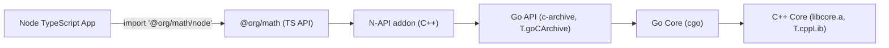

## TS + C++ + Go Web Library — Brainstorm (Single Logic Source, Multi-Targets)

This note sketches the cleanest path to ship a pure-logic library usable from:

- TypeScript (web, ESM, loads a Wasm artifact)
- Go (native library consuming the same logic via cgo)
- C++ (native library directly, mainly for tests/tooling)

The core requirement: reuse the same source files for logic (no platform/system calls), while staying consistent with our repository rules, build-tools/docs/build-system-design.md, and METHODOLOGY.XML.

### Goals and constraints

- One logic implementation, consumed by TS/Go/C++.
- Deterministic builds (Nix), precise invalidation (Buck), idempotent patching.
- Minimal surface area: no new provider shapes; keep Node importer-scoped providers intact.
- Small, readable, low-cyclomatic-complexity glue.

### Architectures at a glance

- `nodeTypescriptApp(nativeAddon(golang_code(cpp_code)))`
- `webTypescriptApp(wasm(golang_code(cpp_code)))`

A single TypeScript package (`@org/math`) exposes the same API for both environments:

1. The Node path wraps the Go layer (which itself wraps the C++ core) behind a Node N‑API addon.
2. The Web path wraps the same Go/C++ logic compiled to WebAssembly (via TinyGo + a minimal C wrapper).

Result: one logic codebase → two distributions with identical semantics.

### TS as the top‑level API (update)

To satisfy “TypeScript is the top‑level library for both distributions,” we publish a single package (e.g., `@org/math`) that exposes two runtime‑specific entrypoints with the same types and semantics:

- `@org/math/node` (native, Node): thin TS shim that `require()`s the built N‑API addon and re‑exports typed functions.
- `@org/math/browser` (web): thin TS ESM loader that fetches/instantiates `top.wasm` and re‑exports the same typed functions.
- `package.json` uses conditional exports so `import { add } from "@org/math"` resolves to the correct entrypoint by environment:

```json
{
  "name": "@org/math",
  "type": "module",
  "exports": {
    ".": {
      "browser": "./dist/browser/index.js",
      "node": "./dist/node/index.cjs",
      "default": "./artifacts/neutral/index.js"
    }
  },
  "types": "./dist/types/index.d.ts"
}
```

#### Diagram — Node path (TS → N‑API → Go(c‑archive) → C++)



#### Diagram — Web path (TS → Wasm → TinyGo(Go) → C wrapper → C++)

```mermaid
flowchart LR
  App["Web TypeScript App"]
  App -->|"import '@org/math/browser'"| UI["@org/math (TS API)"]
  UI --> W["WASM module: top.wasm"]
  subgraph W["top.wasm (TinyGo‑compiled Go + C wrapper + C++)"]
    GA["exported Go API (compiled to Wasm)"]
    GC["Go Core (TinyGo)"]
    CW["C wrapper (extern \"C\")"]
    Cpp["C++ Core (libcore_wasm.a)"]
    GA --> GC --> CW --> Cpp
  end
```

The “WASM module” box encapsulates the compiled Go code and the C++ core. The functions you import from `@org/math/browser` call the WebAssembly exports produced by the TinyGo‑compiled Go API; those in turn call into the Go core and then the C wrapper and C++ implementation.

If the build selects the `emscripten_dual` backend, the “WASM module” consists of two artifacts: a TinyGo‑built `top.wasm` that exports the Go API, and an Emscripten‑built `core_cpp_emscripten.{js,wasm}` that provides the C++ runtime. The browser loader initializes both and wires the Go API calls to the Emscripten module under the hood; the TS API remains unchanged.

### Target build modes (concrete)

1. Native Node addon (server-side Node, consumed via `@org/math/node`)

- Build the Go API layer (`go‑api`) as a C archive (`-buildmode=c-archive`) that internally uses cgo to call the C ABI of the C++ core (through the Go core layer).
- Build the C++ N‑API addon (`nix_cpp_node_addon`) and pass `nixCxxPkgs = [ goApiArchive, cppCoreLib ]` so the addon links both.
- The addon exports the Go API functions (via a small C++ shim that calls into the Go `extern "C"` exports). The TS entrypoint (`dist/node/index.(c)js`) `require()`s the built `.node` and re‑exports typed functions.

2. Browser Wasm (single module including Go+CPP via TinyGo, consumed via `@org/math/browser`)

- Use TinyGo to compile the Go API layer (`go‑api`) to Wasm (browser target). Go’s official js/wasm does not support cgo; TinyGo enables linking a C static lib.
- Expose the C++ core through a tiny C wrapper (extern "C"). Compile the C++ core and the C wrapper to a Wasm‑compatible static library (no syscalls).
- Link the C static library into the TinyGo build to produce a single `.wasm` that contains:
  - TinyGo‑compiled Go API layer (`go‑api`) and Go core (`go‑core`)
  - Linked C wrapper + C++ core logic
- A small ESM loader (`dist/browser/index.js`) instantiates the Wasm and re‑exports the same TS API as the Node entrypoint.

### Build system fit (Buck2 + Nix + Patching)

- Nix (determinism) builds all artifacts from the same sources:
  - Native C++ `.a` via `T.cppLib` (already available).
  - Node addon `.node` via `T.cppNodeAddon` (already available).
  - Go c-archive via `T.goCArchive` (already available).
  - Wasm `.wasm` builds via narrow additions (see next section).
- Buck2 orchestrates deps and impact:
  - Package-local patch directories included in `srcs` drive precise invalidation.
  - No new provider shapes; Node importer-scoped model unchanged.
- Patching UX:
  - Use package-local `patches/cpp/*.patch` and `patches/go/*.patch` (flat).
  - Reapply is idempotent; dev overrides warn locally and fail in CI (shared helpers already enforce this).

### Wasm toolchain options (web path)

- TinyGo (primary): compile the Go API layer to a browser-compatible Wasm; link in a C static library built from the C++ core (through a C wrapper).
  - C wrapper enforces a stable C ABI; no exceptions/RTTI across the boundary.
  - Keep the C++ build “no syscalls” and “no host I/O”; the Wasm should be pure compute.
- C/C++ to Wasm:
  - Prefer `wasm32-unknown-unknown` for a minimal runtime (no JS glue).
  - If needed, Emscripten can be used for advanced interop, but first iteration should stay minimal.

### Backend selection (developer toggle: TinyGo vs Emscripten)

We make the web backend selectable per build so teams can pick the best fit without changing consumers:

- tinygo_single (default)
  - One artifact: `top.wasm` (TinyGo Go API + Go core + C wrapper + C++).
  - Smallest payload, no JS glue, fastest cold starts. No POSIX threads/I/O; intended for pure compute.
- emscripten_dual (opt-in)
  - Two artifacts staged under the TS package:
    - `top.wasm` (TinyGo Go API + Go core) — same exported Go API surface
    - `core_cpp_emscripten.{js,wasm}` (C++ via Emscripten) — richer runtime (libc, Asyncify, ports)
  - The browser entrypoint loads both modules and bridges the Go API calls to the Emscripten module where needed.
  - Enables ports (SDL/OpenAL/zlib), Asyncify (cooperative blocking), and optional threads (with COOP/COEP).

Selection mechanism (proposed):

- Nix arg on the TS package rule and TinyGo template: `webWasmBackend = "tinygo_single" | "emscripten_dual"` (default: tinygo_single).
- Buck macros forward `webWasmBackend` to Nix.
- The TS browser loader reads a small generated manifest to decide whether to also load `core_cpp_emscripten.{js,wasm}` and route calls.

Note: The standard Go js/wasm toolchain does not support cgo, which is why TinyGo is chosen here for the combined Go+CPP browser module.

### Nix templates and macros (minimal additions; no new provider shapes)

- Extend `tools/nix/templates/cpp.nix` with `cppWasmStaticLib`:
  - Inputs: `srcRoot`, `subdir`, `includeDirs`, `exportHeader` (e.g., `addon.h`), optional `cWrapperSubdir`.
  - Toolchain: `clang --target=wasm32-unknown-unknown` (no syscalls), or `wasm32-wasi` behind a flag.
  - Output: `$out/lib/libcore_wasm.a` and `$out/include/addon.h`.
  - Apply patch/override guardrails like existing C++ templates.
- Add `goTinyWasmLib` (new go template):
  - Inputs: Go API module root, `pkgPath` for the exported package.
  - Links the above `libcore_wasm.a` (C wrapper + C++ core) to produce a single `top.wasm`.
  - Enforce the shared dev override semantics (warn local, fail CI).
- Add macros:
  - `nix_cpp_wasm_static_lib` → builds the C/C++ Wasm static lib.
  - `nix_go_tiny_wasm_lib` → builds the combined Wasm from Go+CPP.

No changes to exporter/provider flows; Node importer-scoped labels remain the same. The TS package will depend on the Wasm artifact via Buck deps but won’t introduce new provider kinds.

### Source layout (example)

```
libs/math-core/            # C++ core + C wrapper
  include/core/math.h
  include/addon.h          # extern "C" header (stable C ABI)
  src/core/math.cc
  src/cwrapper/addon.c     # C wrapper over the C++ core
  TARGETS                  # nix_cpp_lib & nix_cpp_wasm_lib
  patches/cpp/.keep

libs/math-go-core/         # Go core lib that wraps C ABI via cgo
  core/bridge.go           # cgo wrapper using addon.h
  go.mod, gomod2nix.toml   # locked via install-deps
  TARGETS                  # nix_go_library (depends on //libs/math-core:* native)
  patches/go/.keep

libs/math-api/             # Go API layer depending on go-core
  api/api.go               # public functions calling into go-core
  go.mod, gomod2nix.toml
  TARGETS                  # nix_go_library; also nix_go_carchive for native Node path
  patches/go/.keep

libs/math-native/          # Node N‑API addon (C++)
  include/*.h
  src/binding.cc           # calls exported C functions from go-top c-archive
  TARGETS                  # nix_cpp_node_addon (deps: //libs/math-go-top:carchive, //libs/math-core:lib)
  patches/cpp/.keep

libs/math-ts/              # Top-level TS package (single public API)
  src/browser/index.ts     # ESM loader → fetch/instantiate top.wasm; export { add }
  src/node/index.ts        # require('./native/math_native.node'); export { add }
  package.json             # conditional exports for node/browser
  dist/                    # built JS + staged artifacts (top.wasm, native addon)
  TARGETS                  # nix_node_lib (web depends on //libs/math-api:wasm; node depends on //libs/math-native:napi_addon)
```

### TypeScript ESM loader sketch

```ts
// libs/math-ts/src/index.ts
export async function loadWeb(): Promise<{ add(a: number, b: number): number }> {
  const res = await fetch(new URL("./top.wasm", import.meta.url));
  const { instance } = await WebAssembly.instantiateStreaming(res, {});
  const { add } = instance.exports as unknown as { add(a: number, b: number): number };
  return { add };
}

export function loadNode(): { add(a: number, b: number): number } {
  // Assuming the build copies the .node to a stable relative path
  // e.g., math-ts/native/math_native.node
  // Re-export the same API surface as the web path
  // eslint-disable-next-line @typescript-eslint/no-var-requires
  const addon = require("./native/math_native.node");
  return { add: addon.add as (a: number, b: number) => number };
}
```

The Buck/Nix wiring copies `top.wasm` into `dist/` for web and copies the `.node` into `native/` for Node. Keep loaders minimal and file-relative.

### Testing strategy (small, representative, cross-language)

- C++: optional gtest that exercises the native `.a` (fast compile sanity).
- Go: `go test` across both `math-go-base` (cgo wrapper) and `math-go-top`.
- TS (web): zx/vitest-based test that imports `loadWeb()`, instantiates Wasm, and validates function outputs.
- TS (node): zx/vitest-based test that imports `loadNode()` and calls into the addon.
  - Add one test per file (repo convention) so Buck controls parallelism.
  - Keep external timeouts for long `nix build` steps (repo convention).

### Consistency with build-tools/docs/build-system-design.md

- Buck remains the orchestrator (labels/impact), Nix performs hermetic builds.
- Patching remains package-local; dev overrides warn locally and fail in CI.
- Node importer-scoped providers are unchanged; no new provider shapes.
- Glue (if any) stays as zx TypeScript and is not committed.

### Consistency with METHODOLOGY.XML

- Architectural minimalism: one logic implementation in C++ with a tiny C ABI.
- Determinism: Nix templates build native/Wasm artifacts; `gomod2nix.toml` is maintained via `tools/bin/i`.
- Separation of concerns: C++ core, Go wrappers (base/top), and TS loaders are tiny and focused.
- Low complexity and file-size discipline: small templates/macros; short wrappers; tests per file.

### Incremental implementation plan (bite-sized)

1. Core library (C++)

- Add `libs/math-core` with `nix_cpp_lib` and package-local `patches/cpp/`.
- Add the C wrapper (`src/cwrapper/addon.c`).
- Optional gtest target for sanity.

2. Native Node path

- Add `libs/math-go-base` (cgo wrapper) and `libs/math-go-top` (public API).
- Build `//libs/math-go-top:carchive` via `T.goCArchive`.
- Add `libs/math-native` with `nix_cpp_node_addon`, passing `nixCxxPkgs = [ goTopCArchive, cppCoreLib ]`.
- Add a TS test that calls `loadNode()` and validates `add(2,3)=5`.

3. Web Wasm path

- Add `cppWasmStaticLib` template and `nix_cpp_wasm_static_lib` macro to produce `libcore_wasm.a` + headers.
- Add `goTinyWasmLib` template and `nix_go_tiny_wasm_lib` macro to produce `top.wasm` by linking the static lib.
- Add a TS test that imports `loadWeb()` and validates `add(2,3)=5`.

4. TS package

- Add `libs/math-ts` with a dual loader (web and node) and minimal staging rules to copy `.wasm` and `.node`.

5. CI & guardrails

- No provider/auto_map changes; existing prebuild-guard, exporter, and provider sync remain as-is.
- Ensure new templates honor `NIX_CPP_DEV_OVERRIDE_JSON` warnings/CI-fail semantics.

### Risks and mitigations

- Go js/wasm cgo limitation: standard Go cannot use cgo on js/wasm; using TinyGo enables static linking with a C static lib.
- Wasm portability quirks: prefer minimal, no-syscall builds; keep Emscripten as later opt-in only if truly needed.
- Loader paths in bundlers: start with file-relative ESM loader; document bundler configuration if required later.
- ABI drift: lock down `addon.h` as the only C boundary; test Go c-archive + Node addon, and TinyGo Wasm path.

### Acceptance (first iteration)

- Native Node: build `//libs/math-native:napi_addon` and call through `loadNode()` successfully.
- Web: build `.#…libs_math_ts` (or equivalent) that stages `top.wasm`; `loadWeb()` returns the correct result.
- Go: unit tests pass across `math-go-base` and `math-go-top`.
- No changes to provider shapes; full suite green via `i && b && v`.
